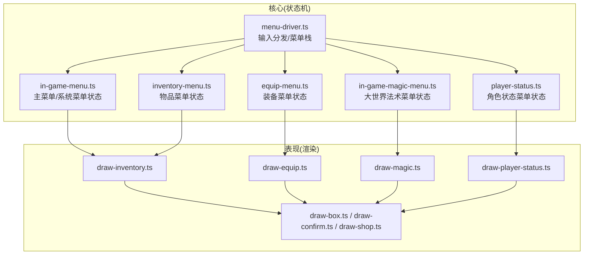
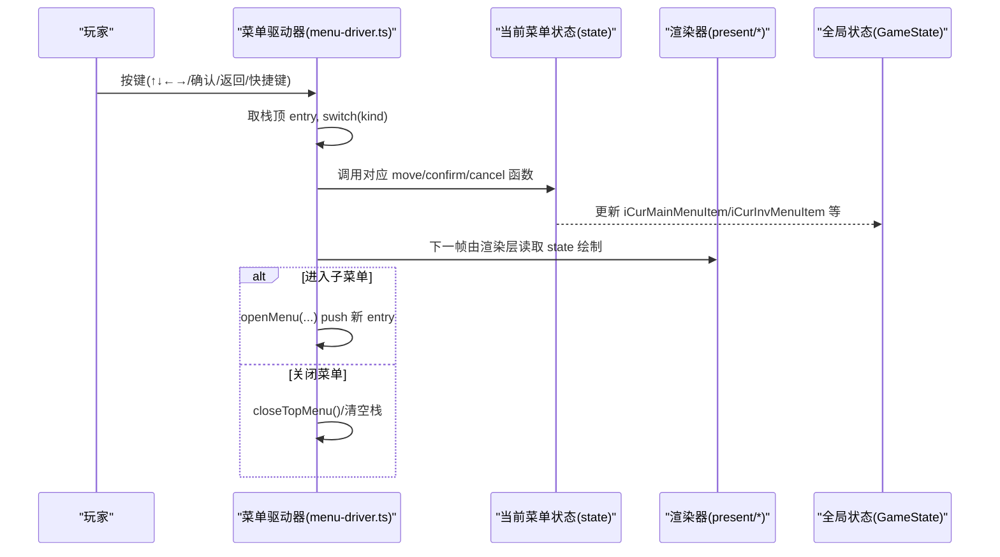
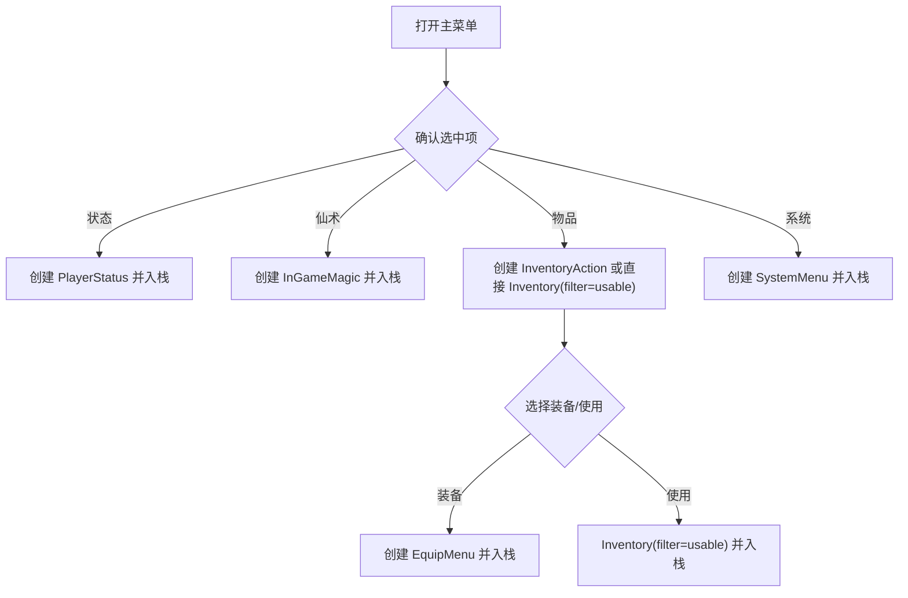
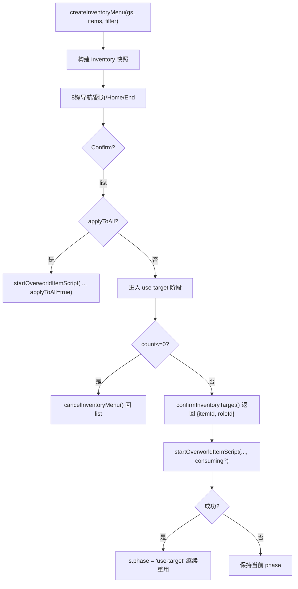
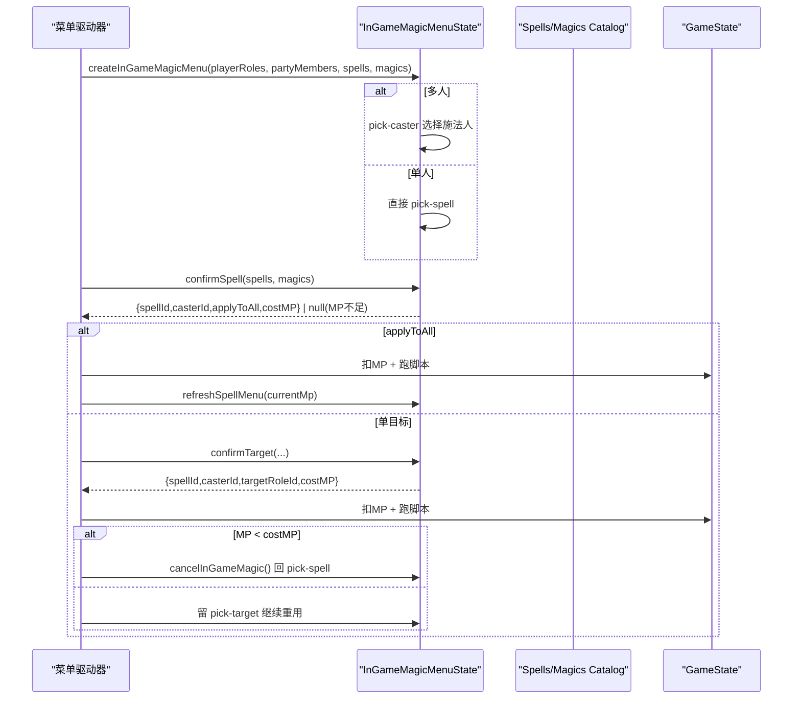
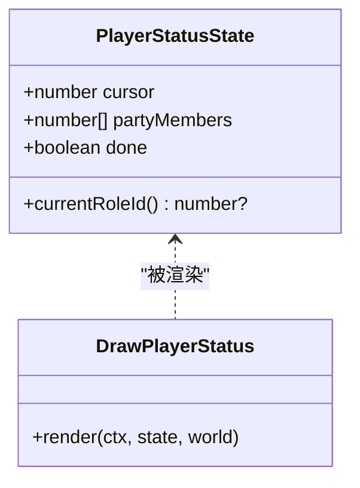
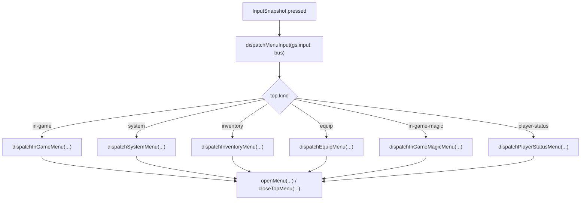
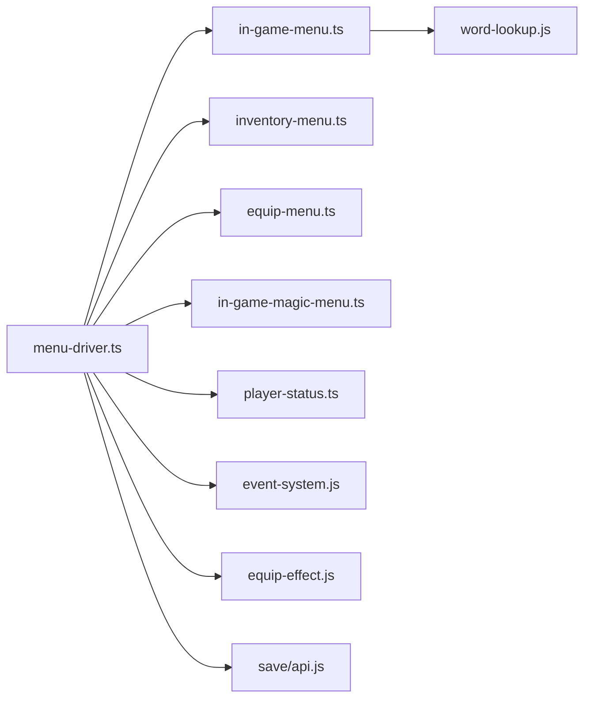

# 菜单系统

<cite>
**本文引用的文件**
- [menu-driver.ts](file://packages/game/src/core/menu/menu-driver.ts)
- [in-game-menu.ts](file://packages/game/src/core/menu/in-game-menu.ts)
- [inventory-menu.ts](file://packages/game/src/core/menu/inventory-menu.ts)
- [equip-menu.ts](file://packages/game/src/core/menu/equip-menu.ts)
- [in-game-magic-menu.ts](file://packages/game/src/core/menu/in-game-magic-menu.ts)
- [player-status.ts](file://packages/game/src/core/menu/player-status.ts)
- [draw-inventory.ts](file://packages/game/src/present/menu/draw-inventory.ts)
- [draw-equip.ts](file://packages/game/src/present/menu/draw-equip.ts)
- [draw-magic.ts](file://packages/game/src/present/menu/draw-magic.ts)
- [draw-player-status.ts](file://packages/game/src/present/menu/draw-player-status.ts)
- [draw-box.ts](file://packages/game/src/present/menu/draw-box.ts)
- [draw-confirm.ts](file://packages/game/src/present/menu/draw-confirm.ts)
- [draw-shop.ts](file://packages/game/src/present/menu/draw-shop.ts)
- [plan.md](file://docs/phase2/menu/plan.md)
</cite>

## 目录
1. [简介](#简介)
2. [项目结构](#项目结构)
3. [核心组件](#核心组件)
4. [架构总览](#架构总览)
5. [详细组件分析](#详细组件分析)
6. [依赖关系分析](#依赖关系分析)
7. [性能与体验优化](#性能与体验优化)
8. [故障排查指南](#故障排查指南)
9. [结论](#结论)
10. [附录：扩展与示例](#附录扩展与示例)

## 简介
本文件为 Type-Pal 的“菜单系统”技术文档，聚焦以下目标：
- 主菜单设计：层级结构、导航逻辑、用户交互处理
- 物品管理界面：列表渲染、筛选、操作反馈
- 法术选择界面：分类、消耗检查、目标选择机制
- 状态查看界面：角色属性显示、装备信息、状态效果展示
- 菜单驱动器：菜单栈、焦点控制、键盘输入处理
- 扩展指导：如何添加新菜单项、自定义布局、实现特殊交互
- 用户体验与可访问性建议

## 项目结构
Type-Pal 第一阶段（忠实还原）的菜单系统位于 packages/game/src/core/menu 与 present/menu 两个层次：
- core/menu：纯状态机与输入路由（无 DOM/Canvas 依赖），负责状态转换、焦点移动、确认/取消语义
- present/menu：渲染层，按 state 绘制 UI（九宫格框、列表、确认框等）

图表来源
- [menu-driver.ts:209-248](file://packages/game/src/core/menu/menu-driver.ts#L209-L248)
- [in-game-menu.ts:49-97](file://packages/game/src/core/menu/in-game-menu.ts#L49-L97)
- [inventory-menu.ts:114-154](file://packages/game/src/core/menu/inventory-menu.ts#L114-L154)
- [equip-menu.ts:43-51](file://packages/game/src/core/menu/equip-menu.ts#L43-L51)
- [in-game-magic-menu.ts:64-106](file://packages/game/src/core/menu/in-game-magic-menu.ts#L64-L106)
- [player-status.ts:31-33](file://packages/game/src/core/menu/player-status.ts#L31-L33)

章节来源
- [menu-driver.ts:1-120](file://packages/game/src/core/menu/menu-driver.ts#L1-L120)
- [in-game-menu.ts:1-48](file://packages/game/src/core/menu/in-game-menu.ts#L1-L48)

## 核心组件
- 菜单驱动器（menu-driver.ts）
  - 维护 menuStack，每帧从栈顶取出 ActiveMenuEntry，按 kind 分派到对应 dispatcher
  - 提供快捷键直达子菜单（E/W/F/S）、注入 catalog（items/spells/magics/playerRoles）
  - 与系统回调解耦（开始游戏、退出、读档通过 set*Handler 注入）
- 主菜单与系统菜单（in-game-menu.ts）
  - InGameMenuState：四项（状态/仙术/物品/系统），基于 SelectionMenuState
  - SystemMenuState：存档/读档/音乐/音效/退出；支持 confirm/switch 阶段
- 物品菜单（inventory-menu.ts）
  - 全屏网格，8 键导航，filter 仅影响颜色与可用性判定
  - use-target 阶段记忆上次队员光标
- 装备菜单（equip-menu.ts）
  - 复用 InventoryMenuState 做列表；pick-role 阶段循环换装链
- 大世界法术菜单（in-game-magic-menu.ts）
  - pick-caster → pick-spell → (可选)pick-target；支持 applyToAll 与 MP 不足回退
- 角色状态（player-status.ts）
  - 单屏整布局遍历队员，越界或 Menu 退出

章节来源
- [menu-driver.ts:82-147](file://packages/game/src/core/menu/menu-driver.ts#L82-L147)
- [in-game-menu.ts:49-97](file://packages/game/src/core/menu/in-game-menu.ts#L49-L97)
- [inventory-menu.ts:93-154](file://packages/game/src/core/menu/inventory-menu.ts#L93-L154)
- [equip-menu.ts:28-51](file://packages/game/src/core/menu/equip-menu.ts#L28-L51)
- [in-game-magic-menu.ts:39-106](file://packages/game/src/core/menu/in-game-magic-menu.ts#L39-L106)
- [player-status.ts:19-33](file://packages/game/src/core/menu/player-status.ts#L19-L33)

## 架构总览
菜单系统采用“状态机 + 输入分发 + 渲染分离”的三层模式。核心流程如下：

图表来源
- [menu-driver.ts:209-248](file://packages/game/src/core/menu/menu-driver.ts#L209-L248)
- [in-game-menu.ts:65-72](file://packages/game/src/core/menu/in-game-menu.ts#L65-L72)
- [inventory-menu.ts:219-252](file://packages/game/src/core/menu/inventory-menu.ts#L219-L252)
- [in-game-magic-menu.ts:169-195](file://packages/game/src/core/menu/in-game-magic-menu.ts#L169-L195)

## 详细组件分析

### 主菜单与系统菜单
- 主菜单（InGameMenu）
  - 选项顺序：状态/仙术/物品/系统
  - 确认跳转：
    - 状态 → player-status
    - 仙术 → in-game-magic
    - 物品 → inventory-action（再入 equip/use）或直接 inventory(filter='usable')
    - 系统 → system
- 系统菜单（SystemMenu）
  - 选项：存档/读档/音乐/音效/退出
  - 二次确认（退出）与开关切换（音乐/音效）两阶段
  - 选否/取消时直接关闭整个菜单栈（对齐 sdlpal 行为）

图表来源
- [menu-driver.ts:400-439](file://packages/game/src/core/menu/menu-driver.ts#L400-L439)
- [in-game-menu.ts:49-97](file://packages/game/src/core/menu/in-game-menu.ts#L49-L97)
- [menu-driver.ts:544-580](file://packages/game/src/core/menu/menu-driver.ts#L544-L580)

章节来源
- [in-game-menu.ts:28-47](file://packages/game/src/core/menu/in-game-menu.ts#L28-L47)
- [menu-driver.ts:400-439](file://packages/game/src/core/menu/menu-driver.ts#L400-L439)

### 物品管理界面
- 列表渲染
  - 全量库存快照，filter 仅改变颜色与可用性判定（不可用项红色显示）
  - 列数/行数/文本宽度常量来自 sdlpal 真值
- 筛选功能
  - filter=all/equip/usable 三种
  - usable 入口额外把全队装备槽中本身可用的装备追加进列表（amount=0 也可选）
- 操作反馈
  - 确认使用：若 applyToAll 则直接跑脚本并消费；否则进入 use-target 阶段选目标
  - 每帧刷新 inventory snapshot，保证 count 实时一致
  - 用完自动 cancel 回 list

图表来源
- [inventory-menu.ts:114-154](file://packages/game/src/core/menu/inventory-menu.ts#L114-L154)
- [inventory-menu.ts:219-275](file://packages/game/src/core/menu/inventory-menu.ts#L219-L275)
- [menu-driver.ts:584-674](file://packages/game/src/core/menu/menu-driver.ts#L584-L674)

章节来源
- [inventory-menu.ts:43-91](file://packages/game/src/core/menu/inventory-menu.ts#L43-L91)
- [inventory-menu.ts:114-154](file://packages/game/src/core/menu/inventory-menu.ts#L114-L154)
- [inventory-menu.ts:219-275](file://packages/game/src/core/menu/inventory-menu.ts#L219-L275)
- [menu-driver.ts:584-674](file://packages/game/src/core/menu/menu-driver.ts#L584-L674)

### 法术选择界面
- 分类与可用范围
  - 仅过滤 usableOutsideBattle 的法术
  - 单人队伍跳过施法人选择，直接进入法术列表
- 消耗检查
  - buildSpellMenu 根据 currentMp 计算 disabled 状态
  - refreshSpellMenu 在 MP 变化后重建菜单并恢复上次选中
- 目标选择机制
  - single-target 进入 pick-target；applyToAll 直接执行
  - MP 不足时 cancel 回到 pick-spell

图表来源
- [in-game-magic-menu.ts:64-106](file://packages/game/src/core/menu/in-game-magic-menu.ts#L64-L106)
- [in-game-magic-menu.ts:128-160](file://packages/game/src/core/menu/in-game-magic-menu.ts#L128-L160)
- [in-game-magic-menu.ts:169-222](file://packages/game/src/core/menu/in-game-magic-menu.ts#L169-L222)
- [in-game-magic-menu.ts:225-240](file://packages/game/src/core/menu/in-game-magic-menu.ts#L225-L240)

章节来源
- [in-game-magic-menu.ts:39-106](file://packages/game/src/core/menu/in-game-magic-menu.ts#L39-L106)
- [in-game-magic-menu.ts:169-222](file://packages/game/src/core/menu/in-game-magic-menu.ts#L169-L222)

### 状态查看界面
- 一屏整布局：头像、装备槽、等级/经验/HP/MP、五维属性、毒素行、角色名
- 通过 cursor 遍历 partyMembers；越界或 Menu 退出即关闭
- 数据驱动：渲染层按 state.cursor 拉取对应角色数据

图表来源
- [player-status.ts:19-59](file://packages/game/src/core/menu/player-status.ts#L19-L59)
- [draw-player-status.ts](file://packages/game/src/present/menu/draw-player-status.ts)

章节来源
- [player-status.ts:31-59](file://packages/game/src/core/menu/player-status.ts#L31-L59)

### 菜单驱动器的状态管理
- 菜单栈
  - openMenu(...) 压栈；closeTopMenu()/gs.menuStack=[] 弹栈或清栈
  - 快捷键直达：E/W/F/S 分别打开物品/装备/法术/状态
- 焦点控制
  - 各菜单内部维护 selection.cursor/grid cursor/targetCursor
  - 全局记忆：iCurMainMenuItem、iCurInvMenuItem、iCurSystemMenuItem、iCurInvActionMenuItem
- 键盘输入处理
  - dispatchMenuInput 按 top.kind 分发到具体 dispatcher
  - 每个 dispatcher 将 pressed 映射到 move/confirm/cancel 函数

图表来源
- [menu-driver.ts:209-248](file://packages/game/src/core/menu/menu-driver.ts#L209-L248)
- [menu-driver.ts:400-439](file://packages/game/src/core/menu/menu-driver.ts#L400-L439)
- [menu-driver.ts:443-530](file://packages/game/src/core/menu/menu-driver.ts#L443-L530)
- [menu-driver.ts:584-674](file://packages/game/src/core/menu/menu-driver.ts#L584-L674)
- [menu-driver.ts:691-770](file://packages/game/src/core/menu/menu-driver.ts#L691-L770)
- [menu-driver.ts:779-800](file://packages/game/src/core/menu/menu-driver.ts#L779-L800)

章节来源
- [menu-driver.ts:82-147](file://packages/game/src/core/menu/menu-driver.ts#L82-L147)
- [menu-driver.ts:209-248](file://packages/game/src/core/menu/menu-driver.ts#L209-L248)

## 依赖关系分析
- 模块内聚与耦合
  - core/menu 各文件职责清晰：单一菜单状态机，低耦合
  - menu-driver.ts 作为中心分发器，集中处理跨菜单的副作用（catalog 注入、handler 注入）
- 外部依赖
  - shared：Item/Magic/Spell/PlayerRoles 类型
  - event-system/equip-effect/save/api：用于运行脚本、装备交换、存档
  - word-lookup：菜单文案查找
- 潜在循环依赖
  - 通过 setStartGameHandler/setLoadGameHandler/setSystemQuitHandler 解耦，避免 bootstrap 与 menu-driver 互相 import

图表来源
- [menu-driver.ts:1-22](file://packages/game/src/core/menu/menu-driver.ts#L1-L22)
- [in-game-menu.ts:12](file://packages/game/src/core/menu/in-game-menu.ts#L12)

章节来源
- [menu-driver.ts:1-22](file://packages/game/src/core/menu/menu-driver.ts#L1-L22)
- [in-game-menu.ts:12](file://packages/game/src/core/menu/in-game-menu.ts#L12)

## 性能与体验优化
- 渲染优化
  - 列表/网格仅在必要时重建（如装备 swap 后刷新背包快照）
  - 九宫格框原语统一，减少素材拼接复杂度
- 交互优化
  - 记忆光标（施法人、目标队员、上次系统菜单项）提升连续操作效率
  - 大列表分页/翻页/Home/End 快速定位
- 可访问性建议
  - 高对比度与闪烁提示（已实现选中闪烁色）
  - 键盘无障碍：方向键/回车/ESC 完整覆盖
  - 文字可读性：固定字号与阴影描边（渲染层实现）

[本节为通用指导，不直接分析具体文件]

## 故障排查指南
- 菜单未弹出或无法关闭
  - 检查 menuStack 是否为空；确认 openMenu/closeTopMenu 是否成对调用
  - 快捷键直达路径是否正确（E/W/F/S）
- 物品数量不减少
  - 确认每帧是否刷新 inventory snapshot（createInventoryMenu 重算）
  - 确认 scriptOnUse 的 consuming 标志与 startOverworldItemScript 返回值
- 法术 MP 不足仍允许释放
  - 检查 buildSpellMenu 的 currentMp 传入与 refreshSpellMenu 调用时机
- 装备换装后列表异常
  - 确认 scriptOnEquip 执行后是否刷新 s.list（createInventoryMenuRefresh）

章节来源
- [menu-driver.ts:584-674](file://packages/game/src/core/menu/menu-driver.ts#L584-L674)
- [menu-driver.ts:691-770](file://packages/game/src/core/menu/menu-driver.ts#L691-L770)
- [in-game-magic-menu.ts:128-160](file://packages/game/src/core/menu/in-game-magic-menu.ts#L128-L160)

## 结论
Type-Pal 的菜单系统以“状态机 + 输入分发 + 渲染分离”为核心，严格对齐 sdlpal 行为。通过统一的输入路由与清晰的菜单状态定义，实现了主菜单、物品、装备、法术与状态查看的完整闭环。后续可在现有框架上平滑扩展更多子菜单与交互。

[本节为总结，不直接分析具体文件]

## 附录：扩展与示例

### 添加新菜单项（主菜单）
- 在 in-game-menu.ts 的 IN_GAME_LABELS 中添加一项（id/choice/fallback）
- 在 menu-driver.ts 的 dispatchInGameMenu 的 choice 分支中增加 openMenu(...) 逻辑
- 如需持久化上次选择位置，更新 gs.iCurMainMenuItem

章节来源
- [in-game-menu.ts:28-47](file://packages/game/src/core/menu/in-game-menu.ts#L28-L47)
- [menu-driver.ts:400-439](file://packages/game/src/core/menu/menu-driver.ts#L400-L439)

### 自定义界面布局（九宫格框与背景）
- 使用 draw-box.ts 提供的切片框原语绘制任意尺寸框
- 背景图在 present 层加载并铺满（参考 plan 中的资源落位与渲染步骤）

章节来源
- [draw-box.ts](file://packages/game/src/present/menu/draw-box.ts)
- [plan.md:304-386](file://docs/phase2/menu/plan.md#L304-L386)

### 实现特殊交互逻辑（例如商店购买）
- 在 menu-driver.ts 新增 shop-buy/shop-sell 的 dispatcher
- 使用 confirm 阶段的双框（draw-confirm.ts）进行 Yes/No 确认
- 交易成功后刷新相关列表（如 sell grid）

章节来源
- [menu-driver.ts:256-309](file://packages/game/src/core/menu/menu-driver.ts#L256-L309)
- [menu-driver.ts:317-359](file://packages/game/src/core/menu/menu-driver.ts#L317-L359)
- [draw-confirm.ts](file://packages/game/src/present/menu/draw-confirm.ts)
- [draw-shop.ts](file://packages/game/src/present/menu/draw-shop.ts)