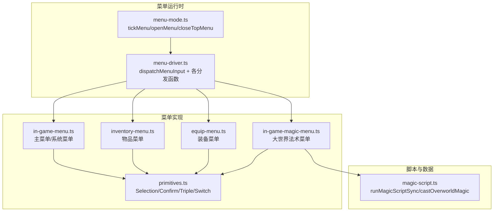
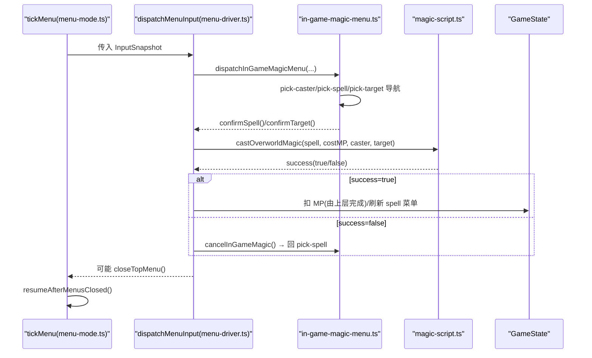
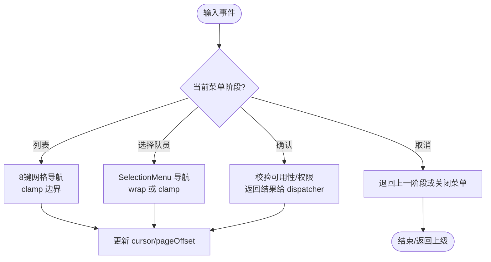
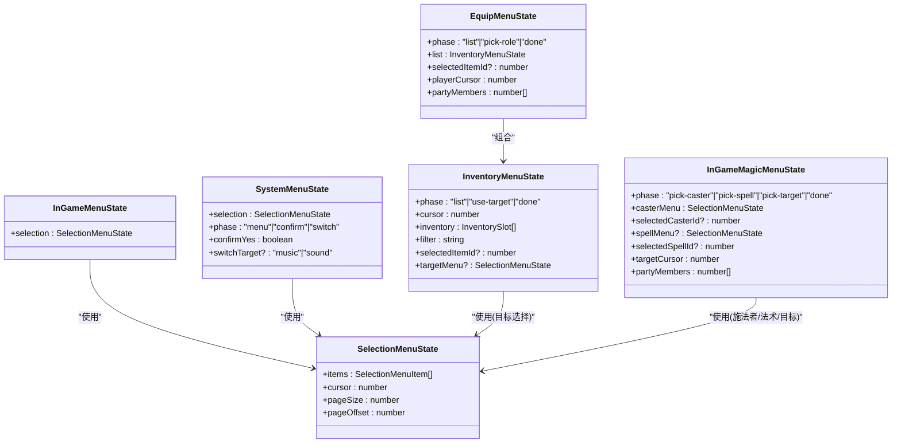
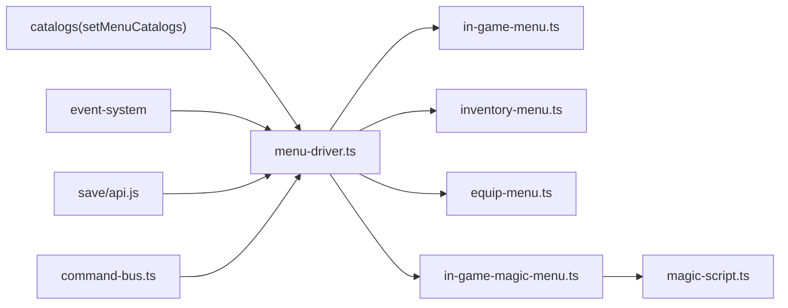

# 菜单驱动器

<cite>
**本文引用的文件**   
- [menu-driver.ts](file://packages/game/src/core/menu/menu-driver.ts)
- [menu-mode.ts](file://packages/game/src/core/menu/menu-mode.ts)
- [in-game-menu.ts](file://packages/game/src/core/menu/in-game-menu.ts)
- [inventory-menu.ts](file://packages/game/src/core/menu/inventory-menu.ts)
- [equip-menu.ts](file://packages/game/src/core/menu/equip-menu.ts)
- [in-game-magic-menu.ts](file://packages/game/src/core/menu/in-game-magic-menu.ts)
- [magic-script.ts](file://packages/game/src/core/menu/magic-script.ts)
- [primitives.ts](file://packages/game/src/core/menu/primitives.ts)
</cite>

## 目录
1. [简介](#简介)
2. [项目结构](#项目结构)
3. [核心组件](#核心组件)
4. [架构总览](#架构总览)
5. [详细组件分析](#详细组件分析)
6. [依赖关系分析](#依赖关系分析)
7. [性能考量](#性能考量)
8. [故障排查指南](#故障排查指南)
9. [结论](#结论)
10. [附录](#附录)

## 简介
本文件系统性阐述 Type-Pal 的“菜单驱动器”子系统，聚焦以下目标：
- 输入分发与焦点管理：解释 dispatchMenuInput 如何解析输入事件、选择菜单项并执行动作。
- 焦点系统与导航：说明光标位置计算、边界检测与循环导航的实现机制。
- 命令处理流程：覆盖确认/取消/特殊动作（如商店购买/卖出、装备交换、法术施放）的处理路径。
- 与命令总线集成：说明命令生成、事件发布与状态同步方式。
- 扩展指南：提供自定义菜单项、复杂交互逻辑与功能扩展的实践建议。
- 错误处理与调试：给出常见问题的定位方法与排障技巧。

## 项目结构
菜单系统采用“驱动 + 模式 + 子菜单状态机”的分层组织：
- menu-mode.ts：负责菜单模式切换、菜单栈操作与关闭后的恢复策略。
- menu-driver.ts：作为输入分发中心，按当前栈顶菜单类型路由到对应处理器。
- in-game-menu.ts / inventory-menu.ts / equip-menu.ts / in-game-magic-menu.ts：各菜单的状态机与输入处理。
- primitives.ts：通用选择框、确认框等基础 UI 原语。
- magic-script.ts：大世界法术脚本同步执行器（HP/MP 增减、复活等）。

图表来源
- [menu-mode.ts:18-63](file://packages/game/src/core/menu/menu-mode.ts#L18-L63)
- [menu-driver.ts:208-248](file://packages/game/src/core/menu/menu-driver.ts#L208-L248)
- [in-game-menu.ts:49-130](file://packages/game/src/core/menu/in-game-menu.ts#L49-L130)
- [inventory-menu.ts:114-154](file://packages/game/src/core/menu/inventory-menu.ts#L114-L154)
- [equip-menu.ts:43-51](file://packages/game/src/core/menu/equip-menu.ts#L43-L51)
- [in-game-magic-menu.ts:64-106](file://packages/game/src/core/menu/in-game-magic-menu.ts#L64-L106)
- [magic-script.ts:118-248](file://packages/game/src/core/menu/magic-script.ts#L118-L248)

章节来源
- [menu-mode.ts:18-63](file://packages/game/src/core/menu/menu-mode.ts#L18-L63)
- [menu-driver.ts:208-248](file://packages/game/src/core/menu/menu-driver.ts#L208-L248)

## 核心组件
- 菜单模式与栈
  - tickMenu：每帧调用，若菜单栈为空则根据上下文恢复 explore/battle/event 模式；否则将输入分发给栈顶菜单。
  - openMenu/closeTopMenu：push/pop 菜单栈并切换 gs.mode='menu'。
- 输入分发器
  - dispatchMenuInput：读取栈顶 ActiveMenuEntry.kind，switch 到具体分发函数（opening/in-game/system/inventory/equip/in-game-magic/player-status/save-slot/shop-buy/shop-sell）。
- 菜单状态机
  - 每个菜单维护 phase 与相关 SelectionMenuState，统一通过 primitives.ts 提供的 move/page/home/end 等函数更新光标与可见页。
- 大世界快捷键直达
  - openOverworldShortcutMenu：从大世界直接打开物品/装备/法术/状态子菜单，跳过中间层级。
- 外部回调注入
  - setStartGameHandler/setSystemQuitHandler/setLoadGameHandler：由 bootstrap 注入，避免跨层耦合。

章节来源
- [menu-mode.ts:18-63](file://packages/game/src/core/menu/menu-mode.ts#L18-L63)
- [menu-driver.ts:129-147](file://packages/game/src/core/menu/menu-driver.ts#L129-L147)
- [menu-driver.ts:208-248](file://packages/game/src/core/menu/menu-driver.ts#L208-L248)

## 架构总览
下图展示一次完整的大世界法术施放流程（含菜单导航、脚本执行与状态同步）：

图表来源
- [menu-mode.ts:18-63](file://packages/game/src/core/menu/menu-mode.ts#L18-L63)
- [menu-driver.ts:779-800](file://packages/game/src/core/menu/menu-driver.ts#L779-L800)
- [in-game-magic-menu.ts:169-222](file://packages/game/src/core/menu/in-game-magic-menu.ts#L169-L222)
- [magic-script.ts:230-248](file://packages/game/src/core/menu/magic-script.ts#L230-L248)

## 详细组件分析

### 输入分发与 dispatchMenuInput
- 职责
  - 读取 gs.menuStack 栈顶 entry，按 kind 路由到具体分发函数。
  - 对每个菜单，将 InputSnapshot.pressed 映射为状态机函数（移动/翻页/确认/取消）。
- 关键行为
  - 支持多类菜单：opening/in-game/system/inventory-action/inventory/equip/in-game-magic/player-status/save-slot/shop-buy/shop-sell。
  - 在部分菜单中，dispatcher 会直接修改全局记忆（如 iCurInvMenuItem/iCurMainMenuItem/iCurSystemMenuItem），以对齐 sdlpal 真值。
- 与命令总线
  - 当前菜单分发函数签名包含 bus: CommandBus，但多数菜单内部不直接使用 bus，而是通过 event-system 或 GameState 变更来驱动后续流程。

章节来源
- [menu-driver.ts:208-248](file://packages/game/src/core/menu/menu-driver.ts#L208-L248)

### 焦点系统与导航控制
- 通用选择框（primitives.ts）
  - createSelectionMenu：初始化 items、cursor、pageSize、pageOffset，并确保光标可见。
  - moveSelectionUp/Down：逐项 ±1 环绕，允许停在 disabled 项上（视觉灰显，确认时由各菜单自行拦截）。
  - pageUp/PageDown：跳到上一页/下一页首个可选项，越界归首/末项。
  - ensureCursorVisible：保证 cursor 在当前可视页内。
- 物品菜单（inventory-menu.ts）
  - 网格布局：INV_ITEMS_PER_LINE=3，INV_LINES_PER_PAGE=7。
  - 8 键导航：上下跨行、左右跨列、PgUp/PgDn 整屏、Home/End 首尾。
  - 光标 clamp：[0, length-1]，不 wrap。
  - use-target 阶段：复用 SelectionMenuState 选目标队员，默认光标持久化（模块级静态变量）。
- 装备菜单（equip-menu.ts）
  - list 阶段复用 InventoryMenuState；pick-role 阶段 Up/Left/Down/Right 循环切换队员。
- 法术菜单（in-game-magic-menu.ts）
  - pick-caster：活人可选，死人 disabled。
  - pick-spell：3×5 网格，支持 PgUp/PgDn/Home/End。
  - pick-target：单目标法术进入该阶段，边界不 wrap。

图表来源
- [primitives.ts:50-128](file://packages/game/src/core/menu/primitives.ts#L50-L128)
- [inventory-menu.ts:167-215](file://packages/game/src/core/menu/inventory-menu.ts#L167-L215)
- [equip-menu.ts:89-111](file://packages/game/src/core/menu/equip-menu.ts#L89-L111)
- [in-game-magic-menu.ts:256-306](file://packages/game/src/core/menu/in-game-magic-menu.ts#L256-L306)

章节来源
- [primitives.ts:50-128](file://packages/game/src/core/menu/primitives.ts#L50-L128)
- [inventory-menu.ts:167-215](file://packages/game/src/core/menu/inventory-menu.ts#L167-L215)
- [equip-menu.ts:89-111](file://packages/game/src/core/menu/equip-menu.ts#L89-L111)
- [in-game-magic-menu.ts:256-306](file://packages/game/src/core/menu/in-game-magic-menu.ts#L256-L306)

### 菜单命令处理流程
- 确认操作
  - 物品菜单：list→use-target→执行脚本；applyToAll 直接跑脚本并消耗；单目标先选目标再跑脚本，成功后保持 use-target 以便重用。
  - 装备菜单：list→pick-role→校验可装备性→运行 scriptOnEquip（opcode 0x18 做 swap）→更新 selectedItemId 与列表快照。
  - 法术菜单：pick-caster→pick-spell→(applyToAll 或 pick-target)→runner 执行脚本→成功则扣 MP 并决定是否继续。
- 取消返回
  - 不同菜单的 Menu 键语义略有差异：有的仅退回上一阶段，有的直接关闭整个菜单栈（例如系统菜单退出二次确认“否”）。
- 特殊动作
  - 商店购买/卖出：shop/sell 分发器处理 confirm 两框（是/否），确认后调整现金与库存，卖后刷新 sell grid。
  - 大世界快捷键直达：openOverworldShortcutMenu 直接 push 子菜单，跳过中间层。

章节来源
- [menu-driver.ts:256-359](file://packages/game/src/core/menu/menu-driver.ts#L256-L359)
- [menu-driver.ts:584-674](file://packages/game/src/core/menu/menu-driver.ts#L584-L674)
- [menu-driver.ts:691-770](file://packages/game/src/core/menu/menu-driver.ts#L691-L770)
- [menu-driver.ts:779-800](file://packages/game/src/core/menu/menu-driver.ts#L779-L800)

### 与命令总线集成
- 接口契约
  - 分发函数签名包含 bus: CommandBus，便于未来扩展基于命令的事件发布。
- 现状
  - 当前菜单逻辑主要通过 event-system 与 GameState 变更驱动（如 startOverworldItemScript、addItemToInventory、runEquipScript 等），未直接消费 bus。
- 建议
  - 对于需要跨层通知的动作（如音效播放、UI 提示、动画触发），可在 dispatcher 中通过 bus 发布命令，再由 shell 层订阅执行。

章节来源
- [menu-driver.ts:208-248](file://packages/game/src/core/menu/menu-driver.ts#L208-L248)

### 代码级类图（菜单状态与交互）

图表来源
- [in-game-menu.ts:49-130](file://packages/game/src/core/menu/in-game-menu.ts#L49-L130)
- [inventory-menu.ts:101-154](file://packages/game/src/core/menu/inventory-menu.ts#L101-L154)
- [equip-menu.ts:30-51](file://packages/game/src/core/menu/equip-menu.ts#L30-L51)
- [in-game-magic-menu.ts:41-106](file://packages/game/src/core/menu/in-game-magic-menu.ts#L41-L106)
- [primitives.ts:23-68](file://packages/game/src/core/menu/primitives.ts#L23-L68)

## 依赖关系分析
- 低耦合高内聚
  - 各菜单状态机只关注自身输入与状态迁移，通过 dispatcher 解耦。
  - 通用导航能力下沉至 primitives.ts，减少重复实现。
- 外部依赖
  - catalog 注入：setMenuCatalogs 在启动时注入 items/spells/playerRoles，避免在 tick 中传递参数。
  - 事件系统：startOverworldItemScript/runEquipScript 等通过事件系统执行脚本与副作用。
  - 保存/加载：通过 setLoadGameHandler 注入，避免循环依赖。
- 潜在风险
  - 模块级静态变量（如 sSelectedItemTargetSlot、sLastCasterCursor）需确保在多实例场景下正确重置（测试环境已提供 reset 辅助）。

图表来源
- [menu-driver.ts:82-119](file://packages/game/src/core/menu/menu-driver.ts#L82-L119)
- [menu-driver.ts:158-205](file://packages/game/src/core/menu/menu-driver.ts#L158-L205)
- [menu-driver.ts:208-248](file://packages/game/src/core/menu/menu-driver.ts#L208-L248)

章节来源
- [menu-driver.ts:82-119](file://packages/game/src/core/menu/menu-driver.ts#L82-L119)
- [menu-driver.ts:158-205](file://packages/game/src/core/menu/menu-driver.ts#L158-L205)

## 性能考量
- 每帧重建必要快照
  - 物品菜单每帧 refresh inventory snapshot，确保数量变化即时反映。
- 光标与分页
  - 使用 clamp 与 ensureCursorVisible 避免越界与重绘抖动。
- 脚本执行限制
  - 法术脚本 runner 设置 SCRIPT_TICK_LIMIT，防止死循环导致卡顿。
- 最小化状态拷贝
  - 仅在必要时复制 partyMembers/items 快照，避免频繁 GC。

## 故障排查指南
- 常见问题
  - 菜单打开后无响应：检查 tickMenu 是否被调用、gs.mode 是否为 'menu'、menuStack 是否为空。
  - 光标异常：核对各菜单的 clamp/wrap 逻辑是否与 sdlpal 一致；确认 pageOffset 是否正确更新。
  - 法术不扣 MP：确认 runMagicScriptSync 返回值（success）与上层扣 MP 条件是否匹配。
  - 商店购买失败：确认 cash 足够、item 存在且价格判定逻辑正确。
- 调试技巧
  - 在 dispatcher 入口打印 top.kind 与 input.pressed 集合，快速定位分支。
  - 对关键 state 变更（cursor、phase、selectedItemId）加断点或日志。
  - 使用 _reset*ForTest 辅助方法清理模块级 handler/catalogs，保证单测隔离。

章节来源
- [menu-mode.ts:18-63](file://packages/game/src/core/menu/menu-mode.ts#L18-L63)
- [menu-driver.ts:208-248](file://packages/game/src/core/menu/menu-driver.ts#L208-L248)
- [magic-script.ts:118-248](file://packages/game/src/core/menu/magic-script.ts#L118-L248)

## 结论
菜单驱动器通过清晰的“模式+栈+状态机”分层，实现了稳定可靠的输入分发与导航控制。借助 primitives 抽象与 catalog 注入，系统在可扩展性与可测试性之间取得良好平衡。未来可在 dispatcher 中引入命令总线进行更细粒度的跨层通信，同时继续保持状态机的纯函数风格与严格边界检测。

## 附录
- 自定义菜单项实践要点
  - 新增菜单 kind：在 dispatchMenuInput 的 switch 中添加分支，并实现对应分发函数。
  - 定义状态机：在独立文件中维护 phase 与 SelectionMenuState，复用 primitives 的导航函数。
  - 接入 catalog：通过 requireCatalogs().items/spells/playerRoles 获取元数据。
  - 处理确认/取消：明确 Menu 键语义（退回/关闭），并在 dispatcher 中处理 closeTopMenu 与 mode 恢复。
  - 与事件系统集成：如需执行脚本或改变游戏状态，调用 event-system 或修改 GameState。
- 复杂交互示例思路
  - 多阶段选择：参考 in-game-magic-menu 的 pick-caster→pick-spell→pick-target 三阶段流转。
  - 列表+详情：参考 inventory-menu 的 list→use-target 双阶段，配合 refresh 与持久化光标。
  - 二次确认：参考 system-menu 的 confirm 阶段，方向键 toggle 是/否，Menu 取消语义清晰。