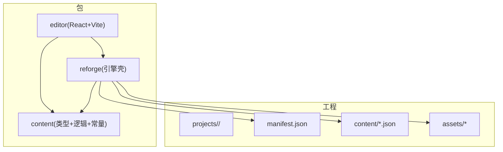
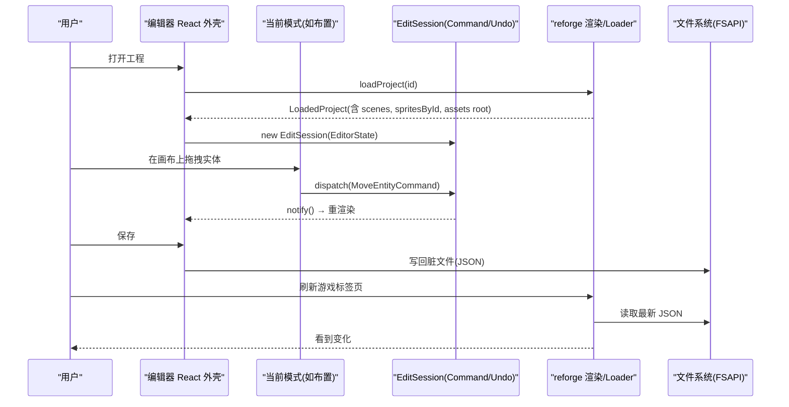
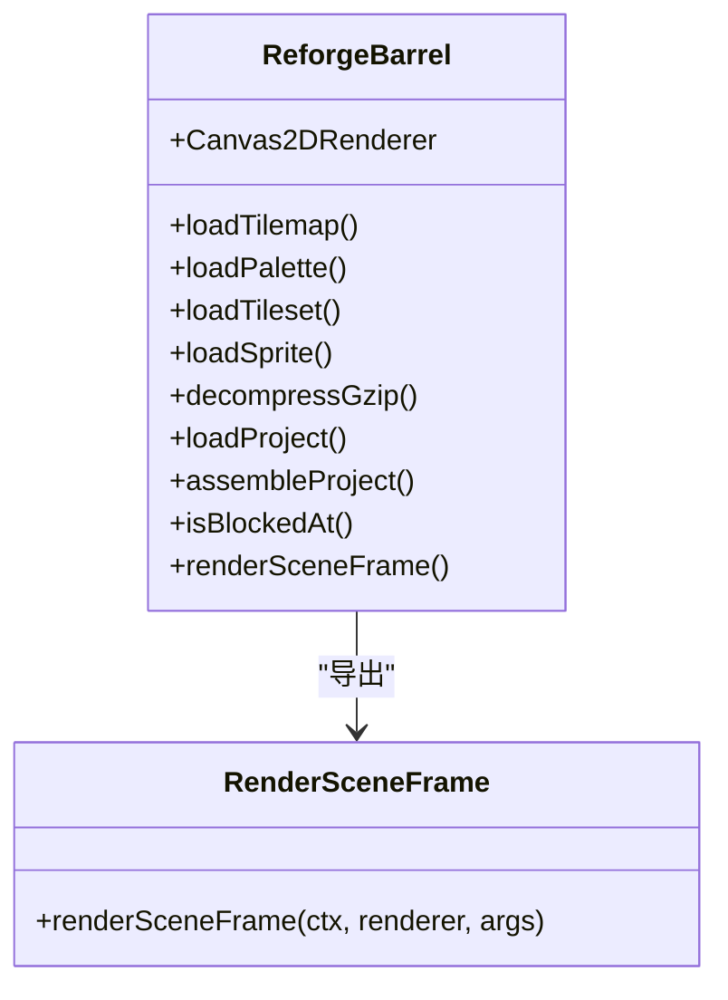
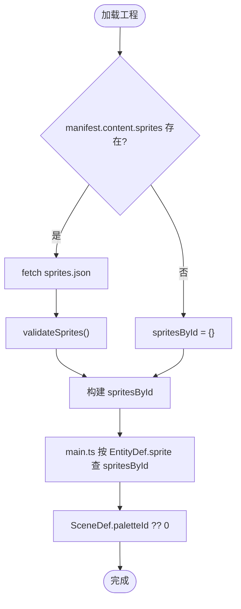
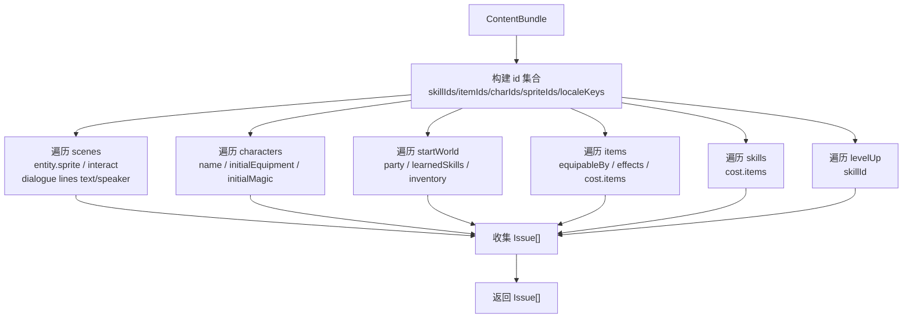
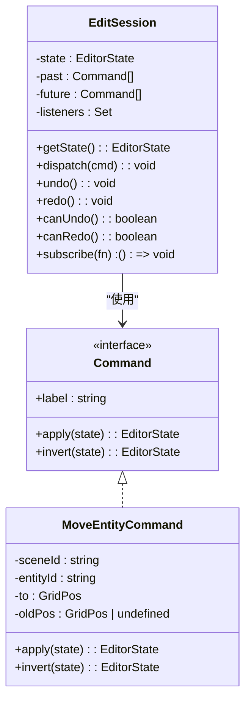
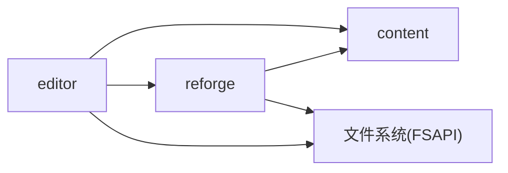

# 内容编辑器

<cite>
**本文引用的文件**   
- [editor-design.md](file://docs/phase2/editor/editor-design.md)
- [project-design.md](file://docs/phase2/editor/project-design.md)
- [editor-b0-plan.md](file://docs/phase2/editor/editor-b0-plan.md)
- [edit-session.ts](file://packages/editor/src/core/edit-session.ts)
- [commands.ts](file://packages/editor/src/core/commands.ts)
- [sprite.ts](file://packages/content/src/sprite.ts)
- [validate-refs.ts](file://packages/content/src/validate-refs.ts)
- [index.ts](file://packages/reforge/src/index.ts)
- [manifest.json](file://projects/demo/manifest.json)
</cite>

## 目录
1. [引言](#引言)
2. [项目结构](#项目结构)
3. [核心组件](#核心组件)
4. [架构总览](#架构总览)
5. [详细组件分析](#详细组件分析)
6. [依赖关系分析](#依赖关系分析)
7. [性能与可维护性](#性能与可维护性)
8. [故障排查指南](#故障排查指南)
9. [结论](#结论)
10. [附录：B0 版本实现计划与使用指南](#附录b0-版本实现计划与使用指南)

## 引言
本专项文档聚焦“内容编辑器”的设计目标、架构与 B0 版本落地方案，覆盖可视化场景编辑、资源管理、实时预览、版本控制集成等主题。基于仓库中第二阶段（Reforge）的编辑器设计与工程化设计文档，以及已落地的 B0 地基代码，本文给出从系统到代码级的完整说明，帮助读者快速理解并参与后续开发。

## 项目结构
- 包拓扑
  - content：数据模型 schema、纯逻辑与跨工程常量；保留为叶子包，供 reforge 与 editor 共同依赖。
  - reforge：引擎壳，负责运行期加载 manifest + content JSON、组装 LoadedProject、渲染与资产加载。
  - editor：网页版编辑器（React + Vite），复用 reforge 的渲染与 loader，通过 File System Access API 读写 projects/<id>/。
- 工程组织
  - projects/<id>/：一个文件夹即一个游戏工程，包含 manifest.json、content/*.json、assets/*。
  - demo 工程：由现有 content 数据迁移而来，用于验证行为一致性与编辑器闭环。

图表来源
- [project-design.md:32-84](file://docs/phase2/editor/project-design.md#L32-L84)
- [editor-design.md:27-43](file://docs/phase2/editor/editor-design.md#L27-L43)

章节来源
- [project-design.md:32-84](file://docs/phase2/editor/project-design.md#L32-L84)
- [editor-design.md:27-43](file://docs/phase2/editor/editor-design.md#L27-L43)

## 核心组件
- 渲染复用层
  - 将 reforge 的绘制流程抽成可复用的 renderSceneFrame，供编辑器画布直接调用，避免重写渲染逻辑。
  - barrel 导出 Canvas2DRenderer、资产加载器、碰撞判定、工程 loader 等，确保编辑器只依赖必要接口。
- 数据与校验
  - content 提供 SpriteDef 精灵注册表、SceneDef.paletteId 场景调色板字段、validateReferences 跨引用完整性校验。
  - 校验结果以 Issue[] 形式返回，支持 error/warn 两级严重度与 where 定位路径。
- 编辑会话与撤销/重做
  - EditSession 持有不可变 EditorState，所有改动经 Command.apply/invert 驱动 undo/redo，并提供 subscribe 通知订阅者。
  - MoveEntityCommand 作为示例命令，演示不可变更新与旧状态捕获。

章节来源
- [index.ts:1-43](file://packages/reforge/src/index.ts#L1-L43)
- [sprite.ts:1-22](file://packages/content/src/sprite.ts#L1-L22)
- [validate-refs.ts:1-155](file://packages/content/src/validate-refs.ts#L1-L155)
- [edit-session.ts:1-84](file://packages/editor/src/core/edit-session.ts#L1-L84)
- [commands.ts:1-77](file://packages/editor/src/core/commands.ts#L1-L77)

## 架构总览
编辑器采用「模式化外壳」：中心画布 + 模式切换 + 随模式变化的侧面板。每个模式仅贡献手势含义、叠加层与 Inspector。核心决策包括：
- UI 技术栈：React + Vite + TS
- 落盘：File System Access API（Chromium）
- 渲染：复用 reforge，不重写
- 交互模型：模式化外壳
- 编辑状态：command/undo 第一天进入
- shared 依赖：接受间接冻结解码类型（D18 债）
- MVP 范围：先跑通「布置」模式

图表来源
- [editor-design.md:108-122](file://docs/phase2/editor/editor-design.md#L108-L122)
- [editor-b0-plan.md:254-266](file://docs/phase2/editor/editor-b0-plan.md#L254-L266)
- [edit-session.ts:22-84](file://packages/editor/src/core/edit-session.ts#L22-L84)

## 详细组件分析

### 渲染复用与包出口
- 目标：让 reforge 成为可被 import 的包，导出渲染器、资产加载、工程 loader、碰撞判定与「画一帧场景」函数。
- 关键产出：
  - renderSceneFrame(ctx, renderer, args)：封装 clear/save/scale/renderScene/restore，保持纯绘制，不含 debug 副作用。
  - barrel index.ts：集中导出 Canvas2DRenderer、loadTilemap/loadPalette/loadTileset/loadSprite/decompressGzip、loadProject/assembleProject、isBlockedAt、renderSceneFrame 及其类型。
- 影响面：
  - main.ts 改为调用 renderSceneFrame，drawCollisionOverlay 挪至其外独立 save/scale/restore 包裹，保证零行为变化。
  - 编辑器可直接复用同一套渲染与碰撞逻辑，避免漂移。

图表来源
- [index.ts:1-43](file://packages/reforge/src/index.ts#L1-L43)
- [editor-design.md:44-54](file://docs/phase2/editor/editor-design.md#L44-L54)
- [editor-b0-plan.md:62-118](file://docs/phase2/editor/editor-b0-plan.md#L62-L118)

章节来源
- [index.ts:1-43](file://packages/reforge/src/index.ts#L1-L43)
- [editor-design.md:44-54](file://docs/phase2/editor/editor-design.md#L44-L54)
- [editor-b0-plan.md:62-118](file://docs/phase2/editor/editor-b0-plan.md#L62-L118)

### 精灵注册表与场景调色板
- 精灵注册表 sprites.json
  - 定义 SpriteDef{id, spriteNum, label}，EntityDef.sprite 引用 id，不再硬编码精灵号。
  - 向后兼容：manifest.content.sprites 可选；loader 条件 fetch；assembleProject 生成 spritesById。
- 场景调色板 SceneDef.paletteId
  - SceneDef 新增 paletteId?，默认 0；main.ts 优先取 scene.paletteId，去 URL 兜底。
- 校验联动
  - validateReferences 检查 entity.sprite 是否在 sprites 注册表，缺失报 error。

图表来源
- [sprite.ts:1-22](file://packages/content/src/sprite.ts#L1-L22)
- [validate-refs.ts:60-70](file://packages/content/src/validate-refs.ts#L60-L70)
- [editor-b0-plan.md:121-155](file://docs/phase2/editor/editor-b0-plan.md#L121-L155)
- [editor-b0-plan.md:158-172](file://docs/phase2/editor/editor-b0-plan.md#L158-L172)

章节来源
- [sprite.ts:1-22](file://packages/content/src/sprite.ts#L1-L22)
- [validate-refs.ts:60-70](file://packages/content/src/validate-refs.ts#L60-L70)
- [editor-b0-plan.md:121-155](file://docs/phase2/editor/editor-b0-plan.md#L121-L155)
- [editor-b0-plan.md:158-172](file://docs/phase2/editor/editor-b0-plan.md#L158-L172)

### 跨引用完整性校验
- 目标：在形状校验之上增加跨表引用检查，防止悬空引用累积。
- 规则要点：
  - entity.interact → 同场景 dialogues.id 存在（error）
  - entity.sprite → sprites 注册表存在（error）
  - DialogueLine.text/.speaker → locale 键存在（warn）
  - startWorld.party/learnedSkills/inventory → characters/skills/items 存在（error/warn）
  - items.equipableBy/effects.grantSkill.skillId/cost.items[].itemId → 对应表存在（warn）
  - CharacterTemplate.initialEquipment/initialMagic/name → items/skills/locale（warn）
  - 未落地字段跳过（poisonId/triggerScript.scriptId/teleport.target）
- 输出：Issue[]，每条带 severity、where、message。

图表来源
- [validate-refs.ts:1-155](file://packages/content/src/validate-refs.ts#L1-L155)

章节来源
- [validate-refs.ts:1-155](file://packages/content/src/validate-refs.ts#L1-L155)

### 编辑会话与撤销/重做
- 设计要点：
  - EditorState = ContentBundle + manifest，不可变。
  - Command 接口：apply(s)→EditorState，invert(s)→EditorState。
  - EditSession：dispatch/undo/redo/subscribe，past/future 双栈。
  - MoveEntityCommand：示例命令，演示不可变更新与旧 pos 捕获。
- 测试策略：
  - 不可变性、undo/redo 往返、redo 分支清空、订阅触发与退订。

图表来源
- [commands.ts:1-77](file://packages/editor/src/core/commands.ts#L1-L77)
- [edit-session.ts:1-84](file://packages/editor/src/core/edit-session.ts#L1-L84)

章节来源
- [commands.ts:1-77](file://packages/editor/src/core/commands.ts#L1-L77)
- [edit-session.ts:1-84](file://packages/editor/src/core/edit-session.ts#L1-L84)

### 工程文件格式与资源组织
- manifest.json
  - id/name/contentVersion/entryScene
  - content: 列出各 content JSON 相对路径
  - assets: 工程自有资源根与命名规则（maps/tilesets/sprites/palettes）
  - startWorld: 初始世界态的数据化（party/money/learnedSkills/inventory/seedStats）
- content JSON
  - scenes/characters/skills/items/locale 均为纯 JSON，运行时 fetch + guard 校验 + 组装。
- 资源自包含
  - map/tileset/sprite/palette 归入 projects/<id>/assets；引擎 chrome（字模/菜单皮/光标）留引擎。

章节来源
- [project-design.md:85-118](file://docs/phase2/editor/project-design.md#L85-L118)
- [project-design.md:119-160](file://docs/phase2/editor/project-design.md#L119-L160)
- [manifest.json:1-33](file://projects/demo/manifest.json#L1-L33)

## 依赖关系分析
- 包边界
  - editor 依赖 content + reforge；不碰 game/pal-extract；shared 仅经 reforge 间接使用冻结解码类型。
- 耦合与内聚
  - content 为叶子包，schema/ops/常量高度内聚；reforge 对外暴露最小接口；editor 仅消费稳定接口。
- 外部依赖
  - File System Access API（Chromium）；React/Vite（编辑器）。

图表来源
- [editor-design.md:27-43](file://docs/phase2/editor/editor-design.md#L27-L43)
- [project-design.md:32-53](file://docs/phase2/editor/project-design.md#L32-L53)

章节来源
- [editor-design.md:27-43](file://docs/phase2/editor/editor-design.md#L27-L43)
- [project-design.md:32-53](file://docs/phase2/editor/project-design.md#L32-L53)

## 性能与可维护性
- 渲染缓存
  - Canvas2DRenderer 按 palette/tileset 缓存烤图，换调色板/地图需重建实例；编辑器换场景时注意重建。
- 坐标与命中
  - 两套坐标（矩形瓦片格 vs 菱形轴 GridPos）统一由 content/grid.ts 数学函数处理；编辑器复用 isBlockedAt 保证一致性。
- 不可变状态
  - EditSession 强制不可变更新，利于撤销/重做与并发安全，代价是对象创建开销；可通过批量命令合并优化。
- 校验分层
  - 形状校验 + 跨引用校验分离，便于扩展 zod 或增量添加新规则。

[本节为通用指导，无需具体文件分析]

## 故障排查指南
- 常见错误
  - 精灵 id 不在 sprites 注册表：检查 manifest.content.sprites 是否引入、sprites.json 是否包含该 id。
  - 对话文本 id 不在 locale：检查 locale.json 是否包含对应键。
  - 升级习得/物品消耗/授技等指向不存在：根据 Issue.where 定位并修正。
- 调试建议
  - 使用底部校验面板查看问题列表与跳转定位。
  - 浏览器控制台打印 LoadedProject.scenes 首项 id，确认 loader 链路正常。
  - 对 drawCollisionOverlay 的叠加层进行对比，确保与游戏表现一致。

章节来源
- [validate-refs.ts:1-155](file://packages/content/src/validate-refs.ts#L1-L155)
- [editor-b0-plan.md:254-266](file://docs/phase2/editor/editor-b0-plan.md#L254-L266)

## 结论
内容编辑器以“渲染复用 + 数据解耦 + 命令式编辑 + 强校验”为核心，通过 B0 地基一次性立稳五根支柱：渲染复用、command/undo、模式插件壳、校验层、schema 补口。在此基础上，B1 仅需搭建「布置」模式的 UI 与交互，即可形成“可视化编辑 → 落盘 → 游戏生效”的闭环。

[本节为总结，无需具体文件分析]

## 附录：B0 版本实现计划与使用指南

### B0 目标与范围
- 目标：把编辑器要站的地基一次立稳——reforge 可 import、抽出 renderSceneFrame；补齐 sprites 注册表与 scene paletteId；加 validateReferences；起 React 脚手架；写 command/undo 纯核。
- 范围：非视觉任务为主，不含任何编辑 UI 交互与画布视口（这些属于 B1）。

章节来源
- [editor-b0-plan.md:1-23](file://docs/phase2/editor/editor-b0-plan.md#L1-L23)

### 任务清单（概览）
- Task 1：reforge 变可 import 的包 + 抽 renderSceneFrame
- Task 2：精灵注册表 sprites.json（修实体精灵硬编码）
- Task 3：SceneDef.paletteId（去 URL 调色板兜底）
- Task 4：validateReferences 跨引用校验
- Task 5：editor React 脚手架（boots + 能 import reforge）
- Task 6：EditSession + command/undo 纯核（TDD）

章节来源
- [editor-b0-plan.md:62-118](file://docs/phase2/editor/editor-b0-plan.md#L62-L118)
- [editor-b0-plan.md:121-155](file://docs/phase2/editor/editor-b0-plan.md#L121-L155)
- [editor-b0-plan.md:158-172](file://docs/phase2/editor/editor-b0-plan.md#L158-L172)
- [editor-b0-plan.md:175-251](file://docs/phase2/editor/editor-b0-plan.md#L175-L251)
- [editor-b0-plan.md:254-266](file://docs/phase2/editor/editor-b0-plan.md#L254-L266)
- [editor-b0-plan.md:269-345](file://docs/phase2/editor/editor-b0-plan.md#L269-L345)

### 使用指南（B0 后）
- 启动编辑器
  - pnpm --filter @type-pal/editor dev
  - 页面应显示占位，控制台打印 demo 场景 id，无报错。
- 打开工程
  - 通过 File System Access 授权 projects/<id>/ 目录句柄。
- 保存与预览
  - 保存仅写脏文件；另开标签页刷新游戏以观察变化。
- 校验面板
  - 查看 Issue 列表，点击跳转到对应数据位置。

章节来源
- [editor-b0-plan.md:254-266](file://docs/phase2/editor/editor-b0-plan.md#L254-L266)
- [editor-design.md:108-122](file://docs/phase2/editor/editor-design.md#L108-L122)

### 插件开发接口（模式即插件）
- 模式接口
  - onCanvasPointer(ev, ctx)：画布手势 → dispatch command
  - renderOverlay(ctx, view)：模式专属叠加层
  - Panel：侧面板（Inspector/工具）
  - Toolbar：可选工具栏
- 外壳职责
  - 画布视口（平移/缩放）、当前模式、选中态、command 派发、模式切换 UI、校验面板、保存。
- 扩展方式
  - 往注册表新增一个模式，不动壳。

章节来源
- [editor-design.md:63-78](file://docs/phase2/editor/editor-design.md#L63-L78)

### 与游戏引擎的集成方案
- 渲染复用
  - 编辑器直接调用 renderSceneFrame 绘制场景底图，叠加网格/禁入/选中手柄等。
- 资源路径
  - 通过 manifest.assets.root 解析资源路径；引擎 UI 皮/字模仍走引擎自有路径。
- 碰撞判定
  - 编辑器复用 isBlockedAt，保证「编辑器显示的禁入 = 游戏真正用的判定」。

章节来源
- [editor-design.md:44-54](file://docs/phase2/editor/editor-design.md#L44-L54)
- [project-design.md:162-171](file://docs/phase2/editor/project-design.md#L162-L171)

### 调试工具链
- 浏览器实测
  - Claude 逐任务 gate 验证渲染/精灵/配色与现状一致。
- 单元测试
  - render-scene 委托契约测、validate-refs 用例集、edit-session 不可变与 undo/redo 测。
- 控制台日志
  - 在 main.tsx 中 import reforge 的 loadProject 并打印场景 id，验证整条链路。

章节来源
- [editor-b0-plan.md:348-355](file://docs/phase2/editor/editor-b0-plan.md#L348-L355)
- [editor-b0-plan.md:254-266](file://docs/phase2/editor/editor-b0-plan.md#L254-L266)