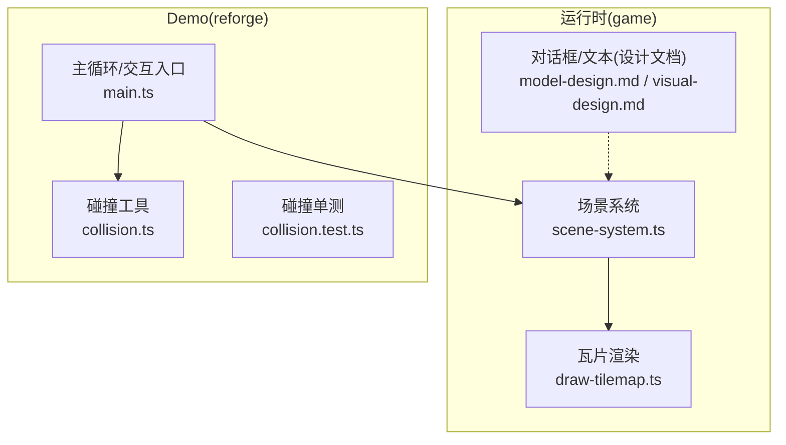
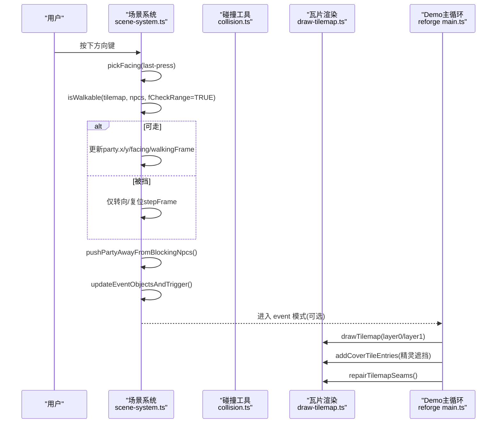
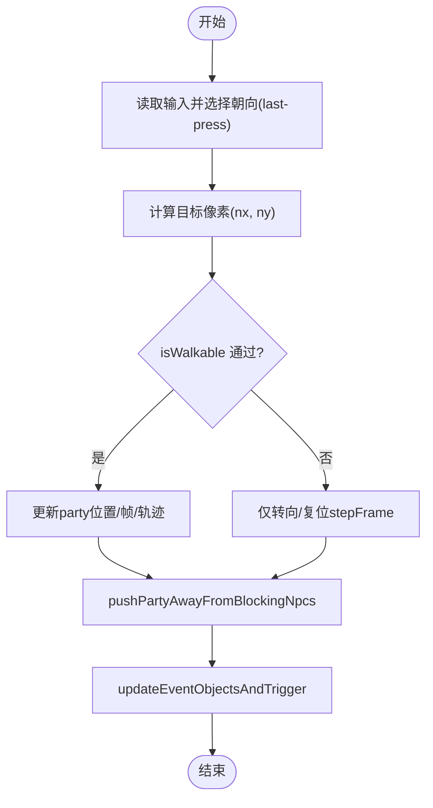
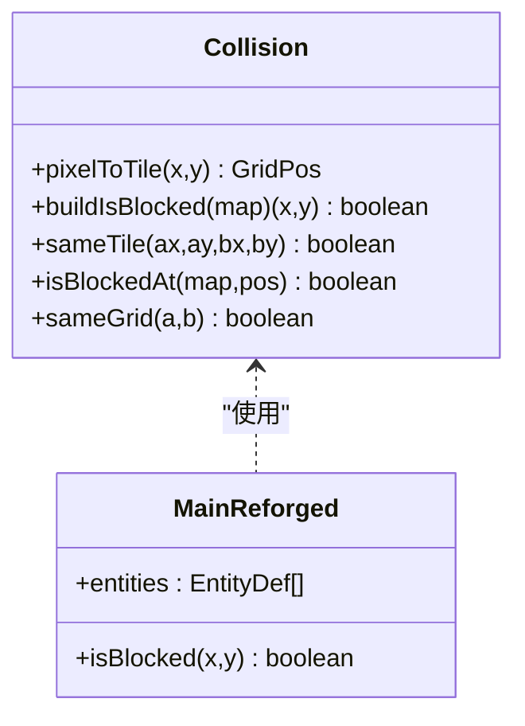
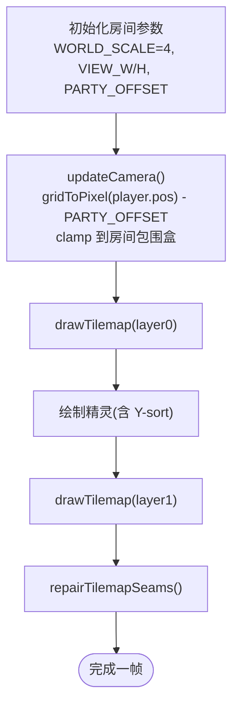
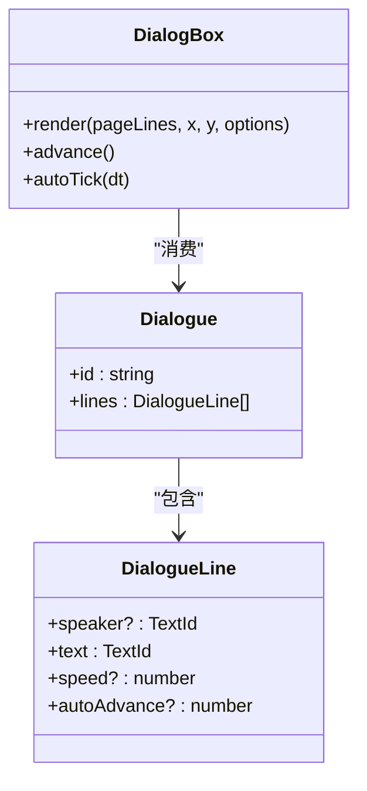
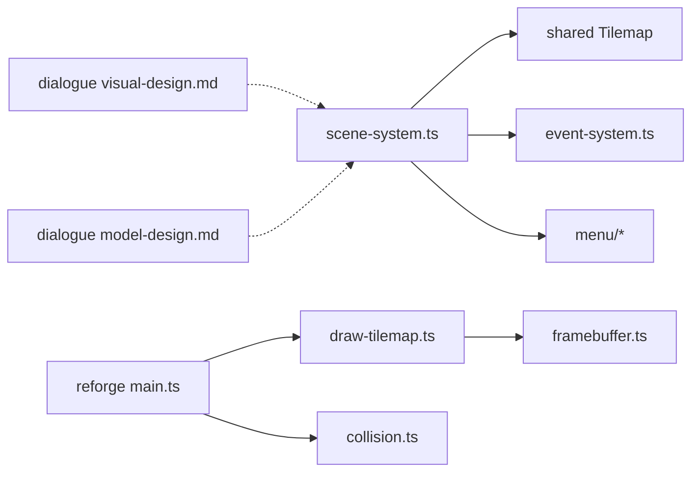

# 切片1：室内场景

<cite>
**本文引用的文件**   
- [packages/game/src/core/scene-system.ts](file://packages/game/src/core/scene-system.ts)
- [packages/game/src/present/draw-tilemap.ts](file://packages/game/src/present/draw-tilemap.ts)
- [packages/reforge/src/collision.ts](file://packages/reforge/src/collision.ts)
- [packages/reforge/src/collision.test.ts](file://packages/reforge/src/collision.test.ts)
- [packages/reforge/src/main.ts](file://packages/reforge/src/main.ts)
- [docs/phase2/slice1-indoor/npc-collision-plan.md](file://docs/phase2/slice1-indoor/npc-collision-plan.md)
- [docs/phase2/dialogue/model-design.md](file://docs/phase2/dialogue/model-design.md)
- [docs/phase2/dialogue/visual-design.md](file://docs/phase2/dialogue/visual-design.md)
- [docs/phase2/README.md](file://docs/phase2/README.md)
</cite>

## 目录
1. [引言](#引言)
2. [项目结构](#项目结构)
3. [核心组件](#核心组件)
4. [架构总览](#架构总览)
5. [详细组件分析](#详细组件分析)
6. [依赖分析](#依赖分析)
7. [性能考虑](#性能考虑)
8. [故障排查指南](#故障排查指南)
9. [结论](#结论)
10. [附录](#附录)

## 引言
本文件聚焦“切片1「鬼界民居」室内场景”的完整技术说明，覆盖以下目标与范围：
- Canvas 2D 渲染管线（瓦片层、精灵遮挡、接缝修复）
- 原版民居场景裁剪与相机跟随
- 玩家移动控制（方向键优先级、半格步进、转向与行走帧）
- 碰撞检测系统（菱形四分法、障碍位 bit 13、NPC 阻挡）
- NPC 静态碰撞实现方案与技术要点
- 基于 D16 渲染地基构建室内环境的方法
- 对话系统集成（结构化数据模型 + 外观真值继承）
- 开发工作流程与最佳实践
- 测试策略与验证方法

## 项目结构
切片1涉及的核心代码分布在游戏运行时与 reforge demo 两个包中：
- 运行时（game）：场景系统、瓦片渲染、精灵遮挡、相机与输入处理
- Demo（reforge）：Canvas2D 演示、碰撞工具函数、交互入口

图表来源
- [packages/game/src/core/scene-system.ts:1-661](file://packages/game/src/core/scene-system.ts#L1-L661)
- [packages/game/src/present/draw-tilemap.ts:1-384](file://packages/game/src/present/draw-tilemap.ts#L1-L384)
- [packages/reforge/src/main.ts:157-177](file://packages/reforge/src/main.ts#L157-L177)
- [packages/reforge/src/collision.ts:1-71](file://packages/reforge/src/collision.ts#L1-L71)
- [docs/phase2/dialogue/model-design.md:1-149](file://docs/phase2/dialogue/model-design.md#L1-L149)
- [docs/phase2/dialogue/visual-design.md:1-43](file://docs/phase2/dialogue/visual-design.md#L1-L43)

章节来源
- [docs/phase2/README.md:46-66](file://docs/phase2/README.md#L46-L66)

## 核心组件
- 场景系统（探索模式 tick 主体）
  - 输入→走路/撞墙/转向→自动触发区→推离阻挡者→切事件模式
  - 对齐 SDLPal 关键路径：tile bit13 菱形判定、sState>=2 阻挡、last-press 方向键优先、triggerMode 4..8 距离阈值
- 瓦片渲染（Canvas2D）
  - 双层 tilemap（底层/顶层），Y-sort 绘制，精灵遮挡计算，接缝修复
- 碰撞工具（reforge）
  - pixelToTile 菱形映射、buildIsBlocked 障碍位判定、sameTile 同格判定、GridPos 入口适配
- 对话系统（设计与外观）
  - 数据结构化（去 in-band 控制符）、i18n 富文本、外观真值继承（透明框/姓名牌/打字/光标/阴影）

章节来源
- [packages/game/src/core/scene-system.ts:1-661](file://packages/game/src/core/scene-system.ts#L1-L661)
- [packages/game/src/present/draw-tilemap.ts:1-384](file://packages/game/src/present/draw-tilemap.ts#L1-L384)
- [packages/reforge/src/collision.ts:1-71](file://packages/reforge/src/collision.ts#L1-L71)
- [docs/phase2/dialogue/model-design.md:1-149](file://docs/phase2/dialogue/model-design.md#L1-L149)
- [docs/phase2/dialogue/visual-design.md:1-43](file://docs/phase2/dialogue/visual-design.md#L1-L43)

## 架构总览
下图展示从输入到渲染的关键链路，以及 NPC 碰撞与对话触发的集成点。

图表来源
- [packages/game/src/core/scene-system.ts:443-584](file://packages/game/src/core/scene-system.ts#L443-L584)
- [packages/game/src/present/draw-tilemap.ts:92-208](file://packages/game/src/present/draw-tilemap.ts#L92-L208)
- [packages/reforge/src/main.ts:157-177](file://packages/reforge/src/main.ts#L157-L177)

## 详细组件分析

### 玩家移动与碰撞检测
- 方向键选择：按最后按下键决定朝向（与原版一致）
- 半格步进：X_STEP=16, Y_STEP=8；每步对应菱形四分法的半个 tile
- 下边界保护：blockX/blockY 保证队首始终在屏幕中心区域
- 菱形碰撞：pixelToTile → 查 tilemap obstacle bit 13 → NPC 曼哈顿距离 < 16 且 sState>=2 则阻挡
- 推离逻辑：当 NPC 压住 party anchor，沿 NPC 朝向下一方向试 4 个落点，合法则推离并同步 camera

图表来源
- [packages/game/src/core/scene-system.ts:467-584](file://packages/game/src/core/scene-system.ts#L467-L584)
- [packages/game/src/core/scene-system.ts:276-296](file://packages/game/src/core/scene-system.ts#L276-L296)
- [packages/game/src/core/scene-system.ts:371-425](file://packages/game/src/core/scene-system.ts#L371-L425)

章节来源
- [packages/game/src/core/scene-system.ts:1-661](file://packages/game/src/core/scene-system.ts#L1-L661)

### NPC 静态碰撞实现方案与技术要点
- 目标：玩家不能穿过 collide=true 的静态实体；撞上停下，仍可对话
- 方案：
  - collision.ts 新增 sameTile(ax,ay,bx,by)：复用 pixelToTile 判断两点是否落在同一站立格(col,row,h)
  - main.ts 的 isBlocked 包一层：tile 阻挡 || 存在 collide 实体与目标同格
  - movement.resolveMove 语义不变（撞停即停），注入 isBlocked 后自然生效
- 技术要点：
  - 纯函数 sameTile 可单测，坐标以真实世界像素为基准
  - 闭包读 entities 当前 pos（未来动态移动也自然生效）
  - 不改 resolveMove 语义，避免范围蔓延
  - 浏览器验收：撞停相邻格、能对话、debug 红格显示禁入、四向均被挡且可绕过

图表来源
- [packages/reforge/src/collision.ts:1-71](file://packages/reforge/src/collision.ts#L1-L71)
- [packages/reforge/src/main.ts:157-177](file://packages/reforge/src/main.ts#L157-L177)
- [docs/phase2/slice1-indoor/npc-collision-plan.md:1-126](file://docs/phase2/slice1-indoor/npc-collision-plan.md#L1-L126)

章节来源
- [packages/reforge/src/collision.ts:1-71](file://packages/reforge/src/collision.ts#L1-L71)
- [packages/reforge/src/collision.test.ts:1-82](file://packages/reforge/src/collision.test.ts#L1-L82)
- [docs/phase2/slice1-indoor/npc-collision-plan.md:1-126](file://docs/phase2/slice1-indoor/npc-collision-plan.md#L1-L126)

### 基于 D16 渲染地基构建室内环境
- 视图与缩放：逻辑视口 320×200，物理 canvas 1280×800（4x 放大），保持像素锐利
- 房间包围盒：根据 room.col/row/cols/rows 计算 worldMin/Max，camera clamp 在房间内
- 相机跟随：camera = clamp(gridToPixel(player.pos) - PARTYOFFSET, roomBounds)
- 渲染顺序：先画 layer0（地砖/墙基），再画精灵，再画 layer1（遮挡物），最后接缝修复

图表来源
- [packages/reforge/src/main.ts:157-177](file://packages/reforge/src/main.ts#L157-L177)
- [packages/game/src/present/draw-tilemap.ts:92-208](file://packages/game/src/present/draw-tilemap.ts#L92-L208)

章节来源
- [packages/reforge/src/main.ts:157-177](file://packages/reforge/src/main.ts#L157-L177)
- [packages/game/src/present/draw-tilemap.ts:1-384](file://packages/game/src/present/draw-tilemap.ts#L1-L384)

### 对话系统集成（结构化数据 + 外观真值）
- 数据模型：DialogueLine(text=speaker?+text TextId, speed?, autoAdvance?)，Dialogue(lines[])
- i18n：正文走 locale 表，支持多色强调标记（如 <cyan>…</cyan>）
- 外观继承：透明框、姓名牌、打字速度、光标形态、三层阴影等按 GLM spec 真值复刻
- 状态机：分页由渲染层计算，autoAdvance 行打完自动推进，按键瞬显整页不阻塞逻辑 tick

图表来源
- [docs/phase2/dialogue/model-design.md:1-149](file://docs/phase2/dialogue/model-design.md#L1-L149)
- [docs/phase2/dialogue/visual-design.md:1-43](file://docs/phase2/dialogue/visual-design.md#L1-L43)

章节来源
- [docs/phase2/dialogue/model-design.md:1-149](file://docs/phase2/dialogue/model-design.md#L1-L149)
- [docs/phase2/dialogue/visual-design.md:1-43](file://docs/phase2/dialogue/visual-design.md#L1-L43)

## 依赖分析
- scene-system.ts 依赖 shared Tilemap、event-system、menu 子系统
- draw-tilemap.ts 依赖 framebuffer、TileImages
- reforge main.ts 依赖 collision.ts 与 Canvas2D 渲染器
- dialogue 设计文档与运行时解耦，提供数据与外观规范

图表来源
- [packages/game/src/core/scene-system.ts:1-661](file://packages/game/src/core/scene-system.ts#L1-L661)
- [packages/game/src/present/draw-tilemap.ts:1-384](file://packages/game/src/present/draw-tilemap.ts#L1-L384)
- [packages/reforge/src/main.ts:157-177](file://packages/reforge/src/main.ts#L157-L177)
- [packages/reforge/src/collision.ts:1-71](file://packages/reforge/src/collision.ts#L1-L71)
- [docs/phase2/dialogue/model-design.md:1-149](file://docs/phase2/dialogue/model-design.md#L1-L149)
- [docs/phase2/dialogue/visual-design.md:1-43](file://docs/phase2/dialogue/visual-design.md#L1-L43)

章节来源
- [packages/game/src/core/scene-system.ts:1-661](file://packages/game/src/core/scene-system.ts#L1-L661)
- [packages/game/src/present/draw-tilemap.ts:1-384](file://packages/game/src/present/draw-tilemap.ts#L1-L384)
- [packages/reforge/src/collision.ts:1-71](file://packages/reforge/src/collision.ts#L1-L71)
- [docs/phase2/dialogue/model-design.md:1-149](file://docs/phase2/dialogue/model-design.md#L1-L149)
- [docs/phase2/dialogue/visual-design.md:1-43](file://docs/phase2/dialogue/visual-design.md#L1-L43)

## 性能考虑
- 菱形碰撞 O(n) 遍历 NPC，建议对大场景引入空间索引（如网格哈希）
- drawTilemap 已做 viewport clip 与 fence fill，减少无效绘制
- repairTilemapSeams 采用有限 pass 扩散，maxPasses 控制开销
- 4x 整数倍缩放避免采样模糊，利于像素风表现
- 对话打字时钟与逻辑主循环解耦，避免帧率抖动影响体验

[本节为通用指导，无需源码引用]

## 故障排查指南
- 玩家穿模站着的 NPC
  - 检查 sameTile 与 isBlocked 组合是否正确注入
  - 浏览器验：撞停相邻格、四向均被挡、可绕过、debug 红格显示禁入
- 对话无法触发或重复触发
  - 确认 triggerMode 与阈值公式、autoTriggerOnce 消耗逻辑
  - 脚本结束后 suppressAutoTriggerOnce 是否清掉
- 瓦片接缝漏黑
  - 确认 coverage 记录与 repairTilemapSeams 调用
  - 注意 opaque mask 与 palette-0 的区别，避免误填
- 相机越界或画面偏移
  - 检查 gridToPixel 与 PARTY_OFFSET 常量
  - 确认 room 包围盒 clamp 逻辑

章节来源
- [docs/phase2/slice1-indoor/npc-collision-plan.md:1-126](file://docs/phase2/slice1-indoor/npc-collision-plan.md#L1-L126)
- [packages/game/src/core/scene-system.ts:443-584](file://packages/game/src/core/scene-system.ts#L443-L584)
- [packages/game/src/present/draw-tilemap.ts:153-208](file://packages/game/src/present/draw-tilemap.ts#L153-L208)
- [packages/reforge/src/main.ts:157-177](file://packages/reforge/src/main.ts#L157-L177)

## 结论
切片1「鬼界民居」室内场景以 Canvas2D 为核心，结合菱形碰撞与双层瓦片渲染，实现了原版风格的行走、阻挡与对话触发。静态 NPC 碰撞通过 sameTile + isBlocked 包层无缝接入，既保持 resolveMove 语义稳定，又便于后续扩展动态碰撞。对话系统采用结构化数据与外观真值继承，确保行为与视觉一致性。配合完善的单测与浏览器验收流程，可在可控范围内快速迭代与回归验证。

[本节为总结性内容，无需源码引用]

## 附录
- 开发工作流程与最佳实践
  - 先写失败测试（TDD），再实现最小可用功能
  - 将几何判定抽为纯函数（collision.ts），便于单测与复用
  - 不改既有核心语义（resolveMove），通过 isBlocked 注入新规则
  - 浏览器验收清单：撞停、可对话、可绕过、debug 可视化
  - 对话开发遵循“数据先行、外观继承”，避免 in-band 控制符
- 测试策略与验证方法
  - 单测：sameTile、isBlockedAt、sameGrid、buildIsBlocked 等
  - 截图对比：NPC sprite 渲染 baseline diff
  - 端到端：a6-npc-block.spec.ts 验证阻挡行为
  - 调试开关：?collision debug 层红格标注禁入

章节来源
- [packages/reforge/src/collision.test.ts:1-82](file://packages/reforge/src/collision.test.ts#L1-L82)
- [docs/phase2/slice1-indoor/npc-collision-plan.md:1-126](file://docs/phase2/slice1-indoor/npc-collision-plan.md#L1-L126)
- [docs/phase2/dialogue/model-design.md:1-149](file://docs/phase2/dialogue/model-design.md#L1-L149)
- [docs/phase2/dialogue/visual-design.md:1-43](file://docs/phase2/dialogue/visual-design.md#L1-L43)