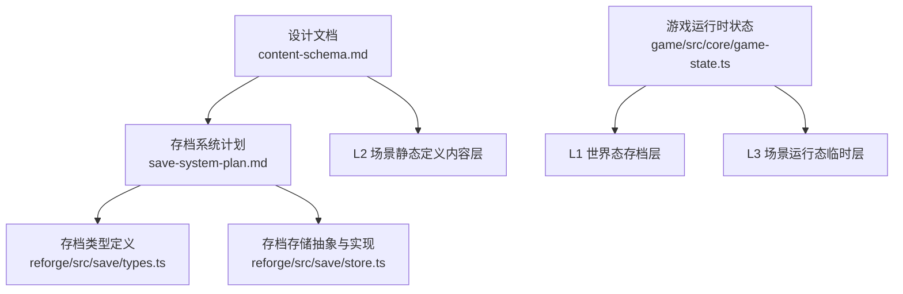
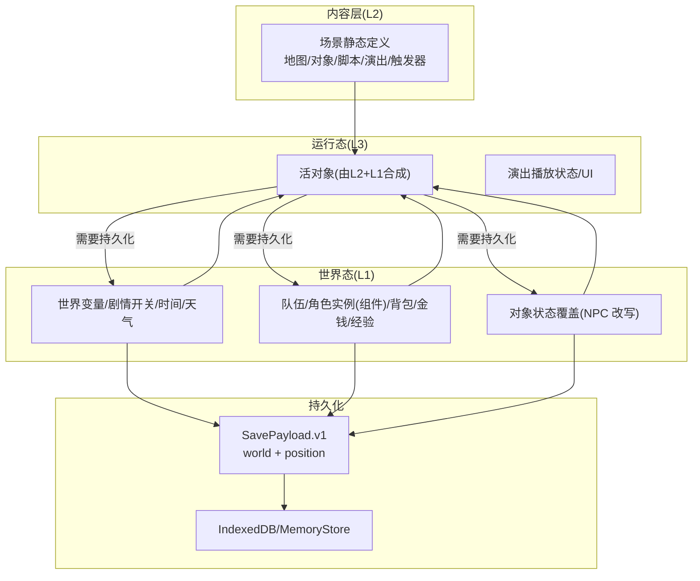
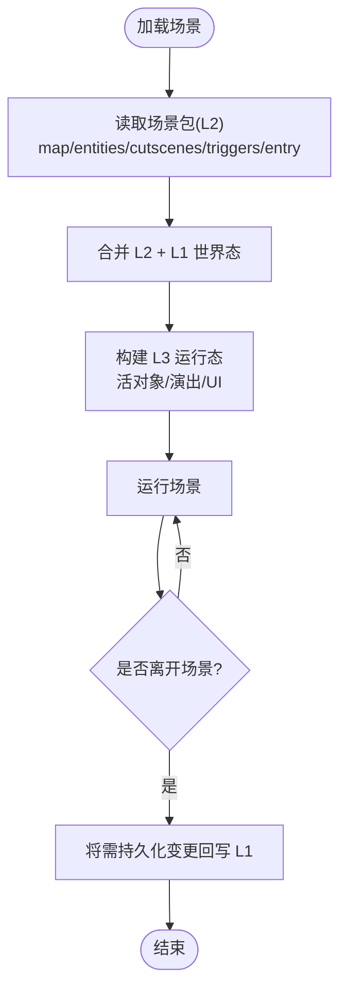
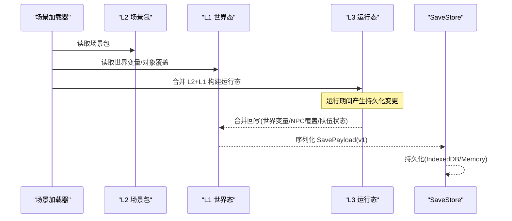
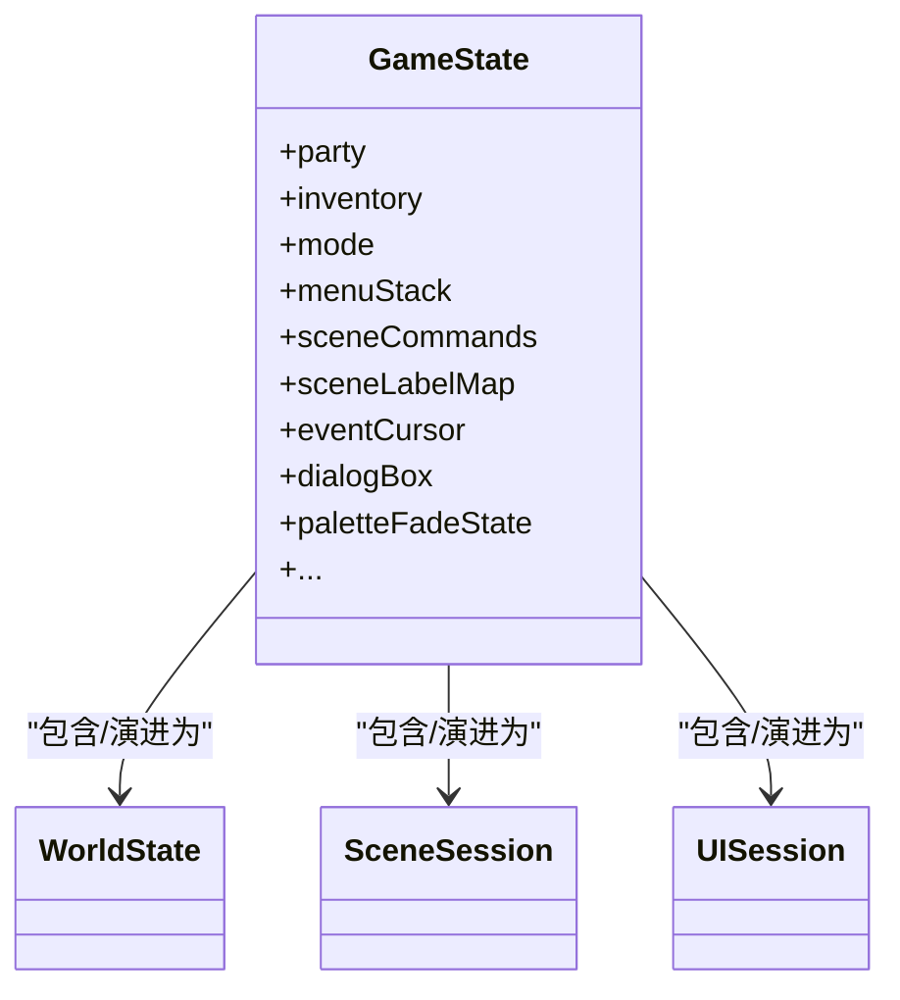
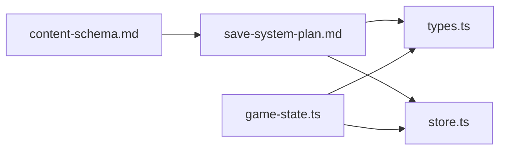

# 三层状态架构

<cite>
**本文引用的文件**   
- [content-schema.md](file://docs/phase2/foundation/content-schema.md)
- [engine-debt-audit.md](file://docs/phase2/foundation/engine-debt-audit.md)
- [save-system-plan.md](file://docs/phase2/foundation/save-system-plan.md)
- [types.ts](file://packages/reforge/src/save/types.ts)
- [store.ts](file://packages/reforge/src/save/store.ts)
- [game-state.ts](file://packages/game/src/core/game-state.ts)
</cite>

## 目录
1. [引言](#引言)
2. [项目结构](#项目结构)
3. [核心组件](#核心组件)
4. [架构总览](#架构总览)
5. [详细组件分析](#详细组件分析)
6. [依赖分析](#依赖分析)
7. [性能考虑](#性能考虑)
8. [故障排查指南](#故障排查指南)
9. [结论](#结论)
10. [附录](#附录)

## 引言
本文件系统化阐述“三层状态架构”的设计与实现：L1 世界态（存档层）、L2 场景静态定义（内容层）、L3 场景运行态（临时层）。重点覆盖各层职责边界、数据生命周期、访问权限、序列化策略，以及跨层数据流转机制（L2+L1→L3；L3变化→回写L1），并给出数据结构示例与加载流程说明。同时解释“场景自包含”原则的实现方式与性能优化考量。

## 项目结构
围绕三层状态，仓库在文档与代码层面形成清晰分工：
- 设计文档定义三层模型、稳定身份、世界变量、场景包、地图 schema、事件与演出建模、工程目录与迁移器、角色实体建模等。
- 存档系统计划将 L1 世界态持久化落地为 v1 payload（world + position），并提供浏览界面状态机与存储抽象。
- 运行时 GameState 承载探索/事件/战斗模式下的单一真相源，其中大量字段属于 L1/L3 的混合态，需按职责分层理解。



**图表来源**
- [content-schema.md:23-31](file://docs/phase2/foundation/content-schema.md#L23-L31)
- [save-system-plan.md:1-12](file://docs/phase2/foundation/save-system-plan.md#L1-L12)
- [types.ts:1-42](file://packages/reforge/src/save/types.ts#L1-L42)
- [store.ts:1-95](file://packages/reforge/src/save/store.ts#L1-L95)
- [game-state.ts:655-800](file://packages/game/src/core/game-state.ts#L655-L800)

**章节来源**
- [content-schema.md:23-31](file://docs/phase2/foundation/content-schema.md#L23-L31)
- [save-system-plan.md:1-12](file://docs/phase2/foundation/save-system-plan.md#L1-L12)

## 核心组件
- L1 世界态（存档层）
  - 贯穿整局、随存档读写：队伍、角色属性（实例+组件）、背包、金钱、经验、世界变量（剧情开关/时间/天气）、对象状态覆盖（NPC 被剧情改写的部分）。
  - 序列化：以 SavePayload.version 驱动迁移，v1 包含 world 与 position（sceneId + GridPos + Facing）。
- L2 场景静态定义（内容层）
  - 编辑器产出、只读可版本化：场景地图、对象初始摆放、脚本、演出、触发器、入口。
  - 不进入存档；跨场景影响通过修改 L1 体现。
- L3 场景运行态（临时层）
  - 进场景时由 L2 + L1 合并生成：活对象、演出播放状态、UI 等；出场景即丢弃。
  - 运行时可变但不持久，除非其结果写入 L1（如 NPC 状态覆盖、世界变量变更）。

关键约束
- 稳定身份：一切实体使用稳定 id/语义名，杜绝数组下标作为身份。
- 场景自包含：加载一个场景仅加载其 L2 与所需素材；跨场景影响一律走 L1。

**章节来源**
- [content-schema.md:23-31](file://docs/phase2/foundation/content-schema.md#L23-L31)
- [content-schema.md:33-40](file://docs/phase2/foundation/content-schema.md#L33-L40)
- [content-schema.md:50-67](file://docs/phase2/foundation/content-schema.md#L50-L67)
- [save-system-plan.md:1-12](file://docs/phase2/foundation/save-system-plan.md#L1-L12)
- [types.ts:32-42](file://packages/reforge/src/save/types.ts#L32-L42)

## 架构总览
下图展示三层状态与持久化的关系，以及运行时如何从 L2+L1 构建 L3，并在退出场景时将 L3 中需要持久化的变更落盘到 L1。



**图表来源**
- [content-schema.md:23-31](file://docs/phase2/foundation/content-schema.md#L23-L31)
- [save-system-plan.md:1-12](file://docs/phase2/foundation/save-system-plan.md#L1-L12)
- [types.ts:32-42](file://packages/reforge/src/save/types.ts#L32-L42)
- [store.ts:1-95](file://packages/reforge/src/save/store.ts#L1-L95)

## 详细组件分析

### L1 世界态（存档层）
- 职责边界
  - 保存全局进度与玩家状态：世界变量、队伍、角色实例（组件）、背包、金钱、经验、对象状态覆盖。
  - 提供稳定的“世界快照”，供场景加载时融合到 L3。
- 生命周期
  - 启动：从存档恢复 WorldState（若存在）。
  - 运行：事件/演出/触发器对 L1 进行增量更新（如开启剧情开关、改变 NPC 状态）。
  - 退出/切场景：必要时将 L3 中的持久化变更合并回 L1。
  - 存档：序列化 SavePayload（version=1 → world + position）。
- 访问权限
  - 读取：所有子系统均可读取 L1（场景加载、渲染、菜单、存档 UI）。
  - 写入：仅限明确的事件/演出/触发器处理器或系统逻辑（避免任意模块随意改动）。
- 序列化策略
  - version 驱动迁移；当前 v1 包含 world 与 position（sceneId + GridPos + Facing）。
  - 存储后端抽象 SaveStore，支持 Memory/IndexedDB 两种实现。

```mermaid
classDiagram
class SavePayload {
+number version
+WorldState world
+position : { sceneId : string; pos : GridPos; facing : Facing }
}
class SaveMeta {
+SlotId slotId
+SlotKind kind
+party : {name : string;level : number}[]
+string mapName
+number savedAt
}
class SaveStore {
+putSlot(meta,payload,thumb) Promise~void~
+listMeta() Promise~SaveMeta[]~
+getPayload(slotId) Promise~SavePayload|null~
+getThumb(slotId) Promise~Blob|null~
}
class MemorySaveStore
class IndexedDbSaveStore
SaveStore <|.. MemorySaveStore
SaveStore <|.. IndexedDbSaveStore
SaveMeta --> SavePayload : "用于浏览/写入"
```

**图表来源**
- [types.ts:23-42](file://packages/reforge/src/save/types.ts#L23-L42)
- [store.ts:1-95](file://packages/reforge/src/save/store.ts#L1-L95)

**章节来源**
- [save-system-plan.md:1-12](file://docs/phase2/foundation/save-system-plan.md#L1-L12)
- [types.ts:32-42](file://packages/reforge/src/save/types.ts#L32-L42)
- [store.ts:1-95](file://packages/reforge/src/save/store.ts#L1-L95)

### L2 场景静态定义（内容层）
- 职责边界
  - 描述“一张图长什么样、有什么、怎么演”：地图、对象初始摆放、脚本、演出、触发器、入口。
  - 只读、可版本化，由编辑器产出，不随运行期变化。
- 生命周期
  - 构建：从 content 工程目录加载场景包。
  - 使用：场景切换时按需加载；退出场景后释放。
- 访问权限
  - 全只读；任何运行时修改必须落到 L1（例如对象状态覆盖、世界变量）。
- 序列化策略
  - 不作为运行时持久化的一部分；通过迁移器从原始资源导入到 content 工程目录。



**图表来源**
- [content-schema.md:50-67](file://docs/phase2/foundation/content-schema.md#L50-L67)
- [content-schema.md:23-31](file://docs/phase2/foundation/content-schema.md#L23-L31)

**章节来源**
- [content-schema.md:50-67](file://docs/phase2/foundation/content-schema.md#L50-L67)

### L3 场景运行态（临时层）
- 职责边界
  - 承载“活的”场景：由 L2 静态定义与 L1 世界态融合生成的对象、演出播放状态、UI 等。
  - 临时性：出场景即丢弃；但其中的持久化变更需回写到 L1。
- 生命周期
  - 创建：场景加载时由 L2+L1 合成。
  - 运行：事件/演出/交互驱动 L3 内部状态推进。
  - 销毁：切换场景时清理；必要时先执行“合并回写”阶段。
- 访问权限
  - 主要被场景子系统消费；对外暴露“变更集”以便回写 L1。
- 序列化策略
  - 不直接序列化；仅将其产生的持久化变更合并入 L1，再由 L1 统一序列化。



**图表来源**
- [content-schema.md:23-31](file://docs/phase2/foundation/content-schema.md#L23-L31)
- [save-system-plan.md:1-12](file://docs/phase2/foundation/save-system-plan.md#L1-L12)
- [types.ts:32-42](file://packages/reforge/src/save/types.ts#L32-L42)
- [store.ts:1-95](file://packages/reforge/src/save/store.ts#L1-L95)

**章节来源**
- [content-schema.md:23-31](file://docs/phase2/foundation/content-schema.md#L23-L31)

### 运行时 GameState 与三层映射
- 观察点
  - GameState 持有大量运行时可变字段，其中一部分属于 L1（如队伍、物品、经验、调色板等），另一部分属于 L3（如 eventCursor、dialogBox、menuStack、paletteFadeState 等）。
  - 场景相关命令与标签（sceneCommands/sceneLabelMap）属于 L2 的运行时视图，供事件解释器使用。
- 建议
  - 在重构/演进过程中，逐步将 GameState 拆分为 World/SceneSession/UiSession 等子域，使 L1/L2/L3 边界更清晰。



**图表来源**
- [game-state.ts:655-800](file://packages/game/src/core/game-state.ts#L655-L800)

**章节来源**
- [game-state.ts:655-800](file://packages/game/src/core/game-state.ts#L655-L800)

## 依赖分析
- 设计到实现的依赖链
  - content-schema.md 定义三层模型与规则 → save-system-plan.md 落地存档 v1 与浏览状态机 → types.ts 定义 SavePayload/SaveMeta → store.ts 提供 SaveStore 接口与实现。
- 运行时耦合
  - game-state.ts 作为单一真相源，承载 L1/L3 混合态；未来应解耦为独立子域以降低耦合。
- 外部依赖
  - 浏览器环境 IndexedDB；测试环境使用 MemorySaveStore 替代。



**图表来源**
- [content-schema.md:23-31](file://docs/phase2/foundation/content-schema.md#L23-L31)
- [save-system-plan.md:1-12](file://docs/phase2/foundation/save-system-plan.md#L1-L12)
- [types.ts:1-42](file://packages/reforge/src/save/types.ts#L1-L42)
- [store.ts:1-95](file://packages/reforge/src/save/store.ts#L1-L95)
- [game-state.ts:655-800](file://packages/game/src/core/game-state.ts#L655-L800)

**章节来源**
- [engine-debt-audit.md:291-316](file://docs/phase2/foundation/engine-debt-audit.md#L291-L316)

## 性能考虑
- 场景自包含
  - 仅加载当前场景的 L2 与必要素材，减少内存占用与 I/O。
- 稀疏持久化
  - 对象状态覆盖与世界变量采用“变更集”思路，避免全量拷贝；存档 payload 仅含必要字段。
- 存储抽象
  - SaveStore 注入式实现，便于替换与降级（Memory/IndexedDB），提升可测性与容错。
- 运行时分离
  - 将 L3 临时态与 L1 世界态解耦，避免不必要的深拷贝与序列化开销。

[本节为通用指导，无需具体文件引用]

## 故障排查指南
- 存档无法读取/写入
  - 检查 SavePayload.version 是否与期望一致；确认 SaveStore 实现可用（IndexedDB 是否存在/权限问题）。
- 场景切换后状态不一致
  - 核查 L3 变更是否正确合并回 L1（世界变量/NPC 覆盖/队伍状态）；确认 sceneCommands/sceneLabelMap 是否随场景正确重建。
- 事件/演出异常
  - 关注 eventCursor/dialogBox/paletteFadeState 等 L3 字段的状态机转换；确保等待/阻塞条件正确清退。

**章节来源**
- [types.ts:32-42](file://packages/reforge/src/save/types.ts#L32-L42)
- [store.ts:1-95](file://packages/reforge/src/save/store.ts#L1-L95)
- [game-state.ts:655-800](file://packages/game/src/core/game-state.ts#L655-L800)

## 结论
三层状态架构通过清晰的职责边界与严格的“场景自包含”原则，实现了内容可版本化、运行态可组合、持久化可迁移的目标。L1 负责全局与跨场景一致性，L2 负责静态内容与可编辑性，L3 负责运行时表现与临时状态。配合稳定身份、世界变量显式化与存档 v1 的轻量 payload，系统在可扩展性与性能之间取得良好平衡。

[本节为总结，无需具体文件引用]

## 附录
- 术语
  - 世界变量：剧情开关/时间/天气等显式命名变量。
  - 稳定身份：用稳定 id/语义名标识实体，杜绝数组下标。
  - 场景自包含：加载一个场景仅加载其 L2 与素材，跨场景影响走 L1。
- 参考决策审计
  - 三层状态模型、稳定身份、世界变量层、场景包、地图 schema、事件与演出建模、内容工程目录、迁移器、角色/实体建模等决策与旧引擎问题的对应关系。

**章节来源**
- [content-schema.md:23-31](file://docs/phase2/foundation/content-schema.md#L23-L31)
- [content-schema.md:33-40](file://docs/phase2/foundation/content-schema.md#L33-L40)
- [content-schema.md:50-67](file://docs/phase2/foundation/content-schema.md#L50-L67)
- [engine-debt-audit.md:291-316](file://docs/phase2/foundation/engine-debt-audit.md#L291-L316)