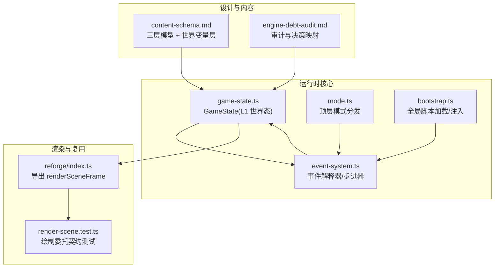
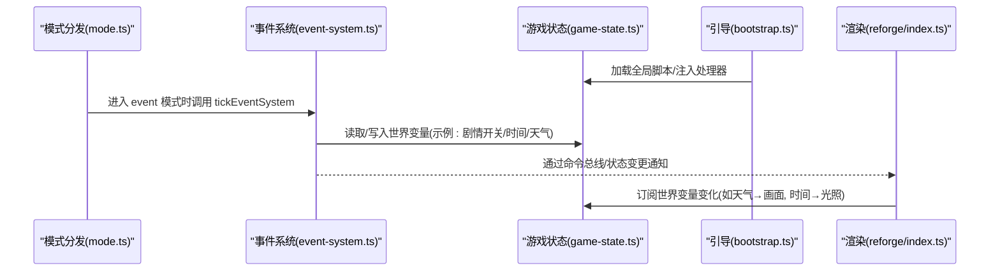
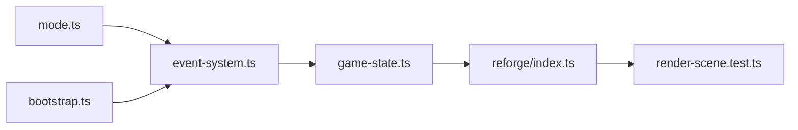

# 世界变量层

<cite>
**本文引用的文件**   
- [content-schema.md](file://docs/phase2/foundation/content-schema.md)
- [engine-debt-audit.md](file://docs/phase2/foundation/engine-debt-audit.md)
- [game-state.ts](file://packages/game/src/core/game-state.ts)
- [event-system.ts](file://packages/game/src/core/event-system.ts)
- [mode.ts](file://packages/game/src/core/mode.ts)
- [bootstrap.ts](file://packages/game/src/shell/bootstrap.ts)
- [render-scene.test.ts](file://packages/reforge/src/render-scene.test.ts)
- [index.ts](file://packages/reforge/src/index.ts)
</cite>

## 目录
1. [引言](#引言)
2. [项目结构](#项目结构)
3. [核心组件](#核心组件)
4. [架构总览](#架构总览)
5. [详细组件分析](#详细组件分析)
6. [依赖关系分析](#依赖关系分析)
7. [性能考量](#性能考量)
8. [故障排查指南](#故障排查指南)
9. [结论](#结论)
10. [附录](#附录)

## 引言
本文件聚焦“世界变量层”的统一建模与落地方案，目标是把原版隐式的对象状态（如宝箱已开、机关触发、NPC 行为等）显式化为可命名、可订阅、可跨场景持久化的世界变量。世界变量统一承载剧情开关、时间系统、天气系统等，为事件、演出、触发器提供一致的读写接口，并允许渲染与场景系统通过订阅机制响应变化。

## 项目结构
围绕世界变量层的工程位置与职责：
- 设计文档定义世界变量的定位、分层与迁移策略
- 游戏运行时以 GameState 作为单一真相源，承载 L1 世界态（含世界变量）
- 事件系统与模式分发负责在正确时机推进脚本、更新世界变量
- 渲染子系统通过命令总线或状态订阅与世界变量联动

图表来源
- [content-schema.md:23-48](file://docs/phase2/foundation/content-schema.md#L23-L48)
- [engine-debt-audit.md:291-316](file://docs/phase2/foundation/engine-debt-audit.md#L291-L316)
- [game-state.ts:655-700](file://packages/game/src/core/game-state.ts#L655-L700)
- [event-system.ts:1594-1623](file://packages/game/src/core/event-system.ts#L1594-L1623)
- [mode.ts:1-21](file://packages/game/src/core/mode.ts#L1-L21)
- [bootstrap.ts:1151-1168](file://packages/game/src/shell/bootstrap.ts#L1151-L1168)
- [index.ts:34-42](file://packages/reforge/src/index.ts#L34-L42)
- [render-scene.test.ts:1-28](file://packages/reforge/src/render-scene.test.ts#L1-L28)

章节来源
- [content-schema.md:23-48](file://docs/phase2/foundation/content-schema.md#L23-L48)
- [engine-debt-audit.md:291-316](file://docs/phase2/foundation/engine-debt-audit.md#L291-L316)

## 核心组件
- 世界变量层（L1 世界态的一部分）
  - 目标：将“剧情进度/时间/天气/自定义变量”从隐式对象状态显式化，形成一张命名表，供事件/演出/触发器读写，供渲染/场景订阅响应。
  - 范围：按设计文档，世界变量属于 L1 世界态，随存档贯穿整局；跨场景影响通过修改 L1 实现。
- GameState（单一真相源）
  - 承载 L1 世界态与运行期状态，包括队伍、角色属性、背包、金钱、经验、以及世界变量与对象状态覆盖等。
- 事件系统（EventSystem）
  - 驱动脚本执行、等待与跳转，读写 GameState 中的世界变量，并通过命令总线对外暴露副作用。
- 模式分发（Mode）
  - 根据当前模式（探索/事件/战斗/菜单）调度 tick，确保事件系统在正确时机推进。
- 引导与初始化（Bootstrap）
  - 加载全局脚本数组、注入处理器，保证事件系统有稳定数据源。
- 渲染子系统（Reforge）
  - 提供统一的场景帧绘制入口，便于编辑器与游戏共用；世界变量变化可通过订阅驱动画面（如光照、天气）。

章节来源
- [content-schema.md:23-48](file://docs/phase2/foundation/content-schema.md#L23-L48)
- [game-state.ts:655-700](file://packages/game/src/core/game-state.ts#L655-L700)
- [event-system.ts:1594-1623](file://packages/game/src/core/event-system.ts#L1594-L1623)
- [mode.ts:1-21](file://packages/game/src/core/mode.ts#L1-L21)
- [bootstrap.ts:1151-1168](file://packages/game/src/shell/bootstrap.ts#L1151-L1168)
- [index.ts:34-42](file://packages/reforge/src/index.ts#L34-L42)

## 架构总览
世界变量层处于 L1 世界态，被事件系统读写，被渲染/场景订阅。下图展示关键交互路径：

图表来源
- [mode.ts:1-21](file://packages/game/src/core/mode.ts#L1-L21)
- [event-system.ts:1594-1623](file://packages/game/src/core/event-system.ts#L1594-L1623)
- [game-state.ts:655-700](file://packages/game/src/core/game-state.ts#L655-L700)
- [bootstrap.ts:1151-1168](file://packages/game/src/shell/bootstrap.ts#L1151-L1168)
- [index.ts:34-42](file://packages/reforge/src/index.ts#L34-L42)

## 详细组件分析

### 世界变量 Schema 与类型约束
- 设计原则
  - 显式命名：用可读的语义名替代“第 N 号对象状态”。
  - 种类抽象：剧情开关、时间、天气、任意自定义变量统一纳入同一张表。
  - 权限控制：事件/演出/触发器可读写；渲染/场景只读订阅。
  - 默认值与约束：每个变量需声明默认值与类型约束（布尔/枚举/数值），并在加载时校验。
- 建议字段（概念性）
  - id: string（稳定语义名）
  - type: 'boolean' | 'number' | 'enum' | 'custom'
  - default: any（与 type 对应）
  - constraints?: { min?, max?, allowedValues? }
  - scope: 'global' | 'scene' | 'entity'
  - persist: boolean（是否随存档持久化）
- 说明
  - 本节为概念性 Schema 建议，用于指导后续实现与迁移器生成；具体实现细节将在代码落库后补充。

[本节为概念性说明，不直接分析具体源码文件]

### 读写权限与订阅响应
- 读写权限
  - 事件/演出/触发器：拥有写权限，通过 opcode 或动作节点修改世界变量。
  - 渲染/场景：仅读订阅，依据变量变化更新画面（如天气切换贴图、时间切换光照）。
- 订阅机制
  - 基于命令总线或事件总线：事件系统写入后发出变更事件，订阅者消费并应用。
  - 批量更新：支持事务式写入，避免中间态闪烁。
- 事件驱动更新
  - 世界变量变更 → 发布事件 → 订阅者回调 → 渲染/逻辑更新。

[本节为概念性说明，不直接分析具体源码文件]

### 在事件、演出、触发器中的使用
- 事件（Event System）
  - 在事件步进中读写世界变量，例如设置“拿到剑= true”、推进“天数+1”、切换“天气=雨”。
  - 事件系统通过 waiting 机制协调异步操作（如淡入淡出、场景加载），确保变量写入时序正确。
- 演出（Cutscene）
  - 演出时间线包含“改世界变量”的动作节点，与对话、镜头、音效等动作组合编排。
- 触发器（Triggers）
  - 条件包含“世界变量满足某值”，触发后执行一段演出或脚本。

章节来源
- [event-system.ts:1594-1623](file://packages/game/src/core/event-system.ts#L1594-L1623)
- [mode.ts:1-21](file://packages/game/src/core/mode.ts#L1-L21)

### 与渲染系统的集成
- 渲染入口
  - reforge 提供 renderSceneFrame 统一绘制入口，编辑器与游戏共用。
- 集成方式
  - 渲染侧订阅世界变量（如天气、时间），在每帧绘制前读取最新值，选择相应资源/参数。
  - 通过 renderSceneFrame 的 clear/save/scale/renderScene/restore 流程，保持纯绘制职责，避免副作用污染。

章节来源
- [index.ts:34-42](file://packages/reforge/src/index.ts#L34-L42)
- [render-scene.test.ts:1-28](file://packages/reforge/src/render-scene.test.ts#L1-L28)

### 从原版隐式对象状态到显式世界变量的迁移策略
- 现状
  - 原版无集中剧情变量，进度靠“对象状态”隐式记录（如 rgEventObject、rgObject、rgScene 的可变部分）。
- 迁移原则
  - 优先将可识别的“剧情开关/时间/天气”等隐式状态翻译为显式世界变量。
  - 无法显式化的保留对象状态机制，并标注原因。
  - 所有跨场景影响走 L1 世界态，确保场景自包含。
- 步骤
  - 梳理原版对象状态的使用点（脚本、触发器、渲染）。
  - 建立变量清单与映射规则（id、type、default、constraints、scope）。
  - 在迁移器中生成 world/world-variables.json 及默认值。
  - 在事件/演出/触发器中将旧判断替换为新变量查询。
  - 验证存档兼容性与回放一致性。

章节来源
- [content-schema.md:23-48](file://docs/phase2/foundation/content-schema.md#L23-L48)
- [engine-debt-audit.md:291-316](file://docs/phase2/foundation/engine-debt-audit.md#L291-L316)
- [game-state.ts:608-651](file://packages/game/src/core/game-state.ts#L608-L651)

### 运行时数据结构与边界
- GameState 作为单一真相源
  - 承载 L1 世界态（含世界变量）、运行期状态（事件游标、对话框、调色板等）。
  - 稀疏存储优化：仅保存被脚本改写过的对象/场景状态，减少内存占用。
- 事件游标与等待
  - 事件系统维护 eventCursor，支持多种 waiting 状态（对话、淡入淡出、场景加载、延迟等），保障多帧操作的时序。

章节来源
- [game-state.ts:655-700](file://packages/game/src/core/game-state.ts#L655-L700)
- [event-system.ts:1594-1623](file://packages/game/src/core/event-system.ts#L1594-L1623)

## 依赖关系分析
- 模块耦合
  - mode.ts 依赖 event-system.ts 进行事件模式步进。
  - event-system.ts 依赖 game-state.ts 读写世界变量与运行态。
  - bootstrap.ts 负责加载全局脚本并注入处理器，为 event-system.ts 提供数据源。
  - reforge/index.ts 导出渲染入口，供编辑器与游戏复用。
- 外部依赖
  - 渲染子系统通过 renderSceneFrame 与游戏主循环协作，世界变量变化通过订阅驱动渲染。

图表来源
- [mode.ts:1-21](file://packages/game/src/core/mode.ts#L1-L21)
- [event-system.ts:1594-1623](file://packages/game/src/core/event-system.ts#L1594-L1623)
- [game-state.ts:655-700](file://packages/game/src/core/game-state.ts#L655-L700)
- [bootstrap.ts:1151-1168](file://packages/game/src/shell/bootstrap.ts#L1151-L1168)
- [index.ts:34-42](file://packages/reforge/src/index.ts#L34-L42)
- [render-scene.test.ts:1-28](file://packages/reforge/src/render-scene.test.ts#L1-L28)

章节来源
- [mode.ts:1-21](file://packages/game/src/core/mode.ts#L1-L21)
- [event-system.ts:1594-1623](file://packages/game/src/core/event-system.ts#L1594-L1623)
- [game-state.ts:655-700](file://packages/game/src/core/game-state.ts#L655-L700)
- [bootstrap.ts:1151-1168](file://packages/game/src/shell/bootstrap.ts#L1151-L1168)
- [index.ts:34-42](file://packages/reforge/src/index.ts#L34-L42)
- [render-scene.test.ts:1-28](file://packages/reforge/src/render-scene.test.ts#L1-L28)

## 性能考量
- 稀疏存储：对对象/场景可变状态采用稀疏 Record，仅存被改写的条目，降低内存与序列化开销。
- 单 tick 指令限制：事件系统内置单 tick 指令上限，防止死循环导致卡顿。
- 渲染职责分离：renderSceneFrame 只做 clear/save/scale/renderScene/restore，避免副作用污染，利于编辑器复用。

章节来源
- [game-state.ts:608-651](file://packages/game/src/core/game-state.ts#L608-L651)
- [event-system.ts:1594-1623](file://packages/game/src/core/event-system.ts#L1594-L1623)
- [render-scene.test.ts:1-28](file://packages/reforge/src/render-scene.test.ts#L1-L28)

## 故障排查指南
- 事件未推进
  - 检查 eventCursor.waiting 是否为非空（如 scene-load、dialog、fade-screen 等），确认异步回调已完成且 cursor 已被替换。
- 变量未生效
  - 确认事件/演出/触发器是否正确写入世界变量；渲染侧是否正确订阅并读取最新值。
- 渲染异常
  - 核对 renderSceneFrame 调用顺序与 imageSmoothingEnabled 设置是否符合契约。

章节来源
- [event-system.ts:1594-1623](file://packages/game/src/core/event-system.ts#L1594-L1623)
- [render-scene.test.ts:1-28](file://packages/reforge/src/render-scene.test.ts#L1-L28)

## 结论
世界变量层通过将隐式对象状态显式化，提供了统一、可订阅、可跨场景的世界状态管理。配合事件系统与渲染子系统，可实现剧情、时间、天气等复杂行为的清晰建模与高效扩展。后续应完善 Schema 定义、默认值与约束校验，并在迁移器中落实映射规则，确保与原版的平滑过渡与一致性。

[本节为总结性内容，不直接分析具体源码文件]

## 附录
- 术语
  - L1/L2/L3：世界态/场景静态定义/场景运行态的分层模型。
  - 事件游标：事件系统在执行脚本时的上下文指针与等待状态。
  - 渲染契约：renderSceneFrame 的 clear/save/scale/renderScene/restore 调用顺序与参数约定。

[本节为概念性说明，不直接分析具体源码文件]