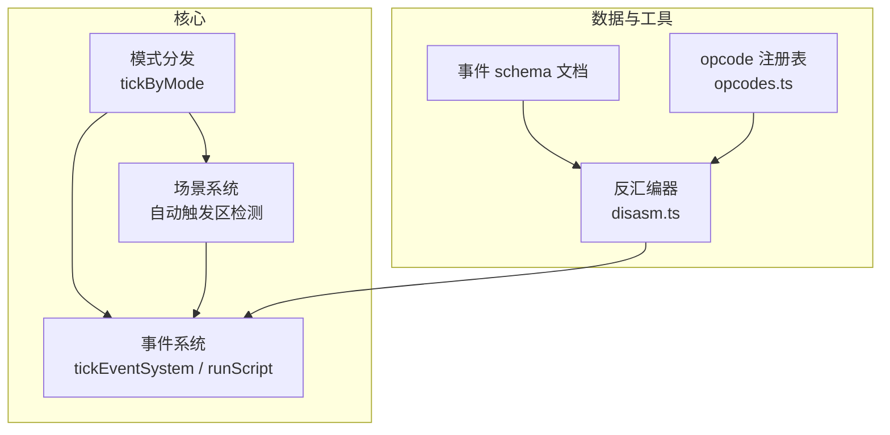
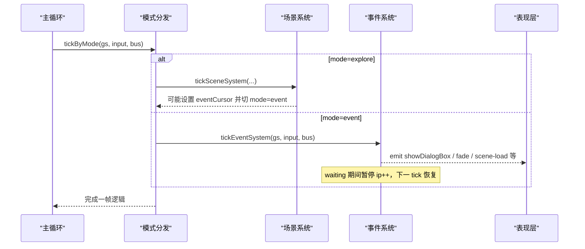
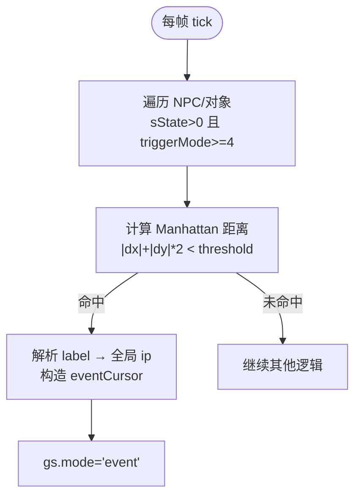
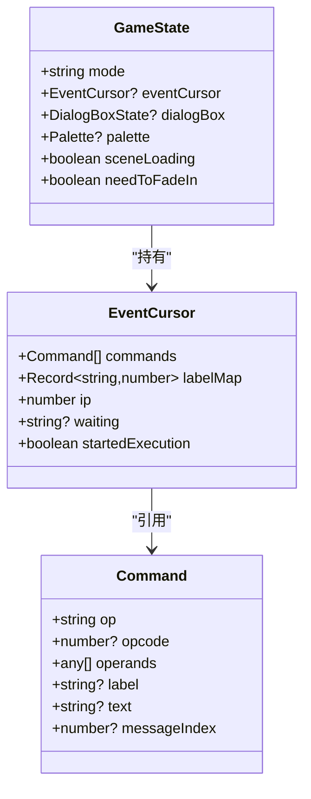
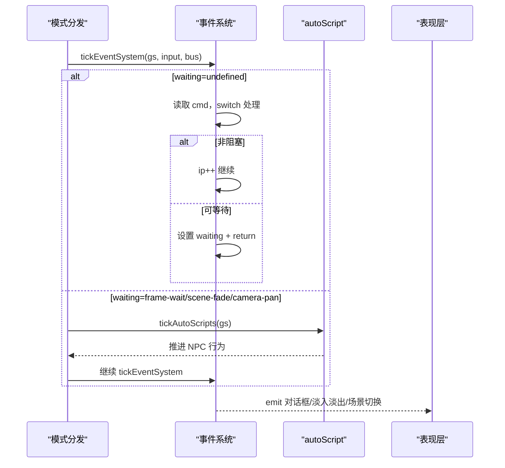
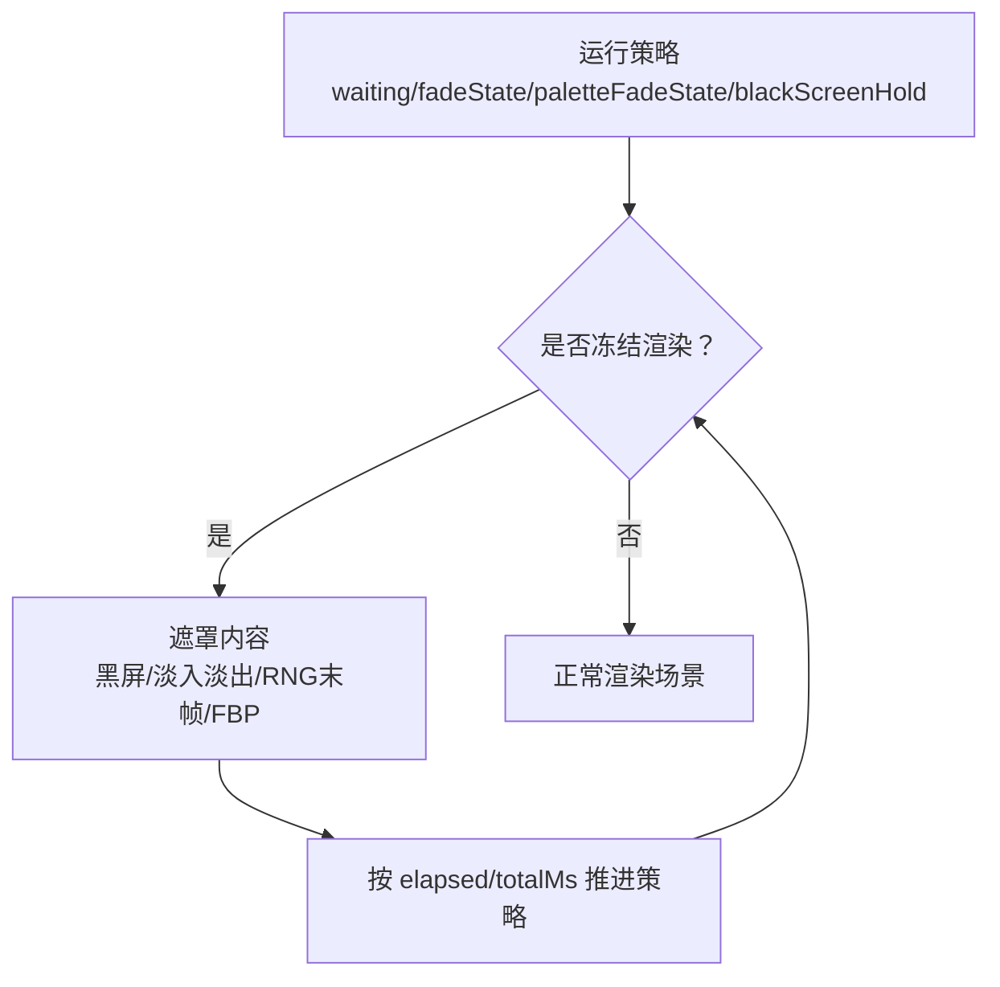
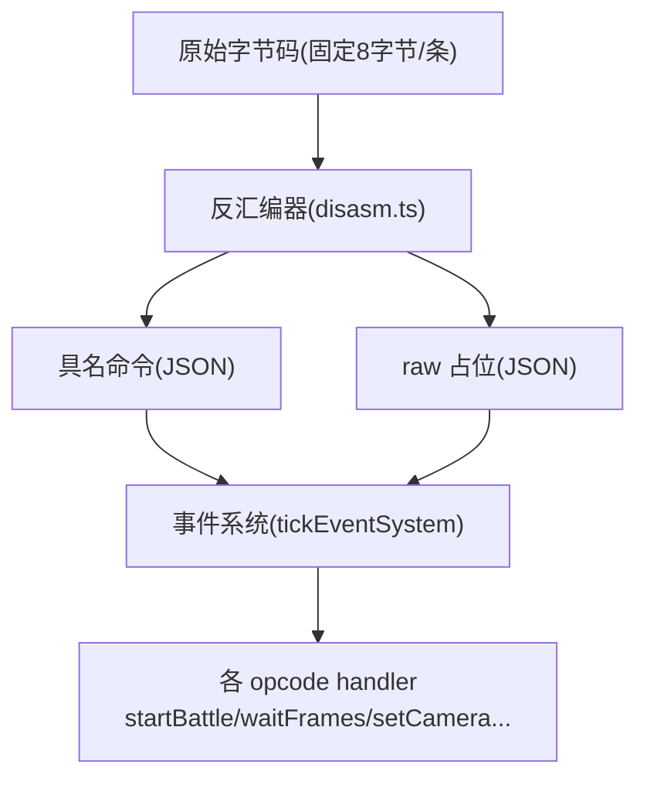
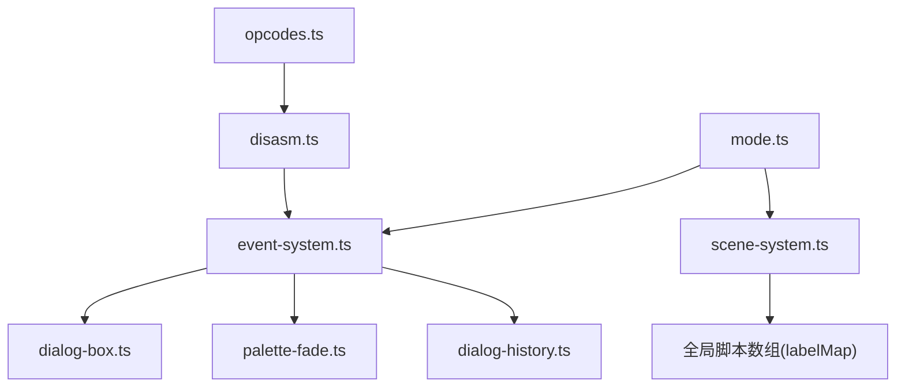

# 事件与演出系统

<cite>
**本文引用的文件**   
- [event-system.ts](file://packages/game/src/core/event-system.ts)
- [mode.ts](file://packages/game/src/core/mode.ts)
- [scene-system.ts](file://packages/game/src/core/scene-system.ts)
- [05-events-schema.md](file://docs/phase1/05-events-schema.md)
- [2026-05-23-m2-runtime-slice-design.md](file://docs/phase1/plans/2026-05-23-m2-runtime-slice-design.md)
- [2026-05-23-m2-runtime-slice.md](file://docs/phase1/plans/2026-05-23-m2-runtime-slice.md)
- [opcodes.ts](file://packages/pal-extract/src/events/opcodes.ts)
- [disasm.ts](file://packages/pal-extract/src/events/disasm.ts)
</cite>

## 目录
1. [简介](#简介)
2. [项目结构](#项目结构)
3. [核心组件](#核心组件)
4. [架构总览](#架构总览)
5. [详细组件分析](#详细组件分析)
6. [依赖关系分析](#依赖关系分析)
7. [性能考量](#性能考量)
8. [故障排查指南](#故障排查指南)
9. [结论](#结论)
10. [附录](#附录)

## 简介
本文件系统化阐述“事件与演出系统”的三块正交设计：触发器（何时）、演出时间线（演什么）、脚本执行器（如何推进）。重点覆盖：
- 触发器的条件系统：接触检测、范围判断、进场事件、世界变量变化监听等触发类型。
- 演出时间线的动作词汇表：淡入淡出、精灵移动、文本显示、镜头控制、世界变量修改等 action 类型。
- 黑屏遮罩的正交二维设计：运行策略 + 遮罩内容，解释其实现与扩展点。
- opcode 兼容层：从原始字节码到具名命令的转换、运行时 raw 兜底与迁移策略。

## 项目结构
事件与演出系统位于游戏核心模块中，由模式分发器统一调度，场景系统负责触发判定，事件系统负责协程式步进执行，提取工具链负责将原版字节码反汇编为可读 JSON 并回填标签。

图表来源
- [mode.ts:15-88](file://packages/game/src/core/mode.ts#L15-L88)
- [event-system.ts:1496-1599](file://packages/game/src/core/event-system.ts#L1496-L1599)
- [scene-system.ts:104-140](file://packages/game/src/core/scene-system.ts#L104-L140)
- [05-events-schema.md:1-158](file://docs/phase1/05-events-schema.md#L1-L158)
- [disasm.ts:58-98](file://packages/pal-extract/src/events/disasm.ts#L58-L98)
- [opcodes.ts:212-227](file://packages/pal-extract/src/events/opcodes.ts#L212-L227)

章节来源
- [mode.ts:15-88](file://packages/game/src/core/mode.ts#L15-L88)
- [event-system.ts:1496-1599](file://packages/game/src/core/event-system.ts#L1496-L1599)
- [scene-system.ts:104-140](file://packages/game/src/core/scene-system.ts#L104-L140)
- [05-events-schema.md:1-158](file://docs/phase1/05-events-schema.md#L1-L158)
- [disasm.ts:58-98](file://packages/pal-extract/src/events/disasm.ts#L58-L98)
- [opcodes.ts:212-227](file://packages/pal-extract/src/events/opcodes.ts#L212-L227)

## 核心组件
- 模式分发器：按当前模式（探索/事件/战斗/菜单）调用对应 tick；在事件模式下放行 autoScript 的条件门控，确保 NPC 行为不被对话或淡入阻塞。
- 事件系统：协程式步进器，loop-until-waitable 推进非阻塞指令，遇到可等待指令（对话框、淡入淡出、帧等待、场景切换等）挂起 waiting，下一 tick 继续。
- 场景系统：每帧扫描自动触发区域（Manhattan 距离阈值），命中后加载事件脚本并进入事件模式。
- 提取工具链：将 SSS.MKF 中的字节码反汇编为 events.json，填充 label、message 内联、raw 占位，支持 round-trip 验证。

章节来源
- [mode.ts:15-88](file://packages/game/src/core/mode.ts#L15-L88)
- [event-system.ts:1496-1599](file://packages/game/src/core/event-system.ts#L1496-L1599)
- [scene-system.ts:104-140](file://packages/game/src/core/scene-system.ts#L104-L140)
- [05-events-schema.md:1-158](file://docs/phase1/05-events-schema.md#L1-L158)

## 架构总览
事件与演出系统的整体流程如下：主循环每 tick 调用 tickByMode，根据 gs.mode 分派到具体子系统。事件模式下的 tickEventSystem 维护一个 EventCursor（commands、labelMap、ip、waiting 等），以协程方式推进。autoScript 在特定 waiting 状态下仍被允许运行，保证 NPC 行为自然。

图表来源
- [mode.ts:15-88](file://packages/game/src/core/mode.ts#L15-L88)
- [event-system.ts:1496-1599](file://packages/game/src/core/event-system.ts#L1496-L1599)
- [scene-system.ts:104-140](file://packages/game/src/core/scene-system.ts#L104-L140)

## 详细组件分析

### 触发器（何时）：条件系统与触发类型
- 接触检测与范围判断：基于 Manhattan 距离公式，不同 triggerMode 对应不同阈值，命中后加载对应脚本入口并进入事件模式。
- 进场事件：场景 onEnter 脚本在 bootstrap 装配阶段即注入 eventCursor，第一 tick 开始跑，直到 end 返回 explore。
- 世界变量变化监听：通过 opcode 条件跳转（如物品不足、队伍状态、对象状态、场景号等）实现分支；也可通过 setGlobalEvents 注入全局脚本数组与 labelMap，供 goto/call 使用。
- 自动触发区：对 sState>0 且 triggerMode>=4 的对象进行距离判定，避免误触搜索段（triggerMode<4）。

图表来源
- [scene-system.ts:104-140](file://packages/game/src/core/scene-system.ts#L104-L140)
- [05-events-schema.md:138-158](file://docs/phase1/05-events-schema.md#L138-L158)

章节来源
- [scene-system.ts:104-140](file://packages/game/src/core/scene-system.ts#L104-L140)
- [05-events-schema.md:138-158](file://docs/phase1/05-events-schema.md#L138-L158)

### 演出时间线（演什么）：动作词汇表
事件脚本由具名命令与 raw 兜底组成，常见动作包括：
- 文本显示：showDialog、setDialogStyleTop/Center/Bottom/Narration，支持颜色、头像、分页、自动消失等。
- 镜头控制：OP_SET_CAMERA（多帧平移/绝对定位/回正）、OP_CENTER_CAMERA_ON_PARTY。
- 淡入淡出：OP_FADE_SCREEN、OP_FADE_OUT、OP_FADE_IN、OP_SCENE_FADE、OP_COLOR_FADE、OP_PALETTE_FADE、OP_FADE_TO_RED。
- 精灵移动：NPC 走一步/走到目标（含速度）、主角同步行走、对象位置/层级/动画帧推进。
- 世界变量修改：加减现金、增减物品、设置对象状态、设置队伍成员、设置地图、设置音乐/音效、设置昼夜调色板等。
- 结构化控制：goto、end（advance/reset）、call-script、随机跳转、延迟、等待按键、商店菜单、RNG/FBP 播放、结局动画、退出游戏等。

图表来源
- [event-system.ts:1496-1599](file://packages/game/src/core/event-system.ts#L1496-L1599)
- [event-system.ts:1157-1163](file://packages/game/src/core/event-system.ts#L1157-L1163)

章节来源
- [event-system.ts:1496-1599](file://packages/game/src/core/event-system.ts#L1496-L1599)
- [event-system.ts:1157-1163](file://packages/game/src/core/event-system.ts#L1157-L1163)

### 脚本执行器（如何推进）：协程式步进器
- loop-until-waitable：单 tick 内连跑非阻塞命令，遇 waitable/end/越界才返回。
- waiting 语义：frame-wait、fade-screen、palette-fade、scene-fade、scene-load、dialog、confirm、wait-key、shop、rng-play、show-fbp、scroll-fbp、ending-anim、quit 等。
- 自动脚本（autoScript）：每 tick 推进一条命令（跳转除外），在特定 waiting 状态下仍运行，保证 NPC 行为不冻结。
- 持久化：trigger 脚本结束时的 advance/reset 会更新对象的 triggerResume，避免重复重播已播片段。

图表来源
- [mode.ts:15-88](file://packages/game/src/core/mode.ts#L15-L88)
- [event-system.ts:1496-1599](file://packages/game/src/core/event-system.ts#L1496-L1599)

章节来源
- [mode.ts:15-88](file://packages/game/src/core/mode.ts#L15-L88)
- [event-system.ts:1496-1599](file://packages/game/src/core/event-system.ts#L1496-L1599)

### 黑屏遮罩的正交二维设计：运行策略 + 遮罩内容
- 运行策略（strategy）：决定何时冻结渲染、何时解冻、是否允许 autoScript 运行。例如：
  - 'fade-screen'：time-based 淡入淡出，present 层按 elapsed/totalMs 应用步骤。
  - 'palette-fade'/'scene-fade'：调色板 ramp，前者冻全场，后者放行 autoScript。
  - 'scene-load'：异步加载新场景资源，callback 完成后替换 cursor 并续跑。
  - 'blackScreenHold'：ShowFBP 全屏图时强制黑屏，避免残留立绘像素。
- 遮罩内容（mask content）：实际绘制的内容，如黑色 alpha overlay、RNG 末帧叠字、FBP 全屏图、结尾动画等。
- 正交性：策略只控制时序与 gate，内容只负责视觉呈现，二者解耦便于组合与扩展。

图表来源
- [event-system.ts:2493-2513](file://packages/game/src/core/event-system.ts#L2493-L2513)
- [event-system.ts:1563-1592](file://packages/game/src/core/event-system.ts#L1563-L1592)
- [event-system.ts:1594-1599](file://packages/game/src/core/event-system.ts#L1594-L1599)

章节来源
- [event-system.ts:2493-2513](file://packages/game/src/core/event-system.ts#L2493-L2513)
- [event-system.ts:1563-1592](file://packages/game/src/core/event-system.ts#L1563-L1592)
- [event-system.ts:1594-1599](file://packages/game/src/core/event-system.ts#L1594-L1599)

### opcode 兼容层：实现方案与迁移策略
- 反汇编阶段：
  - 具名 opcode：通过注册表（opcodes.ts）定义 name、fields、kind（value/label/message/object 等），转写为具名 JSON。
  - 未具名 opcode：填充 raw 占位，保留 opcode 与 operands，支持 round-trip。
  - 标签生成：第二遍 BFS 收集跳转目标与 entry ips，打 L_<n> 标签，goto 目标转为标签名。
- 运行时阶段：
  - 具名命令：事件系统直接 switch 处理（showDialog/goto/end 等）。
  - raw 命令：applyRawOpcode 统一派发，按 opcode 常量分支处理（如 OP_START_BATTLE、OP_WAIT_FRAMES、OP_SET_CAMERA 等）。
  - 迁移策略：逐步将 raw 分支具名化，完善字段映射与行为，保持 backward compatibility。

图表来源
- [disasm.ts:58-98](file://packages/pal-extract/src/events/disasm.ts#L58-L98)
- [opcodes.ts:212-227](file://packages/pal-extract/src/events/opcodes.ts#L212-L227)
- [event-system.ts:2182-2399](file://packages/game/src/core/event-system.ts#L2182-L2399)

章节来源
- [disasm.ts:58-98](file://packages/pal-extract/src/events/disasm.ts#L58-L98)
- [opcodes.ts:212-227](file://packages/pal-extract/src/events/opcodes.ts#L212-L227)
- [event-system.ts:2182-2399](file://packages/game/src/core/event-system.ts#L2182-L2399)

## 依赖关系分析
- 模式分发器依赖事件系统与场景系统，事件系统依赖命令总线、对话框状态机、调色板淡入淡出、字幕历史等。
- 场景系统依赖全局事件数组与 labelMap，用于自动触发区命中后加载脚本。
- 提取工具链依赖 opcode 注册表与消息表，产出 events.json，供运行时加载。

图表来源
- [mode.ts:15-88](file://packages/game/src/core/mode.ts#L15-L88)
- [event-system.ts:1496-1599](file://packages/game/src/core/event-system.ts#L1496-L1599)
- [scene-system.ts:104-140](file://packages/game/src/core/scene-system.ts#L104-L140)
- [disasm.ts:58-98](file://packages/pal-extract/src/events/disasm.ts#L58-L98)
- [opcodes.ts:212-227](file://packages/pal-extract/src/events/opcodes.ts#L212-L227)

章节来源
- [mode.ts:15-88](file://packages/game/src/core/mode.ts#L15-L88)
- [event-system.ts:1496-1599](file://packages/game/src/core/event-system.ts#L1496-L1599)
- [scene-system.ts:104-140](file://packages/game/src/core/scene-system.ts#L104-L140)
- [disasm.ts:58-98](file://packages/pal-extract/src/events/disasm.ts#L58-L98)
- [opcodes.ts:212-227](file://packages/pal-extract/src/events/opcodes.ts#L212-L227)

## 性能考量
- 单 tick 指令上限：SINGLE_TICK_LIMIT 防止死循环（goto 自指/raw 链），超限抛错保护。
- time-based 淡入淡出：不受 raf 帧率影响，忠实还原 sdlpal 节拍。
- autoScript 门控：仅在特定 waiting 状态下运行，避免不必要的 CPU 开销。
- 全局脚本数组：单一数组 + labelMap，减少内存占用与跨场景指针解析复杂度。

[本节提供一般性指导，无需特定文件分析]

## 故障排查指南
- 对话遮挡问题：pre-op ClearDialog 机制在非 dialog opcode 前清屏，避免 NPC 动画/pose 切换时旧对话框遮挡。
- 黑屏永久问题：needToFadeIn 消费路径需覆盖 content-no-fade onEnter 的首个可渲染 yield（showDialog/0x05/redraw/tickSceneAutoFadeIn）。
- 自动触发区误判：检查 triggerMode 与 Manhattan 距离阈值，确保 mode>=4 才自动触发。
- 自动脚本冻结：确认 waiting 门控（frame-wait/scene-fade/camera-pan）是否正确放行 autoScript。

章节来源
- [event-system.ts:1869-1911](file://packages/game/src/core/event-system.ts#L1869-L1911)
- [event-system.ts:645-671](file://packages/game/src/core/event-system.ts#L645-L671)
- [scene-system.ts:104-140](file://packages/game/src/core/scene-system.ts#L104-L140)
- [mode.ts:23-50](file://packages/game/src/core/mode.ts#L23-L50)

## 结论
事件与演出系统通过“触发器—时间线—执行器”的正交设计，实现了高内聚、低耦合的可扩展架构。触发器负责“何时”，时间线负责“演什么”，执行器负责“如何推进”。黑屏遮罩采用运行策略与遮罩内容的二维正交，便于组合与演进。opcode 兼容层保障从原始字节码到具名命令的平滑迁移，同时维持向后兼容。

[本节总结无特定文件分析]

## 附录
- 参考设计文档：runtime slice 设计与事件 schema 文档提供了更详细的背景与决策依据。

章节来源
- [2026-05-23-m2-runtime-slice-design.md:204-230](file://docs/phase1/plans/2026-05-23-m2-runtime-slice-design.md#L204-L230)
- [2026-05-23-m2-runtime-slice.md:1576-1696](file://docs/phase1/plans/2026-05-23-m2-runtime-slice.md#L1576-L1696)
- [05-events-schema.md:1-158](file://docs/phase1/05-events-schema.md#L1-L158)