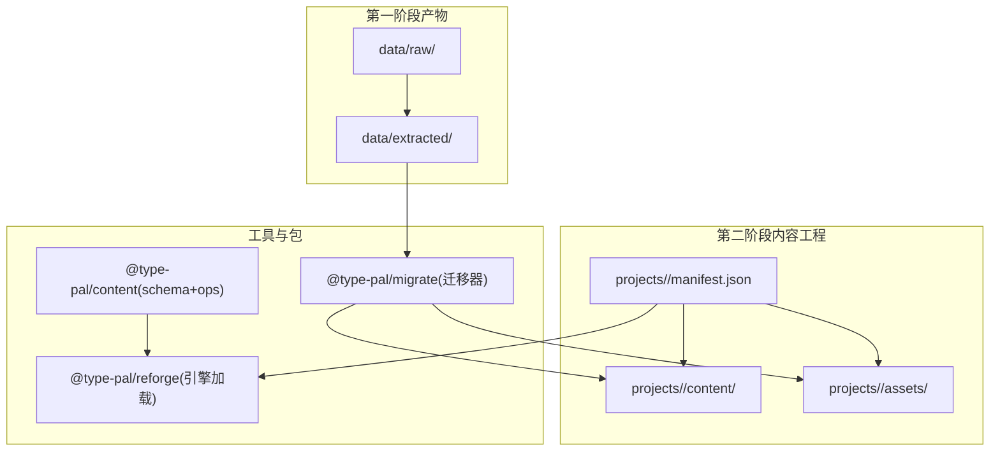
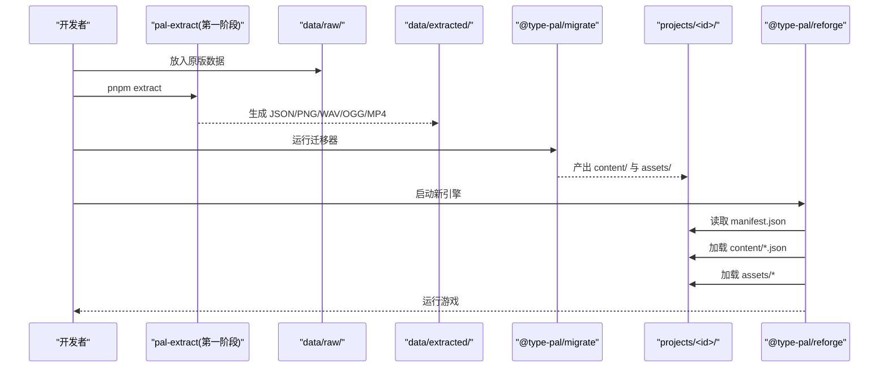
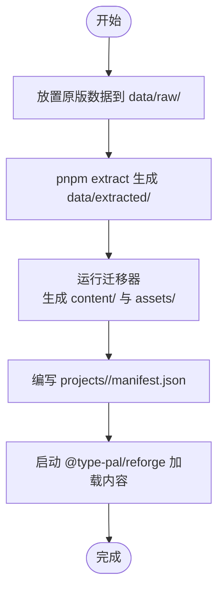
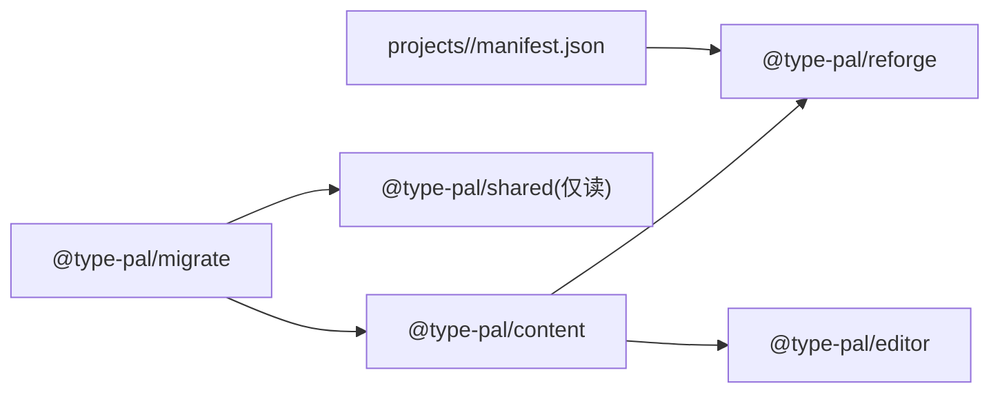

# 内容工程目录结构

<cite>
**本文引用的文件**
- [README.md](file://README.md)
- [content-schema.md](file://docs/phase2/foundation/content-schema.md)
- [project-design.md](file://docs/phase2/editor/project-design.md)
- [engine-debt-audit.md](file://docs/phase2/foundation/engine-debt-audit.md)
- [package.json](file://packages/content/package.json)
- [index.ts](file://packages/migrate/src/index.ts)
- [migrate README.md](file://packages/migrate/README.md)
- [manifest.json](file://projects/demo/manifest.json)
- [loader.test.ts](file://packages/reforge/src/loader.test.ts)
- [SceneAssetsCache](file://packages/game/src/assets/loader.ts)
</cite>

## 目录
1. [引言](#引言)
2. [项目结构](#项目结构)
3. [核心组件](#核心组件)
4. [架构总览](#架构总览)
5. [详细组件分析](#详细组件分析)
6. [依赖分析](#依赖分析)
7. [性能考虑](#性能考虑)
8. [故障排查指南](#故障排查指南)
9. [结论](#结论)
10. [附录](#附录)

## 引言
本文件聚焦“内容工程”的目录结构与组织原则，围绕第二阶段（Reforge）的内容模型与工程化流程展开。目标包括：
- 解释 content/ 目录的职责划分与命名约定
- 明确内容源与 data/extracted/ 的区别及迁移后的独立维护策略
- 给出内容工程的初始化流程、版本控制与团队协作规范
- 说明内容验证工具、构建流程与部署配置要点

## 项目结构
第二阶段将“内容数据”从第一阶段产物中解耦，形成独立、可版本化的内容工程。顶层结构如下：
- packages/content：内容 schema 类型与纯逻辑（零依赖叶子包）
- projects/<id>/：一个文件夹 = 一个游戏工程，包含 manifest.json、content/、assets/
- data/extracted/：第一阶段提取产物，仅作为迁移器输入，不再被新引擎直接消费
- packages/migrate：从 data/extracted/ 到 content 的一次性迁移器
- packages/reforge：新引擎运行时（加载 manifest + content JSON + assets）

图示来源
- [content-schema.md:99-111](file://docs/phase2/foundation/content-schema.md#L99-L111)
- [project-design.md:32-75](file://docs/phase2/editor/project-design.md#L32-L75)
- [manifest.json:1-33](file://projects/demo/manifest.json#L1-L33)

章节来源
- [README.md:66-79](file://README.md#L66-L79)
- [content-schema.md:99-111](file://docs/phase2/foundation/content-schema.md#L99-L111)
- [project-design.md:32-75](file://docs/phase2/editor/project-design.md#L32-L75)

## 核心组件
- 内容 Schema 与操作（@type-pal/content）
  - 提供场景、角色、物品、技能、文本等数据的类型定义与校验/操作函数
  - 作为“叶子包”，不依赖引擎或编辑器，供 reforge 与 editor 共同消费
- 迁移器（@type-pal/migrate）
  - 一次性把 data/extracted/ 转成 content 数据模型与 RGBA 资产
  - 负责全局下标→稳定 id、脚本拆分、素材归位、世界变量显式化
- 内容工程（projects/<id>/）
  - manifest.json 声明内容路径、资源路径、入口场景与初始世界态
  - content/ 存放纯 JSON 数据；assets/ 存放 PNG/JSON 等资源索引
- 引擎加载（@type-pal/reforge）
  - 读取 manifest.json，按路径加载 content JSON 与 assets，组装运行期对象

章节来源
- [package.json:1-17](file://packages/content/package.json#L1-L17)
- [index.ts:1-12](file://packages/migrate/src/index.ts#L1-L12)
- [migrate README.md:1-32](file://packages/migrate/README.md#L1-L32)
- [manifest.json:1-33](file://projects/demo/manifest.json#L1-L33)
- [loader.test.ts:1-24](file://packages/reforge/src/loader.test.ts#L1-L24)

## 架构总览
内容工程在“旧产物 → 新内容 → 新引擎”的链路中扮演枢纽角色。

图示来源
- [README.md:66-79](file://README.md#L66-L79)
- [migrate README.md:1-32](file://packages/migrate/README.md#L1-L32)
- [manifest.json:1-33](file://projects/demo/manifest.json#L1-L33)

## 详细组件分析

### content/ 目录职责与子目录规范
- world/
  - 存放世界级数据：世界变量定义、角色模板、数据表（items/spells/enemies 等）
  - 这些是 L1 世界态的数据基础，随存档贯穿整局
- scenes/<name>/
  - 每个场景一个自包含包：map、entities、cutscenes、triggers、entry 等
  - 属于 L2 场景静态定义，只读、可版本化
- shared/
  - 共享脚本与演出库，供多场景复用
- assets/
  - sprite/tile/palette 等资源的索引与引用（PNG 为主）
  - 由迁移器从 data/extracted/ 烘焙并归位

命名约定
- 使用稳定 id / 语义名，杜绝数组下标作为身份
- 跨场景引用采用稳定 ref（如 scene:id / obj:id）
- 场景包内实体统一 entity 模型，装饰/交互/AI 通过可选组件表达

章节来源
- [content-schema.md:23-67](file://docs/phase2/foundation/content-schema.md#L23-L67)
- [content-schema.md:99-111](file://docs/phase2/foundation/content-schema.md#L99-L111)

### 内容源 vs data/extracted/ 的区别
- data/extracted/
  - 第一阶段产物，由 pal-extract 从 data/raw/ 解码生成
  - 是“真值锚”与迁移器的输入，不应手动修改
- content/（内容工程）
  - 第二阶段独立内容源，文本友好、可 diff、可版本化
  - 由迁移器一次性导入后，独立维护，不再受 pnpm extract 覆盖

章节来源
- [README.md:66-79](file://README.md#L66-L79)
- [content-schema.md:99-111](file://docs/phase2/foundation/content-schema.md#L99-L111)
- [engine-debt-audit.md:131-139](file://docs/phase2/foundation/engine-debt-audit.md#L131-L139)

### 迁移器与资产管线
- 数据迁移
  - 拆 all.json 全局脚本为各场景 + shared/，label 局部化
  - 全局下标 → 稳定 id；隐式对象状态记忆 → 显式世界变量
- 资产迁移
  - indexed/原格式 → RGBA（bakeIndexedRgba），palette 标准以 palette 0 为准
  - 产物先落至临时位置，待内容工程目录落地后迁入 projects/<id>/assets/

章节来源
- [index.ts:1-12](file://packages/migrate/src/index.ts#L1-L12)
- [migrate README.md:1-32](file://packages/migrate/README.md#L1-L32)
- [content-schema.md:113-122](file://docs/phase2/foundation/content-schema.md#L113-L122)

### 内容工程初始化流程
- 准备原始数据：将原版数据放入 data/raw/
- 提取第一阶段产物：pnpm extract → data/extracted/
- 运行迁移器：将 extracted 转为 content 数据与 RGBA 资产
- 创建工程清单：在 projects/<id>/manifest.json 中声明 content 与 assets 路径、入口场景与初始世界态
- 启动新引擎：reforge 读取 manifest.json，按需加载 content JSON 与 assets

图示来源
- [README.md:66-79](file://README.md#L66-L79)
- [manifest.json:1-33](file://projects/demo/manifest.json#L1-L33)
- [migrate README.md:1-32](file://packages/migrate/README.md#L1-L32)

### 版本控制与协作规范
- 提交粒度
  - 以“场景包”为单位变更，保持场景自包含
  - 世界变量与数据表变更走独立 PR，便于回滚与审计
- 命名与 ID
  - 所有实体使用稳定 id/语义名，禁止下标
  - 跨场景引用必须显式且可读
- 文档与状态
  - 新增/修改内容需同步更新对应 spec/design/plan
  - 完成度以状态表为准，避免百分比描述

章节来源
- [content-schema.md:33-40](file://docs/phase2/foundation/content-schema.md#L33-L40)
- [content-schema.md:99-111](file://docs/phase2/foundation/content-schema.md#L99-L111)

### 内容验证工具与测试
- 类型与单元测试
  - @type-pal/content 提供 typecheck 与 vitest 单测
- 场景资源缓存
  - SceneAssetsCache 基于 Map 顺序实现 LRU，支持保护项与淘汰回调
- 引擎加载校验
  - loader.test.ts 对 LoadedManifest 进行断言，确保 manifest 字段完整

章节来源
- [package.json:11-15](file://packages/content/package.json#L11-L15)
- [SceneAssetsCache:451-499](file://packages/game/src/assets/loader.ts#L451-L499)
- [loader.test.ts:1-24](file://packages/reforge/src/loader.test.ts#L1-L24)

### 构建流程与部署配置
- 开发命令
  - pnpm check：全 workspace 类型检查与测试
  - pnpm extract：重新生成 data/extracted/
  - pnpm --filter @type-pal/game dev：第一阶段浏览器运行时
  - pnpm --filter @type-pal/reforge dev：第二阶段新引擎 demo
- 生产构建
  - 新引擎通过 manifest.assets 注入资源根路径，不再硬编码 /extracted
  - 离线预缓存与服务端配置沿用现有脚本与 SW 能力（第二阶段视目标决定是否继承）

章节来源
- [README.md:80-97](file://README.md#L80-L97)
- [project-design.md:32-75](file://docs/phase2/editor/project-design.md#L32-L75)

## 依赖分析
- 包拓扑
  - content 是零依赖叶子，reforge 与 editor 都只依赖它
  - migrate 是唯一合法依赖第一阶段 shared 的第二阶段包（两阶段桥）
- 关键依赖关系
  - reforge 加载 manifest.json → 按 content.* 路径加载 JSON → 按 assets.* 路径加载资源
  - content 的类型与 ops 被 reforge/editor 共用

图示来源
- [project-design.md:32-75](file://docs/phase2/editor/project-design.md#L32-L75)
- [index.ts:1-12](file://packages/migrate/src/index.ts#L1-L12)
- [manifest.json:1-33](file://projects/demo/manifest.json#L1-L33)

章节来源
- [project-design.md:32-75](file://docs/phase2/editor/project-design.md#L32-L75)
- [index.ts:1-12](file://packages/migrate/src/index.ts#L1-L12)

## 性能考虑
- 场景资源缓存
  - 使用 Map 插入序实现 LRU，命中时刷新 MRU，支持保护项与淘汰回调
- 资源路径注入
  - 通过 manifest.assets 动态注入资源根路径，减少硬耦合与重构成本
- 迁移产物优化
  - 资产烘焙为 RGBA，避免运行时 palette 查表开销

章节来源
- [SceneAssetsCache:451-499](file://packages/game/src/assets/loader.ts#L451-L499)
- [project-design.md:32-75](file://docs/phase2/editor/project-design.md#L32-L75)
- [migrate README.md:1-32](file://packages/migrate/README.md#L1-L32)

## 故障排查指南
- 常见问题定位
  - 若出现方块字或乱码：确认是否已重跑 pnpm extract，文本解码修复需在提取阶段生效
  - 若资源路径错误：检查 manifest.json 的 assets.* 字段是否与 projects/<id>/assets/ 实际结构一致
  - 若场景切换卡顿：关注 SceneAssetsCache 的 maxEntries 与 onEvict 行为
- 回归与比对
  - 使用 pnpm check 与 vitest 单测快速定位类型与逻辑问题
  - 对照 engine-debt-audit 中的 P0 条目，确保新引擎未引入旧债模式

章节来源
- [README.md:66-79](file://README.md#L66-L79)
- [SceneAssetsCache:451-499](file://packages/game/src/assets/loader.ts#L451-L499)
- [engine-debt-audit.md:34-166](file://docs/phase2/foundation/engine-debt-audit.md#L34-L166)

## 结论
通过将内容数据从第一阶段产物中解耦，建立独立的 content/ 工程与迁移器，项目在可维护性、可扩展性与团队协作方面获得显著提升。配合稳定的 schema、场景自包含与资源路径注入，新引擎能够以更清晰的方式加载与运行内容，同时为后续编辑器与 MMO 预留了良好基础。

## 附录
- 术语
  - L1/L2/L3：世界态/场景静态/场景运行态三层模型
  - 稳定 id：人类可读的语义标识，用于替代数组下标
  - 场景包：自包含的场景定义集合（地图、实体、演出、触发器等）
- 参考
  - 内容 Schema 设计：[content-schema.md](file://docs/phase2/foundation/content-schema.md)
  - 编辑器与项目设计：[project-design.md](file://docs/phase2/editor/project-design.md)
  - 引擎债务审计：[engine-debt-audit.md](file://docs/phase2/foundation/engine-debt-audit.md)