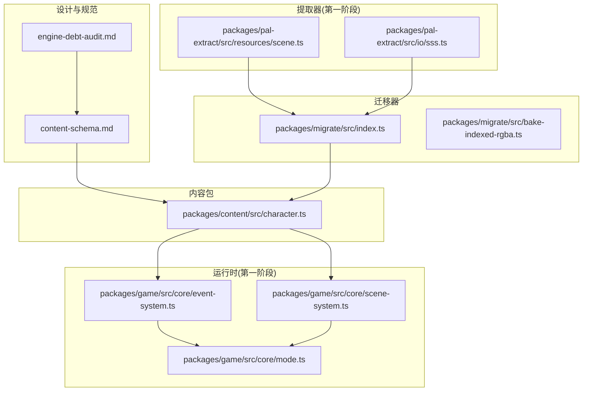
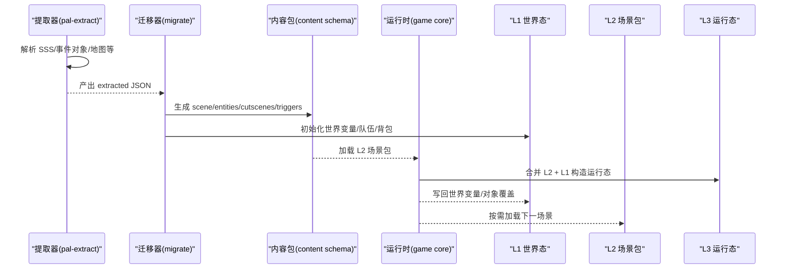
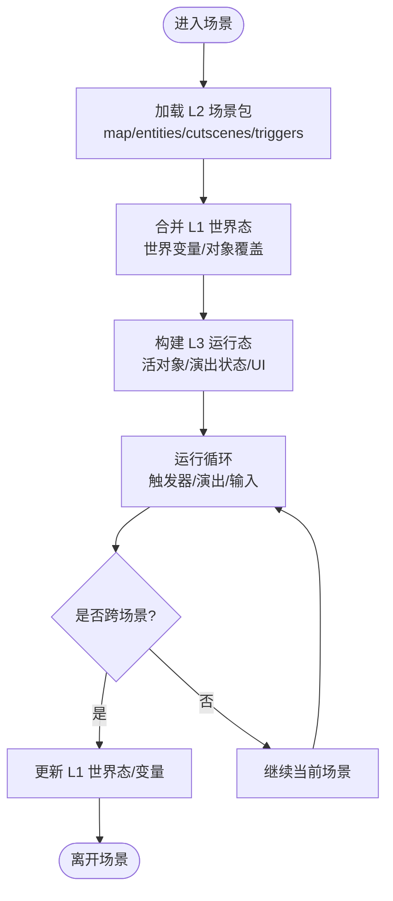
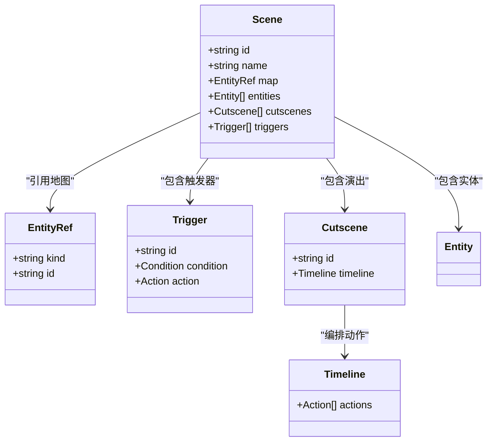
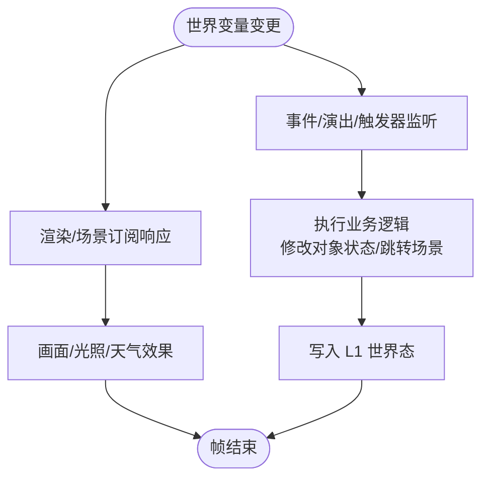
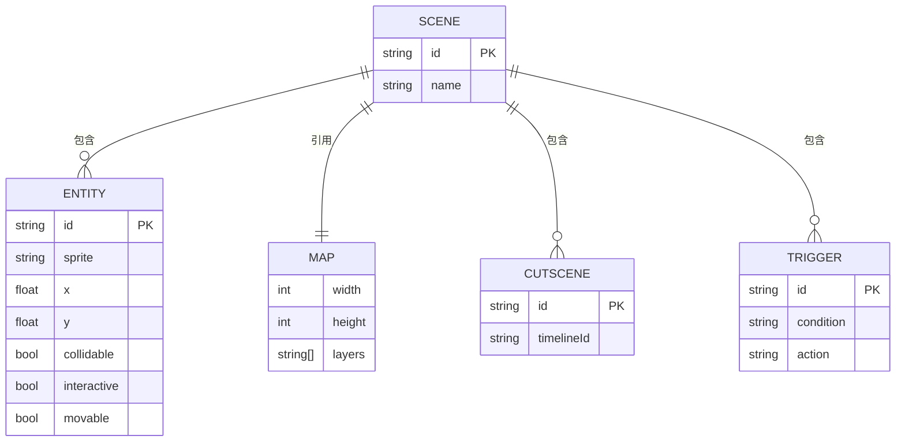
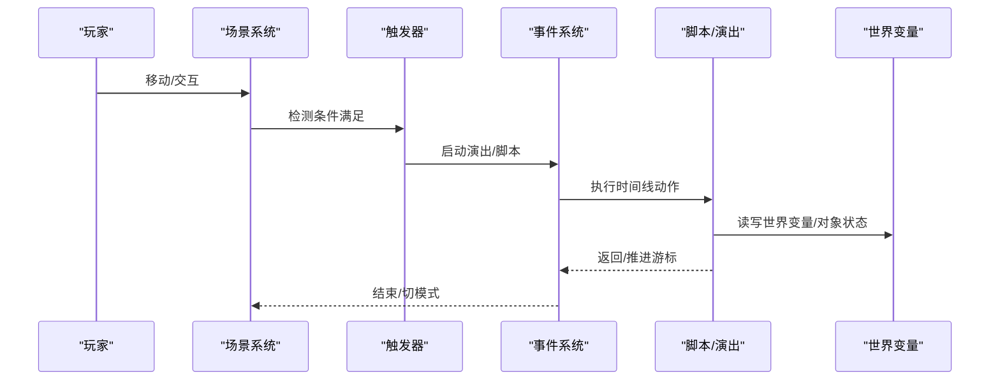
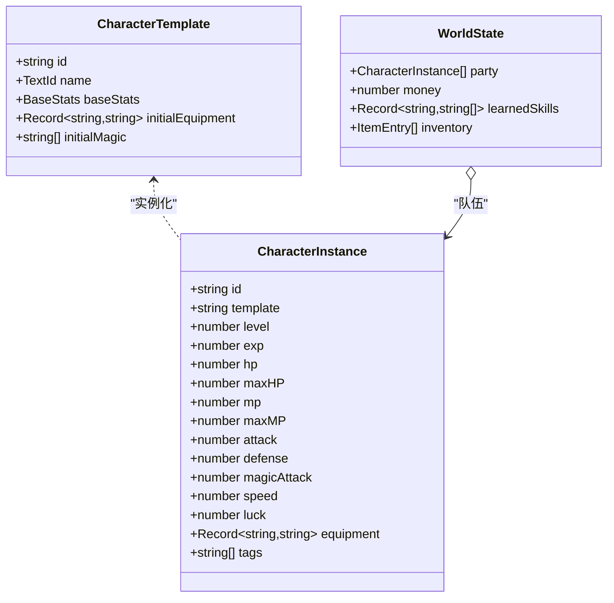
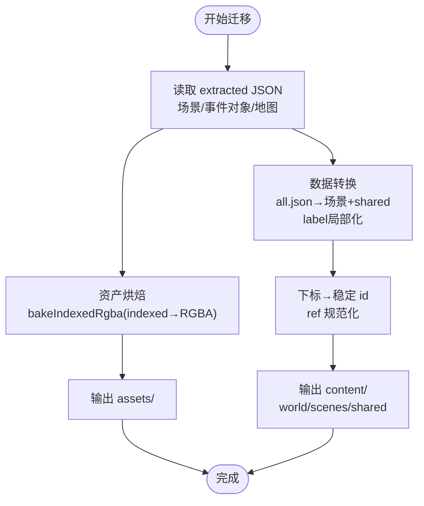
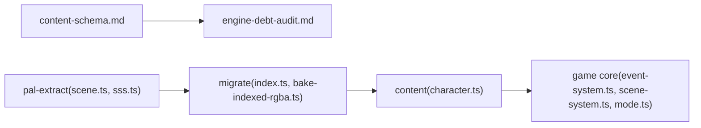

# 内容数据模型

<cite>
**本文引用的文件**   
- [content-schema.md](file://docs/phase2/foundation/content-schema.md)
- [engine-debt-audit.md](file://docs/phase2/foundation/engine-debt-audit.md)
- [character.ts](file://packages/content/src/character.ts)
- [index.ts](file://packages/migrate/src/index.ts)
- [bake-indexed-rgba.ts](file://packages/migrate/src/bake-indexed-rgba.ts)
- [scene.ts](file://packages/pal-extract/src/resources/scene.ts)
- [sss.ts](file://packages/pal-extract/src/io/sss.ts)
- [event-system.ts](file://packages/game/src/core/event-system.ts)
- [scene-system.ts](file://packages/game/src/core/scene-system.ts)
- [mode.ts](file://packages/game/src/core/mode.ts)
</cite>

## 目录
1. [引言](#引言)
2. [项目结构](#项目结构)
3. [核心组件](#核心组件)
4. [架构总览](#架构总览)
5. [详细组件分析](#详细组件分析)
6. [依赖关系分析](#依赖关系分析)
7. [性能考量](#性能考量)
8. [故障排查指南](#故障排查指南)
9. [结论](#结论)
10. [附录](#附录)

## 引言
本文件聚焦“内容数据模型”，围绕第二阶段（Reforge）新引擎与编辑器共用的内容 Schema，系统阐述三层状态架构、稳定身份体系、世界变量层、场景包自包含结构、地图多层支持、事件与演出三块正交设计、角色/实体实例+组件+外观解耦方案，以及迁移器将原版数据转换为新格式的流程。目标是让读者既能把握整体设计意图，也能落到具体实现细节与可操作路径。

## 项目结构
- 文档与设计：docs/phase2/foundation/content-schema.md 定义内容模型与迁移策略；engine-debt-audit.md 提供决策依据与旧引擎问题映射。
- 内容包：packages/content/src/character.ts 给出 L1/L2 数据结构与构建函数，作为内容层的类型契约。
- 迁移器：packages/migrate/src/index.ts 与 bake-indexed-rgba.ts 负责资产与数据迁移的边界与核心转换。
- 提取器：packages/pal-extract/src/resources/scene.ts 与 sss.ts 产出原版解析产物，供迁移器消费。
- 运行时：packages/game/src/core 下的 event-system.ts、scene-system.ts、mode.ts 体现运行期对内容模型的消费方式。

图表来源
- [content-schema.md:1-140](file://docs/phase2/foundation/content-schema.md#L1-L140)
- [engine-debt-audit.md:291-316](file://docs/phase2/foundation/engine-debt-audit.md#L291-L316)
- [character.ts:1-115](file://packages/content/src/character.ts#L1-L115)
- [index.ts:1-12](file://packages/migrate/src/index.ts#L1-L12)
- [bake-indexed-rgba.ts:1-24](file://packages/migrate/src/bake-indexed-rgba.ts#L1-L24)
- [scene.ts:40-89](file://packages/pal-extract/src/resources/scene.ts#L40-L89)
- [sss.ts:131-173](file://packages/pal-extract/src/io/sss.ts#L131-L173)
- [event-system.ts:4738-4764](file://packages/game/src/core/event-system.ts#L4738-L4764)
- [scene-system.ts:298-323](file://packages/game/src/core/scene-system.ts#L298-L323)
- [mode.ts:1-21](file://packages/game/src/core/mode.ts#L1-L21)

章节来源
- [content-schema.md:1-140](file://docs/phase2/foundation/content-schema.md#L1-L140)
- [engine-debt-audit.md:291-316](file://docs/phase2/foundation/engine-debt-audit.md#L291-L316)

## 核心组件
- 三层状态模型
  - L1 世界态（存档层）：队伍、角色属性（实例 + 组件）、背包、金钱、经验、世界变量、对象状态覆盖。
  - L2 场景静态定义（内容层）：只读、可版本化，包含地图、对象初始摆放、脚本、演出、触发器。
  - L3 场景运行态（临时层）：进场景时由 L2 + L1 合出的活对象、演出播放状态、UI，出场景即丢弃。
- 稳定身份（杜绝下标）
  - 所有实体使用稳定 id / 语义名；跨场景引用采用稳定 ref；迁移器负责把原版全局下标一次性翻译为稳定 id。
- 世界变量层
  - 显式命名表承载剧情开关、时间、天气等；事件/演出/触发器读写；渲染/场景订阅响应。
- 场景包（自包含）
  - 一个场景 = {id, name, map, entities, cutscenes, triggers, entry}；统一 entity 模型，装饰/交互/AI 通过可选组件组合。
- 地图 Schema（尺寸可变 + 多层 + 碰撞层）
  - 每图自带宽高；N 个视觉层带 z 序与遮挡语义；独立碰撞/地形层；真立交/楼层表达。
- 事件与演出建模（三块正交）
  - 触发器（何时）：条件 → 启动演出或脚本。
  - 演出/时间线（演什么）：动作序列，可编排。
  - 黑屏拆分为运行策略与遮罩层两维；兼容层保留原版 opcode 执行器。
- 角色/实体状态建模（实例 + 组件 + 外观解耦）
  - 身份=稳定实例 id；状态=实例自带组件；外观=基础造型+装备覆盖，id 不决定外观。
- 迁移器（extracted → content）
  - 拆 all.json 全局脚本、label 局部化；全局下标→稳定 id；素材归位 assets；隐式对象状态→显式世界变量；目标是在新引擎正确跑内容。

章节来源
- [content-schema.md:23-40](file://docs/phase2/foundation/content-schema.md#L23-L40)
- [content-schema.md:42-77](file://docs/phase2/foundation/content-schema.md#L42-L77)
- [content-schema.md:90-122](file://docs/phase2/foundation/content-schema.md#L90-L122)
- [content-schema.md:123-134](file://docs/phase2/foundation/content-schema.md#L123-L134)
- [content-schema.md:113-122](file://docs/phase2/foundation/content-schema.md#L113-L122)

## 架构总览
下图展示从“原版提取”到“内容工程”再到“运行时消费”的整体链路，并标注三层状态与稳定身份的贯穿点。

图表来源
- [sss.ts:131-173](file://packages/pal-extract/src/io/sss.ts#L131-L173)
- [scene.ts:40-89](file://packages/pal-extract/src/resources/scene.ts#L40-L89)
- [index.ts:1-12](file://packages/migrate/src/index.ts#L1-L12)
- [character.ts:1-115](file://packages/content/src/character.ts#L1-L115)
- [event-system.ts:4738-4764](file://packages/game/src/core/event-system.ts#L4738-L4764)
- [scene-system.ts:298-323](file://packages/game/src/core/scene-system.ts#L298-L323)
- [mode.ts:1-21](file://packages/game/src/core/mode.ts#L1-L21)

## 详细组件分析

### 三层状态架构（L1/L2/L3）
- 设计要点
  - 边界清晰：L1 随存档贯穿整局；L2 是编辑器产出的只读内容；L3 是进场景时的瞬时合成态。
  - 场景自包含：加载仅取 L2 + 所需素材；跨场景影响一律走 L1。
- 实现要点
  - 世界变量集中管理剧情/时间/天气，事件/演出/触发器读写，渲染/场景订阅。
  - 场景包内统一 entity 模型，以组件拼装行为（碰撞/交互/AI）。
- 复杂度与扩展性
  - 三层解耦使新增场景/实体无需改动其他模块；世界变量可扩展任意自定义变量。

图表来源
- [content-schema.md:23-40](file://docs/phase2/foundation/content-schema.md#L23-L40)
- [content-schema.md:42-77](file://docs/phase2/foundation/content-schema.md#L42-L77)

章节来源
- [content-schema.md:23-40](file://docs/phase2/foundation/content-schema.md#L23-L40)
- [content-schema.md:42-77](file://docs/phase2/foundation/content-schema.md#L42-L77)

### 稳定身份系统（替代原版下标）
- 设计要点
  - 任何实体（对象/场景/脚本/变量/演出）均使用稳定 id/语义名；跨场景引用采用稳定 ref。
  - 好处：加删内容不牵动他人；引用可读、可编辑、可 diff。
- 迁移流程
  - 迁移器将原版全局下标一次性翻译为稳定 id；label 局部化；素材归位 assets。
- 运行时消费
  - 事件系统通过 labelMap 解析全局 ip；NPC triggerLabel 指向稳定入口；调用子脚本按 label 定位。

图表来源
- [content-schema.md:33-40](file://docs/phase2/foundation/content-schema.md#L33-L40)
- [content-schema.md:50-67](file://docs/phase2/foundation/content-schema.md#L50-L67)
- [content-schema.md:90-98](file://docs/phase2/foundation/content-schema.md#L90-L98)
- [event-system.ts:4738-4764](file://packages/game/src/core/event-system.ts#L4738-L4764)
- [scene-system.ts:298-323](file://packages/game/src/core/scene-system.ts#L298-L323)

章节来源
- [content-schema.md:33-40](file://docs/phase2/foundation/content-schema.md#L33-L40)
- [event-system.ts:4738-4764](file://packages/game/src/core/event-system.ts#L4738-L4764)
- [scene-system.ts:298-323](file://packages/game/src/core/scene-system.ts#L298-L323)

### 世界变量层（剧情开关/时间/天气）
- 设计要点
  - 显式命名表承载剧情开关、时间、天气与自定义变量；事件/演出/触发器读写；渲染/场景订阅。
- 价值
  - 编剧情写“if 拿到剑”而非“if 第 247 号对象状态 == 2”；时间与天气成为世界变量的特例，机制统一。
- 运行时影响
  - 场景切换后，L1 世界变量持久化，新场景加载即可感知变化。

图表来源
- [content-schema.md:42-48](file://docs/phase2/foundation/content-schema.md#L42-L48)

章节来源
- [content-schema.md:42-48](file://docs/phase2/foundation/content-schema.md#L42-L48)

### 场景包自包含结构与地图 Schema
- 场景包
  - 自包含：{id, name, map, entities, cutscenes, triggers, entry}；统一 entity 模型，装饰/交互/AI 通过可选组件组合。
- 地图 Schema
  - 尺寸可变（每图自带 width/height）；N 个视觉层（z 序 + 遮挡语义）；独立碰撞/地形层；真立交/楼层表达。
- tile vs entity
  - tile 铺“地”，entity 摆“物”；拿不准默认用 entity。

图表来源
- [content-schema.md:50-67](file://docs/phase2/foundation/content-schema.md#L50-L67)
- [content-schema.md:69-88](file://docs/phase2/foundation/content-schema.md#L69-L88)

章节来源
- [content-schema.md:50-67](file://docs/phase2/foundation/content-schema.md#L50-L67)
- [content-schema.md:69-88](file://docs/phase2/foundation/content-schema.md#L69-L88)

### 事件与演出系统（触发器/演出时间线/脚本）
- 三块正交
  - 触发器（何时）：接触/范围/进场/世界变量变化 → 启动演出或脚本。
  - 演出/时间线（演什么）：动作序列（淡入淡出、移精灵、等待、显示文本、镜头、改世界变量、黑屏遮罩…），可编排。
  - 黑屏拆分为运行策略与遮罩层两维；兼容层保留原版 opcode 执行器。
- 运行时细节
  - 事件系统支持 CALL_SCRIPT 子调用栈；NPC triggerLabel 指向全局 labelMap；advance/reset/plain 控制续跑位置。

图表来源
- [content-schema.md:90-98](file://docs/phase2/foundation/content-schema.md#L90-L98)
- [event-system.ts:4738-4764](file://packages/game/src/core/event-system.ts#L4738-L4764)
- [scene-system.ts:298-323](file://packages/game/src/core/scene-system.ts#L298-L323)

章节来源
- [content-schema.md:90-98](file://docs/phase2/foundation/content-schema.md#L90-L98)
- [event-system.ts:4738-4764](file://packages/game/src/core/event-system.ts#L4738-L4764)
- [scene-system.ts:298-323](file://packages/game/src/core/scene-system.ts#L298-L323)

### 角色/实体状态建模（实例 + 组件 + 外观解耦）
- 设计要点
  - 身份=稳定实例 id；状态=实例自带组件（属性/装备/技能/buff/标签）；外观=基础造型+装备覆盖，id 不决定外观。
  - 单机阶段即用此模型，第三阶段 MMO 不重构。
- 数据结构
  - CharacterTemplate（L2 模板）与 CharacterInstance（L1 实例）分离；buildWorld 从 manifest.startWorld 组装初始世界态。

图表来源
- [character.ts:1-115](file://packages/content/src/character.ts#L1-L115)
- [content-schema.md:123-134](file://docs/phase2/foundation/content-schema.md#L123-L134)

章节来源
- [character.ts:1-115](file://packages/content/src/character.ts#L1-L115)
- [content-schema.md:123-134](file://docs/phase2/foundation/content-schema.md#L123-L134)

### 迁移器：原版数据到新格式的转换流程
- 职责边界
  - 只做离线一次性转换；依赖 content（目标 schema）+ shared（读原版解码）；不依赖 reforge/editor。
- 资产迁移
  - bakeIndexedRgba：indexed RGBA → 真彩 RGBA；palette 标准 palette 0；产物输出至 reforge/public（权宜）。
- 数据迁移
  - 拆 all.json 全局脚本 → 各场景 + shared/，label 局部化；全局对象下标 → 稳定 id；素材归位 assets；隐式对象状态记忆 → 显式世界变量（能翻则翻，不能翻保留并标注）。
- 关键输入
  - pal-extract 产出的场景与事件对象信息（scene ranges、event objects）。

图表来源
- [index.ts:1-12](file://packages/migrate/src/index.ts#L1-L12)
- [bake-indexed-rgba.ts:1-24](file://packages/migrate/src/bake-indexed-rgba.ts#L1-L24)
- [scene.ts:40-89](file://packages/pal-extract/src/resources/scene.ts#L40-L89)
- [sss.ts:131-173](file://packages/pal-extract/src/io/sss.ts#L131-L173)
- [content-schema.md:113-122](file://docs/phase2/foundation/content-schema.md#L113-L122)

章节来源
- [index.ts:1-12](file://packages/migrate/src/index.ts#L1-L12)
- [bake-indexed-rgba.ts:1-24](file://packages/migrate/src/bake-indexed-rgba.ts#L1-L24)
- [scene.ts:40-89](file://packages/pal-extract/src/resources/scene.ts#L40-L89)
- [sss.ts:131-173](file://packages/pal-extract/src/io/sss.ts#L131-L173)
- [content-schema.md:113-122](file://docs/phase2/foundation/content-schema.md#L113-L122)

## 依赖关系分析
- 设计到实现
  - content-schema.md 定义模型与迁移策略；engine-debt-audit.md 提供决策依据与旧债映射。
- 运行时消费
  - mode.ts 分发主循环；scene-system.ts 基于 NPC triggerLabel 装载事件；event-system.ts 处理 CALL_SCRIPT 与游标推进。
- 提取器与迁移器
  - pal-extract 产出 extracted JSON；migrate 将其转为 content schema 与 assets。

图表来源
- [content-schema.md:1-140](file://docs/phase2/foundation/content-schema.md#L1-L140)
- [engine-debt-audit.md:291-316](file://docs/phase2/foundation/engine-debt-audit.md#L291-L316)
- [scene.ts:40-89](file://packages/pal-extract/src/resources/scene.ts#L40-L89)
- [sss.ts:131-173](file://packages/pal-extract/src/io/sss.ts#L131-L173)
- [index.ts:1-12](file://packages/migrate/src/index.ts#L1-L12)
- [bake-indexed-rgba.ts:1-24](file://packages/migrate/src/bake-indexed-rgba.ts#L1-L24)
- [character.ts:1-115](file://packages/content/src/character.ts#L1-L115)
- [event-system.ts:4738-4764](file://packages/game/src/core/event-system.ts#L4738-L4764)
- [scene-system.ts:298-323](file://packages/game/src/core/scene-system.ts#L298-L323)
- [mode.ts:1-21](file://packages/game/src/core/mode.ts#L1-L21)

章节来源
- [content-schema.md:1-140](file://docs/phase2/foundation/content-schema.md#L1-L140)
- [engine-debt-audit.md:291-316](file://docs/phase2/foundation/engine-debt-audit.md#L291-L316)
- [scene.ts:40-89](file://packages/pal-extract/src/resources/scene.ts#L40-L89)
- [sss.ts:131-173](file://packages/pal-extract/src/io/sss.ts#L131-L173)
- [index.ts:1-12](file://packages/migrate/src/index.ts#L1-L12)
- [bake-indexed-rgba.ts:1-24](file://packages/migrate/src/bake-indexed-rgba.ts#L1-L24)
- [character.ts:1-115](file://packages/content/src/character.ts#L1-L115)
- [event-system.ts:4738-4764](file://packages/game/src/core/event-system.ts#L4738-L4764)
- [scene-system.ts:298-323](file://packages/game/src/core/scene-system.ts#L298-L323)
- [mode.ts:1-21](file://packages/game/src/core/mode.ts#L1-L21)

## 性能考量
- 场景自包含减少不必要资源加载；L3 运行态出场景即释放，降低常驻内存。
- 地图尺寸可变避免小场景背大网格；多层渲染需关注 draw order 与遮挡判定成本。
- 事件/演出系统应避免每帧大量闭包分配；必要时引入对象池或索引排序数组。
- 迁移器为离线一次性工具，不影响运行时性能。

## 故障排查指南
- NPC 触发器重播
  - 现象：每次接触都重播同一段演出。
  - 根因：未持久化 advance/reset/plain 推进位置。
  - 修复：在事件系统结束时根据 advance/reset/plain 更新 owner.triggerResume（ip 指向下一条）。
- 子脚本调用
  - 现象：CALL_SCRIPT 无法定位子脚本入口。
  - 检查：labelMap 是否正确解析 L_<n>；callStack 返回 ip 与命令源是否一致。
- 场景切换与自动 FadeIn
  - 现象：切换场景后屏幕未恢复。
  - 检查：tickByMode 是否在 tickSceneSystem 前调用 tickSceneAutoFadeIn，确保 fade 进行中冻结探索。

章节来源
- [event-system.ts:1952-1963](file://packages/game/src/core/event-system.ts#L1952-L1963)
- [event-system.ts:4738-4764](file://packages/game/src/core/event-system.ts#L4738-L4764)
- [mode.ts:1-21](file://packages/game/src/core/mode.ts#L1-L21)

## 结论
新内容数据模型以三层状态、稳定身份与世界变量为核心，配合场景包自包含、地图多层与事件/演出三块正交设计，既满足第一阶段的保真移植，也为第二阶段的编辑器与新引擎打下坚实基础。迁移器承担“extracted → content”的一次性桥接任务，确保内容在新引擎中可正确运行。角色/实体的实例+组件+外观解耦方案兼顾单机与未来 MMO 扩展。

## 附录
- 术语
  - L1/L2/L3：世界态/场景静态定义/场景运行态。
  - stable id：稳定身份，用于替代数组下标的全局唯一标识。
  - world variables：世界变量，统一承载剧情/时间/天气等。
- 参考
  - 决策审计与 backlog 映射见 engine-debt-audit.md。
  - 内容工程目录与迁移步骤见 content-schema.md §7/§8。