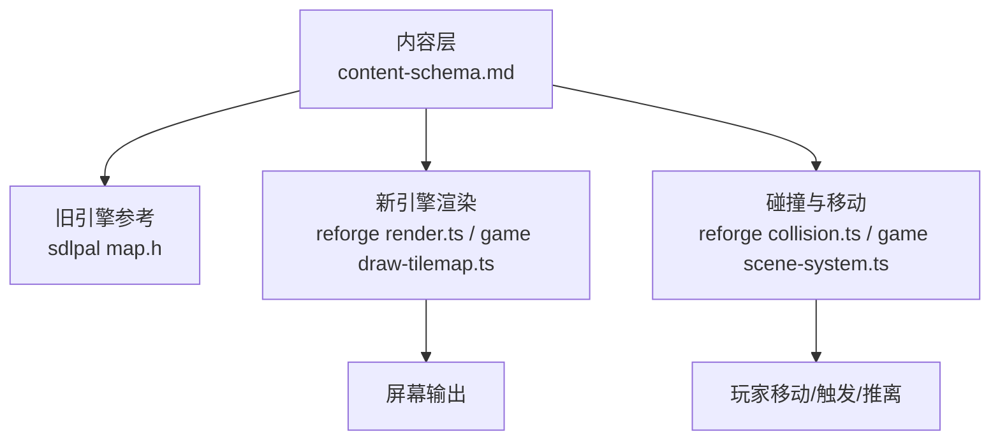
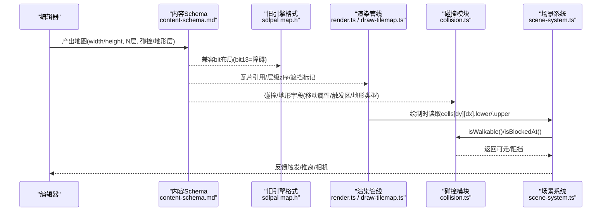
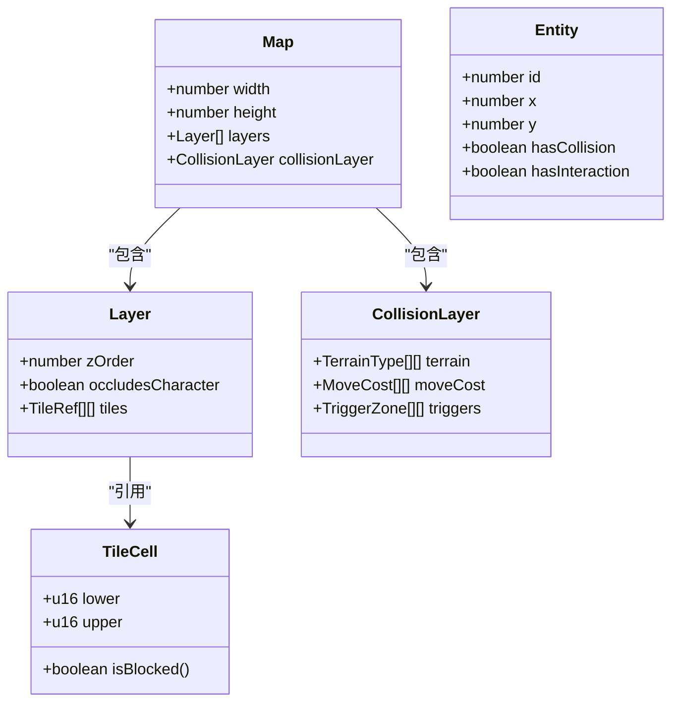
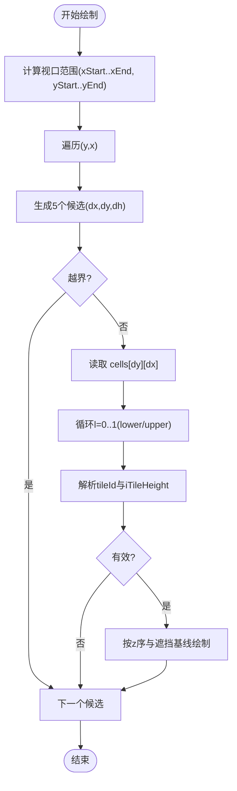
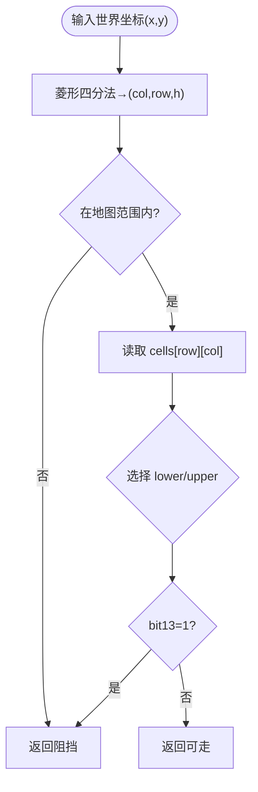
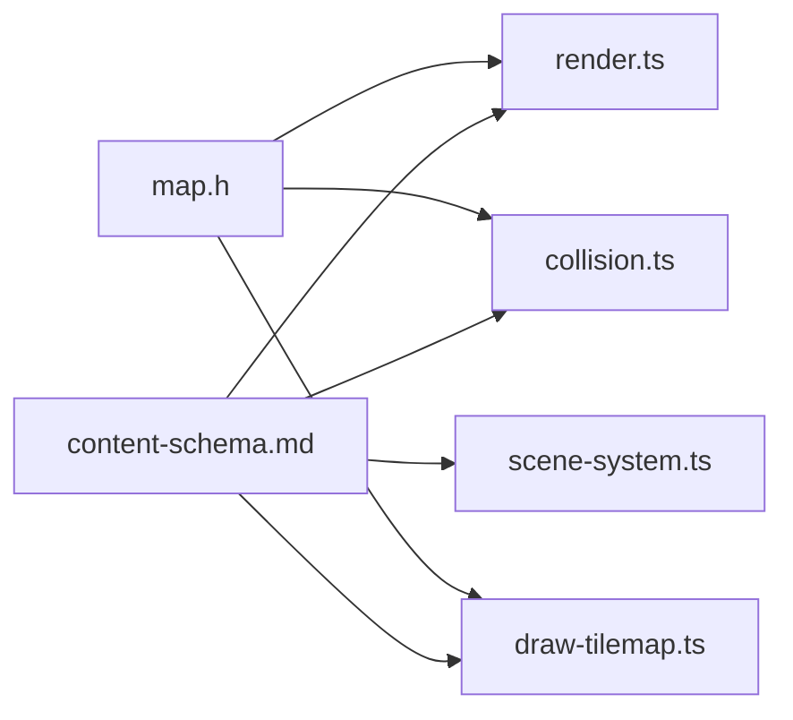

# 地图Schema设计

<cite>
**本文引用的文件**   
- [content-schema.md](file://docs/phase2/foundation/content-schema.md)
- [map.h](file://reference/sdlpal/map.h)
- [collision.ts](file://packages/reforge/src/collision.ts)
- [scene-system.ts](file://packages/game/src/core/scene-system.ts)
- [render.ts](file://packages/reforge/src/render.ts)
- [draw-tilemap.ts](file://packages/game/src/present/draw-tilemap.ts)
</cite>

## 目录
1. [引言](#引言)
2. [项目结构](#项目结构)
3. [核心组件](#核心组件)
4. [架构总览](#架构总览)
5. [详细组件分析](#详细组件分析)
6. [依赖关系分析](#依赖关系分析)
7. [性能考量](#性能考量)
8. [故障排查指南](#故障排查指南)
9. [结论](#结论)
10. [附录](#附录)

## 引言
本文件围绕“地图 Schema 设计”展开，聚焦以下目标：
- 尺寸可变、多层视觉、独立碰撞地形层的设计理念与技术实现
- N 个视觉层的 z 序管理、遮挡关系与性能优化策略
- 碰撞层与地形层的数据结构设计（移动属性、触发区、地形类型等）
- tile 层与 entity 层的分工原则与使用场景
- 真立交/楼层系统的表达与角色跨层行走的实现思路
- 地图编辑器的数据验证规则与兼容性考虑

## 项目结构
从内容到引擎的落地路径如下：
- 内容层定义：在内容 Schema 文档中明确地图为“尺寸可变 + N 视觉层 + 独立碰撞/地形层”，并给出 tile/entity 分工与遮挡语义
- 旧引擎参考：SDL Pal 以固定 128×64 网格、每格 2 层（lower/upper）DWORD 存储瓦片信息，包含块标志位
- 新引擎实现：渲染管线按视口裁剪与菱形顺序遍历；碰撞模块提供像素→格映射与障碍判定；运行时系统统一处理自动触发、阻挡推离与相机跟随

**图表来源** 
- [content-schema.md:69-88](file://docs/phase2/foundation/content-schema.md#L69-L88)
- [map.h:22-80](file://reference/sdlpal/map.h#L22-L80)
- [render.ts:186-228](file://packages/reforge/src/render.ts#L186-L228)
- [draw-tilemap.ts:295-329](file://packages/game/src/present/draw-tilemap.ts#L295-L329)
- [collision.ts:1-71](file://packages/reforge/src/collision.ts#L1-L71)
- [scene-system.ts:371-425](file://packages/game/src/core/scene-system.ts#L371-L425)

**章节来源**
- [content-schema.md:69-88](file://docs/phase2/foundation/content-schema.md#L69-L88)
- [map.h:22-80](file://reference/sdlpal/map.h#L22-L80)

## 核心组件
- 地图 Schema（尺寸可变 + 多层 + 独立碰撞/地形层）
  - 每张地图自带 width/height，突破旧引擎定长数组限制
  - N 个视觉层，每层带 z 序与是否遮挡角色的标记
  - 独立的碰撞/地形层：除“能否通行”外，携带地形类型、移动属性、触发区等
  - 真立交/楼层：通过“多层 + 每层可行走性 + 角色当前所在层”表达
- 旧引擎对照
  - 固定 128×64 网格，每格 2 层（lower/upper），DWORD 含块标志位 bit 13
- 新引擎对接
  - 渲染：按视口裁剪、菱形顺序遍历、双层瓦片 ID 与高度解析
  - 碰撞：像素→(col,row,h) 菱形四分法，查 lower/upper 的障碍位
  - 运行：自动触发区、阻挡推离、相机跟随与边界约束

**章节来源**
- [content-schema.md:69-88](file://docs/phase2/foundation/content-schema.md#L69-L88)
- [map.h:22-80](file://reference/sdlpal/map.h#L22-L80)
- [render.ts:186-228](file://packages/reforge/src/render.ts#L186-L228)
- [draw-tilemap.ts:295-329](file://packages/game/src/present/draw-tilemap.ts#L295-L329)
- [collision.ts:1-71](file://packages/reforge/src/collision.ts#L1-L71)
- [scene-system.ts:371-425](file://packages/game/src/core/scene-system.ts#L371-L425)

## 架构总览
下图展示从内容到渲染/碰撞的关键链路，以及新旧引擎的对应点。

**图表来源** 
- [content-schema.md:69-88](file://docs/phase2/foundation/content-schema.md#L69-L88)
- [map.h:22-80](file://reference/sdlpal/map.h#L22-L80)
- [render.ts:186-228](file://packages/reforge/src/render.ts#L186-L228)
- [draw-tilemap.ts:295-329](file://packages/game/src/present/draw-tilemap.ts#L295-L329)
- [collision.ts:1-71](file://packages/reforge/src/collision.ts#L1-L71)
- [scene-system.ts:371-425](file://packages/game/src/core/scene-system.ts#L371-L425)

## 详细组件分析

### 1) 地图数据结构与字段设计
- 基础元数据
  - width/height：每图自持，非全局常量
  - layers：N 个视觉层，每层含 z 序、是否遮挡角色
  - collisionLayer：独立碰撞/地形层，承载通行性与语义
- 单元格（cell）
  - 兼容旧格式：lower/upper 两个 u16/u32 片段，保留 bit 13 作为障碍位
  - 扩展字段（建议）：terrainType、moveCost、triggerZoneId、layerIndex（用于跨层）
- 实体（entity）
  - 任意像素位置、锚点、遮挡基线、可选碰撞/交互/AI
  - 与 tile 分工：tile 铺地，entity 摆放家具/活物

**图表来源** 
- [content-schema.md:69-88](file://docs/phase2/foundation/content-schema.md#L69-L88)
- [map.h:22-80](file://reference/sdlpal/map.h#L22-L80)

**章节来源**
- [content-schema.md:69-88](file://docs/phase2/foundation/content-schema.md#L69-L88)
- [map.h:22-80](file://reference/sdlpal/map.h#L22-L80)

### 2) 视觉层与 z 序管理
- 概念
  - 每层带 z 序，决定绘制先后；上层可遮挡下层
  - 原版 lower/upper 是两层特例，新 schema 泛化为 N 层
- 渲染要点
  - 视口裁剪：仅遍历可见区域
  - 菱形顺序：按 (x,y) 及相邻候选 (dx,dy,dh) 顺序绘制，保证前后关系正确
  - 双层瓦片：对每个 cell 分别取 lower/upper 的 tileId 与高度

**图表来源** 
- [render.ts:186-228](file://packages/reforge/src/render.ts#L186-L228)
- [draw-tilemap.ts:295-329](file://packages/game/src/present/draw-tilemap.ts#L295-L329)

**章节来源**
- [render.ts:186-228](file://packages/reforge/src/render.ts#L186-L228)
- [draw-tilemap.ts:295-329](file://packages/game/src/present/draw-tilemap.ts#L295-L329)

### 3) 碰撞与地形层
- 菱形四分法
  - 像素坐标 → (col,row,h)，h=0 下三角/h=1 上三角
  - 旧格式兼容：读 lower/upper 的 bit 13 作为障碍位
- 接口
  - buildIsBlocked(map): 返回 (x,y)→是否阻挡
  - isBlockedAt(map,pos): GridPos 入口，内部复用像素兼容层
  - sameGrid(a,b): 判断两格是否同站立格（逻辑/碰撞在地面层）
- 地形扩展
  - 建议在 collisionLayer 中增加 terrainType、moveCost、triggerZoneId 等字段，使“能不能走”和“怎么走/触发什么”解耦

**图表来源** 
- [collision.ts:1-71](file://packages/reforge/src/collision.ts#L1-L71)
- [scene-system.ts:371-425](file://packages/game/src/core/scene-system.ts#L371-L425)

**章节来源**
- [collision.ts:1-71](file://packages/reforge/src/collision.ts#L1-L71)
- [scene-system.ts:371-425](file://packages/game/src/core/scene-system.ts#L371-L425)

### 4) tile 层与 entity 层分工
- tile 层
  - 铺成片的“地”：地板、水面、墙面、大片重复背景
  - 网格对齐、可复用、能自动拼接
- entity 层
  - 独立的“物”：桌椅、花瓶、宝箱、NPC
  - 任意像素位置、自带锚点与遮挡基线、可选碰撞/交互/AI
- 决策口诀
  - “tile 砌地基墙面，entity 摆家具和活物”
  - 拿不准默认用 entity，除非是大面积重复背景

**章节来源**
- [content-schema.md:79-88](file://docs/phase2/foundation/content-schema.md#L79-L88)

### 5) 真立交/楼层系统与跨层行走
- 表达
  - 利用“多层 + 每层可行走性 + 角色当前所在层”表达楼层/立交
  - 不再 fake 成两张图；schema 已留足表达力
- 实现思路（P1 引擎任务）
  - 在 collisionLayer 或 layer 元数据中标注“可上行/下行”的格子
  - 角色状态维护 currentLayer；进入特定格子后切换 currentLayer
  - 渲染阶段按 currentLayer 优先绘制该层，同时根据遮挡基线与 z 序处理前后关系
  - 相机与碰撞均基于 currentLayer 的 grid 进行

**章节来源**
- [content-schema.md:69-77](file://docs/phase2/foundation/content-schema.md#L69-L77)

### 6) 编辑器数据验证规则与兼容性
- 基本校验
  - width/height > 0 且不超过合理上限
  - layers 数量 ≥ 1，每层 z 序唯一且递增
  - 每层 tiles 尺寸与 width/height 一致
  - collisionLayer 尺寸与 width/height 一致
- 字段校验
  - terrainType/moveCost/triggers 等字段取值在枚举/范围内
  - triggerZoneId 引用存在且不重叠冲突
- 兼容性
  - 迁移期保留 lower/upper 与 bit 13 的障碍语义，确保旧数据可用
  - 新代码优先使用 GridPos 入口（isBlockedAt/sameGrid），避免直接依赖像素接口

**章节来源**
- [content-schema.md:69-88](file://docs/phase2/foundation/content-schema.md#L69-L88)
- [collision.ts:1-71](file://packages/reforge/src/collision.ts#L1-L71)

## 依赖关系分析
- 内容层（content-schema）定义地图结构与字段，指导编辑器与迁移器
- 旧引擎（sdlpal map.h）提供 bit 布局与块标志位参考
- 渲染管线（render.ts / draw-tilemap.ts）依赖地图 cells 与层元数据进行绘制
- 碰撞模块（collision.ts）提供像素→格映射与障碍判定
- 场景系统（scene-system.ts）整合输入、移动、触发、推离与相机

**图表来源** 
- [content-schema.md:69-88](file://docs/phase2/foundation/content-schema.md#L69-L88)
- [map.h:22-80](file://reference/sdlpal/map.h#L22-L80)
- [render.ts:186-228](file://packages/reforge/src/render.ts#L186-L228)
- [draw-tilemap.ts:295-329](file://packages/game/src/present/draw-tilemap.ts#L295-L329)
- [collision.ts:1-71](file://packages/reforge/src/collision.ts#L1-L71)
- [scene-system.ts:371-425](file://packages/game/src/core/scene-system.ts#L371-L425)

**章节来源**
- [content-schema.md:69-88](file://docs/phase2/foundation/content-schema.md#L69-L88)
- [map.h:22-80](file://reference/sdlpal/map.h#L22-L80)
- [render.ts:186-228](file://packages/reforge/src/render.ts#L186-L228)
- [draw-tilemap.ts:295-329](file://packages/game/src/present/draw-tilemap.ts#L295-L329)
- [collision.ts:1-71](file://packages/reforge/src/collision.ts#L1-L71)
- [scene-system.ts:371-425](file://packages/game/src/core/scene-system.ts#L371-L425)

## 性能考量
- 视口裁剪：仅遍历可见区域，减少无效绘制与碰撞查询
- 菱形顺序：一次扫描生成 5 个候选，边界检查在外层，降低内层开销
- 双层瓦片：对每个 cell 只解析两次（lower/upper），提前过滤无效 tileId 与高度
- 碰撞缓存：对静态地图可预计算 isBlocked 查找表或分块索引，减少逐帧位运算
- 触发区优化：将自动触发 NPC 按网格分区索引，缩小距离检测范围

[本节为通用指导，无需具体文件分析]

## 故障排查指南
- 渲染错位/遮挡异常
  - 检查菱形顺序与 dh 选择是否正确
  - 确认 lower/upper 的 tileId 与高度解析无误
- 碰撞误判
  - 核对 pixelToTile 的 xr/yr 分支逻辑
  - 确认 bit 13 障碍位设置与 lower/upper 选择一致
- 自动触发未命中
  - 检查 triggerMode 阈值公式与 anchor 偏移
  - 确认 sState 与 nSpriteFrames 条件满足

**章节来源**
- [render.ts:186-228](file://packages/reforge/src/render.ts#L186-L228)
- [draw-tilemap.ts:295-329](file://packages/game/src/present/draw-tilemap.ts#L295-L329)
- [collision.ts:1-71](file://packages/reforge/src/collision.ts#L1-L71)
- [scene-system.ts:371-425](file://packages/game/src/core/scene-system.ts#L371-L425)

## 结论
- 新地图 Schema 以“尺寸可变 + N 视觉层 + 独立碰撞/地形层”为核心，既兼容旧引擎 bit 布局，又为未来扩展（地形类型、移动属性、触发区、楼层/立交）预留空间
- 渲染与碰撞模块严格遵循菱形顺序与 bit 13 语义，保障与旧引擎行为一致
- tile/entity 分工清晰，便于内容生产与引擎实现协同
- 后续 P1 重点在于跨层行走与更丰富的地形/触发语义落地

[本节为总结，无需具体文件分析]

## 附录
- 术语
  - 视觉层：负责绘制的层，带 z 序与遮挡标记
  - 碰撞/地形层：负责通行性、地形语义与触发区的独立层
  - 菱形四分法：将像素坐标映射到 (col,row,h) 的算法
  - bit 13：旧引擎中的障碍标志位

[本节为补充说明，无需具体文件分析]