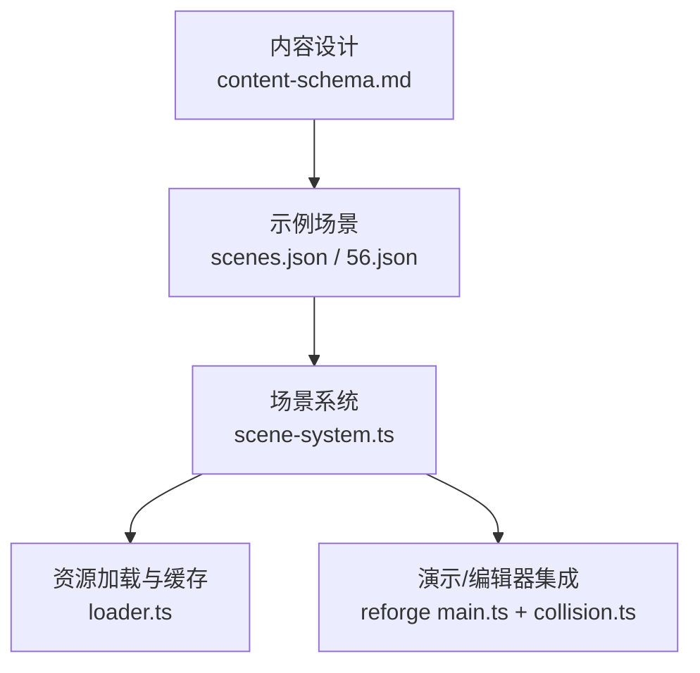
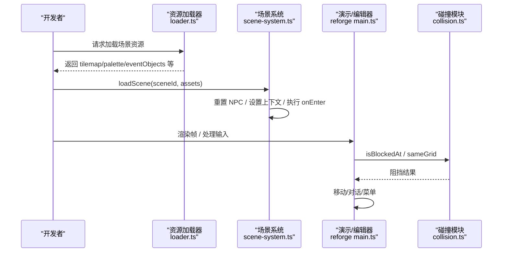
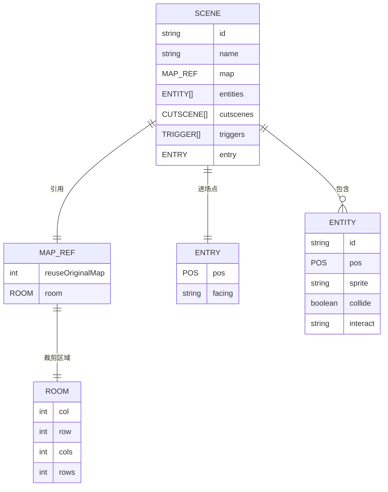
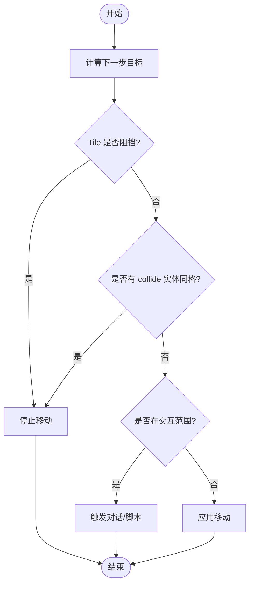
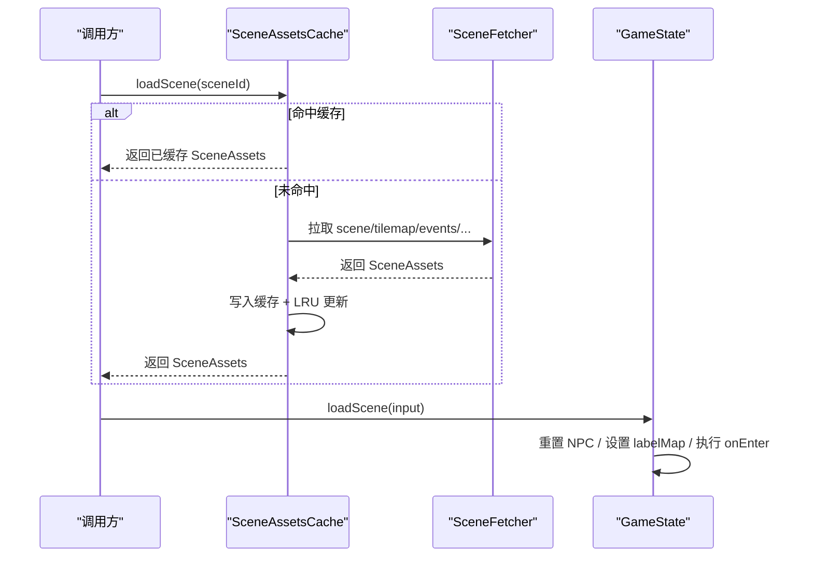
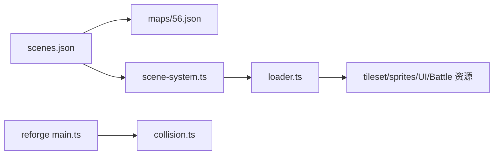

# 场景包结构

<cite>
**本文引用的文件**   
- [content-schema.md](file://docs/phase2/foundation/content-schema.md)
- [scenes.json](file://projects/demo/content/scenes.json)
- [56.json](file://projects/demo/assets/maps/56.json)
- [scene-system.ts](file://packages/game/src/core/scene-system.ts)
- [loader.ts](file://packages/game/src/assets/loader.ts)
- [main.ts](file://packages/reforge/src/main.ts)
- [collision.ts](file://packages/reforge/src/collision.ts)
- [npc-collision-plan.md](file://docs/phase2/slice1-indoor/npc-collision-plan.md)
</cite>

## 目录
1. [引言](#引言)
2. [项目结构](#项目结构)
3. [核心组件](#核心组件)
4. [架构总览](#架构总览)
5. [详细组件分析](#详细组件分析)
6. [依赖分析](#依赖分析)
7. [性能考虑](#性能考虑)
8. [故障排查指南](#故障排查指南)
9. [结论](#结论)

## 引言
本文件围绕“场景包”的自包含设计理念与实现，系统阐述以下要点：
- 场景包的字段模型：map 引用、entities 数组、cutscenes、triggers、entry 等
- 统一 entity 模型：装饰物、宝箱、NPC、怪物等以组件化方式表达
- 实体组件系统：碰撞、交互、AI 等可选组件的配置与运行期行为
- 场景加载流程、资源依赖管理与内存清理机制
- 场景间通信与状态共享的设计模式（世界变量层）

## 项目结构
从内容到运行时，场景相关的关键位置如下：
- 内容 Schema 定义：文档定义了场景包结构与三层状态模型
- 示例场景数据：demo 工程中的 scenes.json 与地图 56.json
- 运行时场景系统：场景切换、自动触发、寻路碰撞、事件装载
- 资源加载与缓存：场景资源懒加载与 LRU 淘汰
- 编辑器/演示端集成：reforge 主循环对实体碰撞与交互的实现

图表来源
- [content-schema.md:50-67](file://docs/phase2/foundation/content-schema.md#L50-L67)
- [scenes.json:1-89](file://projects/demo/content/scenes.json#L1-L89)
- [56.json:1-800](file://projects/demo/assets/maps/56.json#L1-L800)
- [scene-system.ts:586-661](file://packages/game/src/core/scene-system.ts#L586-L661)
- [loader.ts:400-500](file://packages/game/src/assets/loader.ts#L400-L500)
- [main.ts:452-460](file://packages/reforge/src/main.ts#L452-L460)
- [collision.ts:59-71](file://packages/reforge/src/collision.ts#L59-L71)

章节来源
- [content-schema.md:50-67](file://docs/phase2/foundation/content-schema.md#L50-L67)
- [scenes.json:1-89](file://projects/demo/content/scenes.json#L1-L89)
- [56.json:1-800](file://projects/demo/assets/maps/56.json#L1-L800)
- [scene-system.ts:586-661](file://packages/game/src/core/scene-system.ts#L586-L661)
- [loader.ts:400-500](file://packages/game/src/assets/loader.ts#L400-L500)
- [main.ts:452-460](file://packages/reforge/src/main.ts#L452-L460)
- [collision.ts:59-71](file://packages/reforge/src/collision.ts#L59-L71)

## 核心组件
- 场景包（自包含）
  - 字段：id、name、map 引用、entities 数组、cutscenes、triggers、entry
  - 原则：加载只读取该包与其引用素材；跨场景影响通过“世界变量层”持久化
- 统一 entity 模型
  - 所有独立摆放对象均为 entity，差异仅在于挂载的可选组件：精灵、碰撞、交互、AI
- 三层状态模型
  - L1 世界态（存档层）、L2 场景静态定义（内容层）、L3 场景运行态（临时层）

章节来源
- [content-schema.md:23-31](file://docs/phase2/foundation/content-schema.md#L23-L31)
- [content-schema.md:50-67](file://docs/phase2/foundation/content-schema.md#L50-L67)

## 架构总览
场景包在内容层由 JSON 描述，运行时由场景系统解析并驱动。资源按需懒加载，LRU 控制内存占用。演示端将实体碰撞与交互接入主循环。

图表来源
- [loader.ts:135-190](file://packages/game/src/assets/loader.ts#L135-L190)
- [scene-system.ts:607-661](file://packages/game/src/core/scene-system.ts#L607-L661)
- [main.ts:452-460](file://packages/reforge/src/main.ts#L452-L460)
- [collision.ts:59-71](file://packages/reforge/src/collision.ts#L59-L71)

## 详细组件分析

### 场景包字段与示例
- map 引用
  - 使用 reuseOriginalMap 指向原图编号，room 指定裁剪区域（col/row/cols/rows）
- entry 入口
  - 指定进场像素坐标与朝向
- entities 数组
  - 每个实体含 id、pos、sprite、collide、interact 等
- dialogues（示例中用于演示交互文本）
  - 按 id 关联到实体的 interact 字段

图表来源
- [content-schema.md:50-67](file://docs/phase2/foundation/content-schema.md#L50-L67)
- [scenes.json:1-89](file://projects/demo/content/scenes.json#L1-L89)
- [56.json:1-800](file://projects/demo/assets/maps/56.json#L1-L800)

章节来源
- [scenes.json:1-89](file://projects/demo/content/scenes.json#L1-L89)
- [56.json:1-800](file://projects/demo/assets/maps/56.json#L1-L800)
- [content-schema.md:50-67](file://docs/phase2/foundation/content-schema.md#L50-L67)

### 统一 Entity 模型与组件化配置
- 基础能力
  - 稳定 id、位置（网格或像素）、精灵引用
- 可选组件
  - 碰撞组件：collide = true 表示占据站立格，玩家不可进入
  - 交互组件：interact 指向对话/脚本 id
  - AI 组件：未来可扩展为移动/AI 行为（当前 demo 以静态为主）
- 典型实体类型
  - 装饰物：仅有精灵
  - 宝箱：精灵 + 交互（打开后改变状态）
  - NPC：精灵 + 交互 + 可能带自动触发区
  - 怪物：精灵 + 自动触发（接触明雷）+ 可能的 AI

章节来源
- [content-schema.md:50-67](file://docs/phase2/foundation/content-schema.md#L50-L67)
- [scenes.json:22-34](file://projects/demo/content/scenes.json#L22-L34)
- [npc-collision-plan.md:1-18](file://docs/phase2/slice1-indoor/npc-collision-plan.md#L1-L18)

### 实体组件系统工作原理（碰撞、交互、AI）
- 碰撞
  - 基于菱形四分法将像素映射到 (col,row,h)，再查 tile 障碍位 bit 13
  - 静态实体碰撞：若实体 collide=true 且与目标同格，则阻挡
- 交互
  - 靠近实体且在交互范围内时，可触发对话或脚本
- AI
  - 当前以静态为主；自动触发区（triggerMode）可在接近时启动脚本

图表来源
- [collision.ts:18-50](file://packages/reforge/src/collision.ts#L18-L50)
- [main.ts:452-460](file://packages/reforge/src/main.ts#L452-L460)
- [npc-collision-plan.md:1-18](file://docs/phase2/slice1-indoor/npc-collision-plan.md#L1-L18)

章节来源
- [collision.ts:18-50](file://packages/reforge/src/collision.ts#L18-L50)
- [main.ts:452-460](file://packages/reforge/src/main.ts#L452-L460)
- [npc-collision-plan.md:1-18](file://docs/phase2/slice1-indoor/npc-collision-plan.md#L1-L18)

### 场景加载流程与资源依赖管理
- 资源加载
  - 先拉取 scene JSON，再根据 mapNum 拉取 tilemap、palette、events 等
  - 角色/NPC/战斗等资源按需并行加载，失败项降级处理
- 场景切换
  - 通过 SceneAssetsCache 懒加载场景资源，重复切同一场景不重复 fetch
  - 重置 NPC、设置 SceneContext、执行 onEnter 脚本、可选覆写 party 起点
- 内存清理
  - LRU 淘汰最旧场景资源，支持 protect 保护当前场景不被淘汰
  - onEvict 回调联动清理其他并行缓存（如 tileImagesBySceneId）

图表来源
- [loader.ts:451-499](file://packages/game/src/assets/loader.ts#L451-L499)
- [scene-system.ts:607-661](file://packages/game/src/core/scene-system.ts#L607-L661)

章节来源
- [loader.ts:135-190](file://packages/game/src/assets/loader.ts#L135-L190)
- [loader.ts:451-499](file://packages/game/src/assets/loader.ts#L451-L499)
- [scene-system.ts:607-661](file://packages/game/src/core/scene-system.ts#L607-L661)

### 场景间通信与状态共享（世界变量层）
- 世界变量表
  - 显式命名开关（剧情进度/时间/天气/自定义），事件/演出/触发器读写
- 跨场景影响
  - 修改 L1 世界变量，下次加载其他场景自然反映
- 对象状态覆盖
  - 某些无法迁移为变量的隐式状态保留对象状态机制，但尽量显式化

章节来源
- [content-schema.md:42-48](file://docs/phase2/foundation/content-schema.md#L42-L48)
- [content-schema.md:23-31](file://docs/phase2/foundation/content-schema.md#L23-L31)

## 依赖分析
- 内容层依赖
  - scenes.json 依赖 maps/56.json（通过 reuseOriginalMap 与 room 裁剪）
- 运行时依赖
  - scene-system.ts 依赖 loader.ts 提供的 SceneAssetsCache
  - reforge main.ts 依赖 collision.ts 提供碰撞判定
- 外部资源
  - tileset、sprites、UI 图标、战斗背景等通过 manifest 与 RLE/PNG 路径加载

图表来源
- [scenes.json:1-89](file://projects/demo/content/scenes.json#L1-L89)
- [56.json:1-800](file://projects/demo/assets/maps/56.json#L1-L800)
- [scene-system.ts:607-661](file://packages/game/src/core/scene-system.ts#L607-L661)
- [loader.ts:135-190](file://packages/game/src/assets/loader.ts#L135-L190)
- [main.ts:452-460](file://packages/reforge/src/main.ts#L452-L460)
- [collision.ts:59-71](file://packages/reforge/src/collision.ts#L59-L71)

章节来源
- [scenes.json:1-89](file://projects/demo/content/scenes.json#L1-L89)
- [56.json:1-800](file://projects/demo/assets/maps/56.json#L1-L800)
- [scene-system.ts:607-661](file://packages/game/src/core/scene-system.ts#L607-L661)
- [loader.ts:135-190](file://packages/game/src/assets/loader.ts#L135-L190)
- [main.ts:452-460](file://packages/reforge/src/main.ts#L452-L460)
- [collision.ts:59-71](file://packages/reforge/src/collision.ts#L59-L71)

## 性能考虑
- 资源懒加载与去重
  - 同场景多次切换不重复 fetch；批量并行拉取减少等待
- LRU 内存控制
  - 固定最大条目数，保护当前场景不被淘汰，避免黑屏
- 资源管线优化
  - 使用 gzip RLE 压缩 sprite/tileset，减少网络与解码开销
- 失败降级
  - 缺失资源 warn 并跳过，保证主流程可用

章节来源
- [loader.ts:451-499](file://packages/game/src/assets/loader.ts#L451-L499)
- [loader.ts:192-221](file://packages/game/src/assets/loader.ts#L192-L221)

## 故障排查指南
- 场景切换后标签查找失败
  - 现象：triggerLabel 不在全局 labelMap
  - 原因：旧 scene 的 labelMap 残留导致新场景找不到
  - 修复：切换场景时同步更新 SceneContext 的 events + labelMap
- 静态 NPC 碰撞无效
  - 现象：玩家能穿过站着的鬼
  - 原因：isBlocked 未读 collide 实体
  - 修复：在 isBlocked 中叠加 collide 实体同格判断
- 资源加载失败
  - 现象：部分 UI/战斗特效不显示
  - 原因：对应 JSON/PNG/RLE 缺失
  - 处理：warn 日志并降级，不影响主流程

章节来源
- [scene-system.ts:627-633](file://packages/game/src/core/scene-system.ts#L627-L633)
- [npc-collision-plan.md:1-18](file://docs/phase2/slice1-indoor/npc-collision-plan.md#L1-L18)
- [loader.ts:228-237](file://packages/game/src/assets/loader.ts#L228-L237)

## 结论
场景包以“自包含 + 统一 entity 模型 + 世界变量层”为核心，实现了内容层的清晰边界与运行期的灵活扩展。通过懒加载与 LRU 控制，兼顾了加载性能与内存占用；通过碰撞/交互/AI 的组件化配置，使不同实体类型具备一致的可组合性。后续可在 AI 与动态碰撞方面继续完善，同时保持与原版关键路径的一致性。