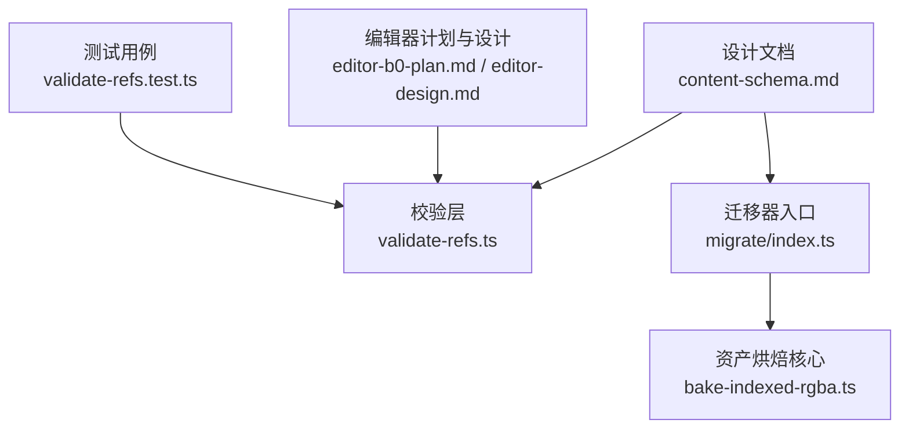
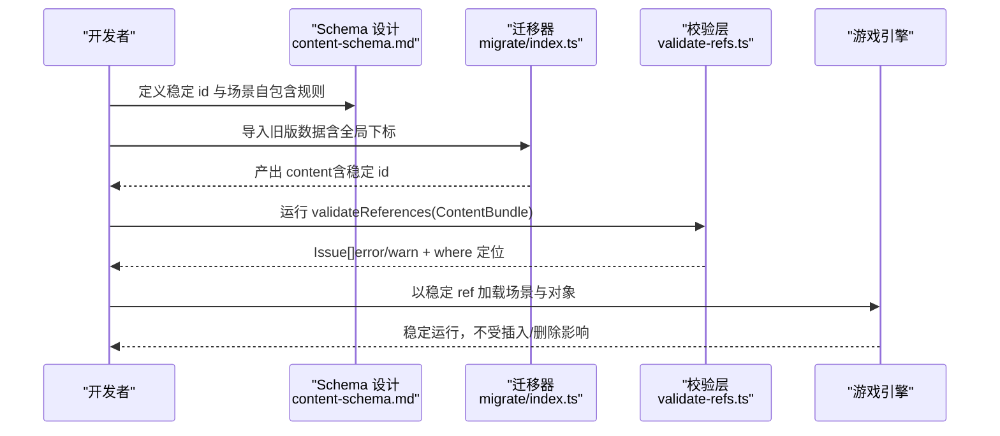
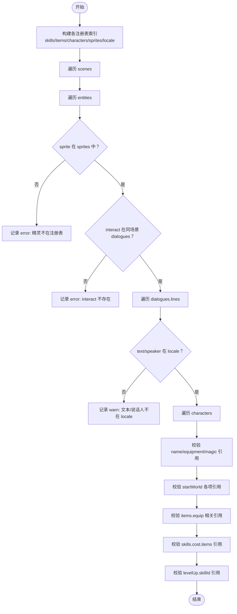
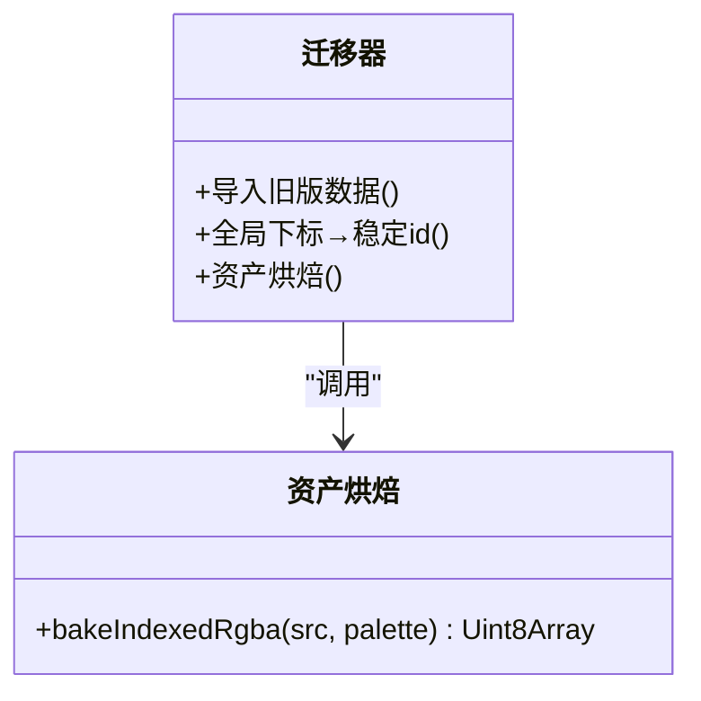
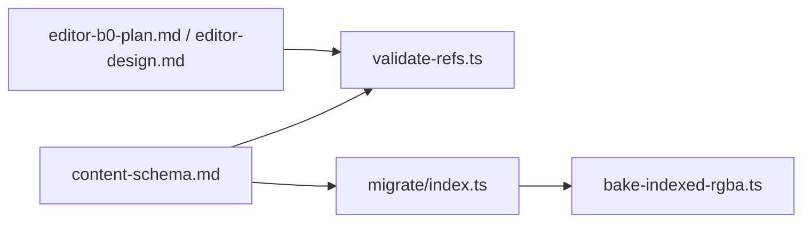

# 稳定身份系统

<cite>
**本文引用的文件**   
- [content-schema.md](file://docs/phase2/foundation/content-schema.md)
- [validate-refs.ts](file://packages/content/src/validate-refs.ts)
- [validate-refs.test.ts](file://packages/content/src/validate-refs.test.ts)
- [index.ts（迁移器）](file://packages/migrate/src/index.ts)
- [bake-indexed-rgba.ts](file://packages/migrate/src/bake-indexed-rgba.ts)
- [asset-pipeline.md](file://docs/phase2/migrate/asset-pipeline.md)
- [editor-design.md](file://docs/phase2/editor/editor-design.md)
- [editor-b0-plan.md](file://docs/phase2/editor/editor-b0-plan.md)
</cite>

## 目录
1. [引言](#引言)
2. [项目结构](#项目结构)
3. [核心组件](#核心组件)
4. [架构总览](#架构总览)
5. [详细组件分析](#详细组件分析)
6. [依赖分析](#依赖分析)
7. [性能考虑](#性能考虑)
8. [故障排查指南](#故障排查指南)
9. [结论](#结论)
10. [附录：ID 命名规范与最佳实践](#附录id-命名规范与最佳实践)

## 引言
本文件围绕“稳定身份系统”展开，目标是建立一套不依赖数组下标、可版本化、可可视化编辑的跨场景引用机制。内容涵盖：
- 稳定 id 的命名规范、语义化约定与 UUID 生成策略
- 跨场景引用格式（如 scene:water-moon-pal/obj:inn-keeper）的解析与验证
- 相比原版全局下标的优势（版本控制友好、编辑器可视化支持等）
- 迁移器将全局下标转换为稳定 id 的算法与冲突处理策略
- 完整的 ID 命名规范与最佳实践

## 项目结构
与稳定身份系统直接相关的代码与文档主要分布在以下位置：
- 设计文档：定义三层状态模型、稳定身份原则、场景自包含、迁移器职责等
- 校验层：实现跨引用完整性校验，确保所有稳定 ref 指向真实存在的内容
- 迁移器：负责把旧版全局下标一次性转换为稳定 id，并导出资产烘焙工具

图表来源
- [content-schema.md:23-40](file://docs/phase2/foundation/content-schema.md#L23-L40)
- [validate-refs.ts:1-155](file://packages/content/src/validate-refs.ts#L1-L155)
- [index.ts（迁移器）:1-13](file://packages/migrate/src/index.ts#L1-L13)
- [bake-indexed-rgba.ts:1-24](file://packages/migrate/src/bake-indexed-rgba.ts#L1-L24)
- [editor-b0-plan.md:174-247](file://docs/phase2/editor/editor-b0-plan.md#L174-L247)
- [editor-design.md:82-119](file://docs/phase2/editor/editor-design.md#L82-L119)

章节来源
- [content-schema.md:23-40](file://docs/phase2/foundation/content-schema.md#L23-L40)
- [validate-refs.ts:1-155](file://packages/content/src/validate-refs.ts#L1-L155)
- [index.ts（迁移器）:1-13](file://packages/migrate/src/index.ts#L1-L13)
- [bake-indexed-rgba.ts:1-24](file://packages/migrate/src/bake-indexed-rgba.ts#L1-L24)
- [editor-b0-plan.md:174-247](file://docs/phase2/editor/editor-b0-plan.md#L174-L247)
- [editor-design.md:82-119](file://docs/phase2/editor/editor-design.md#L82-L119)

## 核心组件
- 稳定身份原则与三层状态模型：明确“任何实体使用稳定 id/语义名”，禁止使用“数组第几个”；场景自包含，跨场景影响通过世界态传递。
- 跨引用校验层：对 ContentBundle 进行全量扫描，检查精灵注册表、对话、文本、角色、技能、物品等引用是否悬空，并以 error/warn 分级输出定位路径。
- 迁移器：从第一阶段产物转成 content 数据模型，承担“原版全局下标 → 稳定 id”的一次性转换任务，同时提供资产烘焙能力。

章节来源
- [content-schema.md:23-40](file://docs/phase2/foundation/content-schema.md#L23-L40)
- [validate-refs.ts:1-155](file://packages/content/src/validate-refs.ts#L1-L155)
- [index.ts（迁移器）:1-13](file://packages/migrate/src/index.ts#L1-L13)

## 架构总览
稳定身份系统的整体流程如下：
- 设计阶段：在 schema 中定义稳定 id 与场景自包含边界
- 迁移阶段：将旧版全局下标映射为稳定 id，写入 content 数据
- 校验阶段：加载 content 后执行 validateReferences，发现并报告悬空引用
- 运行阶段：引擎以稳定 ref 解析目标对象，避免下标漂移导致的错误

图表来源
- [content-schema.md:23-40](file://docs/phase2/foundation/content-schema.md#L23-L40)
- [index.ts（迁移器）:1-13](file://packages/migrate/src/index.ts#L1-L13)
- [validate-refs.ts:1-155](file://packages/content/src/validate-refs.ts#L1-L155)

## 详细组件分析

### 稳定身份与跨场景引用
- 稳定 id 类型
  - 人类可读语义名（如 inn-keeper）
  - UUID（用于自动生成或不可控来源）
- 跨场景引用格式
  - 示例：scene:water-moon-pal/obj:inn-keeper
  - 语义：先指定场景标识，再指定该场景内对象的稳定 id
- 优势
  - 版本控制友好：增删改不会导致下游引用错位
  - 编辑器可视化：可在 UI 中以下拉/点选方式选择目标
  - Diff 友好：变更可见、可追踪

章节来源
- [content-schema.md:33-40](file://docs/phase2/foundation/content-schema.md#L33-L40)

### 跨引用校验层（validateReferences）
- 输入：ContentBundle（场景、角色、技能、物品、locale、精灵、初始世界等）
- 输出：Issue[]（每条包含 severity、where、message）
- 关键校验项
  - 场景实体 sprite 必须在 sprites 注册表中
  - 实体 interact 必须指向同场景 dialogues
  - DialogueLine.text/speaker 必须在 locale 中
  - 角色 name、initialEquipment、initialMagic 对应资源存在
  - startWorld.party/learnedSkills/inventory 引用有效
  - items.equipableBy/effects.grantSkill.skillId 等字段有效性
- 错误分级
  - error：会导致运行时崩溃或逻辑错误的引用缺失
  - warn：有降级（如显示 id），但不崩溃

图表来源
- [validate-refs.ts:49-154](file://packages/content/src/validate-refs.ts#L49-L154)

章节来源
- [validate-refs.ts:1-155](file://packages/content/src/validate-refs.ts#L1-L155)
- [validate-refs.test.ts:1-116](file://packages/content/src/validate-refs.test.ts#L1-L116)

### 迁移器（全局下标 → 稳定 id）
- 职责
  - 将第一阶段产物（data/extracted，经 shared 解码）转为 content 数据模型
  - 一次性把原版全局下标转换为稳定 id
  - 资产烘焙：indexed RGBA → 真彩 RGBA（bakeIndexedRgba）
- 输出
  - 稳定的 content 数据（场景、实体、脚本、演出、触发器等）
  - 烘焙后的资产（PNG RGBA）

图表来源
- [index.ts（迁移器）:1-13](file://packages/migrate/src/index.ts#L1-L13)
- [bake-indexed-rgba.ts:1-24](file://packages/migrate/src/bake-indexed-rgba.ts#L1-L24)

章节来源
- [index.ts（迁移器）:1-13](file://packages/migrate/src/index.ts#L1-L13)
- [bake-indexed-rgba.ts:1-24](file://packages/migrate/src/bake-indexed-rgba.ts#L1-L24)
- [asset-pipeline.md:25-53](file://docs/phase2/migrate/asset-pipeline.md#L25-L53)

### 编辑器集成与可视化
- 编辑器依赖 validateReferences 作为地基，确保编辑时即时发现悬空引用
- 通过 stable ref 的语义化名称，编辑器可提供点选/搜索/自动补全等体验
- 计划文档明确了 validateReferences 的实现与测试要点

章节来源
- [editor-design.md:82-119](file://docs/phase2/editor/editor-design.md#L82-L119)
- [editor-b0-plan.md:174-247](file://docs/phase2/editor/editor-b0-plan.md#L174-L247)

## 依赖分析
- 设计文档驱动实现：content-schema.md 定义了稳定身份与场景自包含原则，是校验层与迁移器的依据
- 校验层独立于渲染与运行：validate-refs.ts 仅依赖 content 模型，便于编辑器与 loader 复用
- 迁移器与资产管线解耦：迁移器导出 bakeIndexedRgba，CLI 层负责 PNG IO，核心纯函数可单测

图表来源
- [content-schema.md:23-40](file://docs/phase2/foundation/content-schema.md#L23-L40)
- [validate-refs.ts:1-155](file://packages/content/src/validate-refs.ts#L1-L155)
- [index.ts（迁移器）:1-13](file://packages/migrate/src/index.ts#L1-L13)
- [bake-indexed-rgba.ts:1-24](file://packages/migrate/src/bake-indexed-rgba.ts#L1-L24)
- [editor-b0-plan.md:174-247](file://docs/phase2/editor/editor-b0-plan.md#L174-L247)
- [editor-design.md:82-119](file://docs/phase2/editor/editor-design.md#L82-L119)

章节来源
- [content-schema.md:23-40](file://docs/phase2/foundation/content-schema.md#L23-L40)
- [validate-refs.ts:1-155](file://packages/content/src/validate-refs.ts#L1-L155)
- [index.ts（迁移器）:1-13](file://packages/migrate/src/index.ts#L1-L13)
- [bake-indexed-rgba.ts:1-24](file://packages/migrate/src/bake-indexed-rgba.ts#L1-L24)
- [editor-b0-plan.md:174-247](file://docs/phase2/editor/editor-b0-plan.md#L174-L247)
- [editor-design.md:82-119](file://docs/phase2/editor/editor-design.md#L82-L119)

## 性能考虑
- 校验层时间复杂度
  - 构建注册表索引 O(N)（N 为各表条目数）
  - 遍历各表并 O(1) 查找，总体近似 O(M)，M 为引用字段总数
- 空间复杂度
  - 注册表 Set/Map 占用与 N 线性相关
- 优化建议
  - 增量校验：仅在变更的数据切片上运行
  - 并行化：不同表的校验可并行执行
  - 缓存：对大 locale 与 sprites 注册表做持久化缓存

[本节为通用指导，无需具体文件分析]

## 故障排查指南
- 常见错误与定位
  - 精灵不在 sprites 注册表：检查 entity.sprite 是否拼写错误或未添加
  - interact 不在同场景 dialogues：确认交互目标是否存在且 id 一致
  - 文本/说话人不在 locale：补充 locale 键值或修正引用
  - 角色初始装备/仙术不存在：核对 items/skills 的 id
  - startWorld 中的队伍/已学技能/背包物品引用无效：逐一补齐
- 定位技巧
  - Issue.where 精确到字段路径（如 scenes[0].entities[0].interact）
  - 优先修复 error，其次处理 warn
  - 在编辑器中启用实时校验，尽早发现问题

章节来源
- [validate-refs.ts:49-154](file://packages/content/src/validate-refs.ts#L49-L154)
- [validate-refs.test.ts:1-116](file://packages/content/src/validate-refs.test.ts#L1-L116)

## 结论
稳定身份系统通过“语义化 id + 场景自包含 + 跨引用校验 + 迁移器”的组合，彻底解决了原版全局下标带来的脆弱性与不可维护性。它为版本控制、编辑器可视化、长期演进提供了坚实基础。

[本节为总结，无需具体文件分析]

## 附录：ID 命名规范与最佳实践

### 命名规范
- 基本规则
  - 使用小写字母、数字与连字符（kebab-case）
  - 语义清晰、可读性强（如 inn-keeper、water-moon-palace）
  - 唯一性：同一作用域内不得重复
- 分类约定
  - 场景 id：场景名（如 water-moon-palace）
  - 对象 id：对象语义名（如 inn-keeper、chest-01）
  - 脚本/演出 id：动作语义名（如 intro-cutscene、dialogue-shop）
  - 变量 id：剧情开关/时间/天气等（如 quest-sword-taken、weather-rain）
- UUID 策略
  - 适用于自动生成或外部来源的稳定 id
  - 保持短前缀可读性（可选）：如 obj-inn-keeper-uuid

### 跨场景引用格式
- 语法：scope:type/id
  - scope：scene（场景）、world（世界态）
  - type：obj（对象）、script（脚本）、cutscene（演出）、trigger（触发器）、variable（变量）
  - id：稳定 id（语义名或 uuid）
- 示例
  - scene:water-moon-palace/obj:inn-keeper
  - world:variable/quest-sword-taken

### 迁移器算法与冲突处理
- 算法步骤
  - 扫描旧版全局下标，收集所有被引用的实体
  - 为每个实体分配稳定 id（优先语义名，必要时用 uuid）
  - 建立“旧下标 → 新稳定 id”的映射表
  - 替换所有引用处为新稳定 id
  - 输出 content 数据与映射日志
- 冲突处理
  - 语义名冲突：追加序号或后缀（如 inn-keeper-1）
  - 保留原始下标日志，便于回滚与审计
  - 对无法确定语义名的实体采用 uuid，并在注释中标注来源

### 最佳实践
- 在编辑器中强制使用稳定 ref 点选，禁止手写下标
- 提交前运行 validateReferences，确保无 error
- 对新增内容统一命名，遵循 kebab-case 与语义化约定
- 定期清理未使用的稳定 id，保持内容整洁

[本节为规范与实践指导，无需具体文件分析]