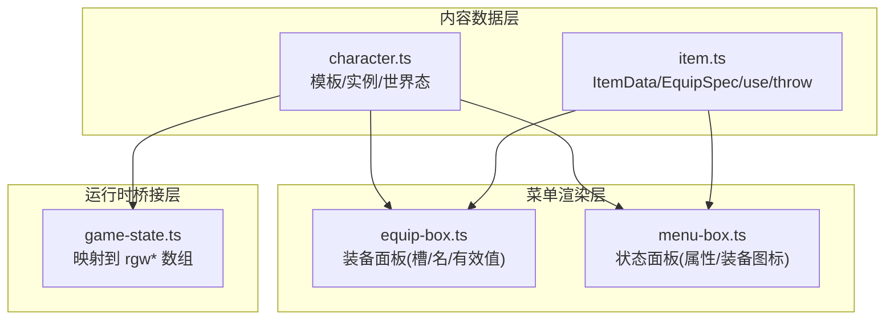
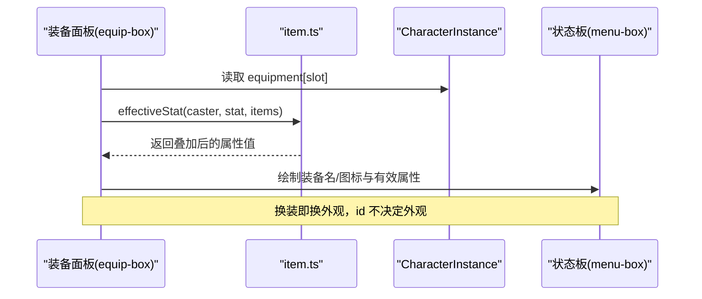
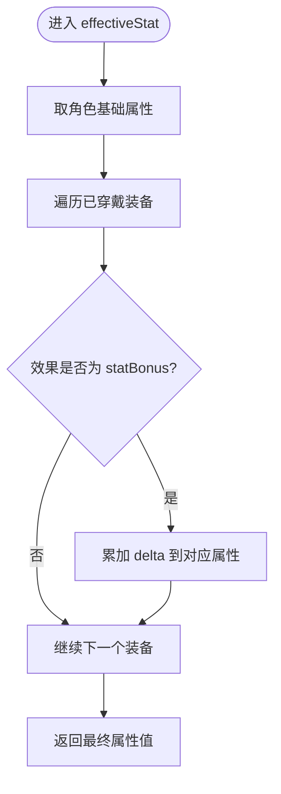
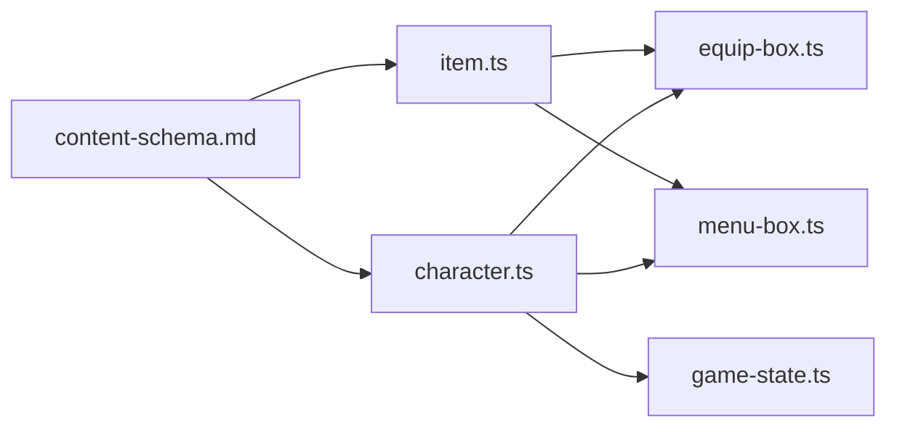

# 角色实体建模

<cite>
**本文引用的文件**   
- [content-schema.md](file://docs/phase2/foundation/content-schema.md)
- [item-data-design.md](file://docs/phase2/foundation/item-data-design.md)
- [character.ts](file://packages/content/src/character.ts)
- [item.ts](file://packages/content/src/item.ts)
- [equip-box.ts](file://packages/reforge/src/menu/equip-box.ts)
- [menu-box.ts](file://packages/reforge/src/menu/menu-box.ts)
- [draw-player-status.ts](file://packages/game/src/present/menu/draw-player-status.ts)
- [game-state.ts](file://packages/game/src/core/game-state.ts)
</cite>

## 目录
1. [引言](#引言)
2. [项目结构](#项目结构)
3. [核心组件](#核心组件)
4. [架构总览](#架构总览)
5. [详细组件分析](#详细组件分析)
6. [依赖关系分析](#依赖关系分析)
7. [性能考量](#性能考量)
8. [故障排查指南](#故障排查指南)
9. [结论](#结论)
10. [附录](#附录)

## 引言
本文件围绕“角色实体建模”展开，聚焦实例+组件+外观解耦的三件式设计：以稳定实例 id 为身份锚点、以组件承载状态（属性/装备/技能/buff 等）、以可替换外观层驱动视觉呈现。文档同时说明单机预置实例与 MMO 玩家实例的统一建模方式，给出从原版 roleId 到新模型的迁移策略，并预留未来 MMO 扩展接口。

## 项目结构
围绕角色实体建模的相关代码与文档分布在内容数据层、菜单渲染层与运行时桥接层：
- 内容数据层：定义模板、实例、世界态与物品/装备能力块
- 菜单渲染层：展示装备槽位、有效属性与名称
- 运行时桥接层：将新模型映射到旧版运行时数组结构，保证兼容



图示来源
- [character.ts:1-115](file://packages/content/src/character.ts#L1-L115)
- [item.ts:1-227](file://packages/content/src/item.ts#L1-L227)
- [equip-box.ts:129-187](file://packages/reforge/src/menu/equip-box.ts#L129-L187)
- [menu-box.ts:487-549](file://packages/reforge/src/menu/menu-box.ts#L487-L549)
- [game-state.ts:1383-1415](file://packages/game/src/core/game-state.ts#L1383-L1415)

章节来源
- [content-schema.md:23-140](file://docs/phase2/foundation/content-schema.md#L23-L140)
- [item-data-design.md:1-147](file://docs/phase2/foundation/item-data-design.md#L1-L147)

## 核心组件
- 角色模板 CharacterTemplate：描述初始数值、初始装备、初始仙术等 L2 内容层数据
- 角色实例 CharacterInstance：携带稳定 id、当前运行态属性、已穿戴装备、标签等 L1 世界态数据
- 世界态 WorldState：队伍、金钱、背包、习得技能表等全局存档态
- 物品/装备 ItemData/EquipSpec：一物多能力（装备/使用/投掷），通过能力块决定在哪些菜单出现
- 有效属性计算 effectiveStat：基础 + Σ 已穿戴 statBonus，纯函数，镜像 phase-1 行为

章节来源
- [character.ts:36-85](file://packages/content/src/character.ts#L36-L85)
- [item.ts:52-90](file://packages/content/src/item.ts#L52-L90)
- [item-data-design.md:27-66](file://docs/phase2/foundation/item-data-design.md#L27-L66)

## 架构总览
三件式角色实体建模的核心思想：
- 身份 = 稳定实例 id（不再绑定固定槽位）
- 状态 = 实例自带组件（属性/装备/技能/buff/标签）
- 外观 = 由「基础造型 + 装备覆盖」算出，id 不决定外观；大世界/战斗视图是同一外观模型的两个视图

```mermaid
classDiagram
class CharacterTemplate {
+string id
+TextId name
+baseStats
+initialEquipment
+initialMagic
}
class CharacterInstance {
+string id
+string template
+level
+exp
+hp/maxHP
+mp/maxMP
+attack/defense/magicAttack/speed/luck
+equipment : Record~slot,itemId~
+tags : string[]
}
class WorldState {
+party : CharacterInstance[]
+money : number
+learnedSkills : Record~charInstanceId,skillId[]~
+inventory : {itemId,count}[]
}
class ItemData {
+string id
+string name
+desc : string[]
+icon : number
+buyPrice/sellPrice/sellable
+equip? : EquipSpec
+use? : UseSpec
+throw? : ThrowSpec
}
class EquipSpec {
+slot : EquipSlot
+equipableBy : string[]
+effects : EquipEffect[]
}
CharacterTemplate <.. CharacterInstance : "instantiate()"
WorldState --> CharacterInstance : "持有"
CharacterInstance --> ItemData : "equipment[slot]"
ItemData --> EquipSpec : "可选能力块"
```

图示来源
- [character.ts:36-85](file://packages/content/src/character.ts#L36-L85)
- [item.ts:52-66](file://packages/content/src/item.ts#L52-L66)
- [item-data-design.md:45-66](file://docs/phase2/foundation/item-data-design.md#L45-L66)

## 详细组件分析

### 实例与模板分离（单机预置实例 vs MMO 玩家实例）
- 模板（L2）：定义初始数据与初始配置，如李逍遥的初始数值与初始装备
- 实例（L1）：每个玩家/NPC 都是独立实例，拥有稳定 id、当前 HP/MP/装备等
- 单机阶段：模板 ≈ 预置实例；MMO 阶段：模板 = 职业/原型，实例 = 每个玩家
- 统一建模：避免按 roleId 的全局 SoA，彻底去掉固定槽位限制

章节来源
- [content-schema.md:123-133](file://docs/phase2/foundation/content-schema.md#L123-L133)
- [character.ts:75-114](file://packages/content/src/character.ts#L75-L114)

### 组件系统设计与扩展机制
- 属性组件：level/exp/hp/mp/attack/defense/magicAttack/speed/luck 等
- 装备组件：equipment[slot] → itemId，支持 6 槽（weapon/head/body/cloak/feet/accessory）
- 技能组件：learnedSkills[charInstanceId] → skillId[]，独立表，便于 MMO 私有化
- Buff/毒/抗性：预留 tags 与后续引擎计算入口（resist/grant 等 phase3 实现）
- 扩展点：新增组件只需在 CharacterInstance 或 WorldState 中增加字段，并在 UI/逻辑处消费

章节来源
- [character.ts:36-53](file://packages/content/src/character.ts#L36-L53)
- [item-data-design.md:71-96](file://docs/phase2/foundation/item-data-design.md#L71-L96)

### 外观覆盖层工作原理
- 基础造型：CharacterInstance.avatar 作为基线
- 装备覆盖：根据已穿戴装备的效果（如 grantStatus/attackAll 等）影响外观与行为
- 视图切换：大世界外观与战斗外观是同一外观模型的两个视图，不再各存一份固定精灵号
- 渲染联动：菜单与状态板读取 equipment 与有效属性，显示装备名与图标



图示来源
- [equip-box.ts:129-187](file://packages/reforge/src/menu/equip-box.ts#L129-L187)
- [menu-box.ts:487-549](file://packages/reforge/src/menu/menu-box.ts#L487-L549)
- [item.ts:69-90](file://packages/content/src/item.ts#L69-L90)

章节来源
- [content-schema.md:123-133](file://docs/phase2/foundation/content-schema.md#L123-L133)
- [equip-box.ts:129-187](file://packages/reforge/src/menu/equip-box.ts#L129-L187)
- [menu-box.ts:523-549](file://packages/reforge/src/menu/menu-box.ts#L523-L549)

### 有效属性计算流程（statBonus）


图示来源
- [item.ts:69-90](file://packages/content/src/item.ts#L69-L90)

章节来源
- [item.ts:69-90](file://packages/content/src/item.ts#L69-L90)

### 从原版 roleId 到新模型的迁移策略
- 身份迁移：把原版的「第几号角色槽」改为稳定实例 id（不再是固定 6 槽）
- 状态迁移：把共享的 SoA 数组拆成实例自带组件（属性/装备/技能/buff/标签）
- 外观迁移：从「roleId 决定外观」改为「基础造型 + 装备覆盖」，大世界/战斗视图统一
- 迁移器职责：一次性把 extracted 内容翻进新 schema，全局下标→稳定 id，隐式对象状态→显式世界变量

章节来源
- [content-schema.md:113-133](file://docs/phase2/foundation/content-schema.md#L113-L133)

### 运行时桥接（兼容旧版 rgw* 数组）
- 将新模型的 CharacterInstance 映射到 PlayerRolesRuntime.rgw* 数组（avatar/equipment/magic/elementalResistance 等）
- 保持与 phase-1 行为一致，确保测试与 baseline 不受影响

章节来源
- [game-state.ts:1383-1415](file://packages/game/src/core/game-state.ts#L1383-L1415)

## 依赖关系分析
- content-schema.md 定义了角色/实体建模原则与三层状态模型，指导 character.ts 与 item.ts 的数据结构
- item.ts 提供装备能力块与有效属性计算，被 equip-box.ts 与 menu-box.ts 消费
- equip-box.ts 与 menu-box.ts 负责 UI 展示，读取 CharacterInstance.equipment 与 effectiveStat
- game-state.ts 负责将新模型映射到旧版运行时数组，维持兼容性



图示来源
- [content-schema.md:23-140](file://docs/phase2/foundation/content-schema.md#L23-L140)
- [character.ts:1-115](file://packages/content/src/character.ts#L1-L115)
- [item.ts:1-227](file://packages/content/src/item.ts#L1-L227)
- [equip-box.ts:129-187](file://packages/reforge/src/menu/equip-box.ts#L129-L187)
- [menu-box.ts:487-549](file://packages/reforge/src/menu/menu-box.ts#L487-L549)
- [game-state.ts:1383-1415](file://packages/game/src/core/game-state.ts#L1383-L1415)

章节来源
- [content-schema.md:23-140](file://docs/phase2/foundation/content-schema.md#L23-L140)
- [item-data-design.md:1-147](file://docs/phase2/foundation/item-data-design.md#L1-L147)

## 性能考量
- effectiveStat 为纯函数，仅遍历已穿戴装备与 effects，复杂度 O(S+E)，S 为槽数（6），E 为单个装备 effect 数量，开销极小
- UI 渲染仅在状态变化时重绘，避免每帧重复计算
- 运行时映射 rgw* 数组为批量赋值，适合热路径

[本节为通用指导，无需特定文件引用]

## 故障排查指南
- 装备未生效：检查 ItemData.equip.effects 是否包含 statBonus 且 stat 匹配；确认 CharacterInstance.equipment[slot] 已设置
- 有效属性显示异常：核对 effectiveStat 的 base 取值与叠加顺序；确认 items 字典注入正确
- 菜单无法选择某装备：校验 equipableBy 是否包含该角色 template；确认 inventory 中存在该物品
- 运行时不一致：检查 game-state.ts 的 rgw* 映射是否覆盖了 avatar/equipment/magic/elementalResistance

章节来源
- [item.ts:69-105](file://packages/content/src/item.ts#L69-L105)
- [equip-box.ts:129-187](file://packages/reforge/src/menu/equip-box.ts#L129-L187)
- [menu-box.ts:523-549](file://packages/reforge/src/menu/menu-box.ts#L523-L549)
- [game-state.ts:1383-1415](file://packages/game/src/core/game-state.ts#L1383-L1415)

## 结论
通过实例+组件+外观解耦的三件式设计，角色实体建模既满足单机预置实例的快速构建，又为 MMO 的多玩家实例与换装系统预留了清晰扩展口。配合稳定的实例 id、组件化的状态与可替换的外观覆盖层，系统在可扩展性、可维护性与向后兼容方面均具备良好基础。

[本节为总结，无需特定文件引用]

## 附录
- 术语对照
  - 模板（L2）：角色初始数据与配置
  - 实例（L1）：运行态数据，含当前属性与装备
  - 世界态（L1）：队伍、背包、金钱、习得技能等全局存档态
  - 外观覆盖：由基础造型与装备效果共同决定

[本节为概念补充，无需特定文件引用]