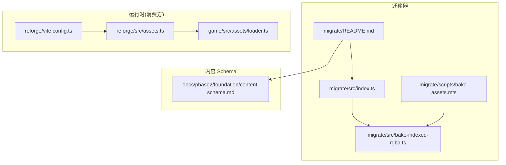
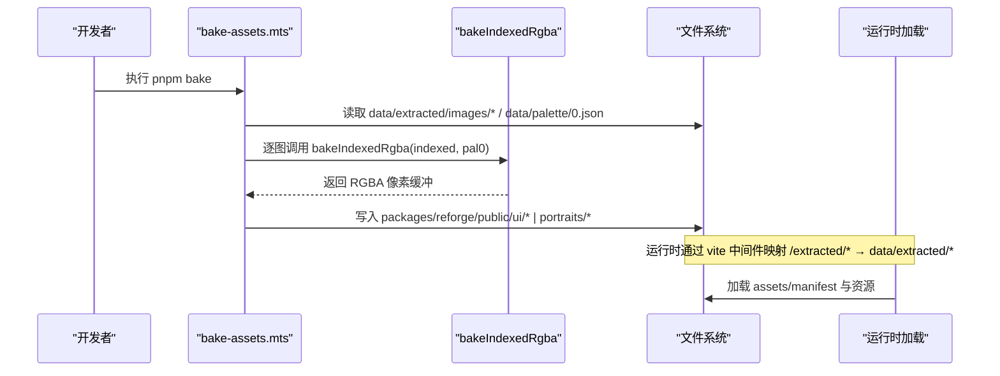
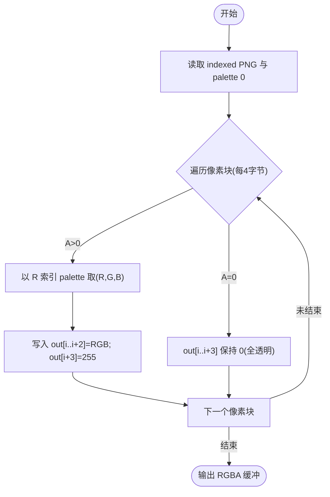
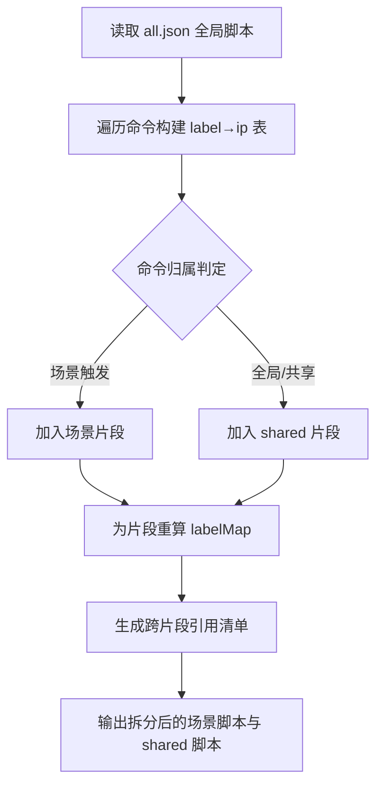
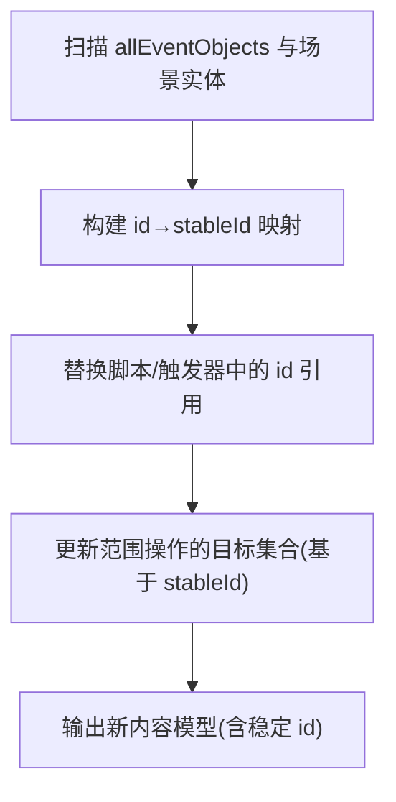
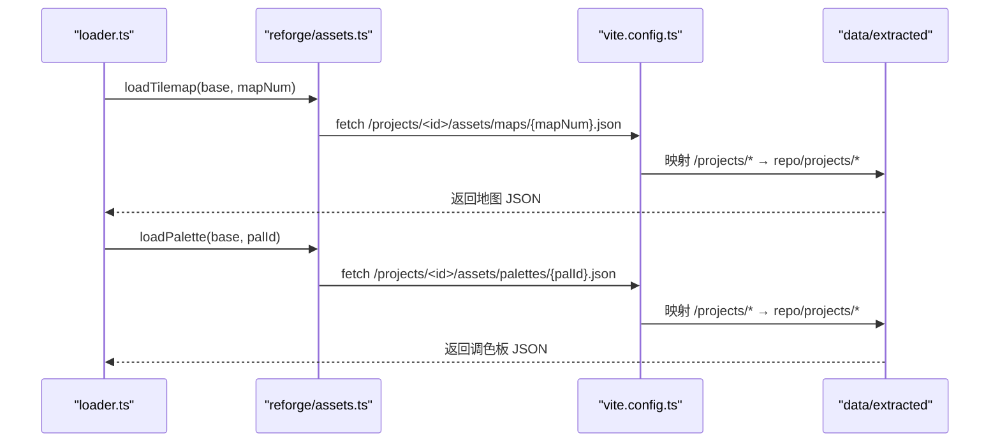
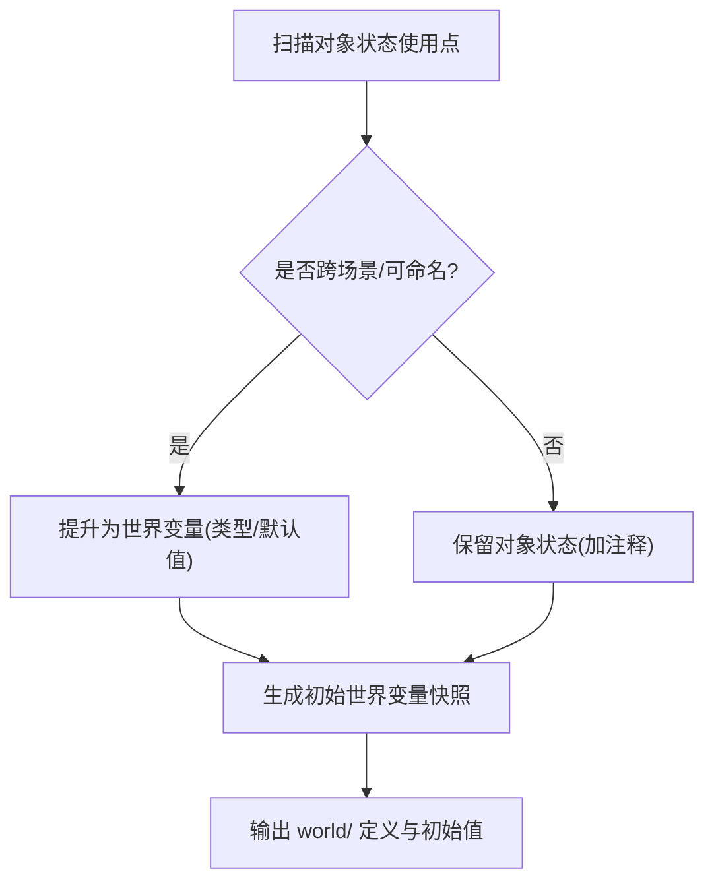
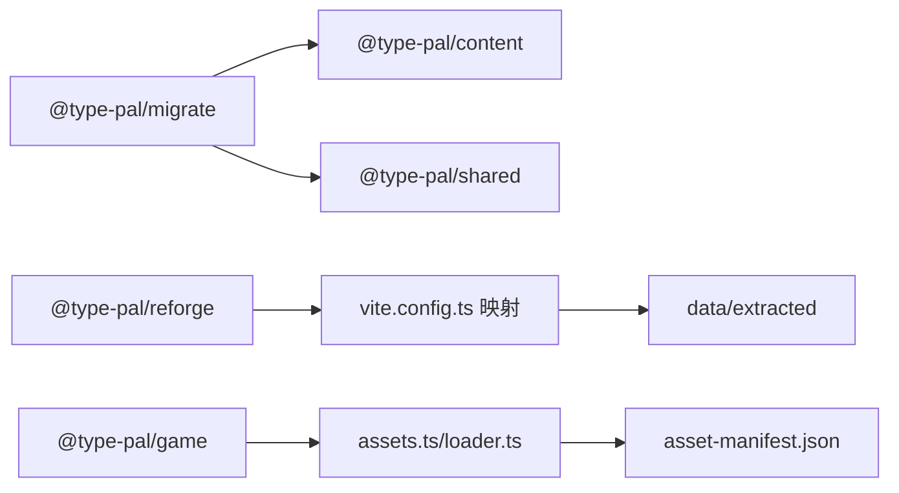

# 迁移器实现

<cite>
**本文引用的文件**
- [packages/migrate/README.md](file://packages/migrate/README.md)
- [packages/migrate/src/index.ts](file://packages/migrate/src/index.ts)
- [packages/migrate/src/bake-indexed-rgba.ts](file://packages/migrate/src/bake-indexed-rgba.ts)
- [packages/migrate/scripts/bake-assets.mts](file://packages/migrate/scripts/bake-assets.mts)
- [docs/phase2/foundation/content-schema.md](file://docs/phase2/foundation/content-schema.md)
- [packages/game/src/core/event-system.ts](file://packages/game/src/core/event-system.ts)
- [packages/game/src/core/event-system.test.ts](file://packages/game/src/core/event-system.test.ts)
- [packages/pal-extract/src/resources/asset-manifest.ts](file://packages/pal-extract/src/resources/asset-manifest.ts)
- [packages/reforge/vite.config.ts](file://packages/reforge/vite.config.ts)
- [packages/reforge/src/assets.ts](file://packages/reforge/src/assets.ts)
- [packages/game/src/assets/loader.ts](file://packages/game/src/assets/loader.ts)
</cite>

## 目录
1. [引言](#引言)
2. [项目结构](#项目结构)
3. [核心组件](#核心组件)
4. [架构总览](#架构总览)
5. [详细组件分析](#详细组件分析)
6. [依赖分析](#依赖分析)
7. [性能考虑](#性能考虑)
8. [故障排查指南](#故障排查指南)
9. [结论](#结论)
10. [附录](#附录)

## 引言
本文件聚焦“第二阶段迁移器”的实现与流程，目标是将第一阶段产物 data/extracted 完整迁移到第二阶段内容工程 content。文档覆盖以下关键主题：
- 从 data/extracted 到新 content 格式的端到端迁移流程
- all.json 全局脚本拆分、label 局部化、全局对象下标转稳定 id 的算法
- 素材引用归位到 assets/ 的路径映射规则
- 隐式对象状态记忆到显式世界变量的转换策略与保留机制
- 迁移过程中的错误处理、数据验证与回滚方案
- 迁移质量检查工具与人工修复指南

## 项目结构
迁移器位于 packages/migrate，职责边界清晰：只做离线一次性转换，不进入运行时；依赖 content（目标 schema）和 shared（读取原版解码），是唯一合法触碰第一阶段的第二阶段包。

图表来源
- [packages/migrate/README.md:1-45](file://packages/migrate/README.md#L1-L45)
- [packages/migrate/src/index.ts:1-13](file://packages/migrate/src/index.ts#L1-L13)
- [packages/migrate/src/bake-indexed-rgba.ts:1-24](file://packages/migrate/src/bake-indexed-rgba.ts#L1-L24)
- [packages/migrate/scripts/bake-assets.mts:1-195](file://packages/migrate/scripts/bake-assets.mts#L1-L195)
- [docs/phase2/foundation/content-schema.md:1-140](file://docs/phase2/foundation/content-schema.md#L1-L140)
- [packages/reforge/vite.config.ts:1-19](file://packages/reforge/vite.config.ts#L1-L19)
- [packages/reforge/src/assets.ts:1-30](file://packages/reforge/src/assets.ts#L1-L30)
- [packages/game/src/assets/loader.ts:223-237](file://packages/game/src/assets/loader.ts#L223-L237)

章节来源
- [packages/migrate/README.md:1-45](file://packages/migrate/README.md#L1-L45)
- [packages/migrate/src/index.ts:1-13](file://packages/migrate/src/index.ts#L1-L13)

## 核心组件
- 资产烘焙核心：bakeIndexedRgba(src, palette)，将 indexed PNG（R=palette index，A=透明度掩码）转换为真彩 RGBA。纯函数，无 IO，便于单测。
- CLI 管线：bake-assets.mts 负责读取 data/extracted 下的 indexed PNG 与 palette 0，调用核心进行烘焙，并输出到 reforge/public（过渡路径）。
- 入口导出：index.ts 仅暴露 bakeIndexedRgba，保持最小 API 面。

章节来源
- [packages/migrate/src/bake-indexed-rgba.ts:1-24](file://packages/migrate/src/bake-indexed-rgba.ts#L1-L24)
- [packages/migrate/scripts/bake-assets.mts:1-195](file://packages/migrate/scripts/bake-assets.mts#L1-L195)
- [packages/migrate/src/index.ts:1-13](file://packages/migrate/src/index.ts#L1-L13)

## 架构总览
迁移器作为“提取 → 内容工程”的桥接层，分为两条并行流水线：
- 资产迁移：indexed PNG + palette 0 → RGBA PNG（UI box、头像等）
- 数据迁移：all.json 全局脚本拆分、label 局部化、全局对象下标→稳定 id、素材引用归位、隐式状态→显式世界变量

图表来源
- [packages/migrate/scripts/bake-assets.mts:1-195](file://packages/migrate/scripts/bake-assets.mts#L1-L195)
- [packages/migrate/src/bake-indexed-rgba.ts:1-24](file://packages/migrate/src/bake-indexed-rgba.ts#L1-L24)
- [packages/reforge/vite.config.ts:1-19](file://packages/reforge/vite.config.ts#L1-L19)
- [packages/game/src/assets/loader.ts:223-237](file://packages/game/src/assets/loader.ts#L223-L237)

## 详细组件分析

### 资产迁移：indexed → RGBA 烘焙
- 输入约定：PNG 像素为 R=G=B=palette index，A=透明掩码；非透明像素按 R 查 palette 填充 RGB，A 写满 255；透明像素保持全透明。
- 输出：RGBA 像素缓冲，由 CLI 层写入 PNG。
- 适用资产：头像、菜单 UI box、数字、卷轴九宫格、物品图标、魔法菜单元素等。

图表来源
- [packages/migrate/src/bake-indexed-rgba.ts:1-24](file://packages/migrate/src/bake-indexed-rgba.ts#L1-L24)
- [packages/migrate/scripts/bake-assets.mts:25-49](file://packages/migrate/scripts/bake-assets.mts#L25-L49)

章节来源
- [packages/migrate/src/bake-indexed-rgba.ts:1-24](file://packages/migrate/src/bake-indexed-rgba.ts#L1-L24)
- [packages/migrate/scripts/bake-assets.mts:1-195](file://packages/migrate/scripts/bake-assets.mts#L1-L195)

### 数据迁移：all.json 全局脚本拆分与 label 局部化
- 现状：P2#5 后事件系统塌缩为单一全局数组，resolveScriptLabel 只查全局 labelMap（L_<n> → n），不再区分 scene/shared 前缀。
- 迁移目标：将 all.json 拆分为场景内脚本与 shared/ 共享脚本，并将 L_<n> 标签局部化到各自命令数组，同时维护跨场景引用。
- 算法要点：
  - 扫描 all.json 所有命令，收集 label 定义与其在全局数组中的 ip。
  - 根据触发源归属（场景触发 vs 全局触发）将命令切片至对应场景或 shared。
  - 对每个片段重建 labelMap，使 goto/call 在片段内解析；跨片段引用记录为稳定 ref。
  - 清理 shared# 前缀兼容逻辑，统一走稳定 ref。

图表来源
- [packages/game/src/core/event-system.ts:794-815](file://packages/game/src/core/event-system.ts#L794-L815)
- [packages/game/src/core/event-system.test.ts:3565-3590](file://packages/game/src/core/event-system.test.ts#L3565-L3590)

章节来源
- [packages/game/src/core/event-system.ts:794-815](file://packages/game/src/core/event-system.ts#L794-L815)
- [packages/game/src/core/event-system.test.ts:3565-3590](file://packages/game/src/core/event-system.test.ts#L3565-L3590)

### 数据迁移：全局对象下标 → 稳定 id
- 现状：事件系统仍使用全局对象 id（如 gs.allEventObjects 中 id 字段），部分指令支持 1-based 显式 id。
- 迁移目标：为每个对象分配稳定 id（语义名或 uuid），并在场景实体、触发器、脚本引用处替换为稳定 ref。
- 算法要点：
  - 遍历 allEventObjects 与场景实体，建立 id→stableId 映射。
  - 将 1-based 显式 id 转为 0-based 后再映射为 stableId。
  - 更新所有跨场景范围操作（如 setMultiState）的寻址逻辑，使其基于 stableId 集合。
  - 在编辑器侧提供稳定 id 的可视化管理与冲突检测。

图表来源
- [packages/game/src/core/event-system.test.ts:3888-3905](file://packages/game/src/core/event-system.test.ts#L3888-L3905)

章节来源
- [packages/game/src/core/event-system.test.ts:3888-3905](file://packages/game/src/core/event-system.test.ts#L3888-L3905)

### 素材引用归位到 assets/ 的路径映射规则
- 现状：运行时通过 vite 中间件将 /extracted/* 映射到 data/extracted/*；资源清单 asset-manifest.json 用于版本化与预缓存。
- 迁移目标：将素材引用统一到 content/assets/ 目录，并通过 manifest.assets.* 子目录组织 maps/tilesets/sprites/palettes。
- 映射规则：
  - 旧路径 /extracted/images/world/npc/{id}/frame-{idx}.png → 新路径 projects/<id>/assets/sprites/{id}/frame-{idx}.png
  - 旧路径 /extracted/images/battle/bg/{id}.png → 新路径 projects/<id>/assets/maps/{id}.png（或 sprites/battle-bg/{id}.png，依 schema 而定）
  - 旧路径 /extracted/data/battle-sprites.json → 新路径 projects/<id>/assets/sprites/battle-sprites.json
  - 运行时 loader 通过 AssetBase.root + base.maps/base.sprites/base.palettes 拼接 URL。

图表来源
- [packages/game/src/assets/loader.ts:223-237](file://packages/game/src/assets/loader.ts#L223-L237)
- [packages/reforge/src/assets.ts:1-30](file://packages/reforge/src/assets.ts#L1-L30)
- [packages/reforge/vite.config.ts:1-19](file://packages/reforge/vite.config.ts#L1-L19)
- [packages/pal-extract/src/resources/asset-manifest.ts:1-39](file://packages/pal-extract/src/resources/asset-manifest.ts#L1-L39)

章节来源
- [packages/game/src/assets/loader.ts:223-237](file://packages/game/src/assets/loader.ts#L223-L237)
- [packages/reforge/src/assets.ts:1-30](file://packages/reforge/src/assets.ts#L1-L30)
- [packages/reforge/vite.config.ts:1-19](file://packages/reforge/vite.config.ts#L1-L19)
- [packages/pal-extract/src/resources/asset-manifest.ts:1-39](file://packages/pal-extract/src/resources/asset-manifest.ts#L1-L39)

### 隐式对象状态记忆 → 显式世界变量
- 现状：剧情进度、时间、天气等通过对象 sState 等隐式状态记录，难以跨场景理解与维护。
- 迁移目标：显式化为 world/ 下的世界变量表（布尔开关、数值、枚举等），事件/演出读写世界变量，渲染/场景订阅响应。
- 转换策略：
  - 识别高频且跨场景影响的状态位（如“拿到剑”“某地已探索”），提升为世界变量。
  - 无法显式化的细节保留对象状态机制，但添加标注说明其用途与风险。
  - 在迁移阶段生成初始世界变量快照，确保首次运行行为一致。

图表来源
- [docs/phase2/foundation/content-schema.md:42-49](file://docs/phase2/foundation/content-schema.md#L42-L49)

章节来源
- [docs/phase2/foundation/content-schema.md:42-49](file://docs/phase2/foundation/content-schema.md#L42-L49)

### 迁移质量检查与人工修复指南
- 校验层：validate-refs.ts 提供跨引用完整性校验（error/warn 分级），定位具体数据路径，避免坏数据累积。
- 建议流程：
  - 先跑 schema 形状校验，再跑引用完整性校验。
  - 对 error 级问题优先修复；warn 级问题评估降级策略（如显示 id）。
  - 对无法自动修复的问题，记录 TODO 并在编辑器中补录。
- 人工修复要点：
  - 稳定 id 冲突：合并重复项或重命名。
  - 跨场景引用悬空：补齐缺失实体或修正引用。
  - 素材缺失：核对 manifest 与实际文件一致性。

章节来源
- [packages/content/src/validate-refs.ts:1-43](file://packages/content/src/validate-refs.ts#L1-L43)

## 依赖分析
- 迁移器依赖：
  - @type-pal/content：目标 schema（内容模型）
  - @type-pal/shared：读取第一阶段 extracted 解码产物
- 运行时消费：
  - reforge 通过 vite 中间件映射 /projects/* 与 /extracted/*
  - game 资源 loader 通过 manifest 与 AssetBase 组装 URL

图表来源
- [packages/migrate/README.md:40-45](file://packages/migrate/README.md#L40-L45)
- [packages/reforge/vite.config.ts:1-19](file://packages/reforge/vite.config.ts#L1-L19)
- [packages/game/src/assets/loader.ts:223-237](file://packages/game/src/assets/loader.ts#L223-L237)
- [packages/pal-extract/src/resources/asset-manifest.ts:1-39](file://packages/pal-extract/src/resources/asset-manifest.ts#L1-L39)

章节来源
- [packages/migrate/README.md:40-45](file://packages/migrate/README.md#L40-L45)

## 性能考虑
- 资产烘焙：bakeIndexedRgba 为线性扫描，内存占用与输入像素数成正比；批量处理时注意分片与并发控制。
- CLI 输出：PNG 写入为同步 I/O，建议在大规模资产时采用队列与限流，避免阻塞。
- 运行时加载：asset-manifest.version 对内容变化敏感，利于浏览器缓存命中；合理划分资源粒度，减少首屏体积。

[本节为通用指导，无需源码引用]

## 故障排查指南
- 资源 404：检查 vite 中间件映射是否正确，确认 /projects/* 与 /extracted/* 指向仓库根真实目录。
- JSON 解析失败：核对 asset-manifest 与资源实际存在性，确保 buildManifest 排序稳定且排除自身。
- 事件 label 解析异常：确认 resolveScriptLabel 的全局 labelMap 已正确初始化，跨片段引用已转换为稳定 ref。
- 对象状态不一致：核查 setMultiState 等范围操作的目标集合是否基于稳定 id 计算。

章节来源
- [packages/reforge/vite.config.ts:1-19](file://packages/reforge/vite.config.ts#L1-L19)
- [packages/pal-extract/src/resources/asset-manifest.ts:1-39](file://packages/pal-extract/src/resources/asset-manifest.ts#L1-L39)
- [packages/game/src/core/event-system.ts:794-815](file://packages/game/src/core/event-system.ts#L794-L815)

## 结论
迁移器以“离线一次性转换”为核心定位，当前资产迁移已落地（头像、UI box 等），数据迁移处于③阶段。通过 all.json 拆分、label 局部化、全局下标→稳定 id、素材归位与显式世界变量，逐步将原版内容平滑迁移至新引擎可消费的内容工程。配合 validate-refs 的质量保障与 vite 的资源映射，形成从提取到运行的闭环。

[本节为总结，无需源码引用]

## 附录
- 运行命令：pnpm --filter @type-pal/migrate run bake
- 设计参考：content-schema §8（迁移器）、asset-pipeline（D-a/D-c/D-d）、decisions D18/D15

章节来源
- [packages/migrate/README.md:1-45](file://packages/migrate/README.md#L1-L45)
- [docs/phase2/foundation/content-schema.md:113-122](file://docs/phase2/foundation/content-schema.md#L113-L122)