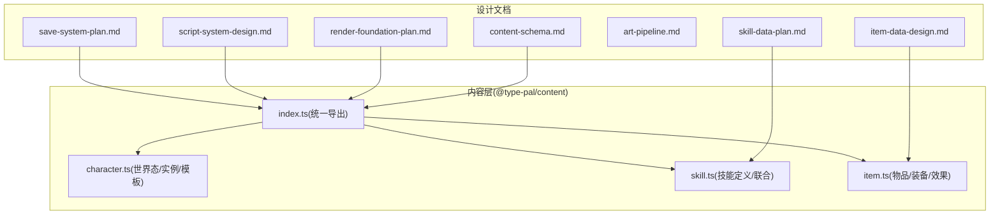
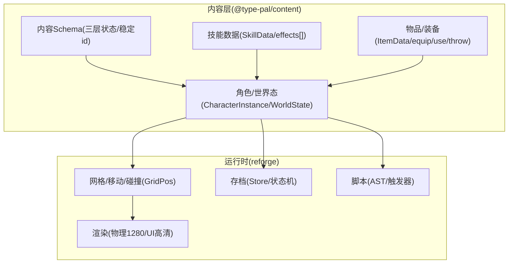
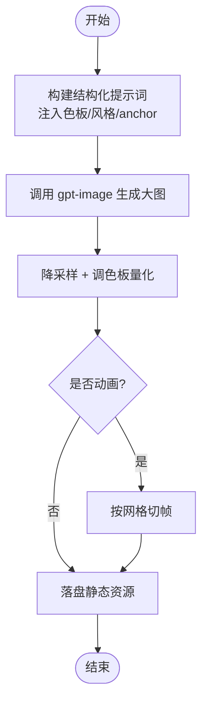
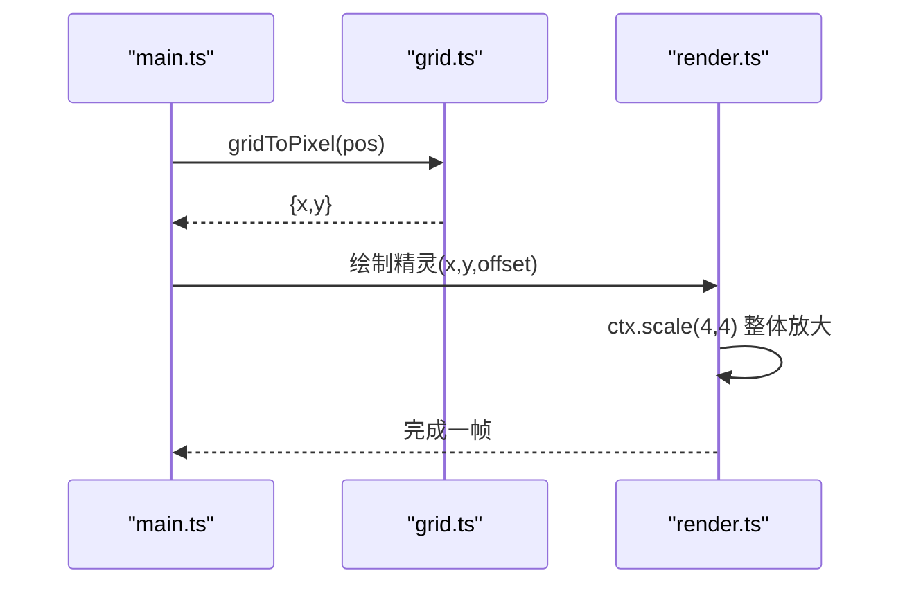
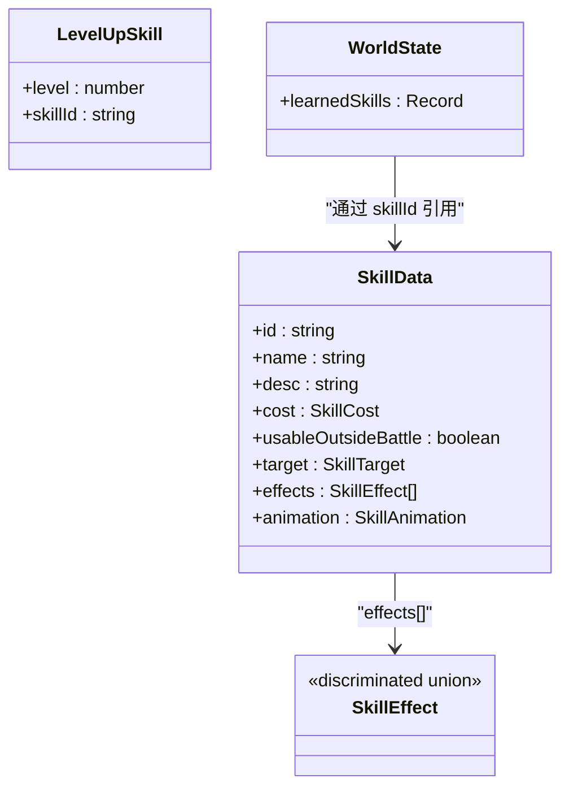
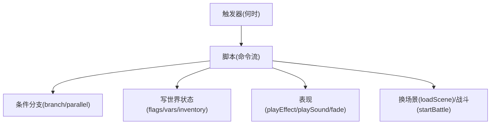
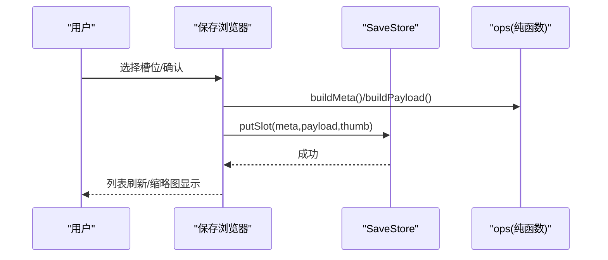
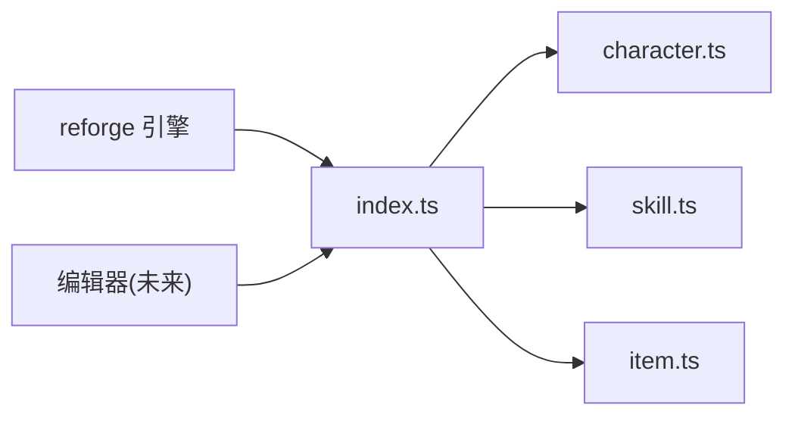

# 地基系统

<cite>
**本文引用的文件**   
- [content-schema.md](file://docs/phase2/foundation/content-schema.md)
- [skill-data-plan.md](file://docs/phase2/foundation/skill-data-plan.md)
- [item-data-design.md](file://docs/phase2/foundation/item-data-design.md)
- [render-foundation-plan.md](file://docs/phase2/foundation/render-foundation-plan.md)
- [art-pipeline.md](file://docs/phase2/foundation/art-pipeline.md)
- [script-system-design.md](file://docs/phase2/foundation/script-system-design.md)
- [save-system-plan.md](file://docs/phase2/foundation/save-system-plan.md)
- [index.ts](file://packages/content/src/index.ts)
- [character.ts](file://packages/content/src/character.ts)
- [skill.ts](file://packages/content/src/skill.ts)
- [item.ts](file://packages/content/src/item.ts)
</cite>

## 目录
1. [引言](#引言)
2. [项目结构](#项目结构)
3. [核心组件](#核心组件)
4. [架构总览](#架构总览)
5. [详细组件分析](#详细组件分析)
6. [依赖关系分析](#依赖关系分析)
7. [性能与扩展性](#性能与扩展性)
8. [故障排查指南](#故障排查指南)
9. [结论](#结论)
10. [附录：使用与扩展指南](#附录使用与扩展指南)

## 引言
本文件为第二阶段“地基系统”的综合文档，聚焦跨切片的地基设计与实现要点。内容覆盖：
- 内容数据模型（三层状态、稳定 id、场景包、事件演出、角色实例化）
- 美术资产管线（像素风生图流程）
- 渲染地基改造（格坐标 + 物理 1280 + UI 高清化）
- 技能数据三层架构（SkillData + effects[] 联合 / learnedSkills 关系表 / levelUpSkills 等级表）
- 物品装备数据架构（一物多能力块 equip/use/throw + EquipEffect 联合 + 6 槽 + 有效属性）
并提供各组件的使用指南与扩展方法，帮助读者快速上手并安全演进。

## 项目结构
第二阶段以“内容层 @type-pal/content”为核心，提供纯数据与类型；运行时由 reforge 消费；编辑器未来生产内容。关键组织方式：
- 设计文档集中于 docs/phase2/foundation，定义 schema、计划与设计决策
- 代码集中在 packages/content/src，导出稳定的类型与少量纯函数（如换装、有效属性计算）
- 索引文件统一 re-export，形成对外 API 面



图表来源
- [content-schema.md:1-140](file://docs/phase2/foundation/content-schema.md#L1-L140)
- [skill-data-plan.md:1-423](file://docs/phase2/foundation/skill-data-plan.md#L1-L423)
- [item-data-design.md:1-147](file://docs/phase2/foundation/item-data-design.md#L1-L147)
- [render-foundation-plan.md:1-266](file://docs/phase2/foundation/render-foundation-plan.md#L1-L266)
- [art-pipeline.md:1-268](file://docs/phase2/foundation/art-pipeline.md#L1-L268)
- [script-system-design.md:1-168](file://docs/phase2/foundation/script-system-design.md#L1-L168)
- [save-system-plan.md:1-491](file://docs/phase2/foundation/save-system-plan.md#L1-L491)
- [index.ts:1-101](file://packages/content/src/index.ts#L1-L101)

章节来源
- [content-schema.md:1-140](file://docs/phase2/foundation/content-schema.md#L1-L140)
- [index.ts:1-101](file://packages/content/src/index.ts#L1-L101)

## 核心组件
- 内容 Schema 与三层状态：明确 L1 世界态、L2 场景静态、L3 运行态边界，稳定 id 贯穿所有实体引用
- 技能数据三层：SkillData + effects[] 判别联合、learnedSkills 关系表、levelUpSkills 习得规则
- 物品/装备数据：ItemData 基类 + equip/use/throw 能力块 + EquipEffect 联合 + 6 槽 + effectiveStat 有效属性
- 渲染地基：GridPos 菱形轴坐标、物理分辨率 1280、UI 高清化
- 脚本系统：结构化 AST 命令集、触发器与实体页模型
- 存档系统：存储抽象 + 浏览状态机 + 缩略图与热键集成

章节来源
- [content-schema.md:23-67](file://docs/phase2/foundation/content-schema.md#L23-L67)
- [skill-data-plan.md:22-199](file://docs/phase2/foundation/skill-data-plan.md#L22-L199)
- [item-data-design.md:27-115](file://docs/phase2/foundation/item-data-design.md#L27-L115)
- [render-foundation-plan.md:21-54](file://docs/phase2/foundation/render-foundation-plan.md#L21-L54)
- [script-system-design.md:15-118](file://docs/phase2/foundation/script-system-design.md#L15-L118)
- [save-system-plan.md:42-233](file://docs/phase2/foundation/save-system-plan.md#L42-L233)

## 架构总览
整体采用“内容层纯数据 + 引擎消费 + 编辑器生产”的解耦模式。内容层通过稳定 id 和显式 schema 表达游戏世界；引擎负责将内容加载到运行时；编辑器面向 L2 场景静态进行可视化编排。



图表来源
- [content-schema.md:23-67](file://docs/phase2/foundation/content-schema.md#L23-L67)
- [skill.ts:1-75](file://packages/content/src/skill.ts#L1-L75)
- [item.ts:1-227](file://packages/content/src/item.ts#L1-L227)
- [character.ts:1-115](file://packages/content/src/character.ts#L1-L115)
- [render-foundation-plan.md:21-54](file://docs/phase2/foundation/render-foundation-plan.md#L21-L54)
- [save-system-plan.md:42-233](file://docs/phase2/foundation/save-system-plan.md#L42-L233)
- [script-system-design.md:15-118](file://docs/phase2/foundation/script-system-design.md#L15-L118)

## 详细组件分析

### 内容数据模型（三层状态、稳定 id、场景包、事件演出、角色实例化）
- 三层状态：L1 世界态（存档）、L2 场景静态（内容）、L3 运行态（临时）
- 稳定 id：杜绝下标，跨场景引用用稳定 ref
- 场景包：自包含 map/entities/cutscenes/triggers/entry
- 事件演出：触发器（何时）+ 演出时间线（演什么），兼容原版 opcode 的兼容层留口
- 角色实例化：身份=实例 id，状态=组件，外观=基础造型+装备覆盖

```mermaid
classDiagram
class WorldState {
+party : CharacterInstance[]
+money : number
+learnedSkills : Record<string,string[]>
+inventory : {itemId : string;count : number}[]
}
class CharacterInstance {
+id : string
+template : string
+level : number
+equipment : Record<string,string>
}
class SceneDef {
+map
+entities : EntityDef[]
+dialogues : Dialogue[]
+entry
}
class EntityDef {
+id : string
+pos : GridPos
+sprite : string
+collide? : boolean
+interact? : string
}
WorldState --> CharacterInstance : "队伍"
SceneDef --> EntityDef : "实体"
EntityDef --> GridPos : "位置"
```

图表来源
- [content-schema.md:23-67](file://docs/phase2/foundation/content-schema.md#L23-L67)
- [index.ts:55-90](file://packages/content/src/index.ts#L55-L90)
- [character.ts:3-11](file://packages/content/src/character.ts#L3-L11)

章节来源
- [content-schema.md:23-67](file://docs/phase2/foundation/content-schema.md#L23-L67)
- [index.ts:55-90](file://packages/content/src/index.ts#L55-L90)
- [character.ts:3-11](file://packages/content/src/character.ts#L3-L11)

### 美术资产管线（像素风生图流程）
- 双路 OpenAI 客户端 + 结构化 prompt 注入（色板/风格锚定/中文约束）
- 降采样 + 调色板量化后处理
- 动画 sprite sheet 直出 + 切帧（gpt-image 一次生成整张 sheet）
- 斜 45° 视角实验与一致性校准（ControlNet/LoRA 备选）



图表来源
- [art-pipeline.md:50-130](file://docs/phase2/foundation/art-pipeline.md#L50-L130)
- [art-pipeline.md:132-187](file://docs/phase2/foundation/art-pipeline.md#L132-L187)

章节来源
- [art-pipeline.md:50-130](file://docs/phase2/foundation/art-pipeline.md#L50-L130)
- [art-pipeline.md:132-187](file://docs/phase2/foundation/art-pipeline.md#L132-L187)

### 渲染地基改造（格坐标 + 物理 1280 + UI 高清化）
- GridPos={col,row,height} 菱形轴坐标，走一格单轴 ±1
- gridToPixel/pixelToGrid 纯函数换算
- 物理分辨率 1280×800，逻辑 320×200，渲染 ×4
- UI 高清化：POS 常量 × UI_SCALE，点阵字整数倍放大不换源



图表来源
- [render-foundation-plan.md:34-54](file://docs/phase2/foundation/render-foundation-plan.md#L34-L54)
- [render-foundation-plan.md:192-234](file://docs/phase2/foundation/render-foundation-plan.md#L192-L234)

章节来源
- [render-foundation-plan.md:34-54](file://docs/phase2/foundation/render-foundation-plan.md#L34-L54)
- [render-foundation-plan.md:192-234](file://docs/phase2/foundation/render-foundation-plan.md#L192-L234)

### 技能数据三层架构
- ① SkillData + effects[] 判别联合（damage/heal/status/buff 等）
- ② learnedSkills 关系表（WorldState.learnedSkills: charInstanceId → skillId[]）
- ③ levelUpSkills 习得规则（角色模板升级自动习得）



图表来源
- [skill.ts:1-75](file://packages/content/src/skill.ts#L1-L75)
- [skill-data-plan.md:294-423](file://docs/phase2/foundation/skill-data-plan.md#L294-L423)
- [character.ts:3-11](file://packages/content/src/character.ts#L3-L11)

章节来源
- [skill.ts:1-75](file://packages/content/src/skill.ts#L1-L75)
- [skill-data-plan.md:22-199](file://docs/phase2/foundation/skill-data-plan.md#L22-L199)
- [skill-data-plan.md:294-423](file://docs/phase2/foundation/skill-data-plan.md#L294-L423)
- [character.ts:3-11](file://packages/content/src/character.ts#L3-L11)

### 物品装备数据架构（一物多能力块 + 6 槽 + 有效属性）
- ItemData 基类：equip?/use?/throw? 能力块可叠加
- EquipSpec：slot(equipableBy/effects)、6 槽对齐原版 body part
- EquipEffect 联合：statBonus/resistance/maxPool/grantStatus/grantSkill/attackAll
- effectiveStat：基础 + Σ 已穿戴 statBonus
- 持有/穿戴：WorldState.inventory + CharacterInstance.equipment

```mermaid
classDiagram
class ItemData {
+id : string
+name : string
+desc : string[]
+icon : number
+buyPrice : number
+sellPrice : number
+sellable : boolean
+equip? : EquipSpec
+use? : UseSpec
+throw? : ThrowSpec
}
class EquipSpec {
+slot : EquipSlot
+equipableBy : string[]
+effects : EquipEffect[]
}
class EquipEffect {
<<discriminated union>>
}
class WorldState {
+inventory : {itemId : string;count : number}[]
}
class CharacterInstance {
+equipment : Record<string,string>
}
WorldState --> ItemData : "inventory"
CharacterInstance --> ItemData : "equipment(slot→itemId)"
ItemData --> EquipSpec : "可选"
EquipSpec --> EquipEffect : "effects[]"
```

图表来源
- [item.ts:1-227](file://packages/content/src/item.ts#L1-L227)
- [item-data-design.md:27-115](file://docs/phase2/foundation/item-data-design.md#L27-L115)
- [character.ts:36-53](file://packages/content/src/character.ts#L36-L53)

章节来源
- [item.ts:1-227](file://packages/content/src/item.ts#L1-L227)
- [item-data-design.md:27-115](file://docs/phase2/foundation/item-data-design.md#L27-L115)
- [character.ts:36-53](file://packages/content/src/character.ts#L36-L53)

### 剧情脚本系统（AST 命令 + 触发器 + 实体页）
- 条件 Condition（flag/var/hasItem/组合）
- 命令 Command（dialog/moveActor/camera/giveItem/setFlag/wait/branch/parallel/callScript/loadScene/startBattle/stop）
- 实体页模型（EntityPage.when/sprite/pos/trigger）
- 模板 TemplateInstance（chest/pickup/talk 等 expand 为标准命令）



图表来源
- [script-system-design.md:15-118](file://docs/phase2/foundation/script-system-design.md#L15-L118)

章节来源
- [script-system-design.md:15-118](file://docs/phase2/foundation/script-system-design.md#L15-L118)

### 存档系统（存储抽象 + 浏览状态机 + 缩略图/热键）
- 存储层：SaveStore 接口 + MemorySaveStore + IndexedDbSaveStore
- 浏览状态机：open/close/moveCursor/confirm/覆盖确认
- ops：buildMeta/buildPayload（纯函数）
- 集成：F5/F9 热键、系统菜单 save/load、缩略图捕获



图表来源
- [save-system-plan.md:42-233](file://docs/phase2/foundation/save-system-plan.md#L42-L233)
- [save-system-plan.md:236-453](file://docs/phase2/foundation/save-system-plan.md#L236-L453)

章节来源
- [save-system-plan.md:42-233](file://docs/phase2/foundation/save-system-plan.md#L42-L233)
- [save-system-plan.md:236-453](file://docs/phase2/foundation/save-system-plan.md#L236-L453)

## 依赖关系分析
- 内容层内部：index.ts 统一导出 character/skill/item/grid 等模块
- 外部依赖方向：reforge/editor 消费 content；content 不反向依赖 reforge
- 数据契约：SkillDataMap/ItemDataMap 作为显式注入，避免全局隐式耦合



图表来源
- [index.ts:92-101](file://packages/content/src/index.ts#L92-L101)

章节来源
- [index.ts:92-101](file://packages/content/src/index.ts#L92-L101)

## 性能与扩展性
- 渲染：物理 1280 整数倍缩放 + nearest-neighbor，点阵锐利；相机/遮挡在逻辑坐标计算，最后统一 ×4
- 数据：Record<id, …> 替代数组下标，O(1) 查找；effectiveStat/equipItem 等纯函数无副作用，便于缓存与并行
- 可扩展：
  - 技能：新增 SkillEffect kind 即可扩展效果
  - 物品：新增 EquipEffect/UseEffect/ThrowSpec 能力块
  - 地图：每图自带宽高，N 视觉层 + 独立碰撞/地形层
  - 脚本：命令集 content-first 增长，模板 expand 标准化

[本节为通用指导，无需具体文件分析]

## 故障排查指南
- 技能/物品引用校验：validate-refs 对 levelUp.skillId 等进行断言，出现 warn 需检查数据一致性
- 存档：MemorySaveStore 用于单测；IndexedDbSaveStore 在浏览器环境验证；注意 version 字段驱动迁移
- 渲染：若画面错位，优先检查 GridPos 与 gridToPixel 换算、camera 跟随逻辑与 scale 设置
- 脚本：确保 trigger 条件与 flags/vars 一致，避免死循环或空跳转

章节来源
- [validate-refs.ts:145-154](file://packages/content/src/validate-refs.ts#L145-L154)
- [save-system-plan.md:42-233](file://docs/phase2/foundation/save-system-plan.md#L42-L233)
- [render-foundation-plan.md:192-234](file://docs/phase2/foundation/render-foundation-plan.md#L192-L234)

## 结论
第二阶段地基以“内容层纯数据 + 稳定 id + 显式 schema”为核心，打通了技能与物品的数据模型、渲染坐标与分辨率、脚本与存档的基础设施。该体系具备良好扩展性与可测试性，为后续菜单、战斗、编辑器与商业化替换资产奠定坚实基础。

[本节为总结，无需具体文件分析]

## 附录：使用与扩展指南

### 内容数据模型使用
- 场景定义：在 SceneDef.entities 中摆放实体，使用稳定 id 与 GridPos 定位
- 世界态：通过 WorldState.party/inventory/learnedSkills 管理运行期状态
- 交互：EntityDef.interact 指向对话 id，配合脚本系统驱动

章节来源
- [index.ts:55-90](file://packages/content/src/index.ts#L55-L90)
- [character.ts:3-11](file://packages/content/src/character.ts#L3-L11)

### 技能数据使用
- 定义技能：在 SkillDataMap 中添加条目，配置 cost/target/effects/animation
- 习得规则：在 LEVEL_UP_SKILLS 中维护角色升级表
- 运行时：从 WorldState.learnedSkills 查询角色可用技能

章节来源
- [skill.ts:1-75](file://packages/content/src/skill.ts#L1-L75)
- [skill-data-plan.md:294-423](file://docs/phase2/foundation/skill-data-plan.md#L294-L423)

### 物品/装备使用
- 定义物品：ItemData 中挂 equip/use/throw 能力块
- 穿戴：调用 equipItem(world, casterId, itemId, items)
- 使用：调用 useItem(world, targetCharId, itemId, items)
- 有效属性：effectiveStat(char, stat, items) 计算穿装后的数值

章节来源
- [item.ts:1-227](file://packages/content/src/item.ts#L1-L227)

### 渲染与坐标
- 实体位置使用 GridPos；移动与碰撞基于 resolveMove/isBlockedAt
- 渲染时 gridToPixel 转换，ctx.scale(4,4) 输出 1280 物理分辨率
- UI 坐标乘以 UI_SCALE，保持清晰

章节来源
- [render-foundation-plan.md:34-54](file://docs/phase2/foundation/render-foundation-plan.md#L34-L54)
- [render-foundation-plan.md:192-234](file://docs/phase2/foundation/render-foundation-plan.md#L192-L234)

### 脚本与触发器
- 编写 Script.body 命令序列，使用 branch/parallel 控制流程
- 实体 Entity.pages 根据 when 条件切换页面与触发器
- 模板 TemplateInstance 简化高频物件配置

章节来源
- [script-system-design.md:15-118](file://docs/phase2/foundation/script-system-design.md#L15-L118)

### 存档与热键
- 使用 SaveStore.putSlot/getPayload/listMeta 存取
- 通过 openSaveBrowser/browserConfirm 等纯函数驱动 UI 状态
- 绑定 F5/F9 快捷操作，结合 captureThumbnail 生成缩略图

章节来源
- [save-system-plan.md:42-233](file://docs/phase2/foundation/save-system-plan.md#L42-L233)
- [save-system-plan.md:236-453](file://docs/phase2/foundation/save-system-plan.md#L236-L453)