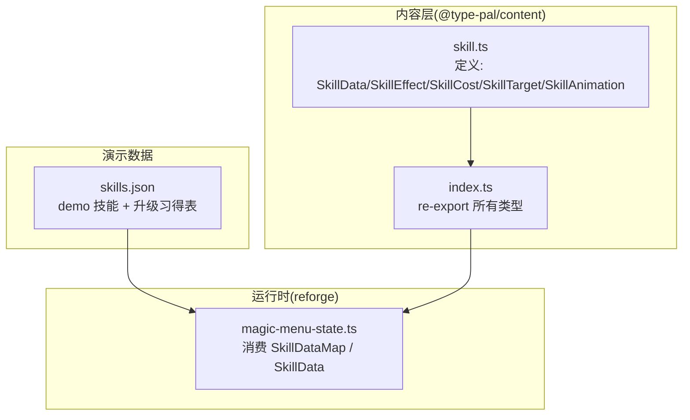
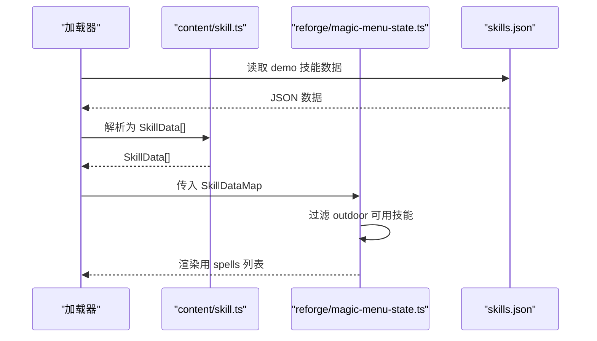

# SkillData基础定义层

<cite>
**本文引用的文件**   
- [packages/content/src/skill.ts](file://packages/content/src/skill.ts)
- [docs/phase2/foundation/skill-data-plan.md](file://docs/phase2/foundation/skill-data-plan.md)
- [projects/demo/content/skills.json](file://projects/demo/content/skills.json)
- [packages/content/src/index.ts](file://packages/content/src/index.ts)
- [packages/reforge/src/magic-menu-state.ts](file://packages/reforge/src/magic-menu-state.ts)
</cite>

## 目录
1. [引言](#引言)
2. [项目结构](#项目结构)
3. [核心组件](#核心组件)
4. [架构总览](#架构总览)
5. [详细组件分析](#详细组件分析)
6. [依赖关系分析](#依赖关系分析)
7. [性能与扩展性](#性能与扩展性)
8. [故障排查指南](#故障排查指南)
9. [结论](#结论)

## 引言
本文件聚焦于“SkillData基础定义层”，系统化阐述技能定义的完整数据结构、字段语义与约束，重点解释：
- id命名规范与不可变契约
- 名称与描述字段的职责边界
- 消耗系统(SkillCost)的设计原理与可扩展点
- 目标类型(SkillTarget)的玩法维度与渲染解耦
- effects[]效果联合类型的核心设计（伤害计算、状态施加、动画播放等）
- SkillAnimation表现层与游戏逻辑的解耦
- TypeScript接口定义与实际使用示例（以李逍遥仙术为例）
- 在不破坏现有代码的前提下如何扩展新的效果类型

## 项目结构
SkillData基础定义位于内容包 @type-pal/content 中，通过统一入口 re-export，供编辑器与运行时消费。



图表来源
- [packages/content/src/skill.ts:1-75](file://packages/content/src/skill.ts#L1-L75)
- [packages/content/src/index.ts:92-101](file://packages/content/src/index.ts#L92-L101)
- [projects/demo/content/skills.json:1-101](file://projects/demo/content/skills.json#L1-L101)
- [packages/reforge/src/magic-menu-state.ts:1-30](file://packages/reforge/src/magic-menu-state.ts#L1-L30)

章节来源
- [packages/content/src/skill.ts:1-75](file://packages/content/src/skill.ts#L1-L75)
- [packages/content/src/index.ts:92-101](file://packages/content/src/index.ts#L92-L101)
- [projects/demo/content/skills.json:1-101](file://projects/demo/content/skills.json#L1-L101)
- [packages/reforge/src/magic-menu-state.ts:1-30](file://packages/reforge/src/magic-menu-state.ts#L1-L30)

## 核心组件
本节从类型与语义角度梳理 SkillData 基础定义层的关键构件。

- SkillData：技能定义的核心对象，包含标识、元信息、消耗、目标、效果序列与动画表现。
- SkillCost：资源消耗模型，支持 MP、体力、金钱、道具等。
- SkillTarget：作用目标的玩法维度枚举，限定为敌我单/群与自身。
- StatusId：状态标识集合，用于 applyStatus/removeStatus 等效果。
- SkillEffect：判别联合类型，表达“做什么”的效果原子，覆盖伤害、治疗、复活、状态、毒、属性增益、即死、偷取、收集、召唤、变身等。
- SkillAnimation：表现层参数，仅承载渲染所需信息，与 gameplay 解耦。
- SkillDataMap：id → SkillData 的映射，作为运行时注入的数据源。
- LevelUpSkill：角色升级习得规则条目。

章节来源
- [packages/content/src/skill.ts:1-75](file://packages/content/src/skill.ts#L1-L75)
- [docs/phase2/foundation/skill-data-plan.md:12-19](file://docs/phase2/foundation/skill-data-plan.md#L12-L19)

## 架构总览
SkillData 基础定义层遵循“纯数据+类型、零引擎依赖”的原则，并通过判别联合将“做什么”(effects[])与“怎么演”(animation)彻底解耦。

```mermaid
classDiagram
class SkillCost {
+mp? : number
+stamina? : number
+money? : number
+items? : { itemId : string; amount : number }[]
}
class SkillTarget {
<<enum>>
oneEnemy
allEnemies
oneAlly
allAllies
self
}
class StatusId {
<<union>>
confused
paralyzed
sleep
silence
puppet
bravery
protect
haste
dualAttack
}
class SkillEffect {
<<discriminated union by kind>>
damage(power, elemental)
healHp(amount)
healMp(amount)
revive(hpPercent)
applyStatus(status, turns)
removeStatus(statuses)
applyPoison(poisonId)
curePoison(maxLevel?, poisonId?)
buffStat(stat, percent, duration)
instantKill()
steal(rate)
collectTreasure()
summon(godId)
trance(sprite)
}
class SkillAnimation {
+effectSprite : number
}
class SkillData {
+id : string
+name : string
+desc : string
+cost : SkillCost
+usableOutsideBattle : boolean
+target : SkillTarget
+effects : SkillEffect[]
+animation : SkillAnimation
}
class SkillDataMap {
<<Record<string, SkillData>>>
}
class LevelUpSkill {
+level : number
+skillId : string
}
SkillData --> SkillCost : "使用"
SkillData --> SkillTarget : "使用"
SkillData --> SkillEffect : "包含(有序)"
SkillData --> SkillAnimation : "引用"
SkillDataMap --> SkillData : "索引"
```

图表来源
- [packages/content/src/skill.ts:1-75](file://packages/content/src/skill.ts#L1-L75)

## 详细组件分析

### id命名规范与不可变契约
- id 为不透明字符串，在 demo 阶段对应原版 oid 字符串；后续版本可替换为规则编号，但上层不得对 id 做硬编码语义或下标偏移计算。
- 禁止使用数组下标作为身份，统一采用 Record<id, …> 或带 id 字段的对象。

章节来源
- [docs/phase2/foundation/skill-data-plan.md:12-18](file://docs/phase2/foundation/skill-data-plan.md#L12-L18)
- [packages/content/src/skill.ts:55-65](file://packages/content/src/skill.ts#L55-L65)

### 名称与描述字段
- name：人类可读的技能名，用于 UI 展示。
- desc：脚本化描述文本，来源于原版 scriptDesc，第二阶段直接存储文字，避免运行时拼接。

章节来源
- [packages/content/src/skill.ts:55-65](file://packages/content/src/skill.ts#L55-L65)

### 消耗系统(SkillCost)
- mp：MP 消耗，来自原版 magic.costMP。
- stamina：体力消耗，用于合体技等场景。
- money：金钱消耗，如乾坤一掷。
- items：道具消耗列表，每项含 itemId 与数量，用于酒神、巫术等。
- 设计原则：显式数据化原本由脚本硬编的资源扣除逻辑，便于校验与扩展。

章节来源
- [packages/content/src/skill.ts:4-10](file://packages/content/src/skill.ts#L4-L10)

### 目标类型(SkillTarget)
- 取值范围：oneEnemy | allEnemies | oneAlly | allAllies | self
- 设计意图：将“谁受影响”的玩法维度与“如何表现”的渲染维度解耦，后者由 animation 负责。

章节来源
- [packages/content/src/skill.ts:12-13](file://packages/content/src/skill.ts#L12-L13)

### effects[]效果联合类型
effects 是 SkillData 的核心，采用判别联合，每个 variant 对应一条效果 opcode 的语义化重写。

- 伤害类
  - damage：power 为基础伤害，elemental 表示元素(0无/1-5风雷水火土/>5毒)，实际伤害受目标抗性影响。
- 恢复类
  - healHp/healMp：固定量回复 HP/MP。
  - revive：按最大生命百分比复活。
- 状态类
  - applyStatus/removeStatus：基于 StatusId 的状态施加与移除，命中判定由引擎根据目标抗性执行。
- 毒系统
  - applyPoison/curePoison：独立于通用状态的毒/蛊系统，支持等级与种类过滤。
- 属性增益
  - buffStat：对 attack/defense/magic/dexterity 进行百分比提升，duration 可为整场战斗或具体回合数。
- 特殊机制
  - instantKill：即死。
  - steal：概率偷取金钱/道具。
  - collectTreasure：收集敌方宝物。
  - summon：召唤单位。
  - trance：变身，切换战斗精灵，属性提升走 buffStat。

要点
- 顺序重要：effects 有序执行，组合复杂行为。
- 元素归属：damage 的元素属性放在效果内部，不在 SkillData 顶层，保持聚合内聚。

章节来源
- [packages/content/src/skill.ts:27-47](file://packages/content/src/skill.ts#L27-L47)
- [docs/phase2/foundation/skill-data-plan.md:94-114](file://docs/phase2/foundation/skill-data-plan.md#L94-L114)

### SkillAnimation表现层与游戏逻辑解耦
- SkillAnimation 仅承载 effectSprite 等渲染所需参数，不包含任何 gameplay 逻辑。
- 同一套 effects 可搭配不同 animation，实现“同效多演”。

章节来源
- [packages/content/src/skill.ts:49-52](file://packages/content/src/skill.ts#L49-L52)

### TypeScript接口定义与使用示例（李逍遥仙术）
- 数据结构实例：demo 提供三个 outdoor 治疗技能，均满足 usableOutsideBattle=true，target=oneAlly，effects=[{kind:'healHp', amount}]，并附带不同的 effectSprite。
- 升级习得：李逍遥的 levelUpSkills 记录其随等级解锁的技能 id 序列。

章节来源
- [projects/demo/content/skills.json:1-101](file://projects/demo/content/skills.json#L1-L101)
- [docs/phase2/foundation/skill-data-plan.md:134-176](file://docs/phase2/foundation/skill-data-plan.md#L134-L176)
- [docs/phase2/foundation/skill-data-plan.md:247-276](file://docs/phase2/foundation/skill-data-plan.md#L247-L276)

### 扩展机制：新增效果类型
在不破坏现有代码的前提下，新增一种效果类型的标准流程：
1. 在 SkillEffect 联合中添加新 variant，例如 { kind: 'newEffect'; ... }。
2. 更新所有对 SkillEffect 的模式匹配处（如菜单过滤、战斗执行器），确保编译器提示覆盖。
3. 若涉及资源引用，完善校验逻辑（如 validate-refs）。
4. 补充测试用例，验证新效果的序列化/反序列化与运行期行为。
5. 保持向后兼容：旧数据不含新 kind 时，不应崩溃；必要时提供默认处理。

章节来源
- [packages/content/src/skill.ts:27-47](file://packages/content/src/skill.ts#L27-L47)
- [docs/phase2/foundation/skill-data-plan.md:94-114](file://docs/phase2/foundation/skill-data-plan.md#L94-L114)

## 依赖关系分析
- content 层只暴露类型与常量，不依赖 reforge 引擎。
- reforge 通过 SkillDataMap 消费 SkillData，用于构建魔法菜单状态与渲染网格。
- skills.json 提供 demo 数据，被运行时加载后转换为 SkillDataMap。



图表来源
- [packages/content/src/skill.ts:55-68](file://packages/content/src/skill.ts#L55-L68)
- [packages/reforge/src/magic-menu-state.ts:10-30](file://packages/reforge/src/magic-menu-state.ts#L10-L30)
- [projects/demo/content/skills.json:1-101](file://projects/demo/content/skills.json#L1-L101)

章节来源
- [packages/content/src/index.ts:92-101](file://packages/content/src/index.ts#L92-L101)
- [packages/reforge/src/magic-menu-state.ts:1-30](file://packages/reforge/src/magic-menu-state.ts#L1-L30)

## 性能与扩展性
- 数据结构层面：effects 有序数组，适合短链组合；如需大量复合效果，可在运行时缓存中间结果。
- 内存布局：SkillDataMap 以 id 为键，O(1) 查找；避免下标式身份带来的耦合与越界风险。
- 扩展性：判别联合使新增效果类型具备编译期安全；SkillAnimation 与 effects 解耦，允许“同效多演”而不改动逻辑。

[本节为通用指导，无需源码引用]

## 故障排查指南
- 类型错误：新增 SkillEffect variant 后未在所有模式匹配处覆盖，TypeScript 会报错，按提示补齐即可。
- 引用缺失：SkillCost.items[].itemId 指向的道具不存在时，校验器会发出警告，需修正数据或增加兜底。
- 菜单显示异常：确认技能的 usableOutsideBattle 与 target 是否符合预期；检查 animation.effectSprite 是否有效。
- 升级习得不生效：核对 LEVEL_UP_SKILLS 中的 skillId 是否在 SkillDataMap 中存在且可学习。

章节来源
- [packages/content/src/validate-refs.ts:19-36](file://packages/content/src/validate-refs.ts#L19-L36)
- [packages/content/src/validate-refs.ts:137-140](file://packages/content/src/validate-refs.ts#L137-L140)
- [packages/reforge/src/magic-menu-state.ts:10-30](file://packages/reforge/src/magic-menu-state.ts#L10-L30)

## 结论
SkillData 基础定义层通过清晰的类型边界与判别联合，实现了“做什么”和“怎么演”的解耦，并以 id 不透明契约与 Record 映射避免了脆弱的下标式身份。effects[] 覆盖了伤害、治疗、状态、毒、属性增益、即死、偷取、收集、召唤、变身等核心玩法，配合 SkillAnimation 的可插拔表现，既保证了当前内容的完整性，也为未来扩展提供了稳健路径。