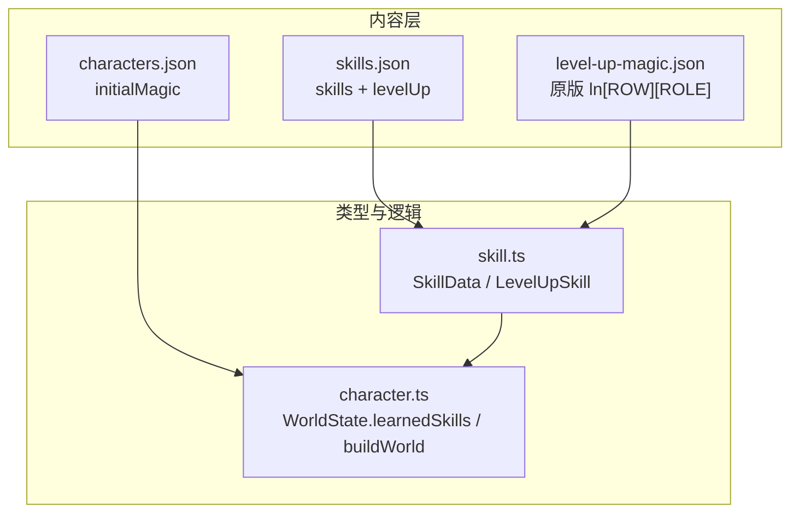
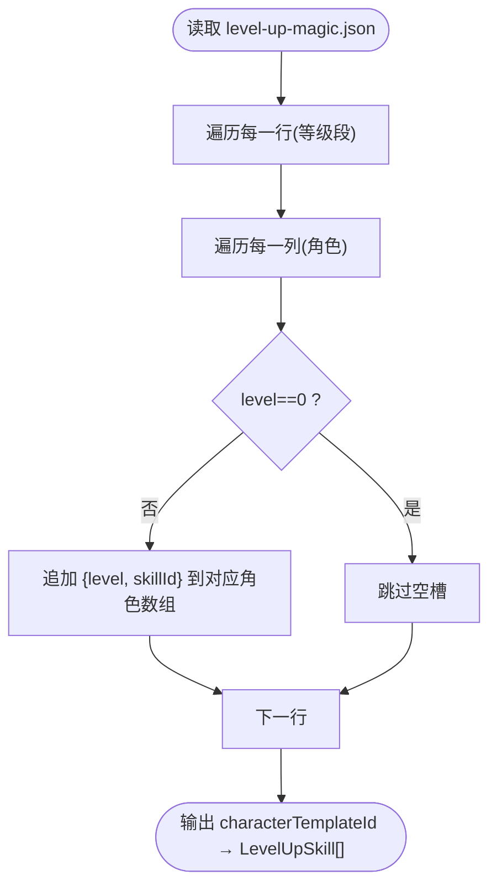
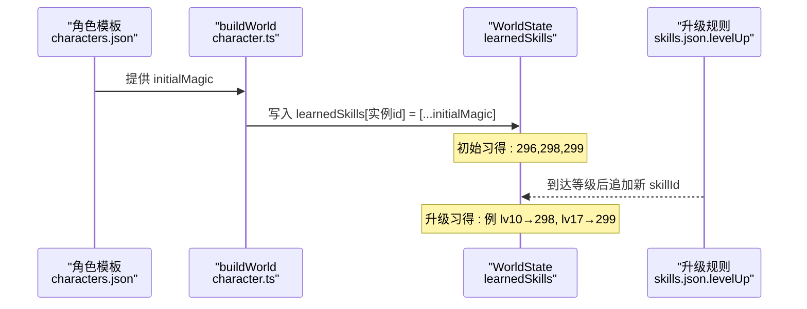
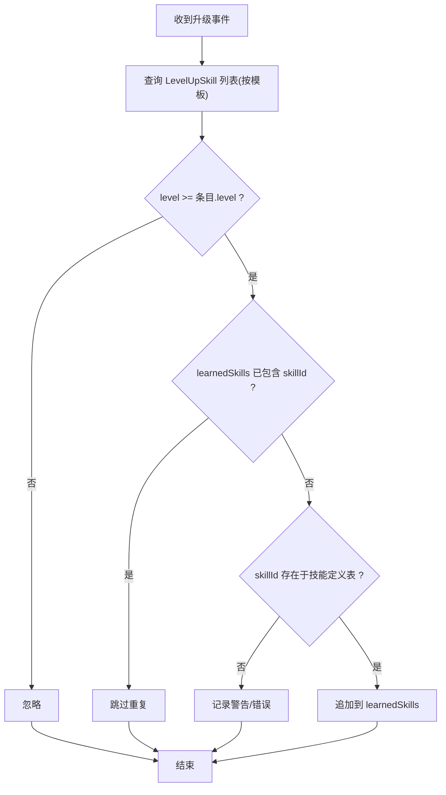
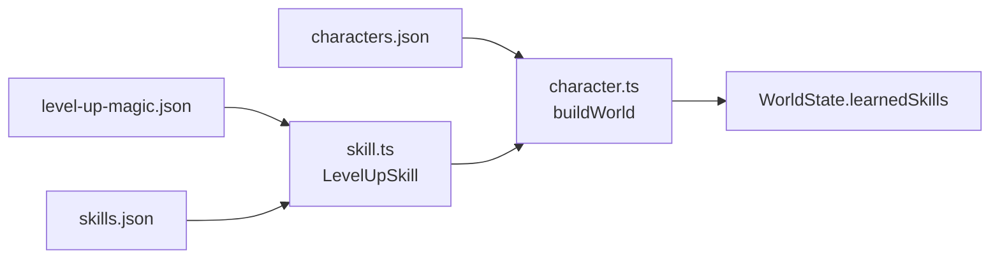

# 技能学习机制

<cite>
**本文引用的文件**   
- [packages/content/src/skill.ts](file://packages/content/src/skill.ts)
- [packages/content/src/character.ts](file://packages/content/src/character.ts)
- [projects/demo/content/skills.json](file://projects/demo/content/skills.json)
- [projects/demo/content/characters.json](file://projects/demo/content/characters.json)
- [data/extracted/data/level-up-magic.json](file://data/extracted/data/level-up-magic.json)
- [docs/phase2/foundation/skill-data-design.md](file://docs/phase2/foundation/skill-data-design.md)
- [docs/phase2/foundation/skill-data-plan.md](file://docs/phase2/foundation/skill-data-plan.md)
</cite>

## 目录
1. [引言](#引言)
2. [项目结构](#项目结构)
3. [核心组件](#核心组件)
4. [架构总览](#架构总览)
5. [详细组件分析](#详细组件分析)
6. [依赖关系分析](#依赖关系分析)
7. [性能与扩展性](#性能与扩展性)
8. [故障排查指南](#故障排查指南)
9. [结论](#结论)
10. [附录](#附录)

## 引言
本文件聚焦“技能学习机制”的完整设计与实现，围绕以下目标展开：
- 解释 learnedSkills 关系表的设计动机与数据结构
- 说明为何采用独立表而非内嵌到 CharacterInstance
- 阐述 MMO 玩家私有数据的预留考虑
- 详解 levelUpSkills 升级习得规则的数据结构与转置过程（从原版 level-up-magic.json 转为 characterTemplateId → LevelUpSkill[]）
- 以李逍遥为例展示角色模板与技能习得的映射与流程
- 明确技能学习时机控制：等级解锁、重复学习处理、可学习性验证
- 给出 Phase3 灵活加点与技能树系统在现有架构上的扩展方案

## 项目结构
技能学习机制涉及三层数据与两个关键运行时结构：
- ① 技能定义层 SkillData（含 effects[] 联合）
- ② 习得关系表 learnedSkills（WorldState 上独立表）
- ③ 升级习得规则 levelUpSkills（content 静态常量）



图表来源
- [projects/demo/content/skills.json:1-101](file://projects/demo/content/skills.json#L1-L101)
- [projects/demo/content/characters.json:1-31](file://projects/demo/content/characters.json#L1-L31)
- [data/extracted/data/level-up-magic.json:1-442](file://data/extracted/data/level-up-magic.json#L1-L442)
- [packages/content/src/skill.ts:1-75](file://packages/content/src/skill.ts#L1-L75)
- [packages/content/src/character.ts:1-115](file://packages/content/src/character.ts#L1-L115)

章节来源
- [docs/phase2/foundation/skill-data-design.md:1-138](file://docs/phase2/foundation/skill-data-design.md#L1-L138)
- [docs/phase2/foundation/skill-data-plan.md:1-423](file://docs/phase2/foundation/skill-data-plan.md#L1-L423)

## 核心组件
本节对三类核心对象进行结构化说明。

- 技能定义 SkillData
  - id/name/desc/cost/target/effects/animation/usuableOutsideBattle
  - effects 为判别联合，覆盖伤害、治疗、复活、状态、毒、即死、偷取、收宝、召唤、变身等
  - 参考路径：[packages/content/src/skill.ts:54-68](file://packages/content/src/skill.ts#L54-L68)

- 习得关系表 learnedSkills
  - WorldState.learnedSkills: Record<string, string[]>，键为实例 id，值为已学技能 id 列表
  - 独立于 CharacterInstance，避免耦合，便于 MMO 玩家私有化
  - 参考路径：[packages/content/src/character.ts:4-11](file://packages/content/src/character.ts#L4-L11)

- 升级习得规则 LevelUpSkill
  - LevelUpSkill = { level, skillId }
  - LEVEL_UP_SKILLS: Record<string, LevelUpSkill[]>，键为角色模板 id，值为按等级升序的习得清单
  - 参考路径：[packages/content/src/skill.ts:70-75](file://packages/content/src/skill.ts#L70-L75)

章节来源
- [packages/content/src/skill.ts:1-75](file://packages/content/src/skill.ts#L1-L75)
- [packages/content/src/character.ts:1-115](file://packages/content/src/character.ts#L1-L115)

## 架构总览
learnedSkills 作为独立关系表，将“谁会什么”与“角色实例”解耦；levelUpSkills 提供“何时学会”的规则；skills.json 提供“技能是什么”。三者共同支撑仙术菜单、战斗引擎与后续 Phase3 的技能系统。

```mermaid
classDiagram
class SkillData {
+string id
+string name
+string desc
+SkillCost cost
+boolean usableOutsideBattle
+SkillTarget target
+SkillEffect[] effects
+SkillAnimation animation
}
class LevelUpSkill {
+number level
+string skillId
}
class WorldState {
+CharacterInstance[] party
+number money
+Record~string,string[]~ learnedSkills
+{ itemId : string; count : number }[] inventory
}
class CharacterInstance {
+string id
+string template
+number level
+number exp
+number hp
+number maxHP
+number mp
+number maxMP
+number attack
+number defense
+number magicAttack
+number speed
+number luck
+Record~string,string~ equipment
+string[] tags
}
WorldState --> CharacterInstance : "包含"
WorldState --> SkillData : "通过 learnedSkills 引用"
WorldState --> LevelUpSkill : "通过 levelUpSkills 驱动"
```

图表来源
- [packages/content/src/skill.ts:54-75](file://packages/content/src/skill.ts#L54-L75)
- [packages/content/src/character.ts:4-53](file://packages/content/src/character.ts#L4-L53)

## 详细组件分析

### 1. learnedSkills 关系表设计
- 位置与形态
  - WorldState.learnedSkills: Record<string, string[]>，键为实例 id，值为已学技能 id 数组
  - 参考路径：[packages/content/src/character.ts:7-11](file://packages/content/src/character.ts#L7-L11)
- 为什么不在 CharacterInstance 中内嵌
  - 解耦：角色实例只保留自身属性，技能归属由世界态统一管理
  - 持久化友好：存档直接序列化 WorldState，无需在实例间复制/同步
  - MMO 留口：玩家私有数据天然落在服务端世界态，便于多账号/多角色隔离
  - 可扩展：未来熟练度/重数等只需把 string[] 升级为带元信息结构，不影响实例 schema
- 初始播种
  - 从角色模板 initialMagic 生成，buildWorld 时拷贝到 learnedSkills
  - 参考路径：[packages/content/src/character.ts:92-114](file://packages/content/src/character.ts#L92-L114)

章节来源
- [packages/content/src/character.ts:4-11](file://packages/content/src/character.ts#L4-L11)
- [packages/content/src/character.ts:92-114](file://packages/content/src/character.ts#L92-L114)
- [docs/phase2/foundation/skill-data-design.md:94-114](file://docs/phase2/foundation/skill-data-design.md#L94-L114)

### 2. levelUpSkills 升级习得规则与转置
- 原版数据结构
  - level-up-magic.json 为 ln[ROW][ROLE]，行表示等级段，列表示角色
  - 某角色的习得 = 取该角色那一【列】，遍历所有行，过滤空槽(level=0)
  - 参考路径：[data/extracted/data/level-up-magic.json:1-442](file://data/extracted/data/level-up-magic.json#L1-L442)
- 转置结果
  - 转为 characterTemplateId → LevelUpSkill[]，每个条目 { level, skillId }
  - 示例（李逍遥）：level 7→349、8→311、10→298、12→346、17→299、20→310、22→348、26→392、34→363
  - 参考路径：[docs/phase2/foundation/skill-data-plan.md:247-276](file://docs/phase2/foundation/skill-data-plan.md#L247-L276)
- 工程落地
  - skills.json.levelUp.li-xiaoyao 存放上述转置后的数组
  - 参考路径：[projects/demo/content/skills.json:61-100](file://projects/demo/content/skills.json#L61-L100)



图表来源
- [data/extracted/data/level-up-magic.json:1-442](file://data/extracted/data/level-up-magic.json#L1-L442)
- [projects/demo/content/skills.json:61-100](file://projects/demo/content/skills.json#L61-L100)

章节来源
- [docs/phase2/foundation/skill-data-plan.md:247-276](file://docs/phase2/foundation/skill-data-plan.md#L247-L276)
- [projects/demo/content/skills.json:61-100](file://projects/demo/content/skills.json#L61-L100)

### 3. 角色模板与习得映射（以李逍遥为例）
- 模板初始习得
  - characters.json 中 li-xiaoyao.initialMagic = ["296","298","299"]
  - 参考路径：[projects/demo/content/characters.json:25-29](file://projects/demo/content/characters.json#L25-L29)
- 构建世界态
  - buildWorld 将 initialMagic 拷贝到 learnedSkills['li-xiaoyao']
  - 参考路径：[packages/content/src/character.ts:92-114](file://packages/content/src/character.ts#L92-L114)
- 升级习得
  - 当角色等级达到 levelUpSkills 中的 level，将对应 skillId 加入 learnedSkills（若尚未存在）
  - 参考路径：[projects/demo/content/skills.json:61-100](file://projects/demo/content/skills.json#L61-L100)



图表来源
- [projects/demo/content/characters.json:25-29](file://projects/demo/content/characters.json#L25-L29)
- [packages/content/src/character.ts:92-114](file://packages/content/src/character.ts#L92-L114)
- [projects/demo/content/skills.json:61-100](file://projects/demo/content/skills.json#L61-L100)

章节来源
- [projects/demo/content/characters.json:1-31](file://projects/demo/content/characters.json#L1-L31)
- [packages/content/src/character.ts:92-114](file://packages/content/src/character.ts#L92-L114)
- [projects/demo/content/skills.json:61-100](file://projects/demo/content/skills.json#L61-L100)

### 4. 技能学习时机控制
- 等级解锁条件判断
  - 比较角色当前 level 与 LevelUpSkill[].level，满足则进入“可学习集合”
- 重复学习处理
  - 检查 learnedSkills 是否已包含该 skillId，若已有则跳过
- 可学习性验证逻辑
  - 校验 skillId 是否存在于技能定义表（skills.json.skills）
  - 校验目标角色模板是否在 levelUpSkills 中存在对应条目
  - 校验等级是否严格递增（可选，防止配置错误）



章节来源
- [docs/phase2/foundation/skill-data-design.md:104-114](file://docs/phase2/foundation/skill-data-design.md#L104-L114)
- [projects/demo/content/skills.json:61-100](file://projects/demo/content/skills.json#L61-L100)

### 5. Phase3 灵活加点与技能树扩展方案
- 在不改动现有 schema 的前提下，通过“附加选择层”实现灵活加点
  - 新增字段（建议）：
    - PlayerChoice: { templateId, available: LevelUpSkill[], spent: LevelUpSkill[] }
    - 或直接在 WorldState 增加 playerSkillChoices: Record<templateId, Choice[]>
  - 升级流程变更：
    - 原自动追加 → 改为“开放候选池”，由玩家在技能树界面分配
    - 最终生效仍写入 learnedSkills，保持向后兼容
- 技能树 UI 与分类
  - 利用 SkillData 预留扩展位（category/series），用于门派/体系划分
  - 结合 LevelUpSkill 的原始约束，形成“基础可学范围 + 玩家自由点选”的组合
- 数据迁移策略
  - 旧存档：沿用自动习得结果填充 learnedSkills
  - 新存档：基于 LevelUpSkill 生成候选池，等待玩家选择

章节来源
- [docs/phase2/foundation/skill-data-design.md:104-114](file://docs/phase2/foundation/skill-data-design.md#L104-L114)
- [docs/phase2/foundation/skill-data-design.md:60-71](file://docs/phase2/foundation/skill-data-design.md#L60-L71)

## 依赖关系分析
- 内容依赖
  - skills.json 提供 SkillData 与 levelUp 规则
  - characters.json 提供 initialMagic（初始习得）
  - level-up-magic.json 提供原始升级表（用于转置）
- 类型与逻辑依赖
  - skill.ts 定义 SkillData、LevelUpSkill 等类型
  - character.ts 定义 WorldState.learnedSkills 并提供 buildWorld 组装逻辑



图表来源
- [data/extracted/data/level-up-magic.json:1-442](file://data/extracted/data/level-up-magic.json#L1-L442)
- [projects/demo/content/skills.json:1-101](file://projects/demo/content/skills.json#L1-L101)
- [projects/demo/content/characters.json:1-31](file://projects/demo/content/characters.json#L1-L31)
- [packages/content/src/skill.ts:1-75](file://packages/content/src/skill.ts#L1-L75)
- [packages/content/src/character.ts:1-115](file://packages/content/src/character.ts#L1-L115)

章节来源
- [docs/phase2/foundation/skill-data-design.md:1-138](file://docs/phase2/foundation/skill-data-design.md#L1-L138)

## 性能与扩展性
- 时间复杂度
  - 升级习得：O(N)，N 为该模板的 LevelUpSkill 数量
  - 去重检查：O(M)，M 为 learnedSkills 长度（可用 Set 优化至 O(1)）
- 空间复杂度
  - learnedSkills 随已学技能线性增长
- 扩展性
  - 熟练度/重数：将 string[] 升级为带元信息的结构，平滑演进
  - 灵活加点：在 LevelUpSkill 之上叠加玩家选择层，不破坏既有 schema

## 故障排查指南
- 常见问题
  - 升级未触发：确认 LevelUpSkill 中 level 与角色当前等级匹配
  - 重复学习：检查 learnedSkills 是否已包含该 skillId
  - 未知技能：校验 skillId 是否存在于 skills.json.skills
  - 空槽干扰：确保转置时过滤 level=0 的空槽
- 定位方法
  - 打印 buildWorld 生成的 learnedSkills 初始值
  - 对比 level-up-magic.json 的列与转置结果
  - 使用断言校验 LevelUpSkill 的 level 单调递增

章节来源
- [docs/phase2/foundation/skill-data-plan.md:247-276](file://docs/phase2/foundation/skill-data-plan.md#L247-L276)
- [projects/demo/content/skills.json:61-100](file://projects/demo/content/skills.json#L61-L100)

## 结论
通过将“技能定义、习得关系、升级规则”分层并解耦，本项目实现了清晰、可扩展且面向 MMO 预留的技能学习机制。learnedSkills 独立表避免了与角色实例的强耦合，levelUpSkills 提供了稳定可控的升级路径，而 Phase3 的灵活加点与技能树可在不推翻现有 schema 的基础上平滑扩展。

## 附录
- 术语
  - 实例 id：角色运行期唯一标识（demo 中与模板 id 一致）
  - 模板 id：角色定义的唯一标识
  - 空槽：level=0 的占位项，应被过滤
- 参考路径汇总
  - 类型定义：[packages/content/src/skill.ts:1-75](file://packages/content/src/skill.ts#L1-L75)
  - 世界态与构建：[packages/content/src/character.ts:1-115](file://packages/content/src/character.ts#L1-L115)
  - 演示数据：[projects/demo/content/skills.json:1-101](file://projects/demo/content/skills.json#L1-L101)、[projects/demo/content/characters.json:1-31](file://projects/demo/content/characters.json#L1-L31)
  - 原版数据：[data/extracted/data/level-up-magic.json:1-442](file://data/extracted/data/level-up-magic.json#L1-L442)
  - 设计文档：[docs/phase2/foundation/skill-data-design.md:1-138](file://docs/phase2/foundation/skill-data-design.md#L1-L138)、[docs/phase2/foundation/skill-data-plan.md:1-423](file://docs/phase2/foundation/skill-data-plan.md#L1-L423)