# 技能实现案例

<cite>
**本文引用的文件**   
- [packages/content/src/skill.ts](file://packages/content/src/skill.ts)
- [docs/phase2/foundation/skill-data-plan.md](file://docs/phase2/foundation/skill-data-plan.md)
- [projects/demo/content/skills.json](file://projects/demo/content/skills.json)
- [packages/game/src/core/battle/actions/magic.ts](file://packages/game/src/core/battle/actions/magic.ts)
- [packages/game/src/core/battle/battle-opcodes.ts](file://packages/game/src/core/battle/battle-opcodes.ts)
- [packages/game/src/core/battle/__tests__/battle-opcodes.test.ts](file://packages/game/src/core/battle/__tests__/battle-opcodes.test.ts)
- [packages/game/src/core/battle/magic-damage.ts](file://packages/game/src/core/battle/magic-damage.ts)
- [packages/game/src/core/battle/anim-timeline.js](file://packages/game/src/core/battle/anim-timeline.js)
- [packages/game/src/core/battle/battle-state.ts](file://packages/game/src/core/battle/battle-state.ts)
</cite>

## 目录
1. [引言](#引言)
2. [项目结构](#项目结构)
3. [核心组件](#核心组件)
4. [架构总览](#架构总览)
5. [详细组件分析](#详细组件分析)
6. [依赖分析](#依赖分析)
7. [性能考虑](#性能考虑)
8. [故障排查指南](#故障排查指南)
9. [结论](#结论)
10. [附录](#附录)

## 引言
本文件以“技能实现案例”为主线，围绕 SkillData 架构在 TypeScript 中的落地，结合原版 sdlpal C++ 的行为与 opcode 语义，逐一解析以下典型技能的实现路径与边界处理：
- 气疗术：基础治疗（healHp）
- 飞龙探云手：纯偷取机制（baseDamage=-999 哨兵值不触发伤害分支）
- 灵葫咒：多效果组合（即死 + 收集宝物两步）
- 回梦：状态施加
- 冰心诀：状态解除
- 火神：召唤系统
- 仙风云体术：自身增益（buffStat）
- 醉仙望月步：连击效果（dualAttack）
- 梦蛇：复杂变身 + 多重增益组合（trance + buffStat）

文档将对照原版 opcode 或字段，展示从 C++ 到 TypeScript 的转换过程，并说明关键边界情况（如即死优先级、偷取率计算、变身持续时间管理等）。

## 项目结构
本仓库采用分阶段、分层设计。第一阶段以 sdlpal 为真值锚，第二阶段引入内容数据与编辑器。技能相关的关键位置如下：
- 内容层：SkillData/SkillEffect 类型定义与 DEMO_SKILLS 常量
- 运行时：performMagic 执行流程、battle-opcodes 调度、动画时间线
- 测试与基准：opcode 行为单测、魔法伤害公式覆盖

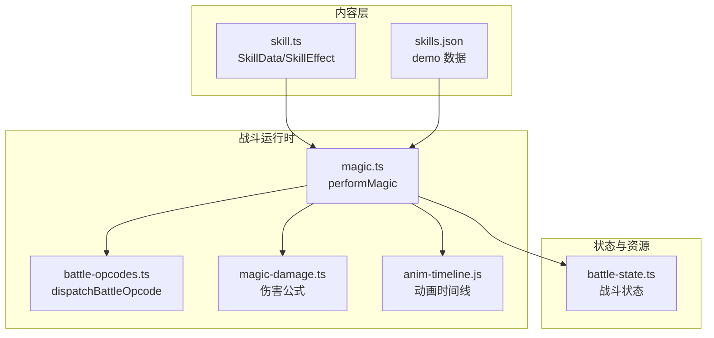

图表来源
- [packages/content/src/skill.ts:1-75](file://packages/content/src/skill.ts#L1-L75)
- [projects/demo/content/skills.json:1-101](file://projects/demo/content/skills.json#L1-L101)
- [packages/game/src/core/battle/actions/magic.ts:123-435](file://packages/game/src/core/battle/actions/magic.ts#L123-L435)
- [packages/game/src/core/battle/battle-opcodes.ts:362-382](file://packages/game/src/core/battle/battle-opcodes.ts#L362-L382)
- [packages/game/src/core/battle/magic-damage.ts](file://packages/game/src/core/battle/magic-damage.ts)
- [packages/game/src/core/battle/anim-timeline.js](file://packages/game/src/core/battle/anim-timeline.js)
- [packages/game/src/core/battle/battle-state.ts:762-801](file://packages/game/src/core/battle/battle-state.ts#L762-L801)

章节来源
- [packages/content/src/skill.ts:1-75](file://packages/content/src/skill.ts#L1-L75)
- [docs/phase2/foundation/skill-data-plan.md:12-176](file://docs/phase2/foundation/skill-data-plan.md#L12-L176)
- [projects/demo/content/skills.json:1-101](file://projects/demo/content/skills.json#L1-L101)

## 核心组件
- SkillData/SkillEffect：描述技能“做什么”，以判别联合表达每种效果；目标、消耗、动画等解耦。
- performMagic：法术执行主入口，负责 MP 扣除、scriptOnUse/scriptOnSuccess 运行、inline 伤害结算、动画链构建与音效同步。
- dispatchBattleOpcode：脚本内 opcode 分发器，实现 0x1B/0x1C/0x22/0x2D/0x2F/0x30/0x33/0x60/0x6A 等关键效果。
- magic-damage：玩家/敌方 inline 伤害公式与抗性、自动防御判定。
- anim-timeline：Pre/Off/Post/Def/Summon/Trance 等动画序列构建与帧级事件挂载。

章节来源
- [packages/content/src/skill.ts:1-75](file://packages/content/src/skill.ts#L1-L75)
- [packages/game/src/core/battle/actions/magic.ts:123-435](file://packages/game/src/core/battle/actions/magic.ts#L123-L435)
- [packages/game/src/core/battle/battle-opcodes.ts:362-382](file://packages/game/src/core/battle/battle-opcodes.ts#L362-L382)
- [packages/game/src/core/battle/magic-damage.ts](file://packages/game/src/core/battle/magic-damage.ts)
- [packages/game/src/core/battle/anim-timeline.js](file://packages/game/src/core/battle/anim-timeline.js)

## 架构总览
下图展示了“选择法术 → 执行脚本 → 结算伤害/效果 → 播放动画/音效”的主流程，以及各模块职责。

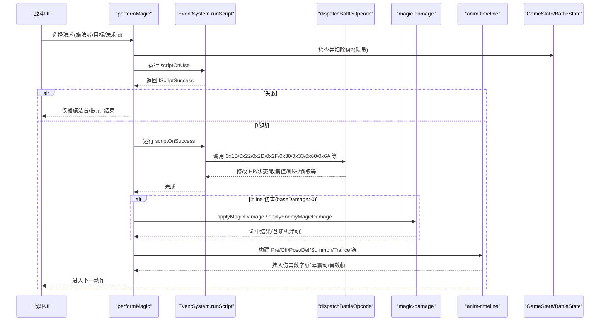

图表来源
- [packages/game/src/core/battle/actions/magic.ts:123-435](file://packages/game/src/core/battle/actions/magic.ts#L123-L435)
- [packages/game/src/core/battle/battle-opcodes.ts:362-382](file://packages/game/src/core/battle/battle-opcodes.ts#L362-L382)
- [packages/game/src/core/battle/magic-damage.ts](file://packages/game/src/core/battle/magic-damage.ts)
- [packages/game/src/core/battle/anim-timeline.js](file://packages/game/src/core/battle/anim-timeline.js)

## 详细组件分析

### 气疗术（基础治疗效果）
- 数据模型：effects=[{kind:'healHp', amount}]，target='oneAlly'，usableOutsideBattle=true
- 原版对应：scriptOnSuccess=0x1B 回 HP；演示数据中 healHp.amount 取自原版显示值
- 运行时路径：performMagic → runScript(scriptOnUse=0) → runScript(scriptOnSuccess) → 0x1B 通过 battle-opcodes 写入 HP
- 动画与音效：若存在 DefMagic 资源则走 DefMagic 链，否则即时路径；治疗数字延迟至链末或即时 emit

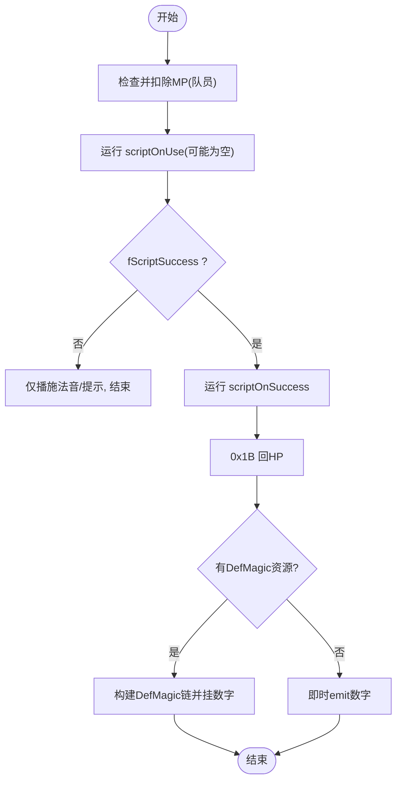

图表来源
- [packages/content/src/skill.ts:28-47](file://packages/content/src/skill.ts#L28-L47)
- [packages/game/src/core/battle/actions/magic.ts:176-278](file://packages/game/src/core/battle/actions/magic.ts#L176-L278)
- [packages/game/src/core/battle/battle-opcodes.ts:362-382](file://packages/game/src/core/battle/battle-opcodes.ts#L362-L382)

章节来源
- [docs/phase2/foundation/skill-data-plan.md:134-176](file://docs/phase2/foundation/skill-data-plan.md#L134-L176)
- [packages/game/src/core/battle/actions/magic.ts:176-278](file://packages/game/src/core/battle/actions/magic.ts#L176-L278)

### 飞龙探云手（纯偷取机制，baseDamage=-999 哨兵值）
- 数据模型：effects=[{kind:'steal', rate}]
- 原版对应：0x6A 偷取；baseDamage 为负数时不触发 inline 伤害分支
- 运行时路径：performMagic → scriptOnUse/scriptOnSuccess 可包含 0x6A → dispatchBattleOpcode 执行偷取逻辑
- 边界与优先级：
  - baseDamage<=0 时跳过 inline 伤害，避免误伤
  - 偷取率由脚本/opcode 控制，不在 SkillEffect 中硬算

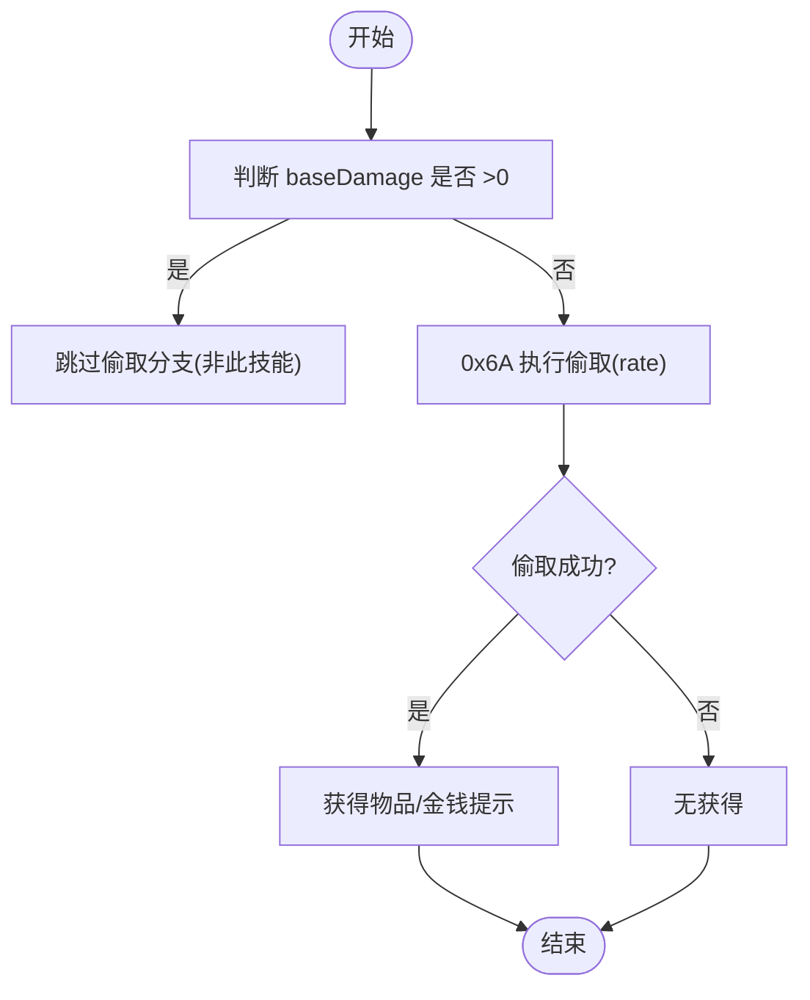

图表来源
- [packages/game/src/core/battle/actions/magic.ts:305-333](file://packages/game/src/core/battle/actions/magic.ts#L305-L333)
- [packages/game/src/core/battle/battle-opcodes.ts:362-382](file://packages/game/src/core/battle/battle-opcodes.ts#L362-L382)
- [packages/game/src/core/battle/__tests__/battle-opcodes.test.ts:1518-1533](file://packages/game/src/core/battle/__tests__/battle-opcodes.test.ts#L1518-L1533)

章节来源
- [packages/game/src/core/battle/actions/magic.ts:305-333](file://packages/game/src/core/battle/actions/magic.ts#L305-L333)
- [packages/game/src/core/battle/battle-opcodes.ts:362-382](file://packages/game/src/core/battle/battle-opcodes.ts#L362-L382)
- [packages/game/src/core/battle/__tests__/battle-opcodes.test.ts:1518-1533](file://packages/game/src/core/battle/__tests__/battle-opcodes.test.ts#L1518-L1533)

### 灵葫咒（多效果组合：收宝+即死两步）
- 数据模型：effects=[{kind:'instantKill'}, {kind:'collectTreasure'}]
- 原版对应：0x60 即死；0x33 收集宝物
- 运行时路径：scriptOnSuccess 顺序执行 0x60 → 0x33；即死优先于收集
- 边界与优先级：
  - 即死成功后再尝试收集，若目标已死亡/无效则按脚本跳转处理
  - collectValue 为 0 时 0x33 会跳走

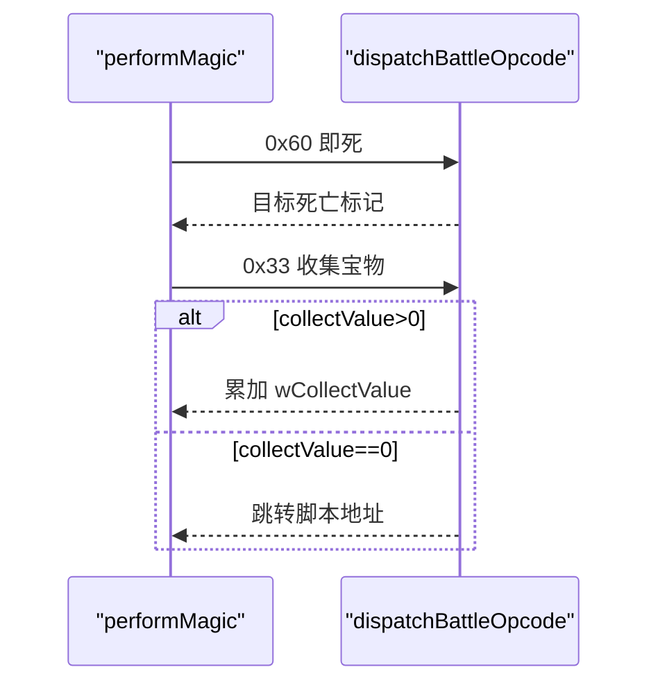

图表来源
- [packages/game/src/core/battle/battle-opcodes.ts:362-382](file://packages/game/src/core/battle/battle-opcodes.ts#L362-L382)
- [packages/game/src/core/battle/__tests__/battle-opcodes.test.ts:695-706](file://packages/game/src/core/battle/__tests__/battle-opcodes.test.ts#L695-L706)

章节来源
- [packages/game/src/core/battle/battle-opcodes.ts:362-382](file://packages/game/src/core/battle/battle-opcodes.ts#L362-L382)
- [packages/game/src/core/battle/__tests__/battle-opcodes.test.ts:695-706](file://packages/game/src/core/battle/__tests__/battle-opcodes.test.ts#L695-L706)

### 回梦（状态施加）
- 数据模型：effects=[{kind:'applyStatus', status, turns}]
- 原版对应：0x2D 设置状态（如睡眠、沉默、傀儡等）
- 运行时路径：scriptOnSuccess 调用 0x2D；对活体生效，对已死/不可用目标失败并置 fScriptSuccess=false
- 边界：
  - 目标存活判定
  - 状态回合数上限与覆盖规则

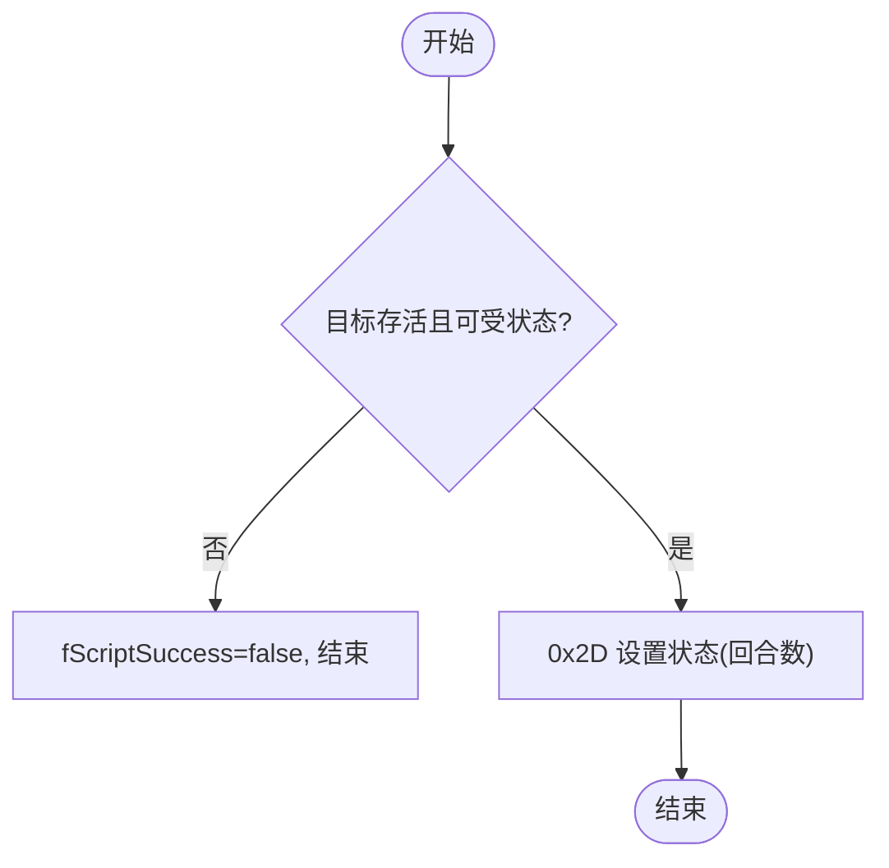

图表来源
- [packages/game/src/core/battle/battle-opcodes.ts:362-382](file://packages/game/src/core/battle/battle-opcodes.ts#L362-L382)
- [packages/game/src/core/battle/__tests__/battle-opcodes.test.ts:590-604](file://packages/game/src/core/battle/__tests__/battle-opcodes.test.ts#L590-L604)

章节来源
- [packages/game/src/core/battle/battle-opcodes.ts:362-382](file://packages/game/src/core/battle/battle-opcodes.ts#L362-L382)
- [packages/game/src/core/battle/__tests__/battle-opcodes.test.ts:590-604](file://packages/game/src/core/battle/__tests__/battle-opcodes.test.ts#L590-L604)

### 冰心诀（状态解除）
- 数据模型：effects=[{kind:'removeStatus', statuses}]
- 原版对应：0x2F 移除指定状态
- 运行时路径：scriptOnSuccess 调用 0x2F；对不存在状态直接忽略

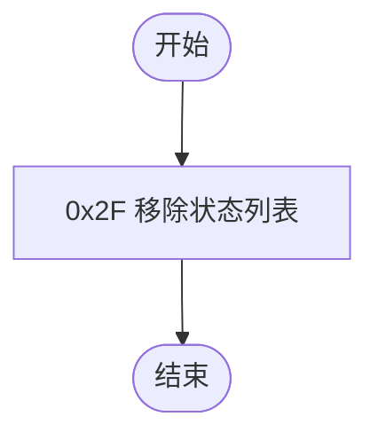

图表来源
- [packages/game/src/core/battle/battle-opcodes.ts:362-382](file://packages/game/src/core/battle/battle-opcodes.ts#L362-L382)

章节来源
- [packages/game/src/core/battle/battle-opcodes.ts:362-382](file://packages/game/src/core/battle/battle-opcodes.ts#L362-L382)

### 火神的召唤系统
- 数据模型：effects=[{kind:'summon', godId}]，二次效果由 magic.effect 指向另一 Magic
- 原版对应：kMagicTypeSummon；PreMagic→全员变亮→召唤神序列→二次 OffMagic→PostMagic→淡出
- 运行时路径：performMagic 识别 summon 类型，构建召唤动画链；二次效果独立查找并播放
- 边界：
  - 缺精灵帧数资源时回退即时路径
  - 二次效果 type 需为攻击类才建 OffMagic 链

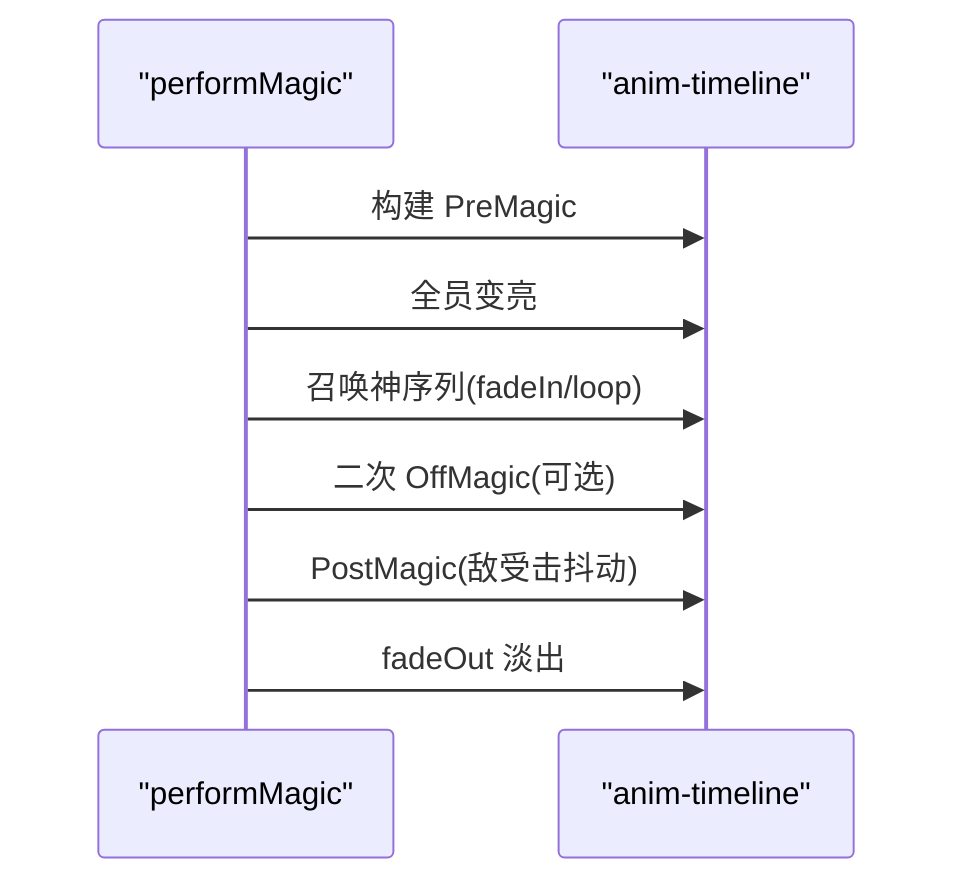

图表来源
- [packages/game/src/core/battle/actions/magic.ts:585-678](file://packages/game/src/core/battle/actions/magic.ts#L585-L678)
- [packages/game/src/core/battle/anim-timeline.js](file://packages/game/src/core/battle/anim-timeline.js)

章节来源
- [packages/game/src/core/battle/actions/magic.ts:585-678](file://packages/game/src/core/battle/actions/magic.ts#L585-L678)

### 仙风云体术（自身增益）
- 数据模型：effects=[{kind:'buffStat', stat, percent, duration}]
- 原版对应：0x30 临时属性%增益；duration='battle' 表示整场战斗
- 运行时路径：scriptOnSuccess 调用 0x30；若无 gs 注入则降级 no-op 但不崩溃

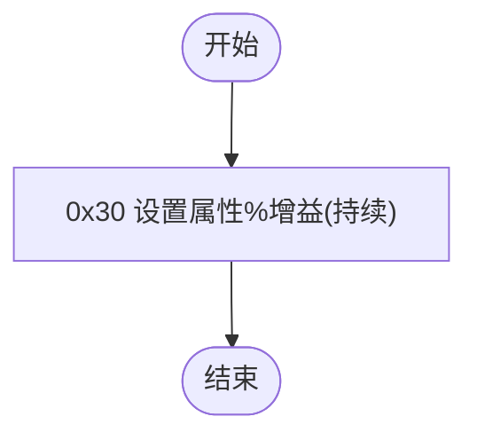

图表来源
- [packages/game/src/core/battle/battle-opcodes.ts:362-382](file://packages/game/src/core/battle/battle-opcodes.ts#L362-L382)
- [packages/game/src/core/battle/__tests__/battle-opcodes.test.ts:1496-1503](file://packages/game/src/core/battle/__tests__/battle-opcodes.test.ts#L1496-L1503)

章节来源
- [packages/game/src/core/battle/battle-opcodes.ts:362-382](file://packages/game/src/core/battle/battle-opcodes.ts#L362-L382)
- [packages/game/src/core/battle/__tests__/battle-opcodes.test.ts:1496-1503](file://packages/game/src/core/battle/__tests__/battle-opcodes.test.ts#L1496-L1503)

### 醉仙望月步（连击效果）
- 数据模型：effects=[{kind:'applyStatus', status:'dualAttack', turns}]
- 原版对应：0x2D 设置 dualAttack 状态；后续行动队列根据该状态生成额外攻击
- 边界：
  - 连击状态与其他行动状态共存时的优先级与互斥
  - 回合结束时清除 defend 等单轮状态

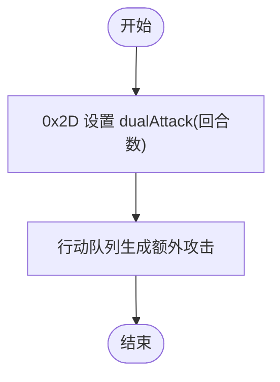

图表来源
- [packages/content/src/skill.ts:15-26](file://packages/content/src/skill.ts#L15-L26)
- [packages/game/src/core/battle/battle-opcodes.ts:362-382](file://packages/game/src/core/battle/battle-opcodes.ts#L362-L382)

章节来源
- [packages/content/src/skill.ts:15-26](file://packages/content/src/skill.ts#L15-L26)
- [packages/game/src/core/battle/battle-opcodes.ts:362-382](file://packages/game/src/core/battle/battle-opcodes.ts#L362-L382)

### 梦蛇（复杂变身 + 多重增益组合）
- 数据模型：effects=[{kind:'trance', sprite}, {kind:'buffStat', ...}]
- 原版对应：kMagicTypeTrance；变身段 iColorShift 渐变 + crossfade 切换精灵；属性提升另走 buffStat
- 运行时路径：performMagic 识别 trance 类型，构建闪色与 crossfade 变身链；属性增益在脚本中通过 0x30 设置
- 边界：
  - 变身前后精灵号切换时机
  - 变身期间其他状态叠加与失效规则

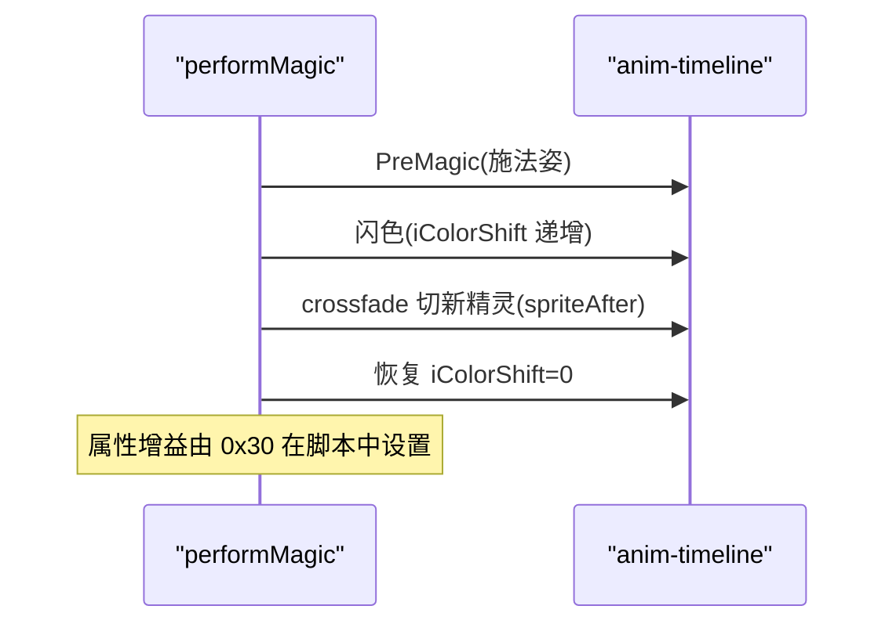

图表来源
- [packages/game/src/core/battle/actions/magic.ts:685-733](file://packages/game/src/core/battle/actions/magic.ts#L685-L733)
- [packages/game/src/core/battle/anim-timeline.js](file://packages/game/src/core/battle/anim-timeline.js)

章节来源
- [packages/game/src/core/battle/actions/magic.ts:685-733](file://packages/game/src/core/battle/actions/magic.ts#L685-L733)

## 依赖分析
- 内容层到运行时：SkillData/SkillEffect 被上层消费用于菜单与演示；实际战斗执行仍基于 spells.json/magic.json 与 scriptOnUse/Success 脚本链
- 运行时内部耦合：
  - performMagic 强依赖 battle-opcodes 与 anim-timeline
  - 伤害公式与抗性与 autoDefend 预掷在 performMagic 中协调
  - 战斗状态（敌人占位槽、回合清理等）由 battle-state 维护

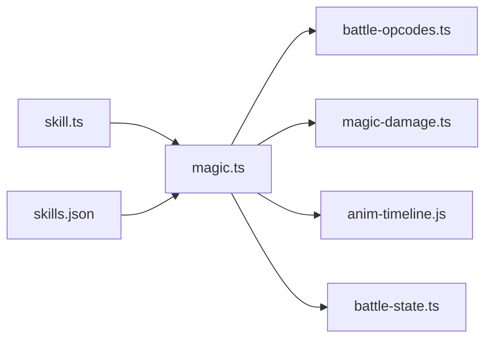

图表来源
- [packages/content/src/skill.ts:1-75](file://packages/content/src/skill.ts#L1-L75)
- [projects/demo/content/skills.json:1-101](file://projects/demo/content/skills.json#L1-L101)
- [packages/game/src/core/battle/actions/magic.ts:123-435](file://packages/game/src/core/battle/actions/magic.ts#L123-L435)
- [packages/game/src/core/battle/battle-opcodes.ts:362-382](file://packages/game/src/core/battle/battle-opcodes.ts#L362-L382)
- [packages/game/src/core/battle/magic-damage.ts](file://packages/game/src/core/battle/magic-damage.ts)
- [packages/game/src/core/battle/anim-timeline.js](file://packages/game/src/core/battle/anim-timeline.js)
- [packages/game/src/core/battle/battle-state.ts:762-801](file://packages/game/src/core/battle/battle-state.ts#L762-L801)

章节来源
- [packages/game/src/core/battle/battle-state.ts:762-801](file://packages/game/src/core/battle/battle-state.ts#L762-L801)

## 性能考虑
- 群体法术 RNG 分布：原 C 在每个目标上独立摇一次 RandomFloat(10,11)，TS 在循环内逐目标摇，保证目标间独立性
- 动画链构建：仅在具备精灵帧数与底锚时构建，否则回退即时路径，避免空转
- 音效同步：将施法音与效果音挂入时间线首帧，减少声画不同步

[本节为通用指导，无需源码引用]

## 故障排查指南
- 脚本失败路径：当 scriptOnUse 失败（钱/道具不足），performMagic 仅播施法音并返回，不播放效果动画与伤害
- 未找到对象：spell/magic/object-magics 解析失败时打印警告并早退
- 数值显示时机：伤害数字统一延迟到特效播完或链末 emit，避免先抖后出数字
- 敌方魔法伤害：补齐 enemy→player inline 伤害分支，确保基伤害>0 时正确结算

章节来源
- [packages/game/src/core/battle/actions/magic.ts:123-152](file://packages/game/src/core/battle/actions/magic.ts#L123-L152)
- [packages/game/src/core/battle/actions/magic.ts:247-258](file://packages/game/src/core/battle/actions/magic.ts#L247-L258)
- [packages/game/src/core/battle/actions/magic.ts:335-365](file://packages/game/src/core/battle/actions/magic.ts#L335-L365)

## 结论
通过将 SkillData/SkillEffect 作为“意图声明”，配合 performMagic 与 battle-opcodes 的“执行编排”，实现了从数据到行为的清晰映射。针对特殊技能（即死、偷取、变身、召唤等），通过 opcode 与动画时间线的协同，既忠实还原了 sdlpal 的行为，又提升了 TS 侧的可维护性与可测试性。后续可在 phase3 中将完整 102 个技能迁移至 content 层，并以单元测试与 baseline 对比保障保真度。

[本节为总结，无需源码引用]

## 附录
- 术语对照
  - skillId：内容层技能 id（demo 使用原版 oid 字符串）
  - spellId/magicNumber：运行时 spells.json/magic.json 关联键
  - opcode：事件/战斗脚本指令（如 0x1B/0x2D/0x30/0x33/0x60/0x6A）
- 参考链接
  - 技能数据设计计划：docs/phase2/foundation/skill-data-plan.md
  - 战斗系统垂直切片：docs/phase1/plans/2026-05-23-m3-battle-vertical-slice.md

[本节为补充信息，无需源码引用]