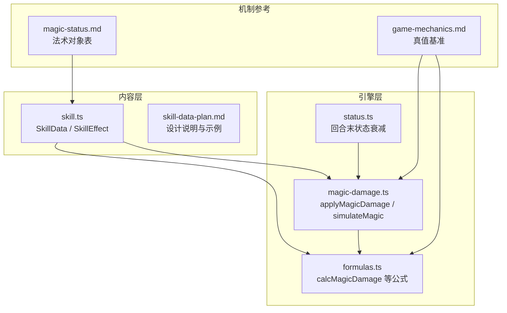
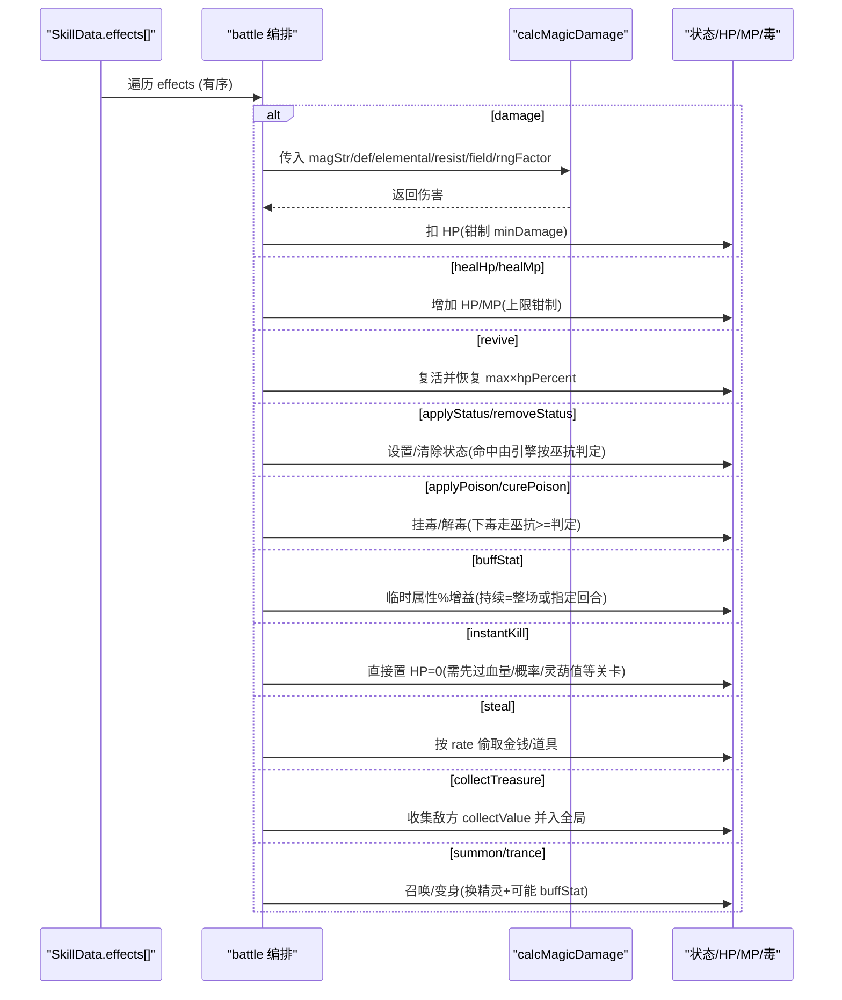
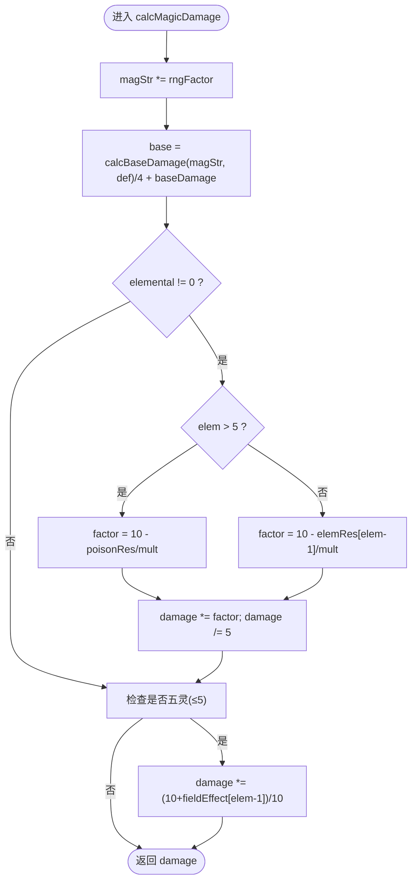
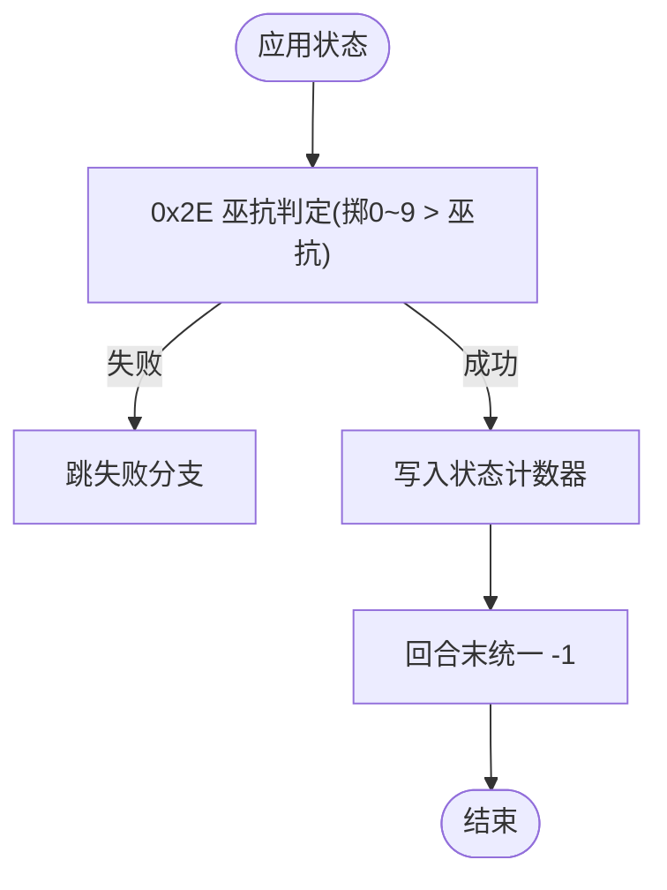
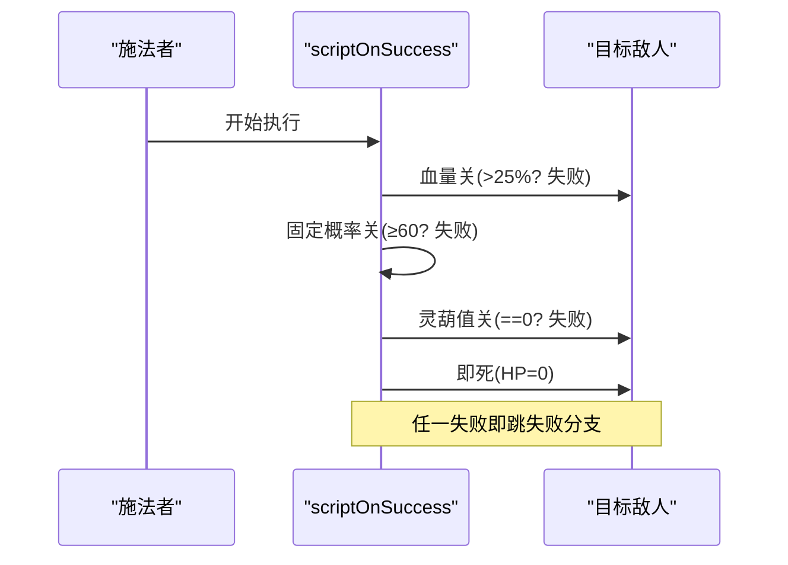
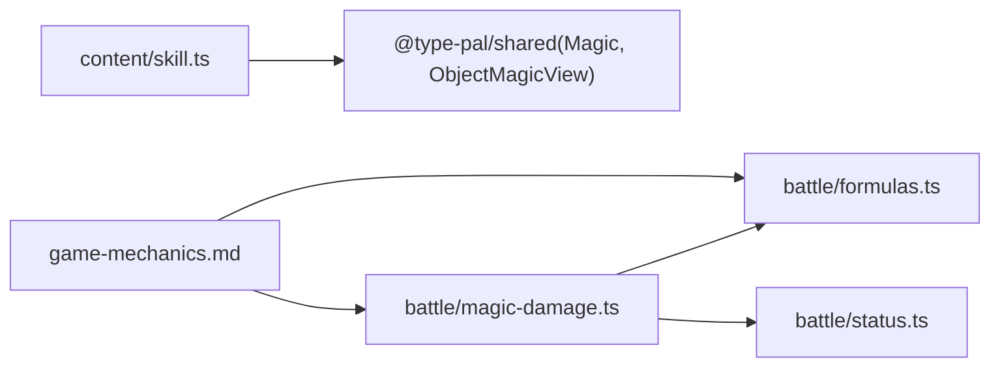

# 技能效果系统

<cite>
**本文引用的文件**   
- [packages/content/src/skill.ts](file://packages/content/src/skill.ts)
- [docs/phase2/foundation/skill-data-plan.md](file://docs/phase2/foundation/skill-data-plan.md)
- [packages/game/src/core/battle/magic-damage.ts](file://packages/game/src/core/battle/magic-damage.ts)
- [packages/game/src/core/battle/formulas.ts](file://packages/game/src/core/battle/formulas.ts)
- [packages/game/src/core/battle/status.ts](file://packages/game/src/core/battle/status.ts)
- [docs/phase1/game-mechanics.md](file://docs/phase1/game-mechanics.md)
- [docs/phase1/status/magic-status.md](file://docs/phase1/status/magic-status.md)
- [docs/phase1/status/item-status.md](file://docs/phase1/status/item-status.md)
- [packages/game/src/core/inspect/battle-inspect.test.ts](file://packages/game/src/core/inspect/battle-inspect.test.ts)
</cite>

## 目录
1. [引言](#引言)
2. [项目结构](#项目结构)
3. [核心组件](#核心组件)
4. [架构总览](#架构总览)
5. [详细组件分析](#详细组件分析)
6. [依赖关系分析](#依赖关系分析)
7. [性能与实现要点](#性能与实现要点)
8. [疑难排查指南](#疑难排查指南)
9. [结论](#结论)
10. [附录](#附录)

## 引言
本文件系统化阐述“技能效果系统”的设计与实现：以 TypeScript 联合类型 SkillEffect[] 作为“原版 scriptOnSuccess opcode 链”的类型安全等价物，将原本散落在脚本中的行为（伤害、治疗、复活、状态、毒、增益、即死、偷取、收集、召唤、变身）统一为可组合、可验证、可执行的效果列表。文档同时解释引擎侧对命中率与抗性的处理逻辑（不在技能数据中硬编码），并以“灵葫咒”为例展示多效果组合的执行顺序与判定门。

## 项目结构
- 内容层（纯数据 + 类型）：SkillData / SkillEffect 定义位于 content 包，不依赖运行时。
- 引擎层（战斗公式与编排）：法术伤害、抗性、战场加成、自动防御等由 game 包 battle 子系统实现。
- 机制参考：game-mechanics.md 提供 sdlpal 真值对照；magic-status.md 给出 102 个法术对象的行为摘要。

图表来源
- [packages/content/src/skill.ts:1-75](file://packages/content/src/skill.ts#L1-L75)
- [docs/phase2/foundation/skill-data-plan.md:34-176](file://docs/phase2/foundation/skill-data-plan.md#L34-L176)
- [packages/game/src/core/battle/formulas.ts:1-217](file://packages/game/src/core/battle/formulas.ts#L1-L217)
- [packages/game/src/core/battle/magic-damage.ts:1-358](file://packages/game/src/core/battle/magic-damage.ts#L1-L358)
- [packages/game/src/core/battle/status.ts:1-47](file://packages/game/src/core/battle/status.ts#L1-L47)
- [docs/phase1/game-mechanics.md:1-800](file://docs/phase1/game-mechanics.md#L1-L800)
- [docs/phase1/status/magic-status.md:1-230](file://docs/phase1/status/magic-status.md#L1-L230)

章节来源
- [packages/content/src/skill.ts:1-75](file://packages/content/src/skill.ts#L1-L75)
- [docs/phase2/foundation/skill-data-plan.md:34-176](file://docs/phase2/foundation/skill-data-plan.md#L34-L176)

## 核心组件
- SkillEffect 联合类型：每个 variant 对应一条“效果 opcode”，effects[] 有序，表达“做什么”。
- SkillData：自包含的技能定义，含 cost/target/effects/animation 等元信息。
- 引擎接口：applyMagicDamage / calcMagicDamage 负责伤害计算与元素/毒抗/战场修正；status tick 负责回合末状态递减。

章节来源
- [packages/content/src/skill.ts:27-65](file://packages/content/src/skill.ts#L27-L65)
- [packages/game/src/core/battle/magic-damage.ts:74-124](file://packages/game/src/core/battle/magic-damage.ts#L74-L124)
- [packages/game/src/core/battle/formulas.ts:112-158](file://packages/game/src/core/battle/formulas.ts#L112-L158)
- [packages/game/src/core/battle/status.ts:20-35](file://packages/game/src/core/battle/status.ts#L20-L35)

## 架构总览
从“技能数据”到“引擎执行”的关键路径：
- 数据层：SkillData.effects 描述意图（如 damage/healHp/revive/applyStatus 等）。
- 编排层：根据 target 与 effects 顺序，调用相应引擎函数（伤害、回血、复活、状态、毒、buff、即死、偷取、收集、召唤、变身）。
- 公式层：calcMagicDamage 统一处理灵力 vs 防御、固定威力、元素/毒抗缩放、战场加成。
- 状态层：回合末统一递减所有状态计数器。

图表来源
- [packages/content/src/skill.ts:27-65](file://packages/content/src/skill.ts#L27-L65)
- [packages/game/src/core/battle/magic-damage.ts:74-124](file://packages/game/src/core/battle/magic-damage.ts#L74-L124)
- [packages/game/src/core/battle/formulas.ts:112-158](file://packages/game/src/core/battle/formulas.ts#L112-L158)
- [packages/game/src/core/battle/status.ts:20-35](file://packages/game/src/core/battle/status.ts#L20-L35)

## 详细组件分析

### 伤害（damage）与元素/毒抗
- 设计哲学：elemental 字段属于 damage 效果本身，而非顶层；引擎在 calcMagicDamage 中按 elemental 分支选择五灵或毒抗，并按战场加成修正。
- 关键流程：magStr 随机浮动 → base/4 + magic.baseDamage → 元素/毒抗缩放 → 战场加成 → 结果钳制。
- 玩家→敌人：resistMult=1，使用敌人 wElemResistance/wPoisonResistance。
- 敌人→玩家：resistMult=20，使用 100+玩家抗性（上限 100），再经除数因子（主动防御/护体/法术自动防御）。

图表来源
- [packages/game/src/core/battle/formulas.ts:112-158](file://packages/game/src/core/battle/formulas.ts#L112-L158)
- [packages/game/src/core/battle/magic-damage.ts:195-270](file://packages/game/src/core/battle/magic-damage.ts#L195-L270)

章节来源
- [packages/game/src/core/battle/formulas.ts:112-158](file://packages/game/src/core/battle/formulas.ts#L112-L158)
- [packages/game/src/core/battle/magic-damage.ts:74-124](file://packages/game/src/core/battle/magic-damage.ts#L74-L124)
- [docs/phase1/game-mechanics.md:393-447](file://docs/phase1/game-mechanics.md#L393-L447)

### 治疗（healHp/healMp）
- 语义：直接增加目标 HP/MP，受上限钳制。
- 适用场景：单体/全体治疗、大世界菜单可用技能。
- 与元素无关，不走伤害公式。

章节来源
- [packages/content/src/skill.ts:28-32](file://packages/content/src/skill.ts#L28-L32)
- [docs/phase1/status/magic-status.md:104-108](file://docs/phase1/status/magic-status.md#L104-L108)

### 复活（revive）
- 语义：使目标复活并恢复 maxHP × hpPercent。
- 典型用法：还魂类仙术。

章节来源
- [packages/content/src/skill.ts:32](file://packages/content/src/skill.ts#L32)
- [docs/phase1/status/magic-status.md:109-110](file://docs/phase1/status/magic-status.md#L109-L110)

### 状态管理（applyStatus/removeStatus）
- 施加：通过 opcode 0x2E 判定命中（见“命中率与抗性”小节），成功后写入状态计数器。
- 移除：removeStatus 支持批量解除。
- 回合末：tickStatusEffects 对所有存活单位的状态计数器统一 -1。

图表来源
- [packages/game/src/core/battle/status.ts:20-35](file://packages/game/src/core/battle/status.ts#L20-L35)
- [docs/phase1/game-mechanics.md:707-733](file://docs/phase1/game-mechanics.md#L707-L733)

章节来源
- [packages/content/src/skill.ts:33-34](file://packages/content/src/skill.ts#L33-L34)
- [packages/game/src/core/battle/status.ts:20-35](file://packages/game/src/core/battle/status.ts#L20-L35)
- [docs/phase1/game-mechanics.md:707-733](file://docs/phase1/game-mechanics.md#L707-L733)

### 毒系统（applyPoison/curePoison）
- 下毒：opcode 0x28，采用 `RandomLong(0,9) >= 巫抗` 的判定（与上状态的 bug 版本不同，无 90% 上限问题）。
- 解毒：curePoison 支持按等级或指定毒 id 清理。
- 每回合：毒的“每回合效果”通过“毒对象”的 playerScript 驱动（正负皆可，例如寿葫芦的正面回血回蓝）。

章节来源
- [packages/content/src/skill.ts:35-36](file://packages/content/src/skill.ts#L35-L36)
- [docs/phase1/game-mechanics.md:791-796](file://docs/phase1/game-mechanics.md#L791-L796)
- [docs/phase1/plans/2026-05-31-d-batch6-numeric-equip.md:34-46](file://docs/phase1/plans/2026-05-31-d-batch6-numeric-equip.md#L34-L46)

### 属性增益（buffStat）
- 语义：对 attack/defense/magic/dexterity 进行百分比提升，持续时间可为整场或指定回合。
- 典型用途：梦蛇变身时配合 trance 切换精灵，并用 buffStat 提升属性。

章节来源
- [packages/content/src/skill.ts:37-42](file://packages/content/src/skill.ts#L37-L42)
- [docs/phase1/status/item-status.md:283-283](file://docs/phase1/status/item-status.md#L283-L283)

### 即死（instantKill）
- 语义：直接令目标 HP=0。
- 前置条件：通常由技能脚本的多道关卡控制（如血量关、概率关、灵葫值关等），即死本身无条件。

章节来源
- [packages/content/src/skill.ts:43](file://packages/content/src/skill.ts#L43)
- [docs/phase1/game-mechanics.md:580-623](file://docs/phase1/game-mechanics.md#L580-L623)

### 偷取（steal）
- 语义：按 rate 偷取敌人的金钱/道具。
- 成功率：由技能脚本的固定概率关与敌方法术抗性共同决定（飞龙探云手等）。

章节来源
- [packages/content/src/skill.ts:44](file://packages/content/src/skill.ts#L44)
- [docs/phase1/game-mechanics.md:580-623](file://docs/phase1/game-mechanics.md#L580-L623)

### 收集宝物（collectTreasure）
- 语义：收集敌方的 collectValue 并入全局（紫金葫芦炼丹的基础）。
- 判定：若 collectValue=0 则跳过（无法收集）。

章节来源
- [packages/content/src/skill.ts:45](file://packages/content/src/skill.ts#L45)
- [packages/game/src/core/inspect/battle-inspect.test.ts:91-95](file://packages/game/src/core/inspect/battle-inspect.test.ts#L91-L95)

### 召唤（summon）
- 语义：type=summon 的法术，召唤神兽并对全体造成群体伤害。
- 伤害：走标准法术伤害公式（含元素/毒抗/战场加成）。

章节来源
- [packages/content/src/skill.ts:46](file://packages/content/src/skill.ts#L46)
- [docs/phase1/status/magic-status.md:123-128](file://docs/phase1/status/magic-status.md#L123-L128)

### 变身（trance）
- 语义：type=trance 替换战斗精灵（如梦蛇），属性提升另走 buffStat。
- 演出：PreMagic 前摇 + 闪色末帧切 sprite。

章节来源
- [packages/content/src/skill.ts:47](file://packages/content/src/skill.ts#L47)
- [docs/phase1/status/item-status.md:283-283](file://docs/phase1/status/item-status.md#L283-L283)

### 多效果组合示例：灵葫咒（收宝 + 即死两步）
- 脚本顺序（玩家施放打敌人）：血量关(≤满血25%) → 固定概率关(<60) → 灵葫值关(≠0) → 即死(0x60)。
- 注意：即死在灵葫值关之后，因此“残血但无灵葫值”的敌人会被 0x33 提前拦截，不会走到 0x60。

图表来源
- [docs/phase1/game-mechanics.md:580-623](file://docs/phase1/game-mechanics.md#L580-L623)

章节来源
- [docs/phase1/game-mechanics.md:580-623](file://docs/phase1/game-mechanics.md#L580-L623)

## 依赖关系分析
- 内容层 types 仅依赖共享类型（如 Magic/ObjectMagicView），不依赖运行时。
- 引擎层 formulas.ts 提供纯函数，被 magic-damage.ts 复用。
- status.ts 在回合推进时被调用，独立于伤害计算。

图表来源
- [packages/content/src/skill.ts:1-75](file://packages/content/src/skill.ts#L1-L75)
- [packages/game/src/core/battle/magic-damage.ts:1-358](file://packages/game/src/core/battle/magic-damage.ts#L1-L358)
- [packages/game/src/core/battle/formulas.ts:1-217](file://packages/game/src/core/battle/formulas.ts#L1-L217)
- [packages/game/src/core/battle/status.ts:1-47](file://packages/game/src/core/battle/status.ts#L1-L47)
- [docs/phase1/game-mechanics.md:1-800](file://docs/phase1/game-mechanics.md#L1-L800)

章节来源
- [packages/content/src/skill.ts:1-75](file://packages/content/src/skill.ts#L1-L75)
- [packages/game/src/core/battle/magic-damage.ts:1-358](file://packages/game/src/core/battle/magic-damage.ts#L1-L358)
- [packages/game/src/core/battle/formulas.ts:1-217](file://packages/game/src/core/battle/formulas.ts#L1-L217)
- [packages/game/src/core/battle/status.ts:1-47](file://packages/game/src/core/battle/status.ts#L1-L47)
- [docs/phase1/game-mechanics.md:1-800](file://docs/phase1/game-mechanics.md#L1-L800)

## 性能与实现要点
- 伤害计算为纯函数，易于并行与测试；每个目标独立掷 RNG，避免跨目标共享随机性。
- 状态 tick 为 O(n) 遍历，开销极低。
- 元素/毒抗与战场加法的乘除顺序严格对齐 sdlpal，保证数值一致性。

## 疑难排查指南
- 命中率为何不是 100%？
  - 上状态走 0x2E：采用 `掷(0~9) > 巫抗` 判定（本项目已采用修复版 `>=`，巫抗 0 也 100% 命中）。
  - 下毒走 0x28：采用 `掷(0~9) >= 巫抗`，无 90% 上限问题。
- 为何某些技能“看起来很强却打不动”？
  - 高元素抗/毒抗会大幅缩放元素部分；注意玩家→敌人倍率 mult=1，敌人→玩家 mult=20。
- 为何“残血也收不掉”？
  - 灵葫咒在秒杀前先校验 collectValue≠0，否则提前失败。

章节来源
- [docs/phase1/game-mechanics.md:707-733](file://docs/phase1/game-mechanics.md#L707-L733)
- [docs/phase1/game-mechanics.md:791-796](file://docs/phase1/game-mechanics.md#L791-L796)
- [docs/phase1/game-mechanics.md:580-623](file://docs/phase1/game-mechanics.md#L580-L623)

## 结论
通过将原版 scriptOnSuccess 的 opcode 链抽象为类型安全的 SkillEffect[]，我们获得了：
- 明确的数据契约与可扩展性（新增效果只需扩展联合类型）。
- 引擎侧统一的伤害/抗性/战场修正与状态管理。
- 可验证的组合式效果执行顺序（以灵葫咒为代表）。
- 命中率与抗性由引擎集中处理，避免在技能数据中散落硬编码。

## 附录
- 技能数据示例与测试用例参见 skill-data-plan.md 中的 DEMO_SKILLS 与断言。
- 102 个法术对象的行为摘要与分类参见 magic-status.md。

章节来源
- [docs/phase2/foundation/skill-data-plan.md:34-176](file://docs/phase2/foundation/skill-data-plan.md#L34-L176)
- [docs/phase1/status/magic-status.md:1-230](file://docs/phase1/status/magic-status.md#L1-L230)