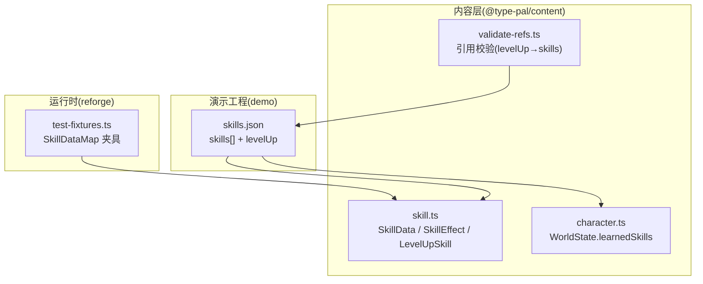
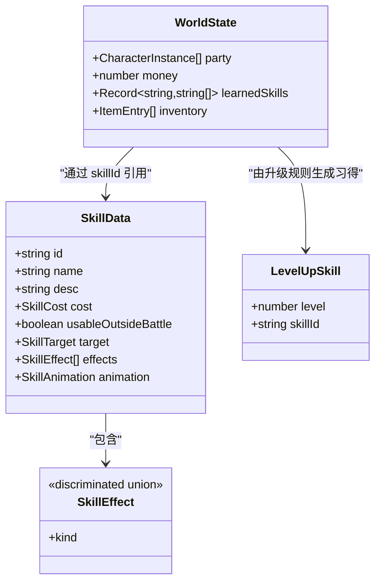
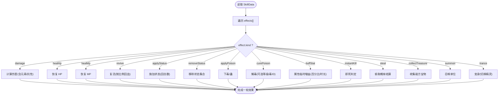
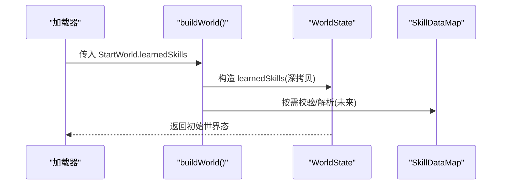
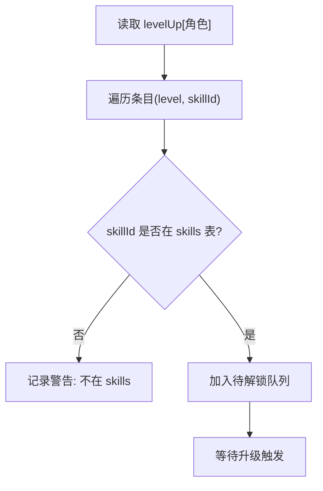
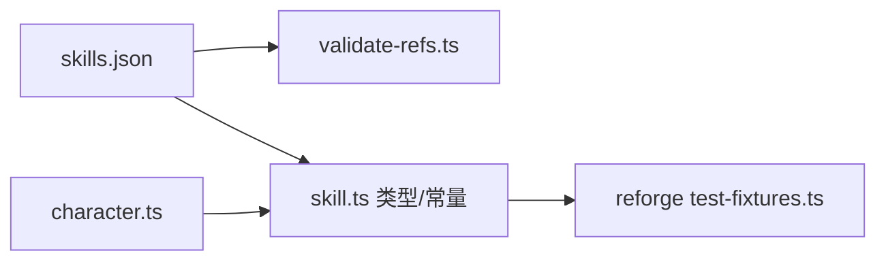

# 技能数据架构

<cite>
**本文引用的文件**   
- [packages/content/src/skill.ts](file://packages/content/src/skill.ts)
- [projects/demo/content/skills.json](file://projects/demo/content/skills.json)
- [packages/content/src/character.ts](file://packages/content/src/character.ts)
- [packages/content/src/validate-refs.ts](file://packages/content/src/validate-refs.ts)
- [docs/phase2/foundation/skill-data-plan.md](file://docs/phase2/foundation/skill-data-plan.md)
- [packages/reforge/src/test-fixtures.ts](file://packages/reforge/src/test-fixtures.ts)
</cite>

## 目录
1. [引言](#引言)
2. [项目结构](#项目结构)
3. [核心组件](#核心组件)
4. [架构总览](#架构总览)
5. [详细组件分析](#详细组件分析)
6. [依赖关系分析](#依赖关系分析)
7. [性能与扩展性](#性能与扩展性)
8. [故障排查指南](#故障排查指南)
9. [结论](#结论)
10. [附录](#附录)

## 引言
本文件系统化阐述“技能数据架构”的三层模型：SkillData 基础定义层、effects[] 效果联合层、learnedSkills 关系表、levelUpSkills 等级解锁表。文档同时覆盖效果联合类型系统（伤害计算、状态施加、动画播放等）、学习机制（固定学习列表、等级解锁条件、可学习性判断）、升级系统（等级依赖、效果增强逻辑、解锁时机控制），并给出编辑器使用建议、平衡性测试工具与调试方法，帮助策划与程序高效协作。

## 项目结构
围绕技能数据的实现集中在内容包 @type-pal/content 与演示工程 demo 中：
- 类型与常量定义：packages/content/src/skill.ts
- 世界态与习得关系：packages/content/src/character.ts
- 参考校验器：packages/content/src/validate-refs.ts
- 演示数据：projects/demo/content/skills.json
- 设计计划与约束：docs/phase2/foundation/skill-data-plan.md
- 运行时测试夹具：packages/reforge/src/test-fixtures.ts

图表来源
- [packages/content/src/skill.ts:1-75](file://packages/content/src/skill.ts#L1-L75)
- [packages/content/src/character.ts:1-115](file://packages/content/src/character.ts#L1-L115)
- [packages/content/src/validate-refs.ts:145-154](file://packages/content/src/validate-refs.ts#L145-L154)
- [projects/demo/content/skills.json:1-101](file://projects/demo/content/skills.json#L1-L101)
- [packages/reforge/src/test-fixtures.ts:89-145](file://packages/reforge/src/test-fixtures.ts#L89-L145)

章节来源
- [packages/content/src/skill.ts:1-75](file://packages/content/src/skill.ts#L1-L75)
- [packages/content/src/character.ts:1-115](file://packages/content/src/character.ts#L1-L115)
- [packages/content/src/validate-refs.ts:145-154](file://packages/content/src/validate-refs.ts#L145-L154)
- [projects/demo/content/skills.json:1-101](file://projects/demo/content/skills.json#L1-L101)
- [docs/phase2/foundation/skill-data-plan.md:12-176](file://docs/phase2/foundation/skill-data-plan.md#L12-L176)

## 核心组件
- SkillData 基础定义层
  - 字段包括 id、name、desc、cost、usableOutsideBattle、target、effects、animation；effects 为有序的效果数组，承载所有玩法行为。
- effects[] 效果联合层
  - 采用判别联合类型，每个 variant 对应一种效果语义，如伤害、治疗、复活、状态施加/移除、毒系统、属性增益、即死、偷窃、收集宝物、召唤、变身等。
- learnedSkills 关系表
  - WorldState 上的独立关系表，键为角色实例 id，值为已习得技能 id 列表；替代内嵌在角色实例中的魔法列表，解耦且便于 MMO 化。
- levelUpSkills 等级表
  - 静态配置，记录角色模板在特定等级自动习得的技能；来源于原版数据，作为升级解锁的真值锚。

章节来源
- [packages/content/src/skill.ts:1-75](file://packages/content/src/skill.ts#L1-L75)
- [packages/content/src/character.ts:1-115](file://packages/content/src/character.ts#L1-L115)
- [docs/phase2/foundation/skill-data-plan.md:12-176](file://docs/phase2/foundation/skill-data-plan.md#L12-L176)

## 架构总览
三层数据模型协同工作：
- 定义层(SkillData)描述“是什么”和“做什么”，effects[] 明确“如何生效”。
- 关系表(learnedSkills)描述“谁学会了什么”，与角色实例解耦。
- 等级表(levelUpSkills)描述“何时学会”，驱动升级解锁流程。

图表来源
- [packages/content/src/skill.ts:1-75](file://packages/content/src/skill.ts#L1-L75)
- [packages/content/src/character.ts:1-115](file://packages/content/src/character.ts#L1-L115)

## 详细组件分析

### 组件一：SkillData 与 effects[] 联合类型
- SkillData 自包含，不依赖引擎或子表下标；id 为不透明字符串，避免硬编码语义。
- effects[] 是核心，顺序执行，每个 variant 对应一条效果语义，便于后续引擎按 kind 分发处理。
- 示例数据在 demo 中以 healHp 为主，验证 outdoor 可用性与目标选择。

图表来源
- [packages/content/src/skill.ts:27-47](file://packages/content/src/skill.ts#L27-L47)
- [projects/demo/content/skills.json:1-60](file://projects/demo/content/skills.json#L1-L60)

章节来源
- [packages/content/src/skill.ts:1-75](file://packages/content/src/skill.ts#L1-L75)
- [projects/demo/content/skills.json:1-60](file://projects/demo/content/skills.json#L1-L60)

### 组件二：learnedSkills 关系表
- 位置：WorldState.learnedSkills，类型为 Record<charInstanceId, skillId[]>。
- 作用：将“谁学会了哪些技能”从角色实例剥离，成为独立关系表，便于存档、网络同步与多角色管理。
- 构建：buildWorld 时从 StartWorld.learnedSkills 拷贝并深拷贝数组，保证运行期修改不回写源数据。

图表来源
- [packages/content/src/character.ts:92-114](file://packages/content/src/character.ts#L92-L114)

章节来源
- [packages/content/src/character.ts:1-115](file://packages/content/src/character.ts#L1-L115)

### 组件三：levelUpSkills 等级解锁表
- 结构：Record<角色模板id, LevelUpSkill[]>，LevelUpSkill = { level, skillId }。
- 真值来源：原版 level-up-magic.json，确保数值与顺序正确。
- 校验：validate-refs 会检查 levelUp 中的 skillId 是否存在于 skills 表中，缺失则告警。

图表来源
- [packages/content/src/validate-refs.ts:145-154](file://packages/content/src/validate-refs.ts#L145-L154)
- [projects/demo/content/skills.json:61-101](file://projects/demo/content/skills.json#L61-L101)

章节来源
- [packages/content/src/validate-refs.ts:145-154](file://packages/content/src/validate-refs.ts#L145-L154)
- [projects/demo/content/skills.json:61-101](file://projects/demo/content/skills.json#L61-L101)

### 组件四：运行时夹具与集成
- reforge 测试夹具提供 SkillDataMap，用于初始化战斗/菜单等子系统，确保内容与运行时一致。
- 夹具中的技能与 content 层的 DEMO_SKILLS 保持一致，便于端到端回归。

章节来源
- [packages/reforge/src/test-fixtures.ts:89-145](file://packages/reforge/src/test-fixtures.ts#L89-L145)

## 依赖关系分析
- 内容层内部：
  - character.ts 依赖 world state 的 learnedSkills 结构。
  - validate-refs.ts 对 skills.json 的 levelUp 进行跨表引用校验。
- 内容层与演示数据：
  - skills.json 提供 skills[] 与 levelUp{}，被类型与校验器消费。
- 内容层与运行时：
  - test-fixtures.ts 以 SkillDataMap 形式注入到运行时夹具，供测试与功能切片使用。

图表来源
- [projects/demo/content/skills.json:1-101](file://projects/demo/content/skills.json#L1-L101)
- [packages/content/src/validate-refs.ts:145-154](file://packages/content/src/validate-refs.ts#L145-L154)
- [packages/content/src/skill.ts:1-75](file://packages/content/src/skill.ts#L1-L75)
- [packages/content/src/character.ts:1-115](file://packages/content/src/character.ts#L1-L115)
- [packages/reforge/src/test-fixtures.ts:89-145](file://packages/reforge/src/test-fixtures.ts#L89-L145)

章节来源
- [packages/content/src/validate-refs.ts:145-154](file://packages/content/src/validate-refs.ts#L145-L154)
- [packages/content/src/skill.ts:1-75](file://packages/content/src/skill.ts#L1-L75)
- [packages/content/src/character.ts:1-115](file://packages/content/src/character.ts#L1-L115)
- [projects/demo/content/skills.json:1-101](file://projects/demo/content/skills.json#L1-L101)
- [packages/reforge/src/test-fixtures.ts:89-145](file://packages/reforge/src/test-fixtures.ts#L89-L145)

## 性能与扩展性
- 数据结构
  - effects[] 有序数组，遍历时按 kind 分派，时间复杂度 O(n)，n 为效果数量；典型技能效果数较小，开销可忽略。
  - learnedSkills 使用 Record 索引，查找 O(1)。
- 内存与序列化
  - learnedSkills 在 buildWorld 时深拷贝，避免共享引用导致污染；适合存档与网络传输。
- 扩展点
  - SkillEffect 联合一次定全，新增效果只需添加新 variant，并在引擎侧增加分支处理。
  - SkillData 预留 category/series 扩展口，便于未来门派/体系分类与技能树 UI。

[本节为通用指导，无需源码引用]

## 故障排查指南
- 常见错误
  - levelUp 中 skillId 不存在于 skills 表：validate-refs 会输出警告，需修正数据。
  - 习得列表与 SkillData 不一致：检查 StartWorld.learnedSkills 与 skills.json 的映射。
  - 运行时无法找到 SkillData：确认 SkillDataMap 是否完整注入到运行时夹具。
- 定位步骤
  - 打开 skills.json，核对 levelUp 中的 skillId 是否在 skills 中存在。
  - 检查 validate-refs 的输出信息，定位具体路径 with where 字段。
  - 在 reforge 夹具中打印 SkillDataMap 键集，确认注入完整性。

章节来源
- [packages/content/src/validate-refs.ts:145-154](file://packages/content/src/validate-refs.ts#L145-L154)
- [packages/reforge/src/test-fixtures.ts:89-145](file://packages/reforge/src/test-fixtures.ts#L89-L145)

## 结论
本架构以三层数据模型为核心：SkillData 定义技能本体与 effects[] 效果语义，learnedSkills 解耦“谁学会了什么”，levelUpSkills 提供“何时学会”的真值锚。配合 validate-refs 的引用校验与运行时夹具的一致性保障，形成从策划数据到运行时的闭环。该设计具备良好扩展性与可维护性，为后续仙术菜单、战斗引擎与平衡性调优奠定坚实基础。

[本节为总结，无需源码引用]

## 附录

### 编辑器使用建议
- 可视化编辑
  - 支持 JSON Schema 校验与高亮提示，实时显示 effects[] 的 kind 选项与必填字段。
  - 提供“预览效果”面板，根据 effects[] 组合展示预期行为摘要（如“单体治疗+75”）。
- 数据验证
  - 内置 validate-refs 规则：检查 levelUp.skillId 是否存在于 skills；检查 cost 字段非负；检查 target 合法。
  - 批量扫描：一键扫描全部角色 levelUp 表，汇总未引用或缺失项。
- 批量操作
  - 批量替换 skillId、批量调整 amount/power 等数值，支持撤销与差异对比。
  - 导出/导入变更清单，便于团队协作与版本回溯。

[本节为概念性说明，无需源码引用]

### 平衡性测试工具与调试方法
- 单元测试
  - 针对 effects[] 各 variant 编写单测，覆盖边界条件（零值、上限、异常输入）。
  - 使用 reforge 夹具构造最小化世界态，断言关键数值与状态变化。
- 基线回归
  - 基于 sdlpal 行为建立 baseline.test，接受 RNG 差异但要求大局结果一致。
- 调试技巧
  - 在 effects[] 分派处插入日志，输出 effect.kind 与关键参数。
  - 使用断点观察 learnedSkills 与 levelUpSkills 的交互，确认解锁时机。

章节来源
- [docs/phase2/foundation/skill-data-plan.md:12-176](file://docs/phase2/foundation/skill-data-plan.md#L12-L176)
- [packages/reforge/src/test-fixtures.ts:89-145](file://packages/reforge/src/test-fixtures.ts#L89-L145)