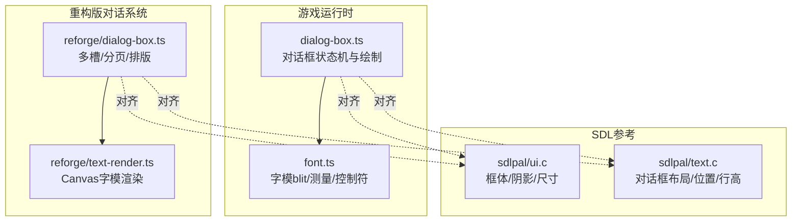
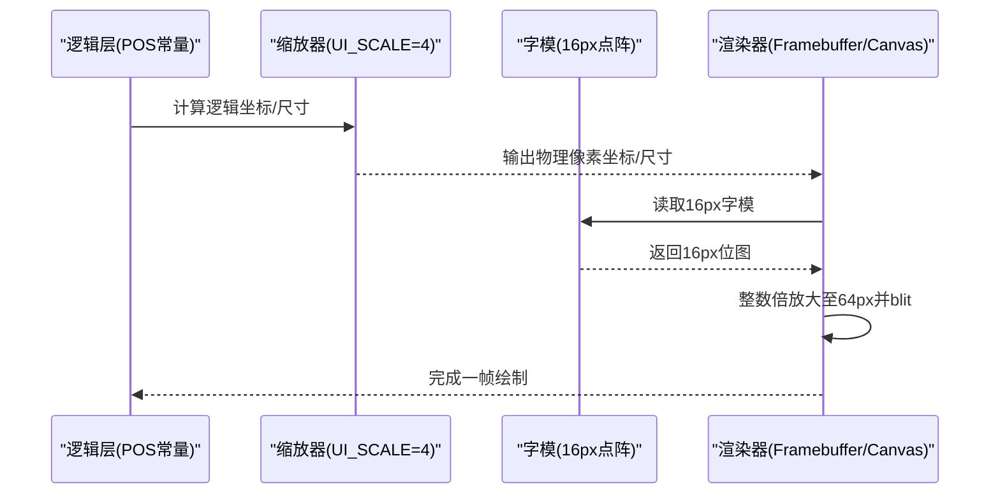
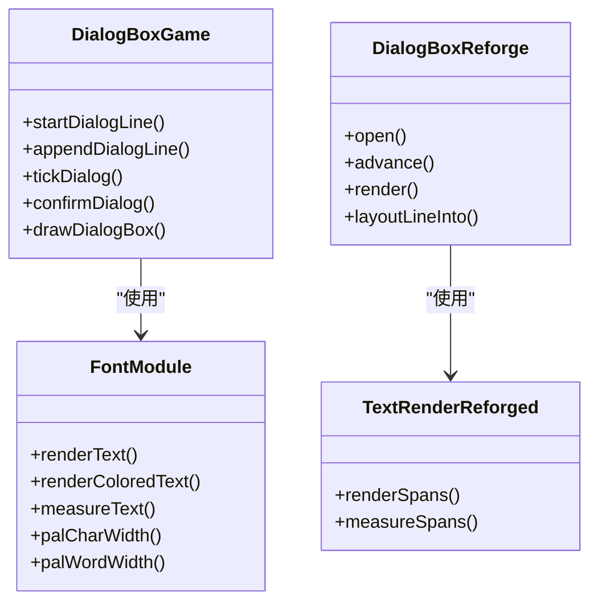

# UI高清化改造

<cite>
**本文引用的文件**
- [dialog-box.ts](file://packages/game/src/present/dialog-box.ts)
- [font.ts](file://packages/game/src/present/font.ts)
- [text-render.ts](file://packages/reforge/src/text/text-render.ts)
- [dialog-box.ts（重构版）](file://packages/reforge/src/dialog/dialog-box.ts)
- [render-foundation-plan.md](file://docs/phase2/foundation/render-foundation-plan.md)
- [ui.c](file://reference/sdlpal/ui.c)
- [text.c](file://reference/sdlpal/text.c)
</cite>

## 目录
1. [引言](#引言)
2. [项目结构](#项目结构)
3. [核心组件](#核心组件)
4. [架构总览](#架构总览)
5. [详细组件分析](#详细组件分析)
6. [依赖关系分析](#依赖关系分析)
7. [性能考量](#性能考量)
8. [故障排查指南](#故障排查指南)
9. [结论](#结论)
10. [附录](#附录)

## 引言
本文件系统化记录本次“UI高清化改造”的设计与实现，聚焦对话框子系统在高分辨率下的坐标、字模与阴影一致性。核心目标包括：
- 建立 UI_SCALE = 4 的机制化缩放策略，所有逻辑 POS 常量保持“逻辑像素”，渲染时统一 ×4 得到物理像素。
- 对齐 sdlpal 真值：行高、文本位置、折行、打字节奏、光标与头像位置等。
- 改造 text-render 的字模 blit 路径，确保 cursorX 累加与 x/y 落点以物理像素为单位。
- 采用“不换源”策略：保留 16px 点阵字模，通过整数倍放大获得 64px 锐利字模。
- 调整阴影偏移，保证在高清晰度下视觉准确。
- 提供浏览器验收要点与未来菜单系统(D17)兼容性考虑。

## 项目结构
本次改造涉及游戏运行时呈现层与重构版对话系统的协同：
- 游戏运行时呈现层：对话框状态机、字体 blit、测量与颜色控制符解析。
- 重构版对话系统：基于 Canvas 的渲染管线，包含排版、打字、光标与头像绘制。
- SDL 参考实现：用于对齐行为与数值。

**图表来源**
- [dialog-box.ts](file://packages/game/src/present/dialog-box.ts)
- [font.ts](file://packages/game/src/present/font.ts)
- [dialog-box.ts（重构版）](file://packages/reforge/src/dialog/dialog-box.ts)
- [text-render.ts](file://packages/reforge/src/text/text-render.ts)
- [ui.c](file://reference/sdlpal/ui.c)
- [text.c](file://reference/sdlpal/text.c)

**章节来源**
- [render-foundation-plan.md:222-223](file://docs/phase2/foundation/render-foundation-plan.md#L222-L223)

## 核心组件
- 对话框状态机与绘制：负责行计数、翻页、打字进度、标题与正文位置、图标提示等。
- 字体渲染与测量：负责逐字符 blit、阴影、宽度测量、控制符解析。
- 重构版对话系统：负责多槽共存、分页、自动推进、光标与头像绘制。
- SDL 参考：提供真值对照（行高、位置、阴影、框体尺寸）。

关键常量与职责：
- LINE_HEIGHT_PX = 18：每行高度（逻辑像素），对齐 sdlpal text.c 行距。
- MAX_LINES_PER_PAGE = 4：每页最大行数。
- FONT_COLOR_*：默认色、切换色（青/红/黄等）。
- UI_SCALE = 4：高清化缩放因子，POS 常量保持逻辑像素，渲染时 ×4。

**章节来源**
- [dialog-box.ts:36-54](file://packages/game/src/present/dialog-box.ts#L36-L54)
- [dialog-box.ts:147-169](file://packages/game/src/present/dialog-box.ts#L147-L169)
- [dialog-box.ts:245-255](file://packages/game/src/present/dialog-box.ts#L245-L255)
- [font.ts:105-131](file://packages/game/src/present/font.ts#L105-L131)
- [font.ts:174-198](file://packages/game/src/present/font.ts#L174-L198)
- [dialog-box.ts（重构版）:17-37](file://packages/reforge/src/dialog/dialog-box.ts#L17-L37)

## 架构总览
高清化改造的核心在于“逻辑像素 + 整数倍放大”的策略：
- 所有 POS 常量（如 top/bottom/narration 的文本起始位置、行高、右边距、光标预留位）均以逻辑像素定义。
- 渲染阶段按 UI_SCALE = 4 将逻辑像素映射到物理像素，从而在不改变源码布局的前提下获得 4× 清晰度的输出。
- 字模仍为 16px 点阵，通过整数倍放大生成 64px 字模，避免插值模糊。
- 阴影偏移在逻辑像素中按 sdlpal 真值设定（+1,0 / 0,+1 / +1,+1），在物理像素中同样按 4× 放大，保持相对比例一致。

**图表来源**
- [render-foundation-plan.md:222-223](file://docs/phase2/foundation/render-foundation-plan.md#L222-L223)
- [font.ts:73-90](file://packages/game/src/present/font.ts#L73-L90)
- [text-render.ts:20-51](file://packages/reforge/src/text/text-render.ts#L20-L51)

## 详细组件分析

### 组件A：对话框常量与布局（dialog-box.ts）
- 行高与分页：LINE_HEIGHT_PX = 18；MAX_LINES_PER_PAGE = 4。
- 文本位置：getDialogTextPos/getDialogTitlePos 返回逻辑像素坐标，后续由渲染层按 UI_SCALE 放大。
- 物品框居中窗口：drawItemBoxLine 使用 len*4 与 boxLen=(len+1)/2 的公式，与 sdlpal text.c 对齐。
- 阴影偏移：SingleLineBox shadowOffset=5（iDialogShadow），与 sdlpal ui.c 一致。

示例代码片段路径（不含具体代码内容）：
- [dialog-box.ts:147-169](file://packages/game/src/present/dialog-box.ts#L147-L169)
- [dialog-box.ts:877-909](file://packages/game/src/present/dialog-box.ts#L877-L909)
- [dialog-box.ts:245-255](file://packages/game/src/present/dialog-box.ts#L245-L255)

**章节来源**
- [dialog-box.ts:147-169](file://packages/game/src/present/dialog-box.ts#L147-L169)
- [dialog-box.ts:877-909](file://packages/game/src/present/dialog-box.ts#L877-L909)
- [dialog-box.ts:245-255](file://packages/game/src/present/dialog-box.ts#L245-L255)
- [ui.c:267-318](file://reference/sdlpal/ui.c#L267-L318)

### 组件B：字体渲染与测量（font.ts）
- renderText：逐字符 blit，支持 fShadow=true 的三层阴影（+1,0 / 0,+1 / +1,+1），cursorX 累加以像素为单位。
- measureText：统计渲染后总宽度，ASCII 与 CJK 分别按 8/16 像素计。
- palCharWidth/palWordWidth：近似 sdlpal 的字符/词宽算法，用于菜单文案布局。

示例代码片段路径（不含具体代码内容）：
- [font.ts:105-131](file://packages/game/src/present/font.ts#L105-L131)
- [font.ts:174-198](file://packages/game/src/present/font.ts#L174-L198)

**章节来源**
- [font.ts:105-131](file://packages/game/src/present/font.ts#L105-L131)
- [font.ts:174-198](file://packages/game/src/present/font.ts#L174-L198)

### 组件C：重构版对话系统（reforge/dialog-box.ts）
- 布局常量：LINE_HEIGHT = 18；MAX_RIGHT = 308；CURSOR_RESERVE = 12；POS 对象定义 top/bottom 的文本与姓名位置。
- 多槽与分页：每个 slot 独立排版与翻页，活跃槽打字、非活跃槽全显。
- 头像与光标：头像按 portrait.x - w/2 居中；光标位于末行末尾，按段话 speed/autoAdvance 控制。

示例代码片段路径（不含具体代码内容）：
- [dialog-box.ts（重构版）:17-37](file://packages/reforge/src/dialog/dialog-box.ts#L17-L37)
- [dialog-box.ts（重构版）:190-270](file://packages/reforge/src/dialog/dialog-box.ts#L190-L270)

**章节来源**
- [dialog-box.ts（重构版）:17-37](file://packages/reforge/src/dialog/dialog-box.ts#L17-L37)
- [dialog-box.ts（重构版）:190-270](file://packages/reforge/src/dialog/dialog-box.ts#L190-L270)

### 组件D：Canvas 字模渲染（reforge/text-render.ts）
- renderSpans：逐字符 bakeGlyph 后 drawImage，支持 fShadow=true 的三层阴影；cursorX 累加以像素为单位。
- measureSpans：不画只算宽度，用于光标定位与布局。

示例代码片段路径（不含具体代码内容）：
- [text-render.ts:20-51](file://packages/reforge/src/text/text-render.ts#L20-L51)
- [text-render.ts:54-62](file://packages/reforge/src/text/text-render.ts#L54-L62)

**章节来源**
- [text-render.ts:20-51](file://packages/reforge/src/text/text-render.ts#L20-L51)
- [text-render.ts:54-62](file://packages/reforge/src/text/text-render.ts#L54-L62)

### 组件E：SDL 参考对齐（ui.c / text.c）
- 框体尺寸与阴影：PAL_CreateSingleLineBoxWithShadow 计算 rect.w/h 并加入 nShadowOffset。
- 对话框布局：kDialogCenterWindow 的 posDialogText、len 计算、box 长度与文字偏移。

示例代码片段路径（不含具体代码内容）：
- [ui.c:267-318](file://reference/sdlpal/ui.c#L267-L318)
- [text.c:1292-1342](file://reference/sdlpal/text.c#L1292-L1342)

**章节来源**
- [ui.c:267-318](file://reference/sdlpal/ui.c#L267-L318)
- [text.c:1292-1342](file://reference/sdlpal/text.c#L1292-L1342)

## 依赖关系分析
- dialog-box.ts 依赖 font.ts 的 renderText/measureText 进行文本绘制与测量。
- reforge/dialog-box.ts 依赖 reforge/text-render.ts 进行 Canvas 字模渲染。
- 两者均与 sdlpal 参考实现保持一致，确保行为与数值正确性。

**图表来源**
- [dialog-box.ts](file://packages/game/src/present/dialog-box.ts)
- [font.ts](file://packages/game/src/present/font.ts)
- [dialog-box.ts（重构版）](file://packages/reforge/src/dialog/dialog-box.ts)
- [text-render.ts](file://packages/reforge/src/text/text-render.ts)

**章节来源**
- [dialog-box.ts](file://packages/game/src/present/dialog-box.ts)
- [font.ts](file://packages/game/src/present/font.ts)
- [dialog-box.ts（重构版）](file://packages/reforge/src/dialog/dialog-box.ts)
- [text-render.ts](file://packages/reforge/src/text/text-render.ts)

## 性能考量
- 字模缓存：rebuild glyph 仅在加载 glyphs.json 时发生，渲染阶段直接 blit，避免重复解码。
- 整数倍放大：16→64 像素放大无需插值，减少 GPU/CPU 开销。
- 阴影优化：三层阴影在逻辑像素中固定偏移，物理像素中按比例放大，避免额外采样。
- 测量与布局：measureText/measureSpans 仅遍历字符宽度，复杂度 O(n)，适合高频调用。

[本节为通用指导，不涉及具体文件分析]

## 故障排查指南
常见问题与定位方法：
- 对话框位置偏移：检查 getDialogTextPos/getDialogTitlePos 返回值是否被 UI_SCALE 正确放大。
- 折行异常：核对 layoutLines 的 maxRight 与 CURSOR_RESERVE 设置，确认头像缩进与右边距计算。
- 打字卡顿：确认 tickDialog 的 wall-clock 驱动 now 参数是否正确传入，避免回退到旧帧驱动。
- 光标错位：验证 measureText/measureSpans 的宽度计算与 lastRowIdx 的行偏移。
- 头像重叠：检查 portraitLayout 与 hasPortrait 分支，确保文本起始 x 与头像边界不冲突。

**章节来源**
- [dialog-box.ts:466-497](file://packages/game/src/present/dialog-box.ts#L466-L497)
- [dialog-box.ts（重构版）:204-270](file://packages/reforge/src/dialog/dialog-box.ts#L204-L270)

## 结论
本次 UI 高清化改造通过“逻辑像素 + 整数倍放大”的策略，在不改动源码布局的前提下实现了 4× 清晰度的对话框体验。通过对齐 sdlpal 真值、完善阴影与字模渲染路径，确保了位置、折行、打字、光标与头像的一致性。未来菜单系统(D17)可复用同一套 UI_SCALE 机制，保持整体 UI 风格与精度统一。

[本节为总结，不涉及具体文件分析]

## 附录

### “不换源”策略与 16px → 64px 字模
- 策略原理：保留 16px 点阵字模资源，渲染时按 UI_SCALE = 4 整数倍放大至 64px，避免插值模糊，获得锐利边缘。
- 实现要点：
  - 字模数据不变，仅改变 blit 时的目标尺寸与采样方式。
  - 阴影偏移在逻辑像素中按 sdlpal 真值设定，物理像素中按比例放大。
  - 所有 POS 常量保持逻辑像素，渲染前统一 ×4。

示例代码片段路径（不含具体代码内容）：
- [font.ts:73-90](file://packages/game/src/present/font.ts#L73-L90)
- [text-render.ts:20-51](file://packages/reforge/src/text/text-render.ts#L20-L51)
- [render-foundation-plan.md:222-223](file://docs/phase2/foundation/render-foundation-plan.md#L222-L223)

**章节来源**
- [font.ts:73-90](file://packages/game/src/present/font.ts#L73-L90)
- [text-render.ts:20-51](file://packages/reforge/src/text/text-render.ts#L20-L51)
- [render-foundation-plan.md:222-223](file://docs/phase2/foundation/render-foundation-plan.md#L222-L223)

### 对话框常量改造示例路径
- LINE_HEIGHT_PX：行高常量，用于行布局与图标 y 坐标。
- MAX_RIGHT：正文右边距，影响折行与光标预留。
- CURSOR_RESERVE：末行末尾给光标留位，防止顶出屏幕。

示例代码片段路径（不含具体代码内容）：
- [dialog-box.ts:147-169](file://packages/game/src/present/dialog-box.ts#L147-L169)
- [dialog-box.ts（重构版）:17-37](file://packages/reforge/src/dialog/dialog-box.ts#L17-L37)

**章节来源**
- [dialog-box.ts:147-169](file://packages/game/src/present/dialog-box.ts#L147-L169)
- [dialog-box.ts（重构版）:17-37](file://packages/reforge/src/dialog/dialog-box.ts#L17-L37)

### 阴影偏移调整策略
- 逻辑像素中的阴影偏移：+1,0 / 0,+1 / +1,+1，对应 sdlpal text.c 的 triple shadow。
- 物理像素中的阴影偏移：按 UI_SCALE = 4 放大，保持相对比例一致。
- SingleLineBox 阴影：shadowOffset=5，与 sdlpal ui.c 一致。

示例代码片段路径（不含具体代码内容）：
- [font.ts:105-131](file://packages/game/src/present/font.ts#L105-L131)
- [text-render.ts:20-51](file://packages/reforge/src/text/text-render.ts#L20-L51)
- [ui.c:267-318](file://reference/sdlpal/ui.c#L267-L318)

**章节来源**
- [font.ts:105-131](file://packages/game/src/present/font.ts#L105-L131)
- [text-render.ts:20-51](file://packages/reforge/src/text/text-render.ts#L20-L51)
- [ui.c:267-318](file://reference/sdlpal/ui.c#L267-L318)

### 浏览器验收要点
- 对话框位置：top/bottom/narration 的文本与姓名位置符合 sdlpal 真值。
- 折行：maxRight 与 CURSOR_RESERVE 生效，末行光标不顶出屏幕。
- 打字：wall-clock 驱动流畅逐字，无成块蹦字。
- 光标：位于末行末尾，闪烁与颜色轮转正常。
- 头像：top 左 / bottom 右，居中绘制，不与文本重叠。

[本节为通用验收清单，不涉及具体文件分析]

### 与未来菜单系统(D17)的兼容性考虑
- 复用 UI_SCALE = 4 机制：菜单 POS 常量同样以逻辑像素定义，渲染时统一 ×4。
- 字模与阴影：沿用 16px 点阵 + 整数倍放大与 triple shadow 策略。
- 布局公式：菜单项行距、列数与 box 尺寸遵循 sdlpal 真值，确保视觉一致性。

[本节为通用指导，不涉及具体文件分析]