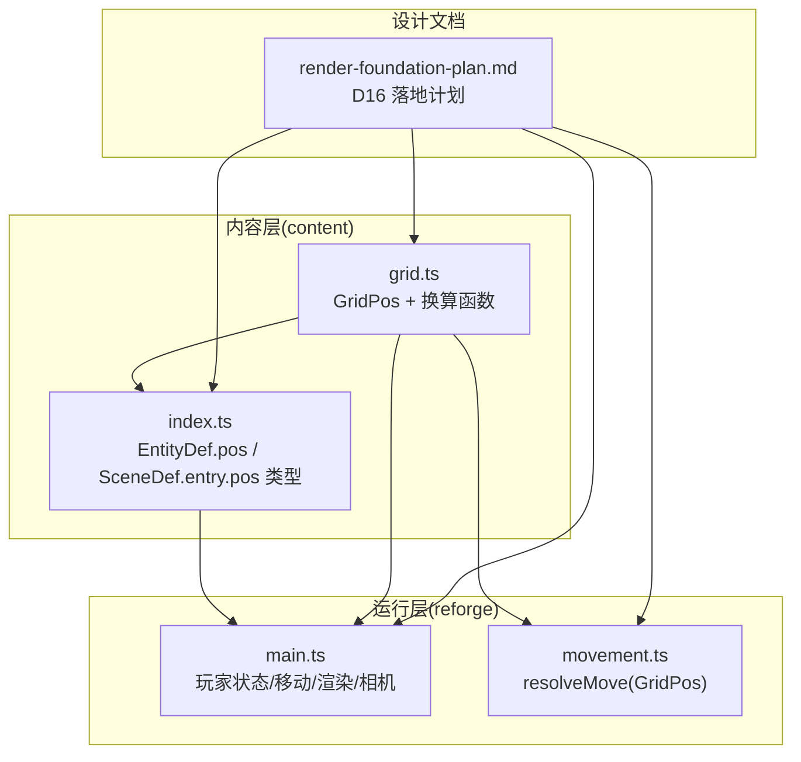
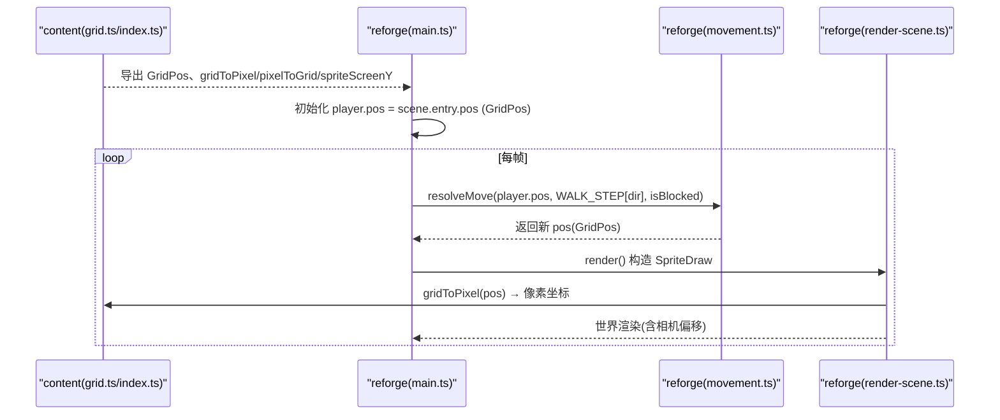
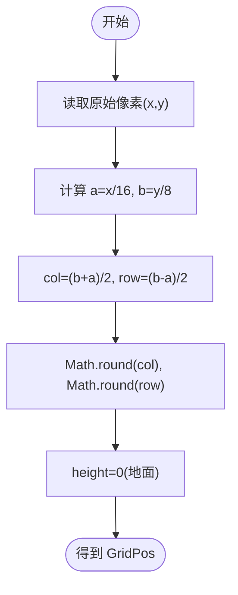
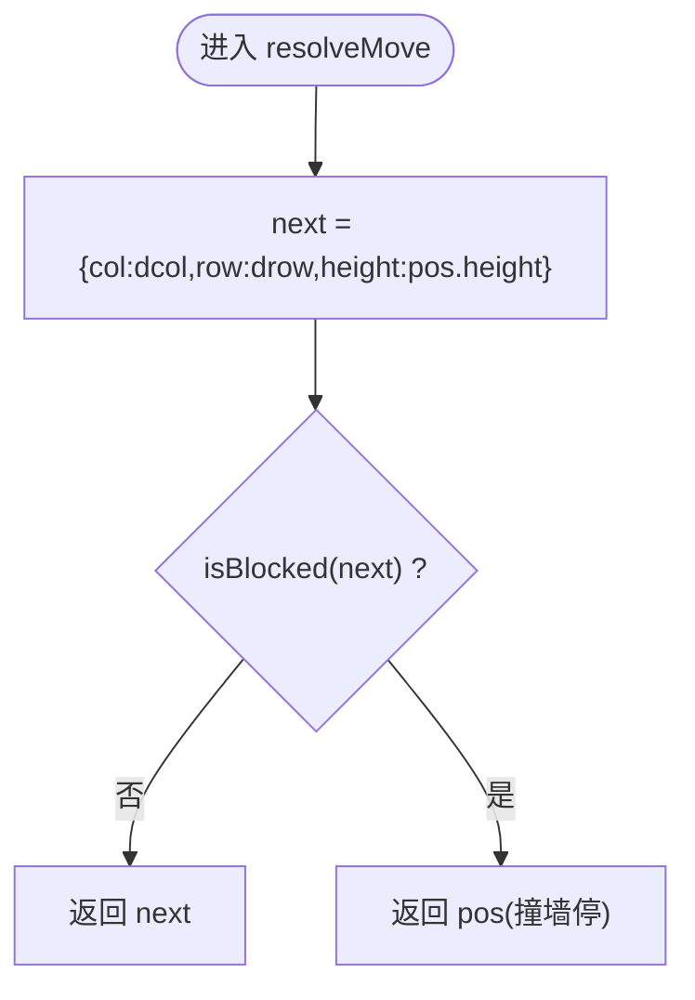
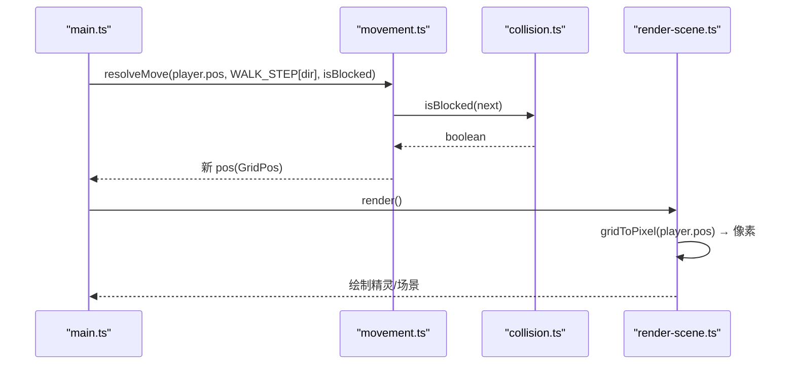
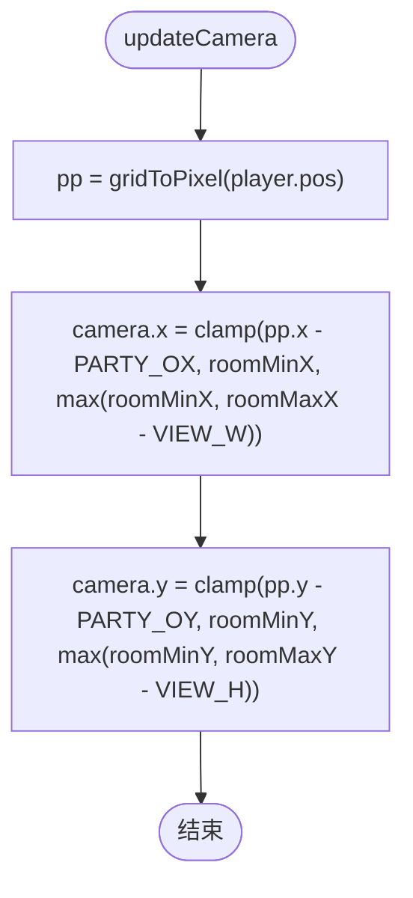
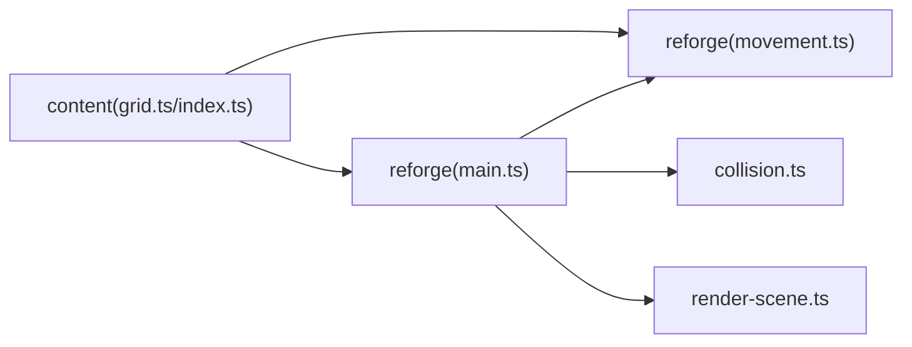

# 内容实体重构

<cite>
**本文引用的文件**   
- [packages/content/src/grid.ts](file://packages/content/src/grid.ts)
- [packages/content/src/index.ts](file://packages/content/src/index.ts)
- [packages/reforge/src/main.ts](file://packages/reforge/src/main.ts)
- [packages/reforge/src/movement.ts](file://packages/reforge/src/movement.ts)
- [docs/phase2/foundation/render-foundation-plan.md](file://docs/phase2/foundation/render-foundation-plan.md)
</cite>

## 目录
1. [引言](#引言)
2. [项目结构](#项目结构)
3. [核心组件](#核心组件)
4. [架构总览](#架构总览)
5. [详细组件分析](#详细组件分析)
6. [依赖关系分析](#依赖关系分析)
7. [性能考量](#性能考量)
8. [故障排查指南](#故障排查指南)
9. [结论](#结论)
10. [附录](#附录)

## 引言
本文件聚焦“内容实体重构”的完整迁移过程：将 EntityDef.pos 与 SceneDef.entry.pos 从 Vec2 像素坐标迁移为 GridPos 格坐标，并围绕 gui jieMinjuScene 的数据转换、main.ts 集成改造（player.pos 数据结构变更、移动循环适配、渲染层坐标转换）、WALK_STEP 从像素步进到菱形轴步进的差异对比、相机与 room 包围盒的处理策略（保留像素计算、仅在关键位置做坐标转换），以及浏览器冒烟测试验收要点和常见问题排查方法，进行系统化说明。

## 项目结构
本次重构涉及三层职责清晰的文件：
- content 层定义真值类型与换算函数（GridPos、gridToPixel/pixelToGrid/spriteScreenY）
- reforge 层消费 content 类型，完成主循环、移动、碰撞、渲染等集成
- 计划文档记录 D16 决策与落地步骤，作为设计与验收依据



图表来源
- [packages/content/src/grid.ts:1-56](file://packages/content/src/grid.ts#L1-L56)
- [packages/content/src/index.ts:55-90](file://packages/content/src/index.ts#L55-L90)
- [packages/reforge/src/main.ts:157-177](file://packages/reforge/src/main.ts#L157-L177)
- [packages/reforge/src/movement.ts:1-32](file://packages/reforge/src/movement.ts#L1-L32)
- [docs/phase2/foundation/render-foundation-plan.md:34-53](file://docs/phase2/foundation/render-foundation-plan.md#L34-L53)

章节来源
- [packages/content/src/grid.ts:1-56](file://packages/content/src/grid.ts#L1-L56)
- [packages/content/src/index.ts:55-90](file://packages/content/src/index.ts#L55-L90)
- [packages/reforge/src/main.ts:157-177](file://packages/reforge/src/main.ts#L157-L177)
- [packages/reforge/src/movement.ts:1-32](file://packages/reforge/src/movement.ts#L1-L32)
- [docs/phase2/foundation/render-foundation-plan.md:34-53](file://docs/phase2/foundation/render-foundation-plan.md#L34-L53)

## 核心组件
- GridPos 与换算函数
  - GridPos 是实体的真值类型，包含 col、row、height；col/row 沿菱形两条斜边设轴，height 为垂直离地轴，地面实体 height=0。
  - gridToPixel 将 GridPos 投影到屏幕像素；pixelToGrid 唯一反解；spriteScreenY 用于精灵绘制时按 height 上移。
- 内容数据模型
  - EntityDef.pos 与 SceneDef.entry.pos 由 Vec2 像素改为 GridPos，确保“实体位置存格语义”。
- 移动系统
  - resolveMove 以 GridPos 为输入输出，意图 MoveIntent 使用 {dcol, drow} 单轴步进，撞墙原地停。
- 主循环与渲染
  - player.pos 使用 GridPos；渲染时在构造 SpriteDraw 前用 gridToPixel 转像素；相机跟随使用 gridToPixel(player.pos)。

章节来源
- [packages/content/src/grid.ts:23-56](file://packages/content/src/grid.ts#L23-L56)
- [packages/content/src/index.ts:55-90](file://packages/content/src/index.ts#L55-L90)
- [packages/reforge/src/movement.ts:10-31](file://packages/reforge/src/movement.ts#L10-L31)
- [packages/reforge/src/main.ts:173-177](file://packages/reforge/src/main.ts#L173-L177)

## 架构总览
下图展示从内容定义到运行时集成的整体流程：content 提供 GridPos 与换算函数，reforge 在 main.ts 中消费这些类型与函数，完成移动、碰撞、渲染与相机控制。



图表来源
- [packages/content/src/grid.ts:37-56](file://packages/content/src/grid.ts#L37-L56)
- [packages/content/src/index.ts:85-90](file://packages/content/src/index.ts#L85-L90)
- [packages/reforge/src/main.ts:173-177](file://packages/reforge/src/main.ts#L173-L177)
- [packages/reforge/src/movement.ts:20-31](file://packages/reforge/src/movement.ts#L20-L31)

## 详细组件分析

### 组件A：GridPos 与坐标换算（content）
- 设计要点
  - 菱形轴(col,row)：走一格仅动一个轴，任意整数(col,row)合法。
  - height 独立于平面投影，sprite 显示 y 通过 spriteScreenY 上移。
- 复杂度
  - gridToPixel/pixelToGrid 均为 O(1) 算术运算。
- 依赖链
  - movement/collision/render/main 均依赖此模块。
- 优化点
  - 避免重复调用 gridToPixel，可在需要处缓存结果。
- 错误处理
  - pixelToGrid 对非站位像素会四舍五入，需保证传入的是有效站位像素。

```mermaid
classDiagram
class GridPos {
+number col
+number row
+number height
}
class GridAPI {
+gridToPixel(p) : {x : number,y : number}
+pixelToGrid(x,y) : {col : number,row : number}
+spriteScreenY(p) : number
}
GridAPI --> GridPos : "使用"
```

图表来源
- [packages/content/src/grid.ts:23-56](file://packages/content/src/grid.ts#L23-L56)

章节来源
- [packages/content/src/grid.ts:23-56](file://packages/content/src/grid.ts#L23-L56)

### 组件B：内容数据模型迁移（content）
- 变更范围
  - EntityDef.pos 与 SceneDef.entry.pos 从 Vec2 像素改 GridPos。
- 数据转换示例（guijieMinjuScene）
  - 鬼：原像素 {x:1280,y:832} → 格 {col:92,row:12,height:0}
  - entry：原像素 {x:1216,y:832} → 格 {col:90,row:14,height:0}
  - 反算方法：a = x/16 = col−row，b = y/8 = col+row → col=(b+a)/2，row=(b−a)/2
- 影响面
  - 所有读取 pos 的地方需按 GridPos 语义处理；渲染层再转像素。



图表来源
- [docs/phase2/foundation/render-foundation-plan.md:166-171](file://docs/phase2/foundation/render-foundation-plan.md#L166-L171)
- [packages/content/src/grid.ts:42-46](file://packages/content/src/grid.ts#L42-L46)

章节来源
- [packages/content/src/index.ts:55-90](file://packages/content/src/index.ts#L55-L90)
- [docs/phase2/foundation/render-foundation-plan.md:166-171](file://docs/phase2/foundation/render-foundation-plan.md#L166-L171)

### 组件C：移动系统适配（reforge）
- 变更要点
  - MoveIntent 使用 {dcol,drow} 单轴步进；resolveMove 输入输出均为 GridPos。
  - 撞墙语义不变：目标被挡则原地停，不产生滑行歧义。
- 复杂度
  - resolveMove 为 O(1)，isBlocked 注入，可独立单测。
- 依赖链
  - main.ts 的 tick 循环调用 resolveMove；collision 提供 isBlockedAt。



图表来源
- [packages/reforge/src/movement.ts:20-31](file://packages/reforge/src/movement.ts#L20-L31)

章节来源
- [packages/reforge/src/movement.ts:10-31](file://packages/reforge/src/movement.ts#L10-L31)

### 组件D：main.ts 集成改造（reforge）
- player.pos 数据结构变更
  - 初始化为 scene.entry.pos（GridPos）。
- 移动循环适配
  - 每 STEP_MS 尝试一步：resolveMove(player.pos, WALK_STEP[dir], isBlocked)；若未移动则复位行走相位。
- 渲染层坐标转换
  - 构造 SpriteDraw 前调用 gridToPixel(pos) 获取 worldX/worldY；spriteScreenY 用于高度上移。
- 相机与 room 包围盒
  - 相机跟随使用 gridToPixel(player.pos) 计算像素后 clamp 到 roomMinX..roomMaxX、roomMinY..roomMaxY。
- WALK_STEP 对比（重构前后）
  - 重构前：像素步进 {dx,dy}（如右下 dx=+16, dy=+8）
  - 重构后：菱形轴单轴步进 {dcol,drow}（down={0,+1}, up={0,-1}, left={-1,0}, right={+1,0}）
  - 效果等价：经 gridToPixel 映射后屏幕位移一致，但逻辑更干净（单轴 ±1）。



图表来源
- [packages/reforge/src/main.ts:173-177](file://packages/reforge/src/main.ts#L173-L177)
- [packages/reforge/src/main.ts:292-321](file://packages/reforge/src/main.ts#L292-L321)
- [packages/reforge/src/movement.ts:20-31](file://packages/reforge/src/movement.ts#L20-L31)

章节来源
- [packages/reforge/src/main.ts:157-177](file://packages/reforge/src/main.ts#L157-L177)
- [packages/reforge/src/main.ts:292-321](file://packages/reforge/src/main.ts#L292-L321)
- [packages/reforge/src/main.ts:710-741](file://packages/reforge/src/main.ts#L710-L741)

### 组件E：相机与 room 包围盒策略
- 策略
  - 相机与 room 包围盒保持像素计算（roomMinX/Y、VIEW_W/H 等），因为相机属于显示层概念。
  - 仅在关键位置进行坐标转换：updateCamera 使用 gridToPixel(player.pos) 将玩家格坐标转为像素后再 clamp。
- 优势
  - 减少不必要的格↔像素转换开销；保持相机逻辑简单直观。



图表来源
- [packages/reforge/src/main.ts:173-177](file://packages/reforge/src/main.ts#L173-L177)

章节来源
- [packages/reforge/src/main.ts:157-177](file://packages/reforge/src/main.ts#L157-L177)

## 依赖关系分析
- 依赖方向
  - reforge → content（GridPos、换算函数、内容类型）
  - collision → content（gridToPixel 复用旧像素判定路径）
  - movement → content（GridPos 签名）
- 耦合与内聚
  - content 纯数学与类型，高内聚、低耦合；reforge 消费接口，边界清晰。
- 外部依赖
  - Canvas2DRenderer、render-scene 负责最终像素绘制，不改变逻辑坐标。



图表来源
- [packages/content/src/grid.ts:1-56](file://packages/content/src/grid.ts#L1-L56)
- [packages/content/src/index.ts:55-90](file://packages/content/src/index.ts#L55-L90)
- [packages/reforge/src/main.ts:1-11](file://packages/reforge/src/main.ts#L1-L11)
- [packages/reforge/src/movement.ts:1-8](file://packages/reforge/src/movement.ts#L1-L8)

章节来源
- [packages/content/src/grid.ts:1-56](file://packages/content/src/grid.ts#L1-L56)
- [packages/content/src/index.ts:55-90](file://packages/content/src/index.ts#L55-L90)
- [packages/reforge/src/main.ts:1-11](file://packages/reforge/src/main.ts#L1-L11)
- [packages/reforge/src/movement.ts:1-8](file://packages/reforge/src/movement.ts#L1-L8)

## 性能考量
- 坐标转换频率
  - 渲染阶段对每个精灵进行一次 gridToPixel，O(1) 开销；建议缓存已计算的像素坐标以减少重复计算。
- 移动循环
  - STEP_MS 固定步进（~10fps），避免高频浮点插值带来的额外计算。
- 相机更新
  - 每帧一次 gridToPixel(player.pos) 后 clamp，开销可控。
- 内存与缩放
  - 物理分辨率 1280×800，逻辑 320×200，渲染 ×4 整数倍放大，保持点阵锐利。

[本节为通用指导，无需具体文件分析]

## 故障排查指南
- 常见症状与定位
  - 角色卡在墙边或反复踏步：检查 resolveMove 是否返回原 pos，确认 isBlocked 是否正确识别目标格。
  - 对话无法触发：确认 nearbyInteractable 使用 gridToPixel 后的像素距离判断，INTERACT_RANGE 阈值合理。
  - 相机抖动或越界：检查 updateCamera 的 clamp 区间是否与 roomMinX/Y、roomMaxX/Y 一致。
  - 精灵错位或遮挡异常：确认 spriteScreenY 的使用，height 仅影响显示 y，不影响碰撞。
- 调试手段
  - 启用 ?collision 叠加层，观察红绿格与玩家脚点是否对齐。
  - 打印 player.pos 与 gridToPixel(player.pos) 的值，验证格→像素转换正确性。
- 回归验证
  - 撞墙多次后落脚仍正常（参考 commit e7253ad 修复不退化）。
  - 对话触发不回归，交互范围稳定。

章节来源
- [packages/reforge/src/main.ts:411-450](file://packages/reforge/src/main.ts#L411-L450)
- [packages/reforge/src/main.ts:474-484](file://packages/reforge/src/main.ts#L474-L484)
- [packages/reforge/src/main.ts:710-741](file://packages/reforge/src/main.ts#L710-L741)

## 结论
通过将实体位置从像素迁移到格坐标，我们获得了更清晰的逻辑表达与更强的可维护性：
- 内容层统一了 GridPos 真值类型与换算函数
- 移动系统采用单轴步进，消除对角歧义
- 渲染层仅在必要时进行坐标转换，保持相机与 room 包围盒的像素计算简洁
- 数据转换有明确反算方法与示例，便于校验与回归

[本节为总结，无需具体文件分析]

## 附录

### 代码对比摘要（重构前后）
- WALK_STEP
  - 重构前：像素步进 {dx,dy}（例如右下 dx=+16, dy=+8）
  - 重构后：菱形轴单轴步进 {dcol,drow}（down={0,+1}, up={0,-1}, left={-1,0}, right={+1,0}）
  - 效果：经 gridToPixel 映射后屏幕位移一致，逻辑更干净
- player.pos
  - 重构前：Vec2 {x,y}
  - 重构后：GridPos {col,row,height}
- 渲染
  - 重构前：直接使用像素坐标
  - 重构后：gridToPixel(pos) 转换为像素后再绘制
- 相机
  - 重构前：直接基于像素坐标
  - 重构后：gridToPixel(player.pos) 后 clamp 到 room 包围盒

章节来源
- [packages/reforge/src/main.ts:99-106](file://packages/reforge/src/main.ts#L99-L106)
- [packages/reforge/src/main.ts:173-177](file://packages/reforge/src/main.ts#L173-L177)
- [packages/reforge/src/main.ts:292-321](file://packages/reforge/src/main.ts#L292-L321)

### 浏览器冒烟测试验收要点
- 基本交互
  - 方向键移动：四向各走一步，对应 col/row 单轴变化
  - 撞墙停步：靠近墙体不再前进，站立帧复位
  - 对话触发：靠近鬼按空格打开对话框
- 视觉与精度
  - 物理 1280×800，逻辑 320×200，×4 整数倍放大，点阵锐利
  - ?collision 叠加层红绿格与玩家脚点对齐
- 稳定性
  - 撞墙多次后落脚不退化
  - 对话触发无回归问题

章节来源
- [docs/phase2/foundation/render-foundation-plan.md:180-186](file://docs/phase2/foundation/render-foundation-plan.md#L180-L186)