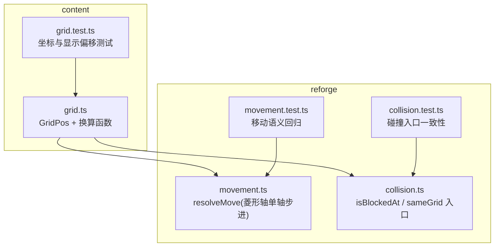
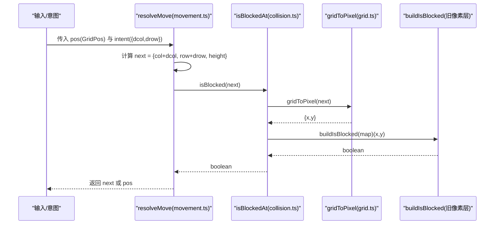
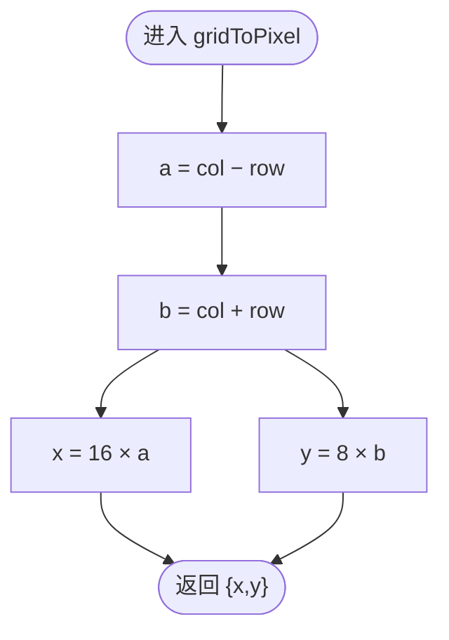
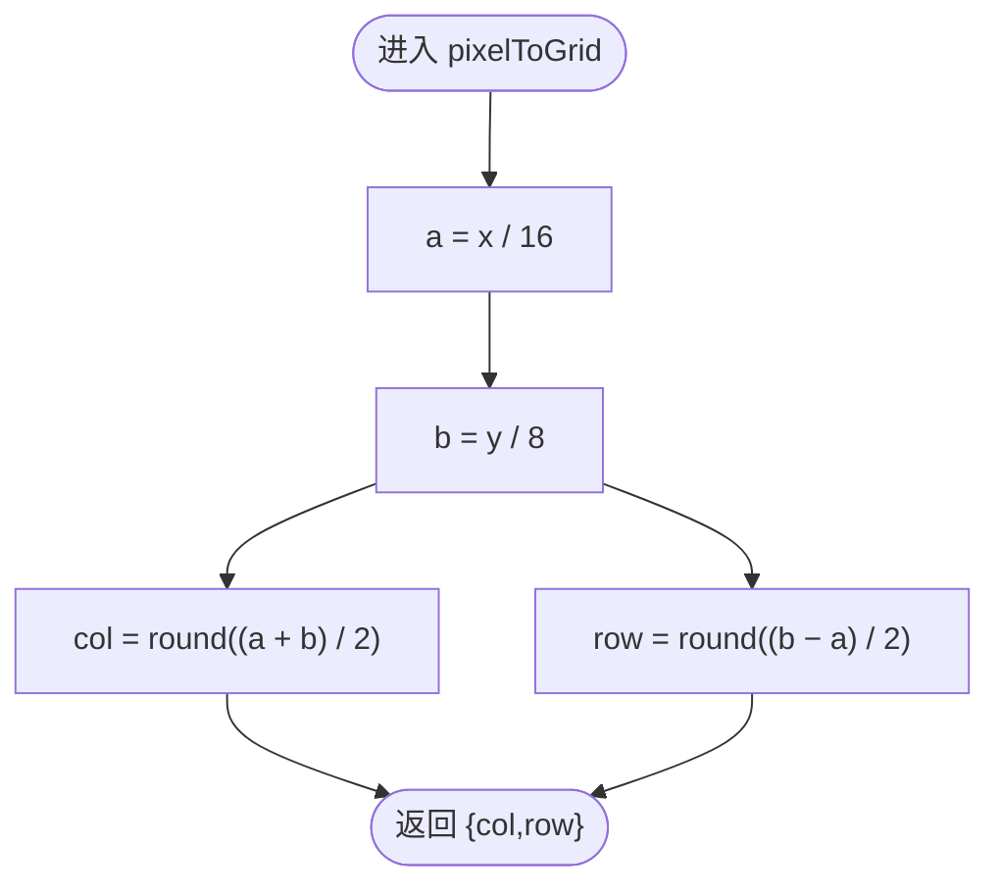
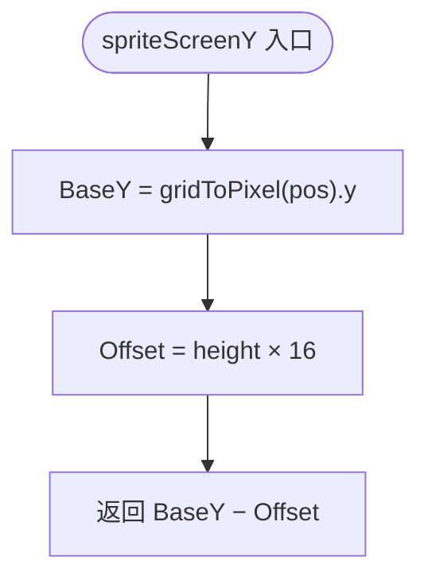
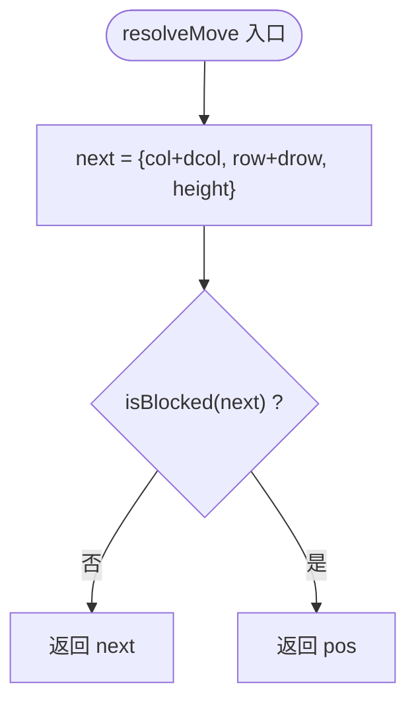
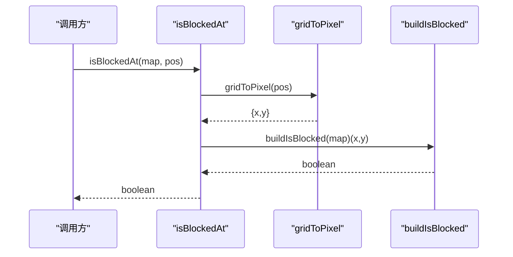
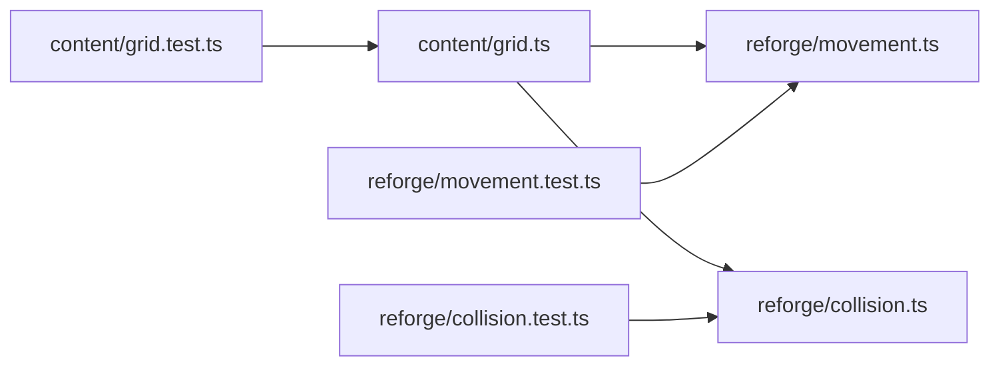

# 格坐标系统

<cite>
**本文引用的文件**   
- [packages/content/src/grid.ts](file://packages/content/src/grid.ts)
- [packages/content/src/grid.test.ts](file://packages/content/src/grid.test.ts)
- [docs/phase2/foundation/render-foundation-plan.md](file://docs/phase2/foundation/render-foundation-plan.md)
- [packages/reforge/src/movement.ts](file://packages/reforge/src/movement.ts)
- [packages/reforge/src/movement.test.ts](file://packages/reforge/src/movement.test.ts)
- [packages/reforge/src/collision.ts](file://packages/reforge/src/collision.ts)
- [packages/reforge/src/collision.test.ts](file://packages/reforge/src/collision.test.ts)
</cite>

## 目录
1. [引言](#引言)
2. [项目结构](#项目结构)
3. [核心组件](#核心组件)
4. [架构总览](#架构总览)
5. [详细组件分析](#详细组件分析)
6. [依赖关系分析](#依赖关系分析)
7. [性能考量](#性能考量)
8. [故障排查指南](#故障排查指南)
9. [结论](#结论)
10. [附录](#附录)

## 引言
本文件系统化阐述“格坐标系统”的设计与实现，聚焦以下目标：
- 解释 GridPos 数据结构（col、row、height）的几何意义与数学原理
- 推导菱形轴坐标系下的 gridToPixel 与 pixelToGrid 转换算法
- 阐明等距(isometric)地图的几何真相，说明为何选择菱形轴而非屏幕像素轴作为逻辑坐标基础
- 提供具体使用示例（四方向移动的单轴步进机制）
- 给出完整的单元测试用例说明，覆盖边界与异常处理
- 解释 height 维度在垂直空间中的作用及其与平面投影的关系

## 项目结构
与格坐标系统直接相关的代码位于 content 与 reforge 两个包中：
- content 包提供纯数学原语：GridPos 类型定义、gridToPixel/pixelToGrid/spriteScreenY 函数及单测
- reforge 包基于这些原语实现移动意图解析、碰撞判定、以及与旧像素兼容层的桥接



图表来源
- [packages/content/src/grid.ts:1-56](file://packages/content/src/grid.ts#L1-L56)
- [packages/content/src/grid.test.ts:1-58](file://packages/content/src/grid.test.ts#L1-L58)
- [packages/reforge/src/movement.ts:1-31](file://packages/reforge/src/movement.ts#L1-L31)
- [packages/reforge/src/collision.ts:52-70](file://packages/reforge/src/collision.ts#L52-L70)
- [packages/reforge/src/movement.test.ts:1-35](file://packages/reforge/src/movement.test.ts#L1-L35)
- [packages/reforge/src/collision.test.ts:1-81](file://packages/reforge/src/collision.test.ts#L1-L81)

章节来源
- [docs/phase2/foundation/render-foundation-plan.md:21-53](file://docs/phase2/foundation/render-foundation-plan.md#L21-L53)

## 核心组件
- GridPos：实体位置的真值类型，包含 col、row、height 三个维度
- gridToPixel：将菱形轴格坐标映射到屏幕像素
- pixelToGrid：从屏幕像素唯一反解回菱形轴格坐标
- spriteScreenY：计算精灵的屏幕 y（含 height 上移），用于渲染遮挡排序
- resolveMove：基于 MoveIntent 的单轴步进移动解析（仅改变 col 或 row）
- isBlockedAt / sameGrid：以 GridPos 为入口的碰撞判定接口

章节来源
- [packages/content/src/grid.ts:13-27](file://packages/content/src/grid.ts#L13-L27)
- [packages/content/src/grid.ts:34-55](file://packages/content/src/grid.ts#L34-L55)
- [packages/reforge/src/movement.ts:10-31](file://packages/reforge/src/movement.ts#L10-L31)
- [packages/reforge/src/collision.ts:61-70](file://packages/reforge/src/collision.ts#L61-L70)

## 架构总览
格坐标系统的职责分层清晰：
- 数据层（content）：定义 GridPos 与纯函数换算，不依赖渲染或输入
- 行为层（reforge）：基于 GridPos 实现移动意图解析与碰撞判定
- 兼容层（reforge）：保留旧像素/层级(h)兼容接口，通过新入口桥接到旧实现



图表来源
- [packages/reforge/src/movement.ts:20-31](file://packages/reforge/src/movement.ts#L20-L31)
- [packages/reforge/src/collision.ts:61-65](file://packages/reforge/src/collision.ts#L61-L65)
- [packages/content/src/grid.ts:37-46](file://packages/content/src/grid.ts#L37-L46)

## 详细组件分析

### GridPos 数据结构与几何意义
- col、row：沿菱形两条斜边设置的轴。走一格只改变其中一个轴 ±1，绝不对角；任意整数 (col,row) 均为合法落脚点
- height：垂直离地轴，与平面正交。地面实体 height=0；飞行/楼层/高台 > 0。逻辑/碰撞/影子均在地面 (col,row)，height 仅影响 sprite 的显示位置

```mermaid
classDiagram
class GridPos {
+number col
+number row
+number height
}
class Functions {
+gridToPixel(p : GridPos) : {x : number; y : number}
+pixelToGrid(x : number, y : number) : {col : number; row : number}
+spriteScreenY(pos : GridPos) : number
}
Functions --> GridPos : "使用"
```

图表来源
- [packages/content/src/grid.ts:23-27](file://packages/content/src/grid.ts#L23-L27)
- [packages/content/src/grid.ts:37-55](file://packages/content/src/grid.ts#L37-L55)

章节来源
- [packages/content/src/grid.ts:13-27](file://packages/content/src/grid.ts#L13-L27)
- [docs/phase2/foundation/render-foundation-plan.md:34-45](file://docs/phase2/foundation/render-foundation-plan.md#L34-L45)

### 菱形轴坐标系的数学推导与转换算法
- 等距地图 tile 尺寸 32×16（宽高比 2:1）。菱形网格等价于旋转 45° 的正交网格
- 设 a = col − row，b = col + row，则屏幕像素满足：
  - x = 16 × a = 16(col − row)
  - y = 8 × b = 8(col + row)
- 反解：
  - a = x / 16
  - b = y / 8
  - col = round((a + b) / 2)
  - row = round((b − a) / 2)
- 重要性质：
  - 任意整数 (col,row) 都合法，无需奇偶约束
  - 四方向对应单轴步进：右下 col+1、左上 col−1、左下 row+1、右上 row−1
  - height 不参与平面投影，独立轴



图表来源
- [packages/content/src/grid.ts:37-39](file://packages/content/src/grid.ts#L37-L39)



图表来源
- [packages/content/src/grid.ts:42-46](file://packages/content/src/grid.ts#L42-L46)

章节来源
- [packages/content/src/grid.ts:1-10](file://packages/content/src/grid.ts#L1-L10)
- [packages/content/src/grid.ts:34-46](file://packages/content/src/grid.ts#L34-L46)
- [docs/phase2/foundation/render-foundation-plan.md:23-32](file://docs/phase2/foundation/render-foundation-plan.md#L23-L32)

### 高度维度 height 的作用与投影关系
- 逻辑/碰撞/影子始终在地面 (col,row)
- sprite 的屏幕 y 按公式：spriteScreenY(pos) = gridToPixel(pos).y − height × 16
- 每级 height 上移 16px，等价于对角格 (col−h, row−h) 的屏幕 y
- height 是纯显示层概念，不影响碰撞与逻辑



图表来源
- [packages/content/src/grid.ts:53-55](file://packages/content/src/grid.ts#L53-L55)

章节来源
- [packages/content/src/grid.ts:48-55](file://packages/content/src/grid.ts#L48-L55)
- [docs/phase2/foundation/render-foundation-plan.md:47-51](file://docs/phase2/foundation/render-foundation-plan.md#L47-L51)

### 移动系统：四方向单轴步进机制
- MoveIntent 表达菱形轴上的单轴步进：{dcol,drow}，其中 dcol 或 drow 必有一个为 ±1，另一个为 0
- resolveMove 计算 next = {col+dcol, row+drow, height}，若 next 未被阻挡则返回 next，否则返回原 pos
- 该设计天然避免“部分走”歧义，撞墙即停



图表来源
- [packages/reforge/src/movement.ts:20-31](file://packages/reforge/src/movement.ts#L20-L31)

章节来源
- [packages/reforge/src/movement.ts:1-31](file://packages/reforge/src/movement.ts#L1-L31)

### 碰撞系统：GridPos 入口与旧像素兼容层
- isBlockedAt(map, pos)：内部调用 gridToPixel(pos) 得到像素，再复用旧像素层 buildIsBlocked(map) 进行判定
- sameGrid(a,b)：比较两 GridPos 的 col,row（忽略 height），用于实体间同格判定
- 保持零行为变化，确保迁移平滑



图表来源
- [packages/reforge/src/collision.ts:61-65](file://packages/reforge/src/collision.ts#L61-L65)

章节来源
- [packages/reforge/src/collision.ts:52-70](file://packages/reforge/src/collision.ts#L52-L70)

## 依赖关系分析
- content.grid.ts 被 reforge.movement.ts 与 reforge.collision.ts 引用
- movement.ts 与 collision.ts 通过 @type-pal/content 引入 GridPos 与换算函数
- 测试文件分别验证各模块的行为一致性与边界条件



图表来源
- [packages/content/src/grid.ts:1-56](file://packages/content/src/grid.ts#L1-L56)
- [packages/reforge/src/movement.ts:1-31](file://packages/reforge/src/movement.ts#L1-L31)
- [packages/reforge/src/collision.ts:52-70](file://packages/reforge/src/collision.ts#L52-L70)

章节来源
- [packages/content/src/index.ts](file://packages/content/src/index.ts)

## 性能考量
- gridToPixel/pixelToGrid 为 O(1) 算术运算，无分支与内存分配
- spriteScreenY 仅一次 gridToPixel 与常数乘法，开销极低
- 移动与碰撞判定为 O(1) 检查，适合高频游戏循环
- 整体系统避免浮点误差累积：pixelToGrid 使用 Math.round 保证整数格坐标

[本节为通用指导，不涉及具体文件分析]

## 故障排查指南
常见问题与定位要点：
- 坐标非法或“半格”现象：确认是否误用屏幕像素轴作为逻辑坐标；应使用菱形轴 col,row
- 移动出现“对角走法”：检查 MoveIntent 是否为 {dcol±1,drow=0} 或 {dcol=0,drow±1}，禁止同时非零
- 撞墙后位置漂移：确认 resolveMove 未实现“部分走”，应为撞墙原地停
- height 导致碰撞异常：sameGrid 忽略 height；逻辑/碰撞在地面层，height 仅影响显示
- 像素→格反解偏差：检查输入像素是否为有效站位像素（由 gridToPixel 生成），否则需先对齐到最近格

章节来源
- [packages/reforge/src/movement.test.ts:1-35](file://packages/reforge/src/movement.test.ts#L1-L35)
- [packages/reforge/src/collision.test.ts:47-81](file://packages/reforge/src/collision.test.ts#L47-L81)

## 结论
格坐标系统以 GridPos 为核心，采用菱形轴 col,row 作为逻辑坐标基础，配合独立高度轴 height，既保证了等距地图的几何正确性，又简化了移动与碰撞的实现。gridToPixel/pixelToGrid 的线性变换与唯一反解确保了坐标往返的一致性；spriteScreenY 将高度映射为显示偏移，维持逻辑与渲染的清晰分离。通过纯函数与可注入的碰撞源，系统在保持高性能的同时具备良好的可测试性与可扩展性。

[本节为总结性内容，不涉及具体文件分析]

## 附录

### 单元测试用例说明（关键场景）
- 格→像素与像素→格往返一致性：验证 gridToPixel 与 pixelToGrid 互为逆映射
- height 独立性：不同 height 的 GridPos 经 gridToPixel 得到相同平面投影
- 四方向单轴步进：从某像素出发，分别加/减 (±16,±8) 后反解回格，应仅改变一个轴
- 任意整数 (col,row) 合法性：包括 col+row 为奇数的情况，均能往返一致
- spriteScreenY 高度上移：height 每级上移 16px，等价于对角格 (col−h,row−h) 的屏幕 y
- 移动语义：目标开阔则走满意图；撞墙原地停；height 随位置保留
- 碰撞入口一致性：isBlockedAt 与旧像素层 buildIsBlocked 结果恒等；sameGrid 忽略 height

章节来源
- [packages/content/src/grid.test.ts:1-58](file://packages/content/src/grid.test.ts#L1-L58)
- [packages/reforge/src/movement.test.ts:1-35](file://packages/reforge/src/movement.test.ts#L1-L35)
- [packages/reforge/src/collision.test.ts:1-81](file://packages/reforge/src/collision.test.ts#L1-L81)