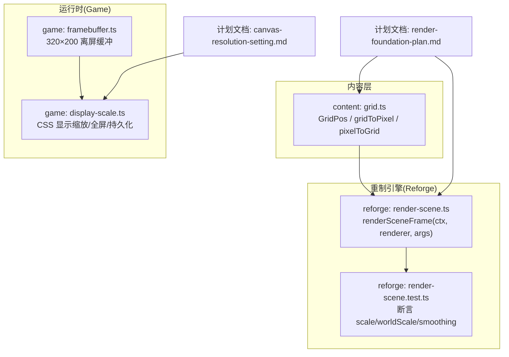
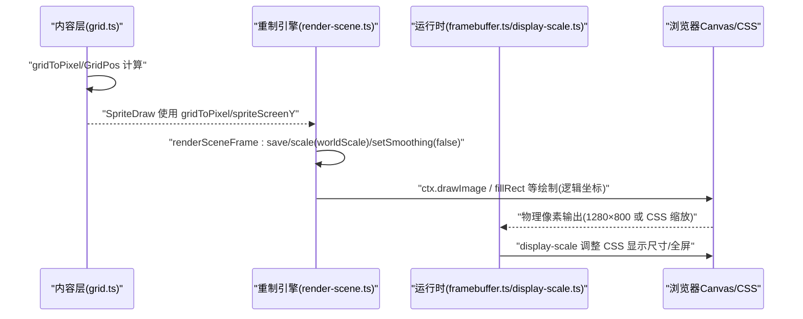
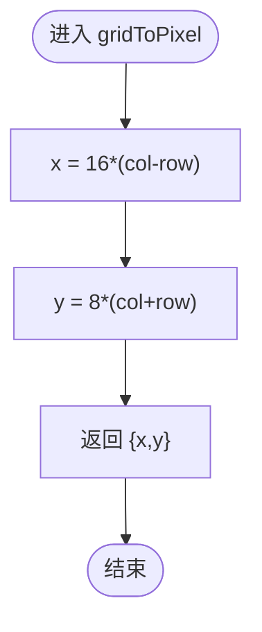
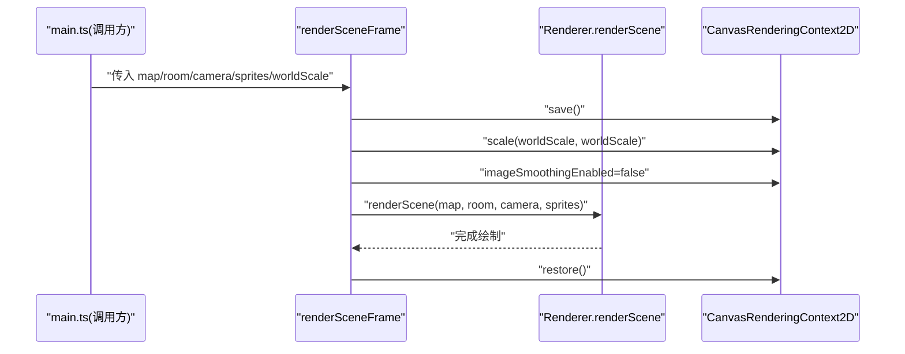
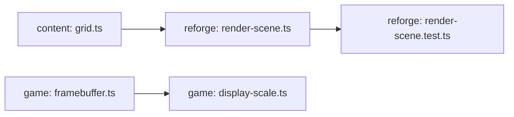

# 渲染地基改造

<cite>
**本文引用的文件**
- [packages/content/src/grid.ts](file://packages/content/src/grid.ts)
- [packages/reforge/src/render-scene.ts](file://packages/reforge/src/render-scene.ts)
- [packages/reforge/src/render-scene.test.ts](file://packages/reforge/src/render-scene.test.ts)
- [docs/phase2/foundation/render-foundation-plan.md](file://docs/phase2/foundation/render-foundation-plan.md)
- [docs/phase1/plans/2026-06-13-canvas-resolution-setting.md](file://docs/phase1/plans/2026-06-13-canvas-resolution-setting.md)
- [packages/game/src/present/framebuffer.ts](file://packages/game/src/present/framebuffer.ts)
- [packages/game/src/tools/display-scale.ts](file://packages/game/src/tools/display-scale.ts)
</cite>

## 目录
1. [引言](#引言)
2. [项目结构](#项目结构)
3. [核心组件](#核心组件)
4. [架构总览](#架构总览)
5. [详细组件分析](#详细组件分析)
6. [依赖关系分析](#依赖关系分析)
7. [性能考量](#性能考量)
8. [故障排查指南](#故障排查指南)
9. [结论](#结论)
10. [附录](#附录)

## 引言
本文件系统化梳理“渲染地基改造”的设计与实现，覆盖以下关键主题：
- 格坐标系统：菱形轴（col,row）+ 高度轴 height；像素级精度控制、坐标变换矩阵思想、视口管理。
- 物理坐标系 1280 的设计决策：分辨率适配、整数倍缩放算法、点阵字锐利策略、性能权衡。
- UI 高清化方案：UI 逻辑坐标 × 物理缩放、矢量/自适应布局思路、多分辨率支持。
- 渲染管线重构要点：批处理优化、GPU 加速路径、内存管理。
- 渲染性能监控与分析工具：帧率统计、绘制调用分析、内存使用监控。
- 常见问题排查方法与优化技巧。

## 项目结构
本次改造涉及两个阶段代码的协同：
- 第一阶段（game 包）：以 320×200 逻辑 framebuffer 为核心，通过 CSS 显示缩放实现“分辨率设置”，不改动内部渲染逻辑。
- 第二阶段（reforge 包 + content 包）：引入 GridPos 格坐标体系，统一世界坐标语义；在 reforge 中通过 ctx.scale(worldScale) 将 320 逻辑坐标整体放大到 1280 物理像素；UI 采用“逻辑坐标 × 缩放”的高清方案。

图表来源
- [packages/content/src/grid.ts:1-56](file://packages/content/src/grid.ts#L1-L56)
- [packages/reforge/src/render-scene.ts:1-40](file://packages/reforge/src/render-scene.ts#L1-L40)
- [packages/reforge/src/render-scene.test.ts:1-28](file://packages/reforge/src/render-scene.test.ts#L1-L28)
- [packages/game/src/present/framebuffer.ts:1-50](file://packages/game/src/present/framebuffer.ts#L1-L50)
- [packages/game/src/tools/display-scale.ts:1-35](file://packages/game/src/tools/display-scale.ts#L1-L35)
- [docs/phase2/foundation/render-foundation-plan.md:1-266](file://docs/phase2/foundation/render-foundation-plan.md#L1-L266)
- [docs/phase1/plans/2026-06-13-canvas-resolution-setting.md:1-12](file://docs/phase1/plans/2026-06-13-canvas-resolution-setting.md#L1-L12)

章节来源
- [docs/phase2/foundation/render-foundation-plan.md:1-266](file://docs/phase2/foundation/render-foundation-plan.md#L1-L266)
- [docs/phase1/plans/2026-06-13-canvas-resolution-setting.md:1-12](file://docs/phase1/plans/2026-06-13-canvas-resolution-setting.md#L1-L12)

## 核心组件
- 格坐标原语（content）
  - GridPos：{ col, row, height }，定义等距菱形网格上的实体位置与离地高度。
  - gridToPixel / pixelToGrid：菱形轴到屏幕像素的双射换算；height 不参与平面投影。
  - spriteScreenY：按 height 上移 sprite 的屏幕 y，影子仍落地面。
- 场景渲染框架（reforge）
  - renderSceneFrame：封装 clear → save → scale(worldScale) → 关闭平滑 → renderScene → restore 的标准流程，确保世界渲染在逻辑坐标下绘制，再由 worldScale 整体放大。
- 运行时显示缩放（game）
  - framebuffer：固定 320×200 逻辑背衬，toImageData 输出 ImageData。
  - display-scale：基于 CSS 的显示缩放（百分比、全屏、localStorage 持久化），不改 framebuffer 尺寸。

章节来源
- [packages/content/src/grid.ts:1-56](file://packages/content/src/grid.ts#L1-L56)
- [packages/reforge/src/render-scene.ts:1-40](file://packages/reforge/src/render-scene.ts#L1-L40)
- [packages/game/src/present/framebuffer.ts:1-50](file://packages/game/src/present/framebuffer.ts#L1-L50)
- [packages/game/src/tools/display-scale.ts:1-35](file://packages/game/src/tools/display-scale.ts#L1-L35)

## 架构总览
下图展示从“逻辑坐标”到“物理像素”的完整链路：内容层提供 GridPos 与换算函数；重制引擎在渲染入口统一进行 worldScale 变换；运行时通过 CSS 或 Canvas 物理尺寸完成最终呈现。

图表来源
- [packages/content/src/grid.ts:1-56](file://packages/content/src/grid.ts#L1-L56)
- [packages/reforge/src/render-scene.ts:1-40](file://packages/reforge/src/render-scene.ts#L1-L40)
- [packages/game/src/present/framebuffer.ts:1-50](file://packages/game/src/present/framebuffer.ts#L1-L50)
- [packages/game/src/tools/display-scale.ts:1-35](file://packages/game/src/tools/display-scale.ts#L1-L35)

## 详细组件分析

### 格坐标系统与像素级精度控制
- 设计要点
  - 菱形轴(col,row)：沿两条斜边设轴，走一格仅单轴 ±1，任意整数 (col,row) 合法。
  - 像素换算：x = 16×(col−row)，y = 8×(col+row)。pixelToGrid 唯一反解，站位像素必得整数。
  - height 轴：逻辑/碰撞/影子在地面 (col,row)；sprite 显示 y 上移 height×16，纯显示层。
- 复杂度
  - gridToPixel / pixelToGrid：O(1) 时间、O(1) 空间。
  - spriteScreenY：O(1)。
- 错误边界
  - 输入越界由上层保证；pixelToGrid 对非对齐像素做取整，避免浮点误差累积。

图表来源
- [packages/content/src/grid.ts:34-46](file://packages/content/src/grid.ts#L34-L46)

章节来源
- [packages/content/src/grid.ts:1-56](file://packages/content/src/grid.ts#L1-L56)

### 视口管理与渲染流程
- 渲染入口职责
  - renderSceneFrame 负责上下文保存/恢复、worldScale 缩放、关闭图像平滑，委托 Renderer.renderScene 完成具体绘制。
- 视口与相机
  - 逻辑视口保持 320×200；物理 canvas 为 1280×800；worldScale=4 时，所有逻辑坐标经 ctx.scale(4,4) 映射到物理像素。
- 调试叠加层
  - 碰撞 debug 层不在 renderSceneFrame 内，保留在调用方，用独立 save/scale/restore 包裹，避免污染主渲染流。

图表来源
- [packages/reforge/src/render-scene.ts:27-39](file://packages/reforge/src/render-scene.ts#L27-L39)
- [packages/reforge/src/render-scene.test.ts:1-28](file://packages/reforge/src/render-scene.test.ts#L1-L28)

章节来源
- [packages/reforge/src/render-scene.ts:1-40](file://packages/reforge/src/render-scene.ts#L1-L40)
- [packages/reforge/src/render-scene.test.ts:1-28](file://packages/reforge/src/render-scene.test.ts#L1-L28)

### 物理坐标系 1280 的设计决策
- 目标
  - 世界渲染整体 ×4 整数倍放大，观感与原 320 一致；点阵字锐利不糊。
- 实现要点
  - index.html 中 canvas 物理尺寸设为 1280×800；CSS image-rendering: pixelated。
  - render.ts 渲染入口 ctx.save(); ctx.scale(4,4); ...世界绘制...; ctx.restore()。
  - VIEW_W/VIEW_H 仍为逻辑 320/200；?collision debug 层坐标相应 ×4 或在 scale 内绘制。
- 性能考虑
  - 整数倍缩放 + nearest-neighbor 避免插值开销；减少 GPU 纹理过滤切换。
  - 世界资产 HD 属远期提取器放大版，当前只做渲染时整体 ×4 缩放。

章节来源
- [docs/phase2/foundation/render-foundation-plan.md:192-214](file://docs/phase2/foundation/render-foundation-plan.md#L192-L214)

### UI 高清化改造方案
- 原则
  - UI 不走“320 离屏 ×4 放大”的低清路线；UI 逻辑坐标（如对话框 POS 常量）× UI_SCALE 直接落物理像素。
  - 字模不换源：16px 点阵 ×4 = 64px 锐利点阵字（nearest-neighbor）。
- 落地方式
  - dialog-box.ts：POS/LINE_HEIGHT/MAX_RIGHT/CURSOR_RESERVE 等常量机制化为“逻辑值 × UI_SCALE”。
  - text-render.ts：renderSpans 的字宽累加与 x/y 落点按 ×4 后物理像素；阴影偏移按物理像素调。
- 版面约束
  - 本计划只做坐标机制高清化，不重设计版面（版面属于后续菜单任务）。

章节来源
- [docs/phase2/foundation/render-foundation-plan.md:216-236](file://docs/phase2/foundation/render-foundation-plan.md#L216-L236)

### 运行时显示缩放（第一阶段）
- 设计
  - 渲染层完全不动：内部 framebuffer 恒 320×200，putImageData 写背衬。
  - “分辨率”只改 canvas 的 CSS 显示尺寸，配合 image-rendering: pixelated 保持像素锐利。
  - 新增 display-scale 控制器：计算/套用缩放 + localStorage 持久化 + 窗口 resize 重算 + 全屏切换。
- 优势
  - 零引擎风险：无需任何坐标重映射；纯键盘游戏无鼠标坐标问题。

章节来源
- [docs/phase1/plans/2026-06-13-canvas-resolution-setting.md:1-12](file://docs/phase1/plans/2026-06-13-canvas-resolution-setting.md#L1-L12)
- [packages/game/src/tools/display-scale.ts:1-35](file://packages/game/src/tools/display-scale.ts#L1-L35)

## 依赖关系分析
- 依赖方向
  - reforge/editor 依赖 content（GridPos 与换算函数）；content 不反向依赖 reforge/editor。
  - game 包通过 framebuffer 与 display-scale 组合，形成“逻辑 320×200 + CSS 缩放”的显示方案。
- 耦合与内聚
  - grid.ts 为纯数学模块，高内聚、低耦合，便于跨包复用。
  - render-scene.ts 聚焦“画一帧场景”的上下文变换，职责单一，利于编辑器复用。

图表来源
- [packages/content/src/grid.ts:1-56](file://packages/content/src/grid.ts#L1-L56)
- [packages/reforge/src/render-scene.ts:1-40](file://packages/reforge/src/render-scene.ts#L1-L40)
- [packages/reforge/src/render-scene.test.ts:1-28](file://packages/reforge/src/render-scene.test.ts#L1-L28)
- [packages/game/src/present/framebuffer.ts:1-50](file://packages/game/src/present/framebuffer.ts#L1-L50)
- [packages/game/src/tools/display-scale.ts:1-35](file://packages/game/src/tools/display-scale.ts#L1-L35)

章节来源
- [packages/content/src/grid.ts:1-56](file://packages/content/src/grid.ts#L1-L56)
- [packages/reforge/src/render-scene.ts:1-40](file://packages/reforge/src/render-scene.ts#L1-L40)
- [packages/game/src/present/framebuffer.ts:1-50](file://packages/game/src/present/framebuffer.ts#L1-L50)
- [packages/game/src/tools/display-scale.ts:1-35](file://packages/game/src/tools/display-scale.ts#L1-L35)

## 性能考量
- 缩放与采样
  - 整数倍缩放 + nearest-neighbor 可避免线性插值带来的模糊与额外计算。
  - 在 render-scene 中显式关闭 imageSmoothingEnabled，确保点阵锐利。
- 内存与带宽
  - 逻辑 framebuffer 维持 320×200，降低每帧写入量；大尺寸缩略图按需创建更大离屏缓冲并降采样。
- 绘制批次
  - 将世界绘制集中在 renderScene 中，结合 tilemap 批处理与精灵排序（baseY），减少状态切换。
- GPU 加速路径
  - 优先使用 Canvas 2D 批量绘制；若未来引入 WebGL，可将 tilemap 与精灵合批上传至 GPU，减少 CPU-GPU 往返。

[本节为通用指导，不直接分析具体文件]

## 故障排查指南
- 画面模糊/锯齿异常
  - 检查是否设置了 imageSmoothingEnabled=true；确认 worldScale 为整数且 CSS image-rendering: pixelated。
  - 参考测试用例断言顺序与 smoothing 状态。
- 移动/碰撞回归
  - 确认 movement 已改用 GridPos，四方向步进为单轴 ±1；碰撞判定 isBlockedAt 使用 gridToPixel 复用旧层。
- 对话框错位/折行异常
  - 核对 UI 逻辑坐标是否统一乘以 UI_SCALE；text-render 的字宽累加与落点是否为物理像素。
- 大屏可见区域过小
  - 使用 display-scale 控制器调整 CSS 显示尺寸，确认 localStorage 持久化生效。

章节来源
- [packages/reforge/src/render-scene.test.ts:1-28](file://packages/reforge/src/render-scene.test.ts#L1-L28)
- [docs/phase2/foundation/render-foundation-plan.md:192-236](file://docs/phase2/foundation/render-foundation-plan.md#L192-L236)
- [packages/game/src/tools/display-scale.ts:1-35](file://packages/game/src/tools/display-scale.ts#L1-L35)

## 结论
本次渲染地基改造以“格坐标 + 物理 1280 + UI 高清化”为核心，实现了：
- 世界坐标回归格语义，几何清晰、碰撞稳定；
- 物理分辨率 1280 通过整数倍缩放达成，点阵字锐利；
- UI 高清化采用“逻辑坐标 × 缩放”的方案，兼顾清晰度与版面一致性；
- 运行时显示缩放在不改动渲染逻辑的前提下，提供灵活的分辨率体验。

[本节为总结性内容，不直接分析具体文件]

## 附录
- 术语
  - 格坐标：等距菱形网格上的 (col,row,height) 三元组。
  - 物理分辨率：canvas 实际像素尺寸（如 1280×800）。
  - 逻辑分辨率：渲染逻辑使用的尺寸（320×200）。
- 相关里程碑
  - D16 渲染地基改造计划：包含 T1–T7 全部落地说明与偏差记录。

章节来源
- [docs/phase2/foundation/render-foundation-plan.md:1-266](file://docs/phase2/foundation/render-foundation-plan.md#L1-L266)