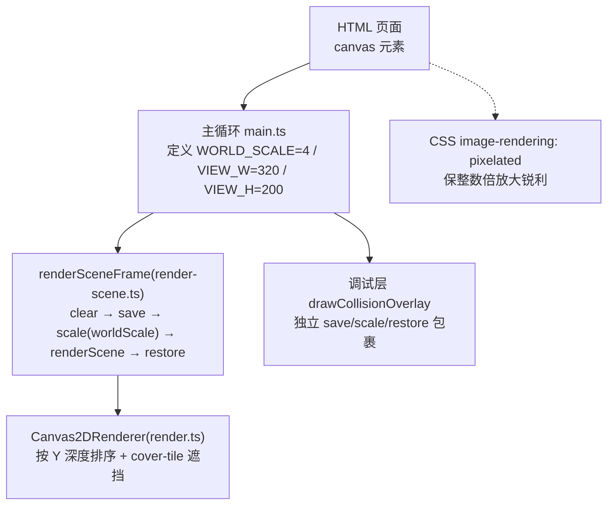
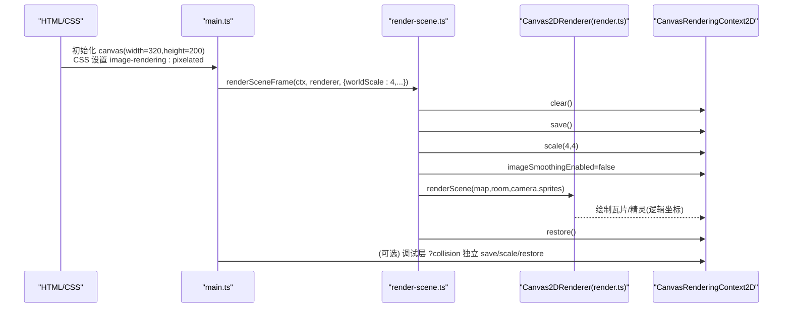
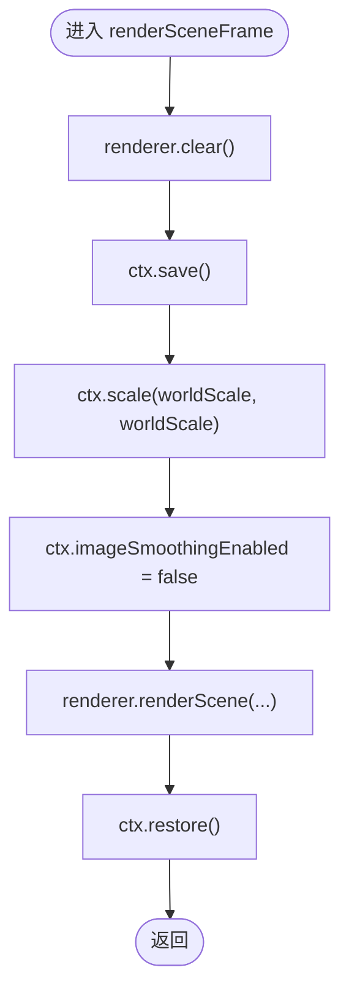
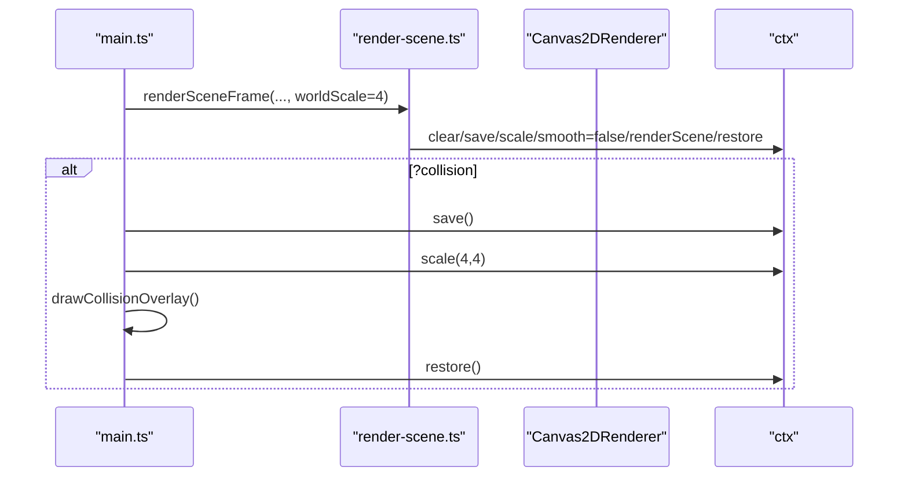
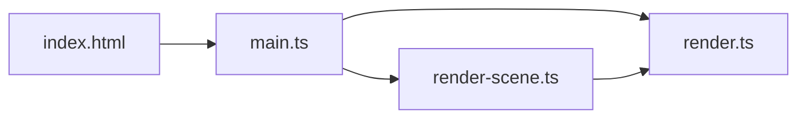

# 物理分辨率升级

<cite>
**本文引用的文件**   
- [render.ts](file://packages/reforge/src/render.ts)
- [render-scene.ts](file://packages/reforge/src/render-scene.ts)
- [main.ts](file://packages/reforge/src/main.ts)
- [index.html](file://packages/game/index.html)
- [2026-06-13-canvas-resolution-setting.md](file://docs/phase1/plans/2026-06-13-canvas-resolution-setting.md)
- [render-foundation-plan.md](file://docs/phase2/foundation/render-foundation-plan.md)
</cite>

## 目录
1. [引言](#引言)
2. [项目结构](#项目结构)
3. [核心组件](#核心组件)
4. [架构总览](#架构总览)
5. [详细组件分析](#详细组件分析)
6. [依赖关系分析](#依赖关系分析)
7. [性能考量](#性能考量)
8. [故障排查指南](#故障排查指南)
9. [结论](#结论)
10. [附录](#附录)

## 引言
本文件面向“从 320×200 到 1280×800”的物理分辨率升级，聚焦以下目标：
- 明确 canvas 物理尺寸与 CSS 显示尺寸的分工
- 解释 render.ts 中世界渲染的 ctx.scale(4,4) 机制，确保逻辑坐标不变、整体放大
- 说明 image-rendering: pixelated 的作用，保证整数倍放大时点阵字与精灵锐利
- 给出 Canvas2DRenderer 改造要点（ctx.save()/restore() 上下文管理）
- 解释 VIEW_W/VIEW_H 保持逻辑尺寸的原因，以及视口与相机的适配策略
- 提供调试层（?collision）在新分辨率下的坐标适配说明

## 项目结构
本次升级涉及的关键位置：
- 渲染管线入口与缩放控制：packages/reforge/src/render-scene.ts
- 场景绘制实现：packages/reforge/src/render.ts
- 主循环与调试叠加层：packages/reforge/src/main.ts
- 游戏页内联样式与默认 canvas 尺寸：packages/game/index.html
- 计划文档对分辨率与像素化策略的约定：docs/phase1/plans/2026-06-13-canvas-resolution-setting.md、docs/phase2/foundation/render-foundation-plan.md

图表来源
- [main.ts:157-177](file://packages/reforge/src/main.ts#L157-L177)
- [render-scene.ts:27-39](file://packages/reforge/src/render-scene.ts#L27-L39)
- [render.ts:87-165](file://packages/reforge/src/render.ts#L87-L165)
- [index.html:10-11](file://packages/game/index.html#L10-L11)

章节来源
- [main.ts:157-177](file://packages/reforge/src/main.ts#L157-L177)
- [render-scene.ts:27-39](file://packages/reforge/src/render-scene.ts#L27-L39)
- [render.ts:87-165](file://packages/reforge/src/render.ts#L87-L165)
- [index.html:10-11](file://packages/game/index.html#L10-L11)

## 核心组件
- Canvas2DRenderer：负责瓦片烘焙、缓存、基底两层铺底、精灵与高物瓦片的深度排序与绘制。
- renderSceneFrame：统一封装 clear → save → scale(worldScale) → renderScene → restore，并关闭图像平滑。
- main.ts：定义逻辑视口 VIEW_W/VIEW_H、物理放大倍数 WORLD_SCALE，组织相机跟随、UI 与调试层绘制。

章节来源
- [render.ts:87-165](file://packages/reforge/src/render.ts#L87-L165)
- [render-scene.ts:27-39](file://packages/reforge/src/render-scene.ts#L27-L39)
- [main.ts:157-177](file://packages/reforge/src/main.ts#L157-L177)

## 架构总览
下图展示从 HTML 到渲染层的调用链与缩放边界：

图表来源
- [main.ts:320-329](file://packages/reforge/src/main.ts#L320-L329)
- [render-scene.ts:27-39](file://packages/reforge/src/render-scene.ts#L27-L39)
- [render.ts:127-165](file://packages/reforge/src/render.ts#L127-L165)
- [index.html:10-11](file://packages/game/index.html#L10-L11)

## 详细组件分析

### 1) 物理分辨率与 CSS 像素化
- 逻辑分辨率：320×200（VIEW_W/VIEW_H），所有逻辑坐标、相机、菜单布局均基于此。
- 物理分辨率：1280×800（WORLD_SCALE=4）。通过 ctx.scale(4,4) 将逻辑画布整体放大，不改变任何逻辑坐标。
- CSS 像素化：image-rendering: pixelated 确保整数倍放大时点阵字与精灵边缘锐利，避免模糊。

章节来源
- [main.ts:157-161](file://packages/reforge/src/main.ts#L157-L161)
- [render-scene.ts:34-36](file://packages/reforge/src/render-scene.ts#L34-L36)
- [index.html:10-11](file://packages/game/index.html#L10-L11)
- [2026-06-13-canvas-resolution-setting.md:6](file://docs/phase1/plans/2026-06-13-canvas-resolution-setting.md#L6)
- [render-foundation-plan.md:198](file://docs/phase2/foundation/render-foundation-plan.md#L198)

### 2) render.ts 中的 ctx.scale(4,4) 缩放机制
- 缩放边界由 render-scene.ts 的 renderSceneFrame 统一管理：在 clear 之后、renderScene 之前进行 save/scale，并在结束后 restore。
- 该方式使世界渲染整体放大，但逻辑坐标保持不变；精灵、瓦片、相机偏移等全部以逻辑单位计算。
- 同时关闭图像平滑（imageSmoothingEnabled=false），配合整数倍放大获得清晰像素。

图表来源
- [render-scene.ts:27-39](file://packages/reforge/src/render-scene.ts#L27-L39)

章节来源
- [render-scene.ts:27-39](file://packages/reforge/src/render-scene.ts#L27-L39)
- [render.ts:127-165](file://packages/reforge/src/render.ts#L127-L165)

### 3) Canvas2DRenderer 改造要点（上下文管理）
- 使用 ctx.save()/restore() 将缩放作用域限定在单帧场景绘制期间，避免污染后续 UI 或调试层绘制。
- 在 render-scene.ts 中集中管理缩放，render.ts 内部专注逻辑绘制（无需再次缩放）。
- 若需额外叠加层（如调试层），应在 renderSceneFrame 之外，单独用 save/scale/restore 包裹，确保变换隔离。

章节来源
- [render-scene.ts:27-39](file://packages/reforge/src/render-scene.ts#L27-L39)
- [main.ts:322-329](file://packages/reforge/src/main.ts#L322-L329)

### 4) VIEW_W/VIEW_H 保持逻辑尺寸的原因
- VIEW_W/VIEW_H 代表逻辑视口大小（320×200），用于相机跟随、裁剪矩形、碰撞判定与 UI 布局。
- 物理放大仅影响最终输出尺寸，不影响这些逻辑常量，从而保证行为一致性与可移植性。

章节来源
- [main.ts:159-177](file://packages/reforge/src/main.ts#L159-L177)
- [render-foundation-plan.md:206](file://docs/phase2/foundation/render-foundation-plan.md#L206)

### 5) 视口与相机的适配策略
- 相机跟随玩家位置，限制在房间包围盒内，且以 VIEW_W/VIEW_H 为可见范围。
- 由于 WORLD_SCALE 仅作用于渲染阶段，相机逻辑无需感知物理分辨率变化。

章节来源
- [main.ts:173-177](file://packages/reforge/src/main.ts#L173-L177)

### 6) 调试层（?collision）的坐标适配
- 调试开关：URL 参数 ?collision 开启。
- 绘制流程：在 renderSceneFrame 之后，main.ts 中以独立的 ctx.save()/scale(WORLD_SCALE)/restore() 包裹 drawCollisionOverlay，确保其坐标与逻辑世界一致。
- 内容：等距菱形网格、每格站立点禁入/可行标记、玩家脚点高亮。

图表来源
- [main.ts:320-329](file://packages/reforge/src/main.ts#L320-L329)
- [main.ts:411-450](file://packages/reforge/src/main.ts#L411-L450)

章节来源
- [main.ts:124-126](file://packages/reforge/src/main.ts#L124-L126)
- [main.ts:322-329](file://packages/reforge/src/main.ts#L322-L329)
- [main.ts:411-450](file://packages/reforge/src/main.ts#L411-L450)

## 依赖关系分析
- main.ts 依赖 render-scene.ts 提供的 renderSceneFrame，以及 render.ts 的 Canvas2DRenderer。
- render-scene.ts 作为纯绘制委托，不耦合业务状态，便于编辑器复用。
- index.html 提供 canvas 初始尺寸与 CSS 像素化策略。

图表来源
- [index.html:10-11](file://packages/game/index.html#L10-L11)
- [main.ts:157-177](file://packages/reforge/src/main.ts#L157-L177)
- [render-scene.ts:27-39](file://packages/reforge/src/render-scene.ts#L27-L39)
- [render.ts:87-165](file://packages/reforge/src/render.ts#L87-L165)

章节来源
- [index.html:10-11](file://packages/game/index.html#L10-L11)
- [main.ts:157-177](file://packages/reforge/src/main.ts#L157-L177)
- [render-scene.ts:27-39](file://packages/reforge/src/render-scene.ts#L27-L39)
- [render.ts:87-165](file://packages/reforge/src/render.ts#L87-L165)

## 性能考量
- 整数倍放大（×4）+ image-rendering: pixelated 可获得最佳清晰度与最低开销。
- 关闭图像平滑（imageSmoothingEnabled=false）避免插值带来的额外计算。
- Canvas2DRenderer 的瓦片与帧缓存减少重复烘焙成本。

[本节为通用指导，不直接分析具体文件]

## 故障排查指南
- 画面模糊：检查 CSS 是否包含 image-rendering: pixelated；确认 render-scene.ts 中 imageSmoothingEnabled 被设为 false。
- 错位/重叠异常：确认 renderSceneFrame 的 save/scale/restore 顺序正确；调试层需在外部独立包裹。
- 相机越界：核对 VIEW_W/VIEW_H 与房间包围盒计算，确保 clamp 逻辑生效。

章节来源
- [render-scene.ts:34-36](file://packages/reforge/src/render-scene.ts#L34-L36)
- [main.ts:173-177](file://packages/reforge/src/main.ts#L173-L177)
- [index.html:10-11](file://packages/game/index.html#L10-L11)

## 结论
通过将逻辑分辨率保持在 320×200，并以 WORLD_SCALE=4 在渲染阶段整体放大，配合 image-rendering: pixelated 与关闭图像平滑，实现了从 320×200 到 1280×800 的高清像素风格升级。视图与相机逻辑不受物理分辨率影响，调试层通过独立变换块保持坐标一致性，整体方案稳定、可维护且易于扩展。

[本节为总结，不直接分析具体文件]

## 附录
- 关键代码片段路径（不含源码内容）：
  - 缩放与平滑控制：[render-scene.ts:27-39](file://packages/reforge/src/render-scene.ts#L27-L39)
  - 场景绘制与深度排序：[render.ts:127-165](file://packages/reforge/src/render.ts#L127-L165)
  - 主循环与调试层：[main.ts:320-329](file://packages/reforge/src/main.ts#L320-L329)、[main.ts:411-450](file://packages/reforge/src/main.ts#L411-L450)
  - 逻辑视口与放大倍数：[main.ts:157-161](file://packages/reforge/src/main.ts#L157-L161)
  - CSS 像素化策略：[index.html:10-11](file://packages/game/index.html#L10-L11)
  - 计划文档参考：
    - [2026-06-13-canvas-resolution-setting.md:6](file://docs/phase1/plans/2026-06-13-canvas-resolution-setting.md#L6)
    - [render-foundation-plan.md:198](file://docs/phase2/foundation/render-foundation-plan.md#L198)