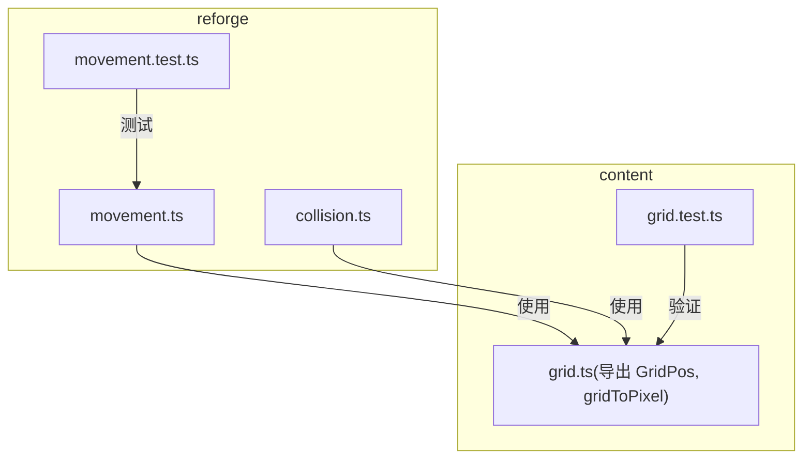
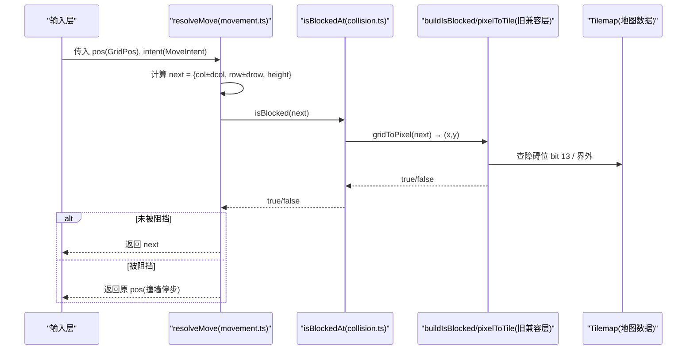
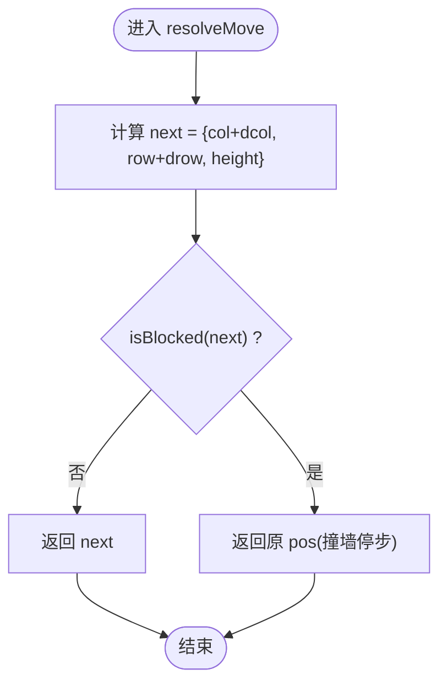
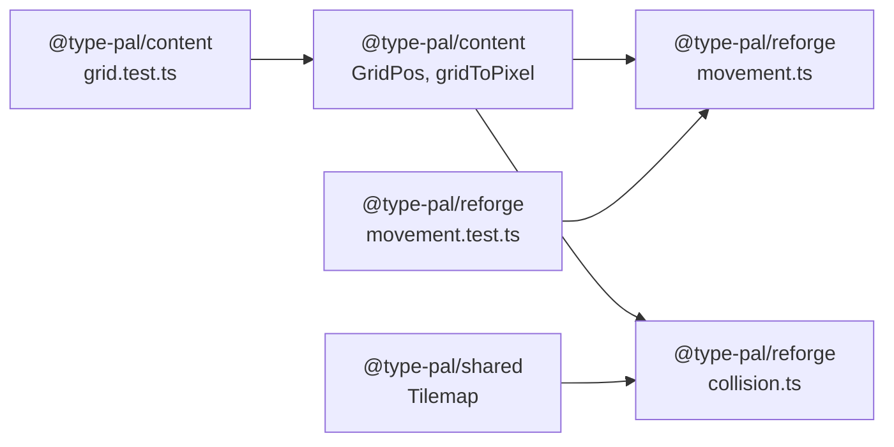

# 移动碰撞重构

<cite>
**本文引用的文件**   
- [packages/reforge/src/movement.ts](file://packages/reforge/src/movement.ts)
- [packages/reforge/src/movement.test.ts](file://packages/reforge/src/movement.test.ts)
- [packages/reforge/src/collision.ts](file://packages/reforge/src/collision.ts)
- [packages/content/src/grid.test.ts](file://packages/content/src/grid.test.ts)
- [docs/phase2/foundation/render-foundation-plan.md](file://docs/phase2/foundation/render-foundation-plan.md)
</cite>

## 目录
1. [引言](#引言)
2. [项目结构](#项目结构)
3. [核心组件](#核心组件)
4. [架构总览](#架构总览)
5. [详细组件分析](#详细组件分析)
6. [依赖关系分析](#依赖关系分析)
7. [性能考量](#性能考量)
8. [故障排查指南](#故障排查指南)
9. [结论](#结论)
10. [附录](#附录)

## 引言
本次重构围绕“移动与碰撞”的核心路径，将移动系统从像素坐标迁移到网格坐标（GridPos），并以纯函数形式实现“意图 → 碰撞判定 → 结果”的 D2/D5 红线。重点包括：
- movement.ts 中 MoveIntent 的新定义与 resolveMove 的重构
- collision.ts 新增 isBlockedAt 与 sameGrid，并复用旧兼容层 pixelToTile/h
- 保持与旧引擎行为一致（撞墙停步、不滑行）
- 为未来飞行机制预留 height 语义接口

## 项目结构
本重构涉及两个包：
- @type-pal/reforge：游戏运行时逻辑（movement、collision）
- @type-pal/content：内容原语（GridPos 及其像素换算）



图表来源
- [packages/reforge/src/movement.ts:1-32](file://packages/reforge/src/movement.ts#L1-L32)
- [packages/reforge/src/collision.ts:1-71](file://packages/reforge/src/collision.ts#L1-L71)
- [packages/reforge/src/movement.test.ts:1-36](file://packages/reforge/src/movement.test.ts#L1-L36)
- [packages/content/src/grid.test.ts:1-27](file://packages/content/src/grid.test.ts#L1-L27)

章节来源
- [packages/reforge/src/movement.ts:1-32](file://packages/reforge/src/movement.ts#L1-L32)
- [packages/reforge/src/collision.ts:1-71](file://packages/reforge/src/collision.ts#L1-L71)
- [packages/reforge/src/movement.test.ts:1-36](file://packages/reforge/src/movement.test.ts#L1-L36)
- [packages/content/src/grid.test.ts:1-27](file://packages/content/src/grid.test.ts#L1-L27)

## 核心组件
- MoveIntent：以菱形轴步进表达移动意图，仅允许单轴 ±1（四方向各对应一个轴）。
- IsBlocked：由调用方注入的碰撞判定函数，输入 GridPos，输出是否被阻挡。
- resolveMove：纯函数，计算目标格并依据 isBlocked 决定是否移动；若被挡则原地停留。
- isBlockedAt：GridPos 入口，内部通过 gridToPixel 转像素后复用旧兼容层 buildIsBlocked。
- sameGrid：判断两个 GridPos 是否在同一站立格（用于实体间碰撞）。

章节来源
- [packages/reforge/src/movement.ts:10-31](file://packages/reforge/src/movement.ts#L10-L31)
- [packages/reforge/src/collision.ts:62-70](file://packages/reforge/src/collision.ts#L62-L70)

## 架构总览
下图展示了从“玩家输入意图”到“碰撞判定”再到“位置更新”的完整流程，以及新旧兼容层的衔接点。



图表来源
- [packages/reforge/src/movement.ts:20-31](file://packages/reforge/src/movement.ts#L20-L31)
- [packages/reforge/src/collision.ts:62-65](file://packages/reforge/src/collision.ts#L62-L65)
- [packages/reforge/src/collision.ts:41-50](file://packages/reforge/src/collision.ts#L41-L50)
- [packages/reforge/src/collision.ts:18-38](file://packages/reforge/src/collision.ts#L18-L38)

## 详细组件分析

### movement.ts：从像素到 GridPos 的重构
- 新定义 MoveIntent：以 dcol/drow 表示沿菱形轴的步进，严格限制为单轴 ±1，避免对角移动。
- resolveMove 改造：
  - 输入：pos(GridPos)、intent(MoveIntent)、isBlocked(IsBlocked)
  - 计算 next：col/row 按意图步进，height 保持不变（地面行走恒 0，飞行留后续）
  - 判定：!isBlocked(next) 则返回 next；否则返回原 pos（撞墙停步）
- 设计要点：
  - 纯函数：无副作用、可独立单测
  - 碰撞源注入：isBlocked 由上层组合世界几何与实体遮挡
  - 语义不变：撞墙即停，不产生“部分走”或“贴墙滑行”歧义



图表来源
- [packages/reforge/src/movement.ts:20-31](file://packages/reforge/src/movement.ts#L20-L31)

章节来源
- [packages/reforge/src/movement.ts:1-31](file://packages/reforge/src/movement.ts#L1-L31)

### collision.ts：新增 isBlockedAt 与 sameGrid，并保持旧兼容
- 旧兼容层保留：
  - pixelToTile：像素 → (col,row,h)，沿用 sdlpal 菱形四分法
  - buildIsBlocked：基于 h 选择 lower/upper，检查 tile bit 13(0x2000) 是否为障碍，界外视为阻挡
- 新增 GridPos 入口：
  - isBlockedAt(map, pos)：先 gridToPixel(pos) 得到像素，再复用 buildIsBlocked
  - sameGrid(a,b)：比较 col/row（height 不参与，逻辑/碰撞在地面层）
- 兼容性说明：
  - 只要仍读取旧 Tilemap，pixelToTile/h 就继续有效
  - 新代码统一通过 isBlockedAt/sameGrid 访问，避免直接调用像素接口

```mermaid
classDiagram
class CollisionLayer {
+buildIsBlocked(map) : (x,y)=>boolean
+sameTile(ax,ay,bx,by) : boolean
+isBlockedAt(map,pos) : boolean
+sameGrid(a,b) : boolean
}
class OldCompat {
+pixelToTile(x,y) : {col,row,h}
+buildIsBlocked(map) : (x,y)=>boolean
}
CollisionLayer --> OldCompat : "复用 pixelToTile/buildIsBlocked"
```

图表来源
- [packages/reforge/src/collision.ts:18-50](file://packages/reforge/src/collision.ts#L18-L50)
- [packages/reforge/src/collision.ts:52-70](file://packages/reforge/src/collision.ts#L52-L70)

章节来源
- [packages/reforge/src/collision.ts:1-71](file://packages/reforge/src/collision.ts#L1-L71)

### 四方向单轴步进示例（概念性）
- 右下：{dcol:+1, drow:0}
- 左下：{dcol:0, drow:+1}
- 左上：{dcol:-1, drow:0}
- 右上：{dcol:0, drow:-1}
- 注意：绝不对角；每一步只改变一个轴，确保落点恒整数且符合菱形轴语义。

[本节为概念说明，不直接分析具体文件]

### 高度(height)在移动系统中的处理
- 移动不改 height：地面行走时 height 恒 0；飞行/楼层等变化机制留给后续扩展
- 渲染层面：height 影响 sprite 垂直偏移与遮挡排序，但不参与平面碰撞
- 碰撞层面：sameGrid 忽略 height，仅比较 col/row

章节来源
- [packages/reforge/src/movement.ts:22-26](file://packages/reforge/src/movement.ts#L22-L26)
- [packages/reforge/src/collision.ts:68-70](file://packages/reforge/src/collision.ts#L68-L70)

## 依赖关系分析
- movement.ts 依赖 content 的 GridPos 类型（仅类型引用，无运行时耦合）
- collision.ts 依赖 content 的 gridToPixel 进行坐标转换，并依赖 shared 的 Tilemap 数据结构
- movement.test.ts 对 resolveMove 进行纯函数单测，覆盖开路与撞墙场景
- grid.test.ts 验证 GridPos 与像素换算的正确性与唯一反解



图表来源
- [packages/reforge/src/movement.ts:8](file://packages/reforge/src/movement.ts#L8-L8)
- [packages/reforge/src/collision.ts:12-13](file://packages/reforge/src/collision.ts#L12-L13)
- [packages/reforge/src/movement.test.ts:1-3](file://packages/reforge/src/movement.test.ts#L1-L3)
- [packages/content/src/grid.test.ts:1-2](file://packages/content/src/grid.test.ts#L1-L2)

章节来源
- [packages/reforge/src/movement.ts:8](file://packages/reforge/src/movement.ts#L8-L8)
- [packages/reforge/src/collision.ts:12-13](file://packages/reforge/src/collision.ts#L12-L13)
- [packages/reforge/src/movement.test.ts:1-3](file://packages/reforge/src/movement.test.ts#L1-L3)
- [packages/content/src/grid.test.ts:1-2](file://packages/content/src/grid.test.ts#L1-L2)

## 性能考量
- resolveMove 为 O(1) 纯函数，仅一次加法与一次布尔判定
- isBlockedAt 包含一次 gridToPixel 与一次 map 查询，整体 O(1)
- 旧兼容层 pixelToTile 为常数时间算术运算，无额外分配
- 建议：批量移动时尽量复用 isBlocked 闭包，减少重复构建

[本节提供通用指导，不直接分析具体文件]

## 故障排查指南
- 撞墙停步回归：movement.test.ts 中包含针对“撞墙保持站位”的回归用例，确保 commit e7253ad 修复不退化
- 边界检测：isBlockedAt 对界外坐标直接返回 true，防止越界访问
- 高度一致性：确认移动未意外修改 height；sameGrid 仅比较 col/row，避免误判不同高度的实体碰撞

章节来源
- [packages/reforge/src/movement.test.ts:29-34](file://packages/reforge/src/movement.test.ts#L29-L34)
- [packages/reforge/src/collision.ts:44-46](file://packages/reforge/src/collision.ts#L44-L46)
- [packages/reforge/src/collision.ts:68-70](file://packages/reforge/src/collision.ts#L68-L70)

## 结论
本次重构将移动系统统一到 GridPos 与纯函数范式，明确 MoveIntent 的单轴步进语义，并通过 isBlockedAt/sameGrid 无缝对接旧兼容层。D2/D5 红线（纯函数、碰撞注入）得以保持，撞墙停步语义稳定，同时为 future 飞行机制预留 height 接口。

[本节为总结，不直接分析具体文件]

## 附录

### 关键 API 与职责速览
- MoveIntent：表达四方向单轴步进
- IsBlocked：碰撞判定注入接口
- resolveMove：移动解析主函数
- isBlockedAt：GridPos 碰撞入口
- sameGrid：同格判定（实体碰撞）

章节来源
- [packages/reforge/src/movement.ts:10-31](file://packages/reforge/src/movement.ts#L10-L31)
- [packages/reforge/src/collision.ts:62-70](file://packages/reforge/src/collision.ts#L62-L70)

### 测试用例概览
- 目标开阔 → 走满意图（单轴步进）
- 撞墙 → 原地不动
- height 随位置保留（移动不改 height）
- 撞墙保持站位（回归：commit e7253ad）

章节来源
- [packages/reforge/src/movement.test.ts:9-34](file://packages/reforge/src/movement.test.ts#L9-L34)

### 设计原则与红线
- D2/D5 红线：意图 → 纯函数碰撞判定 → 结果
- 碰撞源注入：isBlocked 由调用方组合世界几何与实体遮挡
- 旧兼容层：pixelToTile/h 继续服务旧 Tilemap，新代码通过 isBlockedAt/sameGrid 访问

章节来源
- [docs/phase2/foundation/render-foundation-plan.md:122-139](file://docs/phase2/foundation/render-foundation-plan.md#L122-L139)
- [packages/reforge/src/collision.ts:1-11](file://packages/reforge/src/collision.ts#L1-L11)