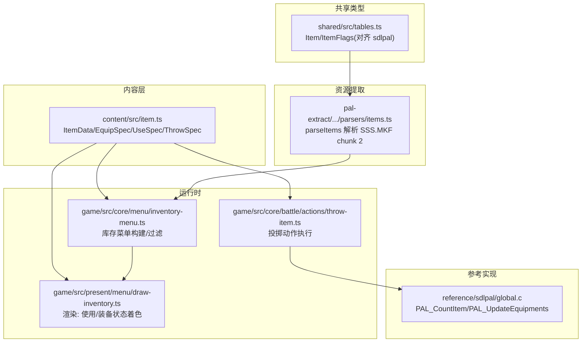
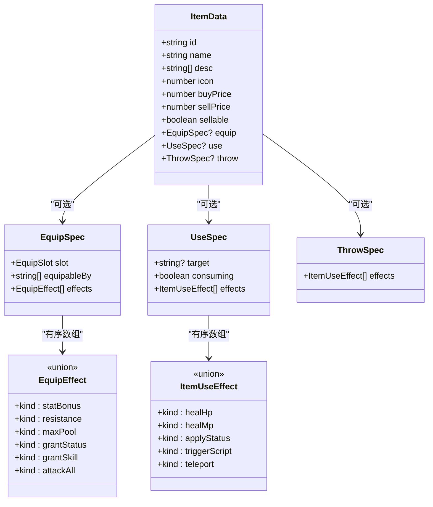
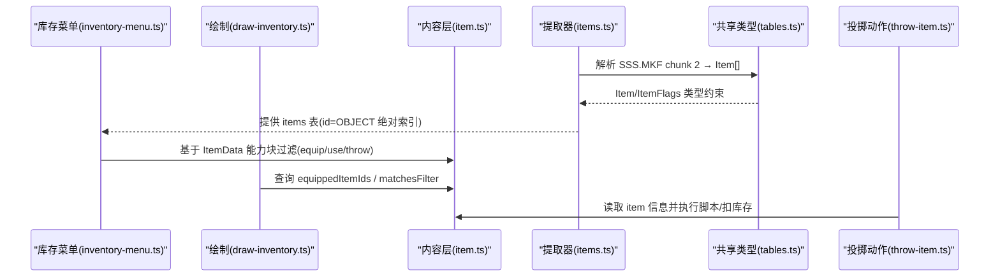

# ItemData 基类设计

<cite>
**本文引用的文件**   
- [packages/content/src/item.ts](file://packages/content/src/item.ts)
- [docs/phase2/foundation/item-data-design.md](file://docs/phase2/foundation/item-data-design.md)
- [packages/shared/src/tables.ts](file://packages/shared/src/tables.ts)
- [packages/pal-extract/src/resources/parsers/items.ts](file://packages/pal-extract/src/resources/parsers/items.ts)
- [packages/game/src/core/battle/actions/throw-item.ts](file://packages/game/src/core/battle/actions/throw-item.ts)
- [packages/game/src/core/menu/inventory-menu.ts](file://packages/game/src/core/menu/inventory-menu.ts)
- [packages/game/src/present/menu/draw-inventory.ts](file://packages/game/src/present/menu/draw-inventory.ts)
- [reference/sdlpal/global.c](file://reference/sdlpal/global.c)
</cite>

## 目录
1. [引言](#引言)
2. [项目结构](#项目结构)
3. [核心组件](#核心组件)
4. [架构总览](#架构总览)
5. [详细组件分析](#详细组件分析)
6. [依赖分析](#依赖分析)
7. [性能考虑](#性能考虑)
8. [故障排查指南](#故障排查指南)
9. [结论](#结论)
10. [附录](#附录)

## 引言
本文件聚焦于 ItemData 基类的设计与实现，系统阐述物品数据的核心结构与能力块机制（装备/使用/投掷），解释“一物多能力”的建模方式与“双重身份”（如灵珠同时可装备和使用）的实现原理。文档还包含与原版 sdlpal 的字段映射、兼容性要点、扩展新能力类型的指导，以及验证方法与示例路径。

## 项目结构
围绕 ItemData 的相关代码分布在 content 层（纯数据与类型）、shared 层（sdlpal 对齐的类型定义）、提取器（解析原始资源）、游戏运行时（菜单与战斗动作）等模块中。下图给出与 ItemData 直接相关的文件关系概览。

图表来源
- [packages/content/src/item.ts:52-67](file://packages/content/src/item.ts#L52-L67)
- [packages/shared/src/tables.ts:22-40](file://packages/shared/src/tables.ts#L22-L40)
- [packages/pal-extract/src/resources/parsers/items.ts:56-79](file://packages/pal-extract/src/resources/parsers/items.ts#L56-L79)
- [packages/game/src/core/menu/inventory-menu.ts:114-134](file://packages/game/src/core/menu/inventory-menu.ts#L114-L134)
- [packages/game/src/present/menu/draw-inventory.ts:244-277](file://packages/game/src/present/menu/draw-inventory.ts#L244-L277)
- [packages/game/src/core/battle/actions/throw-item.ts:70-84](file://packages/game/src/core/battle/actions/throw-item.ts#L70-L84)
- [reference/sdlpal/global.c:914-977](file://reference/sdlpal/global.c#L914-L977)

章节来源
- [packages/content/src/item.ts:52-67](file://packages/content/src/item.ts#L52-L67)
- [docs/phase2/foundation/item-data-design.md:27-43](file://docs/phase2/foundation/item-data-design.md#L27-L43)

## 核心组件
- ItemData：物品基类，包含基础字段与可选能力块（equip/use/throw）。
- EquipSpec + EquipEffect：装备能力块与效果模型，对应原版的 scriptOnEquip opcode 语义。
- UseSpec + ItemUseEffect：使用能力块与效果模型，独立于技能效果，支持回复、脚本、场景交互等。
- ThrowSpec：投掷能力块占位，后续细化。
- 辅助函数：effectiveStat/equippableItems/equipItem/usableItems/useItem 等，提供穿戴、使用、属性计算等逻辑。

章节来源
- [packages/content/src/item.ts:26-67](file://packages/content/src/item.ts#L26-L67)
- [docs/phase2/foundation/item-data-design.md:45-66](file://docs/phase2/foundation/item-data-design.md#L45-L66)

## 架构总览
ItemData 采用“能力块”组合式建模：一条物品可同时拥有多个能力块，菜单层按能力块存在与否进行过滤与展示，从而天然支持“一物多能力”和“双重身份”。

图表来源
- [packages/content/src/item.ts:26-67](file://packages/content/src/item.ts#L26-L67)

## 详细组件分析

### 基础字段设计原理
- id：稳定标识符，demo 阶段为字符串（兼容原版 oid 语义），对外作为不透明键使用。
- name/desc：名称与说明；desc 为多行文本，便于风味描述与效果说明分层渲染。
- icon：图标索引，对应 BALL.MKF 中的 bitmap 索引，用于 UI 渲染。
- buyPrice/sellPrice/sellable：价格系统与可卖性，sellable 对应原版 flags.sellable；clean-rewrite 显式存储买价与卖价，便于商店与交易逻辑。

章节来源
- [packages/content/src/item.ts:52-67](file://packages/content/src/item.ts#L52-L67)
- [docs/phase2/foundation/item-data-design.md:27-43](file://docs/phase2/foundation/item-data-design.md#L27-L43)

### 能力块机制（equip/use/throw）统一建模
- 能力块均为可选字段，存在即进入对应菜单：
  - equip → 装备菜单（大世界）
  - use → 使用菜单（大世界 + 战斗）
  - throw → 投掷菜单（战斗内）
- 通过“菜单过滤而非数据互斥”，实现“一物多能力”的灵活设计。例如灵珠同时具备 equip 与 use，自然出现在两个菜单中。

章节来源
- [docs/phase2/foundation/item-data-design.md:15-25](file://docs/phase2/foundation/item-data-design.md#L15-L25)
- [packages/content/src/item.ts:52-67](file://packages/content/src/item.ts#L52-L67)

### 装备能力块（EquipSpec + EquipEffect）
- slot：六槽位（weapon/head/body/cloak/feet/accessory），对齐原版 body part 实际用途。
- equipableBy：角色模板 id 列表（从原 bitfield 转为稳定 id 列表）。
- effects：有序数组，表示穿戴生效的效果集合。
- EquipEffect 覆盖原版 scriptOnEquip 的 opcode 语义：
  - statBonus：属性加成（含负值）
  - resistance：元素抗性
  - maxPool：最大 HP/MP 提升
  - grantStatus：永久赋予状态
  - grantSkill：授予技能（合击/召唤）
  - attackAll：全体攻击标记

章节来源
- [docs/phase2/foundation/item-data-design.md:45-66](file://docs/phase2/foundation/item-data-design.md#L45-L66)
- [packages/content/src/item.ts:13-30](file://packages/content/src/item.ts#L13-L30)

### 使用能力块（UseSpec + ItemUseEffect）
- target：目标范围（单个队友/全队/自身/场景）。
- consuming：是否消耗数量。
- effects：使用效果集合，独立联合，概念上可与技能效果重叠但保持独立：
  - healHp/healMp：恢复
  - applyStatus：施加状态
  - triggerScript：触发剧情/场景脚本
  - teleport：传送
  - 预留：giveItems/giveMoney/learnSkill/scenePlace/transform/levelUp/craft 等

章节来源
- [docs/phase2/foundation/item-data-design.md:98-115](file://docs/phase2/foundation/item-data-design.md#L98-L115)
- [packages/content/src/item.ts:32-50](file://packages/content/src/item.ts#L32-L50)

### 投掷能力块（ThrowSpec）
- 当前为占位，effects 暂复用 ItemUseEffect，后续可能独立联合以适配战斗伤害、施毒、秒杀等。

章节来源
- [docs/phase2/foundation/item-data-design.md:113-115](file://docs/phase2/foundation/item-data-design.md#L113-L115)
- [packages/content/src/item.ts:47-50](file://packages/content/src/item.ts#L47-L50)

### 双重身份支持（灵珠类物品）
- 灵珠同时具备 equip 与 use 能力块，菜单层分别出现，无需特判。
- usableItems 在构造使用菜单时，除背包中有 use 的物品外，还会追加“已穿戴且本身可用”的装备（如灵珠），还原原版行为。

章节来源
- [docs/phase2/foundation/item-data-design.md:7-13](file://docs/phase2/foundation/item-data-design.md#L7-L13)
- [packages/content/src/item.ts:162-176](file://packages/content/src/item.ts#L162-L176)

### 有效属性与穿戴流程
- effectiveStat：角色基础属性 + Σ 已穿戴装备的 statBonus。
- equippableItems：筛选背包中该角色可装的物品（需有 equip 能力且角色在 equipableBy 中）。
- equipItem：换装操作，旧件退回背包，返回新的 WorldState。

章节来源
- [packages/content/src/item.ts:69-149](file://packages/content/src/item.ts#L69-L149)

### 使用流程与消耗
- usableItems：收集可使用的物品（背包 + 已穿戴的可使用装备）。
- useItem：对目标角色应用 use.effects；若 consuming 且来自背包则扣数量；仅穿戴中的灵珠使用不扣背包数量。

章节来源
- [packages/content/src/item.ts:162-226](file://packages/content/src/item.ts#L162-L226)

### 投掷流程（战斗内）
- performThrowItem：查找物品、检查队员 inventory（敌人不跟踪）、运行 scriptOnThrow（或 no-op）、最后扣 1 数量。

章节来源
- [packages/game/src/core/battle/actions/throw-item.ts:70-84](file://packages/game/src/core/battle/actions/throw-item.ts#L70-L84)

## 依赖分析
- content 层（item.ts）是纯数据与类型，无引擎依赖，供上层菜单与运行时注入使用。
- shared 层（tables.ts）提供与 sdlpal 对齐的 Item/ItemFlags 类型，用于提取期与运行时一致性校验。
- pal-extract 解析 SSS.MKF chunk 2 生成 Item[]，id 体系与 sdlpal wObjectID 一致，确保运行时引用正确。
- 运行时菜单与绘制根据 ItemData 的能力块进行过滤与着色；投掷动作在战斗中调用脚本并扣库存。

图表来源
- [packages/pal-extract/src/resources/parsers/items.ts:56-79](file://packages/pal-extract/src/resources/parsers/items.ts#L56-L79)
- [packages/shared/src/tables.ts:22-40](file://packages/shared/src/tables.ts#L22-L40)
- [packages/game/src/core/menu/inventory-menu.ts:114-134](file://packages/game/src/core/menu/inventory-menu.ts#L114-L134)
- [packages/game/src/present/menu/draw-inventory.ts:244-277](file://packages/game/src/present/menu/draw-inventory.ts#L244-L277)
- [packages/game/src/core/battle/actions/throw-item.ts:70-84](file://packages/game/src/core/battle/actions/throw-item.ts#L70-L84)

章节来源
- [packages/shared/src/tables.ts:22-40](file://packages/shared/src/tables.ts#L22-L40)
- [packages/pal-extract/src/resources/parsers/items.ts:56-79](file://packages/pal-extract/src/resources/parsers/items.ts#L56-L79)
- [packages/game/src/core/menu/inventory-menu.ts:114-134](file://packages/game/src/core/menu/inventory-menu.ts#L114-L134)
- [packages/game/src/present/menu/draw-inventory.ts:244-277](file://packages/game/src/present/menu/draw-inventory.ts#L244-L277)
- [packages/game/src/core/battle/actions/throw-item.ts:70-84](file://packages/game/src/core/battle/actions/throw-item.ts#L70-L84)

## 性能考虑
- effectiveStat 遍历已穿戴装备与 effects 求和，时间复杂度 O(S+E)，S 为槽位数（固定 6），E 为单件 effects 数，整体常数级开销。
- equippableItems/usableItems 对 inventory 做线性扫描与过滤，适合常规背包规模；如需优化可对 inventory 建立 itemId→count 索引。
- 菜单渲染层按需查询 equippedItemIds，避免重复计算。

[本节为通用性能建议，不直接分析具体文件]

## 故障排查指南
- 菜单显示异常（红色不可选）：确认 state.filter 与 matchesFilter 匹配逻辑，非匹配项在原版中以 inactive 呈现而非隐藏。
- 使用灵珠未扣数量：useItem 仅在“来自背包”的情况下扣数量；穿戴中的灵珠使用不扣背包数量，符合预期。
- 投掷无效：performThrowItem 会先查 inventory，数量为 0 将跳过执行并告警。
- 计数不一致：sdlpal 的 PAL_CountItem 会统计背包与装备槽中的总数，注意区分“持有量”与“可操作量”。

章节来源
- [packages/game/src/present/menu/draw-inventory.ts:244-277](file://packages/game/src/present/menu/draw-inventory.ts#L244-L277)
- [packages/content/src/item.ts:178-226](file://packages/content/src/item.ts#L178-L226)
- [packages/game/src/core/battle/actions/throw-item.ts:70-84](file://packages/game/src/core/battle/actions/throw-item.ts#L70-L84)
- [reference/sdlpal/global.c:956-977](file://reference/sdlpal/global.c#L956-L977)

## 结论
ItemData 基类通过“能力块”组合式建模，实现了“一物多能力”与“双重身份”的统一抽象。基础字段满足展示与交易需求，能力块覆盖装备/使用/投掷三大交互面，配合菜单层的过滤与运行时逻辑，既贴近原版行为又具备良好的可扩展性。未来可在 UseSpec/ThrowSpec 中继续扩充效果种类，并在引擎层逐步实现 resist/grant/maxPool/attackAll 等复杂效果。

[本节为总结性内容，不直接分析具体文件]

## 附录

### 与 sdlpal 的映射与兼容性
- ItemFlags 具名化：
  - usable/equipable/throwable/consuming/applyToAll/sellable/equipableBy[6] 与 tagITEMFLAG 精确对应。
- 物品对象：
  - Item 字段顺序与 tagOBJECT_ITEM 一致（bitmap/price/scriptOnUse/scriptOnEquip/scriptOnThrow/scriptDesc/flags）。
- 菜单行为：
  - 库存菜单全量显示，颜色由 filter 决定；使用菜单追加“已穿戴且可用”的装备（灵珠）。
- 计数与更新：
  - PAL_CountItem 统计背包+装备槽；PAL_UpdateEquipments 在加载存档后刷新装备。

章节来源
- [packages/shared/src/tables.ts:22-40](file://packages/shared/src/tables.ts#L22-L40)
- [packages/shared/src/tables.ts:42-70](file://packages/shared/src/tables.ts#L42-L70)
- [packages/game/src/core/menu/inventory-menu.ts:114-134](file://packages/game/src/core/menu/inventory-menu.ts#L114-L134)
- [reference/sdlpal/global.c:914-977](file://reference/sdlpal/global.c#L914-L977)

### 数据示例与验证方法
- demo 数据（李逍遥可装 6 件 + 土灵珠样例）：见设计文档 §7。
- 验证步骤：
  - 打开装备菜单，确认李逍遥可装配的条目与 slot/effects 一致。
  - 打开使用菜单，确认灵珠同时出现在使用列表中。
  - 在战斗中投掷天师符，验证伤害与库存扣减。
  - 使用止血草，验证 HP 恢复与消耗逻辑。

章节来源
- [docs/phase2/foundation/item-data-design.md:117-132](file://docs/phase2/foundation/item-data-design.md#L117-L132)
- [packages/game/src/core/battle/actions/throw-item.ts:70-84](file://packages/game/src/core/battle/actions/throw-item.ts#L70-L84)
- [packages/content/src/item.ts:178-226](file://packages/content/src/item.ts#L178-L226)

### 扩展新能力类型的指导
- 新增效果 kind：
  - 在 EquipEffect 或 ItemUseEffect 联合中添加新分支，并在相应处理函数（effectiveStat/useItem 等）中补充分支逻辑。
- 新增能力块：
  - 在 ItemData 增加可选字段（如 buff?），在菜单层按存在性过滤，在运行时执行对应流程。
- 向后兼容：
  - 所有能力块均为可选，旧数据不会因新增字段而失效；运行时对缺失字段应安全降级。

章节来源
- [packages/content/src/item.ts:13-50](file://packages/content/src/item.ts#L13-L50)
- [docs/phase2/foundation/item-data-design.md:45-66](file://docs/phase2/foundation/item-data-design.md#L45-L66)