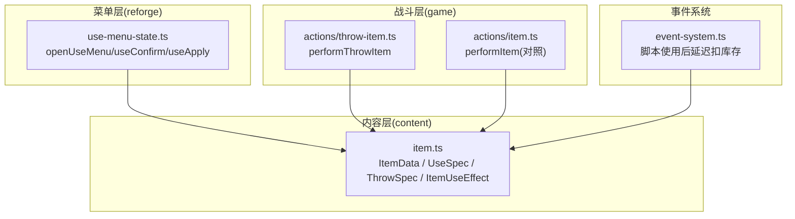
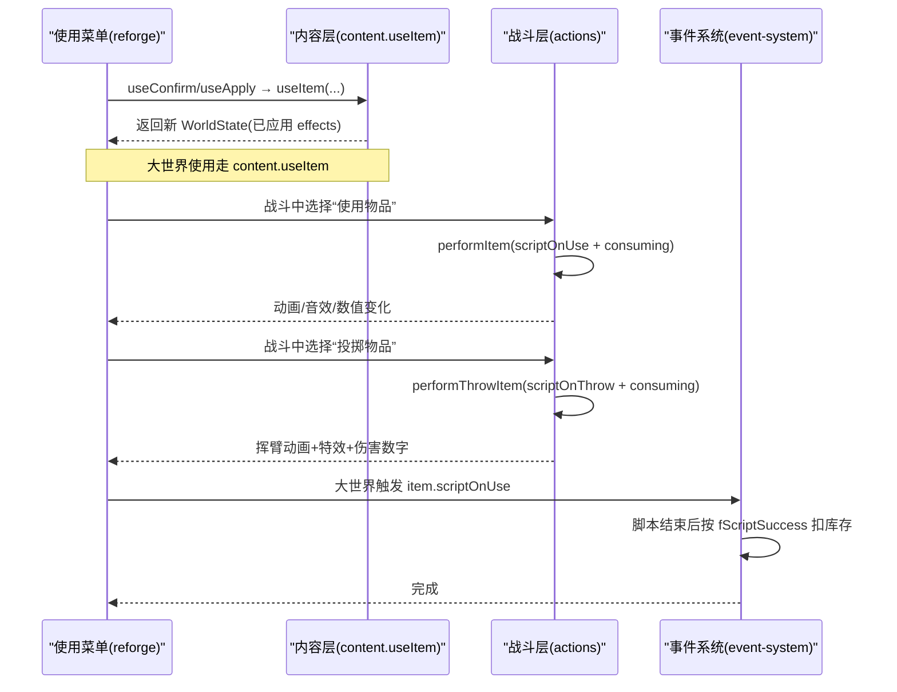
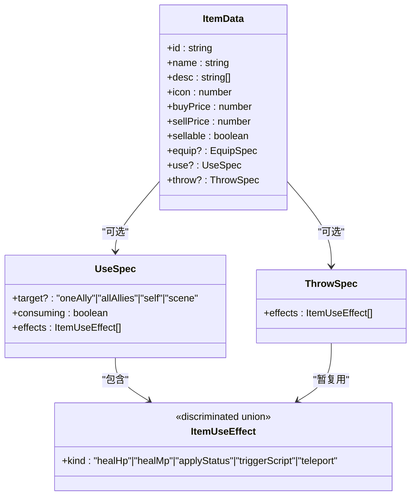
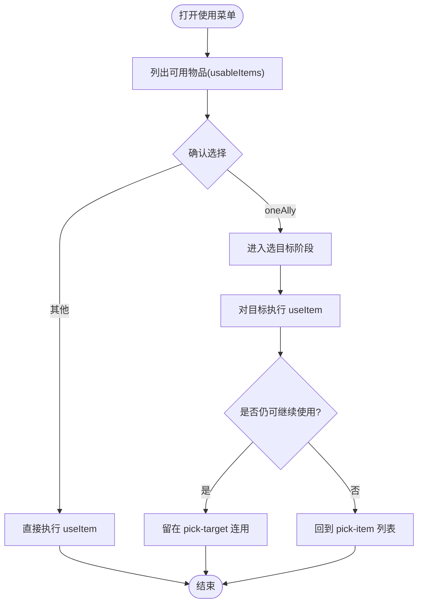
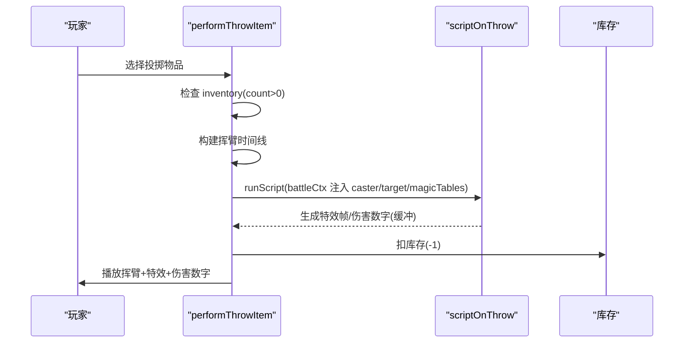
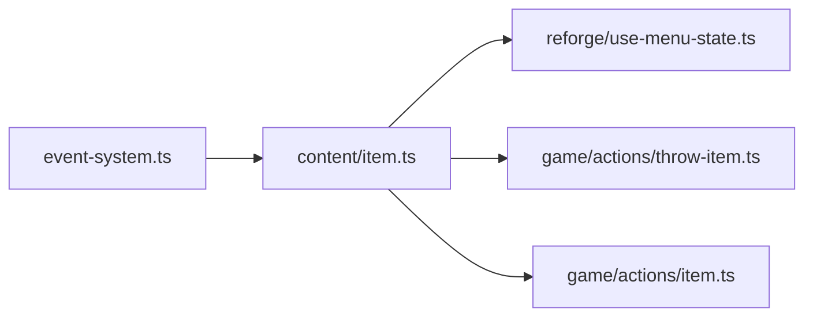

# 使用与投掷规格预留

<cite>
**本文引用的文件**   
- [packages/content/src/item.ts](file://packages/content/src/item.ts)
- [docs/phase2/foundation/item-data-design.md](file://docs/phase2/foundation/item-data-design.md)
- [docs/phase2/foundation/skill-data-plan.md](file://docs/phase2/foundation/skill-data-plan.md)
- [packages/reforge/src/use-menu-state.ts](file://packages/reforge/src/use-menu-state.ts)
- [packages/game/src/core/battle/actions/throw-item.ts](file://packages/game/src/core/battle/actions/throw-item.ts)
- [packages/game/src/core/battle/__tests__/battle-system.test.ts](file://packages/game/src/core/battle/__tests__/battle-system.test.ts)
- [packages/game/src/core/battle/actions/item.ts](file://packages/game/src/core/battle/actions/item.ts)
- [packages/game/src/core/event-system.ts](file://packages/game/src/core/event-system.ts)
</cite>

## 目录
1. [引言](#引言)
2. [项目结构](#项目结构)
3. [核心组件](#核心组件)
4. [架构总览](#架构总览)
5. [详细组件分析](#详细组件分析)
6. [依赖关系分析](#依赖关系分析)
7. [性能考量](#性能考量)
8. [故障排查指南](#故障排查指南)
9. [结论](#结论)
10. [附录](#附录)

## 引言
本文件围绕“使用与投掷规格预留”展开，聚焦以下目标：
- 深入解释 UseSpec 接口设计：目标选择（oneAlly/allAllies/self/scene）、消耗机制、效果数组。
- 详细说明 ItemUseEffect 独立联合类型的设计理念，并解释为何不等同于 SkillEffect。
- 阐述 throw? 能力块的预留设计，为 phase3 战斗投掷功能做准备。
- 提供使用效果的分类与示例（回复类、场景类、剧情类等）。
- 说明未来扩展的兼容性与向后兼容策略。
- 明确与技能系统的解耦设计原则。

## 项目结构
本次文档涉及的关键位置：
- 内容层（content）：定义物品数据模型与使用/投掷能力块（ItemData、UseSpec、ThrowSpec、ItemUseEffect）。
- 菜单层（reforge）：使用菜单状态机，驱动 pick-item → pick-target 流程，调用 content.useItem。
- 战斗层（game）：投掷动作执行器 performThrowItem，以及战斗内物品使用 performItem 的行为对照。
- 事件系统（event-system）：大世界脚本化使用物品的消费时机控制。

图表来源
- [packages/content/src/item.ts:41-50](file://packages/content/src/item.ts#L41-L50)
- [packages/reforge/src/use-menu-state.ts:62-99](file://packages/reforge/src/use-menu-state.ts#L62-L99)
- [packages/game/src/core/battle/actions/throw-item.ts:70-139](file://packages/game/src/core/battle/actions/throw-item.ts#L70-L139)
- [packages/game/src/core/battle/actions/item.ts:69-119](file://packages/game/src/core/battle/actions/item.ts#L69-L119)
- [packages/game/src/core/event-system.ts:3312-3348](file://packages/game/src/core/event-system.ts#L3312-L3348)

章节来源
- [packages/content/src/item.ts:41-50](file://packages/content/src/item.ts#L41-L50)
- [docs/phase2/foundation/item-data-design.md:98-115](file://docs/phase2/foundation/item-data-design.md#L98-L115)

## 核心组件
- UseSpec：描述物品“使用”能力的元数据，包含可选目标范围、是否消耗、以及 effects 数组。
- ItemUseEffect：独立的判别联合，表达“使用”可产生的效果；当前实现 healHp/healMp，其余 kind 留桩。
- ThrowSpec：为“战斗投掷”预留的能力块，effects 字段暂复用 ItemUseEffect，后续可能独立联合。
- ItemData：在基类上叠加 equip/use/throw 三个可选能力块，支持“一物多能”（如灵珠既可用又可装）。

要点
- UseSpec.target 支持 oneAlly/allAllies/self/scene，用于决定是否需要选目标或作用于场景。
- UseSpec.consuming 控制使用后是否从背包扣除数量。
- ItemUseEffect 是独立联合，不完全等同 SkillEffect，以容纳大量非战斗向的效果（脚本/剧情/场景等）。
- ThrowSpec 目前仅占位，phase3 将细化其 effects 语义并与战斗引擎深度集成。

章节来源
- [packages/content/src/item.ts:32-50](file://packages/content/src/item.ts#L32-L50)
- [docs/phase2/foundation/item-data-design.md:98-115](file://docs/phase2/foundation/item-data-design.md#L98-L115)

## 架构总览
使用与投掷的整体交互路径如下：
- 大世界使用：菜单层 openUseMenu/useConfirm/useApply 驱动，最终调用 content.useItem 更新世界状态。
- 战斗内使用：performItem 执行 scriptOnUse 并处理 consuming。
- 战斗内投掷：performThrowItem 执行 scriptOnThrow，并在脚本后按规则扣库存。
- 大世界脚本使用：event-system 在脚本结束后根据成功标志决定是否扣库存。

图表来源
- [packages/reforge/src/use-menu-state.ts:62-99](file://packages/reforge/src/use-menu-state.ts#L62-L99)
- [packages/game/src/core/battle/actions/item.ts:69-119](file://packages/game/src/core/battle/actions/item.ts#L69-L119)
- [packages/game/src/core/battle/actions/throw-item.ts:70-139](file://packages/game/src/core/battle/actions/throw-item.ts#L70-L139)
- [packages/game/src/core/event-system.ts:3312-3348](file://packages/game/src/core/event-system.ts#L3312-L3348)

## 详细组件分析

### UseSpec 与 ItemUseEffect 设计
- UseSpec.target
  - oneAlly：单体友方，需要进入 pick-target 阶段。
  - allAllies：全体友方，无需选目标。
  - self：自身，无需选目标。
  - scene：对场景生效（如风灵珠场景互动），无需选目标。
- UseSpec.consuming
  - true：使用后从背包扣减（若该物品同时在背包中）。
  - false：不扣库存（例如穿戴中的灵珠被使用）。
- ItemUseEffect
  - 当前实现：healHp/healMp（夹上限），applyStatus/triggerScript/teleport 留桩。
  - 设计理念：独立联合，不等同于 SkillEffect，因为物品使用大量涉及脚本/剧情/场景类效果，且存在物品独有语义（永久属性提升、授技、场景放置、变身等）。

图表来源
- [packages/content/src/item.ts:32-50](file://packages/content/src/item.ts#L32-L50)

章节来源
- [packages/content/src/item.ts:32-50](file://packages/content/src/item.ts#L32-L50)
- [docs/phase2/foundation/item-data-design.md:98-115](file://docs/phase2/foundation/item-data-design.md#L98-L115)

### 使用菜单流程（pick-item → pick-target → apply）
- openUseMenu：计算 usableItems（背包中有 use 能力块 + 穿戴中但可用的灵珠）。
- useConfirm：
  - 若 target=oneAlly → 进入 pick-target。
  - 否则（脚本/全体/场景）→ 直接执行 useItem，返回新 world。
- useApply：
  - 对选定目标执行 useItem。
  - 若该物品仍可用（count>0）→ 保持 pick-target 以便连用；否则回到 pick-item。

图表来源
- [packages/reforge/src/use-menu-state.ts:27-99](file://packages/reforge/src/use-menu-state.ts#L27-L99)

章节来源
- [packages/reforge/src/use-menu-state.ts:27-99](file://packages/reforge/src/use-menu-state.ts#L27-L99)

### 战斗投掷（throw? 能力块预留）
- ThrowSpec 目前仅占位，effects 字段复用 ItemUseEffect，后续可能独立联合。
- 战斗投掷执行器 performThrowItem：
  - 校验物品与库存（队员投需 count>0）。
  - 播放挥臂前摇动画（若有角色 posOriginal）。
  - 运行 scriptOnThrow（注入 battleCtx：caster/target/magicTables 等）。
  - 脚本结束后扣库存（遵循 sdlpal 行为：脚本之后 PAL_AddItemToInventory(-1)）。
  - 将 OffMagic 特效帧与伤害数字延迟到动画末统一播放。

图表来源
- [packages/game/src/core/battle/actions/throw-item.ts:70-139](file://packages/game/src/core/battle/actions/throw-item.ts#L70-L139)

章节来源
- [packages/game/src/core/battle/actions/throw-item.ts:70-139](file://packages/game/src/core/battle/actions/throw-item.ts#L70-L139)
- [packages/game/src/core/battle/__tests__/battle-system.test.ts:2884-2952](file://packages/game/src/core/battle/__tests__/battle-system.test.ts#L2884-L2952)

### 与技能系统的解耦原则
- ItemUseEffect 独立于 SkillEffect：
  - 概念重叠部分（healHp/healMp/applyStatus 等）仅在语义层面相似，但 ItemUseEffect 还包含大量非战斗向效果（脚本/剧情/场景/授技/变身等）。
  - SkillEffect 更贴近战斗引擎的 opcode 链重写，强调战斗内的伤害、状态、召唤、变身等。
- 数据层隔离：
  - 技能数据（SkillData/effects[]）与物品数据（ItemData/use?/throw?）各自维护，避免耦合。
  - 通过稳定 id 与 Record 映射，避免下标式身份与硬编码偏移。

章节来源
- [docs/phase2/foundation/skill-data-plan.md:94-132](file://docs/phase2/foundation/skill-data-plan.md#L94-L132)
- [docs/phase2/foundation/item-data-design.md:108-115](file://docs/phase2/foundation/item-data-design.md#L108-L115)

## 依赖关系分析
- 内容层（item.ts）提供 UseSpec/ThrowSpec/ItemUseEffect 与 useItem/equippableItems/usableItems 等纯函数。
- 菜单层（use-menu-state.ts）依赖 content 的 usableItems/useItem 进行状态机推进。
- 战斗层（throw-item.ts、item.ts）依赖 content 的 ItemData 结构与脚本执行上下文。
- 事件系统（event-system.ts）在大世界脚本使用后，依据 fScriptSuccess 延迟扣库存，确保与原行为一致。

图表来源
- [packages/content/src/item.ts:162-226](file://packages/content/src/item.ts#L162-L226)
- [packages/reforge/src/use-menu-state.ts:8-14](file://packages/reforge/src/use-menu-state.ts#L8-L14)
- [packages/game/src/core/battle/actions/throw-item.ts:17-26](file://packages/game/src/core/battle/actions/throw-item.ts#L17-L26)
- [packages/game/src/core/battle/actions/item.ts:69-119](file://packages/game/src/core/battle/actions/item.ts#L69-L119)
- [packages/game/src/core/event-system.ts:3312-3348](file://packages/game/src/core/event-system.ts#L3312-L3348)

章节来源
- [packages/content/src/item.ts:162-226](file://packages/content/src/item.ts#L162-L226)
- [packages/reforge/src/use-menu-state.ts:8-14](file://packages/reforge/src/use-menu-state.ts#L8-L14)
- [packages/game/src/core/battle/actions/throw-item.ts:17-26](file://packages/game/src/core/battle/actions/throw-item.ts#L17-L26)
- [packages/game/src/core/battle/actions/item.ts:69-119](file://packages/game/src/core/battle/actions/item.ts#L69-L119)
- [packages/game/src/core/event-system.ts:3312-3348](file://packages/game/src/core/event-system.ts#L3312-L3348)

## 性能考量
- 使用菜单的 usableItems 会遍历 inventory 与装备槽，建议缓存结果或在列表不变时复用。
- useItem 采用不可变更新，注意对象浅拷贝开销；批量使用时可合并变更再提交。
- 战斗投掷的动画与脚本执行分离，避免阻塞主循环；特效帧与伤害数字延迟渲染，减少每帧压力。

[本节为通用指导，不涉及具体文件分析]

## 故障排查指南
- 使用无效（无 use 能力块/不在背包/未知角色）：useItem 原样返回，不会报错。
- 投掷失败（inventory 无该物品或 count=0）：performThrowItem 打印警告并早退，不扣库存。
- 大世界脚本使用后未扣库存：检查 event-system 的 pendingItemConsume 与 fScriptSuccess 逻辑，确保脚本结束时正确触发 consumePendingItem。

章节来源
- [packages/content/src/item.ts:180-226](file://packages/content/src/item.ts#L180-L226)
- [packages/game/src/core/battle/actions/throw-item.ts:70-84](file://packages/game/src/core/battle/actions/throw-item.ts#L70-L84)
- [packages/game/src/core/event-system.ts:3312-3348](file://packages/game/src/core/event-system.ts#L3312-L3348)

## 结论
- UseSpec 与 ItemUseEffect 的设计清晰区分了“使用”与“技能”的语义边界，为后续扩展（授技、场景放置、变身等）留出空间。
- ThrowSpec 作为 phase3 战斗投掷的预留能力块，已在运行时层面打通脚本执行与动画管线，并为后续 effects 独立联合奠定基础。
- 通过稳定 id、Record 映射与能力块拆分，实现了良好的可扩展性与向后兼容性。

[本节为总结性内容，不涉及具体文件分析]

## 附录

### 使用效果分类与示例
- 回复类：healHp/healMp（当前已实现，夹上限）。
- 状态类：applyStatus（留桩，待接入状态系统）。
- 剧情/场景类：triggerScript（桂花酒/玉佩剧情；风灵珠场景互动）、teleport（引路蜂回迷宫口）。
- 未来扩充：giveItems/giveMoney/learnSkill/scenePlace/transform/permanentStatBoost 等（使用菜单时逐步落地）。

章节来源
- [packages/content/src/item.ts:32-40](file://packages/content/src/item.ts#L32-L40)
- [docs/phase2/foundation/item-data-design.md:108-115](file://docs/phase2/foundation/item-data-design.md#L108-L115)

### 向后兼容策略
- 新增 ItemUseEffect.kind 时，useItem 的 switch 分支应显式留桩并注释归宿，避免静默吞掉未知效果。
- 战斗投掷在无动画或旧 fixture 情况下退化即时播放，保证向后兼容。
- 大世界脚本使用后延迟扣库存，严格对齐 sdlpal 行为（脚本成功后才扣）。

章节来源
- [packages/content/src/item.ts:194-226](file://packages/content/src/item.ts#L194-L226)
- [packages/game/src/core/battle/actions/throw-item.ts:86-93](file://packages/game/src/core/battle/actions/throw-item.ts#L86-L93)
- [packages/game/src/core/event-system.ts:3312-3348](file://packages/game/src/core/event-system.ts#L3312-L3348)