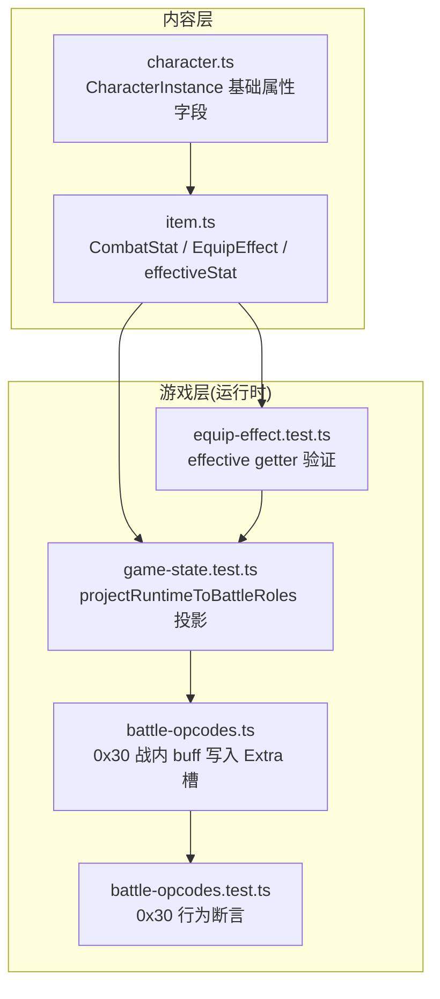
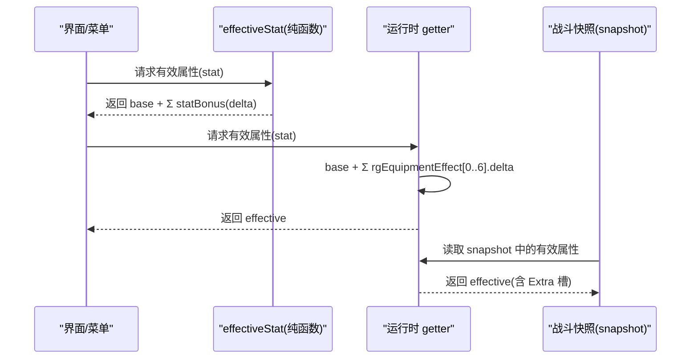
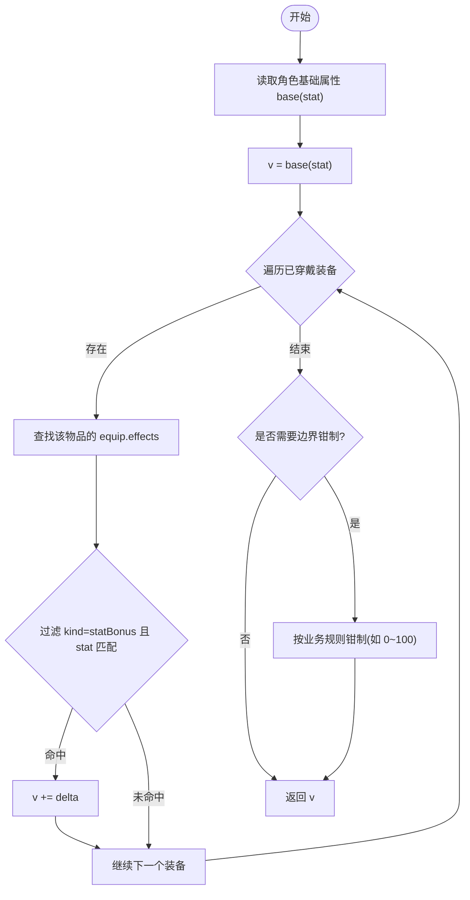
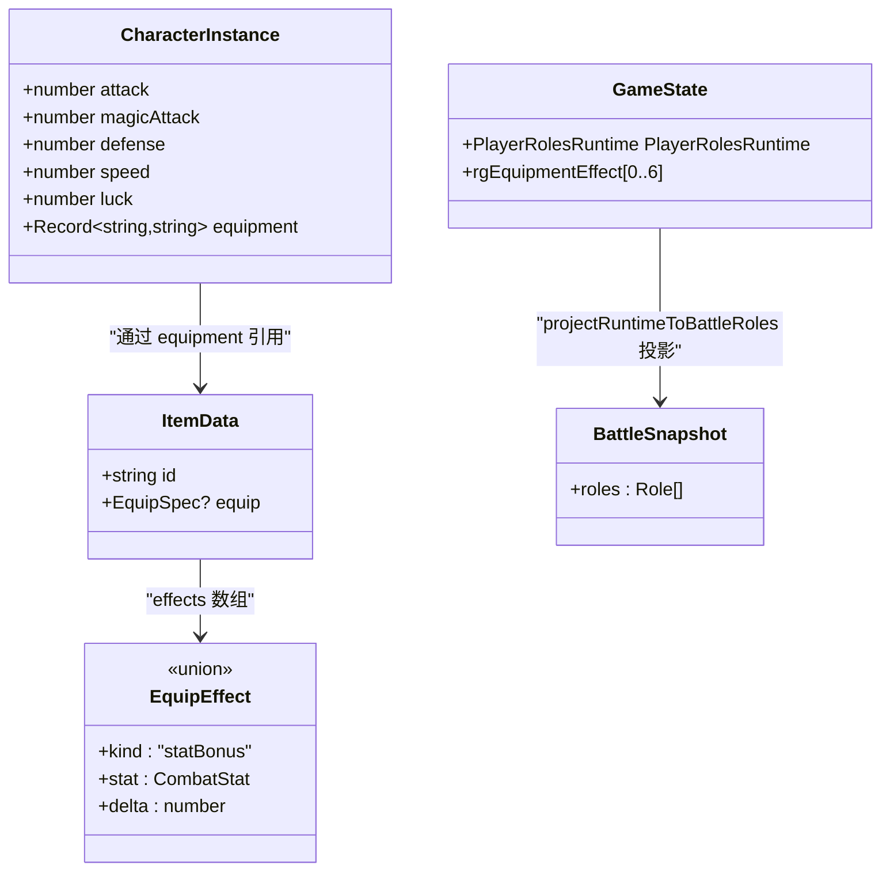
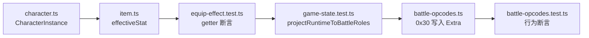

# 有效属性计算机制

<cite>
**本文引用的文件列表**
- [packages/content/src/item.ts](file://packages/content/src/item.ts)
- [packages/content/src/character.ts](file://packages/content/src/character.ts)
- [packages/game/src/core/equip-effect.test.ts](file://packages/game/src/core/equip-effect.test.ts)
- [packages/game/src/core/game-state.test.ts](file://packages/game/src/core/game-state.test.ts)
- [packages/game/src/core/battle/battle-opcodes.ts](file://packages/game/src/core/battle/battle-opcodes.ts)
- [packages/game/src/core/battle/__tests__/battle-opcodes.test.ts](file://packages/game/src/core/battle/__tests__/battle-opcodes.test.ts)
</cite>

## 目录
1. [引言](#引言)
2. [项目结构](#项目结构)
3. [核心组件](#核心组件)
4. [架构总览](#架构总览)
5. [详细组件分析](#详细组件分析)
6. [依赖关系分析](#依赖关系分析)
7. [性能考虑](#性能考虑)
8. [故障排查指南](#故障排查指南)
9. [结论](#结论)
10. [附录](#附录)

## 引言
本文件聚焦“有效属性计算机制”，围绕纯函数设计、基础属性与已穿戴装备 statBonus 的叠加逻辑展开，给出 CombatStat 类型定义与核心属性集合（attack/magicAttack/defense/speed/luck），并解释负值属性的处理边界。文档同时提供性能优化策略（缓存与增量更新）、数学模型与边界条件说明，以及可测试性设计与单元测试示例路径，帮助读者快速理解与扩展该子系统。

## 项目结构
与有效属性计算直接相关的代码位于 content 层（数据与纯函数）与 game 层（运行时 getter 与战斗投影）。内容层负责定义数据类型与纯函数；游戏层在运行时通过 getter 将 base 与装备 effect 合并为 effective 值，并在战斗中读取 snapshot。

图表来源
- [packages/content/src/item.ts:6-90](file://packages/content/src/item.ts#L6-L90)
- [packages/content/src/character.ts:36-53](file://packages/content/src/character.ts#L36-L53)
- [packages/game/src/core/equip-effect.test.ts:153-172](file://packages/game/src/core/equip-effect.test.ts#L153-L172)
- [packages/game/src/core/game-state.test.ts:588-609](file://packages/game/src/core/game-state.test.ts#L588-L609)
- [packages/game/src/core/battle/battle-opcodes.ts:803-825](file://packages/game/src/core/battle/battle-opcodes.ts#L803-L825)
- [packages/game/src/core/battle/__tests__/battle-opcodes.test.ts:1381-1444](file://packages/game/src/core/battle/__tests__/battle-opcodes.test.ts#L1381-L1444)

章节来源
- [packages/content/src/item.ts:6-90](file://packages/content/src/item.ts#L6-L90)
- [packages/content/src/character.ts:36-53](file://packages/content/src/character.ts#L36-L53)

## 核心组件
- CombatStat 类型：限定五种战斗属性键名，用于统一访问与叠加。
- CharacterInstance：角色实例的基础属性字段，包含 attack/magicAttack/defense/speed/luck 等。
- EquipEffect.statBonus：装备效果的一种，表示对某 CombatStat 的 delta 增减（可为负）。
- effectiveStat 纯函数：计算“角色基础 + 已穿戴装备对该 stat 的 Σ delta”。

关键要点
- 纯函数：不修改输入对象，仅基于 char.equipment 与 items 表进行只读遍历求和。
- 支持负值：statBonus.delta 可为负数，允许出现防御降低等特殊情况（如铁锁衣防御 -10）。
- 可扩展：新增 CombatStat 或 statBonus 时，只需在类型与遍历中保持一致即可。

章节来源
- [packages/content/src/item.ts:6-90](file://packages/content/src/item.ts#L6-L90)
- [packages/content/src/character.ts:36-53](file://packages/content/src/character.ts#L36-L53)

## 架构总览
有效属性计算由两层协作完成：
- 内容层（纯函数）：effectiveStat(char, stat, items) 返回当前角色的有效属性。
- 游戏层（运行时）：getter 将 PlayerRolesRuntime.base 与 rgEquipmentEffect[0..6] 各槽位叠加，得到 effective；战斗快照 snapshot 经 getter recompute 后供战斗系统读取。

图表来源
- [packages/content/src/item.ts:69-90](file://packages/content/src/item.ts#L69-L90)
- [packages/game/src/core/equip-effect.test.ts:153-172](file://packages/game/src/core/equip-effect.test.ts#L153-L172)
- [packages/game/src/core/game-state.test.ts:588-609](file://packages/game/src/core/game-state.test.ts#L588-L609)
- [packages/game/src/core/battle/battle-opcodes.ts:803-825](file://packages/game/src/core/battle/battle-opcodes.ts#L803-L825)

## 详细组件分析

### 类型与数据结构
- CombatStat：'attack' | 'magicAttack' | 'defense' | 'speed' | 'luck'
- CharacterInstance 基础属性：attack、magicAttack、defense、speed、luck
- EquipEffect.statBonus：{ kind: 'statBonus', stat: CombatStat, delta: number }

这些类型确保属性计算在编译期即具备强约束，避免字符串拼写错误导致的运行时异常。

章节来源
- [packages/content/src/item.ts:6-15](file://packages/content/src/item.ts#L6-L15)
- [packages/content/src/character.ts:36-53](file://packages/content/src/character.ts#L36-L53)

### 有效属性计算公式与数学模型
- 公式：effective(stat) = base(stat) + Σ_{i∈equipment} delta_i(stat)
- 其中 delta_i 来自物品 i 的 equip.effects 中所有 kind='statBonus' 且 stat 匹配的项。
- 负值处理：delta 可为负，例如防御 -10 的装备会减少最终防御值。
- 边界条件：
  - 无装备：effective = base
  - 多件装备：按 slot 顺序累加所有匹配 stat 的 delta
  - 未配置 item 或 effects：跳过空引用，不影响结果

图表来源
- [packages/content/src/item.ts:69-90](file://packages/content/src/item.ts#L69-L90)

章节来源
- [packages/content/src/item.ts:69-90](file://packages/content/src/item.ts#L69-L90)

### 运行时 getter 与战斗快照
- 运行时 getter：effective = base + Σ rgEquipmentEffect[part][slot].delta，涵盖 part 0..6（含 Extra 槽）。
- 战斗快照：snapshot.roles 中的属性由 getter recompute 生成，保证战斗流程读取的是最新 effective。
- 0x30 指令（战内 buff）：将百分比增益写入 Extra 槽（part=6），base 不变，多次调用覆盖而非叠加；战后清理 Extra 槽。

图表来源
- [packages/content/src/character.ts:36-53](file://packages/content/src/character.ts#L36-L53)
- [packages/content/src/item.ts:13-30](file://packages/content/src/item.ts#L13-L30)
- [packages/game/src/core/game-state.test.ts:588-609](file://packages/game/src/core/game-state.test.ts#L588-L609)
- [packages/game/src/core/battle/battle-opcodes.ts:803-825](file://packages/game/src/core/battle/battle-opcodes.ts#L803-L825)

章节来源
- [packages/game/src/core/equip-effect.test.ts:153-172](file://packages/game/src/core/equip-effect.test.ts#L153-L172)
- [packages/game/src/core/game-state.test.ts:588-609](file://packages/game/src/core/game-state.test.ts#L588-L609)
- [packages/game/src/core/battle/battle-opcodes.ts:803-825](file://packages/game/src/core/battle/battle-opcodes.ts#L803-L825)
- [packages/game/src/core/battle/__tests__/battle-opcodes.test.ts:1381-1444](file://packages/game/src/core/battle/__tests__/battle-opcodes.test.ts#L1381-L1444)

### 负值属性处理与边界条件
- 负值支持：statBonus.delta 可为负，允许防御降低等场景（如铁锁衣防御 -10）。
- 边界钳制：某些属性（如抗性）在运行时可能需钳制到合理范围（例如 0~100），具体以运行时 getter 为准。
- 零值与极小值：当 base 为 0 或全部 delta 为负导致结果为 0 或负数时，是否钳制取决于业务规则（例如伤害最小值为 1 的规则在其他模块体现）。

章节来源
- [packages/content/src/item.ts:13-15](file://packages/content/src/item.ts#L13-L15)
- [packages/game/src/core/game-state.test.ts:588-609](file://packages/game/src/core/game-state.test.ts#L588-L609)

### 可测试性设计与单元测试示例
- 纯函数可测性：effectiveStat 不依赖全局状态，可直接传入 char/items 断言结果。
- 运行时 getter 可测性：通过构造 GameState 与 rgEquipmentEffect，断言 effective 值。
- 0x30 指令可测性：断言 Extra 槽写入、base 不变、snapshot 重算生效、多次调用不叠加。

建议用例
- 基础叠加：weapon(+2 攻击) + body(+3 防御) → effective 正确叠加
- 负值叠加：body(-10 防御) → effective 防御下降
- 多槽叠加：hand(+15 攻击) + extra(+30 攻击) → effective 合计
- 边界钳制：poisonResistance 超过上限 → 钳制到最大值
- 0x30 行为：+100% 攻击 → Extra=base*100/100，effective=base+Extra，再次调用覆盖

章节来源
- [packages/game/src/core/equip-effect.test.ts:153-172](file://packages/game/src/core/equip-effect.test.ts#L153-L172)
- [packages/game/src/core/game-state.test.ts:588-609](file://packages/game/src/core/game-state.test.ts#L588-L609)
- [packages/game/src/core/battle/__tests__/battle-opcodes.test.ts:1381-1444](file://packages/game/src/core/battle/__tests__/battle-opcodes.test.ts#L1381-L1444)

## 依赖关系分析
- 内容层依赖：item.ts 依赖 character.ts 的 CharacterInstance 字段以读取 base 属性。
- 运行时依赖：game-state.test.ts 与 battle-opcodes.ts 共同维护 effective 的计算与快照一致性。
- 战斗系统依赖：battle-opcodes.test.ts 验证 0x30 指令对 Extra 槽的影响及 snapshot 的即时生效。

图表来源
- [packages/content/src/character.ts:36-53](file://packages/content/src/character.ts#L36-L53)
- [packages/content/src/item.ts:69-90](file://packages/content/src/item.ts#L69-L90)
- [packages/game/src/core/equip-effect.test.ts:153-172](file://packages/game/src/core/equip-effect.test.ts#L153-L172)
- [packages/game/src/core/game-state.test.ts:588-609](file://packages/game/src/core/game-state.test.ts#L588-L609)
- [packages/game/src/core/battle/battle-opcodes.ts:803-825](file://packages/game/src/core/battle/battle-opcodes.ts#L803-L825)
- [packages/game/src/core/battle/__tests__/battle-opcodes.test.ts:1381-1444](file://packages/game/src/core/battle/__tests__/battle-opcodes.test.ts#L1381-L1444)

章节来源
- [packages/content/src/item.ts:69-90](file://packages/content/src/item.ts#L69-L90)
- [packages/game/src/core/equip-effect.test.ts:153-172](file://packages/game/src/core/equip-effect.test.ts#L153-L172)
- [packages/game/src/core/game-state.test.ts:588-609](file://packages/game/src/core/game-state.test.ts#L588-L609)
- [packages/game/src/core/battle/battle-opcodes.ts:803-825](file://packages/game/src/core/battle/battle-opcodes.ts#L803-L825)
- [packages/game/src/core/battle/__tests__/battle-opcodes.test.ts:1381-1444](file://packages/game/src/core/battle/__tests__/battle-opcodes.test.ts#L1381-L1444)

## 性能考虑
- 纯函数计算复杂度：O(E)，E 为已穿戴装备数量；每次调用遍历装备与 effects。
- 缓存策略：
  - 界面/菜单层可对 effectiveStat 结果做短期缓存（key=charId+stat），在换装事件触发时失效。
  - 运行时 getter 可在 snapshot 上缓存 effective，仅在 rgEquipmentEffect 变化时重算。
- 增量更新：
  - 当单个装备的 effects 变更时，仅重新计算受影响的 stat，避免全量重算。
  - 0x30 指令仅写入 Extra 槽，getter 在读取时增量合并，无需回写 base。
- 内存与分配：
  - 避免在高频路径创建中间对象；使用局部变量累积 delta。
  - 批量更新时合并多次 0x30 调用，减少 snapshot 重算次数。

[本节为通用性能指导，不直接分析具体文件]

## 故障排查指南
- 症状：有效属性未按预期叠加
  - 检查装备 effects 是否为 statBonus 且 stat 匹配
  - 确认 char.equipment 映射是否正确（slot→itemId）
  - 查看 items 表中对应 itemId 是否存在 equip.effects
- 症状：负值属性导致异常
  - 确认业务规则是否需要对结果钳制（如抗性范围）
  - 检查运行时 getter 的 clamp 逻辑
- 症状：0x30 指令多次调用叠加
  - 确认 0x30 写入的是 Extra 槽，应为覆盖而非累加
  - 检查 snapshot 是否在写入后 recompute

章节来源
- [packages/game/src/core/equip-effect.test.ts:153-172](file://packages/game/src/core/equip-effect.test.ts#L153-L172)
- [packages/game/src/core/game-state.test.ts:588-609](file://packages/game/src/core/game-state.test.ts#L588-L609)
- [packages/game/src/core/battle/__tests__/battle-opcodes.test.ts:1381-1444](file://packages/game/src/core/battle/__tests__/battle-opcodes.test.ts#L1381-L1444)

## 结论
有效属性计算采用纯函数与运行时 getter 双层设计，既保证了可测试性与可预测性，又兼顾了战斗系统的实时性需求。CombatStat 与 statBonus 的类型化设计使叠加逻辑清晰可控，负值属性与边界钳制提供了灵活的业务表达空间。通过缓存与增量更新策略，可在大规模装备组合下保持良好性能。

[本节为总结性内容，不直接分析具体文件]

## 附录
- 术语
  - base：角色基础属性（来自 CharacterInstance）
  - statBonus：装备对某 CombatStat 的增减量（可为负）
  - effective：base + Σ statBonus 的最终属性值
  - Extra 槽：part=6 的特殊装备效果槽，用于战内 buff
- 参考实现路径
  - 纯函数：[packages/content/src/item.ts:69-90](file://packages/content/src/item.ts#L69-L90)
  - 运行时 getter 验证：[packages/game/src/core/equip-effect.test.ts:153-172](file://packages/game/src/core/equip-effect.test.ts#L153-L172)
  - 投影与快照：[packages/game/src/core/game-state.test.ts:588-609](file://packages/game/src/core/game-state.test.ts#L588-L609)
  - 0x30 指令行为：[packages/game/src/core/battle/battle-opcodes.ts:803-825](file://packages/game/src/core/battle/battle-opcodes.ts#L803-L825)、[packages/game/src/core/battle/__tests__/battle-opcodes.test.ts:1381-1444](file://packages/game/src/core/battle/__tests__/battle-opcodes.test.ts#L1381-L1444)