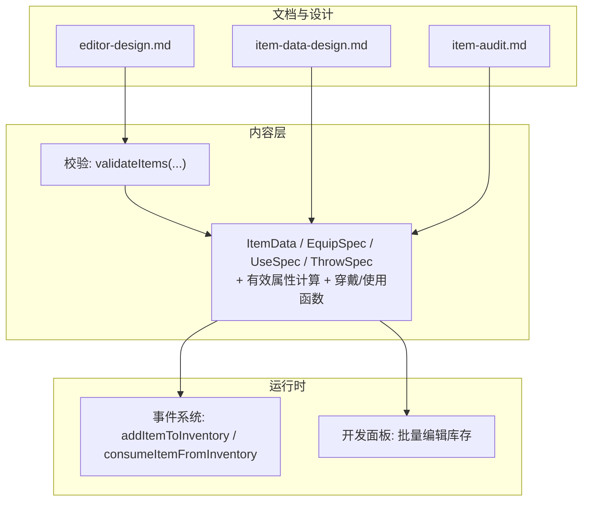
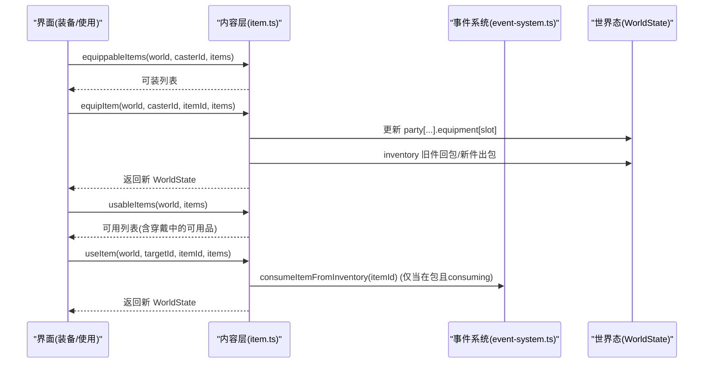
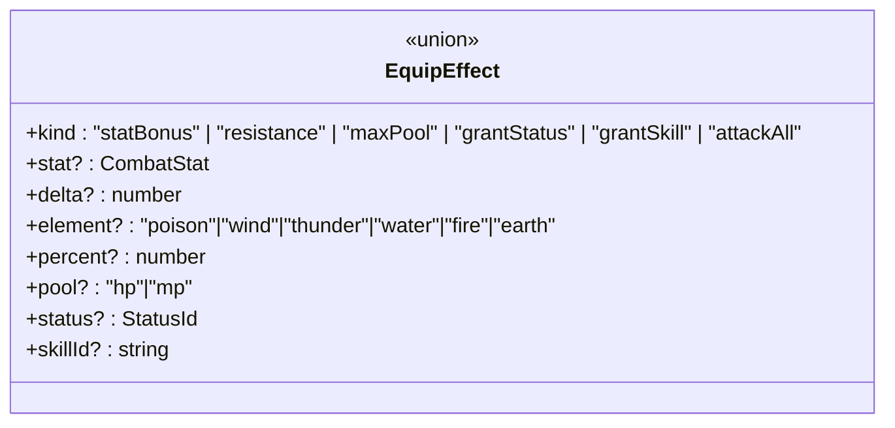
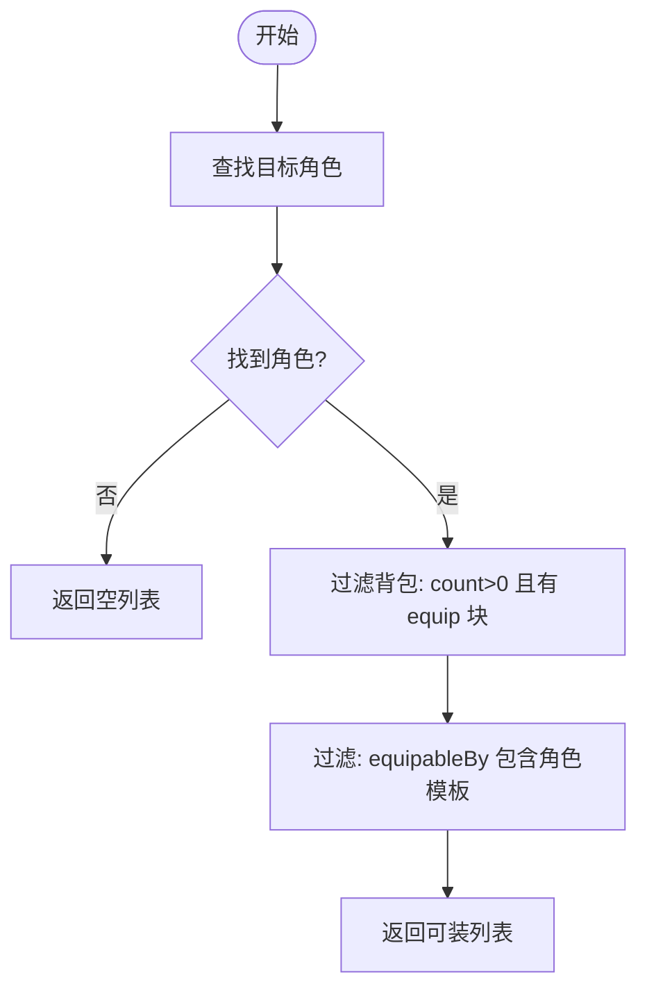
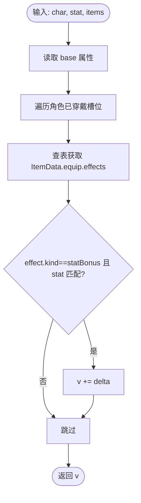
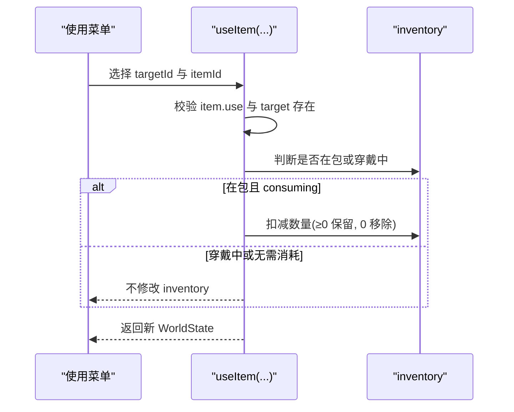
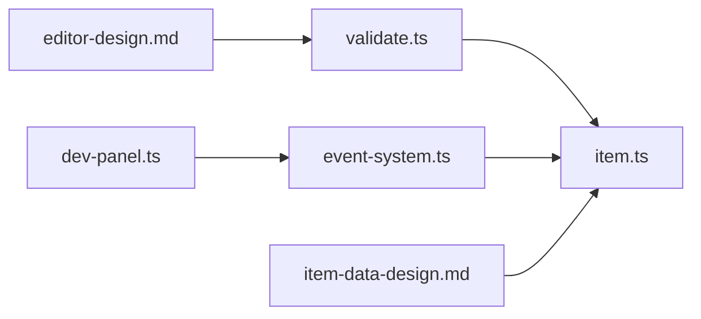

# 物品装备数据架构

<cite>
**本文引用的文件**
- [packages/content/src/item.ts](file://packages/content/src/item.ts)
- [packages/content/src/item.test.ts](file://packages/content/src/item.test.ts)
- [docs/phase2/foundation/item-data-design.md](file://docs/phase2/foundation/item-data-design.md)
- [docs/phase1/plans/2026-06-02-item-audit.md](file://docs/phase1/plans/2026-06-02-item-audit.md)
- [packages/game/src/core/event-system.ts](file://packages/game/src/core/event-system.ts)
- [packages/game/src/dev/dev-panel.ts](file://packages/game/src/dev/dev-panel.ts)
- [packages/content/src/validate.ts](file://packages/content/src/validate.ts)
- [docs/phase2/editor/editor-design.md](file://docs/phase2/editor/editor-design.md)
</cite>

## 目录
1. [引言](#引言)
2. [项目结构](#项目结构)
3. [核心组件](#核心组件)
4. [架构总览](#架构总览)
5. [详细组件分析](#详细组件分析)
6. [依赖关系分析](#依赖关系分析)
7. [性能考量](#性能考量)
8. [故障排查指南](#故障排查指南)
9. [结论](#结论)
10. [附录](#附录)

## 引言
本文件系统化阐述“物品/装备”数据架构，围绕一物多能力块（equip/use/throw）的统一建模、EquipEffect 联合类型系统、6 槽位装备体系、有效属性计算机制、使用系统与工具链展开。目标是让读者在不深入代码的前提下也能理解设计动机、数据结构与运行流程，并为后续扩展（使用菜单细化、战斗投掷、商店等）提供清晰边界。

## 项目结构
- 内容层（content）：定义 ItemData 基类与 equip/use/throw 能力块、6 槽位、EquipEffect 联合类型、有效属性计算、背包与穿戴操作函数。
- 运行时（game）：事件系统提供库存增减与消耗；开发面板提供批量增删改库存的调试入口。
- 文档与设计：item-data-design.md 给出设计原则、槽位对齐、demo 数据与边界说明；item-audit.md 记录原版行为与 opcode 映射真值。
- 校验与编辑器：validate.ts 做基础形状校验；editor-design.md 强调引用完整性校验的重要性。

图表来源
- [packages/content/src/item.ts:1-227](file://packages/content/src/item.ts#L1-L227)
- [packages/content/src/validate.ts:63-71](file://packages/content/src/validate.ts#L63-L71)
- [packages/game/src/core/event-system.ts:3255-3283](file://packages/game/src/core/event-system.ts#L3255-L3283)
- [packages/game/src/dev/dev-panel.ts:1597-1627](file://packages/game/src/dev/dev-panel.ts#L1597-L1627)
- [docs/phase2/foundation/item-data-design.md:1-147](file://docs/phase2/foundation/item-data-design.md#L1-L147)
- [docs/phase1/plans/2026-06-02-item-audit.md:81-132](file://docs/phase1/plans/2026-06-02-item-audit.md#L81-L132)
- [docs/phase2/editor/editor-design.md:79-89](file://docs/phase2/editor/editor-design.md#L79-L89)

章节来源
- [packages/content/src/item.ts:1-227](file://packages/content/src/item.ts#L1-L227)
- [docs/phase2/foundation/item-data-design.md:1-147](file://docs/phase2/foundation/item-data-design.md#L1-L147)

## 核心组件
- 一物多能力块：ItemData 可选字段 equip?、use?、throw? 分别驱动【装备】【使用】【投掷】三类菜单与行为，灵珠等双重身份零特判。
- 6 槽位：weapon/head/body/cloak/feet/accessory，显式写入 ItemData.equip.slot，替代原版的运行时推断。
- EquipEffect 联合类型：statBonus/resistance/maxPool/grantStatus/grantSkill/attackAll，覆盖 scriptOnEquip 的 opcode 语义。
- 有效属性计算：effectiveStat(char, stat, items) = base + Σ 已穿戴的 statBonus(delta)。
- 使用系统：UseSpec.consuming 控制是否消耗；useItem 支持 healHp/healMp 等效果，其余 kind 留桩。
- 持有与穿戴：inventory 为 {itemId,count}[]；CharacterInstance.equipment 为 slot→itemId 映射；equipItem/equippableItems/equippedItemIds 提供不可变更新与查询。

章节来源
- [packages/content/src/item.ts:1-227](file://packages/content/src/item.ts#L1-L227)
- [docs/phase2/foundation/item-data-design.md:1-147](file://docs/phase2/foundation/item-data-design.md#L1-L147)

## 架构总览
从数据到运行的关键路径：
- 数据定义：ItemData + 能力块 → 菜单过滤（按能力块存在与否）。
- 装备流程：选择可装物品 → 入槽 → 旧件回包 → 有效属性即时变化。
- 使用流程：检查是否在包或穿戴中 → 执行 effects → 若 consuming 且来自包则扣量。
- 库存管理：addItemToInventory/consumeItemFromInventory 保证数量上限与空条目清理。

图表来源
- [packages/content/src/item.ts:92-176](file://packages/content/src/item.ts#L92-L176)
- [packages/game/src/core/event-system.ts:3255-3283](file://packages/game/src/core/event-system.ts#L3255-L3283)

## 详细组件分析

### 一物多能力块与菜单拆分
- 设计原则：不在数据层互斥，而在菜单层按能力块过滤。一条 ItemData 可同时具备 equip/use/throw，灵珠即典型双重身份。
- 菜单映射：
  - equip? → 【装备】菜单，触发 EquipEffect。
  - use? → 【使用】菜单（大世界/战斗），触发 ItemUseEffect。
  - throw? → 【投掷】菜单（战斗内），触发 phase3 战斗效果。

章节来源
- [docs/phase2/foundation/item-data-design.md:15-25](file://docs/phase2/foundation/item-data-design.md#L15-L25)
- [packages/content/src/item.ts:52-64](file://packages/content/src/item.ts#L52-L64)

### EquipEffect 联合类型系统
- 能力项：
  - statBonus：对 attack/magicAttack/defense/speed/luck 加减 delta（可为负）。
  - resistance：元素抗性百分比（毒/风/雷/水/火/土）。
  - maxPool：最大 HP/MP 增量。
  - grantStatus：授予永久状态（如连击）。
  - grantSkill：授予技能（合击/召唤）。
  - attackAll：全体攻击标记。
- 实现现状：本期只计算 statBonus；resistance/maxPool/grantStatus/grantSkill/attackAll 定形状，引擎侧 phase3 再落地。

图表来源
- [packages/content/src/item.ts:13-25](file://packages/content/src/item.ts#L13-L25)
- [docs/phase2/foundation/item-data-design.md:45-66](file://docs/phase2/foundation/item-data-design.md#L45-L66)

章节来源
- [packages/content/src/item.ts:13-25](file://packages/content/src/item.ts#L13-L25)
- [docs/phase2/foundation/item-data-design.md:45-66](file://docs/phase2/foundation/item-data-design.md#L45-L66)

### 6 槽位装备系统
- 槽位定义：weapon/head/body/cloak/feet/accessory，对应原版 body part 的实际含义（注意 sdlpal 枚举名与实际类目相反处已修正命名）。
- 限制规则：
  - 角色模板匹配：equipableBy 包含目标角色模板 id。
  - 槽位唯一：同一 slot 只能装备一件，换装时旧件退回背包。
  - 兼容性：无额外跨槽冲突（当前模型未引入互斥约束，可扩展）。
- 兼容检查：equippableItems 基于背包计数 >0 且 equipableBy 命中进行过滤。

图表来源
- [packages/content/src/item.ts:92-105](file://packages/content/src/item.ts#L92-L105)

章节来源
- [docs/phase2/foundation/item-data-design.md:71-84](file://docs/phase2/foundation/item-data-design.md#L71-L84)
- [packages/content/src/item.ts:92-105](file://packages/content/src/item.ts#L92-L105)

### 有效属性计算机制
- 公式：effectiveStat(char, stat, items) = char.base[stat] + Σ 已穿戴装备的 statBonus.delta（同 stat）。
- 范围：仅统计 statBonus；其他效果（resist/maxPool/grant…）由运行时引擎处理。
- 复杂度：O(S+E)，S 为槽位数（固定 6），E 为每件装备 effects 数，整体常数级开销。

图表来源
- [packages/content/src/item.ts:69-90](file://packages/content/src/item.ts#L69-L90)

章节来源
- [packages/content/src/item.ts:69-90](file://packages/content/src/item.ts#L69-L90)

### 物品使用系统（消耗品逻辑、条件验证）
- 使用列表：usableItems 合并“背包中有 use 能力块的物品”和“穿戴中但本身可用的物品（如灵珠）”。
- 使用流程：useItem 校验目标与可用性 → 执行 effects（healHp/healMp 夹上限）→ 若 consuming 且来自背包则扣量。
- 条件验证：无 use 块、不在包且未穿戴、未知角色均直接原样返回。

图表来源
- [packages/content/src/item.ts:162-226](file://packages/content/src/item.ts#L162-L226)

章节来源
- [packages/content/src/item.ts:162-226](file://packages/content/src/item.ts#L162-L226)

### 库存管理与批量导入导出
- 库存 API：addItemToInventory 支持加/减/清零与上限 99 钳制；consumeItemFromInventory 封装 -1 消耗。
- 开发面板：提供按名称/ID 筛选与实时编辑库存数量的工具，便于快速构造测试场景。
- 存档导入导出：工具面板提供各存档位的 JSON 导出/导入，配合序列化/解析校验。

章节来源
- [packages/game/src/core/event-system.ts:3255-3283](file://packages/game/src/core/event-system.ts#L3255-L3283)
- [packages/game/src/dev/dev-panel.ts:1597-1627](file://packages/game/src/dev/dev-panel.ts#L1597-L1627)

### 数据验证与冲突检测
- 形状校验：validateItems 确保 items.json 数组与必需键存在、id 为字符串。
- 引用校验建议：在编辑器加载/编辑/存盘时跑 validateReferences，检查 grantSkill.skillId、equipableBy、inventory 等跨引用完整性，避免悬空引用。

章节来源
- [packages/content/src/validate.ts:63-71](file://packages/content/src/validate.ts#L63-L71)
- [docs/phase2/editor/editor-design.md:79-89](file://docs/phase2/editor/editor-design.md#L79-L89)

### 平衡性分析与测试方法
- 单元测试：item.test.ts 覆盖 equippableItems/equipItem/usableItems/useItem 的关键分支与边界（不可变更新、非法调用原样返回、穿戴中可用品行为）。
- 真值对照：item-audit.md 记录了 equip/throw 等与原版 opcode 的 1:1 对齐情况，可作为回归基准。
- 建议：
  - 新增 effect kind 时补充最小用例，覆盖正/负 delta、上限钳制、空引用等。
  - 针对 grantSkill/resistance/maxPool 等暂不落地效果，先以“形状通过 + 运行时桩”方式保障向后兼容。

章节来源
- [packages/content/src/item.test.ts:1-153](file://packages/content/src/item.test.ts#L1-L153)
- [docs/phase1/plans/2026-06-02-item-audit.md:81-132](file://docs/phase1/plans/2026-06-02-item-audit.md#L81-L132)

## 依赖关系分析
- content 层对 game 层无耦合，仅暴露纯函数与类型；game 层通过事件系统访问库存。
- 编辑器与校验层面向 content 产出物，形成“数据→校验→运行”的单向依赖。

图表来源
- [packages/content/src/validate.ts:63-71](file://packages/content/src/validate.ts#L63-L71)
- [packages/content/src/item.ts:1-227](file://packages/content/src/item.ts#L1-L227)
- [packages/game/src/core/event-system.ts:3255-3283](file://packages/game/src/core/event-system.ts#L3255-L3283)
- [packages/game/src/dev/dev-panel.ts:1597-1627](file://packages/game/src/dev/dev-panel.ts#L1597-L1627)
- [docs/phase2/foundation/item-data-design.md:1-147](file://docs/phase2/foundation/item-data-design.md#L1-L147)
- [docs/phase2/editor/editor-design.md:79-89](file://docs/phase2/editor/editor-design.md#L79-L89)

## 性能考量
- effectiveStat 为 O(6×E) 常量级，适合高频刷新（状态面板）。
- equippableItems 与 usableItems 每次构建列表，建议在 UI 层缓存结果并在数据变更时失效。
- 库存操作尽量批量合并，减少多次小写导致的渲染抖动。

## 故障排查指南
- 使用无效：确认目标角色存在、物品有 use 块、且在包或穿戴中。
- 装备失败：检查 equipableBy 是否包含角色模板、slot 是否合法、背包是否有该物品。
- 数值异常：核对 statBonus 的 delta 符号与叠加顺序；注意 maxPool 与 heal 的上限钳制。
- 库存异常：addItemToInventory 会钳制 0..99，qty=0 视为 1；消费后数量为 0 将移除条目。

章节来源
- [packages/content/src/item.ts:128-176](file://packages/content/src/item.ts#L128-L176)
- [packages/game/src/core/event-system.ts:3255-3283](file://packages/game/src/core/event-system.ts#L3255-L3283)

## 结论
本架构以“一物多能力块”为核心，将装备/使用/投掷统一建模于 ItemData，并通过显式 6 槽位与 EquipEffect 联合类型实现灵活组合。有效属性计算聚焦 statBonus，其他效果预留接口并交由运行时引擎落地。配合库存 API、开发面板与校验层，形成从数据到运行、从设计到验证的完整闭环，为后续使用菜单细化、战斗投掷与商店系统奠定稳固地基。

## 附录
- Demo 数据与槽位对齐参考见 item-data-design.md 第 7 节与第 4 节。
- 原版行为与 opcode 映射参考 item-audit.md 第 3 节。