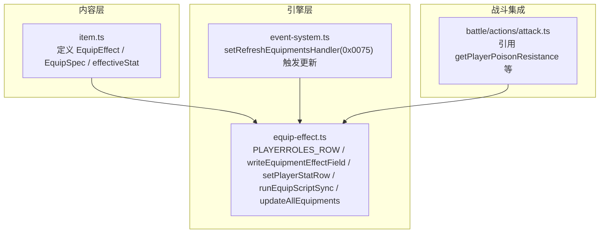
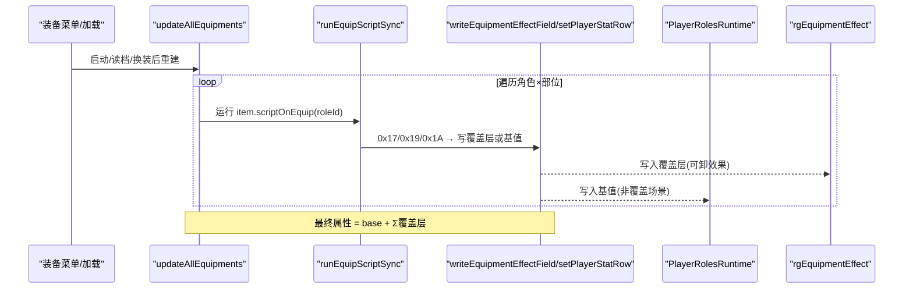
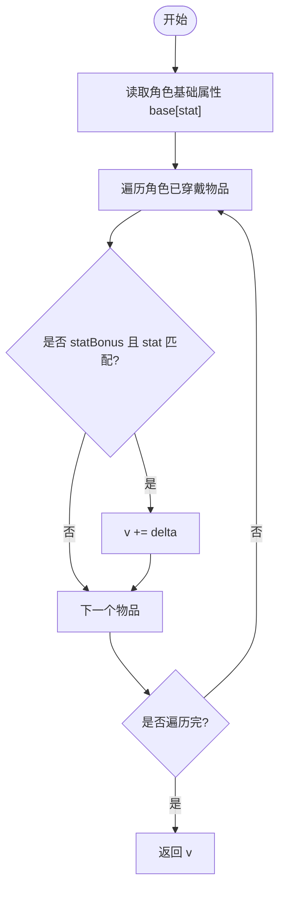
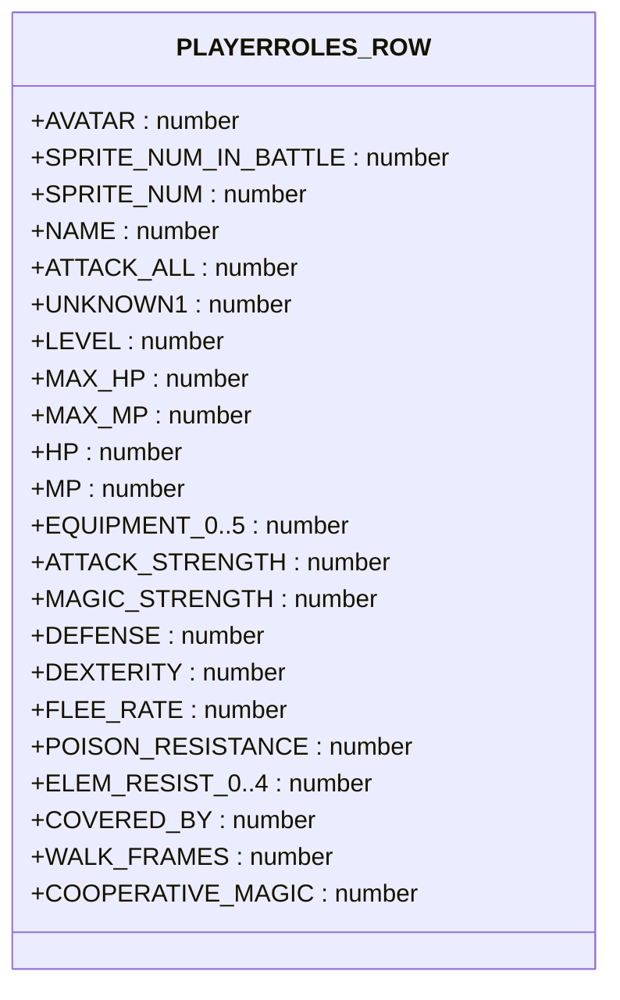
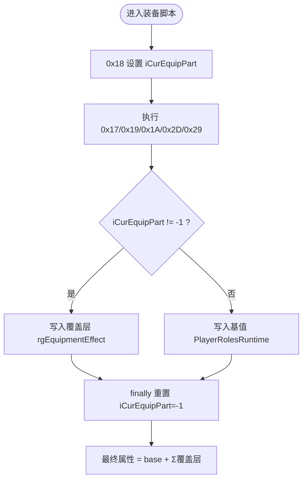
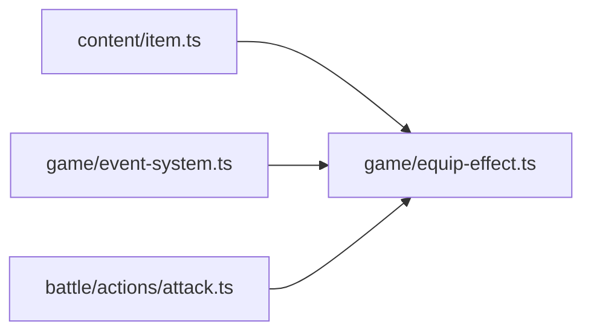

# 装备效果联合类型

<cite>
**本文引用的文件**
- [packages/content/src/item.ts](file://packages/content/src/item.ts)
- [docs/phase2/foundation/item-data-design.md](file://docs/phase2/foundation/item-data-design.md)
- [packages/game/src/core/equip-effect.ts](file://packages/game/src/core/equip-effect.ts)
- [packages/game/src/core/event-system.ts](file://packages/game/src/core/event-system.ts)
- [packages/game/src/core/battle/actions/attack.ts](file://packages/game/src/core/battle/actions/attack.ts)
</cite>

## 目录
1. [引言](#引言)
2. [项目结构](#项目结构)
3. [核心组件](#核心组件)
4. [架构总览](#架构总览)
5. [详细组件分析](#详细组件分析)
6. [依赖关系分析](#依赖关系分析)
7. [性能与复杂度](#性能与复杂度)
8. [故障排查指南](#故障排查指南)
9. [结论](#结论)
10. [附录](#附录)

## 引言
本文件聚焦“装备效果联合类型 EquipEffect”的设计与实现，系统性解释其判别联合的六种效果类型：statBonus、resistance、maxPool、grantStatus、grantSkill、attackAll。文档将阐明每种效果的参数结构与业务含义，重点说明 statBonus 的属性加成计算逻辑；给出与原版 scriptOnEquip opcode 的对应关系（含 row 编号到属性名称映射）；阐述效果执行的优先级与叠加规则；提供配置示例与验证方法；并明确本期已实现与后续阶段计划。

## 项目结构
围绕装备效果的数据与执行，主要涉及三层：
- 内容层（纯数据与类型）：定义 EquipEffect 联合、EquipSpec、有效属性计算等
- 引擎层（真值对齐 sdlpal）：scriptOnEquip 同步执行器、覆盖层 rgEquipmentEffect、运行时 base 读写、状态持久化
- 战斗集成：攻击流程中引用毒抗等 getter，保证数值一致

图表来源
- [packages/content/src/item.ts:14-24](file://packages/content/src/item.ts#L14-L24)
- [packages/game/src/core/equip-effect.ts:122-148](file://packages/game/src/core/equip-effect.ts#L122-L148)
- [packages/game/src/core/event-system.ts:865-874](file://packages/game/src/core/event-system.ts#L865-L874)
- [packages/game/src/core/battle/actions/attack.ts:22](file://packages/game/src/core/battle/actions/attack.ts#L22)

章节来源
- [packages/content/src/item.ts:14-24](file://packages/content/src/item.ts#L14-L24)
- [docs/phase2/foundation/item-data-design.md:45-66](file://docs/phase2/foundation/item-data-design.md#L45-L66)

## 核心组件
- EquipEffect 判别联合：以 kind 字段区分六种效果类型，分别承载不同参数与语义
- EquipSpec：描述装备槽位、可装备角色列表、effects 数组（有序）
- effectiveStat：仅对 statBonus 生效的纯函数，用于内容层快速计算有效属性
- PLAYERROLES_ROW：row 编号到 PlayerRoles 字段的映射表，是 scriptOnEquip 0x17/0x19/0x1A 的索引依据
- runEquipScriptSync/updateAllEquipments：同步执行 scriptOnEquip 链，写入覆盖层或基值，驱动最终有效属性

章节来源
- [packages/content/src/item.ts:14-24](file://packages/content/src/item.ts#L14-L24)
- [packages/content/src/item.ts:71-90](file://packages/content/src/item.ts#L71-L90)
- [packages/game/src/core/equip-effect.ts:122-148](file://packages/game/src/core/equip-effect.ts#L122-L148)
- [packages/game/src/core/equip-effect.ts:503-517](file://packages/game/src/core/equip-effect.ts#L503-L517)

## 架构总览
从数据到执行的关键路径如下：
- 内容层定义 EquipEffect 与 EquipSpec，并在菜单/展示时通过 effectiveStat 计算 statBonus 的有效值
- 引擎层在启动/读档/换装后调用 updateAllEquipments，遍历每个角色的每个部位，运行 item.scriptOnEquip 脚本链
- 脚本链中的 0x17/0x19/0x1A 会写入覆盖层 rgEquipmentEffect 或基值 PlayerRolesRuntime；最终通过各 getter(base + Σ覆盖层)得到真实属性
- 0x2D 写持久状态（如永久连击），0x29 施正面“毒”（如寿葫芦回血回蓝）
- 战斗侧读取 getPlayerPoisonResistance 等 getter，确保与大世界一致

图表来源
- [packages/game/src/core/equip-effect.ts:503-517](file://packages/game/src/core/equip-effect.ts#L503-L517)
- [packages/game/src/core/equip-effect.ts:359-487](file://packages/game/src/core/equip-effect.ts#L359-L487)
- [packages/game/src/core/equip-effect.ts:150-191](file://packages/game/src/core/equip-effect.ts#L150-L191)
- [packages/game/src/core/equip-effect.ts:214-249](file://packages/game/src/core/equip-effect.ts#L214-L249)

## 详细组件分析

### EquipEffect 联合类型与参数结构
- statBonus
  - 参数：stat（CombatStat）、delta（number，可为负）
  - 语义：对某战斗属性进行加减，直接参与 effectiveStat 求和
  - 对应 opcode：0x17（设置覆盖层某 row 的值）
- resistance
  - 参数：element（poison/wind/thunder/water/fire/earth）、percent（number）
  - 语义：元素抗性百分比，影响受击伤害减免
  - 对应 opcode：0x17[22-27]（毒抗与各元素抗行）
- maxPool
  - 参数：pool（hp/mp）、delta（number）
  - 语义：修改最大 HP/MP
  - 对应 opcode：0x1A（设置 MAX_HP/MAX_MP 行）
- grantStatus
  - 参数：status（StatusId）
  - 语义：授予持久状态（如仙女剑授予连击）
  - 对应 opcode：0x2D（PAL_SetPlayerStatus）
- grantSkill
  - 参数：skillId（string）
  - 语义：授予合击/召唤技能（如圣灵珠授武神、土灵珠授山神）
  - 对应 opcode：0x1A（设置 COOPERATIVE_MAGIC 行）
- attackAll
  - 参数：无
  - 语义：武器具备全体攻击能力（如长鞭）
  - 对应 opcode：0x1A（设置 ATTACK_ALL 行）

章节来源
- [packages/content/src/item.ts:14-24](file://packages/content/src/item.ts#L14-L24)
- [docs/phase2/foundation/item-data-design.md:58-66](file://docs/phase2/foundation/item-data-design.md#L58-L66)

### statBonus 属性加成计算逻辑
- 计算范围：仅累加已穿戴装备中 kind=statBonus 且 stat 匹配的 delta
- 计算位置：内容层 pure function effectiveStat，用于状态板/菜单显示
- 引擎层等价：各 getter 返回 base + Σ覆盖层，其中覆盖层由 0x17 写入

图表来源
- [packages/content/src/item.ts:71-90](file://packages/content/src/item.ts#L71-L90)
- [packages/game/src/core/equip-effect.ts:28-72](file://packages/game/src/core/equip-effect.ts#L28-L72)

章节来源
- [packages/content/src/item.ts:71-90](file://packages/content/src/item.ts#L71-L90)
- [packages/game/src/core/equip-effect.ts:28-72](file://packages/game/src/core/equip-effect.ts#L28-L72)

### 与原版 scriptOnEquip opcode 的对应关系与 row 映射
- 关键 opcode
  - 0x17：设置覆盖层某 row 的值（rgEquipmentEffect[part][row][role]）
  - 0x18：换装（更新 iCurEquipPart、清理覆盖层、必要时 swap inventory）
  - 0x19：对 PlayerRolesRuntime 某 row 增加 delta
  - 0x1A：设置 PlayerRolesRuntime 某 row 的值（若处于装备上下文则写入覆盖层）
  - 0x2D：设置持久状态（如连击）
  - 0x29：对玩家施加正面“毒”（如寿葫芦回血回蓝）
- row 编号到属性名称映射（节选）
  - 17=ATTACK_STRENGTH、18=MAGIC_STRENGTH、19=DEFENSE、20=DEXTERITY、21=FLEE_RATE、22=POISON_RESISTANCE
  - 23-27=ELEM_RESIST_0..4（风雷水火土）
  - 7=MAX_HP、8=MAX_MP、65=COOPERATIVE_MAGIC、4=ATTACK_ALL

图表来源
- [packages/game/src/core/equip-effect.ts:122-148](file://packages/game/src/core/equip-effect.ts#L122-L148)

章节来源
- [packages/game/src/core/equip-effect.ts:359-487](file://packages/game/src/core/equip-effect.ts#L359-L487)
- [packages/game/src/core/equip-effect.ts:122-148](file://packages/game/src/core/equip-effect.ts#L122-L148)

### 效果执行优先级与叠加规则
- 覆盖层优先：当处于装备脚本上下文（iCurEquipPart != -1）时，0x1A 写入覆盖层而非基值；脚本结束后 iCurEquipPart 重置为 -1，防止泄漏
- 叠加方式：最终属性 = base + Σ覆盖层（遍历 6 个部位 + Extra 格）
- 卸载清理：removeEquipmentEffect 将指定部位的覆盖层清零，并处理特殊副作用（如 Hand 卸下清连击、Wear 卸下清 level≥99 毒）
- 全局刷新：队伍变动事件（0x0075）触发 updateAllEquipments，重算所有覆盖层与持久状态

图表来源
- [packages/game/src/core/equip-effect.ts:214-249](file://packages/game/src/core/equip-effect.ts#L214-L249)
- [packages/game/src/core/equip-effect.ts:359-487](file://packages/game/src/core/equip-effect.ts#L359-L487)
- [packages/game/src/core/equip-effect.ts:266-298](file://packages/game/src/core/equip-effect.ts#L266-L298)
- [packages/game/src/core/event-system.ts:865-874](file://packages/game/src/core/event-system.ts#L865-L874)

章节来源
- [packages/game/src/core/equip-effect.ts:214-249](file://packages/game/src/core/equip-effect.ts#L214-L249)
- [packages/game/src/core/equip-effect.ts:266-298](file://packages/game/src/core/equip-effect.ts#L266-L298)
- [packages/game/src/core/event-system.ts:865-874](file://packages/game/src/core/event-system.ts#L865-L874)

### 完整效果配置示例与验证方法
- 配置示例（概念性）
  - statBonus：{kind:'statBonus', stat:'defense', delta:3}
  - resistance：{kind:'resistance', element:'earth', percent:50}
  - maxPool：{kind:'maxPool', pool:'mp', delta:20}
  - grantStatus：{kind:'grantStatus', status: 'dualAttack'}
  - grantSkill：{kind:'grantSkill', skillId:'336'}
  - attackAll：{kind:'attackAll'}
- 验证方法
  - 内容层验证：使用 effectiveStat(char,'defense',items) 检查防御是否按 statBonus 累加
  - 引擎层验证：
    - 启动/读档后调用 updateAllEquipments，确认覆盖层被正确填充
    - 使用 runEquipScript(gs, scriptId, roleId) 模拟脚本执行，断言覆盖层/基值变化
    - 卸载 removeEquipmentEffect(gs, roleId, partIdx) 后断言覆盖层归零
  - 战斗集成验证：攻击流程中引用 getPlayerPoisonResistance 等 getter，确保与大世界一致

章节来源
- [packages/content/src/item.ts:71-90](file://packages/content/src/item.ts#L71-L90)
- [packages/game/src/core/equip-effect.ts:503-517](file://packages/game/src/core/equip-effect.ts#L503-L517)
- [packages/game/src/core/equip-effect.ts:359-487](file://packages/game/src/core/equip-effect.ts#L359-L487)
- [packages/game/src/core/equip-effect.ts:266-298](file://packages/game/src/core/equip-effect.ts#L266-L298)
- [packages/game/src/core/battle/actions/attack.ts:22](file://packages/game/src/core/battle/actions/attack.ts#L22)

### 本期实现与后续阶段
- 本期已实现
  - EquipEffect 联合类型与 EquipSpec 数据结构
  - statBonus 的有效属性计算（effectiveStat）
  - scriptOnEquip 同步执行器（0x17/0x18/0x19/0x1A/0x2D/0x29）
  - 覆盖层 rgEquipmentEffect 与基值读写、卸载清理、全局刷新
  - 与战斗系统的毒抗等 getter 集成
- 留待后续阶段
  - resistance/maxPool/grantStatus/grantSkill/attackAll 的完整引擎落地（当前仅定形状，部分已在引擎层有对应 row 支持）
  - 使用菜单 ItemUseEffect 细化与实现
  - 战斗投掷系统
  - 全量 234 件数据迁移与校验

章节来源
- [docs/phase2/foundation/item-data-design.md:68-69](file://docs/phase2/foundation/item-data-design.md#L68-L69)
- [docs/phase2/foundation/item-data-design.md:134-137](file://docs/phase2/foundation/item-data-design.md#L134-L137)

## 依赖关系分析
- 内容层依赖
  - item.ts 依赖 character.ts 的 CharacterInstance/WorldState 类型，以及 skill.ts 的 StatusId
- 引擎层依赖
  - equip-effect.ts 依赖 event-system.ts 的全局命令/标签表、毒对象表注入、库存操作
  - 通过 PLAYERROLES_ROW 与 writeEquipmentEffectField/setPlayerStatRow 精确映射 row 到字段
- 战斗集成
  - battle/actions/attack.ts 引用 getPlayerPoisonResistance，确保命中后的毒门控与大世界一致

图表来源
- [packages/content/src/item.ts:3-4](file://packages/content/src/item.ts#L3-L4)
- [packages/game/src/core/equip-effect.ts:18-20](file://packages/game/src/core/equip-effect.ts#L18-L20)
- [packages/game/src/core/battle/actions/attack.ts:22](file://packages/game/src/core/battle/actions/attack.ts#L22)

章节来源
- [packages/content/src/item.ts:3-4](file://packages/content/src/item.ts#L3-L4)
- [packages/game/src/core/equip-effect.ts:18-20](file://packages/game/src/core/equip-effect.ts#L18-L20)
- [packages/game/src/core/battle/actions/attack.ts:22](file://packages/game/src/core/battle/actions/attack.ts#L22)

## 性能与复杂度
- effectiveStat 时间复杂度 O(S+E)，S 为已穿戴物品数，E 为该物品的 effects 数量；空间复杂度 O(1)
- updateAllEquipments 时间复杂度 O(R×P×L)，R 为角色数、P 为部位数、L 为脚本长度（上限 256）
- 覆盖层访问为常数级数组查找，getter 遍历 6+1 个部位，整体开销低

[本节为通用指导，不直接分析具体文件]

## 故障排查指南
- 常见症状
  - 穿装后属性未变化：检查 effectiveStat 是否正确累加 statBonus；确认 updateAllEquipments 已调用
  - 脚本结束覆盖层泄漏：确认 iCurEquipPart 在 finally 中被重置为 -1
  - 卸载后覆盖层未清零：检查 removeEquipmentEffect 是否针对正确 partIdx 调用
  - 战斗毒抗不一致：确认 battle 侧引用 getPlayerPoisonResistance 且大世界中 resist 已正确写入覆盖层
- 定位建议
  - 打印 PLAYERROLES_ROW 映射，核对 0x17/0x19/0x1A 的 row 索引
  - 在 runEquipScriptSync 入口/出口打点，观察 iCurEquipPart 生命周期
  - 使用 setRefreshEquipmentsHandler 确保队伍变动后重建覆盖层

章节来源
- [packages/game/src/core/equip-effect.ts:359-487](file://packages/game/src/core/equip-effect.ts#L359-L487)
- [packages/game/src/core/equip-effect.ts:266-298](file://packages/game/src/core/equip-effect.ts#L266-L298)
- [packages/game/src/core/event-system.ts:865-874](file://packages/game/src/core/event-system.ts#L865-L874)

## 结论
EquipEffect 联合类型以 kind 判别六类效果，既满足内容层的清晰建模，又与引擎层 scriptOnEquip 的 opcode 与 row 映射严格对齐。statBonus 在本期即生效，使状态板直观反映穿装收益；其余效果在本期完成形状定义与部分引擎支撑，后续阶段将逐步落地完整行为。通过覆盖层与基值的分层设计，实现了可拆卸、可叠加、可清理的装备效果体系，并与战斗系统保持一致。

[本节为总结性内容，不直接分析具体文件]

## 附录
- 术语对照
  - 覆盖层：rgEquipmentEffect，记录可卸下的装备效果
  - 基值：PlayerRolesRuntime，记录角色基础与临时修改
  - 持久状态：rgPlayerStatus，记录如连击等长期状态
- 参考路径
  - 内容层定义：[packages/content/src/item.ts](file://packages/content/src/item.ts)
  - 设计文档：[docs/phase2/foundation/item-data-design.md](file://docs/phase2/foundation/item-data-design.md)
  - 引擎实现：[packages/game/src/core/equip-effect.ts](file://packages/game/src/core/equip-effect.ts)
  - 事件系统集成：[packages/game/src/core/event-system.ts](file://packages/game/src/core/event-system.ts)
  - 战斗集成：[packages/game/src/core/battle/actions/attack.ts](file://packages/game/src/core/battle/actions/attack.ts)