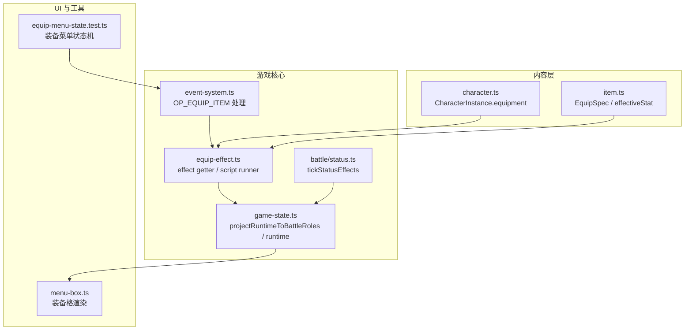
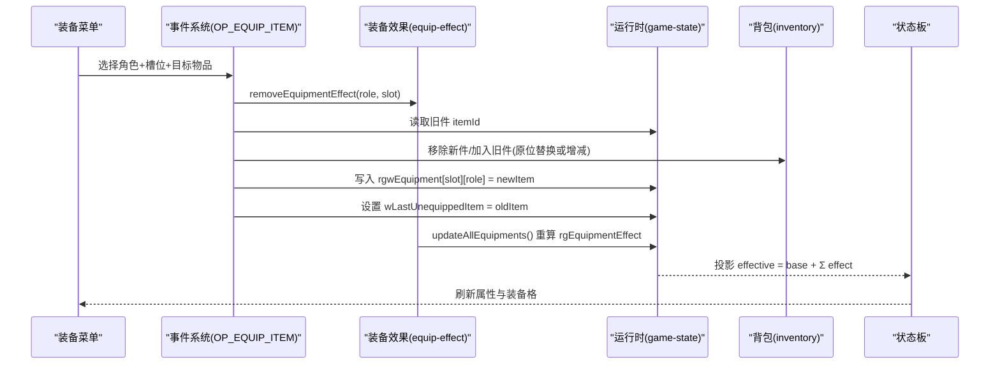
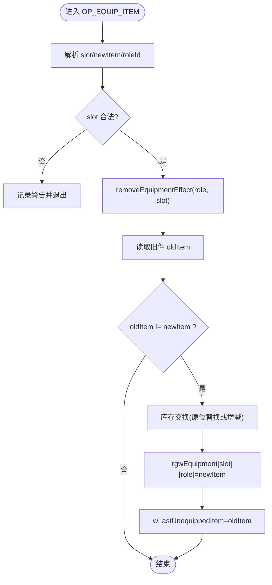
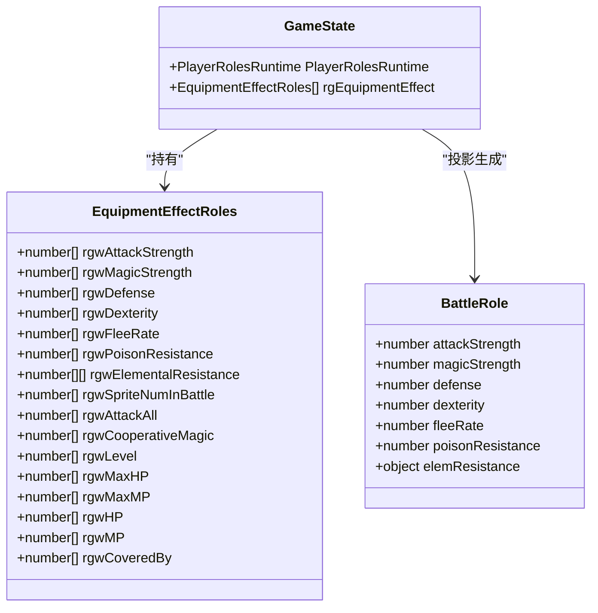
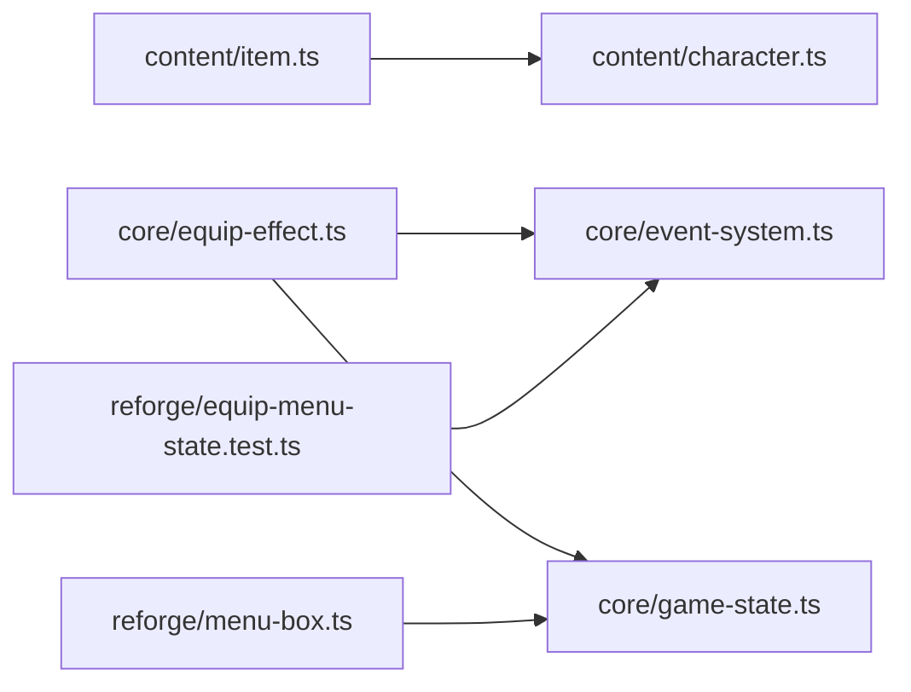
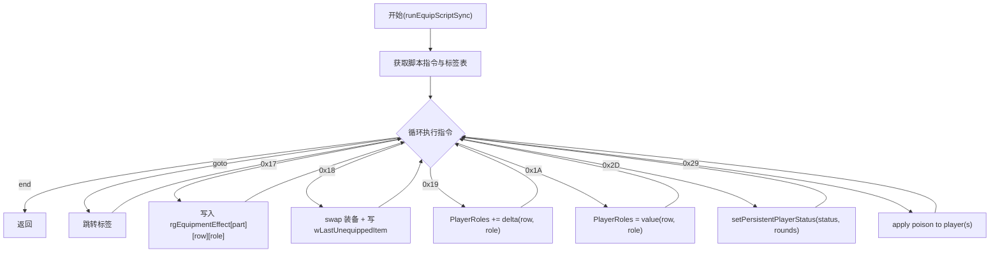
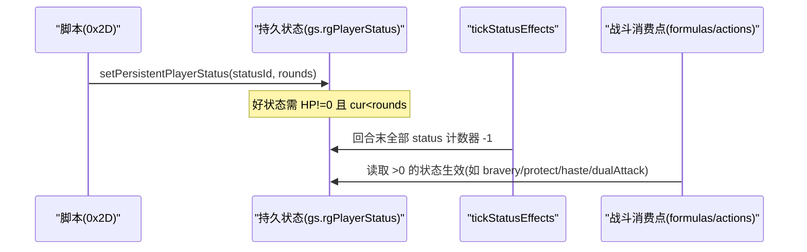

# 装备槽位映射与状态板

<cite>
**本文引用的文件**   
- [character.ts](file://packages/content/src/character.ts)
- [item.ts](file://packages/content/src/item.ts)
- [equip-effect.ts](file://packages/game/src/core/equip-effect.ts)
- [event-system.ts](file://packages/game/src/core/event-system.ts)
- [game-state.ts](file://packages/game/src/core/game-state.ts)
- [status.ts](file://packages/game/src/core/battle/status.ts)
- [global.h](file://reference/sdlpal/global.h)
- [items.ts](file://packages/pal-extract/src/resources/parsers/items.ts)
- [menu-box.ts](file://packages/reforge/src/menu/menu-box.ts)
- [slot.test.ts](file://packages/reforge/src/dialog/slot.test.ts)
- [equip-menu-state.test.ts](file://packages/reforge/src/equip-menu-state.test.ts)
- [equip-effect.test.ts](file://packages/game/src/core/equip-effect.test.ts)
- [game-state.test.ts](file://packages/game/src/core/game-state.test.ts)
- [battle-opcodes.test.ts](file://packages/game/src/core/battle/__tests__/battle-opcodes.test.ts)
- [actions.test.ts](file://packages/game/src/core/battle/__tests__/actions.test.ts)
- [item-data-design.md](file://docs/phase2/foundation/item-data-design.md)
</cite>

## 目录
1. [引言](#引言)
2. [项目结构](#项目结构)
3. [核心组件](#核心组件)
4. [架构总览](#架构总览)
5. [详细组件分析](#详细组件分析)
6. [依赖关系分析](#依赖关系分析)
7. [性能考量](#性能考量)
8. [故障排查指南](#故障排查指南)
9. [结论](#结论)
10. [附录](#附录)

## 引言
本文件聚焦“装备槽位映射与状态板”的完整实现与机制说明，覆盖以下要点：
- 新槽位系统与原版 body part 的对应关系，以及 sdlpal 枚举名与实际装束内容的差异。
- CharacterInstance.equipment 数据结构设计与 slot → itemId 映射机制。
- inventory 持有系统与装备系统的交互流程（装备/卸下的完整生命周期）。
- 状态板更新机制与有效属性计算的触发时机。
- 槽位扩展的兼容性与向后兼容策略。

## 项目结构
围绕装备与状态板的代码分布在内容层、游戏核心与 UI 渲染层：
- 内容层定义角色实例、物品能力块与有效属性计算。
- 游戏核心实现装备效果写入、脚本执行、运行时投影与战斗快照同步。
- UI 层负责状态板展示与装备菜单交互。

图表来源
- [character.ts:37-53](file://packages/content/src/character.ts#L37-L53)
- [item.ts:69-105](file://packages/content/src/item.ts#L69-L105)
- [equip-effect.ts:26-81](file://packages/game/src/core/equip-effect.ts#L26-L81)
- [event-system.ts:4293-4331](file://packages/game/src/core/event-system.ts#L4293-L4331)
- [game-state.ts:1528-1572](file://packages/game/src/core/game-state.ts#L1528-L1572)
- [status.ts:1-35](file://packages/game/src/core/battle/status.ts#L1-L35)
- [menu-box.ts:546-560](file://packages/reforge/src/menu/menu-box.ts#L546-L560)
- [equip-menu-state.test.ts:1-36](file://packages/reforge/src/equip-menu-state.test.ts#L1-L36)

章节来源
- [character.ts:37-53](file://packages/content/src/character.ts#L37-L53)
- [item.ts:69-105](file://packages/content/src/item.ts#L69-L105)
- [equip-effect.ts:26-81](file://packages/game/src/core/equip-effect.ts#L26-L81)
- [event-system.ts:4293-4331](file://packages/game/src/core/event-system.ts#L4293-L4331)
- [game-state.ts:1528-1572](file://packages/game/src/core/game-state.ts#L1528-L1572)
- [status.ts:1-35](file://packages/game/src/core/battle/status.ts#L1-L35)
- [menu-box.ts:546-560](file://packages/reforge/src/menu/menu-box.ts#L546-L560)
- [equip-menu-state.test.ts:1-36](file://packages/reforge/src/equip-menu-state.test.ts#L1-L36)

## 核心组件
- CharacterInstance.equipment：以 Record<string, string> 表示 slotId → itemId，支持可扩展槽位。
- EquipSpec 与 EquipEffect：在 item.ts 中定义装备能力块与效果形状，用于过滤可装物与计算 statBonus。
- equip-effect.ts：提供 6 个有效属性 getter（攻击、魔攻、防御、速度、逃跑率、毒抗），并实现装备脚本运行与 effect 写入。
- event-system.ts：处理 OP_EQUIP_ITEM，完成槽位替换、背包交换与 wLastUnequippedItem 记录。
- game-state.ts：将运行时属性与装备 effect 合并为战斗快照；提供回写与向后兼容路径。
- battle/status.ts：回合末对全部 status 计数器统一递减，含布尔类状态。

章节来源
- [character.ts:37-53](file://packages/content/src/character.ts#L37-L53)
- [item.ts:69-105](file://packages/content/src/item.ts#L69-L105)
- [equip-effect.ts:26-81](file://packages/game/src/core/equip-effect.ts#L26-L81)
- [event-system.ts:4293-4331](file://packages/game/src/core/event-system.ts#L4293-L4331)
- [game-state.ts:1528-1572](file://packages/game/src/core/game-state.ts#L1528-L1572)
- [status.ts:1-35](file://packages/game/src/core/battle/status.ts#L1-L35)

## 架构总览
从数据到显示的关键链路如下：
- 数据层：ItemData.equip.slot + equipableBy 决定可装列表；CharacterInstance.equipment 维护当前穿戴。
- 运行时：equip-effect.ts 通过 0x17/0x1A 等 opcode 写入 rgEquipmentEffect；effective getter 汇总 base + Σ effect。
- 事件系统：OP_EQUIP_ITEM 驱动 swap 逻辑与 wLastUnequippedItem 更新。
- 战斗投影：projectRuntimeToBattleRoles 将 base + Σ effect 投影入战斗快照；战内 buff(Extra 槽)经 getter 重算。
- 状态板：按 slot 读取已穿装备，结合 effectiveStat 或 getter 刷新数值。

图表来源
- [event-system.ts:4293-4331](file://packages/game/src/core/event-system.ts#L4293-L4331)
- [equip-effect.ts:503-517](file://packages/game/src/core/equip-effect.ts#L503-L517)
- [game-state.ts:1528-1572](file://packages/game/src/core/game-state.ts#L1528-L1572)

## 详细组件分析

### 槽位与 body part 映射及 sdlpal 差异
- 新槽位与原版 body part 的对应：
  - weapon ↔ Hand(part 3)
  - head ↔ Head(part 0)
  - body ↔ Shoulder(part 2)（sdlpal 名 Shoulder，实际装防具）
  - cloak ↔ Body(part 1)（sdlpal 名 Body，实际装身饰/披风）
  - feet ↔ Feet(part 4)
  - accessory ↔ Wear(part 5)（原 amulet 改名）
- sdlpal 枚举名与实际装束相反：Body(1) 实为身饰/披风，Shoulder(2) 实为防具。命名以“实际装什么”为准。

章节来源
- [item-data-design.md:71-84](file://docs/phase2/foundation/item-data-design.md#L71-L84)
- [global.h:62-72](file://reference/sdlpal/global.h#L62-L72)

### CharacterInstance.equipment 数据结构与 slot → itemId 映射
- 字段设计：equipment: Record<string, string>，键为 slotId（如 'weapon'/'head'/'body'/'cloak'/'feet'/'accessory'），值为 itemId。
- 可扩展性：新增槽位只需增加 slotId 并在 UI/校验处适配，无需改动类型签名。
- 与持有系统分离：inventory 仅存放未穿戴物品；已穿戴物品由 equipment 持有。

章节来源
- [character.ts:37-53](file://packages/content/src/character.ts#L37-L53)
- [item.ts:86-96](file://packages/content/src/item.ts#L86-L96)

### 装备/卸下操作的生命周期（事件系统）
- 入口：OP_EQUIP_ITEM 解析 slot 与 newItem，定位 roleId。
- 前置：设置 iCurEquipPart，调用 removeEquipmentEffect 清零该槽 effect。
- 判断：若旧件与新件不同，则进行库存交换（DL11 原位替换优化）并写入 rgwEquipment[slot][role]。
- 副作用：设置 wLastUnequippedItem 为旧件 id，供后续逻辑使用。

图表来源
- [event-system.ts:4293-4331](file://packages/game/src/core/event-system.ts#L4293-L4331)
- [equip-effect.ts:266-298](file://packages/game/src/core/equip-effect.ts#L266-L298)

章节来源
- [event-system.ts:4293-4331](file://packages/game/src/core/event-system.ts#L4293-L4331)
- [equip-effect.test.ts:226-247](file://packages/game/src/core/equip-effect.test.ts#L226-L247)

### 装备效果与有效属性计算
- 效果写入：scriptOnEquip 中的 0x17/0x1A 等 opcode 写入 rgEquipmentEffect[partIdx].field[roleId]。
- 有效属性 getter：base PlayerRolesRuntime.rgwXxx[role] + Σ_{slot=0..6} rgEquipmentEffect[slot].rgwXxx[role]。
- 抗性 clamp：毒抗/元素抗在 getter 中 clamp 至 [0,100]。
- 战斗快照：projectRuntimeToBattleRoles 在传入 equipmentEffect 时并入 Σ effect；省略参数则退回纯 base（向后兼容）。

图表来源
- [game-state.ts:571-588](file://packages/game/src/core/game-state.ts#L571-L588)
- [game-state.ts:1528-1572](file://packages/game/src/core/game-state.ts#L1528-L1572)
- [equip-effect.ts:26-81](file://packages/game/src/core/equip-effect.ts#L26-L81)

章节来源
- [equip-effect.ts:26-81](file://packages/game/src/core/equip-effect.ts#L26-L81)
- [game-state.ts:1528-1572](file://packages/game/src/core/game-state.ts#L1528-L1572)
- [game-state.test.ts:588-609](file://packages/game/src/core/game-state.test.ts#L588-L609)

### 状态板更新与有效属性触发时机
- 大世界状态板：基于 CharacterInstance.equipment 与 effectiveStat（statBonus 求和）或 equip-effect getter 刷新数值。
- 战斗阶段：startBattle 前 projectRuntimeToBattleRoles 将 base + Σ effect 投影入战斗 roles；战内 0x30 临时 buff 写入 Extra 槽后，getter 重算 snapshot。
- 回合末：tickStatusEffects 对所有 status 计数器统一 -1（含 haste/bravery/protect/dualAttack 等布尔类）。

章节来源
- [item.ts:69-90](file://packages/content/src/item.ts#L69-L90)
- [game-state.ts:1528-1572](file://packages/game/src/core/game-state.ts#L1528-L1572)
- [battle-opcodes.test.ts:1381-1408](file://packages/game/src/core/battle/__tests__/battle-opcodes.test.ts#L1381-L1408)
- [status.ts:1-35](file://packages/game/src/core/battle/status.ts#L1-L35)

### 持有系统与装备系统的交互
- 可装物筛选：equippableItems 根据 inventory 中 count>0 且 equipableBy 命中角色模板的物品过滤。
- 换装不可变语义：equipItem 返回新 WorldState，旧件回包、新件出包；原 world 不变。
- 灵珠双重身份：同时具备 equip/use 能力块，两菜单均出现。

章节来源
- [item.ts:92-105](file://packages/content/src/item.ts#L92-L105)
- [item.ts:128-149](file://packages/content/src/item.ts#L128-L149)
- [item-data-design.md:86-96](file://docs/phase2/foundation/item-data-design.md#L86-L96)

### 状态板 UI 与槽位渲染
- 装备格尺寸与名称渲染：reforge/menu-box.ts 中按 EQUIP_SLOT_SIZE 与颜色常量渲染装备名。
- 对话 slot 状态机（非装备，但体现 slot 概念）：top/bottom 共存与活跃切换，便于理解 slot 语义。

章节来源
- [menu-box.ts:546-560](file://packages/reforge/src/menu/menu-box.ts#L546-L560)
- [slot.test.ts:1-49](file://packages/reforge/src/dialog/slot.test.ts#L1-L49)

### 兼容性：slot 扩展与向后兼容
- 新槽位扩展：equipment 使用 Record<string,string>，新增 slotId 不影响现有类型；仅在 UI/校验处适配。
- 向后兼容：projectRuntimeToBattleRoles 不传 equipmentEffect 时退回纯 base 投影，保证旧调用方不受影响。
- 枚举差异兼容：以“实际装什么”命名 slot，避免 sdlpal Body/Shoulder 命名误导。

章节来源
- [character.ts:37-53](file://packages/content/src/character.ts#L37-L53)
- [game-state.ts:1528-1572](file://packages/game/src/core/game-state.ts#L1528-L1572)
- [item-data-design.md:71-84](file://docs/phase2/foundation/item-data-design.md#L71-L84)

## 依赖关系分析
- 内容层依赖：item.ts 依赖 character.ts 的 CharacterInstance 与 WorldState。
- 核心层依赖：equip-effect.ts 依赖 event-system.ts（库存/全局命令）、game-state.ts（runtime/effect）。
- UI 层依赖：menu-box.ts 消费 slot 与装备名；equip-menu-state.test.ts 验证菜单状态机。

图表来源
- [item.ts:69-105](file://packages/content/src/item.ts#L69-L105)
- [character.ts:37-53](file://packages/content/src/character.ts#L37-L53)
- [equip-effect.ts:1-20](file://packages/game/src/core/equip-effect.ts#L1-L20)
- [event-system.ts:4293-4331](file://packages/game/src/core/event-system.ts#L4293-L4331)
- [game-state.ts:1528-1572](file://packages/game/src/core/game-state.ts#L1528-L1572)
- [menu-box.ts:546-560](file://packages/reforge/src/menu/menu-box.ts#L546-L560)
- [equip-menu-state.test.ts:1-36](file://packages/reforge/src/equip-menu-state.test.ts#L1-L36)

章节来源
- [item.ts:69-105](file://packages/content/src/item.ts#L69-L105)
- [character.ts:37-53](file://packages/content/src/character.ts#L37-L53)
- [equip-effect.ts:1-20](file://packages/game/src/core/equip-effect.ts#L1-L20)
- [event-system.ts:4293-4331](file://packages/game/src/core/event-system.ts#L4293-L4331)
- [game-state.ts:1528-1572](file://packages/game/src/core/game-state.ts#L1528-L1572)
- [menu-box.ts:546-560](file://packages/reforge/src/menu/menu-box.ts#L546-L560)
- [equip-menu-state.test.ts:1-36](file://packages/reforge/src/equip-menu-state.test.ts#L1-L36)

## 性能考量
- 有效属性计算：getter 遍历 0..6 槽累加，时间复杂度 O(7)，开销极低。
- 投影成本：projectRuntimeToBattleRoles 每角色一次聚合，适合战斗开始或 buff 变更时触发。
- 原位替换优化：OP_EQUIP_ITEM 在特定条件下原位替换背包条目，减少数组尾部移动。

[本节为通用指导，不直接分析具体文件]

## 故障排查指南
- 装备无加成：检查是否调用了 updateAllEquipments 或 runEquipScript；确认 rgEquipmentEffect 对应行是否写入。
- 战斗属性不一致：确认 startBattle 前传入 equipmentEffect；战内 0x30 后需 recompute snapshot。
- 状态不衰减：确保 tickStatusEffects 在回合末被调用，且所有 status 字段为 number 计数器。
- 无法换装：检查 OP_EQUIP_ITEM 的 slot 合法性与新旧件比较分支；关注 wLastUnequippedItem 是否正确设置。

章节来源
- [equip-effect.test.ts:380-407](file://packages/game/src/core/equip-effect.test.ts#L380-L407)
- [game-state.test.ts:652-659](file://packages/game/src/core/game-state.test.ts#L652-L659)
- [status.ts:1-35](file://packages/game/src/core/battle/status.ts#L1-L35)
- [event-system.ts:4293-4331](file://packages/game/src/core/event-system.ts#L4293-L4331)

## 结论
本方案以“slot 语义化命名 + 运行时 effect 叠加”为核心，既对齐 sdlpal 真值行为，又提供可扩展的数据结构与清晰的交互流程。通过 getter 与投影机制，状态板与战斗系统均可实时反映装备变化；同时保留向后兼容路径，确保渐进式演进。

[本节为总结，不直接分析具体文件]

## 附录

### 关键流程图：装备脚本运行（runEquipScriptSync）

图表来源
- [equip-effect.ts:359-487](file://packages/game/src/core/equip-effect.ts#L359-L487)

章节来源
- [equip-effect.ts:359-487](file://packages/game/src/core/equip-effect.ts#L359-L487)

### 关键序列图：buff 端到端（0x2D → status → 战斗效果）

图表来源
- [equip-effect.ts:316-339](file://packages/game/src/core/equip-effect.ts#L316-L339)
- [status.ts:1-35](file://packages/game/src/core/battle/status.ts#L1-L35)
- [actions.test.ts:2263-2273](file://packages/game/src/core/battle/__tests__/actions.test.ts#L2263-L2273)

章节来源
- [equip-effect.ts:316-339](file://packages/game/src/core/equip-effect.ts#L316-L339)
- [status.ts:1-35](file://packages/game/src/core/battle/status.ts#L1-L35)
- [actions.test.ts:2263-2273](file://packages/game/src/core/battle/__tests__/actions.test.ts#L2263-L2273)