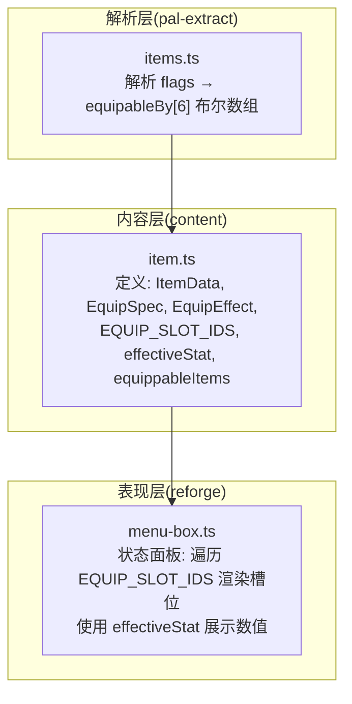
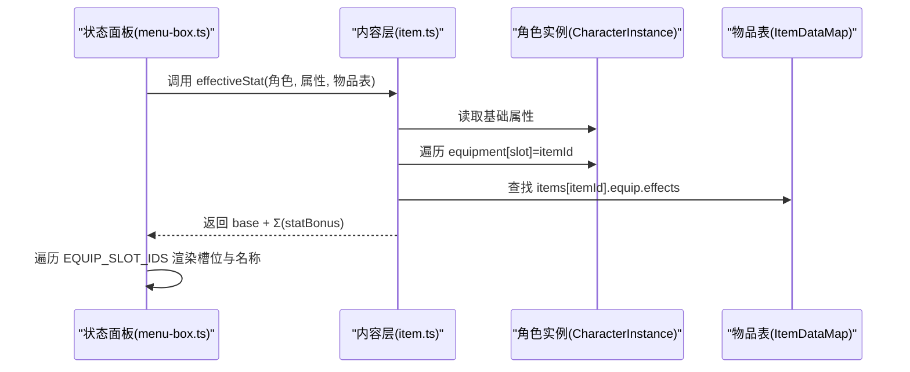
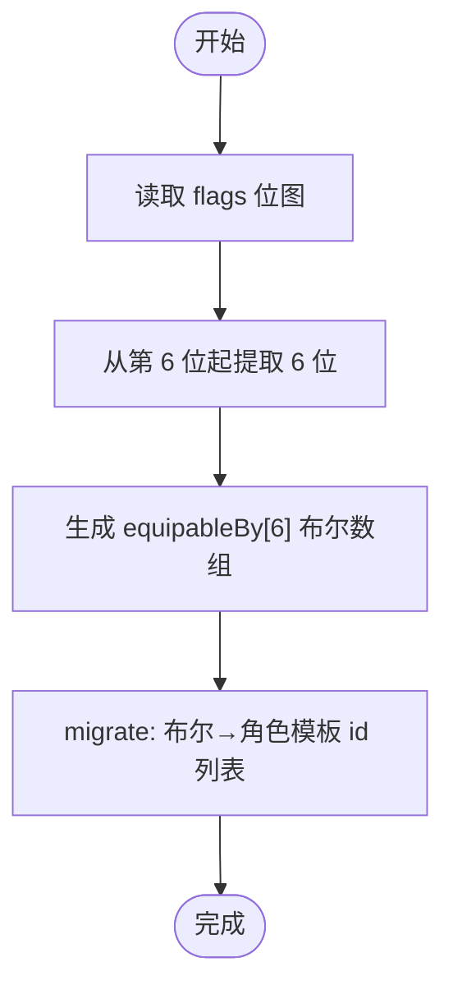
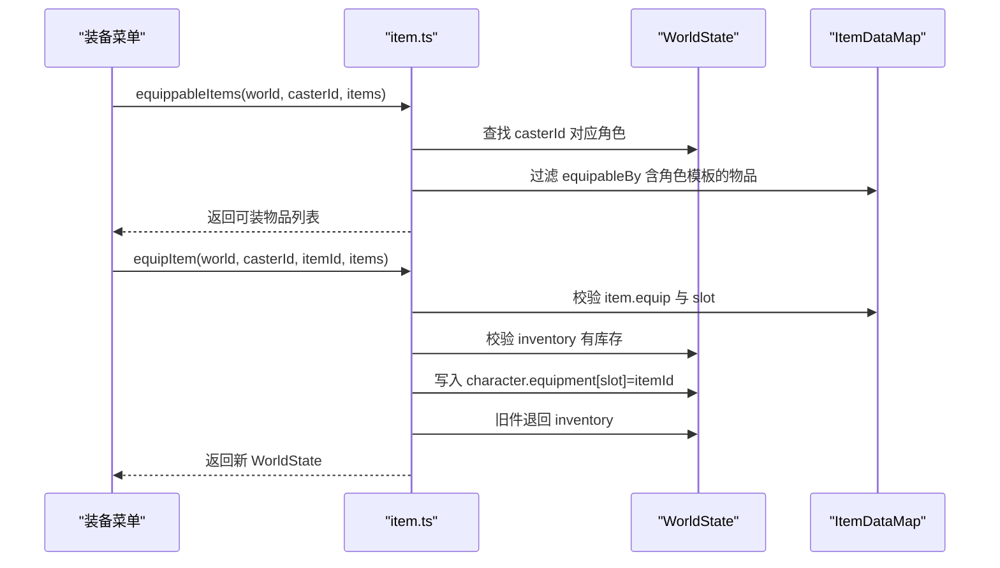
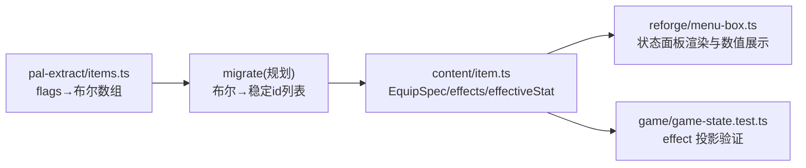

# 装备规格 EquipSpec 系统

<cite>
**本文引用的文件**   
- [packages/content/src/item.ts](file://packages/content/src/item.ts)
- [docs/phase2/foundation/item-data-design.md](file://docs/phase2/foundation/item-data-design.md)
- [packages/reforge/src/menu/menu-box.ts](file://packages/reforge/src/menu/menu-box.ts)
- [packages/pal-extract/src/resources/parsers/items.ts](file://packages/pal-extract/src/resources/parsers/items.ts)
- [packages/game/src/core/game-state.test.ts](file://packages/game/src/core/game-state.test.ts)
</cite>

## 目录
1. [简介](#简介)
2. [项目结构](#项目结构)
3. [核心组件](#核心组件)
4. [架构总览](#架构总览)
5. [详细组件分析](#详细组件分析)
6. [依赖分析](#依赖分析)
7. [性能考量](#性能考量)
8. [故障排查指南](#故障排查指南)
9. [结论](#结论)
10. [附录](#附录)

## 简介
本文件系统化阐述“装备规格系统”的设计与实现，聚焦以下目标：
- 深入解释 EquipSpec 接口设计、槽位类型定义及其与原版 body part 的映射关系。
- 详细说明 equipableBy 角色限制机制，以及从位图到稳定 id 列表的迁移过程。
- 阐述 effects 数组的设计原理与执行顺序的重要性。
- 提供完整的槽位对照表与配置示例，并说明披风槽新增对状态板的影响。
- 包含装备兼容性检查与冲突处理机制（穿戴/卸载流程）。

## 项目结构
本系统由三层构成：
- 数据层（content）：定义 ItemData、EquipSpec、EquipEffect、CombatStat、EQUIP_SLOT_IDS 等类型与常量，并提供纯函数计算有效属性与换装逻辑。
- 解析层（pal-extract）：将二进制资源中的位图式可装备标记解析为布尔数组，作为后续迁移的基础。
- 表现层（reforge）：状态面板读取 EQUIP_SLOT_IDS 渲染 6 个槽位，并使用 effectiveStat 显示实时数值。



图表来源
- [packages/content/src/item.ts:9-30](file://packages/content/src/item.ts#L9-L30)
- [packages/pal-extract/src/resources/parsers/items.ts:40-54](file://packages/pal-extract/src/resources/parsers/items.ts#L40-L54)
- [packages/reforge/src/menu/menu-box.ts:300-304](file://packages/reforge/src/menu/menu-box.ts#L300-L304)

章节来源
- [packages/content/src/item.ts:9-30](file://packages/content/src/item.ts#L9-L30)
- [packages/pal-extract/src/resources/parsers/items.ts:40-54](file://packages/pal-extract/src/resources/parsers/items.ts#L40-L54)
- [packages/reforge/src/menu/menu-box.ts:300-304](file://packages/reforge/src/menu/menu-box.ts#L300-L304)

## 核心组件
- EquipSlot 与 EQUIP_SLOT_IDS：统一 6 个槽位名，语义按“实际装什么”命名，对齐原版 body part。
- EquipSpec：描述一件装备的槽位、可装备角色集合、效果序列。
- EquipEffect：以判别联合表达不同效果种类；当前阶段 statBonus 已生效，其他 kind 预留形状。
- 有效属性计算：effectiveStat 将角色基础属性与所有已穿戴装备的 statBonus 叠加。
- 兼容性与冲突处理：equippableItems/equipItem 在 UI 与运行时双重校验，避免非法穿戴与覆盖冲突。

章节来源
- [packages/content/src/item.ts:9-30](file://packages/content/src/item.ts#L9-L30)
- [packages/content/src/item.ts:69-105](file://packages/content/src/item.ts#L69-L105)
- [packages/content/src/item.ts:128-149](file://packages/content/src/item.ts#L128-L149)

## 架构总览
装备规格系统的关键交互如下：
- 数据源：ItemDataMap 中每个物品可选携带 equip 能力块。
- 运行时：CharacterInstance.equipment 记录各槽位当前装备 id。
- 计算：effectiveStat 汇总 base + Σ(statBonus)。
- 界面：状态面板基于 EQUIP_SLOT_IDS 渲染槽位，并显示 effectiveStat 结果。



图表来源
- [packages/content/src/item.ts:69-90](file://packages/content/src/item.ts#L69-L90)
- [packages/reforge/src/menu/menu-box.ts:286-298](file://packages/reforge/src/menu/menu-box.ts#L286-L298)
- [packages/reforge/src/menu/menu-box.ts:300-304](file://packages/reforge/src/menu/menu-box.ts#L300-L304)

## 详细组件分析

### EquipSpec 接口与槽位映射
- 槽位定义：weapon/head/body/cloak/feet/accessory，共 6 个。
- 与原版 body part 的对应关系：
  - weapon ↔ Hand(part 3)
  - head ↔ Head(part 0)
  - body ↔ Shoulder(part 2)，但实际装防具
  - cloak ↔ Body(part 1)，新增披风槽
  - feet ↔ Feet(part 4)
  - accessory ↔ Wear(part 5)，旧 amulet 改名
- 命名原则：按“实际装什么”取中文语义，避免 sdlpal 枚举名带来的歧义。

```mermaid
classDiagram
class EquipSpec {
+slot : EquipSlot
+equipableBy : string[]
+effects : EquipEffect[]
}
class EquipEffect {
<<union>>
+statBonus(stat, delta)
+resistance(element, percent)
+maxPool(pool, delta)
+grantStatus(status)
+grantSkill(skillId)
+attackAll()
}
class EquipSlot {
<<enum>>
"weapon"
"head"
"body"
"cloak"
"feet"
"accessory"
}
EquipSpec --> EquipSlot : "引用"
EquipSpec --> EquipEffect : "包含"
```

图表来源
- [packages/content/src/item.ts:9-30](file://packages/content/src/item.ts#L9-L30)

章节来源
- [docs/phase2/foundation/item-data-design.md:47-84](file://docs/phase2/foundation/item-data-design.md#L47-L84)
- [packages/content/src/item.ts:9-30](file://packages/content/src/item.ts#L9-L30)

### equipableBy 角色限制与位图迁移
- 原始格式：flags 位图中从第 6 位起连续 6 位表示是否可由某角色装备。
- 迁移目标：转为稳定的角色模板 id 字符串数组，便于跨工程与脚本化配置。
- 解析路径：pal-extract 将位图展开为布尔数组，后续 migrate 阶段再映射为稳定 id 列表。



图表来源
- [packages/pal-extract/src/resources/parsers/items.ts:40-54](file://packages/pal-extract/src/resources/parsers/items.ts#L40-L54)

章节来源
- [packages/pal-extract/src/resources/parsers/items.ts:40-54](file://packages/pal-extract/src/resources/parsers/items.ts#L40-L54)

### effects 数组设计与执行顺序
- 设计原则：effects 为有序数组，代表穿戴时依次生效的效果链。
- 当前阶段：仅 statBonus 参与计算；其他 kind 保留形状，待 phase3 引擎接入。
- 顺序重要性：若未来引入多效果叠加或互斥规则，顺序将决定最终结算值与状态附加次序。

```mermaid
flowchart TD
Entry(["穿戴触发"]) --> Iterate["遍历 effects 数组(保持顺序)"]
Iterate --> CheckKind{"效果种类?"}
CheckKind --> |statBonus| ApplyDelta["累加对应 CombatStat 的 delta"]
CheckKind --> |其他(kind)| Reserve["暂不运行(预留)"]
ApplyDelta --> Next["下一个 effect"]
Reserve --> Next
Next --> Done(["结束"])
```

图表来源
- [packages/content/src/item.ts:14-25](file://packages/content/src/item.ts#L14-L25)
- [packages/content/src/item.ts:69-90](file://packages/content/src/item.ts#L69-L90)

章节来源
- [docs/phase2/foundation/item-data-design.md:45-69](file://docs/phase2/foundation/item-data-design.md#L45-L69)
- [packages/content/src/item.ts:14-25](file://packages/content/src/item.ts#L14-L25)

### 槽位对照表与配置示例
- 完整槽位对照：
  - weapon → Hand(part 3)
  - head → Head(part 0)
  - body → Shoulder(part 2)（实际装防具）
  - cloak → Body(part 1)（新增披风槽）
  - feet → Feet(part 4)
  - accessory → Wear(part 5)（旧 amulet 改名）
- 配置要点：
  - slot 必须为上述 6 个之一。
  - equipableBy 为角色模板 id 列表（如 demo 仅 li-xiaoyao）。
  - effects 为有序数组，当前支持 statBonus 等 kind。

章节来源
- [docs/phase2/foundation/item-data-design.md:71-84](file://docs/phase2/foundation/item-data-design.md#L71-L84)
- [docs/phase2/foundation/item-data-design.md:117-133](file://docs/phase2/foundation/item-data-design.md#L117-L133)

### 披风槽新增对状态板的影响
- 状态面板右侧采用 2×3 网格布局，遍历 EQUIP_SLOT_IDS 渲染槽位图标与名称。
- 新增 cloak 后，需确保：
  - 菜单与本地化标签同步更新（equip.cloak 文案）。
  - 渲染层不再引用旧的 amulet 槽名，统一使用 accessory。
- 现状：menu-box.ts 已基于 EQUIP_SLOT_IDS 动态渲染，无需写死坐标，加槽自动适配。

章节来源
- [packages/reforge/src/menu/menu-box.ts:300-304](file://packages/reforge/src/menu/menu-box.ts#L300-L304)
- [docs/phase2/foundation/item-data-design.md:71-84](file://docs/phase2/foundation/item-data-design.md#L71-L84)

### 装备兼容性检查与冲突处理
- 兼容性检查：
  - equippableItems：过滤背包中该角色可装的物品（需具备 equip 且 equipableBy 包含其模板）。
  - equipItem：再次校验 item.equip 存在、slot 合法、角色可装备、库存充足。
- 冲突处理：
  - 同槽位已有装备：新装备入槽时，旧件退回背包，保证一槽一物。
  - 不可用情况：无 equip、非该角色可装备、不在背包，均原样返回世界状态，不做变更。



图表来源
- [packages/content/src/item.ts:92-105](file://packages/content/src/item.ts#L92-L105)
- [packages/content/src/item.ts:128-149](file://packages/content/src/item.ts#L128-L149)

章节来源
- [packages/content/src/item.ts:92-105](file://packages/content/src/item.ts#L92-L105)
- [packages/content/src/item.ts:128-149](file://packages/content/src/item.ts#L128-L149)

## 依赖分析
- content 层被 reforge 状态面板直接依赖，用于计算与渲染。
- pal-extract 负责将位图标志解析为布尔数组，为 migrate 到稳定 id 列表提供基础。
- game 层测试用例验证了装备 effect 投影到战斗属性的正确性（与 phase-1 行为一致）。



图表来源
- [packages/pal-extract/src/resources/parsers/items.ts:40-54](file://packages/pal-extract/src/resources/parsers/items.ts#L40-L54)
- [packages/content/src/item.ts:69-105](file://packages/content/src/item.ts#L69-L105)
- [packages/reforge/src/menu/menu-box.ts:286-304](file://packages/reforge/src/menu/menu-box.ts#L286-L304)
- [packages/game/src/core/game-state.test.ts:588-609](file://packages/game/src/core/game-state.test.ts#L588-L609)

章节来源
- [packages/pal-extract/src/resources/parsers/items.ts:40-54](file://packages/pal-extract/src/resources/parsers/items.ts#L40-L54)
- [packages/content/src/item.ts:69-105](file://packages/content/src/item.ts#L69-L105)
- [packages/reforge/src/menu/menu-box.ts:286-304](file://packages/reforge/src/menu/menu-box.ts#L286-L304)
- [packages/game/src/core/game-state.test.ts:588-609](file://packages/game/src/core/game-state.test.ts#L588-L609)

## 性能考量
- effectiveStat 为纯函数，时间复杂度 O(S+E)，S 为已穿戴装备数量，E 为每件装备 effects 长度。当前 demo 规模下开销极低。
- 状态面板每帧仅对选中角色计算一次，避免重复计算。
- 建议：当装备/效果数量增长时，可对 CharacterInstance 缓存有效属性快照，并在换装事件后失效刷新。

## 故障排查指南
- 症状：状态面板未显示防御/速度等变化
  - 核查：effectiveStat 是否正确遍历 char.equipment 并匹配 stat。
  - 参考路径：[packages/content/src/item.ts:69-90](file://packages/content/src/item.ts#L69-L90)
- 症状：无法穿戴某物品
  - 核查：equipableBy 是否包含角色模板；inventory 是否有库存；item.equip.slot 是否为合法槽位。
  - 参考路径：[packages/content/src/item.ts:128-149](file://packages/content/src/item.ts#L128-L149)
- 症状：槽位显示异常或缺失
  - 核查：EQUIP_SLOT_IDS 是否与 menu-box.ts 的 EQUIP_SLOTS 保持一致；本地化键是否存在。
  - 参考路径：[packages/reforge/src/menu/menu-box.ts:300-304](file://packages/reforge/src/menu/menu-box.ts#L300-L304)

章节来源
- [packages/content/src/item.ts:69-90](file://packages/content/src/item.ts#L69-L90)
- [packages/content/src/item.ts:128-149](file://packages/content/src/item.ts#L128-L149)
- [packages/reforge/src/menu/menu-box.ts:300-304](file://packages/reforge/src/menu/menu-box.ts#L300-L304)

## 结论
本系统通过显式的 EquipSpec 与有序 effects 数组，将原版 scriptOnEquip 的行为抽象为可配置的数据模型；通过位图到稳定 id 列表的迁移，提升了跨工程稳定性；通过 effectiveStat 与状态面板联动，使装备“穿即生效”。后续可在 phase3 逐步接入 resistance/maxPool/grantStatus/grantSkill/attackAll 等效果的运行时计算，完善全量 234 件数据的迁移与商店/分类等周边功能。

## 附录
- 槽位与原版 body part 对照（摘要）：
  - weapon=Hand(part3), head=Head(part0), body=Shoulder(part2), cloak=Body(part1), feet=Feet(part4), accessory=Wear(part5)
- 关键实现路径：
  - 类型与常量：[packages/content/src/item.ts:9-30](file://packages/content/src/item.ts#L9-L30)
  - 有效属性计算：[packages/content/src/item.ts:69-90](file://packages/content/src/item.ts#L69-L90)
  - 兼容性与换装：[packages/content/src/item.ts:92-149](file://packages/content/src/item.ts#L92-L149)
  - 状态面板渲染：[packages/reforge/src/menu/menu-box.ts:286-304](file://packages/reforge/src/menu/menu-box.ts#L286-L304)
  - 位图解析：[packages/pal-extract/src/resources/parsers/items.ts:40-54](file://packages/pal-extract/src/resources/parsers/items.ts#L40-L54)
  - 设计文档：[docs/phase2/foundation/item-data-design.md:45-84](file://docs/phase2/foundation/item-data-design.md#L45-L84)