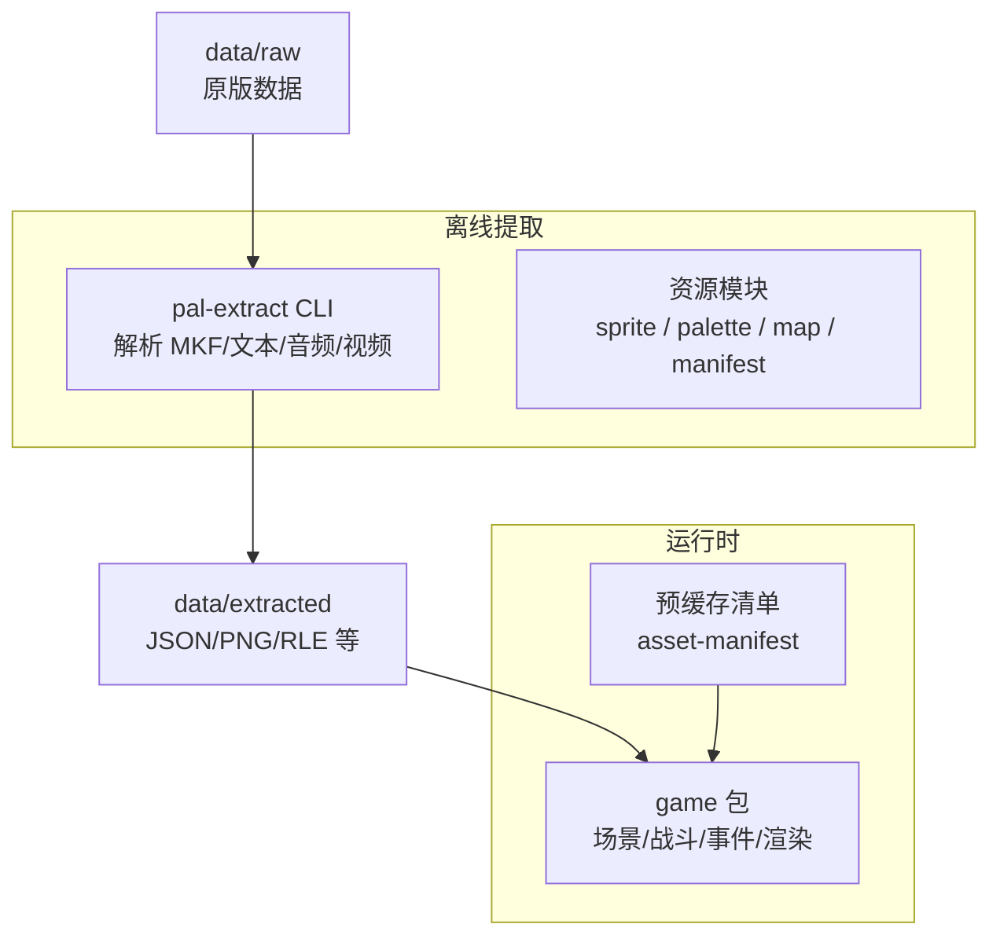
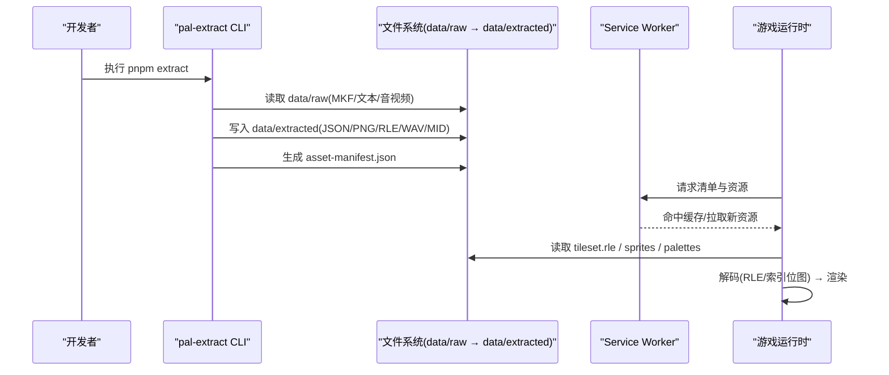
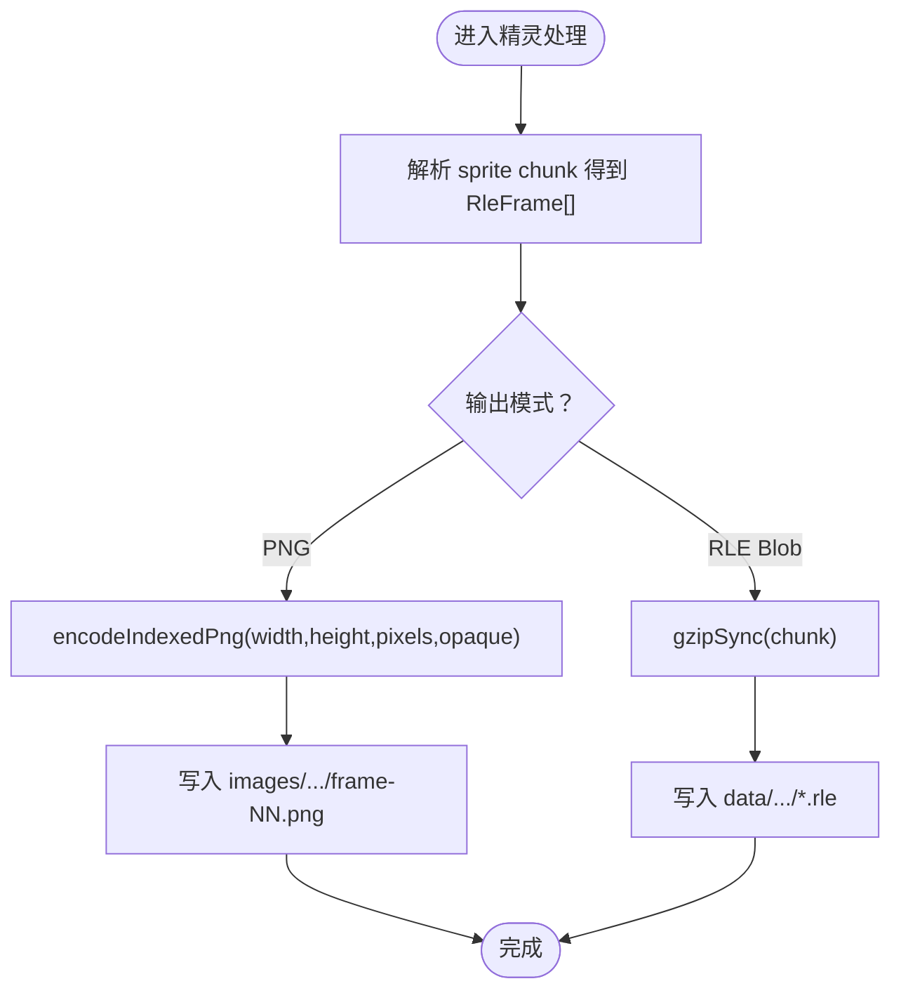
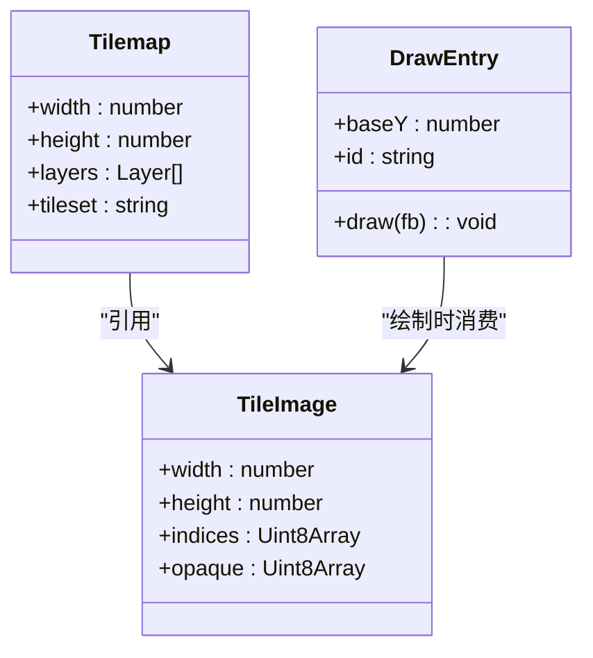
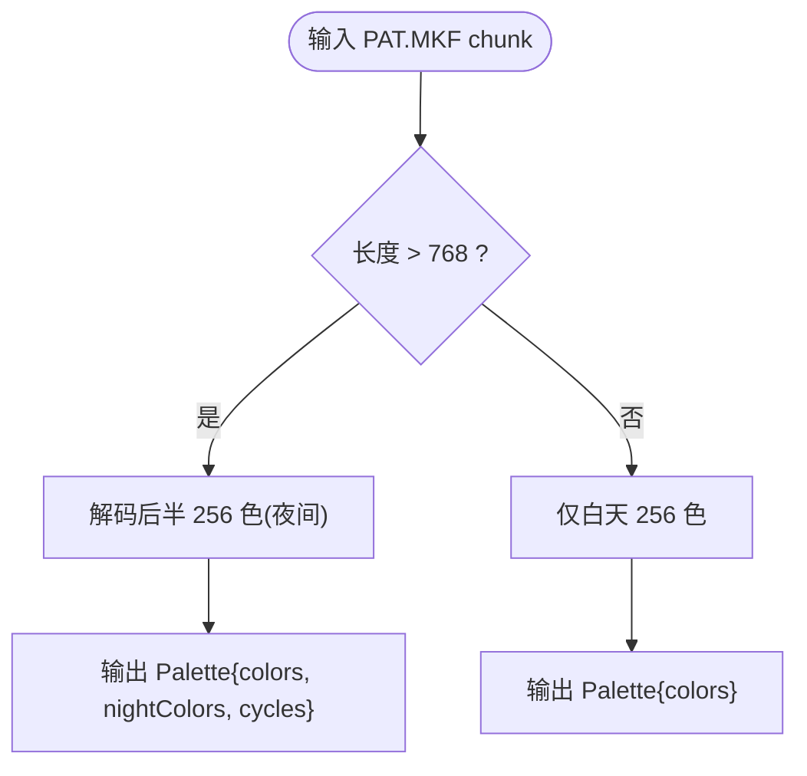
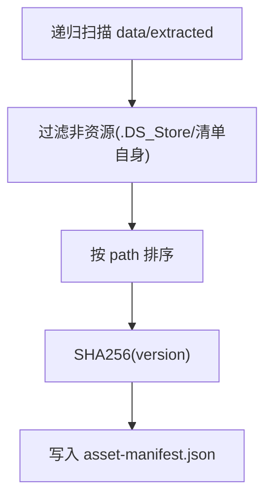
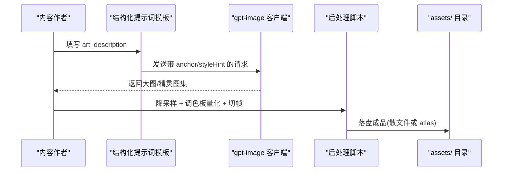
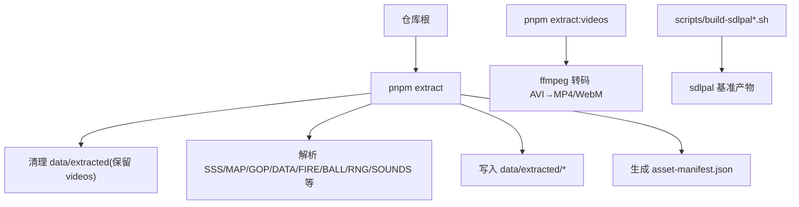
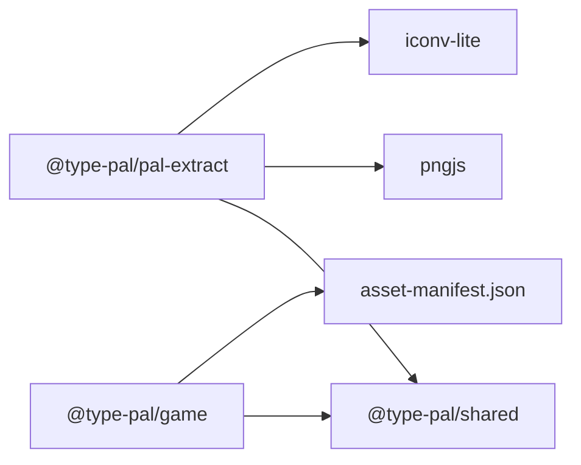

# 美术资产管线

<cite>
**本文引用的文件**   
- [README.md](file://README.md)
- [art-pipeline.md](file://docs/phase2/foundation/art-pipeline.md)
- [data/raw/README.md](file://data/raw/README.md)
- [package.json (pal-extract)](file://packages/pal-extract/package.json)
- [cli.ts](file://packages/pal-extract/src/cli.ts)
- [sprite.ts](file://packages/pal-extract/src/resources/sprite.ts)
- [palette.ts](file://packages/pal-extract/src/resources/palette.ts)
- [asset-manifest.ts](file://packages/pal-extract/src/resources/asset-manifest.ts)
- [map.ts](file://packages/pal-extract/src/resources/map.ts)
- [draw-tilemap.ts](file://packages/game/src/present/draw-tilemap.ts)
- [tileset-atlas-packing.md](file://docs/phase1/plans/2026-06-22-tileset-atlas-packing.md)
- [scripts/README.md](file://scripts/README.md)
</cite>

## 目录
1. [简介](#简介)
2. [项目结构](#项目结构)
3. [核心组件](#核心组件)
4. [架构总览](#架构总览)
5. [详细组件分析](#详细组件分析)
6. [依赖关系分析](#依赖关系分析)
7. [性能与优化](#性能与优化)
8. [故障排查指南](#故障排查指南)
9. [结论](#结论)
10. [附录](#附录)

## 简介
本文件面向“像素风生图与资源管线”的完整流程，覆盖从原始素材到游戏可用格式的转换、精灵图集生成与优化策略、地图瓦片管理系统、调色板管理、资产验证与质量检查工具使用，以及批量处理脚本与自动化工作流配置。文档基于仓库现有实现与计划文档进行系统化梳理，既提供工程级细节，也兼顾非技术读者的可读性。

## 项目结构
本项目采用多包 monorepo 组织：
- packages/pal-extract：离线资源提取与转码（MKF → JSON/PNG/RLE blob 等）
- packages/game：浏览器运行时（场景、战斗、事件、渲染、预缓存等）
- packages/shared：共享类型与数据结构
- docs：分阶段文档（含第二阶段美术管线设计）
- scripts：构建 sdlpal 基准、baseline 提取等辅助脚本
- data/raw：原版数据输入（不进 git）；data/extracted：提取产物（可再生）

图表来源
- [cli.ts:1-120](file://packages/pal-extract/src/cli.ts#L1-L120)
- [asset-manifest.ts:1-55](file://packages/pal-extract/src/resources/asset-manifest.ts#L1-L55)
- [README.md:110-139](file://README.md#L110-L139)

章节来源
- [README.md:110-139](file://README.md#L110-L139)

## 核心组件
- 资源提取器（CLI）：统一入口，负责读取 data/raw，输出 data/extracted，包含事件、数据表、图像、动画、音效、音乐、瓦片地图与调色板等。
- 精灵与帧处理：解析 sprite chunk，编码索引位图为 PNG，或输出 RLE blob 供运行时解码。
- 调色板解码：VGA 6-bit→RGB 8-bit，支持白天/夜间双半块。
- 瓦片地图系统：MAP.MKF + GOP.MKF 解析，按 mapNum 去重，RLE blob 存储与运行时解码。
- 资产清单与预缓存：扫描 extracted 根，生成版本化清单，驱动 Service Worker 预缓存。

章节来源
- [cli.ts:172-870](file://packages/pal-extract/src/cli.ts#L172-L870)
- [sprite.ts:1-86](file://packages/pal-extract/src/resources/sprite.ts#L1-L86)
- [palette.ts:1-38](file://packages/pal-extract/src/resources/palette.ts#L1-L38)
- [map.ts:1-23](file://packages/pal-extract/src/resources/map.ts#L1-L23)
- [asset-manifest.ts:1-55](file://packages/pal-extract/src/resources/asset-manifest.ts#L1-L55)

## 架构总览
整体分为“离线提取”和“运行时消费”两层。离线层将原版数据转换为现代格式并生成清单；运行时代码按需加载、解码、渲染。

图表来源
- [cli.ts:172-200](file://packages/pal-extract/src/cli.ts#L172-L200)
- [asset-manifest.ts:27-55](file://packages/pal-extract/src/resources/asset-manifest.ts#L27-L55)
- [README.md:71-78](file://README.md#L71-L78)

## 详细组件分析

### 精灵图集与帧处理
- 精灵帧解析：从 sprite chunk 解析出多帧 RLE 帧，支持 opaque mask 区分透明与 palette-0。
- 编码输出：可将索引位图编码为 PNG（R=palette index, A=opaque），或直接输出 gzip 压缩的 RLE blob 以减小体积与请求数。
- 关键路径：
  - framesToOut：逐帧编码 PNG
  - encodeIndexedPng：索引位图→PNG（RGBA，A 通道承载不透明度掩码）

图表来源
- [sprite.ts:25-58](file://packages/pal-extract/src/resources/sprite.ts#L25-L58)
- [cli.ts:729-740](file://packages/pal-extract/src/cli.ts#L729-L740)

章节来源
- [sprite.ts:1-86](file://packages/pal-extract/src/resources/sprite.ts#L1-L86)
- [cli.ts:729-740](file://packages/pal-extract/src/cli.ts#L729-L740)

### 地图瓦片管理系统
- 数据源：MAP.MKF（YJ2 压缩）+ GOP.MKF（sprite chunk，RLE）。
- 解析：按行/列/层布局解析，支持 h sub-row 偏移与 Y-sort。
- 存储优化：每地图一个 gzip 压缩的原始 RLE 数据块（.rle），替代 per-tile PNG，显著降低体积与请求数。
- 运行时：fetch .rle → DecompressionStream(gzip) → parseSpriteChunk → Map<index, TileImage>。

图表来源
- [map.ts:1-23](file://packages/pal-extract/src/resources/map.ts#L1-L23)
- [draw-tilemap.ts:1-33](file://packages/game/src/present/draw-tilemap.ts#L1-L33)
- [tileset-atlas-packing.md:36-66](file://docs/phase1/plans/2026-06-22-tileset-atlas-packing.md#L36-L66)

章节来源
- [map.ts:1-23](file://packages/pal-extract/src/resources/map.ts#L1-L23)
- [draw-tilemap.ts:1-33](file://packages/game/src/present/draw-tilemap.ts#L1-L33)
- [tileset-atlas-packing.md:1-127](file://docs/phase1/plans/2026-06-22-tileset-atlas-packing.md#L1-L127)

### 调色板管理系统
- 解码：VGA 6-bit→RGB 8-bit，支持白天/夜间双半块（1536B chunk）。
- 循环段：cycles 字段预留，当前返回空数组，后续可按需扩展。
- 使用：运行时根据场景/状态切换白天/夜间调色板，保持忠实还原。

图表来源
- [palette.ts:32-37](file://packages/pal-extract/src/resources/palette.ts#L32-L37)

章节来源
- [palette.ts:1-38](file://packages/pal-extract/src/resources/palette.ts#L1-L38)

### 资产清单与预缓存
- 清单生成：遍历 extracted 根，过滤非资源文件，排序后计算版本哈希，输出 version/totalBytes/fileCount/files。
- 预缓存：运行时通过清单向 Service Worker 注册，首次加载后可离线游玩。

图表来源
- [asset-manifest.ts:27-55](file://packages/pal-extract/src/resources/asset-manifest.ts#L27-L55)

章节来源
- [asset-manifest.ts:1-55](file://packages/pal-extract/src/resources/asset-manifest.ts#L1-L55)

### 像素风生图流程（第二阶段）
- 静态资产：单图 prompt → 降采样到目标尺寸 → 受限调色板量化 → 输出。
- 动画资产：sprite sheet prompt（N×M 网格）→ 代码切帧 → 降采样 + 调色板量化。
- 风格锚定：anchor 参考图 + styleHint + 结构化 prompt 注入，确保一致性。
- 斜 45° 视角：待实验验证，必要时引入 ControlNet/LoRA 提升稳定性。

图表来源
- [art-pipeline.md:95-130](file://docs/phase2/foundation/art-pipeline.md#L95-L130)
- [art-pipeline.md:145-176](file://docs/phase2/foundation/art-pipeline.md#L145-L176)
- [art-pipeline.md:248-257](file://docs/phase2/foundation/art-pipeline.md#L248-L257)

章节来源
- [art-pipeline.md:1-268](file://docs/phase2/foundation/art-pipeline.md#L1-L268)

### 批量处理与自动化工作流
- 提取命令：pnpm extract 清理旧产物、全量解析 MKF、写 JSON/PNG/RLE/WAV/MID 等，并生成清单。
- 视频提取：pnpm --filter @type-pal/pal-extract extract:videos（ffmpeg 转 mp4/webm）。
- 基准构建：scripts/build-sdlpal.sh 与 build-sdlpal-classic.sh 用于差分测试。
- 清单与预缓存：asset-manifest 由提取流程产出，运行时 SW 消费。

图表来源
- [cli.ts:172-200](file://packages/pal-extract/src/cli.ts#L172-L200)
- [package.json (pal-extract):6-13](file://packages/pal-extract/package.json#L6-L13)
- [scripts/README.md:5-19](file://scripts/README.md#L5-L19)

章节来源
- [cli.ts:172-200](file://packages/pal-extract/src/cli.ts#L172-L200)
- [package.json (pal-extract):1-27](file://packages/pal-extract/package.json#L1-L27)
- [scripts/README.md:1-26](file://scripts/README.md#L1-L26)

## 依赖关系分析
- pal-extract 依赖 shared 类型与函数（如 parseSpriteChunk、decodeRngFrames），并通过 pngjs/iconv-lite 等库完成编解码与字符集转换。
- game 包依赖 shared 类型，消费 extracted 产物（JSON/PNG/RLE），在运行时解码与渲染。
- 清单与预缓存由 asset-manifest 生成，运行时 SW 消费。

图表来源
- [package.json (pal-extract):14-25](file://packages/pal-extract/package.json#L14-L25)
- [asset-manifest.ts:1-55](file://packages/pal-extract/src/resources/asset-manifest.ts#L1-L55)

章节来源
- [package.json (pal-extract):1-27](file://packages/pal-extract/package.json#L1-L27)
- [asset-manifest.ts:1-55](file://packages/pal-extract/src/resources/asset-manifest.ts#L1-L55)

## 性能与优化
- 瓦片图集优化：用 gzip 压缩的原始 RLE blob 替代 per-tile PNG，体积与请求数显著下降，且避免 createImageBitmap 解码开销。
- 精灵与动画：优先输出 RLE blob，运行时按需解码；UI 图标与物品图标在规模扩大时可考虑 atlas 打包减少请求。
- 预缓存：清单版本化，SW 自动失效与增量更新，避免重复下载。
- 纹理压缩：现阶段以 RLE+gzip 为主；未来可评估 brotli 与平台原生压缩（需服务器 Content-Encoding 支持）。

章节来源
- [tileset-atlas-packing.md:1-127](file://docs/phase1/plans/2026-06-22-tileset-atlas-packing.md#L1-L127)
- [art-pipeline.md:248-257](file://docs/phase2/foundation/art-pipeline.md#L248-L257)

## 故障排查指南
- 提取失败（MKF/YJ2 解压）：检查 data/raw 完整性与权限；关注 cli.ts 中 YJ2 解压 try/catch 分支日志。
- 瓦片错位：确认 tileset 键一致性（parseSpriteChunk 下标 == 旧 tile-{index} 编号），参考 tileset-atlas-packing 迁移步骤。
- 预缓存未生效：核对 asset-manifest.json 是否生成且未被 .DS_Store 污染；确认 SW 上下文可用。
- 视频缺失：确认 videos 目录未被清理（PRESERVE 列表），重新执行 extract:videos。

章节来源
- [cli.ts:634-640](file://packages/pal-extract/src/cli.ts#L634-L640)
- [tileset-atlas-packing.md:86-100](file://docs/phase1/plans/2026-06-22-tileset-atlas-packing.md#L86-L100)
- [asset-manifest.ts:20-25](file://packages/pal-extract/src/resources/asset-manifest.ts#L20-L25)
- [cli.ts:176-188](file://packages/pal-extract/src/cli.ts#L176-L188)

## 结论
本管线以“离线提取 + 运行时消费”为核心，结合 RLE blob 与清单预缓存，实现了高保真与高性能的资源交付。第二阶段的美术生图流程强调风格一致性与可批量化，配合降采样与调色板量化，形成从 AI 生成到游戏可用的闭环。建议在生产环境持续监控清单体积与 SW 预缓存时间，并在规模化后引入 atlas 与跨地图去重进一步优化。

## 附录
- 原始数据说明：data/raw 存放原版数据，不进 git；提取产物位于 data/extracted。
- 常用命令：见 README 快速开始与常用命令部分。

章节来源
- [data/raw/README.md:1-45](file://data/raw/README.md#L1-L45)
- [README.md:66-97](file://README.md#L66-L97)