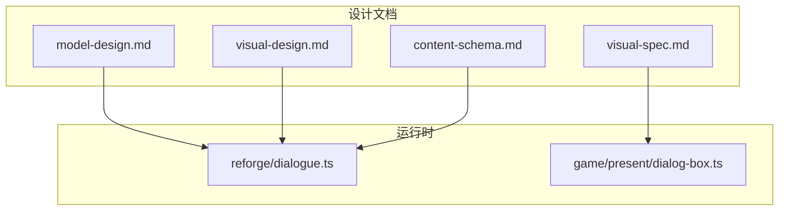
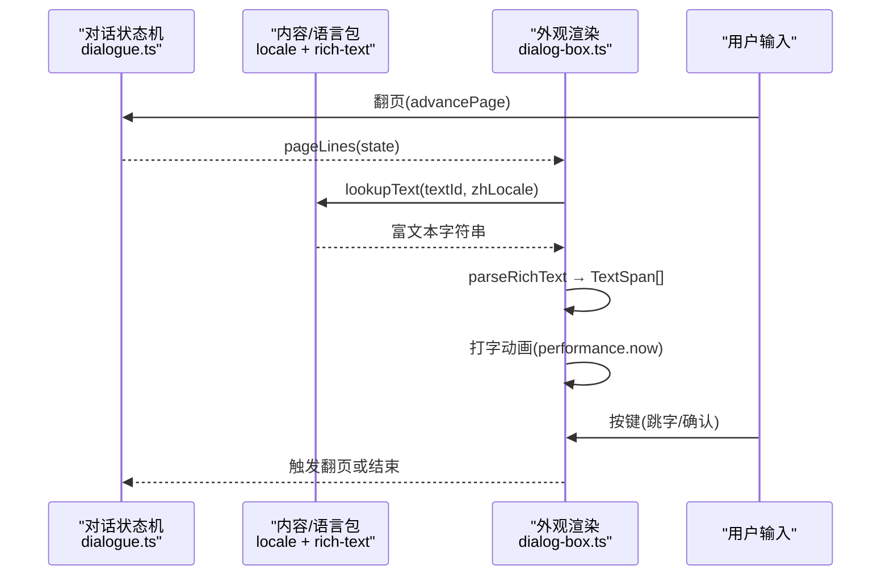
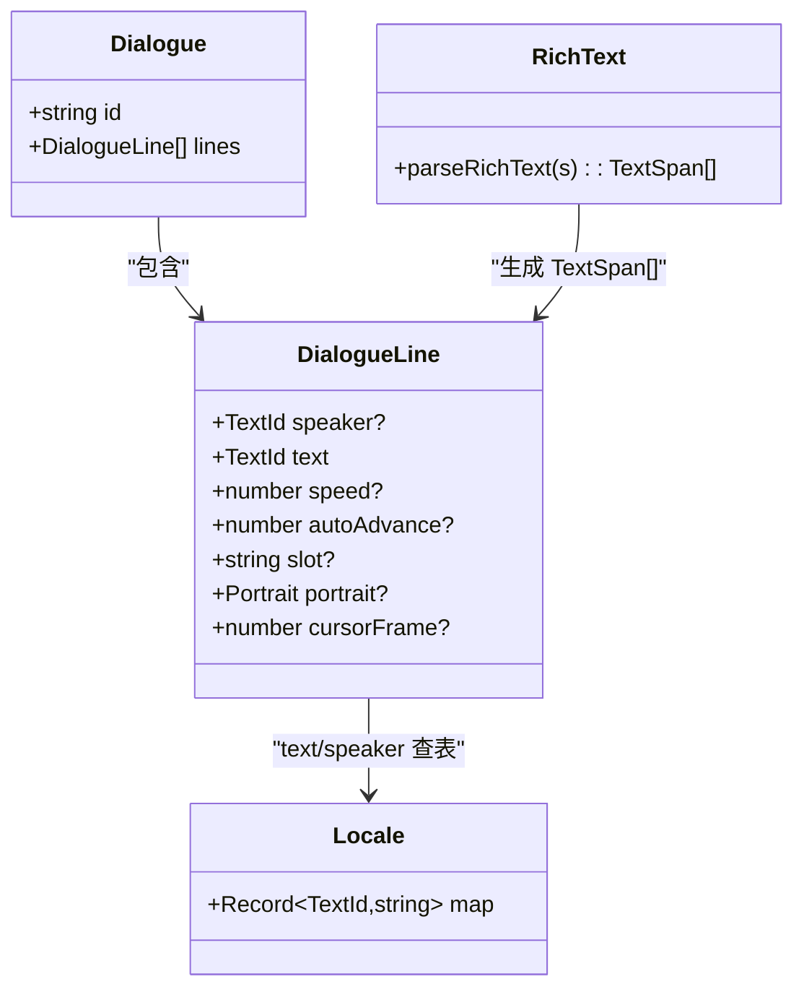
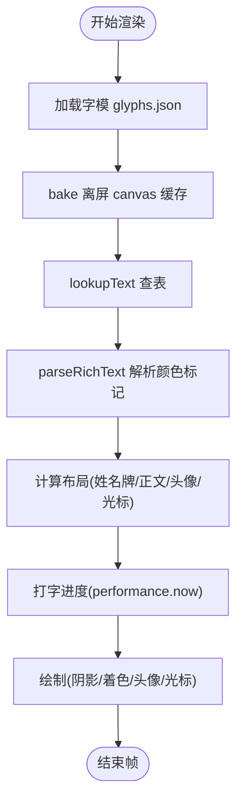
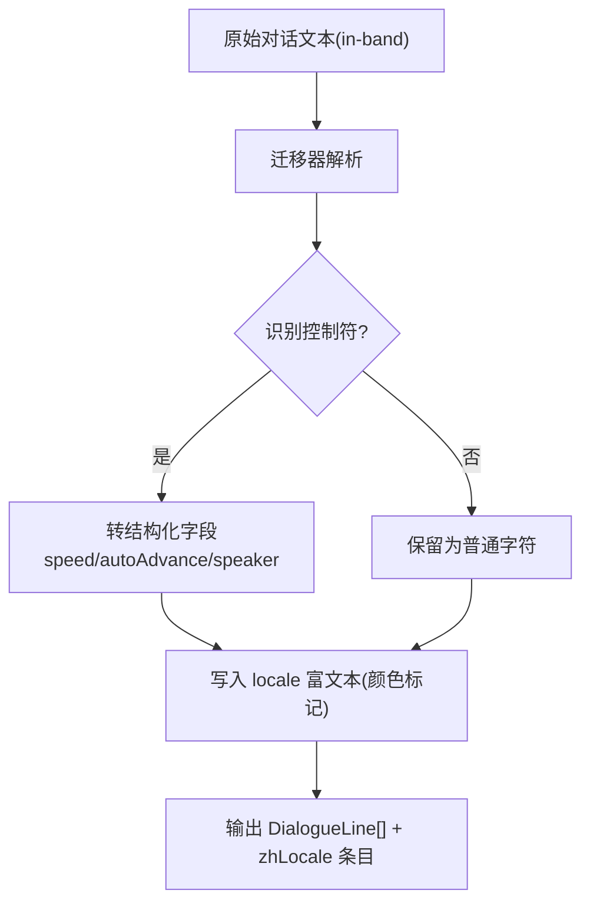
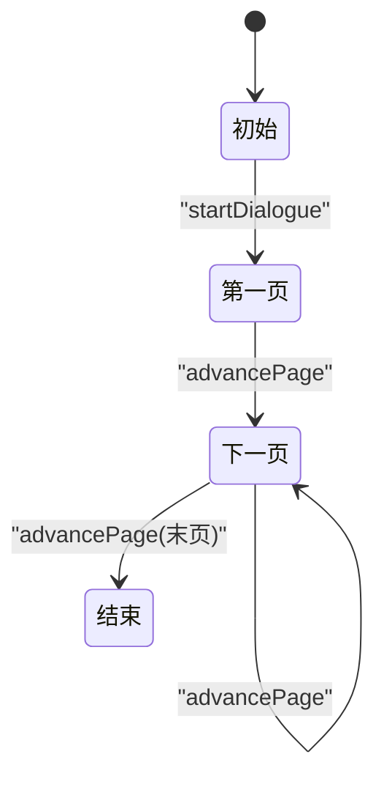
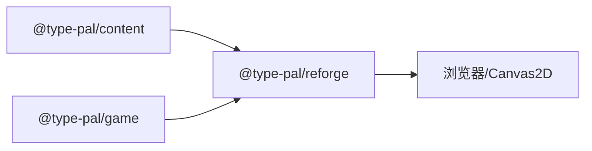

# 对话系统

<cite>
**本文引用的文件**   
- [model-design.md](file://docs/phase2/dialogue/model-design.md)
- [visual-design.md](file://docs/phase2/dialogue/visual-design.md)
- [visual-spec.md](file://docs/phase2/dialogue/visual-spec.md)
- [content-schema.md](file://docs/phase2/foundation/content-schema.md)
- [dialogue.ts](file://packages/reforge/src/dialogue.ts)
- [dialog-box.ts](file://packages/game/src/present/dialog-box.ts)
</cite>

## 目录
1. [简介](#简介)
2. [项目结构](#项目结构)
3. [核心组件](#核心组件)
4. [架构总览](#架构总览)
5. [详细组件分析](#详细组件分析)
6. [依赖关系分析](#依赖关系分析)
7. [性能考量](#性能考量)
8. [故障排查指南](#故障排查指南)
9. [结论](#结论)
10. [附录](#附录)

## 简介
本文件为“对话系统”的完整技术文档，围绕三刀实现策略展开：数据结构化（model）、外观实现（visual）、迁移器（migration）。重点说明对话数据模型设计（去除 in-band 控制符、国际化支持、slot 机制），视觉设计规范（对话框外观真值参考、Canvas2D 适配方案、slot 共存策略），并提供 TDD 实现计划与验收标准。最后给出集成方法与扩展接口，帮助读者快速落地并扩展对话系统。

## 项目结构
对话系统相关设计与实现分布在 docs 与 packages 两个区域：
- 设计文档位于 docs/phase2/dialogue 与 docs/phase2/foundation，定义模型、外观规范与内容 schema。
- 运行时状态机位于 packages/reforge/src/dialogue.ts；原版外观与交互逻辑参考 packages/game/src/present/dialog-box.ts。

图表来源
- [model-design.md:1-149](file://docs/phase2/dialogue/model-design.md#L1-L149)
- [visual-design.md:1-140](file://docs/phase2/dialogue/visual-design.md#L1-L140)
- [visual-spec.md:1-233](file://docs/phase2/dialogue/visual-spec.md#L1-L233)
- [content-schema.md:1-140](file://docs/phase2/foundation/content-schema.md#L1-L140)
- [dialogue.ts:1-27](file://packages/reforge/src/dialogue.ts#L1-L27)
- [dialog-box.ts:1-800](file://packages/game/src/present/dialog-box.ts#L1-L800)

章节来源
- [model-design.md:1-149](file://docs/phase2/dialogue/model-design.md#L1-L149)
- [visual-design.md:1-140](file://docs/phase2/dialogue/visual-design.md#L1-L140)
- [visual-spec.md:1-233](file://docs/phase2/dialogue/visual-spec.md#L1-L233)
- [content-schema.md:1-140](file://docs/phase2/foundation/content-schema.md#L1-L140)
- [dialogue.ts:1-27](file://packages/reforge/src/dialogue.ts#L1-L27)
- [dialog-box.ts:1-800](file://packages/game/src/present/dialog-box.ts#L1-L800)

## 核心组件
- 结构化数据模型（DialogueLine / Dialogue）：以 TextId 指向 i18n locale 表，功能字段 speed/autoAdvance 表达打字速度与尾停顿自动推进，speaker 表达姓名牌。
- 富文本解析（parseRichText）：locale 中的颜色标记 <cyan>/<red>/<yellow> 等成对闭合标签，解析为 TextSpan[]，供渲染层着色。
- 状态机（start/pageLines/advancePage）：按显示行容量分页，纯函数驱动翻页，时间驱动的打字与 autoAdvance 在渲染层处理。
- 外观继承（Canvas2D 适配）：透明框、姓名牌、头像、光标、逐字打字、三层阴影、位置常量均对齐 sdlpal 真值。
- slot 共存：top/bottom 多面板同屏共存，显式 slot 数据驱动布局，避免隐式魔法。

章节来源
- [model-design.md:34-109](file://docs/phase2/dialogue/model-design.md#L34-L109)
- [visual-design.md:29-96](file://docs/phase2/dialogue/visual-design.md#L29-L96)
- [visual-spec.md:32-128](file://docs/phase2/dialogue/visual-spec.md#L32-L128)
- [dialogue.ts:1-27](file://packages/reforge/src/dialogue.ts#L1-L27)
- [dialog-box.ts:98-145](file://packages/game/src/present/dialog-box.ts#L98-L145)

## 架构总览
对话系统采用“数据-行为-外观”分层：
- 数据层：DialogueLine/Dialogue + locale 查表 + parseRichText。
- 行为层：对话状态机（分页、翻页），纯函数，不含时间态。
- 外观层：Canvas2D 渲染，负责打字时序、autoAdvance、slot 布局、头像/姓名牌/光标绘制。

图表来源
- [dialogue.ts:1-27](file://packages/reforge/src/dialogue.ts#L1-L27)
- [dialog-box.ts:98-145](file://packages/game/src/present/dialog-box.ts#L98-L145)
- [model-design.md:100-109](file://docs/phase2/dialogue/model-design.md#L100-L109)

## 详细组件分析

### 数据模型（model）
- 去除 in-band 控制符：将 $NN/~NN/末尾冒号/颜色 toggle 等功能从文本中剥离，转为结构化字段与 locale 富文本标记。
- 国际化：正文与人名走 TextId，统一由 locale 表提供富文本字符串；颜色标记仅样式语义，不混入功能。
- slot 机制：显式指定 top/bottom 面板，支持双框共存；复杂清屏编排留给演出系统。

图表来源
- [model-design.md:34-86](file://docs/phase2/dialogue/model-design.md#L34-L86)
- [visual-design.md:60-96](file://docs/phase2/dialogue/visual-design.md#L60-L96)

章节来源
- [model-design.md:34-109](file://docs/phase2/dialogue/model-design.md#L34-L109)
- [visual-design.md:60-96](file://docs/phase2/dialogue/visual-design.md#L60-L96)

### 外观实现（visual）
- 真值参考：位置、色值、打字速度、光标形态、阴影、分页行数等均以 sdlpal 真值为基准。
- Canvas2D 适配：字模 bake 离屏 canvas、字体色映射 palette、三层阴影、光标闪烁、头像加载与布局。
- slot 共存：显式 slot 数据驱动 top/bottom 同屏共存；每槽独立状态与渲染。

图表来源
- [visual-spec.md:32-128](file://docs/phase2/dialogue/visual-spec.md#L32-L128)
- [visual-design.md:45-96](file://docs/phase2/dialogue/visual-design.md#L45-L96)

章节来源
- [visual-spec.md:32-128](file://docs/phase2/dialogue/visual-spec.md#L32-L128)
- [visual-design.md:45-96](file://docs/phase2/dialogue/visual-design.md#L45-L96)

### 迁移器（migration）
- 目标：一次性解析原版 in-band 控制符，产出结构化 DialogueLine 与 locale zh 条目。
- 映射要点：
  - 颜色 toggle → locale 富文本标记 <cyan>/<red>/<yellow>
  - $NN → line.speed(ms/字)
  - ~NN → line.autoAdvance(ms)
  - 末尾冒号 → line.speaker(TextId)
  - 分页/分行 → lines[] + 渲染层按容量分页
- 验证：一段原版对话在 reforge 正确显示（颜色/停顿/姓名），locale 有 zh 文本。

图表来源
- [model-design.md:69-86](file://docs/phase2/dialogue/model-design.md#L69-L86)

章节来源
- [model-design.md:69-86](file://docs/phase2/dialogue/model-design.md#L69-L86)

### 状态机与分页
- 状态机职责：只管理当前页的行集合与翻页，纯函数，无隐式等待态。
- 分页策略：由渲染层按对话框容量计算 linesPerPage，默认 1 便于过渡，② 外观落地后传入真实容量（如 4 行）。
- 关键 API：startDialogue、pageLines、advancePage。

图表来源
- [dialogue.ts:1-27](file://packages/reforge/src/dialogue.ts#L1-L27)
- [model-design.md:110-118](file://docs/phase2/dialogue/model-design.md#L110-L118)

章节来源
- [dialogue.ts:1-27](file://packages/reforge/src/dialogue.ts#L1-L27)
- [model-design.md:110-118](file://docs/phase2/dialogue/model-design.md#L110-L118)

### 视觉真值与交互细节
- 打字速度：24ms/字，流畅逐字；与逻辑主循环解耦，使用 wall-clock 驱动。
- 自动播放：autoAdvance 尾停顿不可加速，进入尾停顿后按键 noop。
- 姓名牌：CYAN_ALT 色，独立位置，不计入正文行。
- 光标：DATA chunk 12，3 形态轮换，画在当前行末尾，非固定右下角。
- 分页：MAX_LINES_PER_PAGE = 4，第 5 行触发等键翻页。

章节来源
- [visual-spec.md:57-128](file://docs/phase2/dialogue/visual-spec.md#L57-L128)
- [dialog-box.ts:36-145](file://packages/game/src/present/dialog-box.ts#L36-L145)

## 依赖关系分析
- content 层提供类型与纯函数（TextId、DialogColor、TextSpan、parseRichText、lookupText、zhLocale）。
- reforge 层消费 content，实现状态机与最小渲染适配。
- game 层提供 sdlpal 真值参考与外观实现细节，作为 reforge 外观移植的依据。

图表来源
- [model-design.md:100-109](file://docs/phase2/dialogue/model-design.md#L100-L109)
- [visual-design.md:29-44](file://docs/phase2/dialogue/visual-design.md#L29-L44)

章节来源
- [model-design.md:100-109](file://docs/phase2/dialogue/model-design.md#L100-L109)
- [visual-design.md:29-44](file://docs/phase2/dialogue/visual-design.md#L29-L44)

## 性能考量
- 打字动画与逻辑主循环解耦：使用 performance.now 计算 charsShown，避免 10fps 采样导致的卡顿。
- 字模 bake 离屏 canvas：减少重复解码开销，提升绘制性能。
- 分页与布局：按显示行容量计算，避免写死分辨率限制，提高可移植性。
- autoAdvance 尾停顿不可加速：忠实 sdlpal 同步阻塞语义，避免无限重置导致卡死。

章节来源
- [visual-spec.md:92-128](file://docs/phase2/dialogue/visual-spec.md#L92-L128)
- [visual-design.md:45-58](file://docs/phase2/dialogue/visual-design.md#L45-L58)

## 故障排查指南
- “按一下全显”丢失：确保 fUserSkip 跨行持续语义，一次按键在同逻辑步内完成连锁瞬显，不要拆成多个 tick。
- `~NN` 尾行按 Confirm 卡死：跳字后只等尾停顿，不再重设 lineStartMs；已进入尾停顿后再按 Confirm 应返回 noop。
- 打字卡顿：检查 wall-clock 驱动是否正确传入 now，避免回退到 tick 驱动。

章节来源
- [visual-spec.md:129-193](file://docs/phase2/dialogue/visual-spec.md#L129-L193)
- [dialog-box.ts:453-562](file://packages/game/src/present/dialog-box.ts#L453-L562)

## 结论
通过三刀策略，对话系统实现了数据与外观解耦、i18n 一等公民、slot 共存与外观真值继承。状态机保持纯函数，时间驱动归渲染层，既保证可测试性又还原原版体验。迁移器将旧引擎控制符转化为结构化数据，为后续批量迁移奠定基础。

## 附录

### TDD 实现计划与验收标准（摘要）
- 任务 1：颜色富文本解析 parseRichText + 行内类型（TextSpan/DialogColor），单测覆盖纯文本、颜色标记、未闭合标记契约。
- 任务 2：locale 查表 lookupText + zhLocale 骨架，单测命中/未命中回退。
- 任务 3：DialogueLine 结构化 + 状态机按容量分页（start/pageLines/advancePage），单测覆盖默认 1 行/页与 linesPerPage=4。
- 任务 4：鬼话内容迁 textId + 填 zhLocale，textId 完整性守护测试。
- 任务 5：main.ts 渲染适配（查 locale + 分页 API + 多行框），浏览器验收中文显示与翻页。

验收标准
- 鬼话照常跑（走 locale）+ 单测覆盖状态机（分页/自动推进/瞬显）+ 查表。
- 外观继承：透明框/姓名牌/打字/字模/光标/阴影，数据源 = 结构化 + locale。
- 迁移器：一段原版对话在 reforge 正确显示（颜色/停顿/姓名），locale 有 zh 文本。

章节来源
- [model-plan.md:40-634](file://docs/phase2/dialogue/model-plan.md#L40-L634)

### 集成方法与扩展接口
- 集成步骤
  - 在场景数据中引用 Dialogue（id + lines），lines 的 text/speaker 均为 TextId。
  - 在 zhLocale 中填充对应富文本字符串（可含颜色标记）。
  - 启动对话时调用 startDialogue，渲染层用 pageLines 获取当前页，按键调用 advancePage。
  - 渲染层根据 slot/portrait/cursorFrame/speed/autoAdvance 进行布局与动画。
- 扩展接口
  - 新增 slot：在 DialogueLine 增加 slot 字段，渲染层维护多槽状态。
  - 新增颜色：在 DialogColor 扩展语义名，locale 富文本使用对应标记。
  - 新增头像：在 portrait 字段指定 icon 与 side，渲染层加载 PNG 并绘制。
  - 新增光标形态：cursorFrame 支持更多形态，渲染层切换图标帧。

章节来源
- [visual-design.md:60-96](file://docs/phase2/dialogue/visual-design.md#L60-L96)
- [visual-spec.md:194-214](file://docs/phase2/dialogue/visual-spec.md#L194-L214)