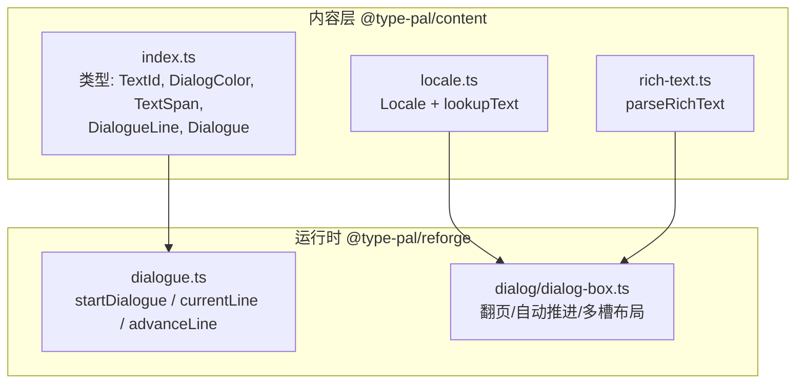
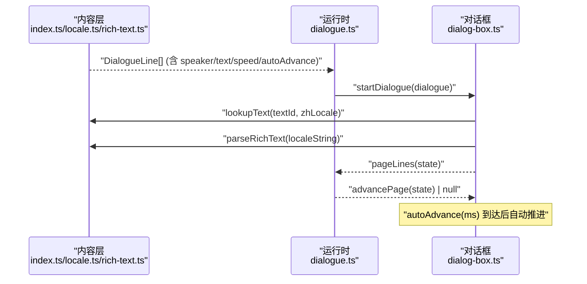
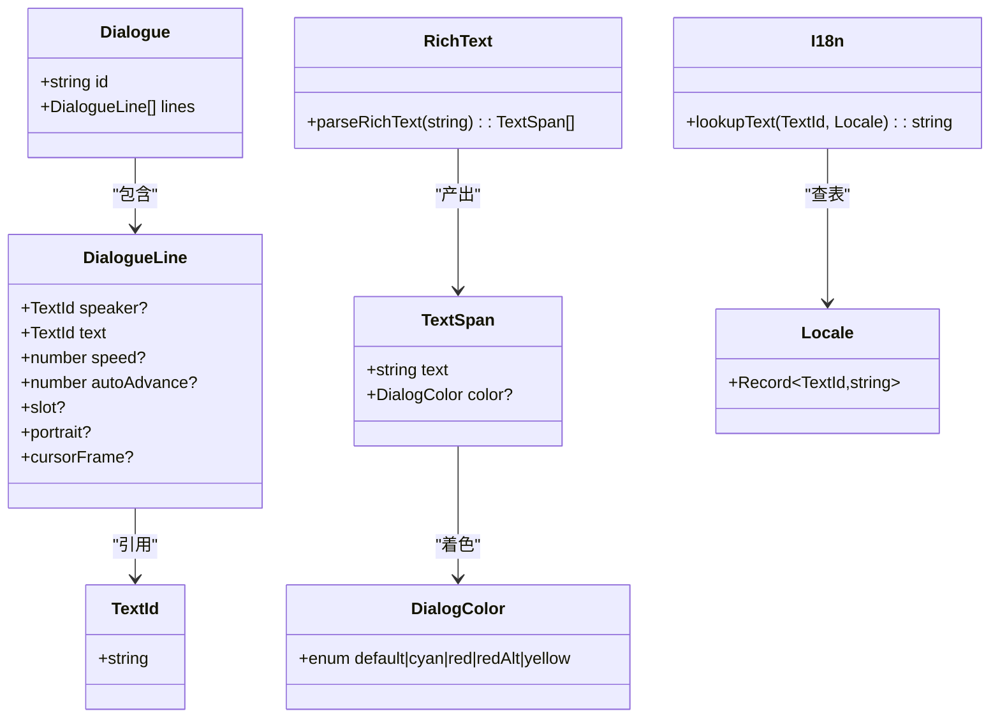
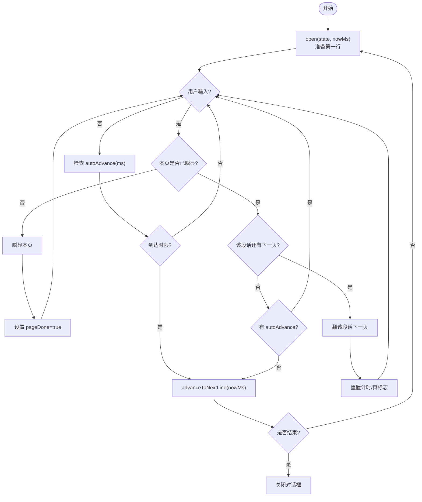
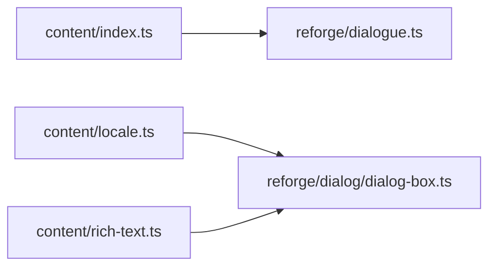

# 数据模型设计

<cite>
**本文引用的文件**
- [model-design.md](file://docs/phase2/dialogue/model-design.md)
- [model-plan.md](file://docs/phase2/dialogue/model-plan.md)
- [index.ts](file://packages/content/src/index.ts)
- [locale.ts](file://packages/content/src/locale.ts)
- [rich-text.ts](file://packages/content/src/rich-text.ts)
- [dialogue.ts](file://packages/reforge/src/dialogue.ts)
- [dialog-box.ts](file://packages/reforge/src/dialog/dialog-box.ts)
</cite>

## 目录
1. [引言](#引言)
2. [项目结构](#项目结构)
3. [核心组件](#核心组件)
4. [架构总览](#架构总览)
5. [详细组件分析](#详细组件分析)
6. [依赖关系分析](#依赖关系分析)
7. [性能考量](#性能考量)
8. [故障排查指南](#故障排查指南)
9. [结论](#结论)
10. [附录：TypeScript 类型与使用模式](#附录typescript-类型与使用模式)

## 引言
本文件围绕对话系统的数据模型进行系统化说明，重点覆盖以下目标：
- DialogueLine 与 Dialogue 接口的设计要点：speaker、text、speed、autoAdvance 字段的作用与类型定义。
- i18n 一等公民策略：TextId 机制、locale 表结构与富文本颜色标记规范。
- in-band 控制符到结构化字段的映射：~NN/$NN/" 等原版控制符如何转换为结构化字段。
- 分页与自动推进的状态机设计原则。
- 具体 TypeScript 类型定义示例与使用模式。
- 与现有 reforge/dialogue.ts 的集成方案。

## 项目结构
本次文档聚焦于内容层（content）与运行时（reforge）中与对话相关的模块：
- 内容层（@type-pal/content）
  - index.ts：导出 TextId、DialogColor、TextSpan、DialogueLine、Dialogue 等核心类型。
  - locale.ts：Locale 类型与 lookupText 查表函数。
  - rich-text.ts：parseRichText 解析富文本颜色标记。
- 运行时（@type-pal/reforge）
  - dialogue.ts：对话序列指针状态机（逐行推进）。
  - dialog/dialog-box.ts：对话框渲染与翻页、自动推进、多槽布局等交互逻辑。



图示来源
- [index.ts:15-47](file://packages/content/src/index.ts#L15-L47)
- [locale.ts:1-10](file://packages/content/src/locale.ts#L1-L10)
- [rich-text.ts:1-25](file://packages/content/src/rich-text.ts#L1-L25)
- [dialogue.ts:1-27](file://packages/reforge/src/dialogue.ts#L1-L27)
- [dialog-box.ts:92-171](file://packages/reforge/src/dialog/dialog-box.ts#L92-L171)

章节来源
- [model-design.md:1-149](file://docs/phase2/dialogue/model-design.md#L1-L149)
- [model-plan.md:1-634](file://docs/phase2/dialogue/model-plan.md#L1-L634)

## 核心组件
本节从数据结构、i18n 策略、控制符映射、状态机四个维度展开。

### DialogueLine 与 Dialogue 接口
- DialogueLine
  - speaker?: TextId
    - 说话人名的稳定 id；省略表示旁白或心理活动。
  - text: TextId
    - 正文文本的稳定 id，指向 locale 表的富文本字符串。
  - speed?: number
    - 打字速度，单位毫秒/字；省略时使用默认值。对应原版的 $NN。
  - autoAdvance?: number
    - 尾停顿并自动推进，单位毫秒；存在时打完停 N ms 自动进入下一行，不等键。对应原版的 ~NN。
  - 其他扩展字段（如 slot/portrait/cursorFrame）为后续外观与交互预留，当前以可选形式存在。
- Dialogue
  - id: string
  - lines: DialogueLine[]

这些字段将“功能/结构控制”与“文本内容”解耦，使运行时只消费结构化字段并按 locale 查表获取文本。

章节来源
- [index.ts:32-47](file://packages/content/src/index.ts#L32-L47)
- [model-design.md:38-52](file://docs/phase2/dialogue/model-design.md#L38-L52)

### i18n 一等公民策略：TextId 与 locale 表
- TextId
  - 稳定的文本标识符，运行时按当前语言环境查表。
- Locale 表
  - 单语言文本表：Record<TextId, string>。
  - 支持富文本颜色标记（见下节），但仅用于样式，不承载功能控制。
- lookupText(id, locale)
  - 查表函数；未命中时回退返回 id 本身，便于开发期发现缺失条目。

章节来源
- [index.ts:15-25](file://packages/content/src/index.ts#L15-L25)
- [locale.ts:1-10](file://packages/content/src/locale.ts#L1-L10)
- [model-design.md:88-98](file://docs/phase2/dialogue/model-design.md#L88-L98)

### 富文本颜色标记规范
- 语义化标签：<cyan>、<red>、<redAlt>、<yellow>，成对闭合，非嵌套。
- parseRichText(s): TextSpan[]
  - 将富文本串解析为同色片段数组；无标记或空串返回单段。
  - 未闭合标签按纯文本处理，保证健壮性。
- 渲染层负责将语义名映射到调色板索引（避免魔法数）。

章节来源
- [rich-text.ts:1-25](file://packages/content/src/rich-text.ts#L1-L25)
- [model-design.md:54-67](file://docs/phase2/dialogue/model-design.md#L54-L67)

### in-band 控制符到结构化字段的映射
迁移器在数据生产期完成转换，运行时不再解析原版控制符：
- 颜色 toggle（`"` 等）→ locale 富文本中的 <color> 标记。
- `$NN` → line.speed（ms/字）。
- `~NN` → line.autoAdvance（ms）。
- 末尾冒号（首行且非居中）→ line.speaker（TextId）。
- 每句 = 一行；4 行/页 → 由渲染层按容量分页，不在模型中写死。
- 等键光标形态（`)`/`(`）→ cursorFrame?（可选，渲染细节）。

章节来源
- [model-design.md:69-86](file://docs/phase2/dialogue/model-design.md#L69-L86)

### 分页与自动推进的状态机设计原则
- 对话是行的序列；分页由渲染层按对话框容量计算，不写死“4 行/页”。
- autoAdvance 行：打完停 N ms 自动进下一行，不画光标、不等键。
- 状态机保持纯函数，不塞隐式等待态；打字时钟与逻辑主循环解耦。
- 一次按键在当前页一次性连锁瞬显，避免“每行一个 tick”的问题。

章节来源
- [model-design.md:110-118](file://docs/phase2/dialogue/model-design.md#L110-L118)

## 架构总览
下图展示从内容到运行的关键路径：内容层提供结构化 DialogueLine 与 locale 表；运行时通过状态机管理对话推进，并在渲染层实现分页与时间驱动效果。



图示来源
- [index.ts:32-47](file://packages/content/src/index.ts#L32-L47)
- [locale.ts:1-10](file://packages/content/src/locale.ts#L1-L10)
- [rich-text.ts:1-25](file://packages/content/src/rich-text.ts#L1-L25)
- [dialogue.ts:1-27](file://packages/reforge/src/dialogue.ts#L1-L27)
- [dialog-box.ts:92-171](file://packages/reforge/src/dialog/dialog-box.ts#L92-L171)

## 详细组件分析

### 内容层：类型与工具
- 类型定义
  - TextId：稳定文本 id。
  - DialogColor：语义颜色名（default/cyan/red/redAlt/yellow）。
  - TextSpan：同色文本片段（渲染中间表示）。
  - DialogueLine：包含 speaker/text/speed/autoAdvance 等字段。
  - Dialogue：id + lines。
- 工具函数
  - lookupText(id, locale)：查表，未命中回退 id。
  - parseRichText(s)：解析富文本颜色标记。



图示来源
- [index.ts:15-47](file://packages/content/src/index.ts#L15-L47)
- [locale.ts:1-10](file://packages/content/src/locale.ts#L1-L10)
- [rich-text.ts:1-25](file://packages/content/src/rich-text.ts#L1-L25)

章节来源
- [index.ts:15-47](file://packages/content/src/index.ts#L15-L47)
- [locale.ts:1-10](file://packages/content/src/locale.ts#L1-L10)
- [rich-text.ts:1-25](file://packages/content/src/rich-text.ts#L1-L25)

### 运行时：对话状态机与对话框
- 状态机（dialogue.ts）
  - startDialogue(dialogue)：初始化状态。
  - currentLine(state)：当前行。
  - advanceLine(state)：推进到下一行，越过末行返回 null。
- 对话框（dialog-box.ts）
  - open(state, nowMs)：打开对话框，准备第一行。
  - advance(nowMs)：处理翻页、autoAdvance 与下一行推进。
  - activeAutoAdvance()：读取当前行的 autoAdvance。
  - 多槽布局与分页：按显示行分页，活跃槽推进与共存。



图示来源
- [dialog-box.ts:92-171](file://packages/reforge/src/dialog/dialog-box.ts#L92-L171)
- [dialogue.ts:1-27](file://packages/reforge/src/dialogue.ts#L1-L27)

章节来源
- [dialogue.ts:1-27](file://packages/reforge/src/dialogue.ts#L1-L27)
- [dialog-box.ts:92-171](file://packages/reforge/src/dialog/dialog-box.ts#L92-L171)

### 控制符映射流程（迁移器视角）
```mermaid
flowchart TD
A["原始对话文本<br/>含 ~NN/$NN/\" 等控制符"] --> B["迁移器解析"]
B --> C["生成 DialogueLine[]<br/>speed/autoAdvance/speaker 结构化字段"]
B --> D["生成 locale.zh[textId] 富文本<br/>颜色标记 <color>"]
C --> E["运行时消费 DialogueLine"]
D --> F["运行时 lookupText + parseRichText"]
E --> G["渲染层分页/自动推进"]
F --> G
```

图示来源
- [model-design.md:69-86](file://docs/phase2/dialogue/model-design.md#L69-L86)
- [rich-text.ts:1-25](file://packages/content/src/rich-text.ts#L1-L25)
- [locale.ts:1-10](file://packages/content/src/locale.ts#L1-L10)

## 依赖关系分析
- 内容层对外暴露的类型被运行时直接消费。
- 运行时状态机与对话框分别承担“逻辑推进”和“交互/渲染”职责。
- 富文本解析与查表作为纯函数，可独立测试与复用。



图示来源
- [index.ts:15-47](file://packages/content/src/index.ts#L15-L47)
- [dialogue.ts:1-27](file://packages/reforge/src/dialogue.ts#L1-L27)
- [locale.ts:1-10](file://packages/content/src/locale.ts#L1-L10)
- [rich-text.ts:1-25](file://packages/content/src/rich-text.ts#L1-L25)
- [dialog-box.ts:92-171](file://packages/reforge/src/dialog/dialog-box.ts#L92-L171)

章节来源
- [model-design.md:100-108](file://docs/phase2/dialogue/model-design.md#L100-L108)

## 性能考量
- 状态机为纯函数，避免隐式等待态，减少不必要的重算。
- 打字时钟与逻辑主循环解耦，避免帧率采样导致的跳字问题。
- 分页由渲染层按容量计算，避免硬编码带来的适配成本。
- 富文本解析采用正则匹配，仅识别成对闭合的颜色标记，复杂度线性，开销可控。

[本节为通用指导，无需特定文件来源]

## 故障排查指南
- 文本未翻译显示为 id
  - 现象：运行时显示 textId 而非中文。
  - 原因：locale 表中缺少对应条目，lookupText 回退返回 id。
  - 解决：确保 zhLocale 包含所有引用的 textId。
- 颜色标记无效
  - 现象：富文本未按预期着色。
  - 原因：标签未闭合或非受支持的语义名。
  - 解决：使用 <cyan>/<red>/<redAlt>/<yellow> 成对闭合；未闭合按纯文本处理。
- 自动推进不生效
  - 现象：autoAdvance 行仍需按键推进。
  - 原因：对话框逻辑中 autoAdvance 检测或计时未触发。
  - 解决：确认 activeAutoAdvance 返回值与计时逻辑；避免在 autoAdvance 期间按键加速。

章节来源
- [locale.ts:1-10](file://packages/content/src/locale.ts#L1-L10)
- [rich-text.ts:1-25](file://packages/content/src/rich-text.ts#L1-L25)
- [dialog-box.ts:127-131](file://packages/reforge/src/dialog/dialog-box.ts#L127-L131)

## 结论
通过将 in-band 控制符迁移至结构化字段与 i18n locale 表，对话系统在运行时获得更强的可维护性与可扩展性。DialogueLine 的字段清晰表达语义真值，而承载格式在数据生产期被彻底消除。状态机与渲染层的职责分离确保了分页与自动推进的正确性与鲁棒性。

[本节为总结，无需特定文件来源]

## 附录：TypeScript 类型与使用模式

### 类型定义摘要
- TextId：string
- DialogColor：'default'|'cyan'|'red'|'redAlt'|'yellow'
- TextSpan：{ text: string; color?: DialogColor }
- DialogueLine：{ speaker?: TextId; text: TextId; speed?: number; autoAdvance?: number; slot?: 'top'|'bottom'; portrait?: { icon: number; side: 'left'|'right' }; cursorFrame?: 0|1|2 }
- Dialogue：{ id: string; lines: DialogueLine[] }
- Locale：Record<TextId, string>
- 工具函数：
  - lookupText(id: TextId, locale: Locale): string
  - parseRichText(s: string): TextSpan[]

章节来源
- [index.ts:15-47](file://packages/content/src/index.ts#L15-L47)
- [locale.ts:1-10](file://packages/content/src/locale.ts#L1-L10)
- [rich-text.ts:1-25](file://packages/content/src/rich-text.ts#L1-L25)

### 使用模式示例（路径指引）
- 启动对话
  - 参考：[dialogue.ts:startDialogue:13-15](file://packages/reforge/src/dialogue.ts#L13-L15)
- 获取当前行
  - 参考：[dialogue.ts:currentLine:18-20](file://packages/reforge/src/dialogue.ts#L18-L20)
- 推进到下一行
  - 参考：[dialogue.ts:advanceLine:23-26](file://packages/reforge/src/dialogue.ts#L23-L26)
- 查表与富文本解析
  - 参考：[locale.ts:lookupText:7-9](file://packages/content/src/locale.ts#L7-L9)、[rich-text.ts:parseRichText:10-24](file://packages/content/src/rich-text.ts#L10-L24)
- 对话框翻页与自动推进
  - 参考：[dialog-box.ts:open:92-104](file://packages/reforge/src/dialog/dialog-box.ts#L92-L104)、[dialog-box.ts:advance:112-131](file://packages/reforge/src/dialog/dialog-box.ts#L112-L131)、[dialog-box.ts:activeAutoAdvance:168-171](file://packages/reforge/src/dialog/dialog-box.ts#L168-L171)

章节来源
- [dialogue.ts:1-27](file://packages/reforge/src/dialogue.ts#L1-L27)
- [dialog-box.ts:92-171](file://packages/reforge/src/dialog/dialog-box.ts#L92-L171)
- [locale.ts:1-10](file://packages/content/src/locale.ts#L1-L10)
- [rich-text.ts:1-25](file://packages/content/src/rich-text.ts#L1-L25)