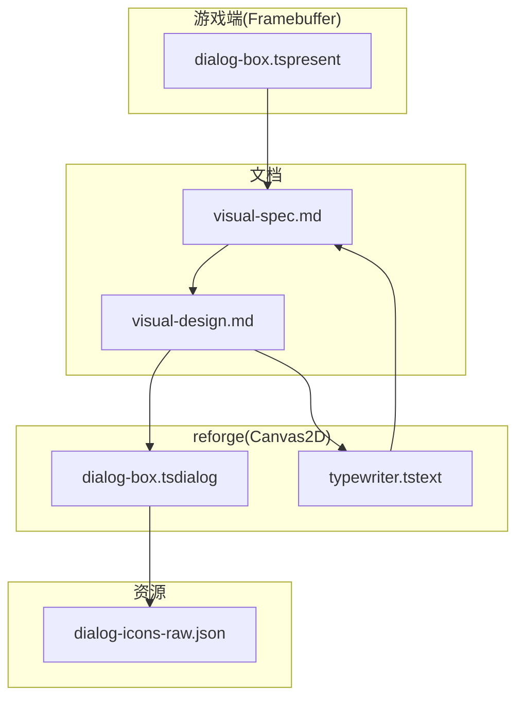
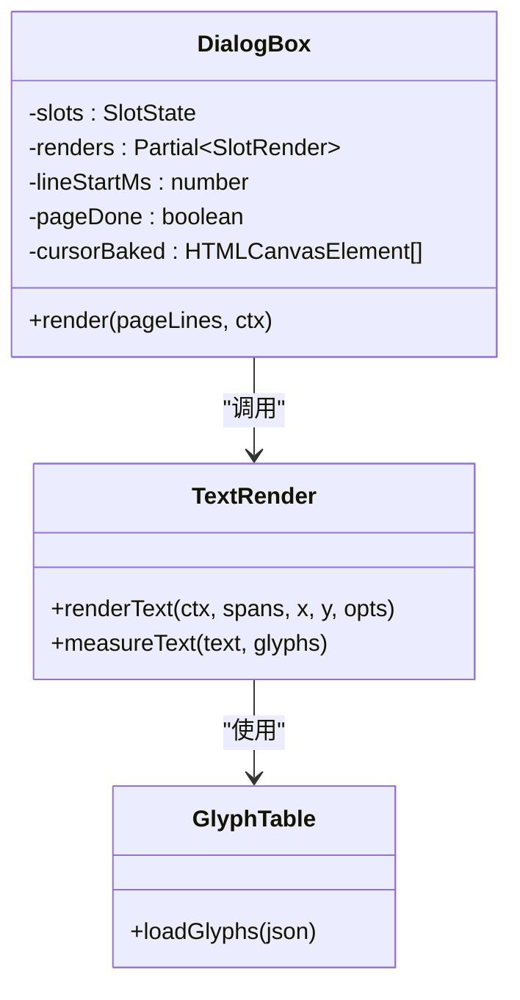
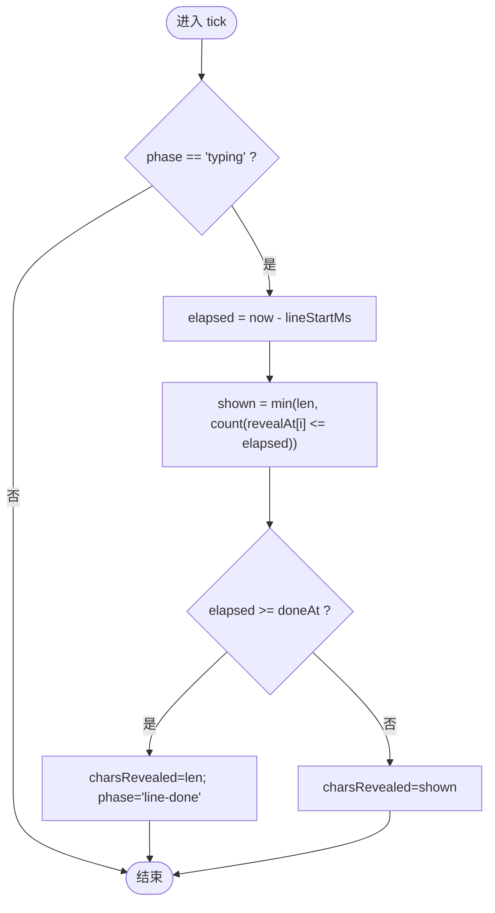
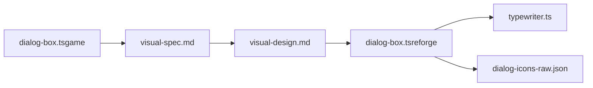

# 视觉实现规范

<cite>
**本文引用的文件**   
- [visual-spec.md](file://docs/phase2/dialogue/visual-spec.md)
- [visual-design.md](file://docs/phase2/dialogue/visual-design.md)
- [dialog-box.ts（游戏端）](file://packages/game/src/present/dialog-box.ts)
- [dialog-box.ts（reforge 端）](file://packages/reforge/src/dialog/dialog-box.ts)
- [typewriter.ts（reforge 端）](file://packages/reforge/src/text/typewriter.ts)
- [dialog-icons-raw.json](file://data/extracted/data/dialog-icons-raw.json)
</cite>

## 目录
1. [引言](#引言)
2. [项目结构](#项目结构)
3. [核心组件](#核心组件)
4. [架构总览](#架构总览)
5. [详细组件分析](#详细组件分析)
6. [依赖关系分析](#依赖关系分析)
7. [性能考量](#性能考量)
8. [故障排查指南](#故障排查指南)
9. [结论](#结论)
10. [附录：GLM spec 继承与移植清单](#附录glm-spec-继承与移植清单)

## 引言
本规范聚焦对话系统的“视觉实现”，以 GLM 外观真值为基准，给出 Canvas2D 适配方案、字模选择策略、slot 共存模型、渲染函数实现要点与性能优化建议，并明确与 GLM spec 的继承关系和移植清单。目标是让读者在不深入源码的情况下也能按图索骥完成对话框外观的 1:1 复刻与现代 UI 兼容。

## 项目结构
对话系统视觉相关代码与文档分布在以下位置：
- 设计文档：docs/phase2/dialogue/visual-spec.md、visual-design.md
- 游戏端参考实现（Framebuffer 路径）：packages/game/src/present/dialog-box.ts
- reforge 端 Canvas2D 实现：packages/reforge/src/dialog/dialog-box.ts、packages/reforge/src/text/typewriter.ts
- 光标资产：data/extracted/data/dialog-icons-raw.json



图表来源
- [visual-spec.md](file://docs/phase2/dialogue/visual-spec.md)
- [visual-design.md](file://docs/phase2/dialogue/visual-design.md)
- [dialog-box.ts（游戏端）](file://packages/game/src/present/dialog-box.ts)
- [dialog-box.ts（reforge 端）](file://packages/reforge/src/dialog/dialog-box.ts)
- [typewriter.ts（reforge 端）](file://packages/reforge/src/text/typewriter.ts)
- [dialog-icons-raw.json](file://data/extracted/data/dialog-icons-raw.json)

章节来源
- [visual-spec.md](file://docs/phase2/dialogue/visual-spec.md)
- [visual-design.md](file://docs/phase2/dialogue/visual-design.md)

## 核心组件
- 外观真值与移植指引：visual-spec.md
- Canvas2D 适配与 slot 模型：visual-design.md
- 游戏端参考实现（Framebuffer）：dialog-box.ts（present）
- reforge 端实现（Canvas2D）：dialog-box.ts（dialog）、typewriter.ts（text）
- 光标图标资源：dialog-icons-raw.json

章节来源
- [visual-spec.md](file://docs/phase2/dialogue/visual-spec.md)
- [visual-design.md](file://docs/phase2/dialogue/visual-design.md)
- [dialog-box.ts（游戏端）](file://packages/game/src/present/dialog-box.ts)
- [dialog-box.ts（reforge 端）](file://packages/reforge/src/dialog/dialog-box.ts)
- [typewriter.ts（reforge 端）](file://packages/reforge/src/text/typewriter.ts)
- [dialog-icons-raw.json](file://data/extracted/data/dialog-icons-raw.json)

## 架构总览
对话系统视觉层采用“两层”解耦：
- 文本原语层（text/）：负责字模加载、逐字符 bake、阴影与着色，不感知“对话”语义
- 对话渲染层（dialog/）：消费 text-render，管理多 slot 布局、翻页、头像、姓名牌、光标等



图表来源
- [dialog-box.ts（reforge 端）](file://packages/reforge/src/dialog/dialog-box.ts)
- [visual-design.md](file://docs/phase2/dialogue/visual-design.md)

## 详细组件分析

### 外观真值参考（原版坐标、色值、打字时序）
- 字体色 palette index：默认 0x4F；黄 0x2D；红 0x1A；青 0x8D；红 alt 0x17；姓名牌 CYAN_ALT 0x8C
- 正文位置（bottom/top，有无头像缩进不同），行高 18px，每页最多 4 行
- 姓名牌判定：末字为全角/半角冒号时作为 title，独立位置绘制，不计入正文行计数
- 头像位置：top 左上、bottom 右下，按宽高居中偏移
- 光标 DATA chunk 12：frame 0/1/2 三形态，画在最后一行文字末尾，非固定右下角
- 打字速度：默认 iDelayTime=3 → 24ms/字；$NN 变速；~NN 尾停顿不可加速
- 三层阴影：(+1,0)/(0,+1)/(+1,+1) color 0

章节来源
- [visual-spec.md](file://docs/phase2/dialogue/visual-spec.md)
- [dialog-box.ts（游戏端）](file://packages/game/src/present/dialog-box.ts)

### Canvas2D 适配方案
- 透明框渲染：普通对话不画背景框，仅 narration/item-box 走 SingleLineBox
- 姓名牌定位：title 独立位置，CYAN_ALT 色，首行且非 center style 才生效
- 三层阴影效果：通过 renderText 内建 fShadow=true 实现（color 0 三层）
- 光标 DATA chunk 12：从 dialog-icons-raw.json 解析 sprite group，bake 缓存并按 100ms 轮转 6 色
- 打字动画：渲染层用 performance.now() 驱动 charsShown，与逻辑主循环解耦，避免 10fps 采样导致的成块蹦字

章节来源
- [visual-design.md](file://docs/phase2/dialogue/visual-design.md)
- [dialog-icons-raw.json](file://data/extracted/data/dialog-icons-raw.json)

### 字模选择：简体点阵 GNU Unifont CN
- 原因：原版 FONT.MKF 是繁体 BIG5、简体缺字且无 Latin，无法满足 zh + en 的 i18n 需求
- 配置方法：加载 glyphs.json（Unifont CN BDF 导出），per-glyph bake 离屏 canvas 并缓存；renderText/renderColoredText 支持逐字符着色与三层阴影

章节来源
- [visual-spec.md](file://docs/phase2/dialogue/visual-spec.md)
- [visual-design.md](file://docs/phase2/dialogue/visual-design.md)

### slot 共存策略
- 具名 slot：top / bottom（可扩展），同槽覆盖、异槽共存
- 活跃槽推进：按键只推进当前活跃句；留显的 slot 不动
- 对话结束：清所有 slot
- 自动播放 autoAdvance：尾停顿不可加速，不等键、不画光标
- 分页：每段独立 layoutLines 折行，每页 ≤4 显示行；一段长独白跨页时姓名/头像常驻该段

章节来源
- [visual-design.md](file://docs/phase2/dialogue/visual-design.md)

### 渲染函数实现指南（Canvas2D）
- 入口：DialogBox.render(pageLines, ctx)，内部按 slot 维护各自 displayLines/pageStart
- 文本绘制：调用 text-render 的 renderText，传入 spans 与 shadow=true
- 姓名牌：根据 shouldRenderAsTitle 与 getDialogTitlePos 定位，使用 CYAN_ALT
- 正文：getDialogTextPos 计算 basePos，按 LINE_HEIGHT 累加行高
- 头像：按 getPortraitPos 计算位置，有头像时正文 x 缩进
- 光标：取 iconFrames[frame]，按 measureText(lastLineText) 定位到行末，按 100ms 步切换 6 色
- 翻页：当显示行达到上限触发等待，Confirm 后 resetDialogBody 并继续推进

章节来源
- [dialog-box.ts（reforge 端）](file://packages/reforge/src/dialog/dialog-box.ts)
- [visual-design.md](file://docs/phase2/dialogue/visual-design.md)

### 打字时序与交互细节
- 默认 24ms/字，$NN 变速，~NN 尾停顿不可加速
- Confirm 跳字：typing 中按 Confirm 瞬显当前行；若 ~NN 尾行，跳字后只等尾停顿，不再重设 lineStartMs
- 连锁瞬显：一次按键在同一次 core tick 内把当前页未显行全部设为瞬显，避免“按一下过一行”

章节来源
- [visual-spec.md](file://docs/phase2/dialogue/visual-spec.md)
- [typewriter.ts（reforge 端）](file://packages/reforge/src/text/typewriter.ts)

### 序列流程：Confirm 按键处理
```mermaid
sequenceDiagram
participant U as "用户"
participant DB as "DialogBox"
participant TR as "TextRender"
participant AS as "Assets(光标/头像)"
U->>DB : "按下 Confirm"
DB->>DB : "confirmDialog(now)"
alt "typing 中"
DB->>DB : "charsRevealed = len; userSkip=true"
alt "~NN 尾行"
DB->>DB : "lineStartMs = now - lastReveal"
DB-->>U : "skip-typing"
else "普通行"
DB->>TR : "drawTextLine(整行)"
DB-->>U : "skip-typing"
end
else "waiting-page-key"
DB->>DB : "resetDialogBody()"
DB-->>U : "page-advance"
else "waiting-end-key"
DB-->>U : "dialog-end"
end
```

图表来源
- [dialog-box.ts（reforge 端）](file://packages/reforge/src/dialog/dialog-box.ts)
- [visual-spec.md](file://docs/phase2/dialogue/visual-spec.md)

### 流程图：打字进度计算（wall-clock）


图表来源
- [visual-spec.md](file://docs/phase2/dialogue/visual-spec.md)
- [typewriter.ts（reforge 端）](file://packages/reforge/src/text/typewriter.ts)

## 依赖关系分析
- visual-spec.md 定义外观真值，被 visual-design.md 引用并落地到 Canvas2D 适配
- reforge 端 dialog-box.ts 消费 text-render 与 assets（光标/头像）
- 游戏端 dialog-box.ts 提供 Framebuffer 路径的参考实现，便于对照差异



图表来源
- [visual-spec.md](file://docs/phase2/dialogue/visual-spec.md)
- [visual-design.md](file://docs/phase2/dialogue/visual-design.md)
- [dialog-box.ts（reforge 端）](file://packages/reforge/src/dialog/dialog-box.ts)
- [dialog-box.ts（游戏端）](file://packages/game/src/present/dialog-box.ts)
- [dialog-icons-raw.json](file://data/extracted/data/dialog-icons-raw.json)

章节来源
- [visual-spec.md](file://docs/phase2/dialogue/visual-spec.md)
- [visual-design.md](file://docs/phase2/dialogue/visual-design.md)
- [dialog-box.ts（reforge 端）](file://packages/reforge/src/dialog/dialog-box.ts)
- [dialog-box.ts（游戏端）](file://packages/game/src/present/dialog-box.ts)
- [dialog-icons-raw.json](file://data/extracted/data/dialog-icons-raw.json)

## 性能考量
- 字模 per-glyph bake：将每个字符预烘焙为离屏 canvas，渲染时直接 drawImage，减少逐像素写入
- 光标缓存：按 frame×6+step 缓存 tinted canvas，避免每帧重复着色
- 打字时钟解耦：渲染层高频（60fps）推进 charsShown，逻辑层低频（10fps）推进状态机，避免成块蹦字
- 分页与排版：每段独立 layoutLines，减少不必要的重排；仅在需要时刷新 pageStart

[本节为通用指导，无需具体文件引用]

## 故障排查指南
- “按一下全显”失效：检查 confirmDialog 是否在同一次 core tick 内一次性连锁瞬显当前页未显行，避免拆成多个 tick
- “~NN 尾行卡死/无限重播”：确认跳字后 lineStartMs 设置为 now - lastReveal，且在已全显后再按 Confirm 返回 noop，不重置尾停顿
- 光标闪烁异常：校验 palette 0xF9–0xFE 六色轮转与 cursorFrame 选择是否正确
- 姓名牌误判：确保 shouldRenderAsTitle 包含“首行 + 非 center + 末字冒号”三条件

章节来源
- [visual-spec.md](file://docs/phase2/dialogue/visual-spec.md)
- [dialog-box.ts（游戏端）](file://packages/game/src/present/dialog-box.ts)

## 结论
通过严格遵循 GLM 外观真值并在 Canvas2D 上实现适配，对话系统既保留了原版体验（透明框、姓名牌、三层阴影、DATA chunk 12 光标、24ms/字打字），又通过 slot 共存与现代 UI 能力满足多面板叠加需求。文本原语与对话渲染解耦，使未来扩展（旁白、物品提示等）可复用同一套渲染基础。

[本节为总结性内容，无需具体文件引用]

## 附录：GLM spec 继承与移植清单
- 继承范围
  - 坐标与色值：正文/姓名牌/头像位置、字体色与 CYAN_ALT、行高 18、每页 4 行
  - 打字时序：默认 24ms/字、$NN 变速、~NN 尾停顿不可加速
  - 光标：DATA chunk 12，frame 0/1/2，行末定位，6 色轮转
  - 阴影：三层 (+1,0)/(0,+1)/(+1,+1) color 0
- 移植要点
  - 数据源替换：从 parseDialogText 控制符字符串改为结构化 DialogueLine + locale 查表
  - 渲染目标替换：Framebuffer → CanvasRenderingContext2D，像素写入 → ImageData/drawImage
  - 保留常量与判定：位置常量、色值、姓名判定、分页规则不变
  - 打字时钟解耦：渲染层 wall-clock 驱动，逻辑层保持纯状态机
- 不在本次范围
  - narration/item-box 归演出/物品系统复用 text-render
  - center 布局与选项分支（演出层）
  - 头像立绘管线（先用占位验证链路）

章节来源
- [visual-spec.md](file://docs/phase2/dialogue/visual-spec.md)
- [visual-design.md](file://docs/phase2/dialogue/visual-design.md)