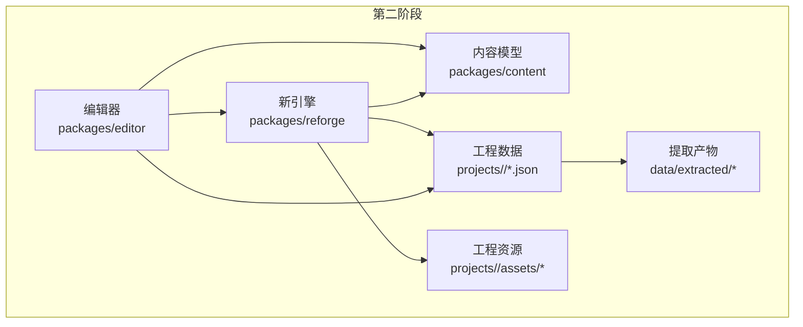
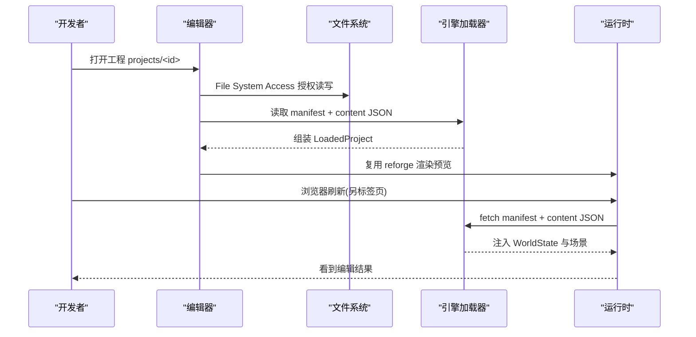
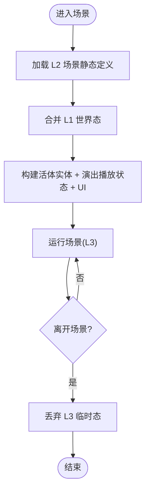
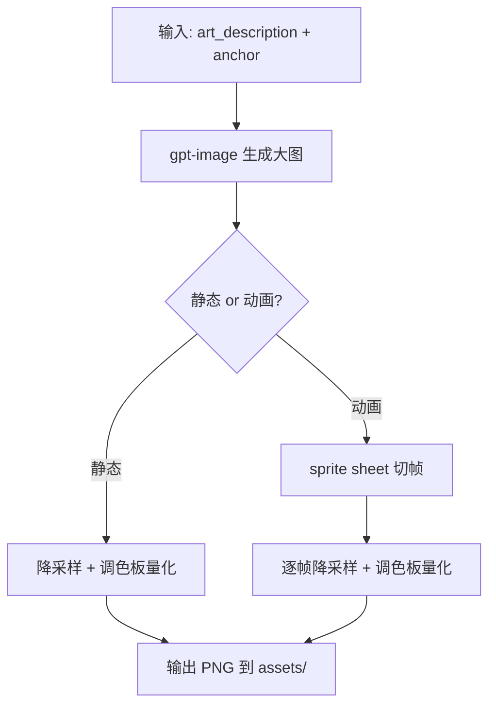
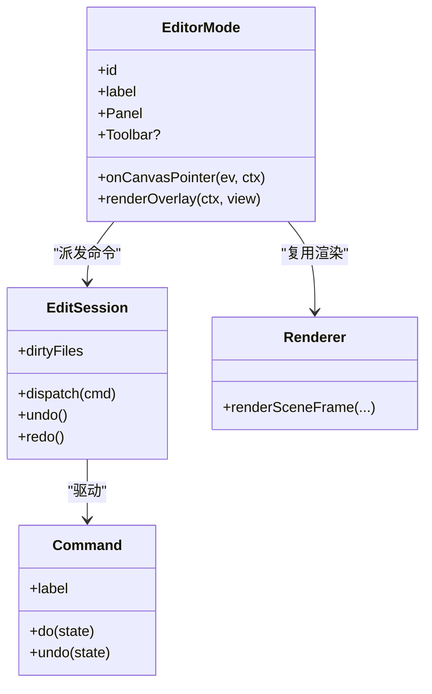
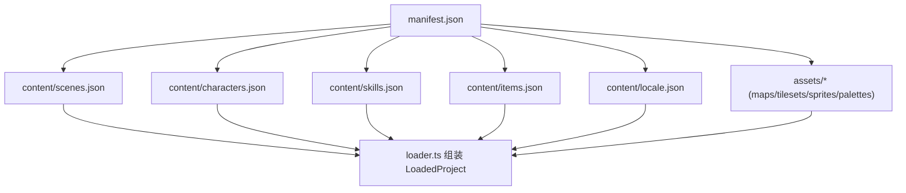
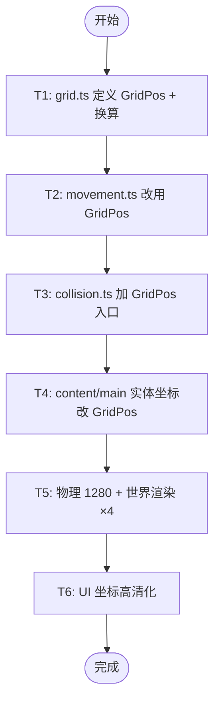
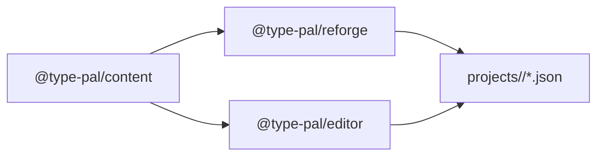

# 开发指南

<cite>
**本文引用的文件**   
- [README.md](file://README.md)
- [package.json](file://package.json)
- [phase2/README.md](file://docs/phase2/README.md)
- [phase2/READ-FIRST.md](file://docs/phase2/READ-FIRST.md)
- [phase2/foundation/content-schema.md](file://docs/phase2/foundation/content-schema.md)
- [phase2/foundation/art-pipeline.md](file://docs/phase2/foundation/art-pipeline.md)
- [phase2/editor/editor-design.md](file://docs/phase2/editor/editor-design.md)
- [phase2/editor/project-design.md](file://docs/phase2/editor/project-design.md)
- [phase2/foundation/render-foundation-plan.md](file://docs/phase2/foundation/render-foundation-plan.md)
- [phase2/foundation/skill-data-design.md](file://docs/phase2/foundation/skill-data-design.md)
- [phase2/foundation/item-data-design.md](file://docs/phase2/foundation/item-data-design.md)
</cite>

## 目录
1. [引言](#引言)
2. [项目结构](#项目结构)
3. [核心组件](#核心组件)
4. [架构总览](#架构总览)
5. [详细组件分析](#详细组件分析)
6. [依赖分析](#依赖分析)
7. [性能考虑](#性能考虑)
8. [故障排查指南](#故障排查指南)
9. [结论](#结论)
10. [附录](#附录)

## 引言
本指南面向第二阶段（Reforge）新内容开发，覆盖从内容 schema 规范、资产管线、编辑器使用到集成测试的完整流程。同时给出开发环境搭建步骤、代码规范与提交约定，以及新功能开发的标准路径：需求分析 → 设计文档 → TDD 实现 → 测试验证。文末提供常见问题解决方案、最佳实践、性能优化建议与调试技巧。

## 项目结构
第二阶段围绕“引擎壳 + 内容数据 + 编辑器”解耦展开，核心包与目录如下：
- packages/reforge：新引擎（Canvas 2D），复用渲染器、资源加载、碰撞等基础能力
- packages/content：内容 schema、纯逻辑与常量（零依赖叶子）
- packages/editor：网页版可视化编辑器（React + Vite），消费 content 并复用 reforge 渲染
- projects/<id>：工程根（manifest + content JSON + assets），一个文件夹即一套游戏
- data/raw / data/extracted：原始提取产物（迁移期作为素材源）

图表来源
- [editor-design.md:27-42](file://docs/phase2/editor/editor-design.md#L27-L42)
- [project-design.md:32-75](file://docs/phase2/editor/project-design.md#L32-L75)

章节来源
- [README.md:110-131](file://README.md#L110-L131)
- [phase2/README.md:23-45](file://docs/phase2/README.md#L23-L45)

## 核心组件
- 内容 Schema 与三层状态模型：世界态（存档）、场景静态定义（内容层）、场景运行态（临时层）。稳定 id、自包含场景、地图多层与碰撞层、事件与演出建模、角色实例化与外观解耦。
- 美术资产管线：AI 生图（gpt-image）+ 降采样 + 调色板量化；动画 sprite sheet 直出 + 切帧；斜 45° 视角实验与一致性策略。
- 编辑器架构：模式化外壳、command/undo、校验层、reforge 渲染复用、File System Access 落盘。
- 工程化架构：一工程一游戏，manifest 驱动 loader 运行期加载 content JSON，资源自包含。
- 技能与物品数据地基：SkillData/effects[]、learnedSkills、levelUpSkills；ItemData/equip/use/throw 能力块与有效属性计算。

章节来源
- [content-schema.md:23-134](file://docs/phase2/foundation/content-schema.md#L23-L134)
- [art-pipeline.md:28-108](file://docs/phase2/foundation/art-pipeline.md#L28-L108)
- [editor-design.md:55-100](file://docs/phase2/editor/editor-design.md#L55-L100)
- [project-design.md:32-118](file://docs/phase2/editor/project-design.md#L32-L118)
- [skill-data-design.md:16-93](file://docs/phase2/foundation/skill-data-design.md#L16-L93)
- [item-data-design.md:27-95](file://docs/phase2/foundation/item-data-design.md#L27-L95)

## 架构总览
第二阶段以“架构优先”为最高标准，强调现代化、解耦与可扩展。核心决策包括：
- 全新重写，不对齐旧引擎/原版行为
- 逻辑知识可移植，模块结构不照搬
- 杜绝下标/数组位置当身份
- 根 CLAUDE.md 正文不适用于此阶段

图表来源
- [editor-design.md:108-113](file://docs/phase2/editor/editor-design.md#L108-L113)
- [project-design.md:77-84](file://docs/phase2/editor/project-design.md#L77-L84)

章节来源
- [phase2/READ-FIRST.md:6-22](file://docs/phase2/READ-FIRST.md#L6-L22)
- [project-design.md:19-31](file://docs/phase2/editor/project-design.md#L19-L31)

## 详细组件分析

### 内容 Schema 与三层状态
- 三层状态：L1 世界态（存档）、L2 场景静态定义（内容层）、L3 场景运行态（临时层）
- 稳定身份：对象/场景/脚本/变量/演出均用稳定 id，跨场景引用语义化
- 世界变量：剧情开关/时间/天气等显式命名表
- 场景包：map/entities/cutscenes/triggers/entry 自包含
- 地图 Schema：尺寸可变、N 视觉层、独立碰撞/地形层、真立交/楼层表达
- 事件与演出：触发器（何时）+ 演出/时间线（演什么）正交拆分
- 角色/实体：身份=实例 id，状态=组件，外观=基础造型+装备覆盖

图表来源
- [content-schema.md:23-67](file://docs/phase2/foundation/content-schema.md#L23-L67)

章节来源
- [content-schema.md:23-134](file://docs/phase2/foundation/content-schema.md#L23-L134)

### 美术资产管线
- 双重目的：消除“无美术能力=完蛋”恐惧；确认商业化硬约束
- 核心结论：静态走单图固定管线；动画走 sprite sheet 直出 + 切帧
- 关键修正：动画 gpt-image 直出“能试但不稳”，ControlNet 可能更稳
- 斜 45° 俯视视角：最大未知数，需实验验证
- 生产顺序：开发期用原版资产跑通；引擎跑通后搭静态管线；静态可行再扩展到动画；商业化前全量替换

图表来源
- [art-pipeline.md:35-108](file://docs/phase2/foundation/art-pipeline.md#L35-L108)
- [art-pipeline.md:145-176](file://docs/phase2/foundation/art-pipeline.md#L145-L176)

章节来源
- [art-pipeline.md:9-48](file://docs/phase2/foundation/art-pipeline.md#L9-L48)
- [art-pipeline.md:190-208](file://docs/phase2/foundation/art-pipeline.md#L190-L208)

### 编辑器整体架构
- 技术栈：React + Vite + TS；落盘：File System Access API；渲染：复用 reforge
- 交互模型：模式化外壳（中心画布 + 模式切换 + 随模式变的面板）
- 编辑状态：EditSession + Command/Undo 第一天进
- 校验层：跨引用完整性检查（对话 locale、技能/物品引用等）
- 坐标系：菱形轴 GridPos + 房间瓦片格两套坐标并存
- 分期：B0 地基就位（非视觉）→ B1 布置模式 MVP（canvas 视觉）

图表来源
- [editor-design.md:55-77](file://docs/phase2/editor/editor-design.md#L55-L77)
- [editor-design.md:44-54](file://docs/phase2/editor/editor-design.md#L44-L54)

章节来源
- [editor-design.md:13-26](file://docs/phase2/editor/editor-design.md#L13-L26)
- [editor-design.md:79-100](file://docs/phase2/editor/editor-design.md#L79-L100)

### 工程化架构（一工程一游戏）
- 目标：把内容从编译期依赖变为运行期加载的数据
- 包拓扑：content 保留为 schema + ops 叶子；reforge/editor 各自依赖它
- manifest.json：工程清单（entryScene、content 文件清单、assets 规则、startWorld）
- 迁移清单：content 数据序列化进工程 JSON，类型+逻辑留在 content
- 资源自包含：A2 将 map/tileset/sprite/palette 放入工程 assets

图表来源
- [project-design.md:85-118](file://docs/phase2/editor/project-design.md#L85-L118)
- [project-design.md:131-170](file://docs/phase2/editor/project-design.md#L131-L170)

章节来源
- [project-design.md:19-31](file://docs/phase2/editor/project-design.md#L19-L31)
- [project-design.md:32-75](file://docs/phase2/editor/project-design.md#L32-L75)

### 渲染地基改造（已落地）
- 目标：GridPos 菱形轴 + 物理 1280 + UI 高清化
- 关键点：gridToPixel/pixelToGrid 纯函数；movement/collision 改用 GridPos；UI 坐标 ×4 物理精度
- 范围：h/lower-upper 不动；字模沿用；菜单/D17 留后

图表来源
- [render-foundation-plan.md:57-236](file://docs/phase2/foundation/render-foundation-plan.md#L57-L236)

章节来源
- [render-foundation-plan.md:1-20](file://docs/phase2/foundation/render-foundation-plan.md#L1-L20)

### 技能数据地基
- 三层：SkillData（定义）/ learnedSkills（关系）/ levelUpSkills（习得规则）
- effects[] 为核心：有序效果列表，映射原版 scriptOnSuccess opcode 链
- 命中/抗性由引擎按目标判定，不在技能上存几率
- demo 填李逍遥仙术验证 shape

章节来源
- [skill-data-design.md:16-93](file://docs/phase2/foundation/skill-data-design.md#L16-L93)
- [skill-data-design.md:94-138](file://docs/phase2/foundation/skill-data-design.md#L94-L138)

### 物品/装备数据地基
- ItemData 基类 + 能力块 equip/use/throw，菜单按能力过滤
- EquipSpec/EquipEffect：6 槽、statBonus 本期计算，其他 effect 定形状
- 持有 inventory + 穿戴 equipment，有效属性 = 基础 + Σ statBonus
- demo 数据：李逍遥 6 件 + 土灵珠样例

章节来源
- [item-data-design.md:27-95](file://docs/phase2/foundation/item-data-design.md#L27-L95)
- [item-data-design.md:117-133](file://docs/phase2/foundation/item-data-design.md#L117-L133)

## 依赖分析
- 包拓扑干净：content 为叶子，reforge/editor 各自依赖它，互不耦合
- 编辑器经 reforge 间接依赖冻结解码类型（接受的债）
- 资源加载：loader 按 manifest.assets 解析工程资源路径

图表来源
- [project-design.md:34-52](file://docs/phase2/editor/project-design.md#L34-L52)
- [editor-design.md:27-42](file://docs/phase2/editor/editor-design.md#L27-L42)

章节来源
- [project-design.md:34-52](file://docs/phase2/editor/project-design.md#L34-L52)

## 性能考虑
- 资源请求与缓存：散文件在 demo 量级没问题；全量时考虑 atlas（bake-assets 输出大图 + manifest）
- 渲染缩放：世界 ×4 整数倍放大 + nearest-neighbor，点阵锐利
- 预缓存：Service Worker 两段进度 + 可玩门，首次加载后可离线游玩
- 编辑器 I/O：只写脏文件，避免全量写入

章节来源
- [art-pipeline.md:248-257](file://docs/phase2/foundation/art-pipeline.md#L248-L257)
- [render-foundation-plan.md:192-213](file://docs/phase2/foundation/render-foundation-plan.md#L192-L213)
- [README.md:30-34](file://README.md#L30-L34)

## 故障排查指南
- 悬空引用：skills.json 中 levelUp/grantSkill 指向不存在 id；validateReferences 应捕获
- 精灵解析：EntityDef.sprite 无解析表，引擎写死 2/16；需 sprites.json 注册表
- 场景调色板：SceneDef 缺 paletteId，现靠 URL hack；需字段化
- 资源路径：BASE 写死 '/extracted'；A2 改为 manifest.assets.root
- 存档匹配：SavePayload 加 projectId + contentVersion，防跨工程读档

章节来源
- [editor-design.md:79-100](file://docs/phase2/editor/editor-design.md#L79-L100)
- [project-design.md:162-171](file://docs/phase2/editor/project-design.md#L162-L171)

## 结论
第二阶段以“架构优先”为核心，通过内容 schema、工程化与编辑器三位一体，形成“引擎壳 + 内容数据 + 可视化编辑”的闭环。遵循六条铁律，采用 TDD 与严格校验，确保扩展性与可维护性。后续聚焦菜单系统、多场景还原与编辑器完善，逐步推进至商业化前的全量自研资产替换。

## 附录

### 开发环境搭建
- 前置：准备原版数据文件到 data/raw/
- 安装与提取：pnpm install → pnpm extract
- 启动第一阶段：pnpm --filter @type-pal/game dev
- 启动第二阶段：pnpm --filter @type-pal/reforge dev
- 差分测试 oracle：brew install make sdl3 → scripts/build-sdlpal.sh/classic.sh → baseline 提取脚本

章节来源
- [README.md:66-108](file://README.md#L66-L108)

### 常用命令
- 全量检查：pnpm check
- 单元测试：pnpm test
- 类型检查：pnpm typecheck
- 代码风格：pnpm lint / pnpm format
- 资源提取：pnpm extract
- 特定测试：pnpm --filter @type-pal/game exec vitest run <test-file>

章节来源
- [README.md:80-97](file://README.md#L80-L97)
- [package.json:5-14](file://package.json#L5-L14)

### 代码规范与提交约定
- 使用 Biome 进行格式化和检查
- 提交信息遵循语义化，体现变更范围与动机（如 feat/refactor/docs）
- 保持 content 为叶子，reforge/editor 仅依赖它，避免反向耦合

章节来源
- [package.json:16-21](file://package.json#L16-L21)
- [project-design.md:34-52](file://docs/phase2/editor/project-design.md#L34-L52)

### 新功能开发标准流程
- 需求分析：明确问题域与边界，记录于 design-backlog
- 设计文档：产出 spec/design/plan，遵循 phase2 文档组织规矩
- TDD 实现：先写失败测试，再实现并通过，最后 commit
- 测试验证：unit/regression + 浏览器实测（Claude 真机验）
- 集成回归：pnpm check 全绿，demo 行为一致

章节来源
- [phase2/README.md:7-22](file://docs/phase2/README.md#L7-L22)
- [render-foundation-plan.md:57-115](file://docs/phase2/foundation/render-foundation-plan.md#L57-L115)

### 常见开发问题与最佳实践
- 坐标体系：统一使用 GridPos 菱形轴，避免像素坐标漂移
- 引用完整性：在 editor 与 loader 侧都跑 validateReferences
- 资源管理：A2 后资源自包含，避免对 /extracted 的强依赖
- 版本管理：manifest.contentVersion 与 SAVE_VERSION 双轴分离
- 编辑器：command/undo 尽早落地，避免后期返工

章节来源
- [render-foundation-plan.md:23-54](file://docs/phase2/foundation/render-foundation-plan.md#L23-L54)
- [editor-design.md:55-77](file://docs/phase2/editor/editor-design.md#L55-L77)
- [project-design.md:202-210](file://docs/phase2/editor/project-design.md#L202-L210)