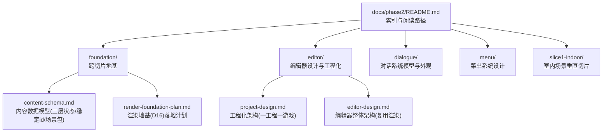
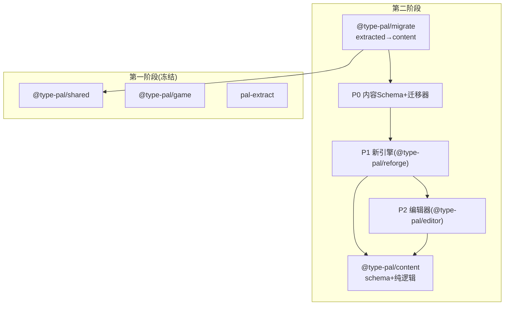
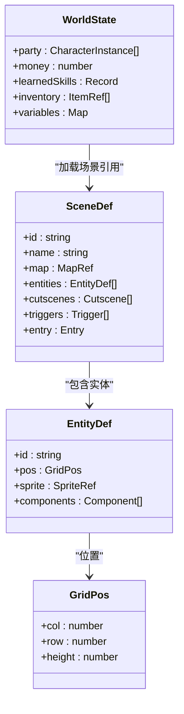
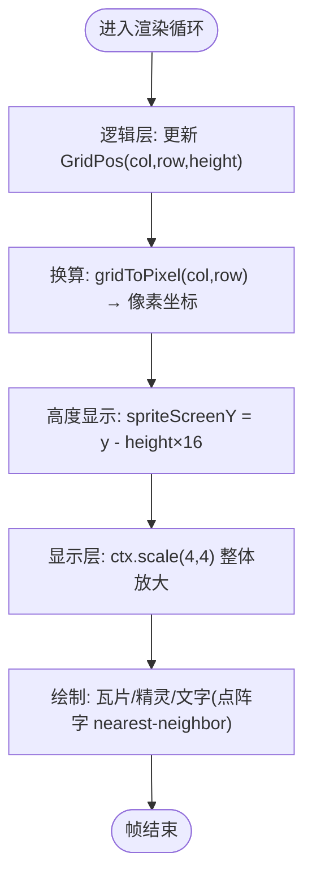
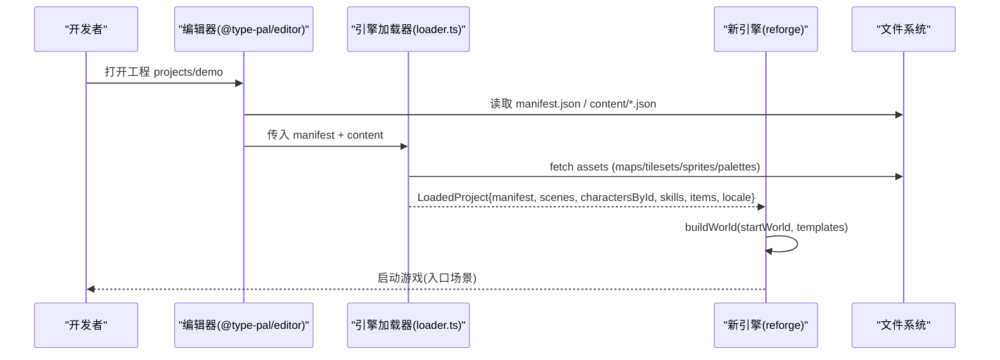
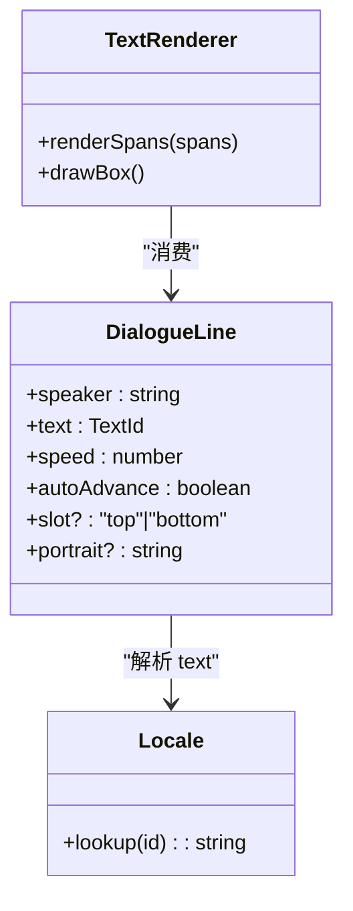
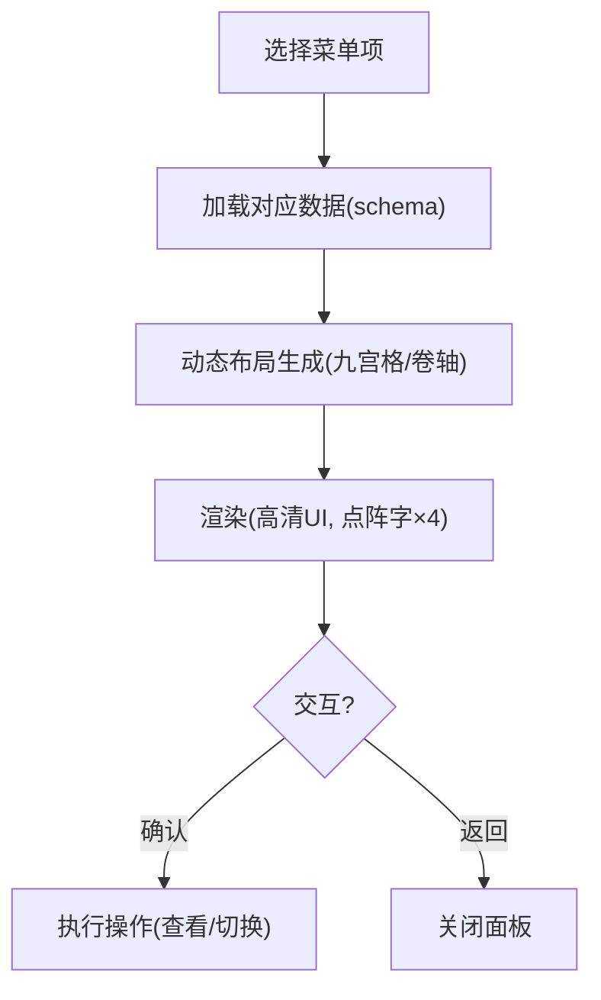
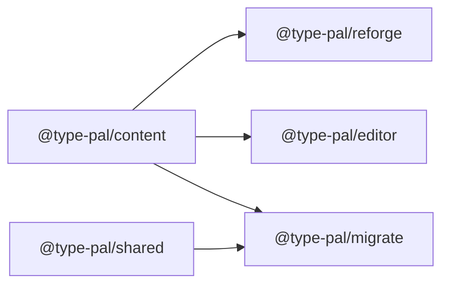

# 第二阶段概述与设计理念

<cite>
**本文引用的文件**   
- [docs/phase2/README.md](file://docs/phase2/README.md)
- [docs/phase2/roadmap.md](file://docs/phase2/roadmap.md)
- [docs/phase2/decisions.md](file://docs/phase2/decisions.md)
- [docs/phase2/foundation/content-schema.md](file://docs/phase2/foundation/content-schema.md)
- [docs/phase2/foundation/render-foundation-plan.md](file://docs/phase2/foundation/render-foundation-plan.md)
- [docs/phase2/editor/project-design.md](file://docs/phase2/editor/project-design.md)
- [docs/phase2/editor/editor-design.md](file://docs/phase2/editor/editor-design.md)
- [docs/phase1/04-decisions.md](file://docs/phase1/04-decisions.md)
- [docs/phase1/02-architecture.md](file://docs/phase1/02-architecture.md)
- [docs/phase3/README.md](file://docs/phase3/README.md)
</cite>

## 目录
1. [引言](#引言)
2. [项目结构](#项目结构)
3. [核心组件](#核心组件)
4. [架构总览](#架构总览)
5. [详细组件分析](#详细组件分析)
6. [依赖分析](#依赖分析)
7. [性能考量](#性能考量)
8. [故障排查指南](#故障排查指南)
9. [结论](#结论)
10. [附录](#附录)

## 引言
本文件为第二阶段 Reforge 重制版的总体概述，聚焦“架构优先”的新引擎设计理念与落地路径。与第一阶段追求对旧引擎行为的完全对齐不同，第二阶段不再以“双引擎对照”作为方法论，而是以内容 schema 为核心、以编辑器与自有内容生产为目标，构建现代化、可创作、可扩展的运行时。

- 新引擎定位：现代化 Canvas 2D 重新实现（逻辑/显示分离、格坐标、高清 UI），全新内容编辑器开发，支持自有内容生产。
- 阶段关系：第二阶段是“从忠实还原到可创作”的桥梁；第三阶段 MMO 基于第二阶段成果推进，但不在第二阶段投入心智。

**章节来源**
- [docs/phase2/roadmap.md:6-38](file://docs/phase2/roadmap.md#L6-L38)
- [docs/phase2/README.md:1-6](file://docs/phase2/README.md#L1-L6)
- [docs/phase3/README.md:1-11](file://docs/phase3/README.md#L1-L11)

## 项目结构
第二阶段文档与工程按主题分层组织：顶层放常查方针与路线图，子目录按主题（foundation、editor、menu、dialogue、slice1-indoor 等）存放设计/计划/规格。

**图表来源**
- [docs/phase2/README.md:23-84](file://docs/phase2/README.md#L23-L84)
- [docs/phase2/foundation/content-schema.md:1-22](file://docs/phase2/foundation/content-schema.md#L1-L22)
- [docs/phase2/foundation/render-foundation-plan.md:1-13](file://docs/phase2/foundation/render-foundation-plan.md#L1-L13)
- [docs/phase2/editor/project-design.md:1-17](file://docs/phase2/editor/project-design.md#L1-L17)
- [docs/phase2/editor/editor-design.md:1-10](file://docs/phase2/editor/editor-design.md#L1-L10)

**章节来源**
- [docs/phase2/README.md:7-22](file://docs/phase2/README.md#L7-L22)

## 核心组件
- 内容 Schema（P0）：定义三层状态（世界态/场景静态/运行态）、稳定 id、场景自包含、地图多层与碰撞层、事件与演出建模、角色实例化与外观解耦。
- 渲染地基（D16）：逻辑/显示分离，菱形轴格坐标 GridPos={col,row,height}，物理分辨率 1280×800，UI 高清化，点阵字沿用整数倍放大。
- 编辑器工程化（A/B期）：一工程一游戏，manifest + content JSON + assets 自包含；编辑器依赖 content schema，嵌 reforge 预览。
- 对话系统现代化：结构化 DialogueLine + i18n，slot 具名面板，位置自动定位在创作期完成。
- 菜单系统（D17）：数据驱动动态布局，九宫格可拉伸，状态面板固定背景图，后续扩展维度不返工。

**章节来源**
- [docs/phase2/foundation/content-schema.md:23-133](file://docs/phase2/foundation/content-schema.md#L23-L133)
- [docs/phase2/decisions.md:108-150](file://docs/phase2/decisions.md#L108-L150)
- [docs/phase2/editor/project-design.md:32-84](file://docs/phase2/editor/project-design.md#L32-L84)
- [docs/phase2/decisions.md:61-94](file://docs/phase2/decisions.md#L61-L94)
- [docs/phase2/decisions.md:151-163](file://docs/phase2/decisions.md#L151-L163)

## 架构总览
第二阶段采用“架构优先”的全新设计，放弃第一阶段“双引擎对照”的方法论，转而以内容 schema 为中心，将引擎与编辑器解耦，并通过迁移器桥接两阶段。

**图表来源**
- [docs/phase2/roadmap.md:40-50](file://docs/phase2/roadmap.md#L40-L50)
- [docs/phase2/decisions.md:164-192](file://docs/phase2/decisions.md#L164-L192)

**章节来源**
- [docs/phase2/roadmap.md:31-38](file://docs/phase2/roadmap.md#L31-L38)
- [docs/phase2/decisions.md:164-192](file://docs/phase2/decisions.md#L164-L192)

## 详细组件分析

### 内容 Schema（P0）
- 三层状态：L1 世界态（存档贯穿）、L2 场景静态（编辑器产出）、L3 运行态（进场景合入）。
- 稳定身份：对象/场景/脚本/变量用语义 id 或 uuid，杜绝数组下标。
- 场景包：map/entities/cutscenes/triggers/entry 自包含，跨场景影响走 L1。
- 地图：尺寸可变、N 视觉层、独立碰撞/地形层，真立交/楼层表达。
- 事件与演出：触发器（何时）+ 时间线（演什么）正交；兼容原版 opcode 的兼容执行器与新时间线并存。
- 角色实例化：身份=实例 id，状态=组件集合，外观=基础造型+装备覆盖，单机/MMO 通用。

**图表来源**
- [docs/phase2/foundation/content-schema.md:23-98](file://docs/phase2/foundation/content-schema.md#L23-L98)
- [docs/phase2/foundation/content-schema.md:99-133](file://docs/phase2/foundation/content-schema.md#L99-L133)

**章节来源**
- [docs/phase2/foundation/content-schema.md:23-133](file://docs/phase2/foundation/content-schema.md#L23-L133)

### 渲染地基（D16）
- 逻辑/显示分离：实体位置存 GridPos，移动/碰撞/触发/存档/编辑器均按格计算。
- 菱形轴几何：走一格单轴 ±1，任意整数(col,row)合法；height 独立轴用于遮挡与飞行/楼层显示。
- 物理分辨率 1280×800：逻辑仍 320×200，渲染整体 ×4；UI 高清化不走低清放大，点阵字整数倍锐利。
- 实施要点：grid.ts 归属 content，reforge/editor 共用；collision/movement/main 适配 GridPos；UI POS 常量机制化。

**图表来源**
- [docs/phase2/foundation/render-foundation-plan.md:21-53](file://docs/phase2/foundation/render-foundation-plan.md#L21-L53)
- [docs/phase2/decisions.md:108-150](file://docs/phase2/decisions.md#L108-L150)

**章节来源**
- [docs/phase2/foundation/render-foundation-plan.md:1-53](file://docs/phase2/foundation/render-foundation-plan.md#L1-L53)
- [docs/phase2/decisions.md:108-150](file://docs/phase2/decisions.md#L108-L150)

### 编辑器工程化（A/B期）
- 一工程一游戏：manifest.json 描述 entryScene、content 清单、assets 根与命名规则、startWorld 初始世界态。
- 包拓扑：content 保留为 schema+ops 叶子，reforge/editor 各自依赖它；migrate 是唯一桥（读 shared 产 content）。
- 资源自包含：A1 内容解耦（main.ts 零具体 import），A2 资源自包含（assets root 由 manifest 注入）。
- 编辑器形态：独立 vite app，依赖 content schema，嵌 reforge 预览；File System Access API 读写 projects/<id>/。

**图表来源**
- [docs/phase2/editor/project-design.md:77-115](file://docs/phase2/editor/project-design.md#L77-L115)
- [docs/phase2/editor/project-design.md:162-171](file://docs/phase2/editor/project-design.md#L162-L171)

**章节来源**
- [docs/phase2/editor/project-design.md:1-31](file://docs/phase2/editor/project-design.md#L1-L31)
- [docs/phase2/editor/project-design.md:32-84](file://docs/phase2/editor/project-design.md#L32-L84)
- [docs/phase2/editor/project-design.md:186-200](file://docs/phase2/editor/project-design.md#L186-L200)

### 对话系统现代化（D11/D13/D14）
- 数据结构：DialogueLine(speaker/text=TextId/speed/autoAdvance)，控制符前移到生产期，运行时无解析。
- i18n：文本走 TextId + locale 查表，多语言机制本次做，locale 先 zh。
- 外观：具名 slot（top/bottom），同屏共存；位置自动定位在创作期完成，运行时只渲染显式 slot。
- 职责分层：text-render 通用底层原语，对话系统只管角色交谈，旁白/物品框归各系统。

**图表来源**
- [docs/phase2/decisions.md:61-94](file://docs/phase2/decisions.md#L61-L94)

**章节来源**
- [docs/phase2/decisions.md:61-94](file://docs/phase2/decisions.md#L61-L94)

### 菜单系统（D17）
- 数据驱动动态布局：属性/装备/技能遍历数据排版，加维度自动适配。
- 弹出框九宫格可拉伸，全屏状态面板固定背景图。
- 范围：主菜单四项框架 + 仅队伍状态可用；存档/走出房间/战斗属性改造后置。

**图表来源**
- [docs/phase2/decisions.md:151-163](file://docs/phase2/decisions.md#L151-L163)

**章节来源**
- [docs/phase2/decisions.md:151-163](file://docs/phase2/decisions.md#L151-L163)

## 依赖分析
- 包职责清晰：content 为契约层（schema+纯逻辑），reforge 为新引擎运行时，editor 为可视化编辑，migrate 为工具桥接。
- 阶段隔离：第二阶段代码不碰第一阶段包（shared/game/pal-extract），migrate 是唯一例外。
- 依赖方向：reforge/editor 都依赖 content；migrate 依赖 content + shared。

**图表来源**
- [docs/phase2/decisions.md:164-192](file://docs/phase2/decisions.md#L164-L192)

**章节来源**
- [docs/phase2/decisions.md:164-192](file://docs/phase2/decisions.md#L164-L192)

## 性能考量
- 渲染：Canvas 2D 起步，整屏 tint/合成实现昼夜/天气/淡入；高级光照留 WebGL 升级后。
- 字体：点阵字沿用，整数倍放大保持锐利，避免换源成本。
- 资源：场景懒加载，未来大场景加 LRU；当前 demo 内存占用可控。
- 输入/主循环：固定步长（探索/菜单 10fps，战斗 25fps），逻辑与渲染同帧，切后台不补帧。

[本节为通用指导，无需特定文件来源]

## 故障排查指南
- 若出现“未具名 raw opcode no-op skip + log”行为：属第一阶段决策（M1 disasm 兜底策略），不影响第二阶段架构；可在控制台定位 opcode 号并逐步具名。
- 若 UI 模糊或错位：检查是否误用“320 离屏放大”而非“UI 坐标高清化”机制；确保使用逻辑坐标 × 倍率渲染。
- 若存档无法读档：确认 SavePayload 含 projectId + contentVersion，且与目标工程匹配。

**章节来源**
- [docs/phase1/04-decisions.md:32-36](file://docs/phase1/04-decisions.md#L32-L36)
- [docs/phase2/editor/project-design.md:162-171](file://docs/phase2/editor/project-design.md#L162-L171)
- [docs/phase2/decisions.md:124-136](file://docs/phase2/decisions.md#L124-L136)

## 结论
第二阶段以“架构优先”为核心，通过内容 schema 统一引擎与编辑器，借助 Canvas 2D 与现代 UI 高清化提升创作体验，并以迁移器桥接两阶段。MMO 作为远期目标，现阶段不占用心智。下一步将围绕菜单系统、多场景与事件演出、编辑器 MVP 持续推进。

[本节为总结性内容，无需特定文件来源]

## 附录
- 愿景与三阶段：一阶段忠实还原，二阶段可创作，三阶段 MMO。
- 技术决策原则：架构优先、内容驱动、拒绝过度设计、稳定 id、i18n 一等公民、Canvas 2D 起步、逻辑/显示分离。
- 路线图概览：P0 schema + 迁移器 → P1 新引擎 → P2 编辑器 → P3 素材管线 → P4 MMO。

**章节来源**
- [docs/phase2/roadmap.md:6-12](file://docs/phase2/roadmap.md#L6-L12)
- [docs/phase2/roadmap.md:40-50](file://docs/phase2/roadmap.md#L40-L50)
- [docs/phase2/decisions.md:49-60](file://docs/phase2/decisions.md#L49-L60)
- [docs/phase2/decisions.md:108-150](file://docs/phase2/decisions.md#L108-L150)