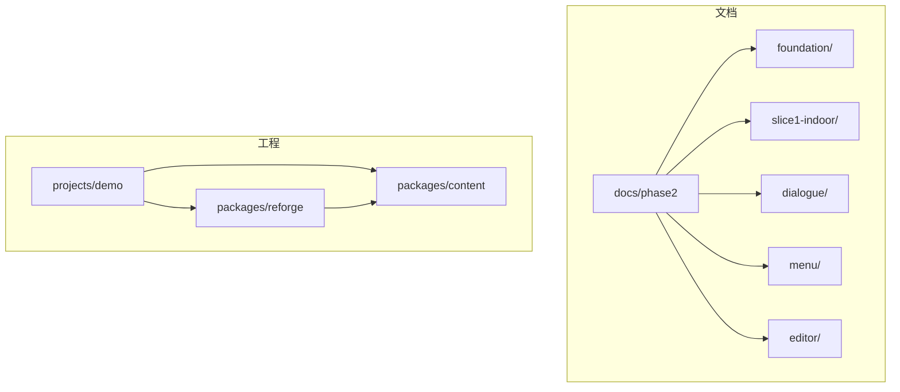
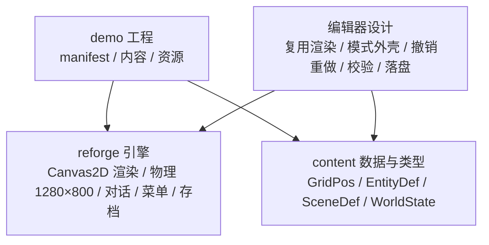
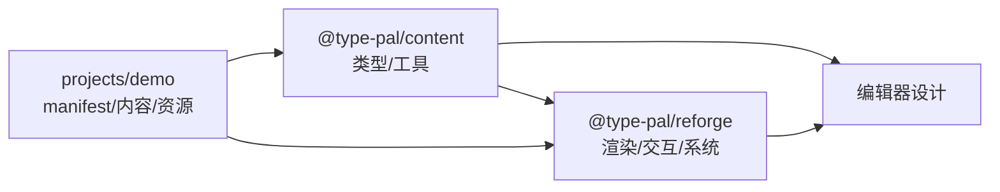

# 第二阶段：Reforge 重制版

<cite>
**本文引用的文件列表**
- [docs/phase2/README.md](file://docs/phase2/README.md)
- [docs/phase2/foundation/content-schema.md](file://docs/phase2/foundation/content-schema.md)
- [docs/phase2/editor/editor-design.md](file://docs/phase2/editor/editor-design.md)
- [docs/phase2/slice1-indoor/npc-collision-plan.md](file://docs/phase2/slice1-indoor/npc-collision-plan.md)
- [docs/phase2/dialogue/model-design.md](file://docs/phase2/dialogue/model-design.md)
- [docs/phase2/foundation/render-foundation-plan.md](file://docs/phase2/foundation/render-foundation-plan.md)
- [docs/phase2/foundation/art-pipeline.md](file://docs/phase2/foundation/art-pipeline.md)
- [docs/phase2/slice1-indoor/guijie-minju.md](file://docs/phase2/slice1-indoor/guijie-minju.md)
- [docs/phase2/foundation/engine-debt-audit.md](file://docs/phase2/foundation/engine-debt-audit.md)
- [docs/phase2/dialogue/visual-design.md](file://docs/phase2/dialogue/visual-design.md)
- [docs/phase2/menu/design.md](file://docs/phase2/menu/design.md)
- [packages/reforge/src/main.ts](file://packages/reforge/src/main.ts)
- [packages/content/src/index.ts](file://packages/content/src/index.ts)
- [projects/demo/manifest.json](file://projects/demo/manifest.json)
</cite>

## 目录
1. [引言](#引言)
2. [项目结构](#项目结构)
3. [核心组件](#核心组件)
4. [架构总览](#架构总览)
5. [详细组件分析](#详细组件分析)
6. [依赖关系分析](#依赖关系分析)
7. [性能考量](#性能考量)
8. [故障排查指南](#故障排查指南)
9. [结论](#结论)
10. [附录](#附录)

## 引言
本专项文档聚焦第二阶段 Reforge 重制版，围绕新引擎架构设计理念、与第一阶段的差异原则、当前切片进度、内容开发指南与迁移策略展开。要点包括：
- Canvas 2D 重新实现：以逻辑坐标 + 物理分辨率高清化（×4）为核心，UI 与对话系统原生高清渲染。
- 全新内容编辑器：复用 reforge 渲染器，模式化外壳、撤销/重做、校验层、File System Access 落盘。
- 自有内容开发支持：三层状态模型、稳定 id、场景自包含、世界变量层、地图多层与碰撞层、事件与演出建模。
- 与第一阶段差异：不对齐旧引擎行为、架构优先、双引擎对照方法论作废。
- 当前进度：切片 1「鬼界民居」demo 的功能范围、移动碰撞检测、对话系统集成。
- 新内容开发指南：内容 schema 规范、编辑器使用方法、资产管线流程。
- 迁移策略与未来路线图规划。

## 项目结构
第二阶段文档与代码按主题分层组织：顶层方针常查，foundation 跨切片地基，slice 与子系统分目录存放。

图示来源
- [docs/phase2/README.md:1-85](file://docs/phase2/README.md#L1-L85)
- [projects/demo/manifest.json:1-33](file://projects/demo/manifest.json#L1-L33)

章节来源
- [docs/phase2/README.md:1-85](file://docs/phase2/README.md#L1-L85)
- [projects/demo/manifest.json:1-33](file://projects/demo/manifest.json#L1-L33)

## 核心组件
- 内容数据与类型（content）：定义 GridPos、DialogueLine、EntityDef、SceneDef、WorldState 等，reforge 消费该层；编辑器将来生产该层。
- 渲染与主循环（reforge）：Canvas2D 渲染、物理 1280×800（×4）、对话框 UI、菜单系统、存档、输入与移动意图→碰撞→结果。
- 演示工程（demo）：manifest 声明入口场景、内容路径、资源根与初始世界态。

章节来源
- [packages/content/src/index.ts:1-100](file://packages/content/src/index.ts#L1-L100)
- [packages/reforge/src/main.ts:1-798](file://packages/reforge/src/main.ts#L1-L798)
- [projects/demo/manifest.json:1-33](file://projects/demo/manifest.json#L1-L33)

## 架构总览
第二阶段采用“内容先行、引擎消费”的解耦设计：
- 内容层（content）：纯数据与类型，场景自包含、稳定 id、世界变量、地图多层与碰撞层、实体组件化。
- 引擎层（reforge）：Canvas2D 渲染、GridPos 菱形轴、物理 1280×800、UI 高清、对话/菜单/存档、移动意图→碰撞→结果。
- 编辑器（editor，设计阶段）：复用 reforge 渲染，模式化外壳、撤销/重做、校验层、File System Access 落盘。

图示来源
- [packages/content/src/index.ts:1-100](file://packages/content/src/index.ts#L1-L100)
- [packages/reforge/src/main.ts:1-798](file://packages/reforge/src/main.ts#L1-L798)
- [docs/phase2/editor/editor-design.md:1-156](file://docs/phase2/editor/editor-design.md#L1-L156)
- [projects/demo/manifest.json:1-33](file://projects/demo/manifest.json#L1-L33)

## 详细组件分析

### 内容 Schema 与三层状态模型
- 三层状态：L1 世界态（存档贯穿）、L2 场景静态（编辑器产出）、L3 运行态（进场合成）。
- 稳定身份：杜绝下标，使用语义 id 或 uuid，跨场景引用为稳定 ref。
- 世界变量：显式命名开关（剧情/时间/天气），事件/触发器读写，渲染/场景订阅响应。
- 场景包：map/entities/cutscenes/triggers/entry 自包含，加载只取所需。
- 地图 Schema：尺寸可变、N 视觉层、独立碰撞/地形层、真立交/楼层留口。
- 事件与演出：触发器（何时）+ 演出/时间线（演什么）+ 黑屏正交两维；兼容层保留原版 opcode。
- 角色/实体：实例 id + 组件 + 外观解耦，单机/MMO 通用。

章节来源
- [docs/phase2/foundation/content-schema.md:1-140](file://docs/phase2/foundation/content-schema.md#L1-L140)

### 渲染地基改造（D16）
- 格坐标：GridPos={col,row,height}，菱形轴走一格单轴 ±1，height 仅影响显示上移。
- 物理分辨率：逻辑 320×200 → 物理 1280×800，ctx.scale(4)，点阵字整数倍放大锐利。
- UI 高清化：对话框/文字在逻辑坐标 ×4 绘制，不换源字模。
- 落地情况：计划已落地，grid.ts 归属 content，reforge/editor 共用。

章节来源
- [docs/phase2/foundation/render-foundation-plan.md:1-266](file://docs/phase2/foundation/render-foundation-plan.md#L1-L266)

### 对话系统（结构化 + i18n + 外观继承）
- 数据结构：DialogueLine 字段（speaker/text/speed/autoAdvance/slot/portrait/cursorFrame），文本走 locale 表，富文本颜色标记。
- 运行时：DialogBox 管理多 slot 共存、分页、打字时钟与 autoAdvance，纯函数推进。
- 外观继承：GLM 外观真值整体继承，Canvas2D 适配（字模 bake、阴影、光标轮转、头像）。
- 仪表盘：鬼话覆盖全部技术点（颜色/速度/自动播放/翻页/姓名牌/头像/双框共存）。

章节来源
- [docs/phase2/dialogue/model-design.md:1-149](file://docs/phase2/dialogue/model-design.md#L1-L149)
- [docs/phase2/dialogue/visual-design.md:1-140](file://docs/phase2/dialogue/visual-design.md#L1-L140)
- [packages/reforge/src/main.ts:1-798](file://packages/reforge/src/main.ts#L1-L798)

### 菜单系统（D17）
- 角色 schema 首次代码化：CharacterInstance/Template/WorldState，绝对值属性，可扩展槽位与标签。
- 架构：MenuState 纯状态机，tick 三态优先级（菜单 > 对话 > 探索）。
- UI：九宫格可拉伸原语（drawSlicedBox），数据驱动动态布局，复用 text-render 与 ctx.scale(4)。
- 范围：主菜单框架 + 队伍状态子菜单，其余占位。

章节来源
- [docs/phase2/menu/design.md:1-102](file://docs/phase2/menu/design.md#L1-L102)
- [packages/reforge/src/main.ts:1-798](file://packages/reforge/src/main.ts#L1-L798)

### 编辑器整体架构（设计阶段）
- 决策：React + Vite + TS，File System Access 落盘，复用 reforge 渲染，模式化外壳，command/undo 核，校验层。
- 包形状：core（纯 TS）、render（复用 Canvas2DRenderer）、modes（插件）、ui（React 外壳）。
- 渲染复用：补 reforge 包出口、抽 renderSceneFrame、vite serveDir 中间件。
- MVP：先「布置」模式闭环，后续加事件/数据表/地图模式。

章节来源
- [docs/phase2/editor/editor-design.md:1-156](file://docs/phase2/editor/editor-design.md#L1-L156)

### 美术资产管线（art-pipeline）
- 商业化约束：发布前必须全量替换为自研资产。
- 技术路线：gpt-image 直出 sprite sheet + 切帧（动画），降采样 + 调色板量化（静态/动画共用后处理）。
- 一致性：anchor 风格锚定 + styleHint/palette 注入；斜 45° 视角实验为关键未知数。
- 交付：散文件暂可，scale-up 后 atlas 打包优化请求与缓存。

章节来源
- [docs/phase2/foundation/art-pipeline.md:1-268](file://docs/phase2/foundation/art-pipeline.md#L1-L268)

### 切片 1「鬼界民居」demo
- 目标：最小可玩 demo，验证新引擎跑通真实内容。
- 范围：加载手写场景 → Canvas2D 渲染瓦片/精灵 → 键盘走路 → 撞墙 → 按键触发分页对话。
- 数据：借一间原版民居裁小图，复用 tile/精灵，手写场景数据（tile/collision/entity/dialogue）。
- 验收：浏览器里走一圈、撞墙、和鬼对完话翻完页。

章节来源
- [docs/phase2/slice1-indoor/guijie-minju.md:1-70](file://docs/phase2/slice1-indoor/guijie-minju.md#L1-L70)

### 移动与碰撞检测（静态 NPC 碰撞）
- 目标：玩家不能穿过 collide:true 的实体，撞上停下，仍可对话。
- 方案：collision.ts 加 sameTile/sameGrid 纯函数；main isBlocked 包一层读 entity collide；不动 resolveMove 语义。
- 验证：浏览器验穿不过/能对话/能绕，debug 层红绿格佐证。

章节来源
- [docs/phase2/slice1-indoor/npc-collision-plan.md:1-126](file://docs/phase2/slice1-indoor/npc-collision-plan.md#L1-L126)
- [packages/reforge/src/main.ts:1-798](file://packages/reforge/src/main.ts#L1-L798)

### 与第一阶段的差异与设计原则
- 不对齐旧引擎行为：第二阶段重写，不照搬模块结构与 C 思维耦合。
- 架构优先：三层状态、稳定 id、场景自包含、事件/演出正交建模。
- 双引擎对照方法论作废：不再以 sdlpal 行为为真值对齐，而是以新架构与体验为目标。
- 债审计输入：P0–P2 债清单直接指导新引擎切干净点（God Object、SoA 定长数组、下标身份、解释器重复 switch、cutscene 独占打穿 core/shell 等）。

章节来源
- [docs/phase2/foundation/engine-debt-audit.md:1-338](file://docs/phase2/foundation/engine-debt-audit.md#L1-L338)

## 依赖关系分析
- content 提供 GridPos、DialogueLine、EntityDef、SceneDef、WorldState 等类型与工具函数（如 gridToPixel/pixelToGrid/spriteScreenY）。
- reforge 消费 content 类型，实现渲染、移动、对话、菜单、存档等。
- editor（设计）复用 reforge 渲染与 content 类型，通过 File System Access 落盘。
- demo manifest 声明入口场景、内容路径、资源根与初始世界态。

图示来源
- [packages/content/src/index.ts:1-100](file://packages/content/src/index.ts#L1-L100)
- [packages/reforge/src/main.ts:1-798](file://packages/reforge/src/main.ts#L1-L798)
- [docs/phase2/editor/editor-design.md:1-156](file://docs/phase2/editor/editor-design.md#L1-L156)
- [projects/demo/manifest.json:1-33](file://projects/demo/manifest.json#L1-L33)

章节来源
- [packages/content/src/index.ts:1-100](file://packages/content/src/index.ts#L1-L100)
- [packages/reforge/src/main.ts:1-798](file://packages/reforge/src/main.ts#L1-L798)
- [docs/phase2/editor/editor-design.md:1-156](file://docs/phase2/editor/editor-design.md#L1-L156)
- [projects/demo/manifest.json:1-33](file://projects/demo/manifest.json#L1-L33)

## 性能考量
- 物理 1280×800 + ctx.scale(4)：整数倍放大保点阵锐利，避免换源字模导致的模糊。
- 渲染复用：编辑器复用 reforge 渲染器，减少维护成本与视觉漂移。
- 对象分配：present 层 DrawEntry 每帧分配较多闭包，后续考虑对象池或 sorted index 数组（参考债审计 P1-2）。
- 资源加载：散文件短期可行，scale-up 后建议 atlas 降低请求与 SW 预缓存膨胀。

[本节为一般性讨论，无需具体文件分析]

## 故障排查指南
- 精灵解析缺口：EntityDef.sprite 需 sprites 注册表（id→spriteNum+label），否则抛错提示未注册。
- 场景调色板：SceneDef.paletteId 缺省 0，若 URL ?pal= 存在则覆盖用于本地试色。
- 对话字体与光标：glyphs 与 cursor frames 加载失败会降级无光标/无头像，控制台告警。
- 存档兼容性：读取存档时 projectId 不匹配将拒绝，防止世界态错乱。
- 碰撞调试：?collision 叠加层显示禁入格（红）与可走格（绿），辅助定位问题。

章节来源
- [docs/phase2/editor/editor-design.md:91-101](file://docs/phase2/editor/editor-design.md#L91-L101)
- [packages/reforge/src/main.ts:130-150](file://packages/reforge/src/main.ts#L130-L150)
- [packages/reforge/src/main.ts:252-266](file://packages/reforge/src/main.ts#L252-L266)
- [packages/reforge/src/main.ts:411-450](file://packages/reforge/src/main.ts#L411-L450)

## 结论
第二阶段以“架构优先、内容先行”为原则，完成 Canvas2D 重新实现、网格坐标与高清化、对话与菜单系统落地，并通过「鬼界民居」demo 验证了移动碰撞与对话集成。编辑器设计与资产管线为后续自有内容生产奠定基础。迁移策略强调从旧引擎结构性债务中抽离，用三层状态、稳定 id、场景自包含与正交事件/演出建模构建现代化引擎。

[本节为总结性内容，无需具体文件分析]

## 附录

### 新内容开发指南（摘要）
- 内容 schema：遵循三层状态、稳定 id、场景自包含、地图多层与碰撞层、事件与演出建模。
- 编辑器使用：模式化外壳（先「布置」模式 MVP）、撤销/重做、校验层、File System Access 落盘。
- 资产管线：静态/动画统一 gpt-image 直出 + 后处理（降采样/调色板量化），斜 45° 视角实验前置，scale-up 后 atlas 打包。

章节来源
- [docs/phase2/foundation/content-schema.md:1-140](file://docs/phase2/foundation/content-schema.md#L1-L140)
- [docs/phase2/editor/editor-design.md:1-156](file://docs/phase2/editor/editor-design.md#L1-L156)
- [docs/phase2/foundation/art-pipeline.md:1-268](file://docs/phase2/foundation/art-pipeline.md#L1-L268)

### 迁移策略与路线图（摘要）
- 迁移器：拆 all.json 全局脚本至各场景 + shared/，label 局部化；全局下标 → 稳定 id；隐式对象状态 → 显式世界变量。
- 路线图：D16 渲染地基已落地；D17 菜单设计落地；对话系统三刀（模型→外观→迁移器）逐步推进；编辑器 B0/B1 分期实施；资产管线在商业化前闭环。

章节来源
- [docs/phase2/foundation/content-schema.md:100-140](file://docs/phase2/foundation/content-schema.md#L100-L140)
- [docs/phase2/dialogue/model-design.md:131-149](file://docs/phase2/dialogue/model-design.md#L131-L149)
- [docs/phase2/editor/editor-design.md:114-123](file://docs/phase2/editor/editor-design.md#L114-L123)
- [docs/phase2/foundation/render-foundation-plan.md:1-20](file://docs/phase2/foundation/render-foundation-plan.md#L1-L20)