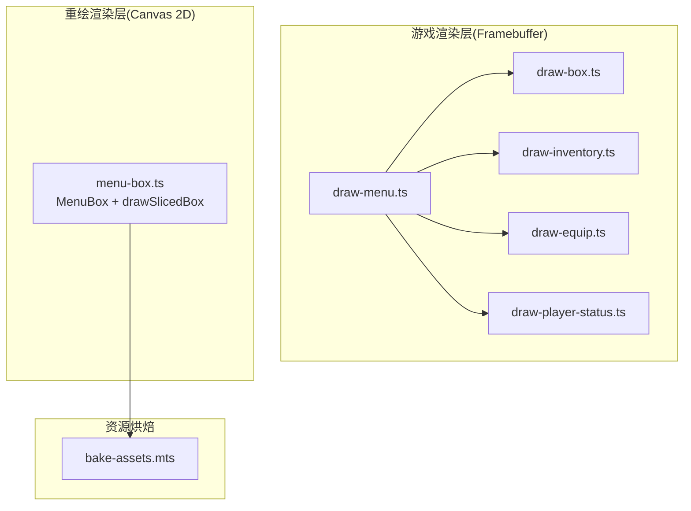
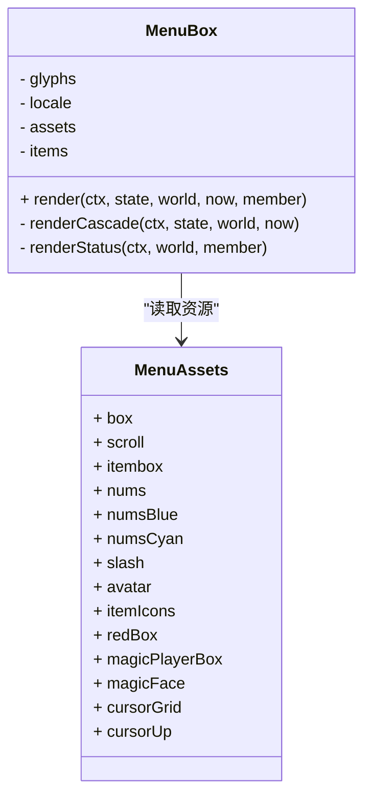
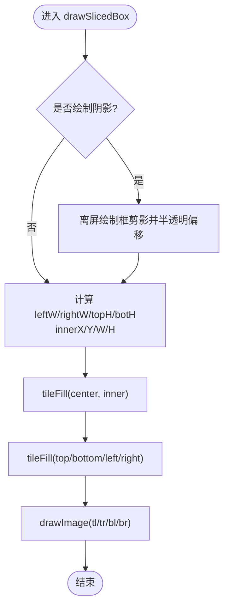
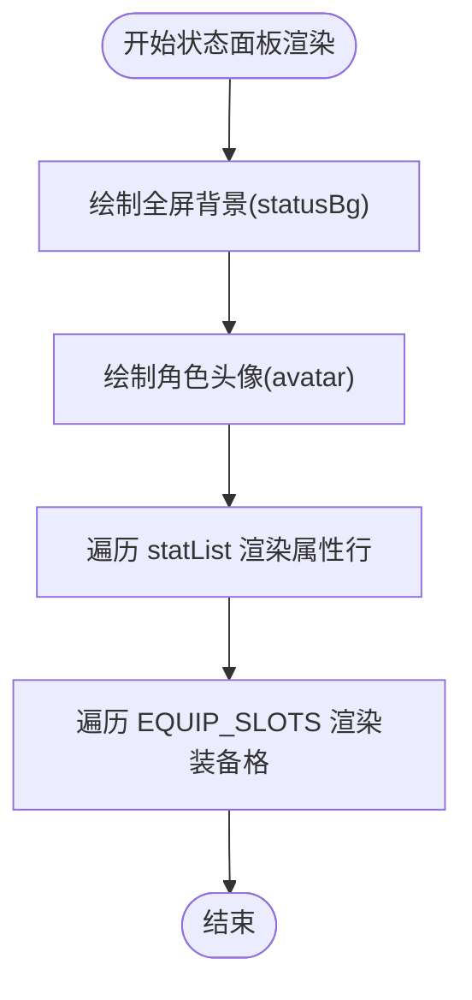
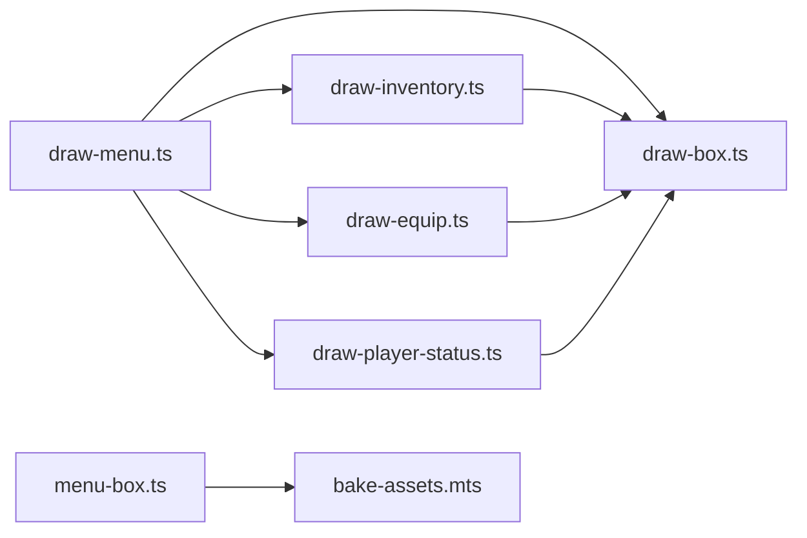

# UI 渲染系统

<cite>
**本文引用的文件**
- [packages/game/src/present/menu/draw-menu.ts](file://packages/game/src/present/menu/draw-menu.ts)
- [packages/game/src/present/menu/draw-box.ts](file://packages/game/src/present/menu/draw-box.ts)
- [packages/reforge/src/menu/menu-box.ts](file://packages/reforge/src/menu/menu-box.ts)
- [packages/game/src/present/menu/draw-player-status.ts](file://packages/game/src/present/menu/draw-player-status.ts)
- [packages/game/src/present/menu/draw-inventory.ts](file://packages/game/src/present/menu/draw-inventory.ts)
- [packages/game/src/present/menu/draw-equip.ts](file://packages/game/src/present/menu/draw-equip.ts)
- [packages/migrate/scripts/bake-assets.mts](file://packages/migrate/scripts/bake-assets.mts)
</cite>

## 目录
1. [简介](#简介)
2. [项目结构](#项目结构)
3. [核心组件](#核心组件)
4. [架构总览](#架构总览)
5. [详细组件分析](#详细组件分析)
6. [依赖关系分析](#依赖关系分析)
7. [性能考量](#性能考量)
8. [故障排查指南](#故障排查指南)
9. [结论](#结论)
10. [附录](#附录)

## 简介
本文件系统化梳理本项目中 UI 渲染子系统，重点覆盖：
- MenuBox 类的设计与 Canvas 2D 渲染策略
- drawSlicedBox 可切片框原语的九宫格算法、source rect 计算与边缘厚度处理
- 阴影绘制算法与透明度控制
- 主菜单渲染流程（黄框绘制、菜单项遍历、光标显示、enabled/disabled 颜色区分）
- 状态面板的数据驱动布局（属性列表动态生成、装备槽位遍历渲染）
- 资源加载策略与缓存机制
- UI 组件自定义方法与样式调整指南

## 项目结构
UI 渲染相关代码主要分布在两个子系统中：
- game 模块的 Framebuffer 管线：基于像素级索引缓冲区的 SDL 风格实现，严格对齐 sdlpal 真值坐标与行为。
- reforge 模块的 Canvas 2D 管线：面向浏览器的高清渲染，提供 MenuBox 类与 drawSlicedBox 等高级原语。



图表来源
- [packages/game/src/present/menu/draw-menu.ts:101-111](file://packages/game/src/present/menu/draw-menu.ts#L101-L111)
- [packages/game/src/present/menu/draw-box.ts:70-104](file://packages/game/src/present/menu/draw-box.ts#L70-L104)
- [packages/reforge/src/menu/menu-box.ts:84-132](file://packages/reforge/src/menu/menu-box.ts#L84-L132)
- [packages/migrate/scripts/bake-assets.mts:166-194](file://packages/migrate/scripts/bake-assets.mts#L166-L194)

章节来源
- [packages/game/src/present/menu/draw-menu.ts:101-111](file://packages/game/src/present/menu/draw-menu.ts#L101-L111)
- [packages/game/src/present/menu/draw-box.ts:70-104](file://packages/game/src/present/menu/draw-box.ts#L70-L104)
- [packages/reforge/src/menu/menu-box.ts:84-132](file://packages/reforge/src/menu/menu-box.ts#L84-L132)
- [packages/migrate/scripts/bake-assets.mts:166-194](file://packages/migrate/scripts/bake-assets.mts#L166-L194)

## 核心组件
- drawBox / drawSingleLineBox：Framebuffer 侧的 9-slice 边框与单行卷轴绘制，含阴影与 opaque mask 写入。
- drawMenuStack：菜单栈入口，按类型分发到具体菜单绘制函数。
- MenuBox：Canvas 2D 侧的统一菜单容器，封装 drawSlicedBox、菜单级联、状态面板渲染。
- drawSlicedBox：Canvas 2D 侧的可切片框原语，支持任意尺寸、平铺填充与四角定位。
- drawPlayerStatus / drawInventoryMenu / drawEquipMenu：数据驱动的完整全屏 UI。

章节来源
- [packages/game/src/present/menu/draw-box.ts:70-104](file://packages/game/src/present/menu/draw-box.ts#L70-L104)
- [packages/game/src/present/menu/draw-menu.ts:101-111](file://packages/game/src/present/menu/draw-menu.ts#L101-L111)
- [packages/reforge/src/menu/menu-box.ts:421-443](file://packages/reforge/src/menu/menu-box.ts#L421-L443)
- [packages/reforge/src/menu/menu-box.ts:84-132](file://packages/reforge/src/menu/menu-box.ts#L84-L132)
- [packages/game/src/present/menu/draw-player-status.ts:157-271](file://packages/game/src/present/menu/draw-player-status.ts#L157-L271)
- [packages/game/src/present/menu/draw-inventory.ts:244-348](file://packages/game/src/present/menu/draw-inventory.ts#L244-L348)
- [packages/game/src/present/menu/draw-equip.ts:202-207](file://packages/game/src/present/menu/draw-equip.ts#L202-L207)

## 架构总览
下图展示从“菜单栈”到“各菜单绘制器”的调用链，以及底层 box 原语与数字/文本渲染的协作关系。

```mermaid
sequenceDiagram
participant App as "应用帧循环"
participant DM as "drawMenuStack"
participant IG as "InGameMenu"
participant SYS as "SystemMenu"
participant INV as "InventoryMenu"
participant EQ as "EquipMenu"
participant PS as "PlayerStatus"
participant BOX as "drawBox/drawSingleLineBox"
participant NUM as "drawNumber"
participant TXT as "renderText"
App->>DM : 每帧绘制菜单栈
alt 大世界菜单
DM->>IG : drawInGameMenu(...)
IG->>BOX : 画 9-slice 框
IG->>TXT : 画菜单项(带阴影)
else 系统菜单
DM->>SYS : drawSystemMenu(...)
SYS->>BOX : 画 9-slice 框
SYS->>TXT : 画菜单项(带阴影)
else 物品/装备/使用
DM->>INV : drawInventoryMenu(...)
INV->>BOX : 画红框
INV->>NUM : 画数量/数值
INV->>TXT : 画描述/名称
DM->>EQ : drawEquipMenu(...)
EQ->>BOX : 画角色选择框
EQ->>NUM : 画预览数值
else 状态面板
DM->>PS : drawPlayerStatus(...)
PS->>NUM : 画 HP/MP/等级/属性
PS->>TXT : 画标签/名字
end
```

图表来源
- [packages/game/src/present/menu/draw-menu.ts:101-111](file://packages/game/src/present/menu/draw-menu.ts#L101-L111)
- [packages/game/src/present/menu/draw-menu.ts:260-316](file://packages/game/src/present/menu/draw-menu.ts#L260-L316)
- [packages/game/src/present/menu/draw-inventory.ts:244-348](file://packages/game/src/present/menu/draw-inventory.ts#L244-L348)
- [packages/game/src/present/menu/draw-equip.ts:202-207](file://packages/game/src/present/menu/draw-equip.ts#L202-L207)
- [packages/game/src/present/menu/draw-player-status.ts:157-271](file://packages/game/src/present/menu/draw-player-status.ts#L157-L271)
- [packages/game/src/present/menu/draw-box.ts:70-104](file://packages/game/src/present/menu/draw-box.ts#L70-L104)

## 详细组件分析

### MenuBox 类与 Canvas 2D 渲染策略
- 职责：统一封装菜单资产、文字测量与绘制、九宫格框绘制、级联菜单与状态面板渲染。
- 渲染策略：
  - 所有绘制在 320×200 逻辑坐标系下进行，外层 ctx.scale(4) 放大至高清。
  - 通过 MenuAssets 预烘 ImageBitmap，避免运行时解码开销。
  - 使用 tileFill 对中心/边块进行平铺填充，四角以原尺寸绘制，保证纹理不变形。
  - 大阴影通过离屏 canvas 剪影 + globalAlpha 半透明黑偏移绘制，模拟原版 PAL_CreateBoxWithShadow。



图表来源
- [packages/reforge/src/menu/menu-box.ts:421-443](file://packages/reforge/src/menu/menu-box.ts#L421-L443)
- [packages/reforge/src/menu/menu-box.ts:306-419](file://packages/reforge/src/menu/menu-box.ts#L306-L419)

章节来源
- [packages/reforge/src/menu/menu-box.ts:421-443](file://packages/reforge/src/menu/menu-box.ts#L421-L443)
- [packages/reforge/src/menu/menu-box.ts:306-419](file://packages/reforge/src/menu/menu-box.ts#L306-L419)

### drawSlicedBox 可切片框原语（九宫格算法）
- 输入：9 个 tiles（i*3+j），目标宽高 w,h，可选 shadow。
- 步骤：
  1) 可选：先绘制大阴影（离屏剪影 + 半透明黑偏移）。
  2) 计算内区域：innerX = x + leftW, innerY = y + topH, innerW = w - leftW - rightW, innerH = h - topH - botH。
  3) 平铺填充：center/top/bottom/left/right 在对应区域重复绘制，不拉伸。
  4) 四角定位：左上锚左/上；右上锚右列左边缘(rightColX)/上；左下锚左/下；右下锚右列左边缘/下。
  5) 顺序：先四边+中心，再四角，确保重叠处正确覆盖。
- source rect 计算：由于素材已切为 9 张图，无需二次 source rect；若需从整图切分，可在 bake 阶段完成。
- 边缘厚度：由 left/top/right/bottom 的实际宽高决定，支持不规则边宽（如卷轴头更宽）。



图表来源
- [packages/reforge/src/menu/menu-box.ts:84-132](file://packages/reforge/src/menu/menu-box.ts#L84-L132)
- [packages/reforge/src/menu/menu-box.ts:54-77](file://packages/reforge/src/menu/menu-box.ts#L54-L77)

章节来源
- [packages/reforge/src/menu/menu-box.ts:84-132](file://packages/reforge/src/menu/menu-box.ts#L84-L132)
- [packages/reforge/src/menu/menu-box.ts:54-77](file://packages/reforge/src/menu/menu-box.ts#L54-L77)

### 阴影效果绘制算法与透明度控制
- Framebuffer 侧：
  - 阴影色计算：对当前像素 palette index 做低 4 位右移 1 位，保留高 4 位色调，得到“同色调变暗”的阴影。
  - 绘制顺序：每个 tile 先 blitShadowMask（右下偏移），再 blitOpaque（正色），保证边缘平滑。
- Canvas 2D 侧：
  - 离屏 canvas 绘制框形状 → source-in 染黑 → globalAlpha=0.35 偏移绘制，形成镂空形状的柔和阴影。

章节来源
- [packages/game/src/present/menu/draw-box.ts:41-43](file://packages/game/src/present/menu/draw-box.ts#L41-L43)
- [packages/game/src/present/menu/draw-box.ts:129-146](file://packages/game/src/present/menu/draw-box.ts#L129-L146)
- [packages/reforge/src/menu/menu-box.ts:54-77](file://packages/reforge/src/menu/menu-box.ts#L54-L77)

### 主菜单渲染流程（黄框、菜单项、光标、enabled/disabled）
- 黄框绘制：
  - 大世界菜单：drawBox(style=0) 画灰色框；reforge 侧用 drawSlicedBox 画黄色框。
  - 金钱横卷轴：drawSingleLineBox 或 drawScroll 在左上角绘制。
- 菜单项遍历：
  - 根据 menuTextMaxCols 计算 cols，按固定行距 LINE_HEIGHT 逐行渲染。
  - 选中项颜色闪烁：MENUITEM_COLOR_SELECTED_FIRST + tick/100 % 6。
  - enabled/disabled 颜色：reforge 侧定义 COLOR_NORMAL/COLOR_DISABLED/COLOR_DISABLED_SEL，game 侧沿用 MENUITEM_COLOR/MENUITEM_COLOR_INACTIVE 等。
- 光标显示：
  - Inventory 网格：SPRITENUM_CURSOR 光标 sprite 定位到选中项位置。
  - 简单列表：通过闪烁色指示选中。

```mermaid
sequenceDiagram
participant DM as "drawMenuStack"
participant IGM as "drawInGameMenu"
participant SM as "drawSystemMenu"
participant BOX as "drawBox"
participant TXT as "renderText"
DM->>IGM : In-Game 主菜单
IGM->>BOX : 画 9-slice 框
loop 遍历菜单项
IGM->>TXT : 渲染文本(选中闪烁/普通色)
end
DM->>SM : System 菜单
SM->>BOX : 画 9-slice 框
loop 遍历菜单项
SM->>TXT : 渲染文本(选中闪烁/普通色)
end
```

图表来源
- [packages/game/src/present/menu/draw-menu.ts:260-316](file://packages/game/src/present/menu/draw-menu.ts#L260-L316)
- [packages/game/src/present/menu/draw-box.ts:70-104](file://packages/game/src/present/menu/draw-box.ts#L70-L104)
- [packages/reforge/src/menu/menu-box.ts:446-485](file://packages/reforge/src/menu/menu-box.ts#L446-L485)

章节来源
- [packages/game/src/present/menu/draw-menu.ts:260-316](file://packages/game/src/present/menu/draw-menu.ts#L260-L316)
- [packages/reforge/src/menu/menu-box.ts:446-485](file://packages/reforge/src/menu/menu-box.ts#L446-L485)

### 状态面板的数据驱动布局算法
- 属性列表动态生成：
  - statList 返回属性行数组（labelId/value/max/maxKind），渲染时遍历生成 label 与数字。
  - 带 max 的属性显示“当前/最大”，斜杠分隔，最大值蓝/青区分。
- 装备槽位遍历渲染：
  - EQUIP_SLOTS 来自 content 单一真值，按 2×3 网格平铺。
  - 空槽仅画占位格；有装备则画图标（按比例缩放居中）与物名（STATUS_COLOR_EQUIPMENT）。
- 背景与头像：
  - 全屏背景 statusBg 优先绘制；头像按角色模板取 portraits/1.png。



图表来源
- [packages/reforge/src/menu/menu-box.ts:487-559](file://packages/reforge/src/menu/menu-box.ts#L487-L559)
- [packages/reforge/src/menu/menu-box.ts:286-304](file://packages/reforge/src/menu/menu-box.ts#L286-L304)

章节来源
- [packages/reforge/src/menu/menu-box.ts:487-559](file://packages/reforge/src/menu/menu-box.ts#L487-L559)
- [packages/reforge/src/menu/menu-box.ts:286-304](file://packages/reforge/src/menu/menu-box.ts#L286-L304)

### 资源加载策略与缓存机制
- 预烘与路径：
  - migrate 脚本将 SPRITEUI frame-70 等重切为 9 宫格 PNG，输出到 ui/itembox/frame-NN.png。
  - 其他 UI 资源（框、卷轴、数字、头像、物品图标）烘焙为 RGBA PNG，供运行时直接 createImageBitmap。
- 运行时加载：
  - loadMenuAssets 并行 fetch 多组资源，失败返回 undefined 不影响整体渲染。
  - 结果缓存在 MenuAssets 对象中，供 MenuBox 多次复用。
- 无缓存时的容错：
  - 缺失资源时，相应元素跳过绘制，保持界面可用。

章节来源
- [packages/migrate/scripts/bake-assets.mts:166-194](file://packages/migrate/scripts/bake-assets.mts#L166-L194)
- [packages/reforge/src/menu/menu-box.ts:356-419](file://packages/reforge/src/menu/menu-box.ts#L356-L419)

### UI 组件自定义方法与样式调整指南
- 自定义框样式：
  - 替换 MenuAssets.box/redBox 的 9 宫格 tiles，即可切换不同主题（黄/红等）。
  - 调整 drawSlicedBox 的阴影开关 opts.shadow 控制是否绘制大阴影。
- 自定义菜单项样式：
  - 修改 SELECTED_COLORS/COLOR_* 常量，改变选中闪烁与普通/禁用颜色。
  - 调整 ITEM_H、MENU_W、MENU_H_BASE 等布局常量，适配新文案长度。
- 自定义状态面板：
  - 扩展 statList 增加属性行；新增 slot 到 EQUIP_SLOTS 以扩展装备栏。
  - 调整 STAT_LINE_H、EQUIP_SLOT_SIZE、EQUIP_GAP_X/Y 等间距参数。
- 数字与斜杠：
  - 替换 nums/numsBlue/numsCyan/slash 资源，可定制数字字体与分隔符外观。

章节来源
- [packages/reforge/src/menu/menu-box.ts:149-160](file://packages/reforge/src/menu/menu-box.ts#L149-L160)
- [packages/reforge/src/menu/menu-box.ts:162-186](file://packages/reforge/src/menu/menu-box.ts#L162-L186)
- [packages/reforge/src/menu/menu-box.ts:306-419](file://packages/reforge/src/menu/menu-box.ts#L306-L419)

## 依赖关系分析
- draw-menu.ts 作为入口，依赖 draw-box.ts 的 9-slice 原语与 draw-number/font 文本/数字渲染。
- draw-inventory.ts 与 draw-equip.ts 复用 draw-box.ts 与 draw-number.ts，并在必要时叠加 use-target 面板。
- draw-player-status.ts 依赖 equip-effect.ts 获取有效属性值，依赖 draw-number/renderText 输出。
- reforge 的 MenuBox 依赖 bake-assets 产出的 PNG 资源，并通过 MenuAssets 集中管理。



图表来源
- [packages/game/src/present/menu/draw-menu.ts:101-111](file://packages/game/src/present/menu/draw-menu.ts#L101-L111)
- [packages/game/src/present/menu/draw-box.ts:70-104](file://packages/game/src/present/menu/draw-box.ts#L70-L104)
- [packages/reforge/src/menu/menu-box.ts:356-419](file://packages/reforge/src/menu/menu-box.ts#L356-L419)

章节来源
- [packages/game/src/present/menu/draw-menu.ts:101-111](file://packages/game/src/present/menu/draw-menu.ts#L101-L111)
- [packages/game/src/present/menu/draw-box.ts:70-104](file://packages/game/src/present/menu/draw-box.ts#L70-L104)
- [packages/reforge/src/menu/menu-box.ts:356-419](file://packages/reforge/src/menu/menu-box.ts#L356-L419)

## 性能考量
- 预烘资源：migrate 烘焙 PNG 为 RGBA，运行时直接 createImageBitmap，避免解码与调色板转换开销。
- 平铺而非拉伸：drawSlicedBox 使用 tileFill 平铺中心/边块，减少 GPU 缩放成本并保持纹理质量。
- 阴影优化：
  - Framebuffer 侧采用 per-pixel 阴影色计算，避免额外混合通道。
  - Canvas 侧使用离屏剪影一次生成阴影形状，后续仅做 alpha 合成。
- 批量绘制：loadMenuAssets 使用 Promise.all 并发加载，缩短首帧等待时间。

[本节为通用指导，不直接分析具体文件]

## 故障排查指南
- 缺少 UI frames：
  - drawBox 会校验 style*9..style*9+8 是否存在，缺失抛错。检查 uiSpriteFrames 是否包含所需 frame。
- 阴影异常：
  - Framebuffer 侧确认 palCalcShadowColor 是否正确应用于 opaque mask 落点。
  - Canvas 侧检查离屏 canvas 尺寸是否足够容纳阴影偏移与右侧卷轴头探出。
- 菜单错位：
  - 核对 menuTextMaxCols 计算与 rows/cols 配置，确保与 sdlpal 真值一致。
  - 检查 drawSlicedBox 的 rightColX 与 botRowY 定位是否与素材回纹主体对齐。
- 资源未加载：
  - 检查 bake-assets 输出路径与 loadMenuAssets 请求 URL 是否匹配。
  - 确认网络可达与跨域策略，捕获 fetch 错误后仍应降级渲染。

章节来源
- [packages/game/src/present/menu/draw-box.ts:74-80](file://packages/game/src/present/menu/draw-box.ts#L74-L80)
- [packages/game/src/present/menu/draw-box.ts:129-146](file://packages/game/src/present/menu/draw-box.ts#L129-L146)
- [packages/reforge/src/menu/menu-box.ts:54-77](file://packages/reforge/src/menu/menu-box.ts#L54-L77)
- [packages/reforge/src/menu/menu-box.ts:356-419](file://packages/reforge/src/menu/menu-box.ts#L356-L419)

## 结论
本 UI 渲染系统在两条管线（Framebuffer 与 Canvas 2D）上分别实现了高度一致的菜单与面板渲染能力。通过统一的 9-slice 原语与数据驱动的布局算法，既保证了与 sdlpal 真值的像素级对齐，又提供了灵活的样式扩展与高清化渲染路径。资源预烘与并发加载显著提升了启动与交互性能，阴影算法在不同后端均能稳定复现原版视觉效果。

[本节为总结性内容，不直接分析具体文件]

## 附录
- 关键常量参考：
  - 菜单项颜色：MENUITEM_COLOR、MENUITEM_COLOR_SELECTED_FIRST、MENUITEM_COLOR_SELECTED_TOTAL
  - 状态面板颜色：STATUS_COLOR_EQUIPMENT、MENUITEM_COLOR_CONFIRMED
  - 布局常量：LINE_HEIGHT、IN_GAME_MENU_BOX/SYSTEM_MENU_BOX、INV_ITEMS_PER_LINE 等
- 测试用例：
  - draw-menu.test.ts 验证菜单框位置与 SingleLineBox 角落像素，确保与 sdlpal 真值一致。

章节来源
- [packages/game/src/present/menu/draw-menu.ts:45-62](file://packages/game/src/present/menu/draw-menu.ts#L45-L62)
- [packages/game/src/present/menu/draw-menu.test.ts:24-58](file://packages/game/src/present/menu/draw-menu.test.ts#L24-L58)