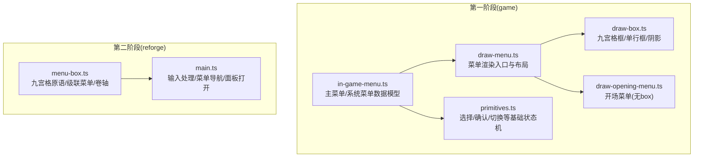
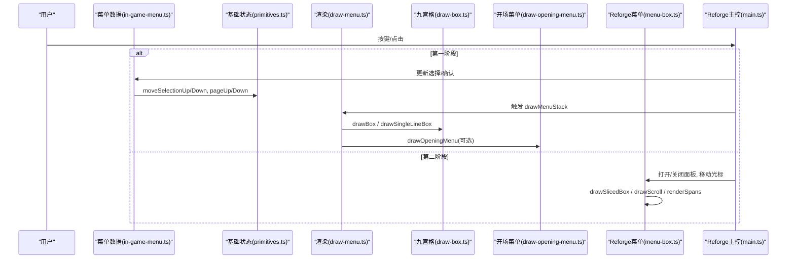
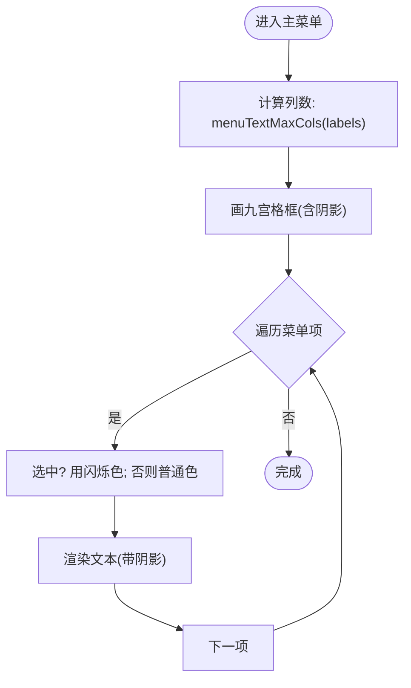
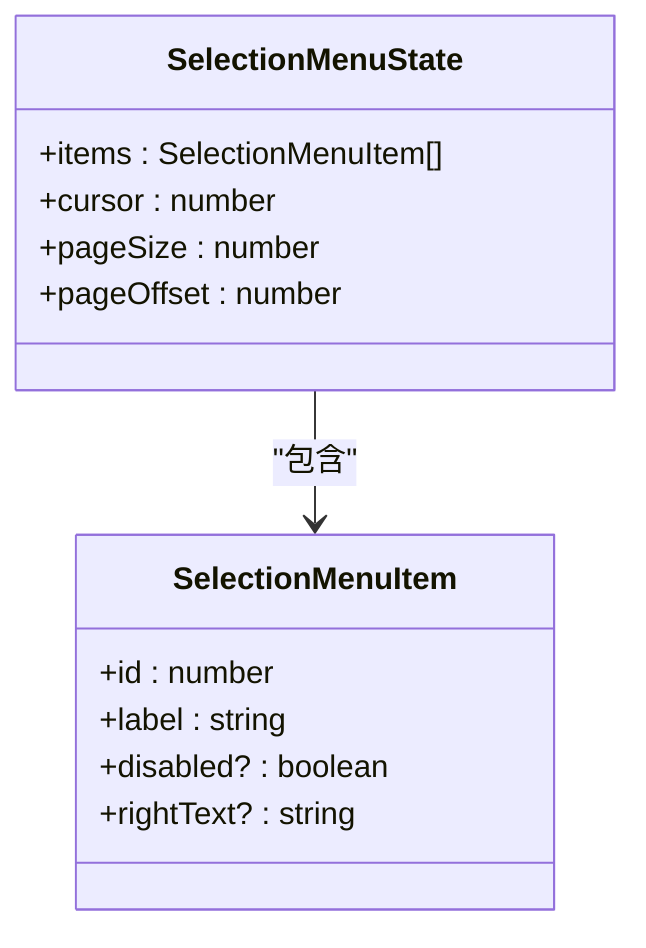
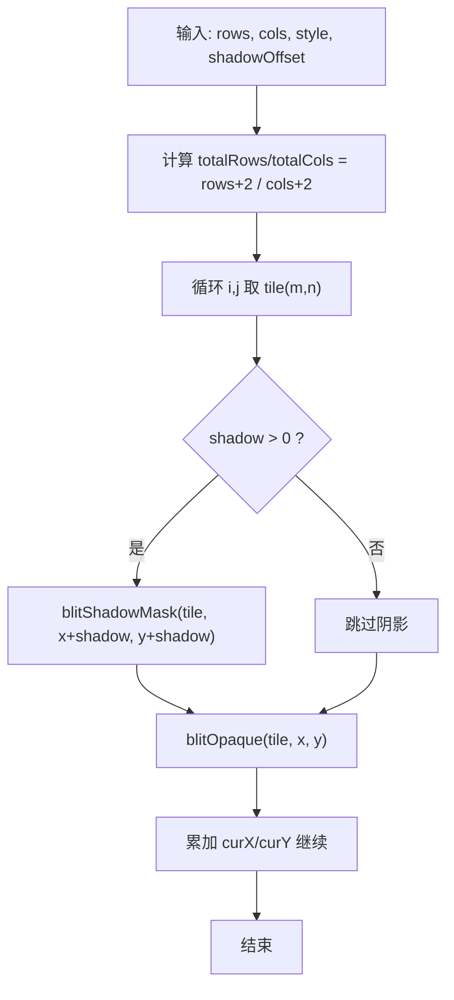
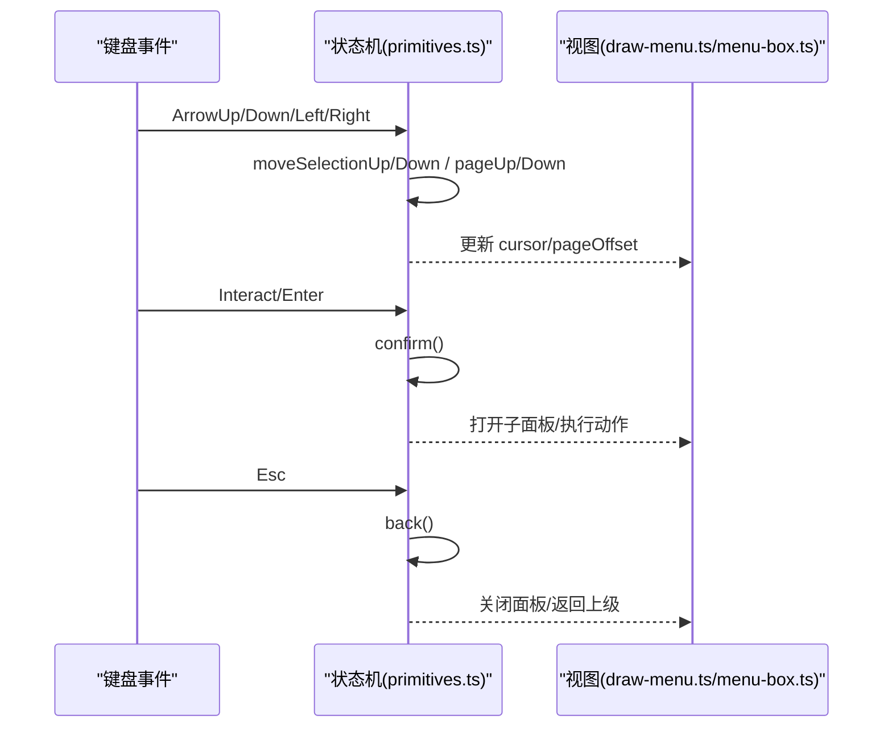
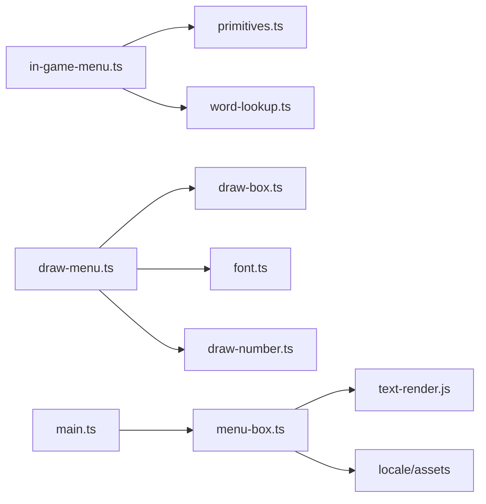

# 主菜单界面

<cite>
**本文引用的文件**   
- [packages/game/src/core/menu/in-game-menu.ts](file://packages/game/src/core/menu/in-game-menu.ts)
- [packages/game/src/present/menu/draw-menu.ts](file://packages/game/src/present/menu/draw-menu.ts)
- [packages/game/src/present/menu/draw-box.ts](file://packages/game/src/present/menu/draw-box.ts)
- [packages/game/src/present/menu/draw-opening-menu.ts](file://packages/game/src/present/menu/draw-opening-menu.ts)
- [packages/game/src/core/menu/primitives.ts](file://packages/game/src/core/menu/primitives.ts)
- [packages/reforge/src/menu/menu-box.ts](file://packages/reforge/src/menu/menu-box.ts)
- [packages/reforge/src/main.ts](file://packages/reforge/src/main.ts)
</cite>

## 目录
1. [简介](#简介)
2. [项目结构](#项目结构)
3. [核心组件](#核心组件)
4. [架构总览](#架构总览)
5. [详细组件分析](#详细组件分析)
6. [依赖关系分析](#依赖关系分析)
7. [性能与渲染特性](#性能与渲染特性)
8. [故障排查指南](#故障排查指南)
9. [结论](#结论)
10. [附录](#附录)

## 简介
本文件聚焦“主菜单界面”的实现，覆盖布局算法、渲染流程、菜单项遍历与状态表现、光标绘制、九宫格框应用与尺寸计算、点击区域检测与交互反馈、新增菜单项配置与样式自定义方法，以及响应式布局与高清渲染最佳实践。文档同时兼顾第一阶段（忠实还原）与第二阶段（Reforge 新引擎）两套实现路径，帮助读者在不同阶段快速定位对应代码并理解行为差异。

## 项目结构
- 第一阶段（game 包）：数据驱动 + 帧缓冲渲染，严格对照 sdlpal 真值坐标与颜色常量。
- 第二阶段（reforge 包）：Canvas 2D + 九宫格原语 + 文本渲染管线，支持高清缩放与更灵活的布局。

**图示来源** 
- [packages/game/src/core/menu/in-game-menu.ts:1-130](file://packages/game/src/core/menu/in-game-menu.ts#L1-L130)
- [packages/game/src/present/menu/draw-menu.ts:1-435](file://packages/game/src/present/menu/draw-menu.ts#L1-L435)
- [packages/game/src/present/menu/draw-box.ts:1-197](file://packages/game/src/present/menu/draw-box.ts#L1-L197)
- [packages/game/src/core/menu/primitives.ts:1-177](file://packages/game/src/core/menu/primitives.ts#L1-L177)
- [packages/game/src/present/menu/draw-opening-menu.ts:1-72](file://packages/game/src/present/menu/draw-opening-menu.ts#L1-L72)
- [packages/reforge/src/menu/menu-box.ts:1-248](file://packages/reforge/src/menu/menu-box.ts#L1-L248)
- [packages/reforge/src/main.ts:323-409](file://packages/reforge/src/main.ts#L323-L409)

**章节来源**
- [packages/game/src/core/menu/in-game-menu.ts:1-130](file://packages/game/src/core/menu/in-game-menu.ts#L1-L130)
- [packages/game/src/present/menu/draw-menu.ts:1-435](file://packages/game/src/present/menu/draw-menu.ts#L1-L435)
- [packages/game/src/present/menu/draw-box.ts:1-197](file://packages/game/src/present/menu/draw-box.ts#L1-L197)
- [packages/game/src/core/menu/primitives.ts:1-177](file://packages/game/src/core/menu/primitives.ts#L1-L177)
- [packages/game/src/present/menu/draw-opening-menu.ts:1-72](file://packages/game/src/present/menu/draw-opening-menu.ts#L1-L72)
- [packages/reforge/src/menu/menu-box.ts:1-248](file://packages/reforge/src/menu/menu-box.ts#L1-L248)
- [packages/reforge/src/main.ts:323-409](file://packages/reforge/src/main.ts#L323-L409)

## 核心组件
- 主菜单数据层：定义大世界主菜单与系统菜单的条目、默认光标记忆、向上/向下移动与选择映射。
- 渲染层：负责画框、文字、数字、阴影、选中闪烁、现金框等；按 sdlpal 真值坐标与颜色常量绘制。
- 基础状态机：提供 SelectionMenu/ConfirmMenu/SwitchMenu 等通用能力，供各菜单复用。
- Reforge 九宫格原语：统一 drawSlicedBox/drawScroll，支撑任意尺寸框与卷轴，配合 renderSpans 进行文本渲染。

**章节来源**
- [packages/game/src/core/menu/in-game-menu.ts:1-130](file://packages/game/src/core/menu/in-game-menu.ts#L1-L130)
- [packages/game/src/present/menu/draw-menu.ts:1-435](file://packages/game/src/present/menu/draw-menu.ts#L1-L435)
- [packages/game/src/present/menu/draw-box.ts:1-197](file://packages/game/src/present/menu/draw-box.ts#L1-L197)
- [packages/game/src/core/menu/primitives.ts:1-177](file://packages/game/src/core/menu/primitives.ts#L1-L177)
- [packages/reforge/src/menu/menu-box.ts:1-248](file://packages/reforge/src/menu/menu-box.ts#L1-L248)

## 架构总览
下图展示从输入到渲染的主菜单调用链，涵盖第一阶段与第二阶段两条路径。

**图示来源** 
- [packages/game/src/core/menu/in-game-menu.ts:1-130](file://packages/game/src/core/menu/in-game-menu.ts#L1-L130)
- [packages/game/src/core/menu/primitives.ts:1-177](file://packages/game/src/core/menu/primitives.ts#L1-L177)
- [packages/game/src/present/menu/draw-menu.ts:1-435](file://packages/game/src/present/menu/draw-menu.ts#L1-L435)
- [packages/game/src/present/menu/draw-box.ts:1-197](file://packages/game/src/present/menu/draw-box.ts#L1-L197)
- [packages/game/src/present/menu/draw-opening-menu.ts:1-72](file://packages/game/src/present/menu/draw-opening-menu.ts#L1-L72)
- [packages/reforge/src/menu/menu-box.ts:1-248](file://packages/reforge/src/menu/menu-box.ts#L1-L248)
- [packages/reforge/src/main.ts:323-409](file://packages/reforge/src/main.ts#L323-L409)

## 详细组件分析

### 主菜单布局与渲染流程（第一阶段）
- 布局要点
  - 主菜单框位置与行数：固定于 (x=3, y=37)，rows=3。
  - 菜单项起点：绝对坐标 (x=16, y=50)，行间距 18px。
  - 列数计算：基于菜单文案最大宽度，使用 menuTextMaxCols(texts) = floor((measureText(t)+8)/16) - 1，确保与原版一致。
  - 系统菜单：框位置 (40, 60)，项起点 (53, 72)，rows = nItems - 1。
- 渲染步骤
  - 先画九宫格框（含阴影），再逐行渲染文本。
  - 选中项颜色动态闪烁：MENUITEM_COLOR_SELECTED_FIRST + floor(now/100) % 6。
  - 未选项颜色：MENUITEM_COLOR。
  - 文本带三重阴影（fShadow=TRUE）。
- 现金框
  - 主菜单弹出时左上角显示单行框 + “金钱”标签 + 黄色数字右对齐。

**图示来源** 
- [packages/game/src/present/menu/draw-menu.ts:260-316](file://packages/game/src/present/menu/draw-menu.ts#L260-L316)
- [packages/game/src/present/menu/draw-box.ts:1-197](file://packages/game/src/present/menu/draw-box.ts#L1-L197)

**章节来源**
- [packages/game/src/present/menu/draw-menu.ts:52-70](file://packages/game/src/present/menu/draw-menu.ts#L52-L70)
- [packages/game/src/present/menu/draw-menu.ts:260-316](file://packages/game/src/present/menu/draw-menu.ts#L260-L316)
- [packages/game/src/present/menu/draw-box.ts:25-32](file://packages/game/src/present/menu/draw-box.ts#L25-L32)

### 菜单项遍历与 enabled/disabled 视觉区分
- 遍历机制
  - 使用 SelectionMenuState 维护 items、cursor、pageSize、pageOffset。
  - 上/下移动为 ±1 环绕，不跳过 disabled 项（与原版 PAL_ReadMenu 行为一致）。
  - 翻页 PgUp/PgDn 会跳到下一页第一个可选项，保证可见性。
- 视觉区分
  - disabled 项仍可被光标停留，但确认操作由上层菜单逻辑拒绝。
  - 在 Reforge 中，disabled 项使用专用颜色（COLOR_DISABLED/COLOR_DISABLED_SEL），启用项使用 COLOR_NORMAL，选中项在非最深层或子面板打开时使用静态高亮，避免与子面板闪烁冲突。

**图示来源** 
- [packages/game/src/core/menu/primitives.ts:14-31](file://packages/game/src/core/menu/primitives.ts#L14-L31)

**章节来源**
- [packages/game/src/core/menu/primitives.ts:50-128](file://packages/game/src/core/menu/primitives.ts#L50-L128)
- [packages/reforge/src/menu/menu-box.ts:461-485](file://packages/reforge/src/menu/menu-box.ts#L461-L485)

### 光标绘制位置与样式
- 第一阶段
  - 光标通过“选中项”的颜色闪烁体现，无独立光标精灵；文本渲染自带阴影。
- 第二阶段
  - 光标以层级高亮表示：父层选中项静态高亮指示已展开路径，最深层选中项闪烁；禁用项使用禁用色。
  - 光标位置由当前 level.cursor 与节点索引决定，结合 BOX 起始坐标与 ITEM_H 行高计算。

**章节来源**
- [packages/game/src/present/menu/draw-menu.ts:67-69](file://packages/game/src/present/menu/draw-menu.ts#L67-L69)
- [packages/reforge/src/menu/menu-box.ts:461-485](file://packages/reforge/src/menu/menu-box.ts#L461-L485)

### 九宫格框在主菜单中的应用与尺寸计算
- 第一阶段
  - 使用 drawBox(rows, cols, style, shadowOffset) 绘制 3×N 网格，每 tile 先阴影后正色，顺序与原版一致。
  - 单行框用于现金框与存档槽位。
- 第二阶段
  - 统一原语 drawSlicedBox(ctx, boxTiles, x, y, w, h) 支持任意宽高，四边平铺、四角原尺寸；大阴影按镂空形状偏移绘制。
  - 卷轴 drawScroll(ctx, scroll, x, y, nLen) 将九宫格素材组合成横向/纵向卷轴。

**图示来源** 
- [packages/game/src/present/menu/draw-box.ts:70-104](file://packages/game/src/present/menu/draw-box.ts#L70-L104)
- [packages/reforge/src/menu/menu-box.ts:84-120](file://packages/reforge/src/menu/menu-box.ts#L84-L120)

**章节来源**
- [packages/game/src/present/menu/draw-box.ts:1-197](file://packages/game/src/present/menu/draw-box.ts#L1-L197)
- [packages/reforge/src/menu/menu-box.ts:84-120](file://packages/reforge/src/menu/menu-box.ts#L84-L120)

### 点击区域检测与交互反馈
- 第一阶段
  - 键盘驱动：方向键移动光标，Enter 确认，Esc 返回；翻页 PgUp/PgDn 调整页偏移。
  - 确认分支：根据菜单类型（主菜单/系统菜单/装备/物品/法术等）执行不同动作。
- 第二阶段
  - 输入映射：Left/Up 等价，Right/Down 等价；Interact 确认；Esc 返回。
  - 交互反馈：选中项闪烁或静态高亮；子面板打开时父层高亮保持，子面板自身闪烁。

**图示来源** 
- [packages/game/src/core/menu/primitives.ts:89-128](file://packages/game/src/core/menu/primitives.ts#L89-L128)
- [packages/reforge/src/main.ts:606-712](file://packages/reforge/src/main.ts#L606-L712)

**章节来源**
- [packages/game/src/core/menu/primitives.ts:89-128](file://packages/game/src/core/menu/primitives.ts#L89-L128)
- [packages/reforge/src/main.ts:606-712](file://packages/reforge/src/main.ts#L606-L712)

### 添加新菜单项的配置方法与自定义样式指南
- 添加新菜单项（第一阶段）
  - 在 in-game-menu.ts 的 IN_GAME_LABELS 或 SYSTEM_LABELS 追加条目，指定 WORD id、choice 与 fallback。
  - 渲染层自动读取 labels 列表，按 menuTextMaxCols 计算列数，逐行渲染。
- 自定义样式（第一阶段）
  - 修改 MENUITEM_COLOR/MENUITEM_COLOR_SELECTED_* 常量控制颜色与闪烁频率。
  - 调整 LINE_HEIGHT、IN_GAME_MENU_ITEM_START/SYSTEM_MENU_ITEM_START 控制行距与起始位置。
- 添加新菜单项（第二阶段）
  - 在菜单数据源中添加节点，设置 label、enabled 等属性；渲染层依据节点数组动态绘制。
- 自定义样式（第二阶段）
  - 通过 renderSpans 的 forceRgba 参数设置颜色；使用 SELECTED_COLORS 控制选中闪烁；使用 COLOR_DISABLED/COLOR_DISABLED_SEL 控制禁用态。
  - 九宫格框与卷轴通过 assets.box/scroll 资源与 drawSlicedBox/drawScroll 统一绘制。

**章节来源**
- [packages/game/src/core/menu/in-game-menu.ts:28-47](file://packages/game/src/core/menu/in-game-menu.ts#L28-L47)
- [packages/game/src/present/menu/draw-menu.ts:46-56](file://packages/game/src/present/menu/draw-menu.ts#L46-L56)
- [packages/reforge/src/menu/menu-box.ts:461-485](file://packages/reforge/src/menu/menu-box.ts#L461-L485)

### 开场菜单（无九宫格框）
- 直接在全屏背景上绘制两行文字，选中项闪烁，未选项普通色。
- 文案居中公式：x = 125 - max(0, (w-4)*8)，y 分别为 95/112。

**章节来源**
- [packages/game/src/present/menu/draw-opening-menu.ts:32-71](file://packages/game/src/present/menu/draw-opening-menu.ts#L32-L71)

## 依赖关系分析
- 数据层依赖
  - in-game-menu.ts 依赖 primitives.ts 的选择/翻页能力，依赖 word-lookup.ts 获取本地化文案。
- 渲染层依赖
  - draw-menu.ts 依赖 draw-box.ts 的九宫格/单行框与阴影，依赖 font.ts 的文本测量与渲染，依赖 draw-number.ts 的数字绘制。
- Reforge 层依赖
  - menu-box.ts 依赖 text-render.js 的 measureSpans/renderSpans，依赖 locale 与 assets 资源。
  - main.ts 负责输入分发与面板打开/关闭。

**图示来源** 
- [packages/game/src/core/menu/in-game-menu.ts:1-130](file://packages/game/src/core/menu/in-game-menu.ts#L1-L130)
- [packages/game/src/present/menu/draw-menu.ts:1-435](file://packages/game/src/present/menu/draw-menu.ts#L1-L435)
- [packages/reforge/src/menu/menu-box.ts:1-248](file://packages/reforge/src/menu/menu-box.ts#L1-L248)
- [packages/reforge/src/main.ts:323-409](file://packages/reforge/src/main.ts#L323-L409)

**章节来源**
- [packages/game/src/core/menu/in-game-menu.ts:1-130](file://packages/game/src/core/menu/in-game-menu.ts#L1-L130)
- [packages/game/src/present/menu/draw-menu.ts:1-435](file://packages/game/src/present/menu/draw-menu.ts#L1-L435)
- [packages/reforge/src/menu/menu-box.ts:1-248](file://packages/reforge/src/menu/menu-box.ts#L1-L248)
- [packages/reforge/src/main.ts:323-409](file://packages/reforge/src/main.ts#L323-L409)

## 性能与渲染特性
- 固定步长与逻辑速率：主循环采用固定步长，探索/菜单 10fps，战斗 25fps，逻辑与渲染同帧。
- 字体与点阵放大：字模点阵整数倍放大（WORLD_SCALE=4），锐利且比例不变。
- 九宫格平铺：非拉伸，按 tile 实际宽高平铺，避免失真。
- 阴影优化：第一阶段按 tile-by-tile 单循环绘制阴影与正色，边缘平滑；第二阶段通过离屏 canvas 生成阴影剪影，减少重复计算。

[本节为通用指导，无需具体文件引用]

## 故障排查指南
- 缺失 UI 资源
  - 现象：菜单空白或报错提示缺少 uiSpriteFrames。
  - 排查：检查 SPRITEUI frame 是否完整加载（style*9 + i*3 + j 索引）。
- 文案错位
  - 现象：菜单项偏移异常。
  - 排查：确认 menuTextMaxCols 计算与 LINE_HEIGHT、起始坐标是否与 sdlpal 真值一致。
- 禁用项不可交互
  - 现象：禁用项无法确认。
  - 排查：确认上层菜单逻辑对 disabled 项的确认分支是否正确拒绝。
- 第二阶段高亮冲突
  - 现象：父层与子层选中闪烁重叠。
  - 排查：确保最深层选中项闪烁，父层仅静态高亮。

**章节来源**
- [packages/game/src/present/menu/draw-box.ts:74-80](file://packages/game/src/present/menu/draw-box.ts#L74-L80)
- [packages/game/src/present/menu/draw-menu.ts:260-316](file://packages/game/src/present/menu/draw-menu.ts#L260-L316)
- [packages/reforge/src/menu/menu-box.ts:461-485](file://packages/reforge/src/menu/menu-box.ts#L461-L485)

## 结论
主菜单在第一阶段严格复刻 sdlpal 真值坐标、颜色与阴影行为，在第二阶段通过九宫格原语与文本渲染管线实现灵活布局与高清渲染。两者均围绕数据驱动的菜单项遍历、光标与选中态表现、九宫格框与卷轴绘制、以及清晰的输入-状态-渲染链路构建。遵循本文档的布局算法与样式指南，可高效扩展菜单项与自定义外观，并在多分辨率设备上保持一致体验。

[本节为总结，无需具体文件引用]

## 附录
- 关键常量与坐标参考
  - 主菜单框：(3, 37), rows=3；项起点 (16, 50), 行距 18。
  - 系统菜单框：(40, 60)；项起点 (53, 72)。
  - 现金框：单行框 len=5，标签 (10, 10)，数字 (49, 14) 右对齐。
- 颜色与闪烁
  - 普通色：MENUITEM_COLOR；选中色：MENUITEM_COLOR_SELECTED_FIRST + tick/100 % 6。
- 九宫格与阴影
  - 第一阶段：tile-by-tile 单循环，先阴影后正色。
  - 第二阶段：drawSlicedBox/drawScroll 统一原语，阴影按镂空形状偏移。

**章节来源**
- [packages/game/src/present/menu/draw-menu.ts:52-62](file://packages/game/src/present/menu/draw-menu.ts#L52-L62)
- [packages/game/src/present/menu/draw-menu.ts:46-49](file://packages/game/src/present/menu/draw-menu.ts#L46-L49)
- [packages/game/src/present/menu/draw-box.ts:70-104](file://packages/game/src/present/menu/draw-box.ts#L70-L104)
- [packages/reforge/src/menu/menu-box.ts:84-120](file://packages/reforge/src/menu/menu-box.ts#L84-L120)