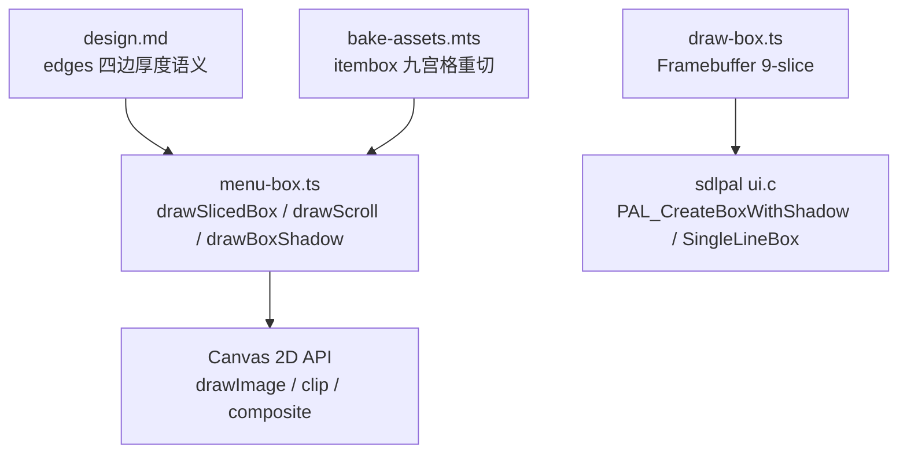
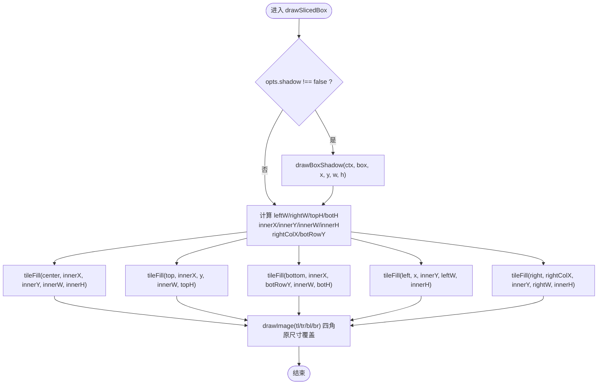
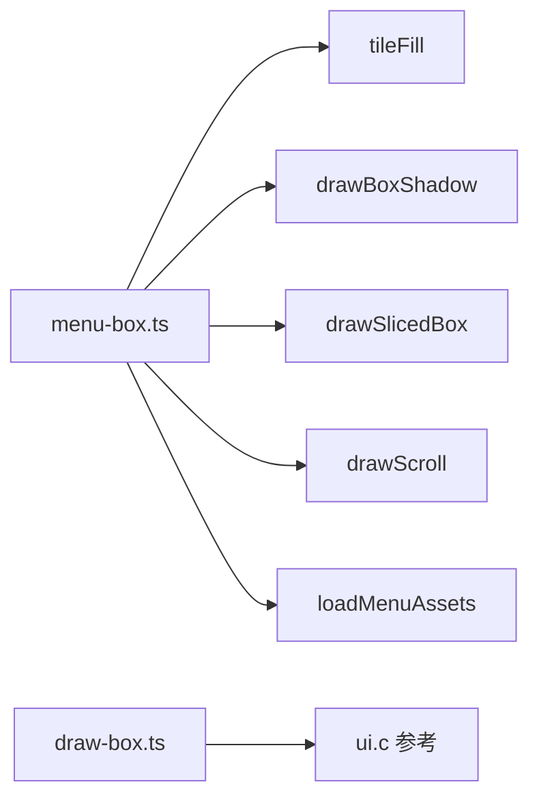
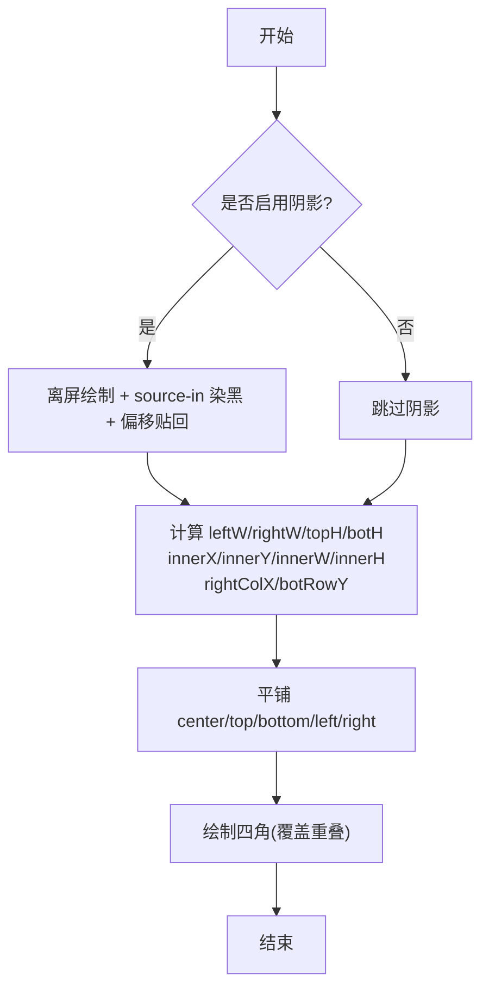

# 可切片框原语

<cite>
**本文引用的文件**
- [packages/reforge/src/menu/menu-box.ts](file://packages/reforge/src/menu/menu-box.ts)
- [packages/game/src/present/menu/draw-box.ts](file://packages/game/src/present/menu/draw-box.ts)
- [reference/sdlpal/ui.c](file://reference/sdlpal/ui.c)
- [docs/phase2/menu/design.md](file://docs/phase2/menu/design.md)
- [packages/migrate/scripts/bake-assets.mts](file://packages/migrate/scripts/bake-assets.mts)
</cite>

## 目录
1. [简介](#简介)
2. [项目结构](#项目结构)
3. [核心组件](#核心组件)
4. [架构总览](#架构总览)
5. [详细组件分析](#详细组件分析)
6. [依赖关系分析](#依赖关系分析)
7. [性能考量](#性能考量)
8. [故障排查指南](#故障排查指南)
9. [结论](#结论)
10. [附录](#附录)

## 简介
本文件聚焦“可切片框原语”的实现与使用，围绕 drawSlicedBox 的核心算法、九宫格切片的 source rect 计算与 drawImage 参数映射、阴影绘制流程（整框偏移 + 半透明黑色）、以及横卷轴/纵卷轴的统一适配展开。同时给出自定义边框素材的集成方法与性能优化建议，帮助读者在不改动素材的前提下，通过代码将任意尺寸的框以像素级精度渲染。

## 项目结构
- 菜单 UI 与可切片框原语位于 reforge 包：packages/reforge/src/menu/menu-box.ts
- 游戏底层 Framebuffer 版 9-slice 实现位于 game 包：packages/game/src/present/menu/draw-box.ts
- 原版 SDL 参考实现位于 reference/sdlpal/ui.c
- 设计文档说明统一原语理念与 edges 语义：docs/phase2/menu/design.md
- 资源烘焙脚本对 itembox 等素材进行九宫格重切：packages/migrate/scripts/bake-assets.mts



图表来源
- [packages/reforge/src/menu/menu-box.ts:84-132](file://packages/reforge/src/menu/menu-box.ts#L84-L132)
- [packages/game/src/present/menu/draw-box.ts:64-196](file://packages/game/src/present/menu/draw-box.ts#L64-L196)
- [reference/sdlpal/ui.c:148-318](file://reference/sdlpal/ui.c#L148-L318)
- [docs/phase2/menu/design.md:66-74](file://docs/phase2/menu/design.md#L66-L74)
- [packages/migrate/scripts/bake-assets.mts:166-194](file://packages/migrate/scripts/bake-assets.mts#L166-L194)

章节来源
- [packages/reforge/src/menu/menu-box.ts:84-132](file://packages/reforge/src/menu/menu-box.ts#L84-L132)
- [packages/game/src/present/menu/draw-box.ts:64-196](file://packages/game/src/present/menu/draw-box.ts#L64-L196)
- [reference/sdlpal/ui.c:148-318](file://reference/sdlpal/ui.c#L148-L318)
- [docs/phase2/menu/design.md:66-74](file://docs/phase2/menu/design.md#L66-L74)
- [packages/migrate/scripts/bake-assets.mts:166-194](file://packages/migrate/scripts/bake-assets.mts#L166-L194)

## 核心组件
- drawSlicedBox(ctx, box, x, y, w, h, opts)
  - 输入：Canvas 上下文、九宫格 tiles（索引 i*3+j）、目标矩形 (x,y,w,h)、可选 shadow 开关
  - 行为：先画大阴影（可选），再按九宫格平铺中心与四边，最后贴四角
- tileFill(ctx, img, dx, dy, dw, dh)
  - 在裁剪区域内重复绘制 tile，避免拉伸变形
- drawBoxShadow(ctx, box, x, y, w, h)
  - 离屏绘制框 → source-in 染黑 → 全局透明度叠加并整体偏移
- drawScroll(ctx, scroll, x, y, nLen, opts)
  - 单行卷轴：根据 leftW + midW*nLen + rightW 计算宽，自然高由上中下三块高度相加，再委托 drawSlicedBox

章节来源
- [packages/reforge/src/menu/menu-box.ts:29-48](file://packages/reforge/src/menu/menu-box.ts#L29-L48)
- [packages/reforge/src/menu/menu-box.ts:54-77](file://packages/reforge/src/menu/menu-box.ts#L54-L77)
- [packages/reforge/src/menu/menu-box.ts:84-132](file://packages/reforge/src/menu/menu-box.ts#L84-L132)
- [packages/reforge/src/menu/menu-box.ts:232-248](file://packages/reforge/src/menu/menu-box.ts#L232-L248)

## 架构总览
下图展示 drawSlicedBox 与其辅助函数的调用关系与职责边界。



图表来源
- [packages/reforge/src/menu/menu-box.ts:54-77](file://packages/reforge/src/menu/menu-box.ts#L54-L77)
- [packages/reforge/src/menu/menu-box.ts:84-132](file://packages/reforge/src/menu/menu-box.ts#L84-L132)

## 详细组件分析

### drawSlicedBox 核心算法与 edges 语义
- 九宫格布局
  - 索引约定：tiles[i*3+j]，i=行(0上/1中/2下)，j=列(0左/1中/2右)
  - 取四角与四边中间块：tl,tr,bl,br,top,bottom,left,right,center
- 自动退化机制
  - 若某边缺失或宽度/高度为 0，对应区域不绘制；当上下厚度为 0 时退化为横卷轴；左右厚度为 0 时退化为纵卷轴
- 定位与对齐
  - leftW/rightW/topH/botH 取自对应 tile 的实际宽高（回退到角块）
  - innerX = x + leftW，innerY = y + topH
  - innerW = w - leftW - rightW，innerH = h - topH - botH
  - rightColX = x + w - rightW（右列锚左边缘对齐中段右边界，保证卷轴头探出）
  - botRowY = y + h - botH（下行锚底）
- 绘制顺序
  - 先中心与四边 tileFill 平铺（非拉伸）
  - 后四角 drawImage 原尺寸覆盖，修复重叠端
- 与 sdlpal 的一致性
  - 原版 PAL_CreateBox 逐块拼接，右列各行左边缘对齐；此处修正了“右对齐”导致的错位问题

章节来源
- [packages/reforge/src/menu/menu-box.ts:84-132](file://packages/reforge/src/menu/menu-box.ts#L84-L132)
- [reference/sdlpal/ui.c:148-205](file://reference/sdlpal/ui.c#L148-L205)

### 九宫格 source rect 与 drawImage 参数映射
- 当前实现采用“预切九宫格素材”的方式：每个 frame 已切好，直接作为 ImageBitmap 传入，无需运行时计算 source rect
- 若需从整图切分，可按以下规则计算 source rect 并映射到 drawImage：
  - 左上角：src=(0,0), dst=(x, y)
  - 右上角：src=(w_img - rightW, 0), dst=(rightColX, y)
  - 左下角：src=(0, h_img - botH), dst=(x, botRowY)
  - 右下角：src=(w_img - rightW, h_img - botH), dst=(rightColX, botRowY)
  - 上边：src=(leftW, 0, innerW, topH), dst=(innerX, y, innerW, topH)
  - 下边：src=(leftW, h_img - botH, innerW, botH), dst=(innerX, botRowY, innerW, botH)
  - 左边：src=(0, topH, leftW, innerH), dst=(x, innerY, leftW, innerH)
  - 右边：src=(w_img - rightW, topH, rightW, innerH), dst=(rightColX, innerY, rightW, innerH)
  - 中心：src=(leftW, topH, innerW, innerH), dst=(innerX, innerY, innerW, innerH)
- 注意：
  - 右列对齐以 rightColX 为准，确保卷轴头向右探出
  - 四角最后绘制，盖住相邻边的重叠部分

章节来源
- [packages/reforge/src/menu/menu-box.ts:107-132](file://packages/reforge/src/menu/menu-box.ts#L107-L132)

### 阴影效果绘制算法
- 思路
  - 离屏 canvas 绘制一次框（shadow:false 避免递归）
  - 使用 globalCompositeOperation='source-in' 仅保留已有像素，填充纯黑，得到“镂空形状”的黑色剪影
  - 设置全局透明度（约 0.35），将剪影整体偏移 (+6,+6) 后贴回主画布
- 与原版的对应
  - 仿照 sdlpal 的 shadow offset（默认 6），但原版基于像素遮罩动态计算阴影色；本实现用整框偏移 + 半透明黑近似等效视觉效果

```mermaid
sequenceDiagram
participant Caller as "调用方"
participant Box as "drawSlicedBox"
participant Shadow as "drawBoxShadow"
participant Off as "离屏 Canvas"
participant Main as "主画布"
Caller->>Box : 请求绘制框(x,y,w,h)
Box->>Shadow : 需要阴影?
Shadow->>Off : 绘制框(无递归)
Shadow->>Off : source-in 填黑(保形状)
Shadow->>Main : globalAlpha≈0.35, 偏移(+6,+6) 贴剪影
Box->>Main : 绘制九宫格主体(中心+四边+四角)
```

图表来源
- [packages/reforge/src/menu/menu-box.ts:54-77](file://packages/reforge/src/menu/menu-box.ts#L54-L77)
- [packages/reforge/src/menu/menu-box.ts:84-132](file://packages/reforge/src/menu/menu-box.ts#L84-L132)
- [reference/sdlpal/ui.c:201-218](file://reference/sdlpal/ui.c#L201-L218)

章节来源
- [packages/reforge/src/menu/menu-box.ts:54-77](file://packages/reforge/src/menu/menu-box.ts#L54-L77)
- [reference/sdlpal/ui.c:201-218](file://reference/sdlpal/ui.c#L201-L218)

### 不同边框样式的适配方法
- 横卷轴（上下边厚度为 0）
  - 上下边 tile 不存在或高度为 0，则只横向平铺 left/center/right，形成单行卷轴
  - 可通过 drawScroll 便捷生成：宽 = leftW + midW*nLen + rightW，高 = topH + midH + botH
- 纵卷轴（四边都有厚度）
  - 四边均存在，左右纵向平铺，上下横向平铺，中心双向平铺
- 统一处理
  - 所有样式均走同一 drawSlicedBox，差异仅在 tiles 内容与 edges（即各 tile 实际宽高）

章节来源
- [packages/reforge/src/menu/menu-box.ts:232-248](file://packages/reforge/src/menu/menu-box.ts#L232-L248)
- [docs/phase2/menu/design.md:66-74](file://docs/phase2/menu/design.md#L66-L74)

### 自定义边框素材集成方法
- 素材准备
  - 将任意框拆分为 9 个 PNG（frame-00..08），索引 i*3+j
  - 对于 itembox 等整图，可用 bake-assets.mts 重切为九宫格
- 加载与注入
  - 通过 loadMenuAssets 批量加载各 frame 为 ImageBitmap，封装为 BoxTiles
  - 将 assets.box/redBox/scroll/itembox 等传入 drawSlicedBox 即可
- 注意事项
  - 保持 frame 命名与索引一致
  - 若某些边不需要（如横卷轴），可不提供对应 frame，函数会退化

章节来源
- [packages/reforge/src/menu/menu-box.ts:356-419](file://packages/reforge/src/menu/menu-box.ts#L356-L419)
- [packages/migrate/scripts/bake-assets.mts:166-194](file://packages/migrate/scripts/bake-assets.mts#L166-L194)

## 依赖关系分析
- 模块内依赖
  - drawSlicedBox 依赖 tileFill 与 drawBoxShadow
  - drawScroll 复用 drawSlicedBox，仅负责计算 w/h
- 跨模块依赖
  - reforge 菜单 UI 消费 MenuAssets（含 box/redBox/scroll/itembox）
  - game 包 draw-box.ts 提供 Framebuffer 版 9-slice 与单行框，对照 sdlpal ui.c 真值
- 外部依赖
  - Canvas 2D API（drawImage、clip、composite）
  - 浏览器 fetch/createImageBitmap 用于资源加载



图表来源
- [packages/reforge/src/menu/menu-box.ts:29-48](file://packages/reforge/src/menu/menu-box.ts#L29-L48)
- [packages/reforge/src/menu/menu-box.ts:54-77](file://packages/reforge/src/menu/menu-box.ts#L54-L77)
- [packages/reforge/src/menu/menu-box.ts:84-132](file://packages/reforge/src/menu/menu-box.ts#L84-L132)
- [packages/reforge/src/menu/menu-box.ts:232-248](file://packages/reforge/src/menu/menu-box.ts#L232-L248)
- [packages/game/src/present/menu/draw-box.ts:64-196](file://packages/game/src/present/menu/draw-box.ts#L64-L196)
- [reference/sdlpal/ui.c:148-318](file://reference/sdlpal/ui.c#L148-L318)

章节来源
- [packages/reforge/src/menu/menu-box.ts:29-48](file://packages/reforge/src/menu/menu-box.ts#L29-L48)
- [packages/reforge/src/menu/menu-box.ts:54-77](file://packages/reforge/src/menu/menu-box.ts#L54-L77)
- [packages/reforge/src/menu/menu-box.ts:84-132](file://packages/reforge/src/menu/menu-box.ts#L84-L132)
- [packages/reforge/src/menu/menu-box.ts:232-248](file://packages/reforge/src/menu/menu-box.ts#L232-L248)
- [packages/game/src/present/menu/draw-box.ts:64-196](file://packages/game/src/present/menu/draw-box.ts#L64-L196)
- [reference/sdlpal/ui.c:148-318](file://reference/sdlpal/ui.c#L148-L318)

## 性能考量
- 避免运行时拉伸
  - 使用 tileFill 平铺而非拉伸，减少 GPU 缩放开销并保持像素风格
- 控制离屏绘制次数
  - 阴影通过离屏 canvas 一次性生成剪影，避免每帧多次复合操作
- 资源预烘与缓存
  - 素材预烘为 RGBA 的 ImageBitmap，减少运行时解码成本
- 裁剪区域最小化
  - tileFill 内部使用 clip，限制绘制范围，降低无效像素写入
- 批量加载
  - 使用 Promise.all 并行加载多资源，缩短首帧等待时间

[本节为通用指导，不直接分析具体文件]

## 故障排查指南
- 右侧阴影被裁
  - 现象：阴影在右侧不完整
  - 原因：离屏画布未预留卷轴头探出空间
  - 解决：离屏画布宽高增加余量（例如 +16），确保阴影不被裁切
- 右列对齐错位
  - 现象：右上角/右下角与右边框未对齐
  - 原因：误将右列“右对齐”
  - 解决：右列左边缘使用 rightColX = x + w - rightW，与中段右边界对齐
- 缺少某个 frame
  - 现象：某边未绘制或报错
  - 原因：对应 tile 未提供
  - 解决：补齐 frame-xx.png 或在逻辑中允许退化（如横卷轴不提供上下边）
- 阴影颜色不一致
  - 现象：阴影偏亮/偏暗
  - 原因：globalAlpha 或背景底色影响
  - 解决：调整透明度或确保背景稳定；如需像素级精确，可参考 game 包的 blitShadowMask 方案

章节来源
- [packages/reforge/src/menu/menu-box.ts:54-77](file://packages/reforge/src/menu/menu-box.ts#L54-L77)
- [packages/reforge/src/menu/menu-box.ts:107-132](file://packages/reforge/src/menu/menu-box.ts#L107-L132)
- [packages/game/src/present/menu/draw-box.ts:120-146](file://packages/game/src/present/menu/draw-box.ts#L120-L146)

## 结论
drawSlicedBox 以“九宫格 + 平铺 + 四角覆盖”的策略，实现了任意尺寸的可切片框原语。配合 drawBoxShadow 的整框偏移 + 半透明黑色，既还原了原版阴影观感，又避免了复杂的逐像素遮罩计算。通过统一的接口，横卷轴与纵卷轴得以在同一原语下无缝适配，极大降低了 UI 扩展与维护成本。结合 bake-assets 的资源重切与预烘策略，可在零运行时重绘的前提下获得高性能表现。

[本节为总结性内容，不直接分析具体文件]

## 附录

### 关键流程图：drawSlicedBox 执行路径


图表来源
- [packages/reforge/src/menu/menu-box.ts:54-77](file://packages/reforge/src/menu/menu-box.ts#L54-L77)
- [packages/reforge/src/menu/menu-box.ts:84-132](file://packages/reforge/src/menu/menu-box.ts#L84-L132)