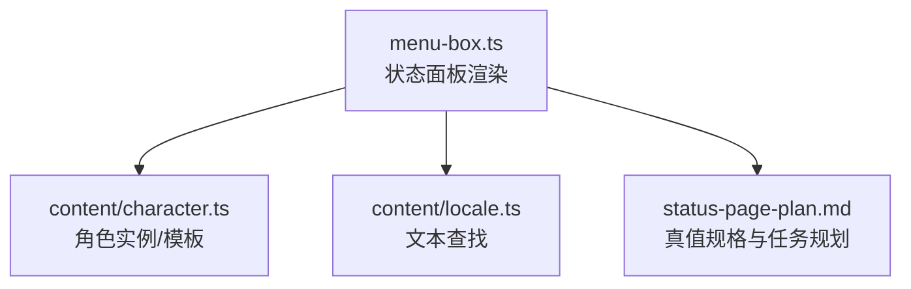
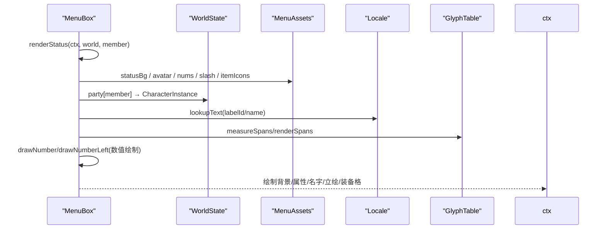
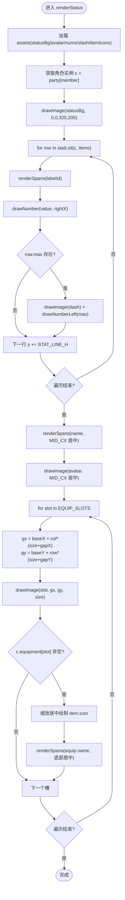
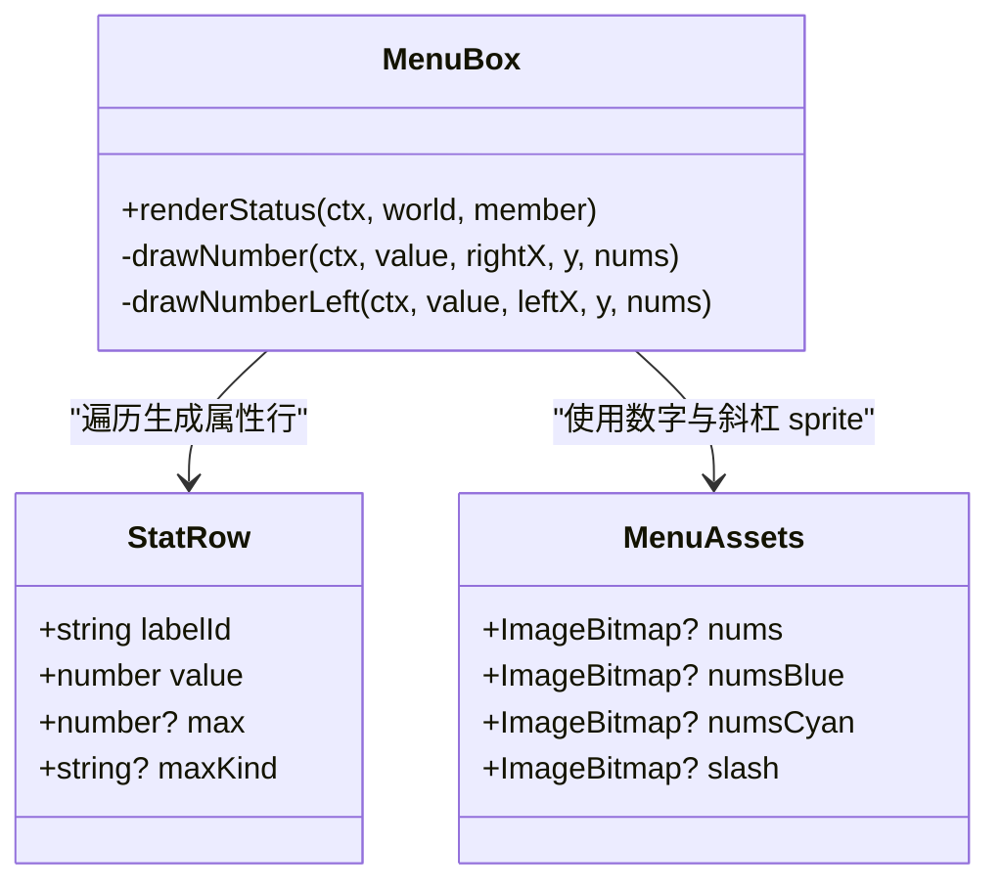
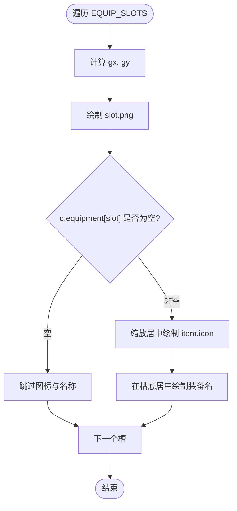
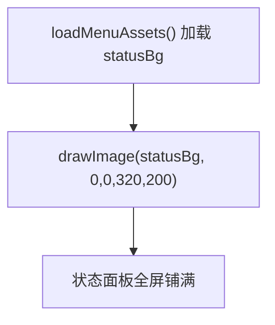
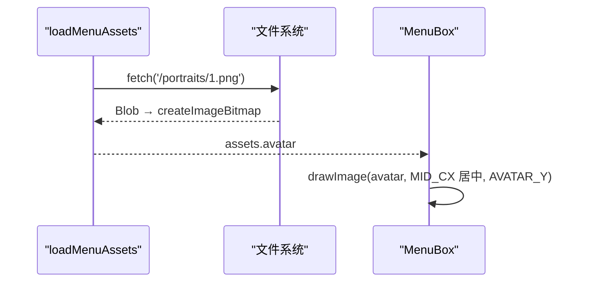
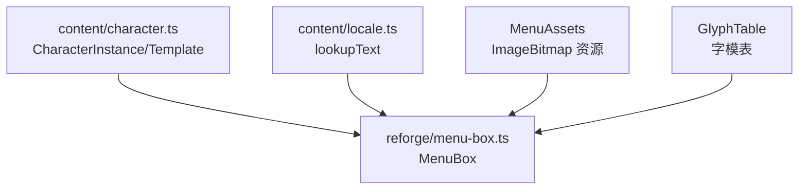

# 状态面板界面

<cite>
**本文引用的文件**
- [packages/reforge/src/menu/menu-box.ts](file://packages/reforge/src/menu/menu-box.ts)
- [docs/phase2/menu/status-page-plan.md](file://docs/phase2/menu/status-page-plan.md)
- [packages/content/src/character.ts](file://packages/content/src/character.ts)
- [packages/content/src/locale.ts](file://packages/content/src/locale.ts)
</cite>

## 目录
1. [简介](#简介)
2. [项目结构](#项目结构)
3. [核心组件](#核心组件)
4. [架构总览](#架构总览)
5. [详细组件分析](#详细组件分析)
6. [依赖关系分析](#依赖关系分析)
7. [性能与内存管理](#性能与内存管理)
8. [故障排查指南](#故障排查指南)
9. [结论](#结论)
10. [附录：扩展指南](#附录扩展指南)

## 简介
本文件聚焦于“状态面板”界面的实现，围绕数据驱动布局、属性列表动态生成、装备槽位遍历渲染、数值格式化（HP/MP 当前/最大）、空槽视觉表示、背景全屏铺满、角色立绘加载与显示等关键点进行系统化说明。同时提供新增属性字段与自定义显示格式的扩展方法，以及面向 Canvas 2D 的性能优化与内存管理最佳实践。

## 项目结构
状态面板位于第二阶段 Reforge 的菜单 UI 模块中，采用三栏布局：左侧属性列、中间名字+立绘、右侧 2×3 装备格网格。其关键实现集中在菜单绘制模块，并通过内容层的数据结构与本地化表驱动显示。

图表来源
- [packages/reforge/src/menu/menu-box.ts:487-559](file://packages/reforge/src/menu/menu-box.ts#L487-L559)
- [packages/content/src/character.ts:36-85](file://packages/content/src/character.ts#L36-L85)
- [packages/content/src/locale.ts:6-9](file://packages/content/src/locale.ts#L6-L9)
- [docs/phase2/menu/status-page-plan.md:10-27](file://docs/phase2/menu/status-page-plan.md#L10-L27)

章节来源
- [packages/reforge/src/menu/menu-box.ts:1-561](file://packages/reforge/src/menu/menu-box.ts#L1-L561)
- [docs/phase2/menu/status-page-plan.md:1-83](file://docs/phase2/menu/status-page-plan.md#L1-L83)

## 核心组件
- 菜单资产加载器：负责预烘 PNG → ImageBitmap，包括状态背景、装备格、数字 sprite、斜杠、角色立绘、物品图标等。
- 九宫格框原语：支持不规则边框平铺与阴影，用于菜单框、卷轴、确认框等。
- 数字绘制原语：右对齐与左对齐两种模式，分别用于当前值与最大值。
- 状态面板渲染器：按三栏布局绘制属性、名字、立绘与装备格。
- 数据驱动列表：属性行通过 statList 生成；装备槽通过 EQUIP_SLOTS 枚举驱动。
- 文本查找：基于 locale 表将 TextId 映射为本地化字符串。

章节来源
- [packages/reforge/src/menu/menu-box.ts:356-419](file://packages/reforge/src/menu/menu-box.ts#L356-L419)
- [packages/reforge/src/menu/menu-box.ts:84-132](file://packages/reforge/src/menu/menu-box.ts#L84-L132)
- [packages/reforge/src/menu/menu-box.ts:188-225](file://packages/reforge/src/menu/menu-box.ts#L188-L225)
- [packages/reforge/src/menu/menu-box.ts:286-304](file://packages/reforge/src/menu/menu-box.ts#L286-L304)
- [packages/content/src/locale.ts:6-9](file://packages/content/src/locale.ts#L6-L9)

## 架构总览
状态面板渲染流程从 MenuBox.renderStatus 开始，读取世界态中的角色实例，结合本地化文本与菜单资产，完成三栏布局绘制。属性行由 statList 数据驱动生成，装备格由 EQUIP_SLOTS 驱动遍历。

图表来源
- [packages/reforge/src/menu/menu-box.ts:487-559](file://packages/reforge/src/menu/menu-box.ts#L487-L559)
- [packages/reforge/src/menu/menu-box.ts:356-419](file://packages/reforge/src/menu/menu-box.ts#L356-L419)
- [packages/content/src/locale.ts:6-9](file://packages/content/src/locale.ts#L6-L9)

## 详细组件分析

### 数据驱动布局算法
- 属性列表：statList 返回 StatRow[]，每项包含 labelId、value、可选 max 与 maxKind。渲染时遍历列表，统一调用 renderSpans 与 drawNumber/drawNumberLeft，避免硬编码坐标。
- 装备槽位：EQUIP_SLOTS 由 content 的 EQUIP_SLOT_IDS 派生，label 使用 equip.<slot> 的 TextId。渲染时按 2 列 × 3 行计算每个槽位的 gx/gy，并绘制 slot.png 与名称。
- 三栏布局常量：STAT_* 控制左栏属性位置与行距；MID_CX/NAME_Y/AVATAR_Y 控制中栏居中；EQUIP_X0/EQUIP_Y0/EQUIP_COLS/EQUIP_SLOT_SIZE 控制右栏网格。

图表来源
- [packages/reforge/src/menu/menu-box.ts:487-559](file://packages/reforge/src/menu/menu-box.ts#L487-L559)
- [packages/reforge/src/menu/menu-box.ts:286-304](file://packages/reforge/src/menu/menu-box.ts#L286-L304)

章节来源
- [packages/reforge/src/menu/menu-box.ts:162-186](file://packages/reforge/src/menu/menu-box.ts#L162-L186)
- [packages/reforge/src/menu/menu-box.ts:286-304](file://packages/reforge/src/menu/menu-box.ts#L286-L304)
- [packages/reforge/src/menu/menu-box.ts:487-559](file://packages/reforge/src/menu/menu-box.ts#L487-L559)

### 属性显示格式化规则
- HP/MP 显示格式：当前值右对齐，最大值紧跟斜杠左对齐，且最大值相对当前值向下偏移以还原原版错落效果。
- 数值颜色：当前值使用黄色数字 sprite；最大值根据 maxKind 选择蓝色或青色数字 sprite。
- 斜杠分隔符：使用独立 slash sprite，紧跟当前值右边缘。
- 行高与微调：STAT_LINE_H 控制行距；STAT_NUM_DY 控制数字 sprite 相对 label 顶部的垂直微调；STAT_MAX_DOWN 控制最大值相对当前值的下移。

图表来源
- [packages/reforge/src/menu/menu-box.ts:286-298](file://packages/reforge/src/menu/menu-box.ts#L286-L298)
- [packages/reforge/src/menu/menu-box.ts:188-225](file://packages/reforge/src/menu/menu-box.ts#L188-L225)
- [packages/reforge/src/menu/menu-box.ts:306-339](file://packages/reforge/src/menu/menu-box.ts#L306-L339)

章节来源
- [packages/reforge/src/menu/menu-box.ts:188-225](file://packages/reforge/src/menu/menu-box.ts#L188-L225)
- [packages/reforge/src/menu/menu-box.ts:495-511](file://packages/reforge/src/menu/menu-box.ts#L495-L511)

### 装备槽位填充逻辑与空槽视觉表示
- 槽位定义：EQUIP_SLOTS 来自 content 的 EQUIP_SLOT_IDS，确保槽位数量与顺序与内容一致。
- 网格布局：2 列 × 3 行，按行列公式计算每个槽位坐标，保持整体高度与左栏属性范围对齐。
- 填充逻辑：若 c.equipment[slot] 为空，仅绘制 slot.png 占位框，不画图标与名称；若不为空，则缩放居中绘制 item.icon，并在槽内底部居中绘制装备名。
- 视觉样式：装备名色使用 STATUS_COLOR_EQUIPMENT 色系；slot.png 放大到接近原版尺寸，边框厚与内凹区保证图标缩进与定位条不压边框。

图表来源
- [packages/reforge/src/menu/menu-box.ts:300-304](file://packages/reforge/src/menu/menu-box.ts#L300-L304)
- [packages/reforge/src/menu/menu-box.ts:523-558](file://packages/reforge/src/menu/menu-box.ts#L523-L558)

章节来源
- [packages/reforge/src/menu/menu-box.ts:178-186](file://packages/reforge/src/menu/menu-box.ts#L178-L186)
- [packages/reforge/src/menu/menu-box.ts:523-558](file://packages/reforge/src/menu/menu-box.ts#L523-L558)

### 背景图片适配与全屏铺满技术
- 背景图：statusBg 通过 loadMenuAssets 加载，渲染时在 320×200 逻辑坐标上拉伸铺满整个面板。
- 九宫格平铺：tileFill 对中心与四边 tile 进行重复绘制，避免拉伸变形，适用于框体与背景纹理。
- 裁剪与边界：tileFill 使用 clip 限制绘制区域，防止越界。

图表来源
- [packages/reforge/src/menu/menu-box.ts:377-386](file://packages/reforge/src/menu/menu-box.ts#L377-L386)
- [packages/reforge/src/menu/menu-box.ts:487-489](file://packages/reforge/src/menu/menu-box.ts#L487-L489)
- [packages/reforge/src/menu/menu-box.ts:28-48](file://packages/reforge/src/menu/menu-box.ts#L28-L48)

章节来源
- [packages/reforge/src/menu/menu-box.ts:28-48](file://packages/reforge/src/menu/menu-box.ts#L28-L48)
- [packages/reforge/src/menu/menu-box.ts:377-386](file://packages/reforge/src/menu/menu-box.ts#L377-L386)
- [packages/reforge/src/menu/menu-box.ts:487-489](file://packages/reforge/src/menu/menu-box.ts#L487-L489)

### 字符立绘加载与显示机制
- 立绘资源：avatar 对应 portraits/1.png（李逍遥），复用对话头像 chunk，避免额外 bake。
- 加载路径：loadMenuAssets 并行加载 portrait 与数字、斜杠等资源，失败返回 undefined 不影响主流程。
- 显示逻辑：在 mid 栏水平居中绘制，x = MID_CX - avatar.width / 2，y = AVATAR_Y。

图表来源
- [packages/reforge/src/menu/menu-box.ts:377-386](file://packages/reforge/src/menu/menu-box.ts#L377-L386)
- [packages/reforge/src/menu/menu-box.ts:513-521](file://packages/reforge/src/menu/menu-box.ts#L513-L521)

章节来源
- [packages/reforge/src/menu/menu-box.ts:377-386](file://packages/reforge/src/menu/menu-box.ts#L377-L386)
- [packages/reforge/src/menu/menu-box.ts:513-521](file://packages/reforge/src/menu/menu-box.ts#L513-L521)

### 真值规格与任务规划对照
- 属性 9 项顺序与字段映射：经验、修行、体力/真气（当前/最大）、武术、灵力、防御、身法、吉运。
- 装备槽 6 个，装备名色 0xBE。
- 立绘来源：RGM.MKF 的 rgwAvatar，demo 复用 portraits/1.png。
- 布局：作者设计的三栏布局，非原版散布；右栏 2×3 网格规整。

章节来源
- [docs/phase2/menu/status-page-plan.md:10-27](file://docs/phase2/menu/status-page-plan.md#L10-L27)

## 依赖关系分析
- 内容层依赖：CharacterInstance 与 CharacterTemplate 提供基础属性与初始数据；locale 提供文本映射。
- 渲染层依赖：MenuBox 依赖 MenuAssets 提供的 ImageBitmap 资源；依赖 GlyphTable 进行字模测量与绘制。
- 外部资源：PNG 资源通过 fetch + createImageBitmap 异步加载，失败容错。

图表来源
- [packages/content/src/character.ts:36-85](file://packages/content/src/character.ts#L36-L85)
- [packages/content/src/locale.ts:6-9](file://packages/content/src/locale.ts#L6-L9)
- [packages/reforge/src/menu/menu-box.ts:306-339](file://packages/reforge/src/menu/menu-box.ts#L306-L339)

章节来源
- [packages/content/src/character.ts:36-85](file://packages/content/src/character.ts#L36-L85)
- [packages/content/src/locale.ts:6-9](file://packages/content/src/locale.ts#L6-L9)
- [packages/reforge/src/menu/menu-box.ts:306-339](file://packages/reforge/src/menu/menu-box.ts#L306-L339)

## 性能与内存管理
- 资源预烘与缓存：PNG 预烘为 RGBA 的 ImageBitmap，减少运行时解码开销；Promise.all 并行加载降低首屏等待。
- 数字与斜杠 sprite：使用预烘焙的数字 sprite 与斜杠，避免每帧字符串转像素的开销。
- 九宫格平铺：tileFill 使用 clip 与循环绘制，避免大图拉伸导致的 GPU 压力。
- 字体测量缓存：measureSpans 可缓存结果以减少重复测量；renderSpans 直接绘制已测量 span。
- 错误容错：loadPng 捕获异常并返回 undefined，避免单资源失败阻断整体渲染。
- 建议：
  - 对频繁访问的 menu-assets 做全局单例缓存，避免重复创建。
  - 对长列表（如多角色切换）考虑虚拟滚动或按需加载。
  - 对大背景图使用离屏 canvas 预合成，减少每帧 drawImage 次数。

章节来源
- [packages/reforge/src/menu/menu-box.ts:341-350](file://packages/reforge/src/menu/menu-box.ts#L341-L350)
- [packages/reforge/src/menu/menu-box.ts:377-419](file://packages/reforge/src/menu/menu-box.ts#L377-L419)
- [packages/reforge/src/menu/menu-box.ts:28-48](file://packages/reforge/src/menu/menu-box.ts#L28-L48)

## 故障排查指南
- 背景未显示：检查 statusBg 是否成功加载；确认路径 /ui/status/bg.png 是否存在。
- 立绘缺失：确认 portraits/1.png 可用；若失败，avatar 为 undefined，不会报错但无图像。
- 数值错位：核对 STAT_VAL_RIGHT、STAT_SLASH_X、STAT_MAX_LEFT 与 STAT_MAX_DOWN 配置；检查数字 sprite 宽度变化导致对齐偏移。
- 装备格重叠：调整 EQUIP_GAP_X/EQUIP_GAP_Y 与 EQUIP_SLOT_SIZE，确保网格间距合理。
- 文本乱码：确认 locale 表中对应 TextId 已填写；lookupText 未命中会回退 id 本身便于开发期发现漏填。

章节来源
- [packages/reforge/src/menu/menu-box.ts:162-186](file://packages/reforge/src/menu/menu-box.ts#L162-L186)
- [packages/reforge/src/menu/menu-box.ts:377-386](file://packages/reforge/src/menu/menu-box.ts#L377-L386)
- [packages/content/src/locale.ts:6-9](file://packages/content/src/locale.ts#L6-L9)

## 结论
状态面板通过数据驱动与资源预烘实现了稳定、可扩展的三栏布局。属性行与装备格均通过列表遍历渲染，避免了硬编码；HP/MP 的当前/最大显示遵循原版风格；背景与立绘加载具备容错能力。后续可在性能与内存管理方面进一步优化，以满足更复杂的交互场景。

## 附录：扩展指南

### 新增属性字段的扩展方法
- 在 CharacterInstance 与 CharacterTemplate.baseStats 中添加新字段（例如 luck 已在 schema 中）。
- 在 statList 中追加一行 StatRow，指定 labelId、value 与可选 max/maxKind。
- 在 locale 表中添加对应 TextId 的本地化文本。
- 验证：浏览器打开状态面板，确认新属性行正确显示。

章节来源
- [packages/content/src/character.ts:36-85](file://packages/content/src/character.ts#L36-L85)
- [packages/reforge/src/menu/menu-box.ts:286-298](file://packages/reforge/src/menu/menu-box.ts#L286-L298)
- [packages/content/src/locale.ts:6-9](file://packages/content/src/locale.ts#L6-L9)

### 自定义显示格式指南
- 数值对齐：使用 drawNumber（右对齐）或 drawNumberLeft（左对齐）控制数值位置。
- 颜色与样式：通过 MenuAssets.nums/numsBlue/numsCyan 选择不同颜色数字 sprite；slash 作为分隔符。
- 行距与偏移：调整 STAT_LINE_H、STAT_NUM_DY、STAT_MAX_DOWN 控制行距与错落效果。
- 文本本地化：通过 lookupText 将 TextId 映射为本地化字符串，确保多语言支持。

章节来源
- [packages/reforge/src/menu/menu-box.ts:188-225](file://packages/reforge/src/menu/menu-box.ts#L188-L225)
- [packages/reforge/src/menu/menu-box.ts:495-511](file://packages/reforge/src/menu/menu-box.ts#L495-L511)
- [packages/content/src/locale.ts:6-9](file://packages/content/src/locale.ts#L6-L9)