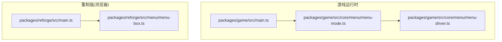
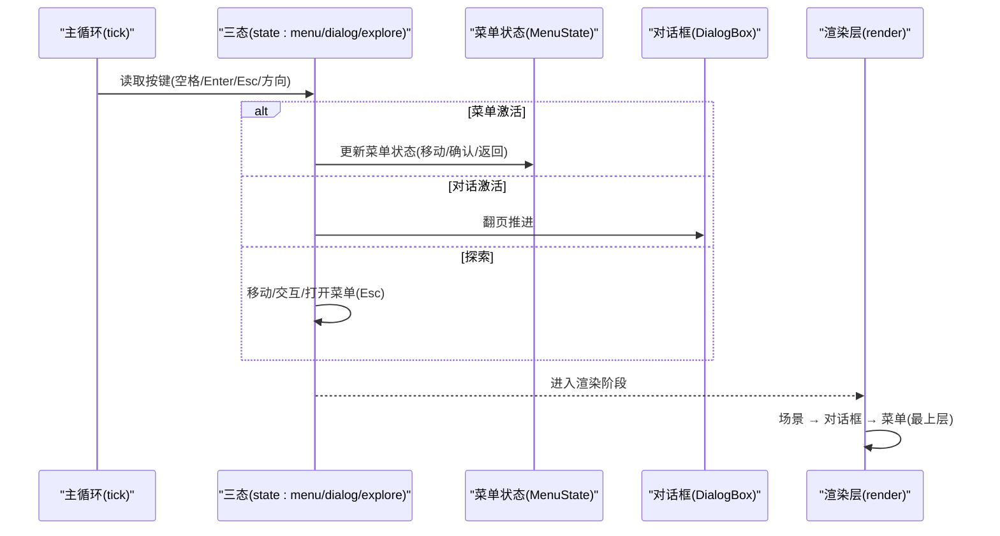
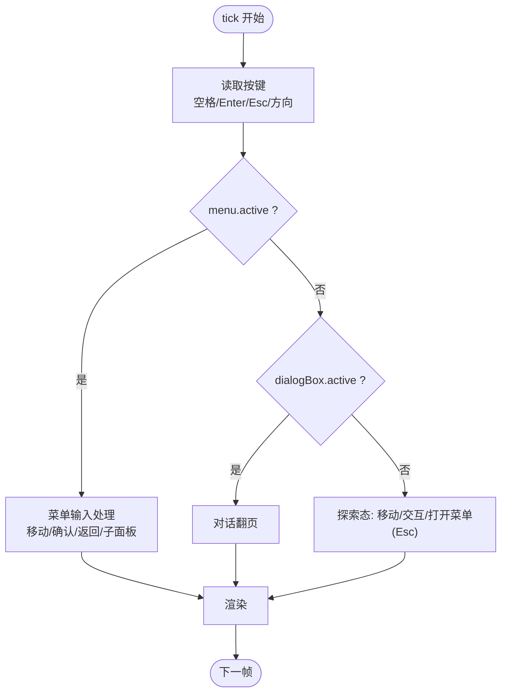
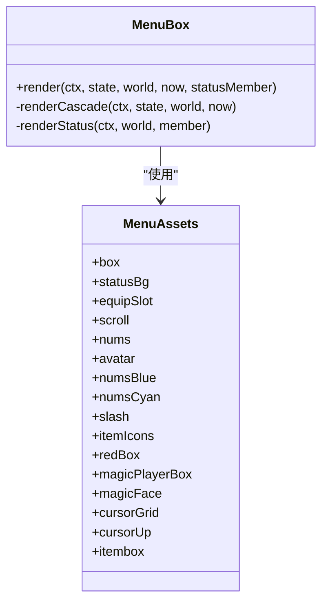
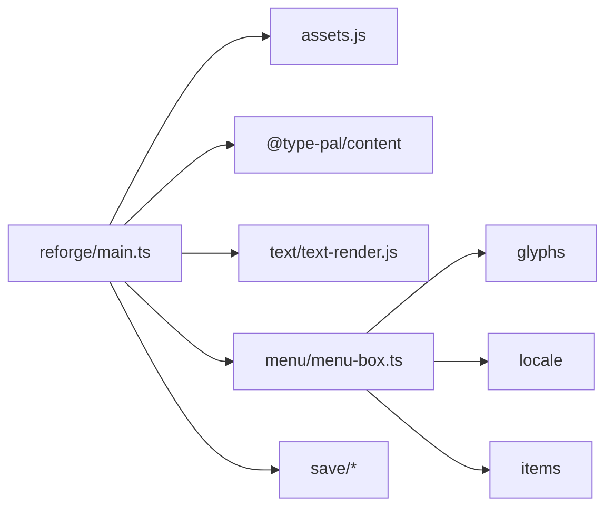

# 系统集成

<cite>
**本文引用的文件**   
- [packages/game/src/main.ts](file://packages/game/src/main.ts)
- [packages/reforge/src/main.ts](file://packages/reforge/src/main.ts)
- [packages/game/src/core/menu/menu-mode.ts](file://packages/game/src/core/menu/menu-mode.ts)
- [packages/game/src/core/menu/menu-driver.ts](file://packages/game/src/core/menu/menu-driver.ts)
- [packages/reforge/src/menu/menu-box.ts](file://packages/reforge/src/menu/menu-box.ts)
</cite>

## 目录
1. [简介](#简介)
2. [项目结构](#项目结构)
3. [核心组件](#核心组件)
4. [架构总览](#架构总览)
5. [详细组件分析](#详细组件分析)
6. [依赖关系分析](#依赖关系分析)
7. [性能考量](#性能考量)
8. [故障排查指南](#故障排查指南)
9. [结论](#结论)

## 简介
本文件聚焦“菜单系统”的集成与运行机制，围绕以下目标展开：
- 解释 main.ts 中的三态集成机制（menu/dialog/explore）以及状态切换逻辑。
- 说明 Esc 键的菜单开关控制与键盘输入分发策略。
- 阐述 WorldState 的构造与生命周期管理。
- 描述 MenuBox 的实例化与资源预加载机制。
- 解析 tick 循环中的状态优先级处理与互斥逻辑。
- 解释 render 层的菜单叠加渲染与坐标缩放处理。
- 提供与其他游戏模块的集成方法与扩展点。
- 给出调试技巧与故障排查建议。

## 项目结构
本项目包含两套入口与运行期实现：
- packages/game：基于 SDL 风格事件循环与帧缓冲的“大世界”运行时，使用 menu mode + menuStack 显式管理菜单栈。
- packages/reforge：浏览器 Canvas 2D 的“重制版”演示，采用主循环中三态（menu/dialog/explore）互斥调度，并在顶层进行菜单叠加渲染。

图表来源
- [packages/game/src/main.ts:1-78](file://packages/game/src/main.ts#L1-L78)
- [packages/game/src/core/menu/menu-mode.ts:1-62](file://packages/game/src/core/menu/menu-mode.ts#L1-L62)
- [packages/game/src/core/menu/menu-driver.ts:1-119](file://packages/game/src/core/menu/menu-driver.ts#L1-L119)
- [packages/reforge/src/main.ts:1-798](file://packages/reforge/src/main.ts#L1-L798)
- [packages/reforge/src/menu/menu-box.ts:306-485](file://packages/reforge/src/menu/menu-box.ts#L306-L485)

章节来源
- [packages/game/src/main.ts:1-78](file://packages/game/src/main.ts#L1-L78)
- [packages/reforge/src/main.ts:1-798](file://packages/reforge/src/main.ts#L1-L798)

## 核心组件
- 三态调度器（reforge）：在 tick 中以 else-if 保证 menu > dialog > explore 的互斥优先级，Esc 作为菜单开关键。
- 菜单模式与栈（game）：以 gs.mode='menu' + gs.menuStack 显式建模 sdlpal 的阻塞式菜单循环；tickMenu 每帧将输入分派到栈顶菜单项。
- 输入路由（menu-driver）：根据 ActiveMenuEntry.kind 将 InputSnapshot 路由到具体菜单的状态机函数。
- 菜单 UI 容器（MenuBox）：负责级联菜单、状态面板等绘制，并支持多类子面板（仙术/装备/使用/系统）。
- 世界状态（WorldState）：由 content 构建，贯穿 tick/render 全生命周期，承载队伍、物品、金钱等数据。

章节来源
- [packages/reforge/src/main.ts:495-745](file://packages/reforge/src/main.ts#L495-L745)
- [packages/game/src/core/menu/menu-mode.ts:1-62](file://packages/game/src/core/menu/menu-mode.ts#L1-L62)
- [packages/game/src/core/menu/menu-driver.ts:1-119](file://packages/game/src/core/menu/menu-driver.ts#L1-L119)
- [packages/reforge/src/menu/menu-box.ts:421-485](file://packages/reforge/src/menu/menu-box.ts#L421-L485)

## 架构总览
下图展示 reforge 主循环中的三态调度与渲染层次，以及 game 侧的 menu mode 与输入路由。

图表来源
- [packages/reforge/src/main.ts:495-745](file://packages/reforge/src/main.ts#L495-L745)
- [packages/reforge/src/main.ts:292-409](file://packages/reforge/src/main.ts#L292-L409)

## 详细组件分析

### 三态集成机制（menu/dialog/explore）
- 优先级与互斥：tick 顶部先判断 menu.active，再判断 dialogBox.active，最后才执行 explore 逻辑。通过 else-if 确保同一帧内仅一个分支生效。
- Esc 键行为：
  - 探索态：按 Esc 打开菜单，同时抓取当前干净画面用于存档缩略图。
  - 菜单态：按 Esc 回退或关闭当前子面板，直至回到探索态。
  - 对话态：Esc 不直接关闭对话（由交互键推进），避免误触。
- 交互键：空格/Enter 在对话态翻页，在菜单态确认，在探索态触发附近实体交互。

图表来源
- [packages/reforge/src/main.ts:495-745](file://packages/reforge/src/main.ts#L495-L745)

章节来源
- [packages/reforge/src/main.ts:495-745](file://packages/reforge/src/main.ts#L495-L745)

### Esc 键的菜单开关控制与键盘分发策略
- 探索态：Esc 打开菜单，并记录 lastGameThumb 以便后续存档缩略图。
- 菜单态：
  - 主菜单：Esc 调用 back(menu)，逐层退出。
  - 子面板（仙术/装备/使用/系统）：Esc 关闭当前面板并回退至上一级或主菜单。
  - 存档浏览界面：Esc 关闭浏览界面，保留 menu.active。
- 对话态：Esc 不参与对话推进，避免打断剧情。

章节来源
- [packages/reforge/src/main.ts:694-745](file://packages/reforge/src/main.ts#L694-L745)

### WorldState 的构造与生命周期管理
- 构造：在初始化阶段通过 buildWorld 从 manifest.startWorld 与 charactersById 构建初始世界。
- 生命周期：
  - 读档：doLoad 将存档 world 替换当前 world，并恢复位置与朝向。
  - 写档：doSave 序列化 world 与场景信息，生成缩略图与元数据。
  - 菜单内操作：如装备/使用/仙术等会返回新的 world，主循环用返回值覆盖本地 world 引用，保持状态一致性。

章节来源
- [packages/reforge/src/main.ts:191-210](file://packages/reforge/src/main.ts#L191-L210)
- [packages/reforge/src/main.ts:234-290](file://packages/reforge/src/main.ts#L234-L290)

### MenuBox 的实例化与资源预加载机制
- 实例化：new MenuBox(glyphs, locale, menuAssets, items)。
- 资源预加载：
  - loadMenuAssets(items) 并行加载九宫格、背景、数字、头像、斜杠、物品图标等 ImageBitmap。
  - 失败容错：loadPng 捕获异常返回 undefined，渲染时跳过缺失资源，不阻断流程。
- 渲染：
  - 级联菜单：drawCascade 绘制多层菜单框与选中闪烁。
  - 状态面板：renderStatus 显示角色属性、数值、头像等。
  - 子面板分流：main.ts 根据 openPanel 选择 drawMagicMenu/drawEquipMenu/drawUseMenu/drawSystemMenu。

图表来源
- [packages/reforge/src/menu/menu-box.ts:421-485](file://packages/reforge/src/menu/menu-box.ts#L421-L485)
- [packages/reforge/src/menu/menu-box.ts:306-420](file://packages/reforge/src/menu/menu-box.ts#L306-L420)

章节来源
- [packages/reforge/src/main.ts:192-194](file://packages/reforge/src/main.ts#L192-L194)
- [packages/reforge/src/menu/menu-box.ts:306-420](file://packages/reforge/src/menu/menu-box.ts#L306-L420)
- [packages/reforge/src/menu/menu-box.ts:421-485](file://packages/reforge/src/menu/menu-box.ts#L421-L485)

### tick 循环中的状态优先级与互斥逻辑
- 优先级：menu > dialog > explore，else-if 严格互斥。
- 菜单内部：
  - 保存浏览界面优先于其他菜单输入。
  - 各子面板（magic/equip/use/status/system）各自处理方向/确认/返回。
  - 主菜单导航：Left=Up、Right=Down，对齐 DL21 键映射。
- 探索态：
  - F5/F9 快捷存读。
  - 靠近可交互实体按空格/Enter 开启对话。
  - 方向键移动，碰撞检测阻止进入禁入格。

章节来源
- [packages/reforge/src/main.ts:495-745](file://packages/reforge/src/main.ts#L495-L745)

### render 层的菜单叠加渲染与坐标缩放处理
- 渲染顺序：场景底图 → 碰撞调试层 → 对话框 → 菜单（最上层）→ 快速提示。
- 坐标缩放：
  - 所有 UI（对话框/菜单）均在 320×200 逻辑坐标系绘制，随后 ctx.scale(WORLD_SCALE, WORLD_SCALE) 放大为物理像素，保持字模锐利与版面比例。
  - imageSmoothingEnabled=false 确保整数倍缩放无模糊。
- 子面板覆盖：
  - saveBrowser 全屏覆盖整个菜单区域。
  - magic/equip/use/system 分别由对应 draw* 函数覆盖绘制。

章节来源
- [packages/reforge/src/main.ts:292-409](file://packages/reforge/src/main.ts#L292-L409)

### 与游戏其他模块的集成方法与扩展点
- 内容模块（@type-pal/content）：buildWorld、lookupText、gridToPixel 等被广泛复用。
- 资产加载（assets.js）：tilemap/tileset/palette/glyphs/sprite/portraits 统一异步加载。
- 文本渲染（text-render.js）：renderSpans 用于菜单文案、提示等。
- 存档系统（save/*）：IndexedDB/Memory 存储、元数据与缩略图缓存。
- 扩展点：
  - 新增菜单项：在主菜单节点列表中添加新条目，并在 confirm 分支中打开对应面板。
  - 新增子面板：实现 drawXxxMenu 并在 main.ts 的 menu.openPanel 分支中接入。
  - 资源扩展：在 loadMenuAssets 中增加新的 ImageBitmap 资源，并在 MenuBox 中使用。

章节来源
- [packages/reforge/src/main.ts:1-87](file://packages/reforge/src/main.ts#L1-L87)
- [packages/reforge/src/main.ts:191-210](file://packages/reforge/src/main.ts#L191-L210)
- [packages/reforge/src/main.ts:292-409](file://packages/reforge/src/main.ts#L292-L409)

### 与 game 侧 menu mode 的关系（对比参考）
- game 侧以 gs.mode='menu' + gs.menuStack 显式建模阻塞式菜单循环，tickMenu 每帧将输入分派到栈顶菜单项，并根据栈空情况切回 explore/event/battle。
- reforge 侧则在主循环中直接维护 menu/dialog/explore 三态，并通过 openMenu/back/confirm/moveCursor 等纯函数更新状态。

章节来源
- [packages/game/src/core/menu/menu-mode.ts:1-62](file://packages/game/src/core/menu/menu-mode.ts#L1-L62)
- [packages/game/src/core/menu/menu-driver.ts:1-119](file://packages/game/src/core/menu/menu-driver.ts#L1-L119)

## 依赖关系分析
- 主循环依赖：
  - 输入：Keyboard 封装按键消费。
  - 内容：buildWorld、lookupText、gridToPixel。
  - 资产：loadTilemap/loadTileset/loadPalette/loadGlyphs/loadSprite/loadPortraits。
  - 文本：renderSpans。
  - 菜单：MenuBox、各子面板 draw* 函数。
  - 存档：IndexedDbSaveStore/MemorySaveStore、browser-state。
- 菜单 UI 依赖：
  - MenuBox 依赖 glyphs/locale/assets/items。
  - 子面板依赖各自状态机与 assets。

图表来源
- [packages/reforge/src/main.ts:1-87](file://packages/reforge/src/main.ts#L1-L87)
- [packages/reforge/src/menu/menu-box.ts:306-420](file://packages/reforge/src/menu/menu-box.ts#L306-L420)

章节来源
- [packages/reforge/src/main.ts:1-87](file://packages/reforge/src/main.ts#L1-L87)
- [packages/reforge/src/menu/menu-box.ts:306-420](file://packages/reforge/src/menu/menu-box.ts#L306-L420)

## 性能考量
- 资源预加载：
  - 菜单资产与 portraits 使用 Promise.all 并行加载，减少首屏等待。
  - 失败容错：ImageBitmap 加载失败返回 undefined，渲染路径跳过缺失资源，避免阻塞。
- 渲染优化：
  - 使用整数倍缩放（WORLD_SCALE=4）+ 关闭平滑，确保点阵清晰。
  - 菜单与对话框仅在 active 时启用 ctx.save/restore 与 scale，降低多余变换开销。
- 输入节流：
  - dt 钳制防止后台切回导致步进爆步。
  - 移动步进固定间隔（~10fps），符合原版手感且降低计算压力。

[本节为通用指导，无需源码引用]

## 故障排查指南
- 菜单无法打开：
  - 检查 Esc 是否被其他输入拦截；确认 menu.active 分支未被提前命中。
  - 验证 openMenu() 调用后 menu.openPanel 是否正确设置。
- 菜单项无效：
  - 确认 MenuAssets 资源已正确加载（console.warn 降级日志）。
  - 检查 MenuBox.render 分支是否覆盖到对应 openPanel。
- 存档缩略图为黑屏：
  - 确认 captureThumbnail 在打开菜单前成功执行并写入 lastGameThumb。
- 坐标错位或模糊：
  - 检查 ctx.scale(WORLD_SCALE, WORLD_SCALE) 是否在 UI 绘制前调用，并确保 imageSmoothingEnabled=false。
- 对话与菜单冲突：
  - 确认 else-if 互斥逻辑未被破坏；对话态不应响应菜单输入。

章节来源
- [packages/reforge/src/main.ts:192-210](file://packages/reforge/src/main.ts#L192-L210)
- [packages/reforge/src/main.ts:292-409](file://packages/reforge/src/main.ts#L292-L409)
- [packages/reforge/src/main.ts:495-745](file://packages/reforge/src/main.ts#L495-L745)

## 结论
本系统集成文档梳理了 reforge 主循环中的三态调度、Esc 键控制、WorldState 生命周期、MenuBox 资源预加载与渲染层级，并与 game 侧的 menu mode 设计形成对照。通过清晰的优先级与互斥逻辑、稳定的资源加载与渲染缩放策略，菜单系统能够稳定地叠加在游戏之上，并为后续扩展（新菜单项、子面板、资源）提供明确的接入点。