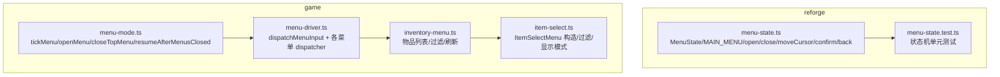
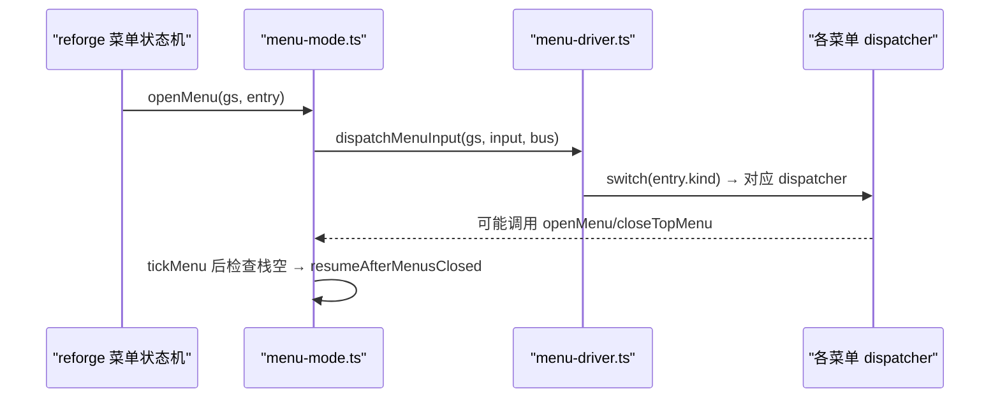
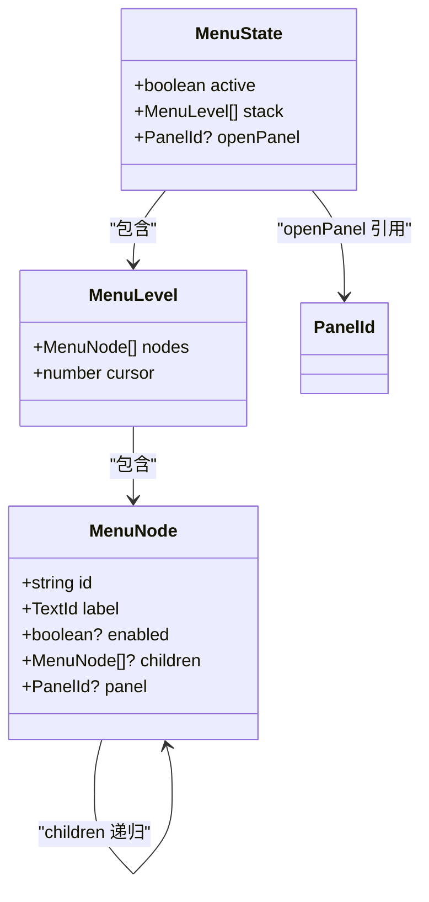
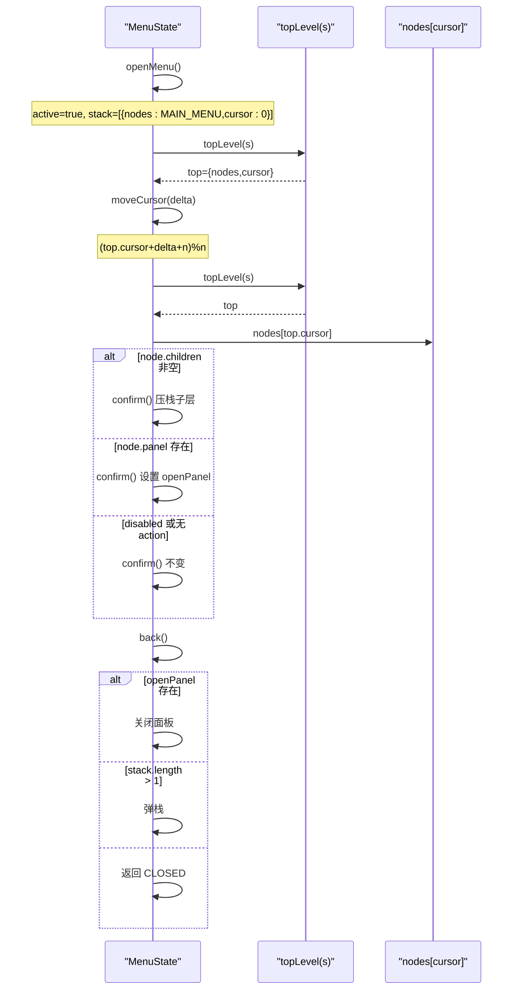
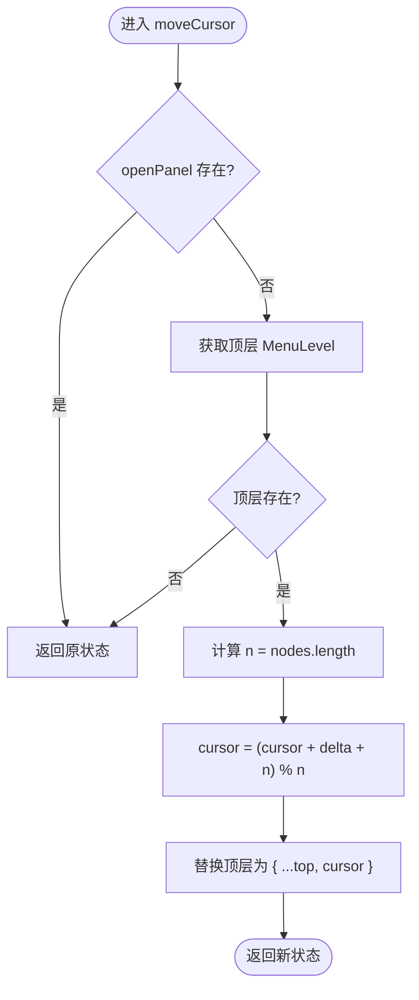
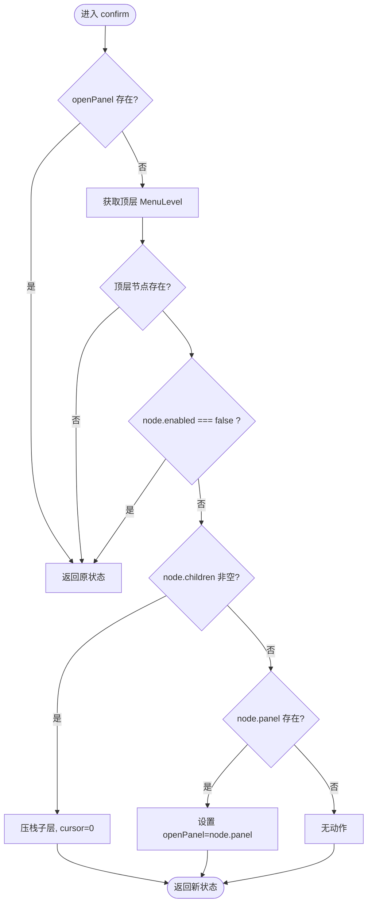
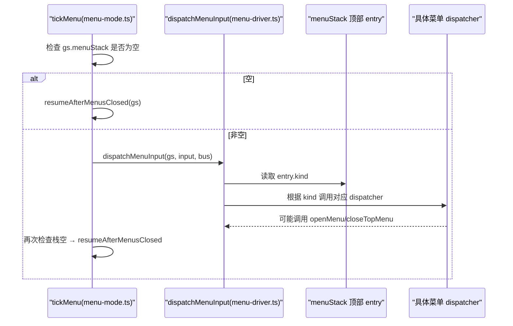
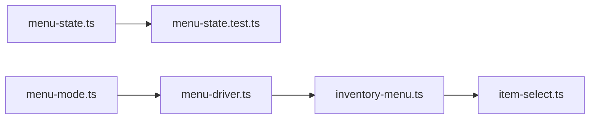

# 菜单状态机

<cite>
**本文引用的文件**   
- [packages/reforge/src/menu-state.ts](file://packages/reforge/src/menu-state.ts)
- [packages/reforge/src/menu-state.test.ts](file://packages/reforge/src/menu-state.test.ts)
- [packages/game/src/core/menu/menu-mode.ts](file://packages/game/src/core/menu/menu-mode.ts)
- [packages/game/src/core/menu/menu-driver.ts](file://packages/game/src/core/menu/menu-driver.ts)
- [packages/game/src/core/menu/inventory-menu.ts](file://packages/game/src/core/menu/inventory-menu.ts)
- [packages/game/src/core/menu/item-select.ts](file://packages/game/src/core/menu/item-select.ts)
</cite>

## 目录
1. [简介](#简介)
2. [项目结构](#项目结构)
3. [核心组件](#核心组件)
4. [架构总览](#架构总览)
5. [详细组件分析](#详细组件分析)
6. [依赖关系分析](#依赖关系分析)
7. [性能考量](#性能考量)
8. [故障排查指南](#故障排查指南)
9. [结论](#结论)
10. [附录](#附录)

## 简介
本文件围绕“菜单状态机”的实现进行系统化说明，覆盖类型定义、接口设计、配置结构、核心函数状态转换、光标环绕算法、确认与子菜单导航逻辑、扩展方法以及测试用例与边界处理。文档同时区分两类实现：
- reforge 包中的轻量多级菜单状态机（树 + 级联栈）
- game 包中的大世界菜单模式驱动（按 kind 分发到具体菜单 dispatcher）

## 项目结构
- reforge 包提供通用菜单状态机与主菜单树，用于 UI 层快速搭建多面板菜单。
- game 包提供游戏内菜单模式调度器，负责将输入路由到不同菜单的 dispatcher，并维护全局菜单栈与模式切换。

图表来源
- [packages/reforge/src/menu-state.ts:1-89](file://packages/reforge/src/menu-state.ts#L1-L89)
- [packages/reforge/src/menu-state.test.ts:1-49](file://packages/reforge/src/menu-state.test.ts#L1-L49)
- [packages/game/src/core/menu/menu-mode.ts:1-63](file://packages/game/src/core/menu/menu-mode.ts#L1-L63)
- [packages/game/src/core/menu/menu-driver.ts:1-120](file://packages/game/src/core/menu/menu-driver.ts#L1-L120)
- [packages/game/src/core/menu/inventory-menu.ts:114-134](file://packages/game/src/core/menu/inventory-menu.ts#L114-L134)
- [packages/game/src/core/menu/item-select.ts:1-87](file://packages/game/src/core/menu/item-select.ts#L1-L87)

章节来源
- [packages/reforge/src/menu-state.ts:1-89](file://packages/reforge/src/menu-state.ts#L1-L89)
- [packages/game/src/core/menu/menu-mode.ts:1-63](file://packages/game/src/core/menu/menu-mode.ts#L1-L63)
- [packages/game/src/core/menu/menu-driver.ts:1-120](file://packages/game/src/core/menu/menu-driver.ts#L1-L120)

## 核心组件
本节聚焦于 reforge 包的菜单状态机，包括类型、接口、配置与五个核心函数。

- MenuId 类型定义
  - 在计划文档中定义了 MenuId 为 'main' | 'status' | 'item' | 'magic' | 'system'，用于标识当前所在菜单层级或叶子菜单。
  - 该类型用于早期单页菜单状态机的简化版本；后续演进为基于树的 MenuNode 结构。

- MenuState 接口设计
  - 当前实现采用“级联栈 + 可选面板”的结构：
    - active: 是否处于菜单激活态
    - stack: 多层导航栈，每层包含 nodes 与 cursor
    - openPanel?: 当前打开的面板 id（如 status/equip/use/system），有值时暂停导航交互
  - 该设计支持任意深度的子菜单树与面板打开，且保持不可变更新风格。

- MAIN_ITEMS / MAIN_MENU 配置数组
  - 早期 plan 使用 MAIN_ITEMS 数组描述主菜单项，含 enabled 属性控制是否可进入。
  - 当前实现使用 MAIN_MENU 树结构，节点具备 id、label、enabled、children、panel 等字段，支持二级及以上嵌套。
  - enabled 的作用机制：
    - 当节点 enabled === false 时，confirm 不会进入该节点，保持当前状态不变。
    - 若节点存在 children，则 confirm 压入子层；若仅有 panel，则打开面板。

- 五个核心函数的状态转换逻辑
  - openMenu(): 初始化 active=true，stack 仅一层为主菜单树，cursor=0，openPanel 未设置。
  - closeMenu(): 返回 CLOSED 常量，active=false，stack=[]。
  - moveCursor(delta): 仅在未打开面板时生效，对末层 nodes 长度 n 做模运算实现光标环绕移动。
  - confirm(): 检查 openPanel 是否为空、顶层节点是否存在且 enabled !== false；若有 children 则压栈展开子菜单；否则打开 panel。
  - back(): 若 openPanel 存在则关闭面板；若 stack 层数大于 1 则弹栈；否则返回 CLOSED。

- 光标环绕移动算法与边界处理
  - 公式：(top.cursor + delta + n) % n，确保负增量也能正确回绕至末尾。
  - 边界：
    - 当 openPanel 存在时，moveCursor 直接返回原状态，避免面板打开时误改导航层。
    - 当顶层不存在时，直接返回原状态，保证健壮性。

- 确认操作的 enabled 检查机制与子菜单导航逻辑
  - 在 confirm 中先校验 openPanel 为空，再取顶层节点，若节点不存在或 enabled === false 则不变更状态。
  - 若节点有 children 且非空，则压入新层，cursor 重置为 0。
  - 若节点有 panel，则设置 openPanel 为该面板 id。

- 状态机扩展方法
  - 添加新菜单项：在 MAIN_MENU 树中添加新的 MenuNode，必要时设置 children 或 panel。
  - 实现子菜单交互：为新节点编写对应的渲染与输入处理逻辑（在 game 包中通过 dispatcher 接入）。
  - 启用/禁用某项：设置节点的 enabled 为 true/false 即可。

章节来源
- [packages/reforge/src/menu-state.ts:1-89](file://packages/reforge/src/menu-state.ts#L1-L89)
- [packages/reforge/src/menu-state.test.ts:1-49](file://packages/reforge/src/menu-state.test.ts#L1-L49)
- [docs/phase2/menu/plan.md:197-290](file://docs/phase2/menu/plan.md#L197-L290)

## 架构总览
下图展示 reforge 菜单状态机与 game 菜单模式驱动的协作关系：reforge 提供通用状态机与树形菜单配置，game 在大世界模式下通过 tickMenu 驱动输入分发，并根据 menuStack 顶部的 entry.kind 调用对应 dispatcher。

图表来源
- [packages/reforge/src/menu-state.ts:44-88](file://packages/reforge/src/menu-state.ts#L44-L88)
- [packages/game/src/core/menu/menu-mode.ts:18-63](file://packages/game/src/core/menu/menu-mode.ts#L18-L63)
- [packages/game/src/core/menu/menu-driver.ts:209-248](file://packages/game/src/core/menu/menu-driver.ts#L209-L248)

## 详细组件分析

### reforge 菜单状态机类图

图表来源
- [packages/reforge/src/menu-state.ts:6-40](file://packages/reforge/src/menu-state.ts#L6-L40)

章节来源
- [packages/reforge/src/menu-state.ts:1-89](file://packages/reforge/src/menu-state.ts#L1-L89)

### 核心函数序列图（open/close/moveCursor/confirm/back）

图表来源
- [packages/reforge/src/menu-state.ts:52-88](file://packages/reforge/src/menu-state.ts#L52-L88)

章节来源
- [packages/reforge/src/menu-state.ts:52-88](file://packages/reforge/src/menu-state.ts#L52-L88)

### 光标环绕移动流程图

图表来源
- [packages/reforge/src/menu-state.ts:57-65](file://packages/reforge/src/menu-state.ts#L57-L65)

章节来源
- [packages/reforge/src/menu-state.ts:57-65](file://packages/reforge/src/menu-state.ts#L57-L65)

### 确认操作流程图（含 enabled 检查与子菜单导航）

图表来源
- [packages/reforge/src/menu-state.ts:67-78](file://packages/reforge/src/menu-state.ts#L67-L78)

章节来源
- [packages/reforge/src/menu-state.ts:67-78](file://packages/reforge/src/menu-state.ts#L67-L78)

### game 包菜单模式驱动时序（大世界）

图表来源
- [packages/game/src/core/menu/menu-mode.ts:18-51](file://packages/game/src/core/menu/menu-mode.ts#L18-L51)
- [packages/game/src/core/menu/menu-driver.ts:209-248](file://packages/game/src/core/menu/menu-driver.ts#L209-L248)

章节来源
- [packages/game/src/core/menu/menu-mode.ts:18-63](file://packages/game/src/core/menu/menu-mode.ts#L18-L63)
- [packages/game/src/core/menu/menu-driver.ts:209-248](file://packages/game/src/core/menu/menu-driver.ts#L209-L248)

## 依赖关系分析
- reforge 菜单状态机独立于 game 包，提供纯函数式状态更新，便于 UI 层复用。
- game 包通过 menu-mode.ts 管理全局菜单栈与模式切换，menu-driver.ts 作为输入路由中心，按 kind 分发到具体菜单 dispatcher。
- inventory-menu.ts 与 item-select.ts 提供物品列表构建与过滤能力，供多个菜单共享。

图表来源
- [packages/reforge/src/menu-state.ts:1-89](file://packages/reforge/src/menu-state.ts#L1-L89)
- [packages/reforge/src/menu-state.test.ts:1-49](file://packages/reforge/src/menu-state.test.ts#L1-L49)
- [packages/game/src/core/menu/menu-mode.ts:1-63](file://packages/game/src/core/menu/menu-mode.ts#L1-L63)
- [packages/game/src/core/menu/menu-driver.ts:1-120](file://packages/game/src/core/menu/menu-driver.ts#L1-L120)
- [packages/game/src/core/menu/inventory-menu.ts:114-134](file://packages/game/src/core/menu/inventory-menu.ts#L114-L134)
- [packages/game/src/core/menu/item-select.ts:1-87](file://packages/game/src/core/menu/item-select.ts#L1-L87)

章节来源
- [packages/game/src/core/menu/menu-driver.ts:1-120](file://packages/game/src/core/menu/menu-driver.ts#L1-L120)
- [packages/game/src/core/menu/inventory-menu.ts:114-134](file://packages/game/src/core/menu/inventory-menu.ts#L114-L134)
- [packages/game/src/core/menu/item-select.ts:1-87](file://packages/game/src/core/menu/item-select.ts#L1-L87)

## 性能考量
- 状态更新采用不可变对象复制，避免副作用，利于调试与测试。
- 光标环绕移动为 O(1) 时间复杂度，空间开销极小。
- 物品列表刷新按需进行，避免每帧全量重建导致性能问题。

## 故障排查指南
- 常见问题：面板打开时 moveCursor/confirm 无效
  - 原因：openPanel 存在时，状态机主动忽略导航输入，防止误操作。
  - 解决：先 back 关闭面板再进行导航。
- 常见问题：确认 disabled 项无反应
  - 原因：enabled === false 的节点被跳过。
  - 解决：在配置中将 enabled 设为 true，或选择其他可用项。
- 常见问题：子菜单无法弹出
  - 原因：节点没有 children 或 panel。
  - 解决：为节点补充 children 或 panel 字段。

章节来源
- [packages/reforge/src/menu-state.ts:57-88](file://packages/reforge/src/menu-state.ts#L57-L88)

## 结论
本菜单状态机以树形结构与级联栈为核心，结合 open/close/moveCursor/confirm/back 五个纯函数，实现了清晰的状态转换与可扩展的菜单体系。配合 game 包的菜单模式驱动，可在大世界场景下灵活路由输入到不同菜单，满足复杂交互需求。

## 附录
- 测试用例要点：
  - openMenu 初始状态验证
  - moveCursor 环绕移动验证
  - confirm 进入子菜单或打开面板
  - back 关闭面板/弹栈/关菜单
  - enabled 占位项行为验证
  - 面板打开时导航输入被忽略

章节来源
- [packages/reforge/src/menu-state.test.ts:1-49](file://packages/reforge/src/menu-state.test.ts#L1-L49)