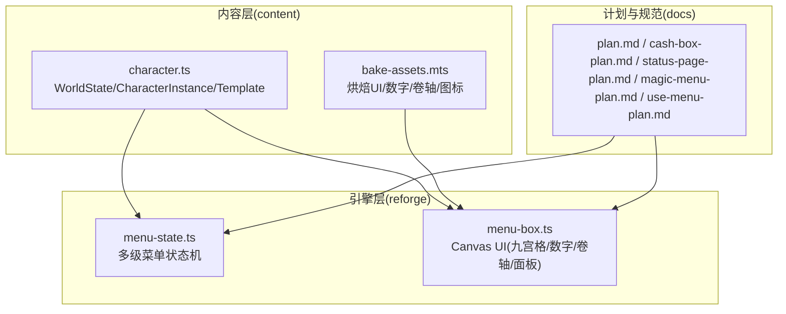
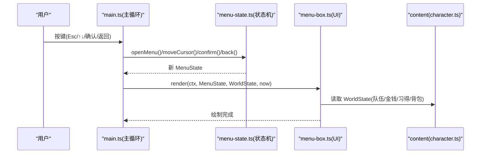
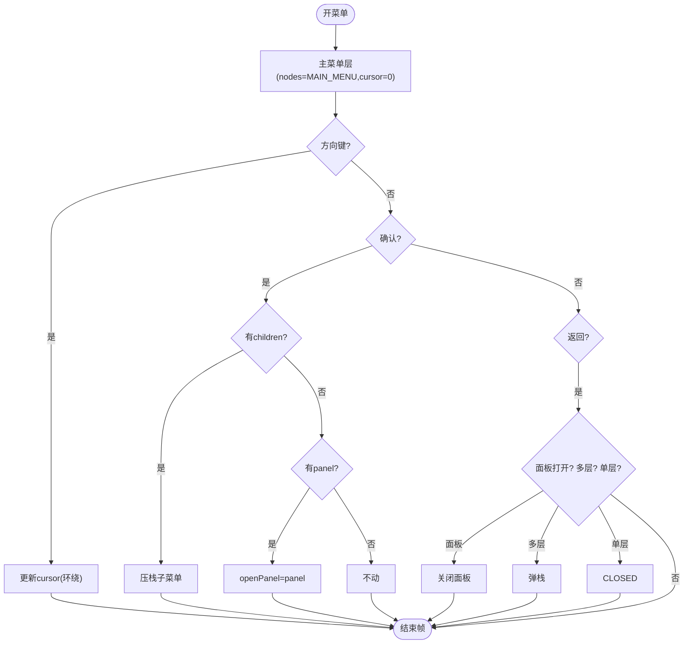
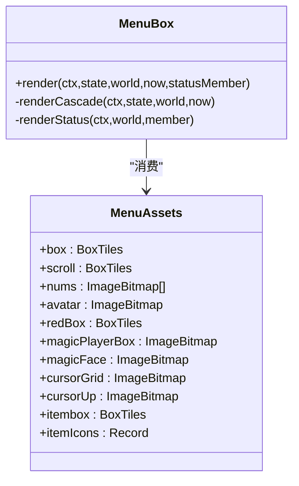
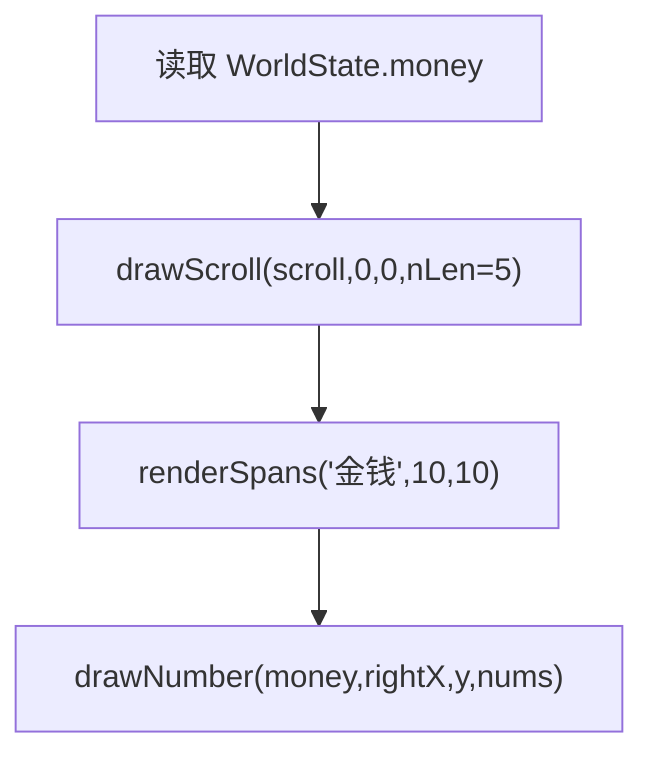
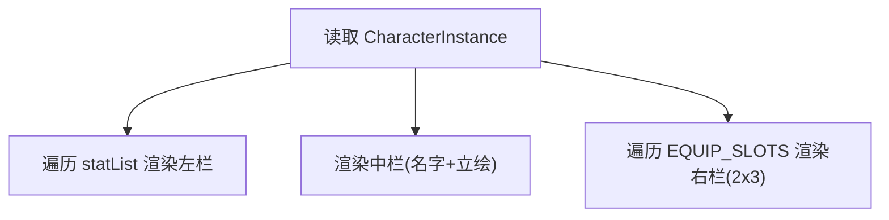
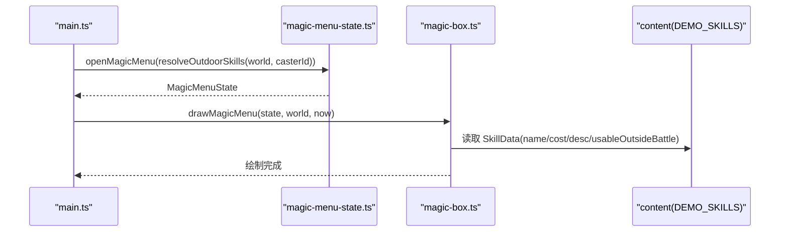
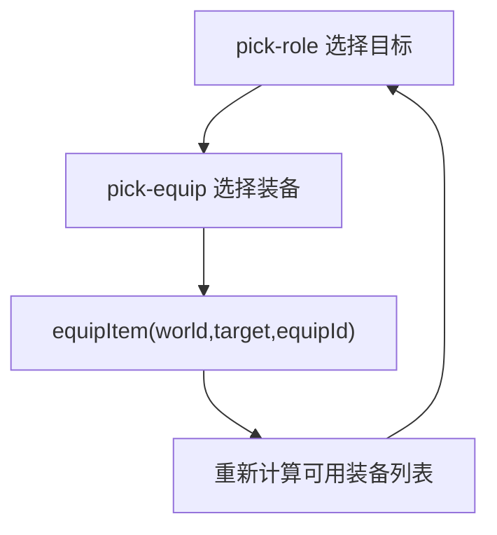
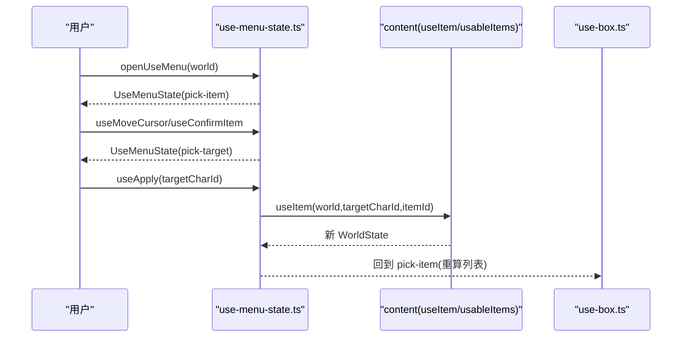
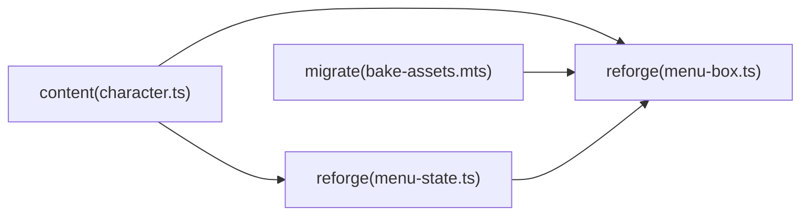

# 菜单系统

<cite>
**本文引用的文件**   
- [packages/content/src/character.ts](file://packages/content/src/character.ts)
- [packages/reforge/src/menu-state.ts](file://packages/reforge/src/menu-state.ts)
- [packages/reforge/src/menu/menu-box.ts](file://packages/reforge/src/menu/menu-box.ts)
- [docs/phase2/menu/plan.md](file://docs/phase2/menu/plan.md)
- [docs/phase2/menu/cash-box-plan.md](file://docs/phase2/menu/cash-box-plan.md)
- [docs/phase2/menu/status-page-plan.md](file://docs/phase2/menu/status-page-plan.md)
- [docs/phase2/menu/magic-menu-plan.md](file://docs/phase2/menu/magic-menu-plan.md)
- [docs/phase2/menu/use-menu-plan.md](file://docs/phase2/menu/use-menu-plan.md)
- [packages/migrate/scripts/bake-assets.mts](file://packages/migrate/scripts/bake-assets.mts)
</cite>

## 目录
1. [简介](#简介)
2. [项目结构](#项目结构)
3. [核心组件](#核心组件)
4. [架构总览](#架构总览)
5. [详细组件分析](#详细组件分析)
6. [依赖分析](#依赖分析)
7. [性能考虑](#性能考虑)
8. [故障排查指南](#故障排查指南)
9. [结论](#结论)
10. [附录](#附录)

## 简介
本文件为“菜单系统”的综合文档，围绕角色 schema 首次代码化、数据驱动 UI、可切片框原语三大设计理念展开，并给出各菜单组件的实现计划与集成策略：金钱横卷轴（frame 44-46 + 数字 19-28）、状态面板完整还原（立绘 + 9 属性 + 装备格 2×3）、仙术菜单（接技能地基）、装备面板（世界操作 + 状态机）、使用面板（两阶段 pick-item → pick-target）。同时说明状态机设计模式与 UI 集成策略，并提供扩展方法与自定义指南。

## 项目结构
- 内容层（content）：承载角色、物品、技能等数据模型与世界态；提供纯函数式世界操作（如 useItem、usableItems）。
- 引擎层（reforge）：实现菜单纯状态机与 Canvas UI 渲染；复用文本渲染、键盘输入与高清缩放。
- 资产管线（migrate）：烘焙 UI 九宫格、数字、卷轴、图标等素材，供 reforge 直接 fetch 使用。
- 计划文档（docs/phase2/menu）：逐项任务拆解，明确真值规格、范围与验收点。



图表来源
- [packages/content/src/character.ts:1-115](file://packages/content/src/character.ts#L1-L115)
- [packages/reforge/src/menu-state.ts:1-89](file://packages/reforge/src/menu-state.ts#L1-L89)
- [packages/reforge/src/menu/menu-box.ts:1-561](file://packages/reforge/src/menu/menu-box.ts#L1-L561)
- [packages/migrate/scripts/bake-assets.mts:166-194](file://packages/migrate/scripts/bake-assets.mts#L166-L194)
- [docs/phase2/menu/plan.md:1-461](file://docs/phase2/menu/plan.md#L1-L461)

章节来源
- [docs/phase2/menu/plan.md:1-461](file://docs/phase2/menu/plan.md#L1-L461)

## 核心组件
- 角色 schema 与初始世界态
  - WorldState、CharacterInstance、CharacterTemplate 定义于 content；instantiate/buildWorld 负责模板→实例与初始世界组装。
  - 新增字段 money、learnedSkills、inventory 等，支撑菜单显示与后续操作。
- 菜单纯状态机
  - 支持多级导航栈与叶子面板（status/magic/equip/use/system），open/close/moveCursor/confirm/back 纯函数返回新 state。
- 菜单 UI 原语与面板
  - drawSlicedBox 统一九宫格切框原语；drawScroll 单行卷轴；drawNumber/drawNumberLeft 数字绘制；MenuBox 组合主菜单级联、状态面板等。
- 资产烘焙
  - bake-assets 产出黄框九宫格、红框九宫格、scroll 九宫格、itembox 九宫格、数字集、斜杠、角色头像、物品图标等。

章节来源
- [packages/content/src/character.ts:1-115](file://packages/content/src/character.ts#L1-L115)
- [packages/reforge/src/menu-state.ts:1-89](file://packages/reforge/src/menu-state.ts#L1-L89)
- [packages/reforge/src/menu/menu-box.ts:1-561](file://packages/reforge/src/menu/menu-box.ts#L1-L561)
- [packages/migrate/scripts/bake-assets.mts:166-194](file://packages/migrate/scripts/bake-assets.mts#L166-L194)

## 架构总览
菜单系统采用“数据在 content、逻辑在 reforge、渲染在 Canvas”的分层架构。状态机以不可变纯函数维护菜单层级与面板开关；UI 通过 MenuBox 读取 WorldState 与 MenuState 进行数据驱动渲染。资产由 migrate 预烘焙，运行时仅 fetch ImageBitmap，避免重复解码。



图表来源
- [packages/reforge/src/menu-state.ts:1-89](file://packages/reforge/src/menu-state.ts#L1-L89)
- [packages/reforge/src/menu/menu-box.ts:421-485](file://packages/reforge/src/menu/menu-box.ts#L421-L485)
- [packages/content/src/character.ts:1-115](file://packages/content/src/character.ts#L1-L115)

## 详细组件分析

### 角色 schema 与初始世界态（content）
- 数据结构
  - WorldState：party、money、learnedSkills、inventory。
  - CharacterInstance：绝对值属性（含 luck）、equipment、tags。
  - CharacterTemplate：baseStats、initialEquipment、initialMagic。
- 工厂与构建
  - instantiate：模板→实例深拷贝初始值。
  - buildWorld：从 manifest.startWorld 组装 WorldState，支持 seedStats 覆盖 hp/mp。
- 用途
  - 菜单 UI 展示属性/金钱/习得/背包；useItem 等操作回写 WorldState。

```mermaid
classDiagram
class WorldState {
+party : CharacterInstance[]
+money : number
+learnedSkills : Record<string,string[]>
+inventory : {itemId : string;count : number}[]
}
class CharacterInstance {
+id : string
+template : string
+level : number
+exp : number
+hp : number
+maxHP : number
+mp : number
+maxMP : number
+attack : number
+defense : number
+magicAttack : number
+speed : number
+luck : number
+equipment : Record<string,string>
+tags : string[]
}
class CharacterTemplate {
+id : string
+name : TextId
+baseStats
+initialEquipment : Record<string,string>
+initialMagic : string[]
}
WorldState --> CharacterInstance : "包含"
CharacterInstance --> CharacterTemplate : "基于模板"
```

图表来源
- [packages/content/src/character.ts:1-115](file://packages/content/src/character.ts#L1-L115)

章节来源
- [packages/content/src/character.ts:1-115](file://packages/content/src/character.ts#L1-L115)

### 菜单纯状态机（reforge）
- 能力
  - 多级菜单树 MAIN_MENU，节点可带 children 或 panel。
  - open/close/moveCursor/confirm/back 纯函数，返回新 state。
  - topLevel 取当前导航层；openPanel 控制叶子面板打开。
- 交互
  - ↑↓ 环绕移动；确认进入子菜单或打开面板；返回关闭面板/弹栈/关菜单。



图表来源
- [packages/reforge/src/menu-state.ts:1-89](file://packages/reforge/src/menu-state.ts#L1-L89)

章节来源
- [packages/reforge/src/menu-state.ts:1-89](file://packages/reforge/src/menu-state.ts#L1-L89)

### 菜单 UI 原语与面板（reforge）
- 可切片框原语
  - drawSlicedBox：九宫格 tiles 按实际宽高定位，四边中心平铺，四角最后画；内置大阴影（镂空形状偏移+半透明黑）。
  - drawScroll：单行卷轴（左帽+中段×nLen+右帽），内部转 drawSlicedBox 撑出任意高宽。
  - tileFill：平铺填充（非拉伸），clip 裁出界部分。
- 数字与文本
  - drawNumber/drawNumberLeft：右对齐/左对齐数字绘制；renderSpans 用于文字渲染。
- 面板
  - 主菜单级联：每层 box + 项列表 + 光标闪烁色；顶部金钱横卷轴 + “金钱” + 黄数字。
  - 状态面板：背景铺满；左栏 9 属性遍历（经验/修行/体力/真气/武术/灵力/防御/身法/吉运）；中栏名字+立绘水平居中；右栏 6 装备格 2×3 平铺，空槽留空，已装备显示图标与物名。



图表来源
- [packages/reforge/src/menu/menu-box.ts:84-132](file://packages/reforge/src/menu/menu-box.ts#L84-L132)
- [packages/reforge/src/menu/menu-box.ts:232-248](file://packages/reforge/src/menu/menu-box.ts#L232-L248)
- [packages/reforge/src/menu/menu-box.ts:421-485](file://packages/reforge/src/menu/menu-box.ts#L421-L485)
- [packages/reforge/src/menu/menu-box.ts:487-560](file://packages/reforge/src/menu/menu-box.ts#L487-L560)

章节来源
- [packages/reforge/src/menu/menu-box.ts:1-561](file://packages/reforge/src/menu/menu-box.ts#L1-L561)

### 金钱横卷轴（cash box）
- 真值规格
  - 横卷轴 frame 44/45/46（左/中/右）；数字 frame 19-28（0-9，黄色）。
  - 布局：卷轴 (0,0)、“金钱”label (10,10)、数字 (49,14) 右对齐。
- 实现要点
  - content 的 WorldState.money 字段；bake-assets 烤出 ui/num/* 与 ui/cashbox/left,mid,right。
  - menu-box 的 drawScroll + drawNumber 组合呈现；renderCascade 顶部先画金钱条。



图表来源
- [docs/phase2/menu/cash-box-plan.md:1-229](file://docs/phase2/menu/cash-box-plan.md#L1-L229)
- [packages/reforge/src/menu/menu-box.ts:445-485](file://packages/reforge/src/menu/menu-box.ts#L445-L485)

章节来源
- [docs/phase2/menu/cash-box-plan.md:1-229](file://docs/phase2/menu/cash-box-plan.md#L1-L229)

### 状态面板完整还原
- 真值规格
  - 装备槽 6；背景 FBP chunk 0；装备名色 0xBE；属性 9 项顺序与用词对齐原版。
  - 立绘：李逍遥半身像（RGM avatar chunk 1，复用 portraits/1）。
- 实现要点
  - content 加 luck 字段；locale 用词对齐；menu-box 三栏布局：左 9 属性、中名字+立绘、右 2×3 装备格。
  - 数据驱动：statList 遍历生成行，加属性自动适配；EQUIP_SLOTS 来自 content 单一真值。



图表来源
- [docs/phase2/menu/status-page-plan.md:1-83](file://docs/phase2/menu/status-page-plan.md#L1-L83)
- [packages/reforge/src/menu/menu-box.ts:286-298](file://packages/reforge/src/menu/menu-box.ts#L286-L298)
- [packages/reforge/src/menu/menu-box.ts:487-560](file://packages/reforge/src/menu/menu-box.ts#L487-L560)

章节来源
- [docs/phase2/menu/status-page-plan.md:1-83](file://docs/phase2/menu/status-page-plan.md#L1-L83)
- [packages/reforge/src/menu/menu-box.ts:286-298](file://packages/reforge/src/menu/menu-box.ts#L286-L298)
- [packages/reforge/src/menu/menu-box.ts:487-560](file://packages/reforge/src/menu/menu-box.ts#L487-L560)

### 仙术菜单（接技能地基）
- 数据来源
  - learnedSkills[casterId] → DEMO_SKILLS → 过滤 usableOutsideBattle。
- 状态机
  - resolveOutdoorSkills、open/close、magicMoveCursor（±列数/±1，越界 clamp）。
- UI
  - 红框网格 + 仙术名 + grid 光标；左上 MP box；底部 PlayerInfoBox；顶部描述。
- 集成
  - MAIN_MENU 中 magic 项 enabled；main 持有独立 magicMenu 态；Esc 返回主菜单。



图表来源
- [docs/phase2/menu/magic-menu-plan.md:1-184](file://docs/phase2/menu/magic-menu-plan.md#L1-L184)
- [packages/reforge/src/menu/menu-box.ts:306-419](file://packages/reforge/src/menu/menu-box.ts#L306-L419)

章节来源
- [docs/phase2/menu/magic-menu-plan.md:1-184](file://docs/phase2/menu/magic-menu-plan.md#L1-L184)

### 装备面板（世界操作 + 状态机）
- 状态机
  - 两阶段：pick-role → pick-equip；apply 后回写 world 并刷新列表。
- 世界操作
  - equipItem/equippedItemIds 等纯函数（content）；菜单状态机调用后返回新 world。
- UI
  - 复用装备列表布局（红框 3 列网格 + itembox + 多行 desc）。



图表来源
- [docs/phase2/menu/plan.md:1-461](file://docs/phase2/menu/plan.md#L1-L461)

章节来源
- [docs/phase2/menu/plan.md:1-461](file://docs/phase2/menu/plan.md#L1-L461)

### 使用面板（两阶段 pick-item → pick-target）
- 世界操作（content）
  - usableItems(world)：筛选背包中有 use 能力块的物品。
  - useItem(world,targetCharId,itemId)：对目标施 effects，consuming 则 -1；返回新 WorldState。
- 状态机（reforge）
  - openUseMenu/useMoveCursor/useConfirmItem/useBackFromTarget/useApply；两阶段切换。
- UI
  - pick-item 复用装备列表布局；pick-target 复用仙术选目标布局（单人=李逍遥）。



图表来源
- [docs/phase2/menu/use-menu-plan.md:1-324](file://docs/phase2/menu/use-menu-plan.md#L1-L324)

章节来源
- [docs/phase2/menu/use-menu-plan.md:1-324](file://docs/phase2/menu/use-menu-plan.md#L1-L324)

## 依赖分析
- content ↔ reforge
  - reforge 通过 @type-pal/content 导入 WorldState、CharacterInstance、DEMO_SKILLS、EQUIP_SLOT_IDS、effectiveStat 等类型与常量。
- reforge 内部
  - menu-state.ts 被 main.ts 消费；menu-box.ts 消费 MenuState、WorldState、text-render、glyphs。
- 资产管线
  - bake-assets.mts 输出 ui/box、ui/box-red、ui/scroll、ui/itembox、ui/num*、portraits、ui/items 等，menu-box.ts 直接 fetch。



图表来源
- [packages/content/src/character.ts:1-115](file://packages/content/src/character.ts#L1-L115)
- [packages/reforge/src/menu-state.ts:1-89](file://packages/reforge/src/menu-state.ts#L1-L89)
- [packages/reforge/src/menu/menu-box.ts:1-561](file://packages/reforge/src/menu/menu-box.ts#L1-L561)
- [packages/migrate/scripts/bake-assets.mts:166-194](file://packages/migrate/scripts/bake-assets.mts#L166-L194)

章节来源
- [packages/content/src/character.ts:1-115](file://packages/content/src/character.ts#L1-L115)
- [packages/reforge/src/menu-state.ts:1-89](file://packages/reforge/src/menu-state.ts#L1-L89)
- [packages/reforge/src/menu/menu-box.ts:1-561](file://packages/reforge/src/menu/menu-box.ts#L1-L561)
- [packages/migrate/scripts/bake-assets.mts:166-194](file://packages/migrate/scripts/bake-assets.mts#L166-L194)

## 性能考虑
- 资产预烘焙：所有 UI 元素 bake 为 RGBA PNG，运行时仅 fetch + createImageBitmap，避免解码开销。
- 九宫格平铺：tileFill 使用 clip 与多次 drawImage，避免拉伸失真；阴影离屏合成一次，减少重复计算。
- 数据驱动渲染：statList/EQUIP_SLOTS 遍历生成，新增维度无需硬编码坐标，降低维护成本。
- 状态机纯函数：无副作用，便于缓存与测试；UI 仅在 state 变化时重绘。

## 故障排查指南
- 菜单不响应
  - 检查 main.ts 是否将 Esc/↑↓/确认/返回映射到 openMenu/moveCursor/confirm/back。
  - 确认 MENU_STATE.active 与 stack/openPanel 状态流转是否符合预期。
- 九宫格错位
  - 核对 bake 的 frame 编号与 loadMenuAssets 加载路径一致；确保 drawSlicedBox 的 tiles 索引 i*3+j 正确。
- 数字/卷轴位置不对
  - 调整 drawNumber 的 rightX/y 与 drawScroll 的 nLen；对照 plan 中的原版坐标。
- 状态面板缺项
  - 确认 locale 键值存在；statList 行数与 EQUIP_SLOTS 长度与 content 保持一致。
- 仙术/使用面板空白
  - 检查 learnedSkills/inventory 是否正确播种；resolveOutdoorSkills/usableItems 过滤条件是否过严。

章节来源
- [docs/phase2/menu/plan.md:1-461](file://docs/phase2/menu/plan.md#L1-L461)
- [docs/phase2/menu/cash-box-plan.md:1-229](file://docs/phase2/menu/cash-box-plan.md#L1-L229)
- [docs/phase2/menu/status-page-plan.md:1-83](file://docs/phase2/menu/status-page-plan.md#L1-L83)
- [docs/phase2/menu/magic-menu-plan.md:1-184](file://docs/phase2/menu/magic-menu-plan.md#L1-L184)
- [docs/phase2/menu/use-menu-plan.md:1-324](file://docs/phase2/menu/use-menu-plan.md#L1-L324)

## 结论
本菜单系统以“数据在 content、状态机在 reforge、渲染在 Canvas”的分层架构落地，配合 bake 管线与可切片框原语，实现了高保真、可扩展的 UI 体系。通过纯函数状态机与数据驱动渲染，新增菜单与属性只需扩展数据与少量 UI 代码即可生效。后续可按计划逐步完善装备/使用/仙术面板，并与战斗/脚本系统对接。

## 附录

### 扩展方法与自定义指南
- 新增菜单项
  - 在 MAIN_MENU 添加节点（children 或 panel），并在对应面板实现状态机与 UI。
- 新增属性/槽位
  - 在 character.ts 的 CharacterInstance/Template 增加字段；statList/EQUIP_SLOTS 自动适配。
- 新增数字/颜色
  - bake 新的 num-* 图集；在 drawNumber/drawNumberLeft 处传入对应图集。
- 新增卷轴样式
  - 通过 bake 生成 scroll 九宫格；drawScroll 可直接复用。
- 接入新面板
  - 在 menu-state.ts 的 PanelId 注册；在 MenuBox.render 分流处理；main.ts 持有独立面板状态。

章节来源
- [packages/reforge/src/menu-state.ts:1-89](file://packages/reforge/src/menu-state.ts#L1-L89)
- [packages/reforge/src/menu/menu-box.ts:306-419](file://packages/reforge/src/menu/menu-box.ts#L306-L419)
- [packages/content/src/character.ts:1-115](file://packages/content/src/character.ts#L1-L115)