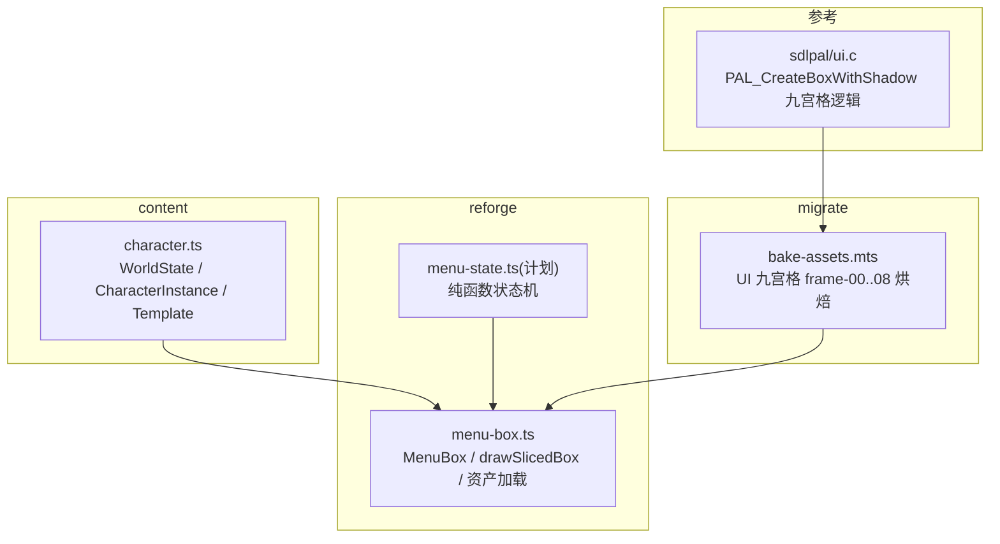
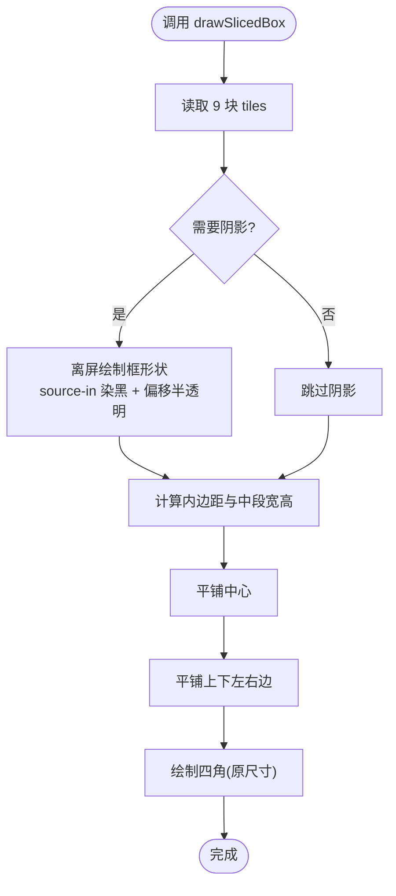
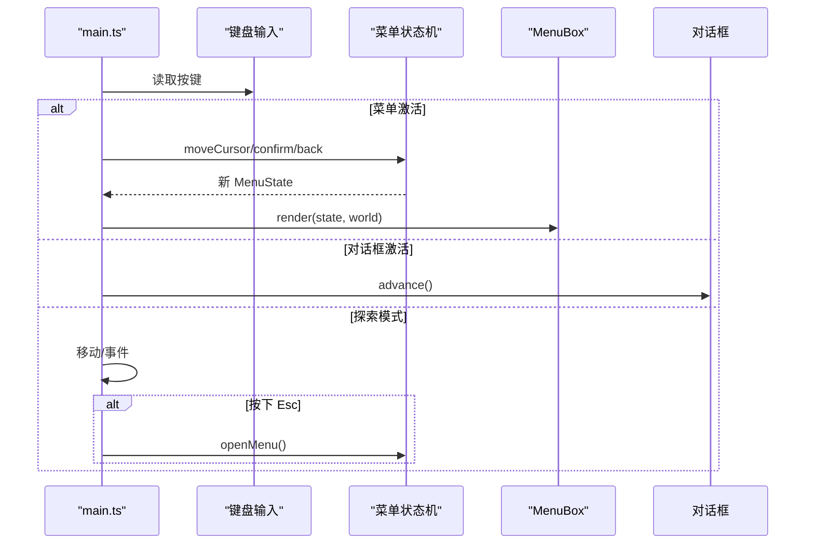
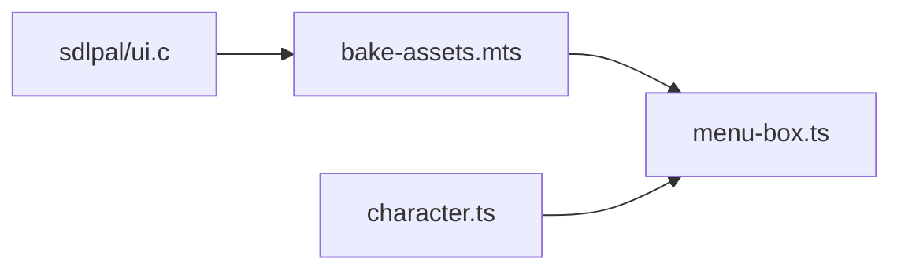

# 菜单系统概览

<cite>
**本文引用的文件**
- [packages/reforge/src/menu/menu-box.ts](file://packages/reforge/src/menu/menu-box.ts)
- [packages/game/src/core/menu/menu-mode.ts](file://packages/game/src/core/menu/menu-mode.ts)
- [reference/sdlpal/ui.c](file://reference/sdlpal/ui.c)
- [packages/migrate/scripts/bake-assets.mts](file://packages/migrate/scripts/bake-assets.mts)
- [docs/phase2/menu/plan.md](file://docs/phase2/menu/plan.md)
- [packages/content/src/character.ts](file://packages/content/src/character.ts)
</cite>

## 目录
1. [简介](#简介)
2. [项目结构](#项目结构)
3. [核心组件](#核心组件)
4. [架构总览](#架构总览)
5. [详细组件分析](#详细组件分析)
6. [依赖关系分析](#依赖关系分析)
7. [性能与扩展性](#性能与扩展性)
8. [故障排查指南](#故障排查指南)
9. [结论](#结论)
10. [附录：扩展与自定义指南](#附录扩展与自定义指南)

## 简介
本文件面向“菜单系统”的综合概览，聚焦以下目标：
- 角色 schema 首次代码化 + 数据驱动 UI + 可切片框原语的设计理念
- content 层角色数据模型、reforge 层状态机与 UI 渲染的分离设计
- 主循环三态（menu/dialog/explore）的状态切换机制
- 九宫格框原语的设计原理与复用策略
- 菜单系统的扩展方法与自定义指南（新增菜单项、自定义属性显示等）

## 项目结构
菜单系统在第二阶段（Reforge）中采用“内容/引擎”分层：
- content 层：定义世界态与角色模板/实例，提供初始世界构造能力
- reforge 层：实现菜单状态机与 UI 渲染；通过 Canvas 2D 绘制，复用文本渲染与高清缩放
- 资源烘焙：将原版 UI sprite 切分为九宫格 tile，供 drawSlicedBox 统一使用



图示来源
- [packages/content/src/character.ts:1-115](file://packages/content/src/character.ts#L1-L115)
- [packages/reforge/src/menu/menu-box.ts:1-561](file://packages/reforge/src/menu/menu-box.ts#L1-L561)
- [packages/migrate/scripts/bake-assets.mts:67-194](file://packages/migrate/scripts/bake-assets.mts#L67-L194)
- [reference/sdlpal/ui.c:148-211](file://reference/sdlpal/ui.c#L148-L211)

章节来源
- [docs/phase2/menu/plan.md:1-461](file://docs/phase2/menu/plan.md#L1-L461)

## 核心组件
- 角色 schema（content）
  - WorldState：队伍、金钱、已学仙术、持有物品等
  - CharacterInstance：运行期角色实例（绝对值属性）
  - CharacterTemplate：内容层初始模板
  - buildWorld/instantiate：从模板构建实例，支持种子覆盖
- 菜单 UI（reforge）
  - MenuBox：级联菜单、状态面板、数字/卷轴/九宫格绘制
  - drawSlicedBox：统一可切片框原语（阴影+平铺+四角）
  - loadMenuAssets：预烘 PNG → ImageBitmap 的集中加载器
- 资源烘焙（migrate）
  - bake-assets.mts：将 ui/frame-00..08 等切为九宫格 tile，供 drawSlicedBox 使用
- 参考实现（sdlpal）
  - PAL_CreateBoxWithShadow：iStyle*9 + i*3+j 的九宫格索引与阴影偏移

章节来源
- [packages/content/src/character.ts:1-115](file://packages/content/src/character.ts#L1-L115)
- [packages/reforge/src/menu/menu-box.ts:84-132](file://packages/reforge/src/menu/menu-box.ts#L84-L132)
- [packages/reforge/src/menu/menu-box.ts:306-419](file://packages/reforge/src/menu/menu-box.ts#L306-L419)
- [packages/migrate/scripts/bake-assets.mts:67-194](file://packages/migrate/scripts/bake-assets.mts#L67-L194)
- [reference/sdlpal/ui.c:148-211](file://reference/sdlpal/ui.c#L148-L211)

## 架构总览
菜单系统遵循“数据驱动 + 状态与渲染分离”的原则：
- content 层负责“有什么数据”（角色、装备槽、数值）
- reforge 层负责“如何展示与交互”（状态机 + UI 绘制）
- 资源层通过烘焙管线产出九宫格 tile，被 UI 原语统一消费

```mermaid
classDiagram
class WorldState {
+party : CharacterInstance[]
+money : number
+learnedSkills : Record<string,string[]>
+inventory : {itemId : string;count : number}[]
}
class CharacterInstance {
+id : string
+template : string
+level : number
+exp : number
+hp : number
+maxHP : number
+mp : number
+maxMP : number
+attack : number
+defense : number
+magicAttack : number
+speed : number
+luck : number
+equipment : Record<string,string>
+tags : string[]
}
class CharacterTemplate {
+id : string
+name : TextId
+baseStats : object
+initialEquipment : Record<string,string>
+initialMagic : string[]
}
class MenuBox {
+render(ctx, state, world, now, member)
-renderCascade(ctx, state, world, now)
-renderStatus(ctx, world, member)
}
class BakeAssets {
+bake ui box frames
+bake itembox frames
}
WorldState --> CharacterInstance : "包含"
MenuBox --> WorldState : "读取"
BakeAssets --> MenuBox : "提供 tiles"
```

图示来源
- [packages/content/src/character.ts:1-115](file://packages/content/src/character.ts#L1-L115)
- [packages/reforge/src/menu/menu-box.ts:421-560](file://packages/reforge/src/menu/menu-box.ts#L421-L560)
- [packages/migrate/scripts/bake-assets.mts:67-194](file://packages/migrate/scripts/bake-assets.mts#L67-L194)

## 详细组件分析

### 角色 schema（content 层）
- 设计要点
  - 世界态与角色实例解耦：WorldState 聚合 party、金钱、技能、库存；CharacterInstance 仅承载单角色运行态
  - 模板与实例分离：CharacterTemplate 描述初始数据，instantiate/buildWorld 生成独立实例，避免引用共享污染
  - 绝对值属性：attack/defense/magicAttack/speed/luck 等为绝对值，便于 UI 直接展示
- 关键接口
  - WorldState、CharacterInstance、CharacterTemplate
  - instantiate(t): CharacterInstance
  - buildWorld(startWorld, templatesById): WorldState

章节来源
- [packages/content/src/character.ts:1-115](file://packages/content/src/character.ts#L1-L115)

### 菜单状态机（reforge 层，计划）
- 目标
  - 纯函数状态机：open/close/moveCursor/confirm/back，返回新状态，不碰 DOM
  - 主菜单四项（状态启用，其余占位），子菜单框架预留
- 集成点
  - main.ts tick 中按三态分发输入（见下节）
  - MenuBox.render 根据 state.stack 渲染级联菜单

章节来源
- [docs/phase2/menu/plan.md:187-301](file://docs/phase2/menu/plan.md#L187-L301)

### 菜单 UI（reforge 层）
- 类与方法
  - MenuBox.render：分流到 renderCascade（级联菜单）或 renderStatus（状态面板）
  - renderCascade：顶部金钱横卷轴 + 多层级联菜单（每深一级偏移）
  - renderStatus：背景图 + 左栏属性列表 + 中栏名字/立绘 + 右栏装备格
- 数据驱动
  - statList 遍历属性行，加属性即自动多一行
  - EQUIP_SLOTS 由 content 的槽位真值驱动，增删槽位无需改布局逻辑
- 颜色与闪烁
  - 选中色 6 帧闪烁，父层静态高亮指示路径

章节来源
- [packages/reforge/src/menu/menu-box.ts:421-560](file://packages/reforge/src/menu/menu-box.ts#L421-L560)
- [packages/reforge/src/menu/menu-box.ts:445-485](file://packages/reforge/src/menu/menu-box.ts#L445-L485)

### 九宫格框原语（drawSlicedBox）
- 设计理念
  - 以 3×3 块（左上/上/右上/左/中/右/左下/下/右下）拼出任意尺寸框
  - 中心与四边平铺（非拉伸），四角原尺寸最后画，保证纹理不变形
  - 大阴影按框镂空形状绘制（离屏 source-in 剪影 + 半透明偏移）
- 与原版对齐
  - sdlpal 使用 SPRITEUI frame iStyle*9 + i*3+j 取九宫格；reforge 通过 bake-assets 预烘对应 frame-00..08
- 复用策略
  - 黄框（主菜单）、红框（仙术）、itembox（详情框）、scroll（单行卷轴）均复用同一原语，仅换 tiles 配置



图示来源
- [packages/reforge/src/menu/menu-box.ts:84-132](file://packages/reforge/src/menu/menu-box.ts#L84-L132)
- [packages/migrate/scripts/bake-assets.mts:67-194](file://packages/migrate/scripts/bake-assets.mts#L67-L194)
- [reference/sdlpal/ui.c:148-211](file://reference/sdlpal/ui.c#L148-L211)

### 主循环三态（menu/dialog/explore）
- 第一阶段（game 包）
  - 使用 menuStack 显式栈 + gs.mode='menu' 推进；栈空时依据上下文恢复 explore/event/battle
- 第二阶段（reforge 包，计划）
  - main.ts tick 中优先处理菜单输入；菜单 active 时冻结移动/对话；Esc 开/关菜单，三态互斥



图示来源
- [packages/game/src/core/menu/menu-mode.ts:1-63](file://packages/game/src/core/menu/menu-mode.ts#L1-L63)
- [docs/phase2/menu/plan.md:389-450](file://docs/phase2/menu/plan.md#L389-L450)

## 依赖关系分析
- content → reforge
  - reforge 的 MenuBox 读取 WorldState/CharacterInstance/EQUIP_SLOT_IDS/effectiveStat 等
- migrate → reforge
  - bake-assets 产出的 ui/box、ui/itembox、ui/num 等被 MenuBox.loadMenuAssets 消费
- reference → migrate
  - sdlpal 的九宫格索引规则指导 bake-assets 的 frame 编号与切割



图示来源
- [reference/sdlpal/ui.c:148-211](file://reference/sdlpal/ui.c#L148-L211)
- [packages/migrate/scripts/bake-assets.mts:67-194](file://packages/migrate/scripts/bake-assets.mts#L67-L194)
- [packages/content/src/character.ts:1-115](file://packages/content/src/character.ts#L1-L115)
- [packages/reforge/src/menu/menu-box.ts:1-561](file://packages/reforge/src/menu/menu-box.ts#L1-L561)

## 性能与扩展性
- 性能
  - 预烘 RGBA 图片 + createImageBitmap，运行时零烤图
  - 九宫格平铺替代拉伸，减少 GPU 采样变形成本
  - 阴影离屏一次合成，避免逐像素复杂计算
- 扩展性
  - 新增属性/槽位只需在 content 侧扩展，UI 自动适配
  - 新增菜单项仅需在 MAIN_ITEMS/节点树中注册，UI 级联自适应

[本节为通用建议，不涉及具体文件分析]

## 故障排查指南
- 九宫格缺失
  - 现象：drawSlicedBox 报错或画面异常
  - 排查：确认 bake-assets 是否输出 frame-00..08；检查 MenuBox.loadMenuAssets 请求路径
- 阴影裁剪
  - 现象：右侧阴影被裁
  - 排查：offscreen canvas 留余量（右侧卷轴头探出 + 阴影偏移）
- 状态面板错位
  - 现象：数值/斜杠/最大值位置不对
  - 排查：核对 STAT_* 常量与 drawNumber/drawNumberLeft 的对齐逻辑

章节来源
- [packages/reforge/src/menu/menu-box.ts:54-77](file://packages/reforge/src/menu/menu-box.ts#L54-L77)
- [packages/reforge/src/menu/menu-box.ts:188-225](file://packages/reforge/src/menu/menu-box.ts#L188-L225)
- [packages/migrate/scripts/bake-assets.mts:67-194](file://packages/migrate/scripts/bake-assets.mts#L67-L194)

## 结论
菜单系统通过“内容/引擎”分层与“数据驱动 + 可切片框原语”，实现了：
- 角色 schema 首次代码化，稳定可扩展
- 状态与渲染解耦，易于测试与迭代
- 九宫格原语统一复用，降低重复实现与维护成本
- 三态互斥的主循环，确保交互清晰可控

[本节为总结，不涉及具体文件分析]

## 附录：扩展与自定义指南

### 添加新菜单项
- 在 MAIN_ITEMS 或节点树中添加一项（label 使用 TextId，enabled 控制可用）
- 若进入子菜单，需在状态机 confirm 分支中处理跳转
- UI 会自动渲染新项（级联框高度自适应）

章节来源
- [docs/phase2/menu/plan.md:187-301](file://docs/phase2/menu/plan.md#L187-L301)
- [packages/reforge/src/menu/menu-box.ts:445-485](file://packages/reforge/src/menu/menu-box.ts#L445-L485)

### 自定义属性显示
- 在 statList 中追加条目（labelId/value/max/maxKind）
- 支持当前值/最大值双段显示（蓝/青数字 + 斜杠）
- 增加属性后，行高与布局自动适配

章节来源
- [packages/reforge/src/menu/menu-box.ts:278-298](file://packages/reforge/src/menu/menu-box.ts#L278-L298)
- [packages/reforge/src/menu/menu-box.ts:487-511](file://packages/reforge/src/menu/menu-box.ts#L487-L511)

### 新增装备槽
- 在 content 的槽位真值（EQUIP_SLOT_IDS）中新增 slot id
- UI 通过 EQUIP_SLOTS 映射渲染，无需改动布局逻辑

章节来源
- [packages/reforge/src/menu/menu-box.ts:300-304](file://packages/reforge/src/menu/menu-box.ts#L300-L304)
- [packages/content/src/character.ts:36-53](file://packages/content/src/character.ts#L36-L53)

### 使用九宫格原语绘制新框
- 准备 9 块 tiles（frame-00..08），通过 loadMenuAssets 或自行传入
- 调用 drawSlicedBox(ctx, box, x, y, w, h, opts)
- 如需单行卷轴效果，使用 drawScroll 包装

章节来源
- [packages/reforge/src/menu/menu-box.ts:84-132](file://packages/reforge/src/menu/menu-box.ts#L84-L132)
- [packages/reforge/src/menu/menu-box.ts:232-248](file://packages/reforge/src/menu/menu-box.ts#L232-L248)
- [packages/reforge/src/menu/menu-box.ts:356-419](file://packages/reforge/src/menu/menu-box.ts#L356-L419)