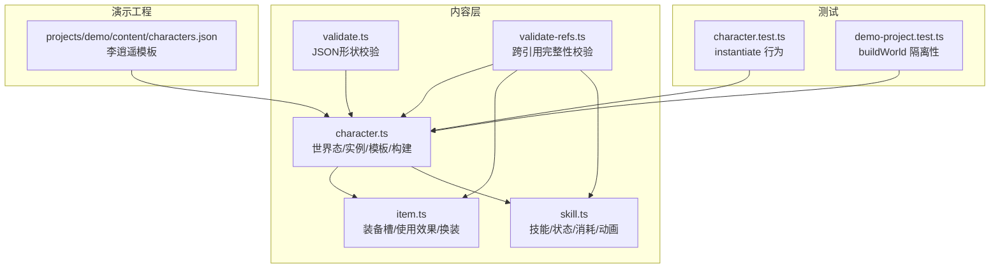
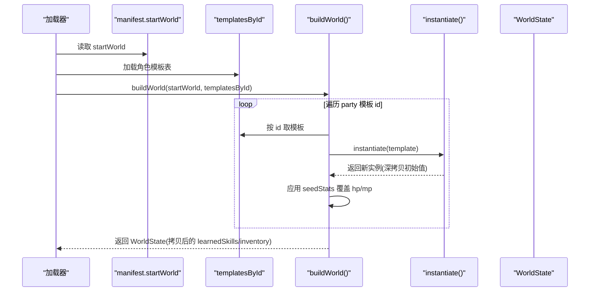
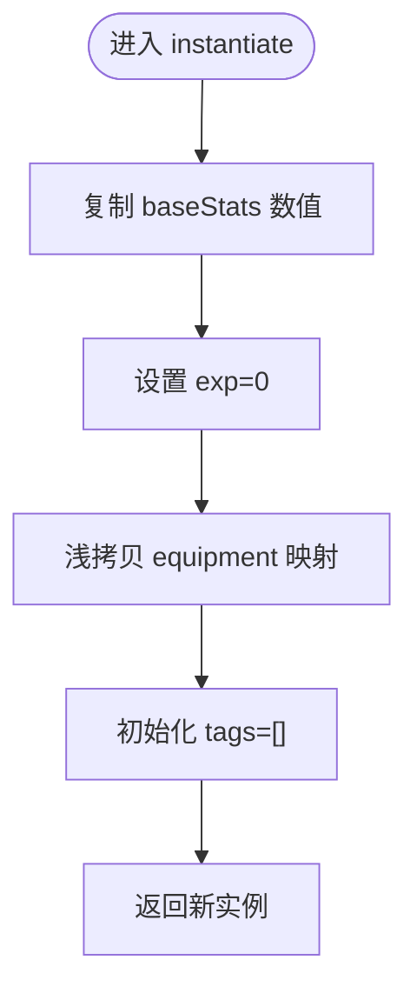
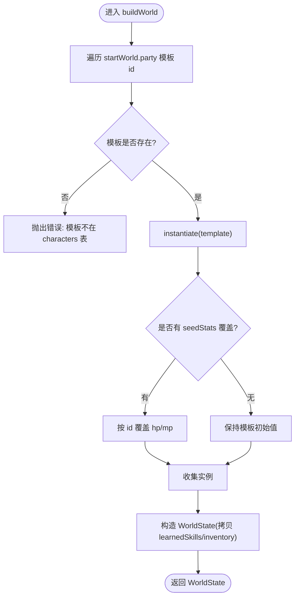
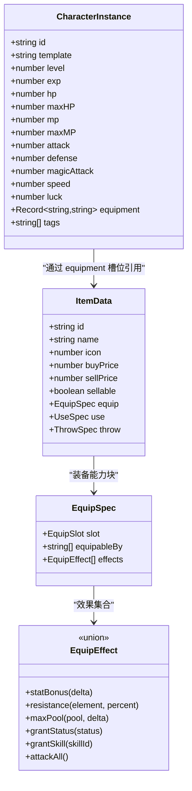
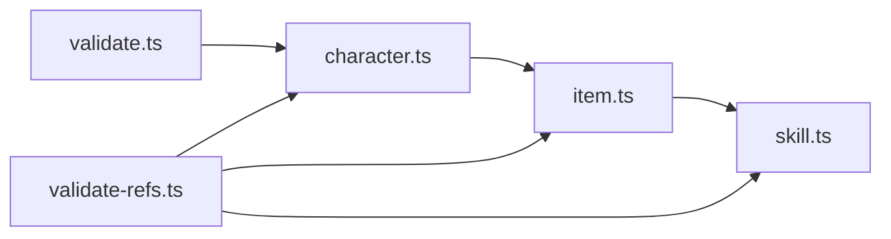

# 角色数据模型

<cite>
**本文引用的文件**
- [packages/content/src/character.ts](file://packages/content/src/character.ts)
- [packages/content/src/item.ts](file://packages/content/src/item.ts)
- [packages/content/src/skill.ts](file://packages/content/src/skill.ts)
- [packages/content/src/validate.ts](file://packages/content/src/validate.ts)
- [packages/content/src/validate-refs.ts](file://packages/content/src/validate-refs.ts)
- [projects/demo/content/characters.json](file://projects/demo/content/characters.json)
- [packages/content/src/character.test.ts](file://packages/content/src/character.test.ts)
- [packages/migrate/src/demo-project.test.ts](file://packages/migrate/src/demo-project.test.ts)
</cite>

## 目录
1. [简介](#简介)
2. [项目结构](#项目结构)
3. [核心组件](#核心组件)
4. [架构总览](#架构总览)
5. [详细组件分析](#详细组件分析)
6. [依赖分析](#依赖分析)
7. [性能考虑](#性能考虑)
8. [故障排查指南](#故障排查指南)
9. [结论](#结论)
10. [附录](#附录)

## 简介
本文件聚焦于“角色数据模型”，围绕三个核心接口与相关工具函数展开：WorldState、CharacterInstance、CharacterTemplate，以及 instantiate 深拷贝机制、equipment 槽位系统、magic 仙术列表的数据结构与扩展方式。文档同时给出完整的数据验证规则与错误处理策略，帮助读者从概念到实现全面理解角色数据在系统中的定位与流转。

## 项目结构
角色数据模型位于内容层（content）包中，主要定义在 character.ts；装备与物品系统定义在 item.ts；技能与仙术定义在 skill.ts；数据校验与跨引用完整性检查分别在 validate.ts 与 validate-refs.ts；李逍遥模板的初始数据位于 demo 工程的 characters.json；单元测试覆盖 instantiate 行为与 buildWorld 隔离性。

图表来源
- [packages/content/src/character.ts:1-115](file://packages/content/src/character.ts#L1-L115)
- [packages/content/src/item.ts:1-227](file://packages/content/src/item.ts#L1-L227)
- [packages/content/src/skill.ts:1-75](file://packages/content/src/skill.ts#L1-L75)
- [packages/content/src/validate.ts:1-97](file://packages/content/src/validate.ts#L1-L97)
- [packages/content/src/validate-refs.ts:1-155](file://packages/content/src/validate-refs.ts#L1-L155)
- [projects/demo/content/characters.json:1-31](file://projects/demo/content/characters.json#L1-L31)
- [packages/content/src/character.test.ts:1-46](file://packages/content/src/character.test.ts#L1-L46)
- [packages/migrate/src/demo-project.test.ts:65-81](file://packages/migrate/src/demo-project.test.ts#L65-L81)

章节来源
- [packages/content/src/character.ts:1-115](file://packages/content/src/character.ts#L1-L115)
- [packages/content/src/item.ts:1-227](file://packages/content/src/item.ts#L1-L227)
- [packages/content/src/skill.ts:1-75](file://packages/content/src/skill.ts#L1-L75)
- [packages/content/src/validate.ts:1-97](file://packages/content/src/validate.ts#L1-L97)
- [packages/content/src/validate-refs.ts:1-155](file://packages/content/src/validate-refs.ts#L1-L155)
- [projects/demo/content/characters.json:1-31](file://projects/demo/content/characters.json#L1-L31)
- [packages/content/src/character.test.ts:1-46](file://packages/content/src/character.test.ts#L1-L46)
- [packages/migrate/src/demo-project.test.ts:65-81](file://packages/migrate/src/demo-project.test.ts#L65-L81)

## 核心组件
本节对 WorldState、CharacterInstance、CharacterTemplate 进行结构化说明，并解释字段含义与设计意图。

- WorldState（世界态）
  - party：队伍中的角色实例数组，顺序即入队顺序。
  - money：金钱数值，随存档持久化。
  - learnedSkills：习得仙术关系表，键为角色实例 id，值为已学仙术 id 列表。独立于 CharacterInstance，解耦且为未来 MMO 玩家私有数据预留空间。
  - inventory：持有物品清单，条目包含 itemId 与 count；穿戴中的物品不在背包内，而在对应角色的 equipment 槽位中。

- CharacterInstance（角色实例）
  - id：稳定标识符，用于运行时查找与关联。
  - template：所属模板 id。
  - level/exp：等级与经验值。
  - hp/maxHP、mp/maxMP：当前与最大生命/法力。
  - attack/defense/magicAttack/speed/luck：基础战斗属性。
  - equipment：装备槽映射，slotId → itemId，支持可扩展槽位。
  - tags：标签数组，预留种族/门派等扩展点，当前为空。

- CharacterTemplate（角色模板）
  - id/name：模板标识与文本 id。
  - baseStats：初始属性集合，含 level/hp/maxHP/mp/maxMP/attack/defense/magicAttack/speed/luck。
  - initialEquipment：初始装备配置，slotId → itemId。
  - initialMagic：初始仙术 id 列表。

设计要点
- 模板与实例分离：模板提供不可变初始值，实例承载运行期可变状态。
- 数据隔离：通过深拷贝确保多实例间不共享引用。
- 能力外置：learnedSkills 独立维护，避免耦合到角色对象内部。

章节来源
- [packages/content/src/character.ts:3-73](file://packages/content/src/character.ts#L3-L73)

## 架构总览
角色数据模型在加载阶段由 manifest.startWorld 驱动，经 buildWorld 组装为 WorldState；instantiate 负责将模板转为可变的实例对象。装备系统与技能系统分别提供槽位与效果语义，校验层保障数据完整性。

图表来源
- [packages/content/src/character.ts:75-114](file://packages/content/src/character.ts#L75-L114)

章节来源
- [packages/content/src/character.ts:75-114](file://packages/content/src/character.ts#L75-L114)

## 详细组件分析

### 李逍遥模板数据结构与初始值
- 模板 id：li-xiaoyao
- 名称文本 id：name.li-xiaoyao
- 基础属性：level=1；hp=150；maxHP=150；mp=100；maxMP=100；attack=33；defense=32；magicAttack=20；speed=28；luck=32
- 初始装备：weapon/head/body/cloak/feet/accessory 各对应一个 itemId
- 初始仙术：initialMagic 包含若干仙术 id（如 296、298、299）

上述数据来源于演示工程的角色清单 JSON，并在单元测试中以内联 fixture 形式复现相同数值，用于断言 instantiate 的初始值正确性与深拷贝隔离性。

章节来源
- [projects/demo/content/characters.json:1-31](file://projects/demo/content/characters.json#L1-L31)
- [packages/content/src/character.test.ts:5-22](file://packages/content/src/character.test.ts#L5-L22)

### instantiate 深拷贝机制与数据隔离
- 行为：根据模板生成新的 CharacterInstance，复制 baseStats 的所有数值，设置 exp=0，tags=[]，并对 equipment 做浅拷贝以隔离槽位映射。
- 隔离保证：多次调用 instantiate 产生的实例互不影响；修改任一实例的 hp 或 equipment 不会串扰其他实例。
- 测试覆盖：单元测试断言初始值与隔离性，包括 equipment 槽位的独立副本。

图表来源
- [packages/content/src/character.ts:75-85](file://packages/content/src/character.ts#L75-L85)
- [packages/content/src/character.test.ts:24-46](file://packages/content/src/character.test.ts#L24-L46)

章节来源
- [packages/content/src/character.ts:75-85](file://packages/content/src/character.ts#L75-L85)
- [packages/content/src/character.test.ts:24-46](file://packages/content/src/character.test.ts#L24-L46)

### buildWorld 组装流程与数据隔离
- 输入：startWorld（party 模板 id 列表、money、learnedSkills、inventory、seedStats）、templatesById（模板表）。
- 步骤：
  - 遍历 party 模板 id，查表获取模板，不存在则抛出错误。
  - 调用 instantiate 创建实例，若存在 seedStats 覆盖，则按 id 更新 hp/mp。
  - 返回新的 WorldState，其中 learnedSkills 与 inventory 均被拷贝，防止运行期改动回写污染 startWorld 源。
- 隔离保证：单元测试断言返回的 learnedSkills 与 inventory 引用不同于输入，且后续修改不会影响原始数据。

图表来源
- [packages/content/src/character.ts:92-114](file://packages/content/src/character.ts#L92-L114)
- [packages/migrate/src/demo-project.test.ts:72-81](file://packages/migrate/src/demo-project.test.ts#L72-L81)

章节来源
- [packages/content/src/character.ts:92-114](file://packages/content/src/character.ts#L92-L114)
- [packages/migrate/src/demo-project.test.ts:72-81](file://packages/migrate/src/demo-project.test.ts#L72-L81)

### equipment 槽位系统
- 槽位定义：EQUIP_SLOT_IDS 固定为 weapon、head、body、cloak、feet、accessory，类型 EquipSlot 与之对齐。
- 装备效果：EquipEffect 联合类型描述 statBonus、resistance、maxPool、grantStatus、grantSkill、attackAll 等效果。
- 有效属性计算：effectiveStat 汇总角色 base 与已穿戴装备的 statBonus，得到最终战斗属性。
- 换装逻辑：equipItem 执行不可变更新，旧件退回背包，新件从背包移除并穿戴至目标槽位；非法操作原样返回。
- 可用物品：equippableItems 过滤背包中可装备的物品（具备 equip 能力且角色模板在 equipableBy 列表中）。
- 穿戴标记：equippedItemIds 收集所有队员穿戴中的物品 id，供渲染层高亮显示。

图表来源
- [packages/content/src/item.ts:6-30](file://packages/content/src/item.ts#L6-L30)
- [packages/content/src/item.ts:69-90](file://packages/content/src/item.ts#L69-L90)
- [packages/content/src/item.ts:128-149](file://packages/content/src/item.ts#L128-L149)
- [packages/content/src/item.ts:151-160](file://packages/content/src/item.ts#L151-L160)

章节来源
- [packages/content/src/item.ts:6-30](file://packages/content/src/item.ts#L6-L30)
- [packages/content/src/item.ts:69-90](file://packages/content/src/item.ts#L69-L90)
- [packages/content/src/item.ts:128-149](file://packages/content/src/item.ts#L128-L149)
- [packages/content/src/item.ts:151-160](file://packages/content/src/item.ts#L151-L160)

### magic 仙术列表的数据结构
- SkillData：技能定义，包含 id、name、desc、cost、usableOutsideBattle、target、effects、animation。
- SkillCost：消耗项，支持 mp、stamina、money、items 等。
- SkillTarget：作用目标类型（单体敌人、全体敌人、单体友方、全体友方、自身）。
- StatusId：状态 id 集合（混乱、定身、睡眠、沉默、傀儡、狂暴、护体、加速、连击）。
- SkillEffect：效果联合，涵盖伤害、治疗、复活、状态施加/移除、下毒/解毒、临时增益、即死、偷窃、收集宝物、召唤、变身等。
- LevelUpSkill：升级习得规则，记录 level 与 skillId 的绑定。

注意：角色模板的 initialMagic 仅保存仙术 id 列表；实际习得关系在 WorldState.learnedSkills 中维护，键为角色实例 id。

章节来源
- [packages/content/src/skill.ts:1-75](file://packages/content/src/skill.ts#L1-L75)
- [packages/content/src/character.ts:3-11](file://packages/content/src/character.ts#L3-L11)

### 角色数据扩展方法
- 新增属性
  - 在 CharacterInstance 与 CharacterTemplate.baseStats 中增加字段，并确保 instantiate 与 buildWorld 的赋值/覆盖逻辑同步更新。
  - 在 effectiveStat 或其他计算函数中纳入新属性的影响（如需要）。
- 新增装备槽位
  - 在 EQUIP_SLOT_IDS 中添加新槽位 id，并更新 UI 与交互逻辑。
  - 在 ItemData.equip.slot 中允许新槽位，必要时调整 equipableBy 与效果计算。
- 标签系统
  - 利用 CharacterInstance.tags 作为扩展点，可在运行时写入种族/门派等标签，配合校验层与 UI 展示。
- 仙术习得
  - 通过 LevelUpSkill 配置升级自动习得；在 buildWorld 或运行时根据模板与种子数据维护 learnedSkills。
- 数据验证
  - 在 validateCharacters 中增加对新字段的必需性检查。
  - 在 validateReferences 中增加对新引用的跨表完整性校验（如新槽位、新标签关联的资源）。

章节来源
- [packages/content/src/character.ts:36-73](file://packages/content/src/character.ts#L36-L73)
- [packages/content/src/item.ts:6-30](file://packages/content/src/item.ts#L6-L30)
- [packages/content/src/skill.ts:54-75](file://packages/content/src/skill.ts#L54-L75)
- [packages/content/src/validate.ts:37-46](file://packages/content/src/validate.ts#L37-L46)
- [packages/content/src/validate-refs.ts:83-99](file://packages/content/src/validate-refs.ts#L83-L99)

## 依赖分析
角色数据模型与装备、技能、校验模块之间存在明确的依赖关系：
- character.ts 依赖 item.ts 的 CombatStat 与 Equipment 槽位语义（通过 effectiveStat 等函数间接使用）。
- item.ts 依赖 skill.ts 的 StatusId 与 SkillId 用于装备授技与状态授予。
- validate.ts 与 validate-refs.ts 对 character.ts、item.ts、skill.ts 的结构与引用进行一致性检查。

图表来源
- [packages/content/src/character.ts:1-115](file://packages/content/src/character.ts#L1-L115)
- [packages/content/src/item.ts:1-227](file://packages/content/src/item.ts#L1-L227)
- [packages/content/src/skill.ts:1-75](file://packages/content/src/skill.ts#L1-L75)
- [packages/content/src/validate.ts:1-97](file://packages/content/src/validate.ts#L1-L97)
- [packages/content/src/validate-refs.ts:1-155](file://packages/content/src/validate-refs.ts#L1-L155)

章节来源
- [packages/content/src/character.ts:1-115](file://packages/content/src/character.ts#L1-L115)
- [packages/content/src/item.ts:1-227](file://packages/content/src/item.ts#L1-L227)
- [packages/content/src/skill.ts:1-75](file://packages/content/src/skill.ts#L1-L75)
- [packages/content/src/validate.ts:1-97](file://packages/content/src/validate.ts#L1-L97)
- [packages/content/src/validate-refs.ts:1-155](file://packages/content/src/validate-refs.ts#L1-L155)

## 性能考虑
- 深拷贝成本：instantiate 对 baseStats 与 equipment 进行拷贝，属于 O(n) 操作（n 为属性数量），在批量构建队伍时需注意。
- 有效属性计算：effectiveStat 遍历角色已穿戴装备的效果，时间复杂度为 O(k)，k 为装备槽位数；建议缓存结果或在 UI 刷新时增量更新。
- 世界态拷贝：buildWorld 对 learnedSkills 与 inventory 进行浅拷贝，避免运行期污染源数据，代价为 O(m+n)，m 为习得技能数，n 为物品条目数。

[本节为通用指导，无需具体文件分析]

## 故障排查指南
- 模板缺失
  - 现象：buildWorld 抛错提示模板不在 characters 表。
  - 排查：确认 startWorld.party 中的模板 id 存在于 templatesById。
- 初始装备/仙术引用无效
  - 现象：validateReferences 报告 warn，提示初始装备或初始仙术不在 items/skills。
  - 排查：核对 characters.json 中的 initialEquipment 与 initialMagic 对应的 id 是否已在 items/skills 注册表中。
- 世界态污染
  - 现象：运行期修改 WorldState 后，发现 startWorld 源数据被改变。
  - 排查：确认 buildWorld 返回的是拷贝后的 learnedSkills 与 inventory；单元测试已覆盖该隔离性。
- 装备穿戴失败
  - 现象：equipItem 未生效，返回原 world。
  - 排查：检查 item.equip 是否存在、slot 是否合法、角色是否在 equipableBy 列表中、背包中是否有该物品。

章节来源
- [packages/content/src/character.ts:96-104](file://packages/content/src/character.ts#L96-L104)
- [packages/content/src/validate-refs.ts:83-99](file://packages/content/src/validate-refs.ts#L83-L99)
- [packages/migrate/src/demo-project.test.ts:72-81](file://packages/migrate/src/demo-project.test.ts#L72-L81)
- [packages/content/src/item.ts:128-149](file://packages/content/src/item.ts#L128-L149)

## 结论
角色数据模型通过模板与实例分离、深拷贝隔离、独立习得关系表与可扩展槽位系统，构建了清晰、健壮且易于扩展的数据结构。配合轻量校验与跨引用完整性检查，能够在编辑器与加载阶段尽早暴露问题，保障运行时稳定性。未来扩展可通过新增属性、槽位与标签系统平滑推进，同时保持向后兼容与数据一致性。

[本节为总结，无需具体文件分析]

## 附录
- 术语对照
  - 模板：CharacterTemplate，定义初始数据与能力。
  - 实例：CharacterInstance，承载运行期状态。
  - 世界态：WorldState，队伍、金钱、习得仙术、背包的全局快照。
  - 槽位：equipment 映射的 slotId，如 weapon、head 等。
  - 仙术：SkillData，定义消耗、目标、效果与动画。

[本节为补充说明，无需具体文件分析]