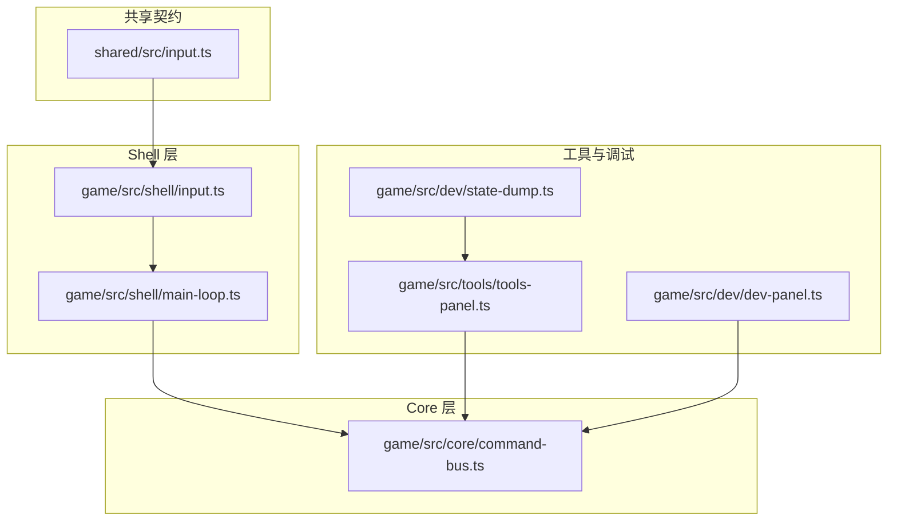
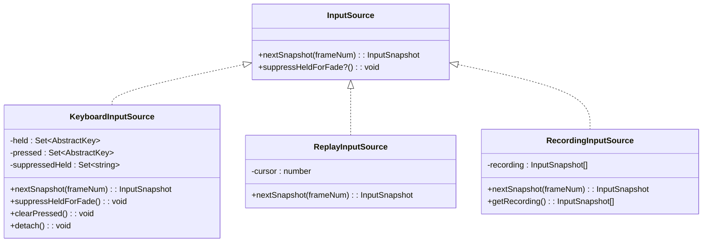
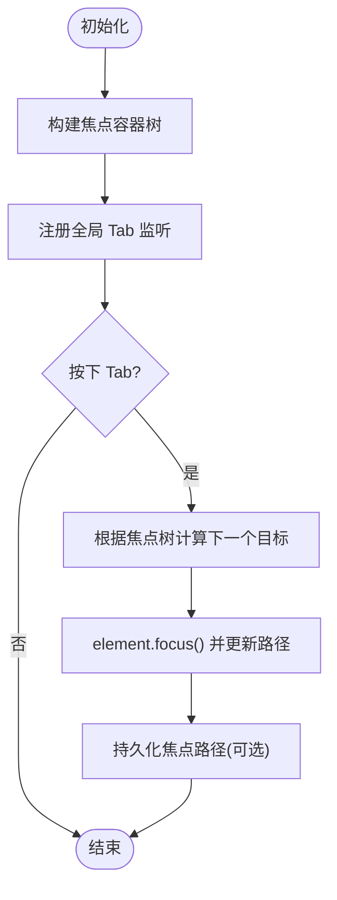
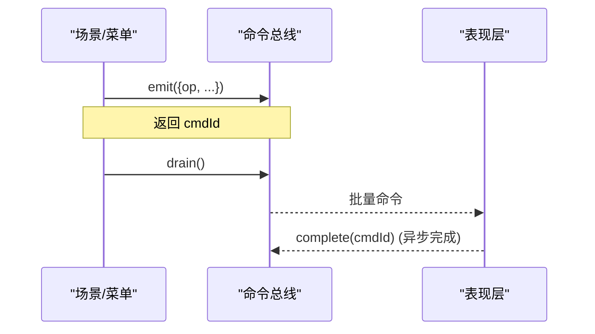
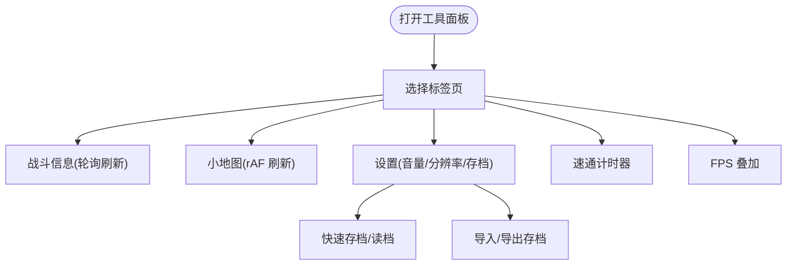
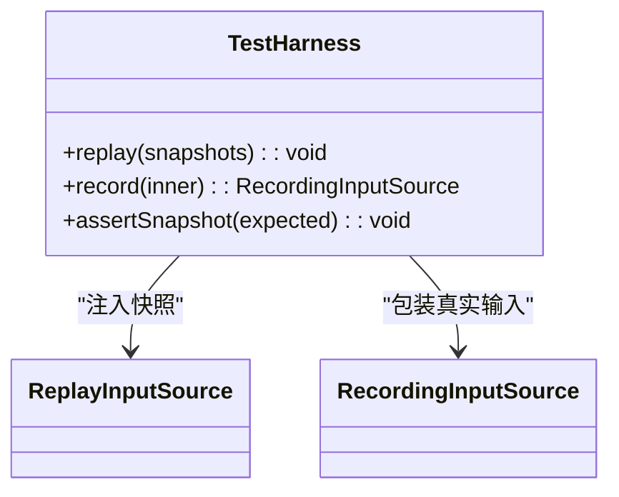
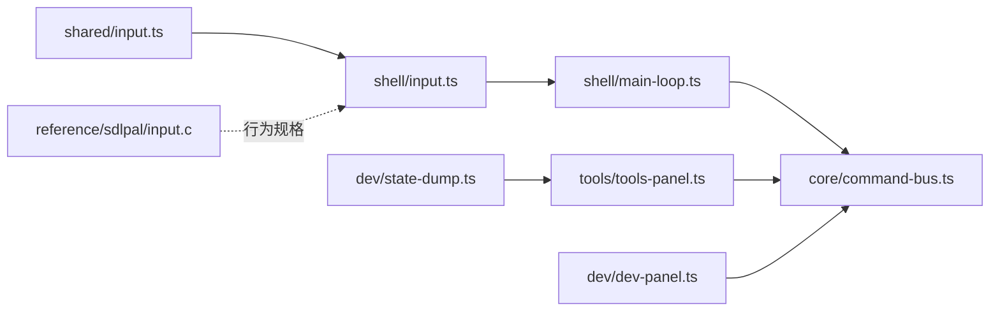

# UI 交互系统

<cite>
**本文引用的文件**
- [packages/shared/src/input.ts](file://packages/shared/src/input.ts)
- [packages/game/src/shell/input.ts](file://packages/game/src/shell/input.ts)
- [packages/game/src/shell/main-loop.ts](file://packages/game/src/shell/main-loop.ts)
- [packages/game/src/core/command-bus.ts](file://packages/game/src/core/command-bus.ts)
- [packages/game/src/tools/tools-panel.ts](file://packages/game/src/tools/tools-panel.ts)
- [packages/game/src/dev/dev-panel.ts](file://packages/game/src/dev/dev-panel.ts)
- [packages/game/src/dev/state-dump.ts](file://packages/game/src/dev/state-dump.ts)
- [reference/sdlpal/input.c](file://reference/sdlpal/input.c)
</cite>

## 目录
1. [简介](#简介)
2. [项目结构](#项目结构)
3. [核心组件](#核心组件)
4. [架构总览](#架构总览)
5. [详细组件分析](#详细组件分析)
6. [依赖关系分析](#依赖关系分析)
7. [性能与延迟优化](#性能与延迟优化)
8. [故障排查指南](#故障排查指南)
9. [结论](#结论)
10. [附录](#附录)

## 简介
本技术文档聚焦于 UI 交互系统的输入抽象层、焦点管理、命令分发机制与调试面板系统，并结合参考实现 sdlpal 的行为规范进行对齐说明。内容覆盖键盘事件映射、鼠标/触摸坐标转换与手势识别、焦点容器嵌套与 Tab 导航、焦点持久化、事件冒泡与命令总线、异步处理、实时状态编辑、快速存档读档、性能分析工具、输入延迟优化、防抖节流策略、无障碍访问支持，以及自定义输入设备集成方法与测试框架使用指南。

## 项目结构
UI 交互系统主要分布在以下模块：
- 共享类型契约：定义抽象按键、输入快照与输入源接口
- Shell 层：物理键到抽象键的映射、键盘事件采集、主循环中的输入采样与渐变清键边界
- Core 层：命令总线用于跨子系统渲染指令的有序分发
- Tools/Dev 层：生产增强工具面板与开发调试面板、状态导出等



图表来源
- [packages/shared/src/input.ts:1-54](file://packages/shared/src/input.ts#L1-L54)
- [packages/game/src/shell/input.ts:1-165](file://packages/game/src/shell/input.ts#L1-L165)
- [packages/game/src/shell/main-loop.ts:77-90](file://packages/game/src/shell/main-loop.ts#L77-L90)
- [packages/game/src/core/command-bus.ts:58-88](file://packages/game/src/core/command-bus.ts#L58-L88)
- [packages/game/src/tools/tools-panel.ts:1-21](file://packages/game/src/tools/tools-panel.ts#L1-L21)
- [packages/game/src/dev/dev-panel.ts:1-17](file://packages/game/src/dev/dev-panel.ts#L1-L17)
- [packages/game/src/dev/state-dump.ts:68-106](file://packages/game/src/dev/state-dump.ts#L68-L106)

章节来源
- [packages/shared/src/input.ts:1-54](file://packages/shared/src/input.ts#L1-L54)
- [packages/game/src/shell/input.ts:1-165](file://packages/game/src/shell/input.ts#L1-L165)
- [packages/game/src/shell/main-loop.ts:77-90](file://packages/game/src/shell/main-loop.ts#L77-L90)
- [packages/game/src/core/command-bus.ts:58-88](file://packages/game/src/core/command-bus.ts#L58-L88)
- [packages/game/src/tools/tools-panel.ts:1-21](file://packages/game/src/tools/tools-panel.ts#L1-L21)
- [packages/game/src/dev/dev-panel.ts:1-17](file://packages/game/src/dev/dev-panel.ts#L1-L17)
- [packages/game/src/dev/state-dump.ts:68-106](file://packages/game/src/dev/state-dump.ts#L68-L106)

## 核心组件
- 输入抽象层
  - 抽象按键类型与输入快照：将浏览器物理键统一为游戏语义键，按帧提供“按住”和“新按下”集合，屏蔽平台差异并支持录制回放。
  - 键盘输入源：维护 held/pressed 集合，过滤 repeat 事件以还原“后按优先”的优先级语义；在场景渐变特定阶段抑制方向键，避免吞键或误触发。
  - 回放/录制输入源：基于历史快照序列驱动确定性重放与录制。
- 命令分发机制
  - 命令总线：提供 emit/drain/complete 接口，保证命令顺序与唯一 ID，便于后续扩展异步完成回调。
- 调试与工具面板
  - 工具面板：非模态悬浮面板，提供战斗只读信息、小地图、设置（音量/分辨率/存档导入导出）、速通计时器、FPS 叠加等。
  - 开发面板：仅开发环境启用，快捷键触发调试入口与状态导出。
  - 状态导出：NDJSON 逐帧导出，便于离线分析与回归比对。

章节来源
- [packages/shared/src/input.ts:1-54](file://packages/shared/src/input.ts#L1-L54)
- [packages/game/src/shell/input.ts:1-165](file://packages/game/src/shell/input.ts#L1-L165)
- [packages/game/src/core/command-bus.ts:58-88](file://packages/game/src/core/command-bus.ts#L58-L88)
- [packages/game/src/tools/tools-panel.ts:1-21](file://packages/game/src/tools/tools-panel.ts#L1-L21)
- [packages/game/src/dev/dev-panel.ts:1-17](file://packages/game/src/dev/dev-panel.ts#L1-L17)
- [packages/game/src/dev/state-dump.ts:68-106](file://packages/game/src/dev/state-dump.ts#L68-L106)

## 架构总览
下图展示了从物理输入到命令分发的端到端流程，以及与参考实现的对应点。

```mermaid
sequenceDiagram
participant User as "用户"
participant Browser as "浏览器事件"
participant Kbd as "KeyboardInputSource"
participant Loop as "主循环(main-loop)"
participant Scene as "场景/菜单逻辑"
participant Bus as "命令总线"
participant Present as "表现层"
User->>Browser : 键盘/鼠标/触摸事件
Browser->>Kbd : keydown/keyup / pointer/touch
Kbd-->>Loop : nextSnapshot(frameNum)
Loop->>Scene : 消费 pressed/held 更新状态
Scene->>Bus : emit(PresentCommand)
Loop->>Bus : drain()
Bus-->>Present : 渲染指令队列
Note over Kbd,Loop : 场景渐变特定阶段调用 suppressHeldForFade()
```

图表来源
- [packages/game/src/shell/input.ts:67-135](file://packages/game/src/shell/input.ts#L67-L135)
- [packages/game/src/shell/main-loop.ts:77-90](file://packages/game/src/shell/main-loop.ts#L77-L90)
- [packages/game/src/core/command-bus.ts:58-88](file://packages/game/src/core/command-bus.ts#L58-L88)

## 详细组件分析

### 输入抽象层：键盘事件映射、鼠标坐标转换、触摸手势识别
- 键盘事件映射
  - 通过 CODE_MAP 将浏览器 code 映射到 AbstractKey，严格遵循 sdlpal 原版键位约定（WASD 原义而非方向键）。
  - 维护 held/pressed 集合，过滤 e.repeat 以保持“后按优先”的优先级语义。
  - 提供 clearPressed 等价 PAL_ClearKeyState，用于 modal 边界清理未消费的新按下键。
  - 在 scene-fade 特定阶段调用 suppressHeldForFade，抑制方向键进入 snapshot.held，并在物理松开时解除抑制。
- 鼠标坐标转换
  - 当前仓库未包含鼠标坐标转换的具体实现；如需接入，应在 Shell 层新增 PointerInputSource 实现 InputSource，将屏幕坐标转换为游戏逻辑坐标，并按帧产出 InputSnapshot（可复用 pressed/held 语义表达点击/拖拽）。
- 触摸手势识别
  - 参考 sdlpal 的触摸区域划分与动作映射逻辑，可在 TouchInputSource 中实现手指落点区域判定、多指跟踪与动作合成，再输出到 InputSnapshot。



图表来源
- [packages/shared/src/input.ts:25-54](file://packages/shared/src/input.ts#L25-L54)
- [packages/game/src/shell/input.ts:67-165](file://packages/game/src/shell/input.ts#L67-L165)

章节来源
- [packages/shared/src/input.ts:1-54](file://packages/shared/src/input.ts#L1-L54)
- [packages/game/src/shell/input.ts:1-165](file://packages/game/src/shell/input.ts#L1-L165)
- [reference/sdlpal/input.c:1187-1207](file://reference/sdlpal/input.c#L1187-L1207)

### 焦点管理系统：焦点容器嵌套、Tab 键导航、焦点持久化
- 现状
  - 工具面板通过 DOM 事件监听与 stopPropagation 控制冒泡，确保面板内输入不泄漏到游戏窗口，同时放行 Backquote 以允许关闭面板。
  - 尚未发现显式的焦点容器树管理与 Tab 导航实现。
- 建议方案
  - 引入 FocusManager，维护焦点容器栈（容器→子容器→控件），提供 focusIn/focusOut/focusNext/focusPrev 等方法。
  - 在根容器注册全局 keydown，拦截 Tab/Shift+Tab，依据焦点树计算下一个可聚焦元素并调用 element.focus()。
  - 焦点持久化：在进入/离开场景或菜单时，记录最近焦点路径（如 data-focus-path），恢复时按路径查找并恢复焦点。
  - 无障碍：为关键控件添加 aria-* 属性（aria-label、aria-expanded、aria-current 等），确保屏幕阅读器可用。



[本节为概念性设计，无需源码引用]

### 命令分发机制：事件冒泡、命令总线、异步处理
- 事件冒泡
  - 工具面板对 keydown 使用 stopPropagation 阻止冒泡至游戏 window，但放行 Backquote 以便切换开关。
- 命令总线
  - 提供 emit/drain/complete 接口，emit 返回唯一 cmdId，drain 清空队列并返回本次批次命令，complete 预留异步完成回调。
- 异步处理
  - 当前 complete 为空操作，未来可将资源加载、动画播放等异步任务与 cmdId 关联，完成后回调以推进表现层状态。



图表来源
- [packages/game/src/core/command-bus.ts:58-88](file://packages/game/src/core/command-bus.ts#L58-L88)
- [packages/game/src/tools/tools-panel.ts:901-927](file://packages/game/src/tools/tools-panel.ts#L901-L927)

章节来源
- [packages/game/src/core/command-bus.ts:58-88](file://packages/game/src/core/command-bus.ts#L58-L88)
- [packages/game/src/tools/tools-panel.ts:901-927](file://packages/game/src/tools/tools-panel.ts#L901-L927)

### 调试面板系统：实时状态编辑、快速存档读档、性能分析工具
- 工具面板
  - 非模态悬浮，左上角常驻，提供战斗只读信息、小地图、系统设置（快存快读、音量、分辨率、存档导入导出）、速通计时器、FPS 叠加等。
  - 通过 setInterval 轮询战斗签名变化，仅在战斗 tab 活跃时刷新，降低开销。
- 开发面板
  - 仅开发环境挂载，快捷键触发调试入口与 GameState 深拷贝 dump。
- 状态导出
  - URL 参数开启 NDJSON 导出，暴露下载函数，便于离线分析。



图表来源
- [packages/game/src/tools/tools-panel.ts:1-21](file://packages/game/src/tools/tools-panel.ts#L1-L21)
- [packages/game/src/tools/tools-panel.ts:901-927](file://packages/game/src/tools/tools-panel.ts#L901-L927)
- [packages/game/src/dev/dev-panel.ts:1-17](file://packages/game/src/dev/dev-panel.ts#L1-L17)
- [packages/game/src/dev/state-dump.ts:68-106](file://packages/game/src/dev/state-dump.ts#L68-L106)

章节来源
- [packages/game/src/tools/tools-panel.ts:1-21](file://packages/game/src/tools/tools-panel.ts#L1-L21)
- [packages/game/src/tools/tools-panel.ts:901-927](file://packages/game/src/tools/tools-panel.ts#L901-L927)
- [packages/game/src/dev/dev-panel.ts:1-17](file://packages/game/src/dev/dev-panel.ts#L1-L17)
- [packages/game/src/dev/state-dump.ts:68-106](file://packages/game/src/dev/state-dump.ts#L68-L106)

### 输入延迟优化、防抖节流策略、无障碍访问支持
- 输入延迟优化
  - 主循环在 scene-fade 特定阶段调用 suppressHeldForFade，避免吞键与误触发；clearPressed 在 modal 边界清理未消费键，减少残留影响。
  - 输入采样与逻辑 tick 解耦，避免渲染抖动影响输入响应。
- 防抖节流
  - 工具面板对战斗状态采用固定间隔轮询（约 250ms）而非每帧刷新，降低重绘压力。
  - 建议在高频 UI 更新处（如搜索框、列表滚动）增加节流/防抖策略。
- 无障碍访问
  - 为交互控件补充 aria-* 属性，确保键盘可达性与屏幕阅读器可读性。
  - 焦点管理需遵循可见焦点指示与顺序一致性。

章节来源
- [packages/game/src/shell/main-loop.ts:77-90](file://packages/game/src/shell/main-loop.ts#L77-L90)
- [packages/game/src/shell/input.ts:120-135](file://packages/game/src/shell/input.ts#L120-L135)
- [packages/game/src/tools/tools-panel.ts:901-927](file://packages/game/src/tools/tools-panel.ts#L901-L927)

### 自定义输入设备的集成方法与测试框架使用指南
- 自定义输入设备
  - 实现 InputSource 接口，按需产出 InputSnapshot（例如手柄、触屏、外部 HID 设备）。
  - 若需要与 fade 行为一致，可选择性实现 suppressHeldForFade。
- 测试框架
  - 使用 ReplayInputSource 注入历史快照，配合主循环进行确定性回放测试。
  - 使用 RecordingInputSource 包裹真实输入源，录制输入序列供后续回归验证。
  - 结合 vitest 编写单测，断言 pressed/held 集合与 frameNum 的一致性。



图表来源
- [packages/game/src/shell/input.ts:137-165](file://packages/game/src/shell/input.ts#L137-L165)

章节来源
- [packages/game/src/shell/input.ts:137-165](file://packages/game/src/shell/input.ts#L137-L165)

## 依赖关系分析
- 耦合与内聚
  - Shell 输入层与 Core 命令总线松耦合：输入层仅产出快照，Core 负责命令编排。
  - 工具面板与命令总线通过 emit/drain 协作，保持 UI 与逻辑分离。
- 外部依赖
  - 参考 sdlpal input.c 的键位与清键语义作为真值锚点，确保移植保真。



图表来源
- [packages/shared/src/input.ts:1-54](file://packages/shared/src/input.ts#L1-L54)
- [packages/game/src/shell/input.ts:1-165](file://packages/game/src/shell/input.ts#L1-L165)
- [packages/game/src/shell/main-loop.ts:77-90](file://packages/game/src/shell/main-loop.ts#L77-L90)
- [packages/game/src/core/command-bus.ts:58-88](file://packages/game/src/core/command-bus.ts#L58-L88)
- [packages/game/src/tools/tools-panel.ts:1-21](file://packages/game/src/tools/tools-panel.ts#L1-L21)
- [packages/game/src/dev/dev-panel.ts:1-17](file://packages/game/src/dev/dev-panel.ts#L1-L17)
- [packages/game/src/dev/state-dump.ts:68-106](file://packages/game/src/dev/state-dump.ts#L68-L106)
- [reference/sdlpal/input.c:1187-1207](file://reference/sdlpal/input.c#L1187-L1207)

章节来源
- [packages/shared/src/input.ts:1-54](file://packages/shared/src/input.ts#L1-L54)
- [packages/game/src/shell/input.ts:1-165](file://packages/game/src/shell/input.ts#L1-L165)
- [packages/game/src/shell/main-loop.ts:77-90](file://packages/game/src/shell/main-loop.ts#L77-L90)
- [packages/game/src/core/command-bus.ts:58-88](file://packages/game/src/core/command-bus.ts#L58-L88)
- [packages/game/src/tools/tools-panel.ts:1-21](file://packages/game/src/tools/tools-panel.ts#L1-L21)
- [packages/game/src/dev/dev-panel.ts:1-17](file://packages/game/src/dev/dev-panel.ts#L1-L17)
- [packages/game/src/dev/state-dump.ts:68-106](file://packages/game/src/dev/state-dump.ts#L68-L106)
- [reference/sdlpal/input.c:1187-1207](file://reference/sdlpal/input.c#L1187-L1207)

## 性能与延迟优化
- 输入采样与逻辑 tick 解耦，避免渲染抖动影响输入响应。
- 在场景渐变特定阶段抑制方向键，防止吞键导致的额外重试与卡顿。
- 工具面板对战斗状态采用固定间隔轮询，减少频繁重绘。
- 建议在高频率 UI 更新处加入节流/防抖，避免不必要的重排与重绘。

[本节为通用指导，无需源码引用]

## 故障排查指南
- 战后 fadeout 卡键
  - 现象：战后渐变期间按键被吞或需松开重按。
  - 原因：旧条件将全部渐变视为清键，导致方向键被抑制。
  - 修复：仅在 scene-fade 特定阶段调用 suppressHeldForFade，其余渐变不清键。
- 面板内输入漏给游戏
  - 现象：面板内打字被当作游戏输入。
  - 原因：冒泡未被阻止。
  - 修复：在面板 root 上 keydown 使用 stopPropagation，但放行 Backquote。
- 未知键映射
  - 现象：某些键无效。
  - 原因：CODE_MAP 未覆盖。
  - 修复：对照 sdlpal input.c 补全映射。

章节来源
- [packages/game/src/shell/main-loop.ts:77-90](file://packages/game/src/shell/main-loop.ts#L77-L90)
- [packages/game/src/tools/tools-panel.ts:901-927](file://packages/game/src/tools/tools-panel.ts#L901-L927)
- [packages/game/src/shell/input.ts:17-65](file://packages/game/src/shell/input.ts#L17-L65)
- [reference/sdlpal/input.c:1187-1207](file://reference/sdlpal/input.c#L1187-L1207)

## 结论
本系统通过输入抽象层屏蔽平台差异，结合主循环与命令总线实现稳定、可测试的 UI 交互管线。工具与调试面板提供了丰富的运行时诊断能力。后续应完善焦点管理与无障碍支持，扩展鼠标/触摸输入源，并持续对标 sdlpal 行为以确保保真度。

[本节为总结，无需源码引用]

## 附录
- 术语
  - AbstractKey：抽象按键类型，与 sdlpal kKey* 一一对应。
  - InputSnapshot：一帧输入快照，包含 held/pressed/frameNum。
  - CommandBus：命令总线，提供 emit/drain/complete。
- 参考
  - sdlpal input.c：键位映射、清键与触摸区域判定等行为规格。

[本节为补充说明，无需源码引用]